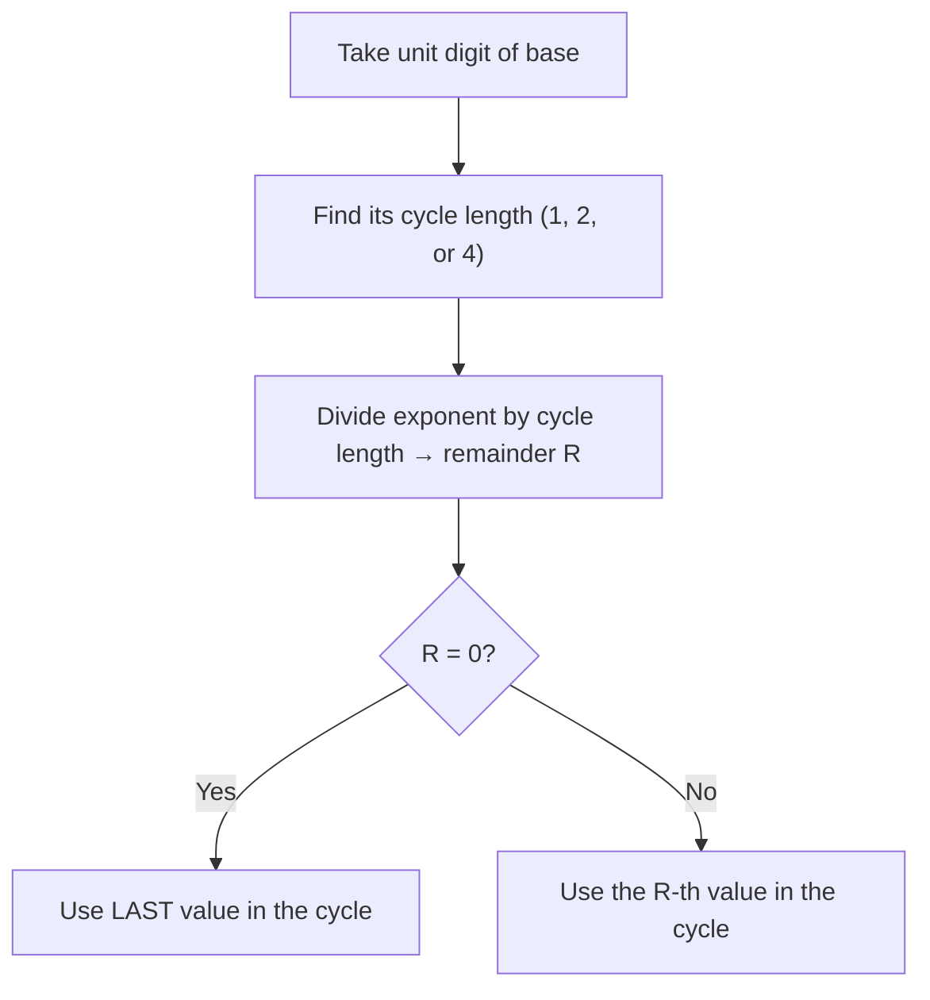
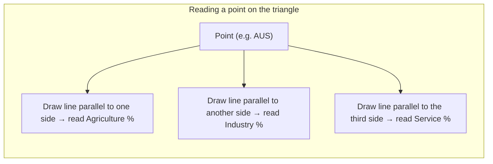
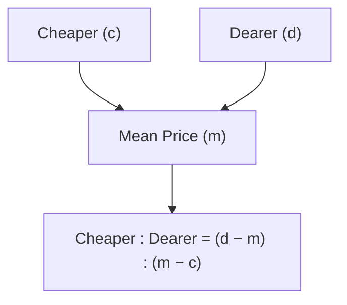
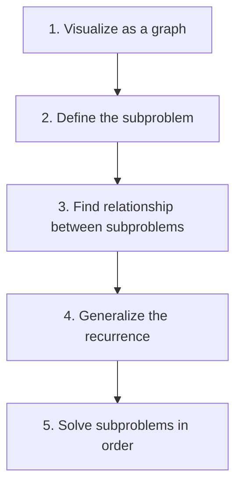

# Aptitude Revision Notes

> Placement aptitude notes, organized topic-wise. Keep appending new topics below in the same format.

---

## Table of Contents
- [1. HCF and LCM — Basics](#1-hcf-and-lcm--basics)
- [2. HCF and LCM of Fractions](#2-hcf-and-lcm-of-fractions)
- [3. LCM — Word Problems](#3-lcm--word-problems)
- [4. Divisibility Rules](#4-divisibility-rules)
- [5. Unit Digit & Power Cycles](#5-unit-digit--power-cycles)
- [6. Triangular (Ternary) Graphs — Data Interpretation](#6-triangular-ternary-graphs--data-interpretation)
- [7. Profit and Loss](#7-profit-and-loss)
- [8. Subject-Verb Agreement (SVA)](#8-subject-verb-agreement-sva)
- [9. Data Sufficiency](#9-data-sufficiency)
- [10. Simple Interest & Compound Interest](#10-simple-interest--compound-interest)
- [11. Alligation (Mixtures)](#11-alligation-mixtures)
- [12. Simplification — VBODMAS, Surds & Series](#12-simplification--vbodmas-surds--series)
- [13. Vocabulary](#13-vocabulary)
- [14. Time and Work](#14-time-and-work)
- [15. Fractions & Decimals — Recurring Decimals](#15-fractions--decimals--recurring-decimals)
- [16. Mensuration — 2D & 3D Shapes](#16-mensuration--2d--3d-shapes)
- [17. Dynamic Programming — Problem-Solving Approach](#17-dynamic-programming--problem-solving-approach)
- [18. Percentages](#18-percentages)
- [19. Quick Reference — Squares (1–30)](#19-quick-reference--squares-130)
- [20. Ratio & Proportion](#20-ratio--proportion)
- [21. Speed, Distance & Time](#21-speed-distance--time)
- [22. Averages](#22-averages)
- [23. Arithmetic Progression (AP)](#23-arithmetic-progression-ap)
- [24. Geometric Progression (GP)](#24-geometric-progression-gp)
- [25. Statistics](#25-statistics)
- [26. Data Interpretation — Pie Chart & Line Graph](#26-data-interpretation--pie-chart--line-graph)
- [27. Probability](#27-probability)
- [28. Calendar](#28-calendar)
- [29. Partnership](#29-partnership)
- [Appendix: Exam Pattern Reference](#appendix-exam-pattern-reference)

---

## 1. HCF and LCM — Basics

**HCF (Highest Common Factor / GCD):** largest number that divides all given numbers exactly.
**LCM (Lowest Common Multiple):** smallest number that is divisible by all given numbers exactly.

**Key relation (for two numbers a, b):**
$$HCF(a,b) \times LCM(a,b) = a \times b$$
(This does **not** hold directly for 3 or more numbers.)

### Ladder / Division Method
Divide the numbers by a common prime factor, repeat until no common factor remains (for HCF) or until all quotients become 1 (for LCM).

- **HCF** = product of the **common** divisors used on the left.
- **LCM** = product of **all** divisors used on the left (common + the ones used for individual numbers).

#### Example — Find HCF of 42, 54, 36

```
2 | 42   54   36
3 | 21   27   18
  |  7    9    6   → no common factor left
```

$$HCF = 2 \times 3 = 6$$

#### Example — Find LCM of 250, 100, 125

```
5 | 250  100  125
5 |  50   20   25
2 |  10    4    5
2 |   5    2    5
5 |   5    1    5
  |   1    1    1
```

$$LCM = 5 \times 5 \times 2 \times 2 \times 5 = 500$$

> **Tip:** In the LCM ladder, if a prime doesn't divide a number, just carry that number straight down unchanged to the next row.

---

## 2. HCF and LCM of Fractions

$$LCM \text{ of fractions} = \frac{LCM \text{ of numerators}}{HCF \text{ of denominators}}$$

$$HCF \text{ of fractions} = \frac{HCF \text{ of numerators}}{LCM \text{ of denominators}}$$

| Quantity | Numerators use | Denominators use |
|---|---|---|
| LCM of fractions | LCM | HCF |
| HCF of fractions | HCF | LCM |

### Example 1 — Find LCM of 36/225, 48/150, 72/65

- LCM of numerators (36, 48, 72):
  $36 = 2^2 \times 3^2$, $48 = 2^4 \times 3$, $72 = 2^3 \times 3^2$
  → $LCM = 2^4 \times 3^2 = 144$
- HCF of denominators (225, 150, 65):
  $225 = 3^2 \times 5^2$, $150 = 2 \times 3 \times 5^2$, $65 = 5 \times 13$
  → $HCF = 5$

$$LCM \text{ of fractions} = \frac{144}{5}$$

### Example 2 — Find HCF of 36/75, 48/150, 72/135

- HCF of numerators (36, 48, 72):
  → $HCF = 2^2 \times 3 = 12$
- LCM of denominators (75, 150, 135):
  $75 = 3 \times 5^2$, $150 = 2 \times 3 \times 5^2$, $135 = 3^3 \times 5$
  → $LCM = 2 \times 3^3 \times 5^2 = 1350$

$$HCF \text{ of fractions} = \frac{12}{1350} = \frac{2}{225} \; \text{(simplified)}$$

---

## 3. LCM — Word Problems

**Typical pattern:** "How many numbers between A and B are divisible by x, y, z?"
→ Find $LCM(x, y, z)$, then count its multiples lying strictly/inclusively between A and B.

### Example — How many numbers between 200 and 400 are divisible by 3, 5 and 6?

$$LCM(3, 5, 6) = 30$$

Multiples of 30 between 200 and 400:
210, 240, 270, 300, 330, 360, 390

$$\text{Count} = 7$$

### Pattern — Smallest number that leaves the same remainder $r$ with each divisor

$$\text{Required number} = LCM(\text{divisors}) + r$$

#### Example — Find the smallest number which, when divided by 4, 9, 12, 16, always leaves remainder 3.

$4 = 2^2$, $9 = 3^2$, $12 = 2^2 \times 3$, $16 = 2^4$

$$LCM(4, 9, 12, 16) = 2^4 \times 3^2 = 144$$

$$\text{Required number} = 144 + 3 = 147$$

---

## 4. Divisibility Rules

| Divisor | Rule | Example |
|---|---|---|
| 2 | Last digit is even (0, 2, 4, 6, 8) | 3462 → even ✔ |
| 3 | Sum of digits divisible by 3 | present in 126 → 1+2+6=9 ✔ |
| 4 | Last 2 digits divisible by 4 | 3416 → 16 ✔ |
| 5 | Last digit is 0 or 5 | 445 ✔ |
| 6 | Divisible by both 2 and 3 | 132 ✔ |
| 8 | Last 3 digits divisible by 8 | 1256 → 256 ✔ |
| 9 | **Sum of digits is a multiple of 9** | 4536 → 4+5+3+6=18 ✔ |
| 10 | Last digit is 0 | 620 ✔ |
| 11 | (Sum of digits at odd places) − (Sum of digits at even places) is 0 or a multiple of 11 | 2728 → (2+2)−(7+8)=−11 ✔ |

**Rule for 11 — worked example:** 565213 → digits at odd positions (from left): 5, 5, 1 → sum = 11. Digits at even positions: 6, 2, 3 → sum = 11. Difference = 11 − 11 = 0 → divisible by 11.

### Divisibility by 7 (special method)
1. Take the last digit of the number, double it.
2. Subtract that from the remaining number (number formed by the rest of the digits).
3. If the result is divisible by 7 (0 counts), the original number is divisible by 7. Repeat if the number is still large.

**Example — Check if 245 is divisible by 7:**
Last digit = 5 → double = 10. Remaining number = 24.
$$24 - 10 = 14 \;(= 7 \times 2)\; \Rightarrow \text{divisible by 7}$$

### Divisibility by a composite number (coprime factor method)
To check divisibility by a composite number, split it into **coprime factors** (factors with HCF 1) and check divisibility by each separately.

**Example — If 3664XX is divisible by 36, find $x^2$** (both missing digits are the same digit $x$)

$36 = 9 \times 4$ (9 and 4 are coprime), so 3664XX must be divisible by **both 9 and 4**.

- **Div by 9:** sum of digits must be a multiple of 9:
  $$3+6+6+4+x+x = 19 + 2x = 27 \;\Rightarrow\; x = 4$$
- **Div by 4:** last two digits "$xx$" = 44, and $44 \div 4 = 11$ ✔ (confirms $x=4$)

$$x^2 = 16$$

---

## 5. Unit Digit & Power Cycles

The unit digit of $a^n$ repeats in a cycle. Find the cycle length for the unit digit of the base, then use the exponent's remainder (on dividing by cycle length) to pick the right value.

### Unit digit cycle length by digit

| Unit digit of base | Cycle | Length |
|---|---|---|
| 0, 1, 5, 6 | always same digit | 1 |
| 4, 9 | 2 values, repeats | 2 |
| 2, 3, 7, 8 | 4 values, repeats | 4 |

### Power cycle of 8 (cycle length 4)

| Power | Value | Unit digit |
|---|---|---|
| $8^1$ | 8 | 8 |
| $8^2$ | 64 | 4 |
| $8^3$ | 512 | 2 |
| $8^4$ | 4096 | 6 |
| $8^5$ | ... | 8 (repeats) |

### Method
1. Take the unit digit of the base.
2. Divide the exponent by the cycle length → get remainder $R$.
3. Match $R$ to the position in the cycle. **If $R = 0$, use the last value in the cycle.**



### Example — Find the unit digit of $48^{81}$

- Unit digit of base 48 → **8**, cycle (length 4): 8, 4, 2, 6
- $81 \div 4$ → Quotient 20, Remainder **1**

| Remainder R | Unit digit |
|---|---|
| 1 | **8** |
| 2 | 4 |
| 3 | 2 |
| 0 | 6 |

$$\text{Unit digit of } 48^{81} = 8$$

### Example — Find the unit digit of $27^{76}$

- Unit digit of base 27 → **7**, cycle (length 4): 7, 9, 3, 1
- $76 \div 4$ → Quotient 19, Remainder **0** → use the **last** value in the cycle

$$\text{Unit digit of } 27^{76} = 1$$

---

## 6. Triangular (Ternary) Graphs — Data Interpretation

Used when **three quantities always add up to 100%** (e.g., percentage of a country's economy from Agriculture, Industry, and Service sectors).

- The triangle has **3 sides**, each scaled 0 to 100, one for each variable.
- Each side's scale runs in the **opposite direction** to the axis it corresponds to — read the value by following the gridline **parallel to the side** starting from the point, till it meets that variable's scale.
- Any point inside the triangle satisfies:

$$\text{Agriculture \%} + \text{Industry \%} + \text{Service \%} = 100$$



### Example
Point marking Australia (AUS) on the triangle graph:

| Sector | % |
|---|---|
| Agriculture | 10 |
| Industry | 40 |
| Service | 50 |
| **Total** | **100** |

> **Check:** always verify the three readings add up to 100 — that confirms you've read the graph correctly.

---

## 7. Profit and Loss

**Basic terms:** CP = Cost Price, SP = Selling Price, MP = Marked Price.

| Quantity | Formula |
|---|---|
| Profit | $SP - CP$ |
| Loss | $CP - SP$ |
| Discount | $MP - SP$ |
| Profit % | $\dfrac{Profit}{CP} \times 100$ |
| Loss % | $\dfrac{Loss}{CP} \times 100$ |

$$SP = \frac{(100 + Profit\%)}{100} \times CP$$

### Successive Discounts
If discounts $d_1\%, d_2\%, d_3\%$ are applied one after another on the marked price:

$$SP = MP \times \left(\frac{100-d_1}{100}\right) \times \left(\frac{100-d_2}{100}\right) \times \left(\frac{100-d_3}{100}\right)$$

### Same Selling Price, Profit% = Loss% (in magnitude)
If two items are sold at the **same SP**, one at $x\%$ profit and the other at $x\%$ loss, the overall result is **always a loss**:

$$\text{Overall Loss \%} = \frac{x^2}{100}$$

### Worked Examples

#### Example — Rambabu sells paper planes at the rate of 20 planes for ₹1. If he gets a profit of 20%, how many planes did he buy in ₹1 (at cost price)?

SP of 20 planes = ₹1. Since $SP = \frac{100+Profit\%}{100}\times CP$:
$$CP \text{ (of 20 planes)} = 1 \times \frac{100}{120} = \frac{100}{120}\,\text{₹}$$

Let $x$ = number of planes bought in ₹1 at CP. Using unitary method:
$$20 \text{ planes} \to \frac{100}{120}\,\text{₹}, \qquad x \text{ planes} \to 1\,\text{₹}$$
$$x = 20 \times \frac{120}{100} = 24 \text{ planes}$$

#### Example — A cheater manipulates his weighing machine so it shows 1 kg for 970 grams. Find his profit %.

He effectively gives only 970 g while charging for 1000 g — gain = 30 g per 970 g given.
$$\text{Profit \%} = \frac{30}{970}\times100 = 3\frac{9}{97}\%$$

#### Example — Chaman sells 40 fans at 10% profit. He wants a total of 20% profit on the entire lot. He bought 160 fans at ₹100 each. At what profit % must he sell the remaining fans?

$$\text{Total CP} = 160\times100 = 16000, \qquad \text{Total desired profit} = 20\% \times 16000 = 3200$$
$$\text{Profit from 40 fans (at 10\%)} = 10\%\times(40\times100) = 400$$
$$\text{Profit still needed from remaining 120 fans} = 3200-400 = 2800$$

Let $A\%$ = required profit on the remaining 120 fans (CP $=120\times100=12000$):
$$A\% \times 12000 = 2800 \;\Rightarrow\; A = \frac{2800}{120} = 23.33\%$$

---

## 8. Subject-Verb Agreement (SVA)

**Basic rule:** If the subject is plural, the verb will **not** take an 's' — and vice versa (singular subject → verb takes 's').

### Exceptions (verb stays singular)

| Case | Rule |
|---|---|
| Collective nouns (team, family, committee, etc.) | Always treated as singular |
| Either...or / Neither...nor | Verb agrees with the noun **closer to it** (i.e. the one right after "or"/"nor") |
| Any, Some, Every, No, Each | Always singular |
| Money, Time, Quantity/Distance (as a single unit) | Always singular |

**Example:** "Neither the manager nor the employees *were* present." → verb agrees with "employees" (closer noun).

---

## 9. Data Sufficiency

**Approach:**
1. First check each statement **individually**.
2. Only combine the two statements if **neither is sufficient alone**.

### Example
Given: $A + B + C = 50\,kg$. Which is the heaviest?
- **Statement 1:** $A = 25\,kg$
- **Statement 2:** $B = 30\,kg$

| Check | Reasoning | Sufficient? |
|---|---|---|
| Statement 1 alone | $A=25 \Rightarrow B+C=25$, so both $B, C \le 25 \le A$ → A is the heaviest | ✔ Sufficient |
| Statement 2 alone | $B=30 \Rightarrow A+C=20$, so both $A, C < 30 = B$ → B is the heaviest | ✔ Sufficient |

**Answer: Either statement alone is sufficient ("1 or 2 alone").**

---

## 10. Simple Interest & Compound Interest

**Simple Interest (SI):** interest calculated only on the original principal.

$$SI = \frac{P \times T \times R}{100}$$

$$Amount (A) = P + SI = P\left(1 + \frac{RT}{100}\right)$$

where $P$ = Principal, $R$ = rate of interest per annum (%), $T$ = time in years.

**Compound Interest (CI):** interest calculated on principal + accumulated interest, so it compounds each period.

$$Amount (A) = P\left(1 + \frac{R}{100n}\right)^{nT}$$

$$CI = \text{Total Amount} - \text{Principal}$$

where $n$ = number of times interest is compounded per year (e.g. $n=1$ yearly, $n=2$ half-yearly, $n=4$ quarterly, $n=12$ monthly), $T$ = time in years.

| Compounding | n |
|---|---|
| Annually | 1 |
| Half-yearly | 2 |
| Quarterly | 4 |
| Monthly | 12 |

---

## 11. Alligation (Mixtures)

Used to find the ratio in which two ingredients at different prices (or concentrations) must be mixed to get a mixture at a given mean price.

- $c$ = CP of unit quantity of the **cheaper** item
- $d$ = CP of unit quantity of the **dearer** item
- $m$ = mean price of the mixture

$$\text{Cheaper Quantity} : \text{Dearer Quantity} = (d - m) : (m - c)$$



> **Rule of thumb:** cross-subtract diagonally (dearer − mean, mean − cheaper) to get the ratio.

### Worked Examples

#### Example — Price of wheat = ₹60, price of rice = ₹80, mixture price = ₹75. In what ratio are they mixed?

$$\text{Wheat} : \text{Rice} = (80-75):(75-60) = 5:15 = 1:3$$

#### Example — A mixture of sandalwood oil and 240 L of water is priced at ₹275/L. Sandalwood oil is priced ₹325/L. How much oil is in the mixture?

Water (cheaper) costs ₹0/L, oil (dearer) costs ₹325/L, mean price = ₹275/L.

$$\text{Water} : \text{Oil} = (325-275):(275-0) = 50:275 = 2:11$$

Given water = 240 L corresponds to the "2" part of the ratio:
$$\frac{2}{11} = \frac{240}{O} \;\Rightarrow\; O = \frac{240\times11}{2} = 1320 \text{ L}$$

### Removal and Replacement (Repeated Dilution)

If a container holds volume $V$ of a liquid, and each time $x$ units are removed and replaced with water, then after $n$ such operations:

$$\text{Quantity of original liquid left} = V\left(1-\frac{x}{V}\right)^n$$

#### Example — A pot contains 40 L of juice. Each time 4 L is removed and replaced with water; this is repeated so the process happens 3 times in total. How much juice is left?

$$\text{Juice left} = 40\left(1-\frac{4}{40}\right)^3 = 40\left(\frac{9}{10}\right)^3 = 40 \times 0.729 = 29.16 \text{ L}$$

**Step-by-step check:**

| After operation | Juice | Water |
|---|---|---|
| Start | 40 L | 0 L |
| 1st removal+refill | 36 L | 4 L |
| 2nd removal+refill | 32.4 L | 7.6 L |
| 3rd removal+refill | **29.16 L** | 10.84 L |

---

## 12. Simplification — VBODMAS, Surds & Series

### Order of Operations — VBODMAS

| Letter | Stands for | Symbol(s) |
|---|---|---|
| V | Vinculum (bar) | $\overline{7-5}$ → solve under the bar first |
| B | Brackets | ( ), { }, [ ] — solved in this order |
| O | Of | "of" means multiply |
| D | Division | ÷ |
| M | Multiplication | × |
| A | Addition | + |
| S | Subtraction | − |

### Rationalization
Multiply numerator and denominator by the conjugate of the denominator to remove the surd from the denominator.

**Example:**
$$\frac{1}{\sqrt{28}-\sqrt{27}} \times \frac{\sqrt{28}+\sqrt{27}}{\sqrt{28}+\sqrt{27}} = \frac{\sqrt{28}+\sqrt{27}}{28-27} = \sqrt{28}+\sqrt{27}$$

*(Uses $(a-b)(a+b) = a^2 - b^2$.)*

### Example — Telescoping product

$$\left(1-\frac{1}{2}\right)\left(1-\frac{1}{3}\right)\left(1-\frac{1}{4}\right)\cdots\left(1-\frac{1}{100}\right) = ?$$

Each term $\left(1-\frac{1}{n}\right) = \frac{n-1}{n}$, so the product telescopes:

$$\frac{1}{2}\times\frac{2}{3}\times\frac{3}{4}\times\cdots\times\frac{99}{100} = \frac{1}{100} = 0.01$$

### Example — Scaling a known sum of squares

Given $1^2+2^2+3^2+\cdots+10^2 = 385$, find $3^2+6^2+9^2+\cdots+30^2$.

$$3^2+6^2+\cdots+30^2 = (1\times3)^2+(2\times3)^2+\cdots+(10\times3)^2 = 3^2(1^2+2^2+\cdots+10^2)$$

$$= 9 \times 385 = 3465$$

> **General identity:** $\displaystyle\sum_{k=1}^{n} k^2 = \frac{n(n+1)(2n+1)}{6}$ (check: $n=10$ → $\frac{10\times11\times21}{6}=385$ ✔)

---

## 13. Vocabulary

| Word | Meaning |
|---|---|
| Jauntily | In a cheerful, carefree, self-confident manner (e.g. "He talked jauntily.") |
| Dissonance | Lack of agreement; conflict or tension between ideas (e.g. *cognitive dissonance* — discomfort from holding conflicting beliefs) |
| Disparity | A great difference or inequality between things |
| Ambivalence | Having mixed or contradictory feelings/attitudes about something |
| Discord | Disagreement; lack of harmony |
| Unsubstantiated | Not supported by evidence |
| Insidious | Proceeding gradually and subtly, but causing harm |
| Surreptitious | Done secretly, especially to avoid being noticed or approved of |

---

## 14. Time and Work

**Basic rule:** If a person completes total work in $N$ days, their **1-day work** = $\dfrac{1}{N}$ (just invert). Conversely, if 1-day work is $\dfrac{1}{N}$, total time = $N$ days.

**Combined work:** If A, B, C work together,
$$\text{(A+B+C)'s 1-day work} = \frac{1}{A} + \frac{1}{B} + \frac{1}{C}$$
$$\text{Days to finish together} = \frac{1}{\text{(A+B+C)'s 1-day work}}$$

#### Example — A, B, C can do a work alone in 3, 6, 7 days respectively. Together?

$$(A+B+C)\text{'s 1-day work} = \frac{1}{3}+\frac{1}{6}+\frac{1}{7} = \frac{14+7+6}{42} = \frac{9}{14}$$

$$\text{Days taken together} = \frac{14}{9} \text{ days}$$

### Men–Days (work constant) method
Total work = (number of workers) × (days), assuming equal efficiency — **don't cross-multiply directly; convert to per-day work instead.**

$$M_1 D_1 = M_2 D_2$$

#### Example — If 24 men finish a work in 10 days, how many days for 30 men?

$$24 \times 10 = 30 \times x \;\Rightarrow\; x = \frac{240}{30} = 8 \text{ days}$$

### "X times faster" problems
If A works $k$ times faster than B, then A's time = $\dfrac{\text{B's time}}{k}$.

#### Example — A works 5 times faster than B and takes 60 days less than B. Find each one's individual time.

Let B take $n$ days → A takes $\dfrac{n}{5}$ days. Also A takes 60 days less than B:
$$\frac{n}{5} = n - 60 \;\Rightarrow\; n = 5n - 300 \;\Rightarrow\; 4n = 300 \;\Rightarrow\; n = 75$$

$$B = 75 \text{ days}, \quad A = 75 - 60 = 15 \text{ days}$$

### "Left before completion" problems
Find work done by the remaining person alone, subtract from total (1) to get work done together, then solve for time.

#### Example — Sita and Gita can do a work in 20 and 25 days respectively. Both start together; after a few days Sita leaves, and Gita finishes the rest alone in 10 days. After how many days did Sita leave?

- Gita's rate = $\frac{1}{25}$, work done by Gita alone in 10 days $= 10 \times \frac{1}{25} = \frac{2}{5}$
- Work done together (before Sita left) $= 1 - \frac{2}{5} = \frac{3}{5}$
- Combined rate: $\frac{1}{20}+\frac{1}{25} = \frac{5+4}{100} = \frac{9}{100}$
- Let $x$ = days worked together:
$$x \times \frac{9}{100} = \frac{3}{5} \;\Rightarrow\; x = \frac{3}{5}\times\frac{100}{9} = \frac{20}{3} \text{ days}$$

### Shortcut — "P alone takes *a* days more, Q alone takes *b* days more than P&Q together"

If P alone takes $a$ days **more** than P and Q together, and Q alone takes $b$ days **more** than P and Q together, then:

$$\text{Time taken by P and Q together} = \sqrt{a \times b}$$

#### Example — P alone takes 25 days more, and Q alone takes 9 days more, than the time P & Q take together. Find their combined time.

$$\text{Combined time} = \sqrt{25 \times 9} = \sqrt{225} = 15 \text{ days}$$

**Verification (full method):** Let combined time = $x$ → P alone = $x+25$, Q alone = $x+9$.
$$\frac{1}{x+9}+\frac{1}{x+25} = \frac{1}{x} \;\Rightarrow\; x(2x+34) = (x+9)(x+25) \;\Rightarrow\; x^2 = 225 \;\Rightarrow\; x = 15$$

*(Check: $\frac{1}{24}+\frac{1}{40} = \frac{5}{120}+\frac{3}{120} = \frac{8}{120} = \frac{1}{15}$ ✔ — confirms $x=15$.)*

---

## 15. Fractions & Decimals — Recurring Decimals

### Converting a recurring decimal to a fraction

**Pure recurring** (all digits after the decimal point repeat):
$$0.\overline{d_1d_2\ldots d_n} = \frac{d_1d_2\ldots d_n}{\underbrace{99\ldots9}_{n \text{ nines}}}$$

**Mixed recurring** (some digits don't repeat, then a block repeats):
$$0.a_1\ldots a_k\overline{d_1\ldots d_n} = \frac{(a_1\ldots a_k d_1\ldots d_n) - (a_1\ldots a_k)}{\underbrace{99\ldots9}_{n \text{ nines}}\underbrace{00\ldots0}_{k \text{ zeros}}}$$

#### Example — Fraction form of $0.35\overline{23}$

Non-repeating part = "35" (2 digits), repeating part = "23" (2 digits):
$$N = 3523 - 35 = 3488, \quad D = 9900$$
$$0.35\overline{23} = \frac{3488}{9900} = \frac{872}{2475} \;\text{(simplified)}$$

#### Example — $0.\overline{15268} \div 0.\overline{45804}$

$$\frac{15268}{99999} \div \frac{45804}{99999} = \frac{15268}{45804} = \frac{1}{3} \quad (\text{since } 45804 = 15268 \times 3)$$

#### Example — Add $17.4\overline{99} + 17.85 + 17.\overline{333}$

- $0.4\overline{99} = \frac{499-4}{990} = \frac{495}{990} = \frac{1}{2}$ → so $17.4\overline{99} = 17.5$
- $0.85 = \frac{17}{20}$
- $0.\overline{333} = \frac{333}{999} = \frac{1}{3}$

$$\text{Sum} = 3(17) + \left(\frac{1}{2}+\frac{17}{20}+\frac{1}{3}\right) = 51 + \frac{101}{60} = 52\,\frac{41}{60}$$

### Adding mixed fractions

#### Example — $8\frac{1}{6} + 5\frac{1}{8} + 4\frac{2}{3}$

$$8+5+4 = 17, \qquad \frac{1}{6}+\frac{1}{8}+\frac{2}{3} = \frac{4+3+16}{24} = \frac{23}{24}$$

$$\text{Sum} = 17\,\frac{23}{24}$$

### Fraction word problem

#### Example — A fraction's denominator is decreased by 80% and its numerator is increased by 300%; the fraction becomes $\frac{2}{9}$. Find the original fraction.

New numerator $= N + 3N = 4N$; new denominator $= D - 0.8D = 0.2D$.

$$\frac{4N}{0.2D} = \frac{2}{9} \;\Rightarrow\; \frac{N}{D}\times\frac{4}{0.2} = \frac{2}{9} \;\Rightarrow\; \frac{N}{D}\times20 = \frac{2}{9} \;\Rightarrow\; \frac{N}{D} = \frac{1}{90}$$

*(Check: numerator $1\to4$, denominator $90\to18$, new fraction $=\frac{4}{18}=\frac{2}{9}$ ✔)*

---

## 16. Mensuration — 2D & 3D Shapes

### Incircle vs Circumcircle (of a square)

| Term | Meaning |
|---|---|
| Incircle | Circle inscribed **inside** the square, touching all 4 sides |
| Circumcircle | Circle passing **through** all 4 vertices of the square, circumscribing it |

### Circular Sector

For a sector with radius $r$ and angle $\theta°$ at the centre:

$$\text{Length of arc} = \frac{2\pi r \theta°}{360°}$$

$$\text{Area of sector} = \frac{1}{2} \times \text{length of arc} \times r$$

### Triangle Area

$$\text{Area} = \frac{1}{2} \times \text{base} \times \text{height}$$

**Heron's Formula** (using all 3 sides $a, b, c$):
$$\text{Area} = \sqrt{s(s-a)(s-b)(s-c)}, \qquad s = \frac{a+b+c}{2} \;(\text{semi-perimeter})$$

### Equilateral Triangle (side $a$)

| Quantity | Formula |
|---|---|
| Area | $\dfrac{\sqrt3}{4}a^2$ |
| Inradius $r$ | $\dfrac{a}{2\sqrt3}$ |
| Circumradius $R$ | $\dfrac{a}{\sqrt3}$ |

> Note: $R = 2r$ for an equilateral triangle.

#### Example — Minimum number of square tiles to cover a 5.25 m × 5.10 m floor completely

The largest square tile that fits exactly = side equal to $HCF$(length, breadth).

$$L = 525\,cm, \; B = 510\,cm \;\Rightarrow\; HCF(525, 510) = 15\,cm$$

$$\text{Number of tiles} = \frac{L}{15}\times\frac{B}{15} = 35 \times 34 = 1190 \text{ tiles}$$

#### Example — If the median of an equilateral triangle is $m$, find its area in terms of $m$

The median of an equilateral triangle is also its altitude, so $m = \dfrac{\sqrt3}{2}a \Rightarrow a = \dfrac{2m}{\sqrt3}$.

$$\text{Area} = \frac{1}{2}\times a \times m = \frac{1}{2}\times\frac{2m}{\sqrt3}\times m = \frac{m^2}{\sqrt3}$$

### Unit Conversion

$$1 \text{ litre} = 1000 \text{ cm}^3, \qquad 1 \text{ cubic decimetre} = 1 \text{ litre}$$

### 3D Solids — Cube & Cuboid

| Quantity | Cube (side $a$) | Cuboid ($l \times b \times h$) |
|---|---|---|
| No. of edges | 12 | 12 |
| No. of faces | 6 | 6 |
| No. of vertices | 8 | 8 |
| Diagonal | $\sqrt3\,a$ | $\sqrt{l^2+b^2+h^2}$ |
| Volume | $a^3$ | $l \times b \times h$ |
| Surface area | $6a^2$ | $2(lb+bh+hl)$ |

> **Space diagonal:** the diagonal that passes through the centre of the solid, connecting opposite vertices.

### 3D Solids — Cylinder, Cone, Sphere, Hemisphere

| Solid | Volume | Curved Surface Area | Total Surface Area |
|---|---|---|---|
| Cylinder (radius $r$, height $h$) | $\pi r^2 h$ | $2\pi r h$ | $2\pi rh + 2\pi r^2$ |
| Cone (radius $r$, height $h$, slant $l$) | $\dfrac{1}{3}\pi r^2 h$ | $\pi r l$ | $\pi rl + \pi r^2$ |
| Sphere (radius $r$) | $\dfrac{4}{3}\pi r^3$ | — | $4\pi r^2$ |
| Hemisphere (radius $r$) | $\dfrac{2}{3}\pi r^3$ | $2\pi r^2$ | $3\pi r^2$ |

For a cone, slant height: $l = \sqrt{r^2+h^2}$

### Worked Examples

#### Example — Two cylinders have radii in ratio 4:7 and heights in ratio 21:8. Find the ratio of their volumes.

$$\frac{V_1}{V_2} = \frac{\pi(4a)^2(21b)}{\pi(7a)^2(8b)} = \frac{16 \times 21}{49 \times 8} = \frac{336}{392} = \frac{6}{7}$$

#### Example — Ramesh has a metal sheet 15 cm × 10 cm. Squares of side 2 cm are cut from each of the 4 corners, and the sheet is folded to form an open box (planter) of depth 2 cm. Find its volume.

$$V = (15-2\times2)\times(10-2\times2)\times2 = 11\times6\times2 = 132 \text{ cm}^3$$

*(General pattern: cutting squares of side $x$ from each corner of an $L\times W$ sheet and folding up gives $V=(L-2x)(W-2x)\,x$.)*

#### Example — A conical tent has base area 616 m² and height 14 m. Canvas available is 11√2 m wide. Find the length of canvas needed.

Find radius from base area: $616 = \pi r^2 \Rightarrow r^2 = 616\times\frac{7}{22} = 196 \Rightarrow r = 14$ m

Slant height: $l = \sqrt{r^2+h^2} = \sqrt{14^2+14^2} = 14\sqrt2$ m

Curved surface area: $\pi r l = \frac{22}{7}\times14\times14\sqrt2 = 616\sqrt2$ m²

$$\text{Length of canvas} = \frac{\text{CSA}}{\text{width}} = \frac{616\sqrt2}{11\sqrt2} = 56 \text{ m}$$

---

## 17. Dynamic Programming — Problem-Solving Approach

*(General framework for approaching DP problems — coding round.)*

1. **Visualize the example** — represent it as a graph with different paths.
2. **Find the appropriate subproblem** — e.g. for Longest Increasing Subsequence, define $LIS[i]$: what should be checked at each iteration?
3. **Find relationships among subproblems** — express one subproblem in terms of smaller ones.
   $$LIS[4] = 1 + \max\{LIS[0], LIS[1], LIS[3]\} = 3$$
   Ask: what rewards or connections exist between subproblems?
4. **Generalize the relationship** — write it as a recurrence that works for any index.
5. **Implement** by solving the subproblems in order (smallest to largest).



---

## 18. Percentages

#### Example — In a country, 55% of the population is female. 80% of the male population is literate. If the total literacy rate is 58%, what % of females are literate?

Take total population $P = 100$.

- Females $= 55\% \text{ of } 100 = 55$
- Males $= 100 - 55 = 45$
- Literate males $M_L = 80\% \text{ of } 45 = 36$
- Total literate $= 58\% \text{ of } 100 = 58$

$$\text{Literate females } F_L = 58 - 36 = 22$$

$$\text{\% of females literate} = \frac{F_L}{\text{Females}}\times100 = \frac{22}{55}\times100 = 40\%$$

---

## 19. Quick Reference — Squares (1–30)

| n | n² | n | n² | n | n² |
|---|---|---|---|---|---|
| 1 | 1 | 11 | 121 | 21 | 441 |
| 2 | 4 | 12 | 144 | 22 | 484 |
| 3 | 9 | 13 | 169 | 23 | 529 |
| 4 | 16 | 14 | 196 | 24 | 576 |
| 5 | 25 | 15 | 225 | 25 | 625 |
| 6 | 36 | 16 | 256 | 26 | 676 |
| 7 | 49 | 17 | 289 | 27 | 729 |
| 8 | 64 | 18 | 324 | 28 | 784 |
| 9 | 81 | 19 | 361 | 29 | 841 |
| 10 | 100 | 20 | 400 | 30 | 900 |

---

## 20. Ratio & Proportion

### Comparing two ratios
For $\dfrac{a}{b}$ and $\dfrac{x}{y}$:
- If $ay > xb$, then $\dfrac{a}{b} > \dfrac{x}{y}$
- If $ay < xb$, then $\dfrac{a}{b} < \dfrac{x}{y}$

### Componendo & Dividendo
If $\dfrac{a}{b} = \dfrac{c}{d}$, then:

| Rule | Result |
|---|---|
| Componendo | $\dfrac{a+b}{b} = \dfrac{c+d}{d}$ |
| Dividendo | $\dfrac{a-b}{b} = \dfrac{c-d}{d}$ |
| Componendo–Dividendo | $\dfrac{a+b}{a-b} = \dfrac{c+d}{c-d}$ |

### Continued Proportion
$$a:b:c \;\Rightarrow\; a:b :: b:c \;\Rightarrow\; b^2 = ac \;(\text{b is the mean proportional})$$

### Equal ratios (addendo property)
If $\dfrac{a}{b}=\dfrac{c}{d}=\dfrac{e}{f}=\cdots=k$, then $k = \dfrac{a+c+e+\cdots}{b+d+f+\cdots}$

#### Example — $\dfrac{10}{13}=\dfrac{11}{28}=\dfrac{21}{11}=\dfrac{12}{11}=k$. Find $k$.

$$k = \frac{10+11+21+12}{13+28+11+11} = \frac{54}{63} = \frac{6}{7}$$

### Combining two ratios into a:b:c

#### Example — $a:b = 3:7$ and $b:c = 9:5$. Find $a:b:c$.

Make the $b$ value common (multiply first ratio by 9, second by 7, so both give $b=63$):
$$a:b = 3:7 \;\Rightarrow\; 27:63, \qquad b:c = 9:5 \;\Rightarrow\; 63:35$$
$$a:b:c = 27:63:35$$

---

## 21. Speed, Distance & Time

$$\text{Speed} = \frac{\text{Distance}}{\text{Time}}, \qquad \text{Distance} = \text{Speed}\times\text{Time}, \qquad \text{Time} = \frac{\text{Distance}}{\text{Speed}}$$

### Worked Examples

#### Example — Rohit drives from home at 30 km/hr and reaches his bank 20 minutes late. Next day he increases speed by 15 km/hr (45 km/hr) but is still late by 8 minutes. How far is the bank from home?

Let $D$ = distance, $T_1, T_2$ = times taken at 30 and 45 km/hr. Since both trips are late relative to the same "on-time" duration:
$$T_1 - T_2 = 20-8 = 12 \text{ min}$$
$$\frac{D}{30}-\frac{D}{45} = \frac{12}{60}\,\text{hr} \;\Rightarrow\; D\left(\frac{3-2}{90}\right) = \frac{1}{5} \;\Rightarrow\; \frac{D}{90}=\frac{1}{5} \;\Rightarrow\; D = 18 \text{ km}$$

#### Example — A walks from Jammu to Delhi and, at the same time, B walks from Delhi to Jammu. After passing each other, A completes the remaining journey in 361 hours and B completes it in 289 hours. Find the ratio of speeds of A to B.

**Shortcut formula:** if after meeting, one person takes $a$ hours and the other takes $b$ hours to finish the remaining journey:
$$\frac{S_A}{S_B} = \frac{\sqrt b}{\sqrt a}$$

Here $a = 361$ (A's remaining time), $b = 289$ (B's remaining time):
$$\frac{S_A}{S_B} = \frac{\sqrt{289}}{\sqrt{361}} = \frac{17}{19}$$

---

## 22. Averages

$$\text{Average} = \frac{\text{Sum of all observations}}{\text{Number of observations}}$$

#### Example — Of the 20 cycles sold by Ajay, the average cost of 12 cycles is ₹18,000. In total he earned ₹3,00,000. What was the average cost of the remaining cycles?

$$\text{Cost of 12 cycles} = 12\times18000 = 216000$$
$$\text{Cost of remaining 8 cycles} = 300000 - 216000 = 84000$$
$$\text{Average cost of remaining cycles} = \frac{84000}{8} = ₹10{,}500$$

---

## 23. Arithmetic Progression (AP)

$$a,\; a+d,\; a+2d,\; a+3d,\ldots \qquad a_n = a+(n-1)d$$

$$n = \frac{\text{last term} - \text{first term}}{d} + 1$$

$$S_n = \frac{n}{2}\left[2a+(n-1)d\right] = \frac{n}{2}\left[a + \{a+(n-1)d\}\right] = \frac{n}{2}(\text{first term} + \text{last term})$$

### n Arithmetic Means between a and b

For $a, m_1, m_2, \ldots, m_n, b$ in AP:
$$d = \frac{b-a}{n+1}, \qquad m_1 = a + \frac{b-a}{n+1}, \qquad m_2 = a + \frac{2(b-a)}{n+1}, \ldots$$

### Properties of an AP
1. Adding/subtracting a constant from every term of an AP → still an AP.
2. Multiplying/dividing every term of an AP by a constant → still an AP.
3. Adding two AP series term-by-term → the resulting series is also an AP.

### Worked Examples

#### Example — The ratio of the 2nd and 7th term of an AP is 1:3, and the 4th term is 9. Find the 15th term and the arithmetic mean (AM) of the AP (which has 15 terms).

$$\frac{a+d}{a+6d} = \frac{1}{3} \;\Rightarrow\; 2a = 3d \qquad \text{and} \qquad a+3d = 9$$

Solving simultaneously: $a = 3$, $d = 2$.

$$15^{th}\text{ term} = a+14d = 3+28 = 31$$

For an AP with an **odd number of terms**, the AM equals the **middle term** — here, the 8th term:
$$AM = a_8 = a+7d = 3+14 = 17$$

#### Example — Find the sum, to 30 pairs, of the series formed by grouping $1+3,\; 4+5,\; 7+7,\; 10+9,\ldots$

This series interleaves two APs: $1,4,7,10,\ldots$ (d=3) and $3,5,7,9,\ldots$ (d=2). Adding each pair gives a new AP:
$$(1+3),(4+5),(7+7),(10+9),\ldots = 4, 9, 14, 19,\ldots \quad (a=4,\, d=5)$$

$$S_{30} = \frac{30}{2}\left[2(4)+29(5)\right] = 15[8+145] = 15\times153 = 2295$$

---

## 24. Geometric Progression (GP)

$$a_1, a_2, a_3, \ldots, a_n \quad \text{with common ratio } r: \quad a, ar, ar^2, ar^3,\ldots$$

$$a_n = a\,r^{(n-1)}$$

$$S_n = \frac{a(1-r^n)}{1-r} \;(r<1), \qquad S_n = \frac{a(r^n-1)}{r-1} \;(r>1)$$

Equivalent forms (last term $l = a r^{n-1}$):
$$S_n = \frac{\text{first term} - (\text{last term}\times r)}{1-r} \;(r<1), \qquad S_n = \frac{(\text{last term}\times r) - \text{first term}}{r-1} \;(r>1)$$

**Sum to infinity** (only valid for $|r|<1$): $\quad S_\infty = \dfrac{a}{1-r}$

### Geometric Mean (GM)
- **Odd number of terms:** GM = the middle term.
- **Even number of terms:** GM $= \sqrt{a_1 \cdot a_n}$ (of the first and last term).

### n Geometric Means between a and b

For $a, m_1, m_2, \ldots, m_n, b$ in GP:
$$r = \left(\frac{b}{a}\right)^{\frac{1}{n+1}}, \qquad m_1 = a\times r$$

### Properties of a GP
1. Multiplying/dividing every term of a GP by the same number → still a GP.
2. Raising every term to the same power → still a GP.
3. Multiplying two GP series term-by-term → the resulting series is also a GP.
4. Taking the log of every term of a GP → the resulting series is an **AP**.

### Worked Examples

#### Example — Find the sum of $11+103+1005+10007+\cdots$ to $n$ terms.

Split each term: $11=10+1,\; 103=100+3,\; 1005=1000+5,\; 10007=10000+7,\ldots$

- The powers-of-10 part is a GP: $10+100+1000+\cdots = \dfrac{10(10^n-1)}{9}$
- The added part is an AP of odd numbers: $1+3+5+7+\cdots$ to $n$ terms $= n^2$

$$\text{Sum} = n^2 + \frac{10(10^n-1)}{9}$$

*(Check for n=1: $1 + \frac{10(9)}{9} = 1+10 = 11$ ✔)*

#### Example — Find the sum of $3+33+333+3333+\cdots$ to $n$ terms.

$$= 3[1+11+111+1111+\cdots] = \frac{3}{9}[9+99+999+9999+\cdots] = \frac{1}{3}\left[(10+100+1000+\cdots) - n\right]$$

$$= \frac{1}{3}\left[\frac{10(10^n-1)}{9} - n\right] = \frac{10(10^n-1) - 9n}{27}$$

*(Check for n=1: $\frac{10(9)-9}{27} = \frac{81}{27} = 3$ ✔; for n=2: $\frac{10(99)-18}{27}=\frac{972}{27}=36 = 3+33$ ✔)*

---

## 25. Statistics

| Term | Meaning |
|---|---|
| Frequency | How many times a data value occurs |
| Mean ($\bar x$) | Average of all observations |
| Variance ($\sigma^2$) | Measure of how spread out data points are from the mean |
| Standard deviation ($\sigma$) | Square root of variance |
| Mode | Observation with the maximum frequency |
| Modal class | Class interval with the maximum frequency |
| Median | Value of the middle-most observation |

### Mean

$$\bar x = \frac{\text{Sum of all observations}}{\text{Total no. of observations}} = \frac{\sum fx}{\sum f}$$

**Step-deviation (assumed mean) method**, with assumed mean $a$ and $d_i = x_i - a$:
$$\bar x = a + \frac{\sum f d_i}{\sum f}$$

> **Effect of operations:** if you add, subtract, multiply, or divide every item of data by a number, the mean changes the **same way**.

### Variance & Standard Deviation

$$\sigma^2 = \frac{\sum|x-\bar x|^2}{n}, \qquad \sigma = \sqrt{\sigma^2}$$

$$\text{Coefficient of Variance} = \frac{\sigma}{\bar x}\times100$$

### Mode (grouped data)

$$\text{Mode} = L + \left(\frac{f_1-f_0}{2f_1-f_0-f_2}\right)\times h$$

where $L$ = lower boundary of the modal class, $f_1$ = frequency of modal class, $f_0$ = frequency of the class before it, $f_2$ = frequency of the class after it, $h$ = class width.

### Median

- **Ungrouped, odd $n$:** value of the $\left(\dfrac{n+1}{2}\right)^{th}$ term.
- **Ungrouped, even $n$:** average of the values at the $\dfrac{n}{2}$ and $\left(\dfrac{n}{2}+1\right)^{th}$ positions.
- **Grouped data:**
$$\text{Median} = L + \left(\frac{\frac{n}{2}-cf}{f}\right)\times h$$
where $L$ = lower boundary of the median class, $cf$ = cumulative frequency before the median class, $f$ = frequency of the median class, $h$ = class width.

### Empirical relationship

$$\text{Mode} = 3\,\text{Median} - 2\,\text{Mean}$$

### Worked Example — Mode of grouped data

Runs scored by top batters in ODI cricket:

| Runs | 3000–4000 | 4000–5000 | 5000–6000 | 6000–7000 |
|---|---|---|---|---|
| No. of batters | 4 ($f_0$) | 18 ($f_1$, modal class) | 11 ($f_2$) | 7 |

Class width $h = 1000$.
$$\text{Mode} = 4000 + \left(\frac{18-4}{2(18)-4-11}\right)\times1000 = 4000+\left(\frac{14}{21}\right)1000 \approx 4666.67$$

---

## 26. Data Interpretation — Pie Chart & Line Graph

### Pie Chart

#### Example — Expense on Groceries is more than expense on Travel by what percent?

Treat the full pie as ₹100 (100%). Groceries (G) = 15%, Travel (T) = 10% (read off the chart).

$$\text{Difference} = 15-10 = 5, \qquad \text{\% more} = \frac{5}{10}\times100 = 50\%$$

### Line Graph

#### Example — A line graph plots the **ratio of girls to boys** for each year from 2011–2015: 0.45, 0.85, 1.05, 0.95, 1.25. In which year were girls minimum proportionate to boys?

Since the graph already plots the ratio directly, just read off the **minimum value**:

$$\text{Minimum ratio} = 0.45 \text{ in } 2011$$

> **Tip:** if a graph plots raw counts instead of a ratio, you'd need the actual girls:boys values each year to find the minimum ratio — don't assume "lowest girls count" automatically means "lowest ratio" unless the boys count is constant.

---

## 27. Probability

$$P(\text{Event}) = \frac{\text{Number of favourable outcomes}}{\text{Total number of outcomes}}$$

### Worked Examples

#### Example — A box has 6 black, 4 red, 2 white and 3 blue shirts (15 total). When 2 shirts are picked randomly, what is the probability that either both are white or both are blue?

$$P(\text{2 white}) = \frac{2}{15}\times\frac{1}{14} = \frac{1}{105}, \qquad P(\text{2 blue}) = \frac{3}{15}\times\frac{2}{14} = \frac{1}{35}$$

$$P(\text{both white OR both blue}) = \frac{1}{105}+\frac{1}{35} = \frac{1}{105}+\frac{3}{105} = \frac{4}{105}$$

#### Example — There are 2 pots. One has 5 red & 3 green marbles; the other has 4 red & 2 green marbles. A pot is chosen at random, then a marble is drawn. What is the probability of drawing a red marble?

$$P(\text{red}) = P(\text{pot 1})\times P(\text{red}|\text{pot 1}) + P(\text{pot 2})\times P(\text{red}|\text{pot 2})$$
$$= \frac{1}{2}\times\frac{5}{8} + \frac{1}{2}\times\frac{4}{6} = \frac{5}{16}+\frac{1}{3} = \frac{15}{48}+\frac{16}{48} = \frac{31}{48}$$

---

## 28. Calendar

### Basics

$$1 \text{ ordinary year} = 365 \text{ days} = 52 \text{ weeks} + 1 \text{ odd day}$$
$$1 \text{ leap year} = 366 \text{ days} = 52 \text{ weeks} + 2 \text{ odd days}$$

> In a normal (non-leap) year, the year starts and ends on the same day of the week.

### Leap Year Rule

- A year divisible by 4 is generally a leap year.
- **Exception:** a century year (ending in "00") must be divisible by **400** to be a leap year.
- So: divisible by 4 but **not** a century year → leap year. Century year → must check divisibility by 400.

$$\text{Does a leap year come every 4 years? } \textbf{No} \;(\text{e.g. 1900 is not a leap year})$$

### Odd Days Reference

| No. of years | Odd days |
|---|---|
| 100 | 5 |
| 200 | 3 |
| 300 | 1 |
| 400 | 0 |

> A span of exactly 400 years (e.g. up to 1600, 2000) always contributes **0** odd days.

| Odd days | Day |
|---|---|
| 0 | Sunday |
| 1 | Monday |
| 2 | Tuesday |
| 3 | Wednesday |
| 4 | Thursday |
| 5 | Friday |
| 6 | Saturday |

### Worked Example — What was the day on 6th April 1896?

**Step 1 — odd days up to end of 1895:** split 1895 as $1600+200+95$.
- 1600 years → 0 odd days
- 200 years → 3 odd days
- 95 years → 23 leap years ($95/4\approx23$) + 72 ordinary years:
$$2\times23 + 1\times72 = 46+72 = 118$$
- Total: $0+3+118 = 121 \Rightarrow 121 \mod 7 = 2$ odd days

**Step 2 — odd days from 1 Jan to 6 April 1896** (1896 is itself a leap year, so Feb has 29 days):
$$31(\text{Jan})+29(\text{Feb})+31(\text{Mar})+6(\text{Apr}) = 97 \text{ days} \Rightarrow 97 \mod 7 = 6 \text{ odd days}$$

**Step 3 — total:**
$$2+6 = 8 \Rightarrow 8 \mod 7 = 1 \text{ odd day} \Rightarrow \textbf{Monday}$$

### Worked Example — Calendar for 2007 repeats in which nearest future year?

Accumulate odd days year by year starting after 2007, until the cumulative sum is a multiple of 7 **and** the candidate year has the same leap/non-leap status as 2007 (non-leap):

| Year | Odd days | Cumulative |
|---|---|---|
| 2008 (leap) | 2 | 2 |
| 2009 | 1 | 3 |
| 2010 | 1 | 4 |
| 2011 | 1 | 5 |
| 2012 (leap) | 2 | 7 ✓ but **2012 is a leap year** — disqualified |
| 2013 | 1 | 8 |
| 2014 | 1 | 9 |
| 2015 | 1 | 10 |
| 2016 (leap) | 2 | 12 |
| 2017 | 1 | 13 |
| 2018 | 1 | 14 ✓ multiple of 7, and 2018 is **not** a leap year — match! |

$$\text{Answer: } \textbf{2018}$$

---

## 29. Partnership

$$\text{Ratio of Investment} \times \text{Time} = \text{Ratio of Profit}$$

$$(A\text{'s Investment}\times A\text{'s Time}) : (B\text{'s Investment}\times B\text{'s Time}) = A\text{'s Profit} : B\text{'s Profit}$$

#### Example — Rohit starts a travel agency investing ₹40,000. After 4 months, Raj joins, investing ₹50,000. What will be Raj's profit share if they earn a total profit of ₹1,87,000 in the entire year?

Rohit invests for the full 12 months; Raj invests for the remaining $12-4=8$ months.
$$(40000\times12) : (50000\times8) = 480000:400000 = 6:5$$

$$\text{Raj's share} = \frac{5}{11}\times187000 = 5\times17000 = ₹85{,}000$$

---

## Appendix: Exam Pattern Reference

*(Reference structure of the test as noted — not a study timetable.)*

| Part | Section | Duration | Questions |
|---|---|---|---|
| Part A – Foundation | Numerical Ability | 25 min | 20 |
| Part A – Foundation | Verbal Ability | 25 min | 26 |
| Part A – Foundation | Reasoning | 25 min | — |
| Part B – Advanced | Advanced Quant | 25 min | 14–16 |
| Part B – Advanced | Advanced Reasoning | 25 min | — |
| Part B – Advanced | Advanced Coding | 90 min | 2 |
