# DBMS Revision Document — Placement Preparation

> A comprehensive, theory-focused (≈75% theory / 25% SQL) revision resource for software engineering technical interviews and placement tests.
> This document is built incrementally across multiple parts.

---

# PART 1: DBMS FOUNDATIONS AND DATABASE DESIGN

---

## 1. Introduction to Databases

### 1.1 What is Data?

**Definition:** Data is a collection of raw, unprocessed facts and figures (numbers, text, images, etc.) that have no meaning on their own until processed into a usable context.

**Explanation:** Data becomes **information** when it is organized, structured, and interpreted to have meaning. For example, the number `85` is raw data; "Rahul scored 85 marks in DBMS" is information.

---

### 1.2 Database

**Definition:** A database is an organized, structured collection of related data stored electronically, designed to be easily accessed, managed, and updated.

**Example:** A college database storing tables for `Students`, `Courses`, `Faculty`, and `Enrollments`.

---

### 1.3 DBMS (Database Management System)

**Definition:** DBMS is software that provides an interface for users and applications to create, retrieve, update, and manage data in a database while handling storage, security, and consistency.

**Explanation:** DBMS acts as a layer between the physical database and the users/applications, abstracting the complexity of data storage.

**Examples:** File-based DBMS like early dBASE, or simpler systems without full relational capability.

---

### 1.4 RDBMS (Relational DBMS)

**Definition:** RDBMS is a type of DBMS that stores data in the form of **tables (relations)** consisting of rows and columns, and enforces relationships between tables using keys, based on **E.F. Codd's relational model (1970)**.

**Examples:** MySQL, PostgreSQL, Oracle, SQL Server.

---

### 1.5 DBMS vs RDBMS

| Aspect | DBMS | RDBMS |
|---|---|---|
| Data storage | Files / navigational structures | Tables (rows & columns) |
| Relationships | Not necessarily supported | Supported via keys (PK/FK) |
| Data redundancy | High | Reduced via normalization |
| ACID properties | Not guaranteed | Guaranteed |
| Normalization | Not supported | Supported |
| Number of users | Typically single user | Supports multiple users |
| Data integrity | Weak | Strong (constraints enforced) |
| Examples | XML DB, File systems | MySQL, PostgreSQL, Oracle |
| Distributed/Scalability | Limited | Better support (via SQL standards) |

**Common confusion:** All RDBMS are DBMS, but not all DBMS are RDBMS. RDBMS is a *subset* of DBMS that additionally enforces the relational model and constraints.

---

### 1.6 Why Databases Are Required

- Centralized management of large volumes of data
- Avoid data redundancy and inconsistency
- Ensure data integrity and accuracy
- Support concurrent multi-user access
- Provide security and controlled access
- Enable efficient querying and reporting
- Support backup and recovery

---

### 1.7 Advantages of DBMS

1. Minimizes data redundancy
2. Ensures data consistency and integrity
3. Facilitates data sharing among multiple users/applications
4. Enforces security via authentication and authorization
5. Supports backup and recovery mechanisms
6. Provides concurrent access control (via transactions/locking)
7. Enforces standards and constraints
8. Reduces application development time (abstraction from storage details)

### 1.8 Disadvantages / Limitations of DBMS

1. High cost of software, hardware, and skilled personnel
2. Increased complexity of system design
3. Performance overhead for very simple applications
4. Requires regular maintenance
5. Risk of a single point of failure (centralized system) if not replicated

---

### 1.9 Database Applications

- Banking (accounts, transactions)
- Airline/Railway reservation systems
- E-commerce (inventory, orders, payments)
- Healthcare (patient records)
- Telecommunication (call records, billing)
- Education (student records, universities)
- Social media platforms (user data, posts, graphs)

---

### 1.10 File System vs DBMS

| Aspect | File System | DBMS |
|---|---|---|
| Data redundancy | High | Low (controlled) |
| Data consistency | Difficult to maintain | Maintained via constraints |
| Data sharing | Difficult, application-specific | Easy, centralized |
| Security | Minimal, file-level only | Robust, field/row/table-level |
| Data integrity | Not enforced | Enforced via constraints |
| Backup/recovery | Manual, complex | Built-in mechanisms |
| Concurrent access | Prone to conflicts | Managed via concurrency control |
| Query capability | Requires custom code | Declarative (SQL) |
| Atomicity of updates | Not guaranteed | Guaranteed via transactions |

**Common confusion:** File systems can still store "data" (e.g., CSV/text files), but they lack the query language, constraint enforcement, and concurrency control that a DBMS provides.

---

## 2. Database Architecture

### 2.1 Database Users

| User Type | Role |
|---|---|
| Naive/End users | Interact via forms/GUI; unaware of internal DB structure |
| Application programmers | Write programs (using APIs like JDBC/ODBC) that access the DB |
| Sophisticated users | Write and execute SQL queries directly (analysts) |
| Database Administrator (DBA) | Manages the entire database system |

### 2.2 DBA (Database Administrator) and Responsibilities

**Definition:** The DBA is responsible for the overall management, control, and maintenance of the database system.

**Responsibilities:**
- Schema definition and modification
- Storage structure and access method definition
- Granting authorization and access control
- Routine maintenance (backup, recovery planning)
- Ensuring data security and integrity
- Performance monitoring and tuning
- Managing concurrent access and conflict resolution

---

### 2.3 Database System Architecture (High Level)

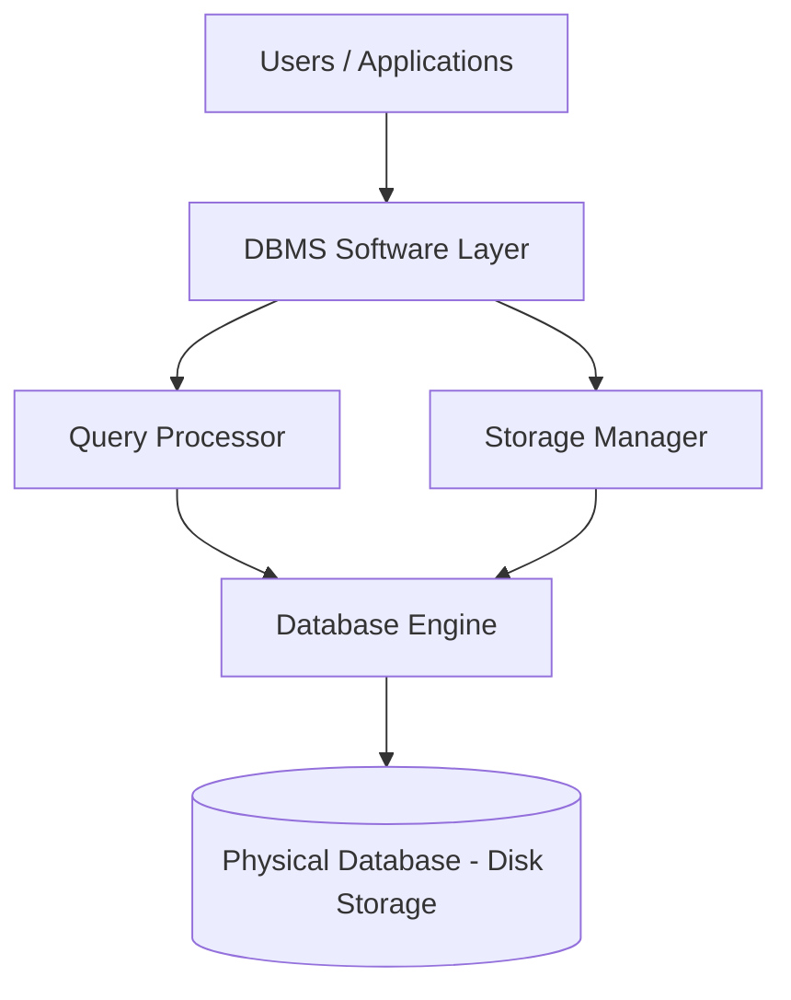

- **Query Processor:** Parses, optimizes, and executes queries.
- **Storage Manager:** Manages data storage, indexing, buffer management, and file access.

---

### 2.4 Three-Schema Architecture (ANSI/SPARC Architecture)

**Definition:** A framework that separates the user's view of the database from the physical storage, using three levels of abstraction, to achieve data independence.

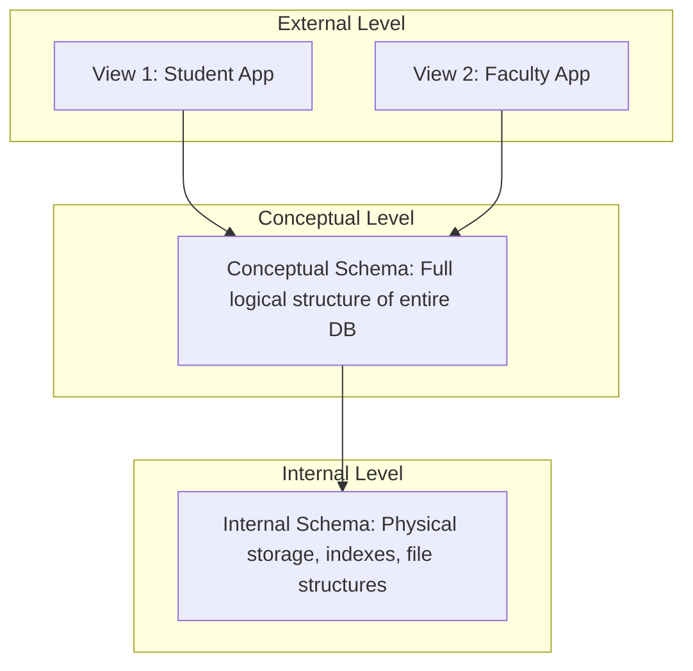

| Level | Description | Concern |
|---|---|---|
| **External Level** | Describes the part of the database relevant to a specific user/application (multiple views possible) | User view |
| **Conceptual Level** | Describes the structure of the whole database for the community of users (entities, relationships, constraints) | Logical structure |
| **Internal Level** | Describes the physical storage structure of the database (file organization, indexing, storage allocation) | Physical storage |

**Example:**
- External: A student's app shows only their own grades and attendance.
- Conceptual: The full schema defines `Students`, `Courses`, `Grades` tables with relationships.
- Internal: Data is stored as B+ Tree indexed files on disk blocks.

---

### 2.5 Data Abstraction

**Definition:** Data abstraction is the process of hiding unnecessary implementation/storage details from the user, exposing only relevant information — achieved through the three-schema architecture.

---

### 2.6 Data Independence

**Definition:** The capacity to change the schema at one level of the database without having to change the schema at the next higher level.

| Type | Definition | Example |
|---|---|---|
| **Logical Data Independence** | Ability to change the conceptual schema without affecting external schemas/applications | Adding a new column `Email` to `Students` table without breaking existing queries |
| **Physical Data Independence** | Ability to change the internal schema (storage/physical structure) without affecting the conceptual schema | Changing file storage from heap file to B+ Tree indexing without changing table structure |

**Common confusion:** Logical data independence is **harder to achieve** than physical data independence, because changes to logical structure (like removing a table or altering relationships) are more likely to impact application-level queries.

---

## 3. Database Models

### 3.1 Hierarchical Model

**Definition:** Organizes data in a tree-like structure with parent-child relationships; each child has only one parent (1:N relationships only).

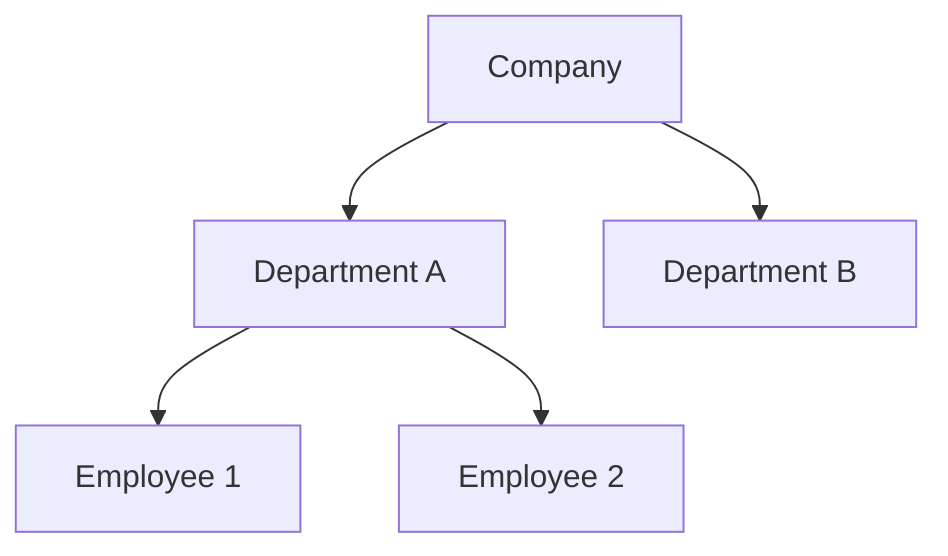

**Example:** IBM's IMS (Information Management System).
**Limitation:** Cannot naturally represent many-to-many relationships; redundant data if a child needs multiple parents.

### 3.2 Network Model

**Definition:** An extension of the hierarchical model allowing many-to-many relationships using a graph structure (records connected via pointers).

**Example:** IDMS (Integrated Database Management System).
**Advantage over hierarchical:** Supports M:N relationships directly.
**Limitation:** Complex navigation logic; difficult to maintain.

### 3.3 Relational Model

**Definition:** Organizes data into tables (relations) consisting of rows (tuples) and columns (attributes), with relationships expressed through keys — proposed by E.F. Codd.

**Advantage:** Simplicity, strong theoretical foundation (set theory, predicate logic), declarative querying (SQL).

### 3.4 Object-Oriented Model

**Definition:** Data is represented as objects, similar to object-oriented programming, encapsulating both data (attributes) and behavior (methods), supporting inheritance and complex data types.

**Example:** db4o, ObjectDB.
**Use case:** CAD systems, multimedia applications where complex data types are needed.

### 3.5 NoSQL Overview

**Definition:** NoSQL ("Not Only SQL") databases are non-relational databases designed for scalability, flexibility, and handling unstructured/semi-structured data.

| Type | Description | Example |
|---|---|---|
| Key-Value Store | Data stored as key-value pairs | Redis, DynamoDB |
| Document Store | Data stored as JSON/BSON-like documents | MongoDB, CouchDB |
| Column-Family Store | Data stored in column families | Cassandra, HBase |
| Graph Database | Data stored as nodes and edges | Neo4j, ArangoDB |

### 3.6 Relational vs Non-Relational Databases

| Aspect | Relational (SQL) | Non-Relational (NoSQL) |
|---|---|---|
| Schema | Fixed, predefined schema | Dynamic/flexible schema |
| Data structure | Tables (rows/columns) | Key-value, document, graph, column-family |
| Scalability | Vertical (scale-up) primarily | Horizontal (scale-out) |
| Consistency model | Strong (ACID) | Often eventual consistency (BASE) |
| Query language | SQL (standardized) | Varies by database |
| Relationships | Enforced via foreign keys/joins | Often denormalized/embedded |
| Best suited for | Structured data, complex transactions | Big data, rapidly changing/unstructured data |

**Common confusion:** NoSQL doesn't mean "no SQL support" for all products — it means "not only SQL," and some NoSQL systems provide SQL-like query languages (e.g., CQL for Cassandra).

---

## 4. Relational Model — Core Terminology

| Term | Definition | Example |
|---|---|---|
| **Relation** | A table consisting of rows and columns | `Student` table |
| **Tuple** | A single row in a relation representing one record | `(101, "Anita", "CSE")` |
| **Attribute** | A column in a relation representing a property | `Name`, `RollNo` |
| **Domain** | The set of allowable/valid values for an attribute | Domain of `Age` = positive integers 0–150 |
| **Relation Schema** | The structure/blueprint of a relation — name + attributes | `Student(RollNo, Name, Dept)` |
| **Relation Instance** | The actual set of tuples in a relation at a given point in time | Current rows in the `Student` table |
| **Degree** | The number of attributes (columns) in a relation | `Student(RollNo, Name, Dept)` → degree = 3 |
| **Cardinality** | The number of tuples (rows) in a relation | If table has 500 students → cardinality = 500 |
| **NULL value** | Represents missing, unknown, or inapplicable data | `PhoneNumber = NULL` if not provided |

**Formula:**
```
Degree     = Number of Columns in a Relation
Cardinality = Number of Rows in a Relation
```

**Example table:**

`Student(RollNo, Name, Dept, Age)`

| RollNo | Name | Dept | Age |
|---|---|---|---|
| 101 | Anita | CSE | 20 |
| 102 | Rahul | ECE | 21 |
| 103 | Meena | NULL | 19 |

- Degree = 4 (RollNo, Name, Dept, Age)
- Cardinality = 3 (3 rows)
- `Dept` for RollNo 103 is NULL → unknown/unavailable data

**Common confusion:** NULL is **not** the same as zero or blank string — it represents the *absence* of a value, and comparisons with NULL using `=` always yield UNKNOWN, not TRUE/FALSE.

---

## 5. Keys in DBMS

### 5.1 Definitions with Examples

Consider table: `Student(RollNo, Aadhar, Email, Name, Dept)`

| Key Type | Definition | Example |
|---|---|---|
| **Super Key** | A set of one or more attributes that can uniquely identify a tuple in a relation | `{RollNo}`, `{RollNo, Name}`, `{Aadhar, Email}` — any superset of a candidate key |
| **Candidate Key** | A minimal super key — no proper subset of it is also a super key (no redundant attributes) | `{RollNo}`, `{Aadhar}`, `{Email}` |
| **Primary Key** | A candidate key chosen by the designer to uniquely identify tuples; cannot be NULL | `RollNo` selected as Primary Key |
| **Alternate Key** | Candidate keys that are NOT selected as the primary key | `Aadhar`, `Email` (if `RollNo` is PK) |
| **Foreign Key** | An attribute in one relation that references the primary key of another relation, maintaining referential integrity | `Enrollment.RollNo` references `Student.RollNo` |
| **Composite Key** | A primary key made up of two or more attributes (no single attribute is sufficient to uniquely identify a tuple) | `Enrollment(RollNo, CourseID)` — combination is the PK |
| **Natural Key** | A key formed from existing real-world/business attributes | `Aadhar Number`, `Email` |
| **Surrogate Key** | An artificially generated key (usually auto-increment/UUID) with no business meaning, used as PK for simplicity | `StudentID` (auto-increment integer) |

### 5.2 Key Comparison Table

| Key | Uniquely Identifies Row? | Can be NULL? | Can Repeat? | Chosen By |
|---|---|---|---|---|
| Super Key | Yes | Depends | No | Derived logically |
| Candidate Key | Yes (minimal) | No | No | Derived logically |
| Primary Key | Yes | **No** | No | Designer (one per table) |
| Alternate Key | Yes | Possibly (not enforced) | No | Remaining candidate keys |
| Foreign Key | No (references another table's PK) | Yes (if optional relationship) | Yes | Designer (for relationships) |
| Composite Key | Yes (combination) | No (for participating attributes) | No (as combination) | Designer |

**Diagram — Key Hierarchy:**

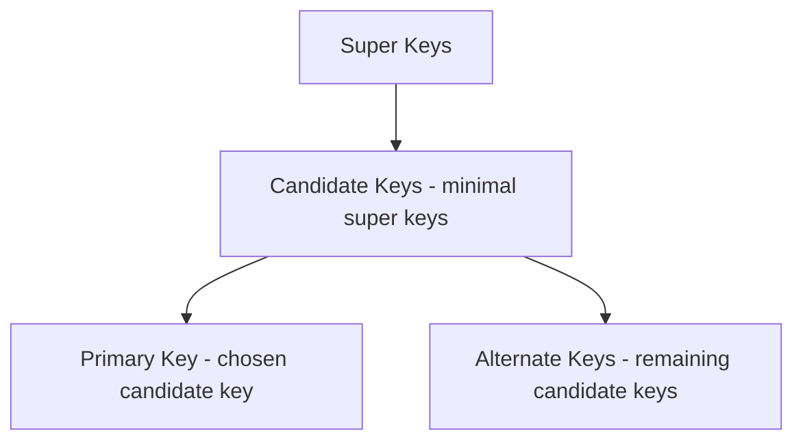

**Common confusion:**
- Every Primary Key is a Candidate Key, but not every Candidate Key is a Primary Key.
- A Foreign Key does **not** need to be unique in its own table — it can repeat (e.g., many enrollments can reference the same student).
- A Foreign Key **can** be NULL (representing an optional relationship), unless explicitly constrained otherwise.

---

## 6. Integrity Constraints

**Definition:** Rules enforced on data in a database to ensure accuracy, validity, and consistency.

### 6.1 Types of Integrity Constraints

| Constraint | Definition | Example |
|---|---|---|
| **Domain Constraint** | Restricts the values of an attribute to a defined domain (data type, range, format) | `Age INT CHECK (Age > 0)` |
| **Entity Integrity** | Primary key value cannot be NULL and must be unique — ensures each entity (row) is uniquely identifiable | `RollNo` cannot be NULL in `Student` |
| **Referential Integrity** | Foreign key value must either match an existing primary key value in the referenced table or be NULL | `Enrollment.RollNo` must exist in `Student.RollNo` |
| **Key Constraint** | No two tuples can have the same value for the primary key | Two students cannot share the same `RollNo` |

### 6.2 SQL-Level Constraints

| Constraint | Purpose | Example |
|---|---|---|
| `NOT NULL` | Ensures a column cannot store NULL | `Name VARCHAR(50) NOT NULL` |
| `UNIQUE` | Ensures all values in a column are distinct | `Email VARCHAR(100) UNIQUE` |
| `PRIMARY KEY` | Combines `NOT NULL` + `UNIQUE`; uniquely identifies each row | `RollNo INT PRIMARY KEY` |
| `FOREIGN KEY` | Enforces referential integrity between two tables | `FOREIGN KEY (RollNo) REFERENCES Student(RollNo)` |
| `CHECK` | Restricts values based on a logical condition | `CHECK (Age >= 18)` |
| `DEFAULT` | Assigns a default value when none is provided | `Status VARCHAR(10) DEFAULT 'Active'` |

### 6.3 What Happens When Referential Integrity Is Violated?

When an operation would break the FK → PK relationship, the DBMS **rejects** the operation unless a specific referential action is defined:

| Action | Behavior on Parent Delete/Update |
|---|---|
| `CASCADE` | Automatically deletes/updates matching child rows |
| `SET NULL` | Sets the foreign key in child rows to NULL |
| `SET DEFAULT` | Sets the foreign key in child rows to a default value |
| `RESTRICT` / `NO ACTION` | Prevents the delete/update if matching child rows exist (default behavior) |

**Example:**
```sql
FOREIGN KEY (RollNo) REFERENCES Student(RollNo)
ON DELETE CASCADE
ON UPDATE CASCADE
```
If a `Student` row is deleted, all matching `Enrollment` rows are automatically deleted too (CASCADE).

**Common confusion:** By default, most RDBMS use `NO ACTION`/`RESTRICT` — they do **not** silently delete related child records unless `CASCADE` is explicitly specified.

---

## 7. ER Model (Entity-Relationship Model)

### 7.1 Core Concepts

| Term | Definition | Example |
|---|---|---|
| **Entity** | A real-world object that can be distinctly identified | A specific student "Anita" |
| **Entity Set** | A collection of similar entities | The set of all `Student` entities |
| **Attribute** | A property that describes an entity | `Name`, `Age`, `RollNo` |
| **Relationship** | An association between two or more entities | Student "enrolls in" Course |
| **Relationship Set** | Collection of similar relationships | All `Enrolls` relationships |
| **Strong Entity** | An entity that has a primary key and can exist independently | `Student`, `Course` |
| **Weak Entity** | An entity that does not have a sufficient primary key of its own and depends on a strong (owner) entity | `Dependent` (of an `Employee`) |
| **Identifying Relationship** | The relationship that connects a weak entity to its owner strong entity | `Employee` — has — `Dependent` |

### 7.2 Attribute Types

| Type | Definition | Example |
|---|---|---|
| **Simple Attribute** | Cannot be divided further | `Age` |
| **Composite Attribute** | Can be divided into sub-parts | `Address` → `Street, City, Pincode` |
| **Single-valued Attribute** | Holds only one value per entity | `RollNo` |
| **Multivalued Attribute** | Can hold multiple values per entity | `PhoneNumbers` (a student may have 2 numbers) |
| **Derived Attribute** | Value can be derived/computed from other attributes | `Age` derived from `DateOfBirth` |
| **Key Attribute** | Uniquely identifies an entity within an entity set | `RollNo` for `Student` |

**ER notation shapes (traditional Chen notation):**

| Symbol | Represents |
|---|---|
| Rectangle | Entity |
| Ellipse | Attribute |
| Double Ellipse | Multivalued Attribute |
| Dashed Ellipse | Derived Attribute |
| Diamond | Relationship |
| Double Rectangle | Weak Entity |
| Double Diamond | Identifying Relationship |

---

## 8. ER Diagrams — Relationships and Cardinality

### 8.1 Cardinality Types

| Type | Definition | Example |
|---|---|---|
| **One-to-One (1:1)** | One entity in set A relates to exactly one entity in set B | `Person` — has — `Passport` |
| **One-to-Many (1:N)** | One entity in set A relates to many entities in set B | `Department` — has — `Employees` |
| **Many-to-One (N:1)** | Many entities in set A relate to one entity in set B (reverse view of 1:N) | `Employees` — belong to — `Department` |
| **Many-to-Many (M:N)** | Many entities in set A relate to many entities in set B | `Student` — enrolls in — `Course` |

### 8.2 Mermaid ER Diagrams

**One-to-One:**
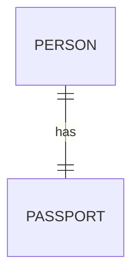

**One-to-Many:**
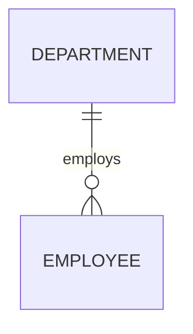

**Many-to-Many:**
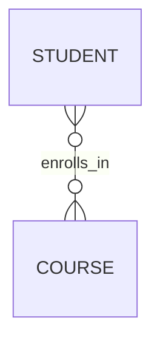

### 8.3 Participation Constraints

**Definition:** Specifies whether every entity in an entity set must participate in a relationship (total) or only some (partial).

| Type | Definition | Notation | Example |
|---|---|---|---|
| **Total Participation** | Every entity instance MUST participate in the relationship | Double line in Chen notation | Every `Employee` must belong to some `Department` |
| **Partial Participation** | Entity instances MAY or MAY NOT participate | Single line | Not every `Employee` manages a `Project` |

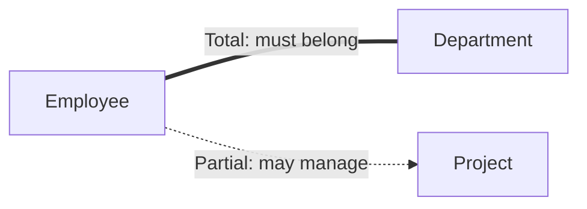

### 8.4 Recursive Relationships

**Definition:** A relationship where the same entity set participates more than once (in different roles).

**Example:** `Employee` — "manages" — `Employee` (a manager is also an employee).

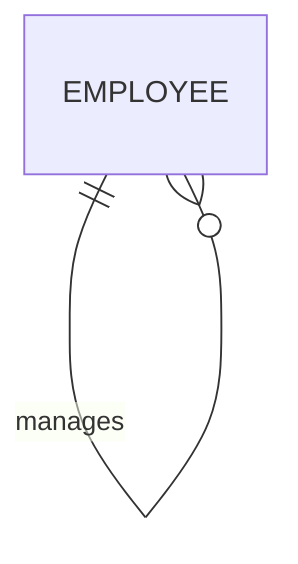

**Common confusion:** Cardinality (1:1, 1:N, M:N) describes *how many* instances relate; participation (total/partial) describes *whether* an instance is required to participate at all. These are independent concepts often tested together in exams.

---

## 9. ER to Relational Mapping (Step-by-Step Rules)

### Rule 1: Strong Entities
Each strong entity becomes a table; simple attributes become columns; the key attribute becomes the primary key.

**Example:** `Student(RollNo, Name, Dept)` → Table `Student` with `RollNo` as PK.

### Rule 2: Weak Entities
Each weak entity becomes a table that includes:
- Its own partial key
- The primary key of the owner (strong) entity as a foreign key
- The primary key of the table = combination of owner's PK + weak entity's partial key (composite key)

**Example:** `Dependent(DependentName, EmployeeID)` where `EmployeeID` references `Employee(EmployeeID)`, and PK = `(EmployeeID, DependentName)`.

### Rule 3: 1:1 Relationships
Add the primary key of one entity as a foreign key in the other (preferably on the side with total participation, or merge into a single table if both sides are total).

**Example:** `Passport(PassportID, PersonID FK, ...)` where `PersonID` references `Person(PersonID)`.

### Rule 4: 1:N Relationships
Add the primary key of the "1" side as a foreign key in the table of the "N" side.

**Example:** `Employee(EmpID, Name, DeptID FK)` where `DeptID` references `Department(DeptID)`.

### Rule 5: M:N Relationships
Create a **new junction/bridge table** containing the primary keys of both participating entities as foreign keys; their combination forms the composite primary key. Any relationship attributes go into this new table.

**Example:**
```
Enrollment(RollNo FK, CourseID FK, EnrollmentDate)
PRIMARY KEY (RollNo, CourseID)
```

### Rule 6: Multivalued Attributes
Create a separate table containing the multivalued attribute along with the primary key of the original entity as a foreign key.

**Example:** `StudentPhone(RollNo FK, PhoneNumber)` — separate from `Student` table.

### Rule 7: Composite Attributes
Only the simple (atomic) sub-attributes are included as separate columns; the composite attribute itself is not stored directly.

**Example:** `Address(Street, City, Pincode)` → columns `Street`, `City`, `Pincode` directly in the entity's table.

### Summary Table

| ER Construct | Relational Mapping Result |
|---|---|
| Strong Entity | One table, key attribute → PK |
| Weak Entity | Table with composite PK (owner PK + partial key) |
| 1:1 Relationship | FK on either side (or merge tables) |
| 1:N Relationship | FK on the "N" side referencing "1" side |
| M:N Relationship | New junction table with both PKs as composite PK |
| Multivalued Attribute | New table with FK to owning entity |
| Composite Attribute | Flattened into individual atomic columns |

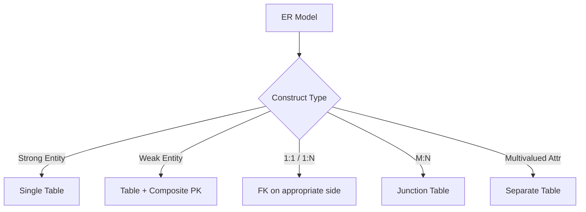

---

## 10. Small SQL Foundation

> Minimal SQL needed to support later theory sections. Deeper SQL/query practice will be covered progressively.

### 10.1 CREATE DATABASE
```sql
CREATE DATABASE CollegeDB;
USE CollegeDB;
```

### 10.2 CREATE TABLE
```sql
CREATE TABLE Student (
    RollNo   INT PRIMARY KEY,
    Name     VARCHAR(50) NOT NULL,
    Dept     VARCHAR(20),
    Age      INT CHECK (Age > 0)
);

CREATE TABLE Enrollment (
    RollNo    INT,
    CourseID  INT,
    EnrollDate DATE DEFAULT (CURRENT_DATE),
    PRIMARY KEY (RollNo, CourseID),
    FOREIGN KEY (RollNo) REFERENCES Student(RollNo)
        ON DELETE CASCADE
);
```

### 10.3 INSERT
```sql
INSERT INTO Student (RollNo, Name, Dept, Age)
VALUES (101, 'Anita', 'CSE', 20);

INSERT INTO Student (RollNo, Name, Dept, Age)
VALUES (102, 'Rahul', 'ECE', 21);
```

### 10.4 Basic SELECT
```sql
SELECT * FROM Student;

SELECT Name, Dept FROM Student;
```

### 10.5 UPDATE
```sql
UPDATE Student
SET Dept = 'CSE'
WHERE RollNo = 102;
```

### 10.6 DELETE
```sql
DELETE FROM Student
WHERE RollNo = 103;
```

### 10.7 Basic WHERE
```sql
SELECT Name FROM Student
WHERE Dept = 'CSE' AND Age > 18;
```

**Common confusion:** `DELETE FROM Student;` (without WHERE) removes all rows but keeps the table structure, whereas `DROP TABLE Student;` removes the table structure itself (not covered here but worth noting for later parts).

---

## Part 1 Quick Revision

- **Data** = raw facts; **Database** = organized collection of data; **DBMS** = software to manage databases; **RDBMS** = DBMS based on the relational (table) model with enforced relationships.
- RDBMS ⊂ DBMS: all RDBMS are DBMS, not vice versa.
- DBMS advantages: reduced redundancy, integrity, security, concurrency, backup/recovery. Disadvantages: cost, complexity, overhead.
- File systems lack query language, constraint enforcement, and robust concurrency/security compared to DBMS.
- **Database users:** naive users, application programmers, sophisticated users, DBA.
- **DBA responsibilities:** schema definition, access control, backup/recovery, performance tuning.
- **Three-Schema Architecture:** External (user views) → Conceptual (logical structure) → Internal (physical storage).
- **Data Independence:** Logical (conceptual schema changes don't affect external schema) vs Physical (internal schema changes don't affect conceptual schema). Logical is harder to achieve.
- **Database Models:** Hierarchical (tree, 1:N only), Network (graph, supports M:N), Relational (tables), Object-Oriented (objects+methods), NoSQL (key-value, document, column-family, graph).
- **Relational Model terms:** Relation (table), Tuple (row), Attribute (column), Domain (valid value set), Degree (# columns), Cardinality (# rows), Relation Schema (structure) vs Relation Instance (current data).
- **Keys:** Super Key → Candidate Key (minimal) → Primary Key (chosen) / Alternate Key (remaining candidates). Foreign Key links to another table's PK. Composite Key = multi-attribute PK. Natural Key (real-world attribute) vs Surrogate Key (artificial, e.g., auto-increment).
- **Integrity Constraints:** Domain, Entity Integrity (PK not null/unique), Referential Integrity (FK matches PK or NULL), Key Constraint (unique PK).
- **SQL constraints:** NOT NULL, UNIQUE, PRIMARY KEY, FOREIGN KEY, CHECK, DEFAULT.
- **Referential integrity violation handling:** CASCADE, SET NULL, SET DEFAULT, RESTRICT/NO ACTION (default).
- **ER Model:** Entity, Entity Set, Attribute, Relationship, Relationship Set; Strong Entity (independent PK) vs Weak Entity (depends on owner via identifying relationship).
- **Attribute types:** Simple, Composite, Single-valued, Multivalued, Derived, Key attribute.
- **Cardinality types:** 1:1, 1:N, N:1, M:N. **Participation:** Total (mandatory) vs Partial (optional) — independent from cardinality.
- **Recursive relationship:** same entity set plays multiple roles (e.g., Employee manages Employee).
- **ER-to-Relational Mapping:**
  - Strong entity → table with PK
  - Weak entity → table with composite PK (owner PK + partial key)
  - 1:1 → FK on either side
  - 1:N → FK on the "N" side
  - M:N → new junction table with composite PK
  - Multivalued attribute → separate table with FK
  - Composite attribute → flattened into atomic columns
- **Basic SQL covered:** CREATE DATABASE, CREATE TABLE (with PK/FK/CHECK/DEFAULT), INSERT, SELECT, UPDATE, DELETE, basic WHERE.

---

*(End of Part 1 — Foundations and Database Design.)*

---

# PART 2: RELATIONAL ALGEBRA, DEPENDENCIES AND NORMALIZATION

---

## 1. Relational Algebra

### 1.1 What is Relational Algebra?

**Definition:** Relational algebra is a **procedural query language** — a formal set of operations that take one or two relations as input and produce a new relation as output.

**Explanation:** "Procedural" means the query specifies *how* to obtain the result (a sequence of operations), unlike SQL (mostly declarative), which specifies *what* result is needed. Every operator in relational algebra takes relation(s) as input and returns a relation as output — this is called **closure property**, which allows operators to be composed/nested.

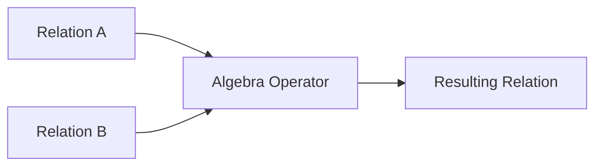

---

### 1.2 Fundamental (Basic) Operators

Assume two relations for examples:

`Student(RollNo, Name, Dept, Age)`

| RollNo | Name | Dept | Age |
|---|---|---|---|
| 101 | Anita | CSE | 20 |
| 102 | Rahul | ECE | 21 |
| 103 | Meena | CSE | 22 |

`Faculty(FID, Name, Dept)`

| FID | Name | Dept |
|---|---|---|
| F1 | Kumar | CSE |
| F2 | Sara | ECE |

---

#### Selection (σ) — Sigma

**Syntax:** `σ<condition>(Relation)`
**Meaning:** Selects **rows (tuples)** that satisfy a given condition. Does not change the number of columns.

**Example:** `σ Dept='CSE' (Student)`

**Result:**

| RollNo | Name | Dept | Age |
|---|---|---|---|
| 101 | Anita | CSE | 20 |
| 103 | Meena | CSE | 22 |

---

#### Projection (π) — Pi

**Syntax:** `π<attribute list>(Relation)`
**Meaning:** Selects specific **columns (attributes)**, and by relational algebra definition, removes duplicate rows from the result.

**Example:** `π Name, Dept (Student)`

**Result:**

| Name | Dept |
|---|---|
| Anita | CSE |
| Rahul | ECE |
| Meena | CSE |

---

#### Union (∪)

**Syntax:** `R ∪ S`
**Meaning:** Combines tuples from two **union-compatible** relations (same number of attributes, same domains), removing duplicates.

**Example:** `π Dept(Student) ∪ π Dept(Faculty)` → `{CSE, ECE}`

---

#### Set Difference (−)

**Syntax:** `R − S`
**Meaning:** Returns tuples present in R but **not** in S. Requires union-compatibility.

**Example:** `π Dept(Student) − π Dept(Faculty)` → `{}` (empty, since both have CSE and ECE)

---

#### Cartesian Product (×)

**Syntax:** `R × S`
**Meaning:** Combines every tuple of R with every tuple of S (cross product). Result has `(m × n)` rows and `(p + q)` columns, where R has `m` rows/`p` columns and S has `n` rows/`q` columns.

**Formula:**
```
|R × S| = |R| × |S|   (number of rows)
Degree(R × S) = Degree(R) + Degree(S)
```

**Example:** `Student × Faculty` → 3 × 2 = 6 rows, 4 + 3 = 7 columns.

---

#### Rename (ρ) — Rho

**Syntax:** `ρ NewName(Relation)` or `ρ NewName(A1, A2, ...)(Relation)`
**Meaning:** Renames a relation and/or its attributes — used to disambiguate names, especially in self-joins.

**Example:** `ρ S1(Student)` renames `Student` to `S1` for later comparison.

---

### 1.3 Derived / Additional Operations

#### Intersection (∩)

**Syntax:** `R ∩ S`
**Meaning:** Returns tuples common to both R and S. Union-compatible relations required.
**Derived from:** `R ∩ S = R − (R − S)`

---

#### Join (⋈) — General

**Definition:** Combines related tuples from two relations based on a common condition; essentially a Cartesian product followed by a selection.

**Formula:** `R ⋈<condition> S = σ<condition>(R × S)`

#### Theta Join (⋈θ)

**Meaning:** Join based on any general condition (θ) using operators like `=, <, >, ≤, ≥, ≠`.

**Example:** `Student ⋈ Student.Age > Faculty.MinAge Faculty`

#### Equi Join

**Meaning:** A special case of theta join where the condition uses **only equality (=)**. Resulting relation may contain duplicate (redundant) columns used for the join condition.

**Example:** `Student ⋈ Student.Dept = Faculty.Dept Faculty` → keeps both `Student.Dept` and `Faculty.Dept` columns.

#### Natural Join (⋈)

**Meaning:** An equi join performed automatically on **all common attribute names** between two relations, with duplicate columns automatically removed from the result.

**Example:** `Student ⋈ Faculty` (joins on `Dept` since it's common to both, keeping only one `Dept` column).

**Result (Student ⋈ Faculty on Dept):**

| RollNo | Name (Student) | Dept | Age | FID | Name (Faculty) |
|---|---|---|---|---|---|
| 101 | Anita | CSE | 20 | F1 | Kumar |
| 102 | Rahul | ECE | 21 | F2 | Sara |
| 103 | Meena | CSE | 22 | F1 | Kumar |

---

#### Outer Joins

**Definition:** Joins that preserve unmatched tuples from one or both relations by filling missing values with NULL, unlike inner/natural joins which discard unmatched tuples.

| Type | Meaning |
|---|---|
| **Left Outer Join (⟕)** | Keeps all tuples of the left relation; unmatched right-side attributes filled with NULL |
| **Right Outer Join (⟖)** | Keeps all tuples of the right relation; unmatched left-side attributes filled with NULL |
| **Full Outer Join (⟗)** | Keeps all tuples from both relations; unmatched attributes on either side filled with NULL |

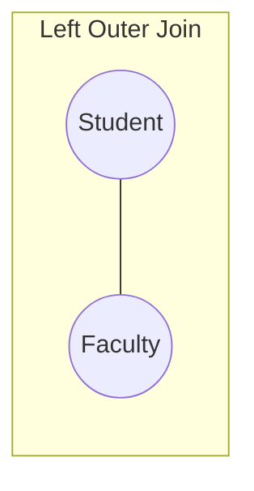

**Example use case:** Listing all students, including those whose department has no matching faculty row → `Student ⟕ Faculty`.

---

#### Division (÷)

**Definition:** `R ÷ S` returns tuples from R that are associated with **all** tuples in S. Used for "for all"-type queries.

**Example:** Given `Enrollment(RollNo, CourseID)` and `Course(CourseID)` containing all mandatory courses, `Enrollment ÷ Course` returns `RollNo`s of students enrolled in **every** course listed in `Course`.

**Classic use case:** "Find students who have enrolled in all courses offered."

---

### 1.4 Key Distinctions

| Comparison | Difference |
|---|---|
| **Selection vs Projection** | Selection (σ) filters **rows** based on a condition; Projection (π) filters **columns** and removes duplicates. |
| **Cartesian Product vs Join** | Cartesian product (×) combines **every** row of R with **every** row of S with no condition (m×n rows); Join applies a condition to combine only related rows, effectively `σ(R × S)`. |
| **Equi Join vs Natural Join** | Equi join uses explicit equality conditions and **retains duplicate columns**; Natural join automatically joins on **all common attributes** and **removes duplicate columns** from the result. |

---

## 2. Relational Calculus

### 2.1 Tuple Relational Calculus (TRC)

**Definition:** A **non-procedural (declarative)** query language where queries are expressed as `{ t | P(t) }` — meaning "the set of all tuples `t` such that predicate `P(t)` is true." Variables (`t`) range over **tuples**.

**Example:** Find names of CSE students:
```
{ t.Name | t ∈ Student ∧ t.Dept = 'CSE' }
```

### 2.2 Domain Relational Calculus (DRC)

**Definition:** Similar to TRC, but variables range over **individual domain values (attribute values)** rather than whole tuples. Expressed as `{ <x1, x2, ...> | P(x1, x2, ...) }`.

**Example:**
```
{ <n> | ∃ r, d, a (⟨r, n, d, a⟩ ∈ Student ∧ d = 'CSE') }
```

### 2.3 Relational Algebra vs Relational Calculus

| Aspect | Relational Algebra | Relational Calculus |
|---|---|---|
| Nature | Procedural (how to get result) | Declarative (what result is needed) |
| Expression | Sequence of operations | Logical predicate/formula |
| Variables | None (works directly on relations) | Tuple variables (TRC) or domain variables (DRC) |
| Expressive power | Equivalent (relationally complete) | Equivalent (relationally complete) |
| Basis | Set theory operations | First-order predicate logic |

**Common confusion:** Both are **theoretically equivalent** in expressive power (a language is called "relationally complete" if it can express any query expressible in relational calculus) — SQL is based on both influences but is primarily declarative like calculus while borrowing algebraic operation concepts internally (query optimizers convert SQL into algebra expressions).

---

## 3. Functional Dependencies (FD)

### 3.1 Functional Dependency

**Definition:** A functional dependency `X → Y` means that the value of attribute set `X` **uniquely determines** the value of attribute set `Y` — i.e., for any two tuples, if they agree on `X`, they must agree on `Y`.

**Example:** In `Student(RollNo, Name, Dept)`, `RollNo → Name` (RollNo determines Name).

### 3.2 Trivial Functional Dependency

**Definition:** `X → Y` is trivial if `Y` is a subset of `X`.

**Example:** `{RollNo, Name} → Name` (trivially true).

### 3.3 Non-Trivial Functional Dependency

**Definition:** `X → Y` where `Y` is **not** a subset of `X`.

**Example:** `RollNo → Name`.

### 3.4 Completely Non-Trivial FD

**Definition:** `X → Y` where `X ∩ Y = ∅` (no common attributes at all between X and Y).

**Example:** `RollNo → Name` where they share nothing in common.

### 3.5 Full Functional Dependency

**Definition:** `Y` is fully functionally dependent on `X` if `Y` depends on the **entire** `X`, and removing any attribute from `X` causes the dependency to fail.

**Example:** In `Enrollment(RollNo, CourseID, Marks)`, `{RollNo, CourseID} → Marks` is a full FD if `Marks` cannot be determined by `RollNo` alone or `CourseID` alone.

### 3.6 Partial Dependency

**Definition:** A non-prime attribute depends on **only part** of a composite candidate key (not the whole key).

**Example:** In `Enrollment(RollNo, CourseID, StudentName)` with PK `{RollNo, CourseID}`, if `RollNo → StudentName` holds (StudentName depends only on RollNo, not on the full key), this is a partial dependency.

### 3.7 Transitive Dependency

**Definition:** A functional dependency `X → Z` that holds indirectly through another attribute `Y`, i.e., `X → Y` and `Y → Z`, where `Y` is not a candidate key.

**Example:** In `Student(RollNo, Dept, DeptHead)`: `RollNo → Dept` and `Dept → DeptHead`, therefore `RollNo → DeptHead` transitively (through `Dept`).

---

## 4. Attribute Closure

### 4.1 Definition

**Attribute closure** of an attribute set `X`, denoted `X⁺`, is the set of **all attributes** that can be functionally determined by `X` using the given set of functional dependencies.

### 4.2 Why It Is Useful

- Determines whether a given attribute set is a **super key** (if `X⁺` = all attributes of the relation, X is a super key).
- Used to find **candidate keys**.
- Used to check if a given FD is **implied** by a set of FDs (i.e., whether it's redundant).

### 4.3 Step-by-Step Method to Find Closure

1. Start with `result = X`.
2. Repeat: for each FD `A → B` in the FD set, if `A ⊆ result`, then add `B` to `result`.
3. Stop when no more attributes can be added.

### 4.4 Worked Example

Given relation `R(A, B, C, D, E)` with FDs:
```
A → B
B → C
CD → E
```

**Find (A)⁺:**
1. `result = {A}`
2. `A → B` applies (A ⊆ result) → `result = {A, B}`
3. `B → C` applies (B ⊆ result) → `result = {A, B, C}`
4. `CD → E`: requires both `C` and `D` in result, but `D` is missing → cannot apply.
5. No further additions possible.

**Final:** `(A)⁺ = {A, B, C}` — since it does **not** cover `{A,B,C,D,E}`, `A` alone is **not** a super key.

**Find (A, D)⁺:**
1. `result = {A, D}`
2. `A → B` → `result = {A, B, D}`
3. `B → C` → `result = {A, B, C, D}`
4. `CD → E` (both C, D present) → `result = {A, B, C, D, E}`

**Final:** `(AD)⁺ = {A, B, C, D, E}` — covers all attributes, so `{A, D}` **is a super key**. Since removing either A or D breaks the closure (verify individually), `{A, D}` is also a **candidate key**.

---

## 5. Armstrong's Axioms

**Definition:** A set of inference rules used to derive all functional dependencies logically implied by a given set of FDs; proven to be **sound and complete**.

### 5.1 Primary Axioms

| Axiom | Rule | Example |
|---|---|---|
| **Reflexivity** | If `Y ⊆ X`, then `X → Y` | `{A,B} → A` |
| **Augmentation** | If `X → Y`, then `XZ → YZ` for any `Z` | If `A → B`, then `AC → BC` |
| **Transitivity** | If `X → Y` and `Y → Z`, then `X → Z` | If `A → B` and `B → C`, then `A → C` |

### 5.2 Derived Rules (from primary axioms)

| Rule | Statement | Example |
|---|---|---|
| **Union** | If `X → Y` and `X → Z`, then `X → YZ` | If `A → B` and `A → C`, then `A → BC` |
| **Decomposition** | If `X → YZ`, then `X → Y` and `X → Z` | If `A → BC`, then `A → B` and `A → C` |
| **Pseudotransitivity** | If `X → Y` and `YZ → W`, then `XZ → W` | If `A → B` and `BC → D`, then `AC → D` |

---

## 6. Finding Candidate Keys Using Functional Dependencies

### 6.1 Systematic Approach

1. **List all attributes** of the relation.
2. **Compute closure** of candidate attribute sets, starting with single attributes, then pairs, etc.
3. An attribute set `X` is a **super key** if `X⁺` = all attributes of the relation.
4. `X` is a **candidate key** if it is a super key AND **minimal** (no proper subset of `X` is also a super key).
5. **Prime attribute:** an attribute that is part of **at least one** candidate key.
6. **Non-prime attribute:** an attribute that is **not** part of any candidate key.

### 6.2 Worked Example

Relation `R(A, B, C, D)` with FDs:
```
A → BC
C → D
```

**Step 1:** Try `(A)⁺`:
- `result = {A}` → apply `A → BC` → `{A, B, C}` → apply `C → D` → `{A, B, C, D}`
- `(A)⁺ = {A,B,C,D}` → covers all attributes → `A` is a super key.
- No proper subset of `{A}` exists (it's a single attribute) → `A` is **minimal** → `A` is a **Candidate Key**.

**Step 2:** Check if any other candidate key exists (e.g., is `B` or `C` or `D` alone a key?):
- `(B)⁺ = {B}` → not a super key.
- `(C)⁺ = {C, D}` → not a super key.
- `(D)⁺ = {D}` → not a super key.

**Conclusion:** `{A}` is the **only candidate key**.
- **Prime attribute:** `A`
- **Non-prime attributes:** `B, C, D`

---

## 7. Normalization

### 7.1 Why Normalization Is Required

**Definition:** Normalization is the systematic process of organizing attributes and relations to **minimize data redundancy** and **eliminate undesirable anomalies** (insertion, update, deletion) by decomposing tables based on functional dependencies.

### 7.2 Anomalies (caused by unnormalized/poorly designed tables)

Consider an unnormalized table: `StudentCourse(RollNo, StudentName, CourseID, CourseName, Instructor)`

| RollNo | StudentName | CourseID | CourseName | Instructor |
|---|---|---|---|---|
| 101 | Anita | C1 | DBMS | Prof. Rao |
| 101 | Anita | C2 | OS | Prof. Iyer |
| 102 | Rahul | C1 | DBMS | Prof. Rao |

| Anomaly | Definition | Example |
|---|---|---|
| **Update Anomaly** | Updating a repeated fact requires updating multiple rows, risking inconsistency | If Prof. Rao is renamed, must update in every row where `CourseID = C1` |
| **Insert Anomaly** | Cannot insert certain data without other unrelated data being available | Cannot add a new course `C3` unless at least one student has enrolled in it |
| **Delete Anomaly** | Deleting a row may unintentionally remove other important information | Deleting Rahul's only row also deletes the fact that `C1 = DBMS = Prof. Rao` if it were the last reference |

---

### 7.3 First Normal Form (1NF)

**Definition:** A relation is in 1NF if all attribute values are **atomic** (indivisible) — no repeating groups or multivalued/composite attributes within a single cell.

**Before (violates 1NF):**

| RollNo | Name | PhoneNumbers |
|---|---|---|
| 101 | Anita | 9876543210, 9123456789 |

**After (1NF applied):**

| RollNo | Name | PhoneNumber |
|---|---|---|
| 101 | Anita | 9876543210 |
| 101 | Anita | 9123456789 |

---

### 7.4 Second Normal Form (2NF)

**Definition:** A relation is in 2NF if it is in 1NF **and** has **no partial dependency** — every non-prime attribute must depend on the **whole** of every candidate (composite) key, not just part of it. (2NF is relevant only when the primary key is composite.)

**Before (violates 2NF):** `Enrollment(RollNo, CourseID, StudentName, Marks)` with PK `{RollNo, CourseID}`

FDs: `RollNo → StudentName` (partial dependency — depends only on part of the key), `{RollNo, CourseID} → Marks` (full dependency).

**After (2NF applied) — decompose:**
```
Student(RollNo, StudentName)
Enrollment(RollNo, CourseID, Marks)
```

---

### 7.5 Third Normal Form (3NF)

**Definition:** A relation is in 3NF if it is in 2NF **and** has **no transitive dependency** — no non-prime attribute depends on another non-prime attribute.

**Before (violates 3NF):** `Student(RollNo, Dept, DeptHead)` with PK `RollNo`

FDs: `RollNo → Dept`, `Dept → DeptHead` (transitive: `RollNo → DeptHead` via `Dept`).

**After (3NF applied) — decompose:**
```
Student(RollNo, Dept)
Department(Dept, DeptHead)
```

---

### 7.6 Boyce-Codd Normal Form (BCNF)

**Definition:** A relation is in BCNF if, for **every** non-trivial functional dependency `X → Y`, `X` must be a **super key** of the relation. BCNF is a stricter version of 3NF.

### 7.7 Difference Between 3NF and BCNF

| Aspect | 3NF | BCNF |
|---|---|---|
| Condition | For every FD `X → Y`, either `X` is a super key **OR** `Y` is a prime attribute | For every FD `X → Y`, `X` **must** be a super key (no exception) |
| Strictness | Less strict | Stricter |
| Anomalies | May still have some redundancy | Removes nearly all redundancy based on FDs |
| Dependency preservation | Always preservable | Not always preservable |

### 7.8 Example Where 3NF Holds but BCNF Does Not

Relation `R(Student, Course, Instructor)` with FDs:
```
{Student, Course} → Instructor
Instructor → Course
```

Candidate keys: `{Student, Course}` and `{Student, Instructor}`.

- Check `Instructor → Course`: `Instructor` is **not** a super key (it alone doesn't determine `Student`) — but `Course` **is** a prime attribute (part of a candidate key) → so this FD **satisfies 3NF** (Y is prime).
- However, for BCNF, `X` (`Instructor`) must be a super key — it is not → **violates BCNF**.

**Conclusion:** This relation is in 3NF but **not** in BCNF, because `Instructor → Course` has a non-super-key determinant.

---

### 7.9 Higher Normal Forms (Conceptual Overview)

#### Multivalued Dependency (MVD)

**Definition:** A multivalued dependency `X →→ Y` means that for a given value of `X`, there exists a set of values of `Y`, **independent** of the values of other attributes in the relation.

**Example:** `Student(RollNo, Hobby, Language)` — where a student's hobbies and known languages are independent of each other → RollNo →→ Hobby and RollNo →→ Language.

#### Fourth Normal Form (4NF)

**Definition:** A relation is in 4NF if it is in BCNF and has **no non-trivial multivalued dependency** other than a dependency on a super key (i.e., no two or more independent multivalued facts are stored in the same table).

**Example fix:** Split `Student(RollNo, Hobby, Language)` into:
```
StudentHobby(RollNo, Hobby)
StudentLanguage(RollNo, Language)
```

#### Fifth Normal Form (5NF) / Join Dependency

**Definition:** A relation is in 5NF (Project-Join Normal Form) if it is in 4NF and cannot be further decomposed into smaller relations without loss of information — i.e., it has no non-trivial **join dependency** that isn't implied by its candidate keys. Used to eliminate redundancy caused by complex multi-way relationships that can't be captured by simpler dependencies.

**Common confusion:** 4NF/5NF are rarely tested in depth for placements — the key takeaway is: **BCNF removes FD-based redundancy; 4NF removes MVD-based redundancy; 5NF removes join-dependency-based redundancy.**

---

## 8. Decomposition

### 8.1 Lossless (Non-Additive) Decomposition

**Definition:** A decomposition of relation `R` into `R1` and `R2` is lossless if joining `R1` and `R2` back together (via natural join) reproduces **exactly** the original relation `R`, with no spurious (extra/incorrect) tuples.

**Condition (test):** Decomposition of `R` into `R1, R2` is lossless if and only if:
```
(R1 ∩ R2) → R1   OR   (R1 ∩ R2) → R2
```
i.e., the common attribute(s) must form a super key of at least one of the two resulting relations.

### 8.2 Lossy Decomposition

**Definition:** A decomposition where joining the decomposed relations back **produces extra/spurious tuples** not present in the original relation — resulting in **loss of information** (loss of the correct data association).

### 8.3 Dependency Preservation

**Definition:** A decomposition is dependency-preserving if all functional dependencies of the original relation can be verified/enforced using only the FDs of the individual decomposed relations, **without** needing to join them back together.

### 8.4 Lossless Join vs Dependency Preservation

| Aspect | Lossless Join | Dependency Preservation |
|---|---|---|
| Ensures | Original data can be reconstructed exactly via join | Original FDs remain enforceable without joining |
| Mandatory for correctness? | Yes (always required) | Desirable but not always achievable |
| BCNF guarantee | Always lossless | **Not always** dependency-preserving |
| 3NF guarantee | Always lossless | Always dependency-preserving |

**Example (Lossless check):**

`R(A, B, C)` decomposed into `R1(A, B)` and `R2(B, C)` with FD `B → C`.
- Common attribute: `{B}`
- Check: Is `B → R1` or `B → R2`? `B → C` means `B → R2` (since R2 = B,C) → **Lossless**.

**Common confusion:** A decomposition can be lossless but **not** dependency-preserving (common in BCNF decompositions) — this is an accepted trade-off, since lossless join is non-negotiable but dependency preservation may sometimes be sacrificed to achieve BCNF.

---

## 9. SQL Connection — Normalization in Practice

**Unnormalized table concept:**

`StudentCourse(RollNo, StudentName, Dept, CourseID, CourseName, Instructor)`

**After normalization (up to 3NF), decomposed into:**

```sql
CREATE TABLE Student (
    RollNo      INT PRIMARY KEY,
    StudentName VARCHAR(50) NOT NULL,
    Dept        VARCHAR(20)
);

CREATE TABLE Course (
    CourseID    INT PRIMARY KEY,
    CourseName  VARCHAR(50) NOT NULL,
    Instructor  VARCHAR(50)
);

CREATE TABLE Enrollment (
    RollNo   INT,
    CourseID INT,
    Marks    INT,
    PRIMARY KEY (RollNo, CourseID),
    FOREIGN KEY (RollNo) REFERENCES Student(RollNo),
    FOREIGN KEY (CourseID) REFERENCES Course(CourseID)
);
```

**Effect of normalization here:**
- `StudentName` and `Dept` are stored once per student (no update anomaly on renaming a student).
- `CourseName` and `Instructor` are stored once per course.
- `Enrollment` acts as the junction table resolving the underlying M:N relationship between `Student` and `Course` (same pattern as ER-to-relational M:N mapping from Part 1).

```sql
-- Querying across normalized tables using JOIN (preview of join usage)
SELECT s.StudentName, c.CourseName, e.Marks
FROM Enrollment e
JOIN Student s ON e.RollNo = s.RollNo
JOIN Course c ON e.CourseID = c.CourseID;
```

---

## Part 2 Quick Revision

- **Relational Algebra** is procedural; every operator takes relation(s) → produces a relation.
- **Basic operators:** Selection (σ, filters rows), Projection (π, filters columns + removes duplicates), Union (∪), Set Difference (−), Cartesian Product (×, rows multiply/columns add), Rename (ρ).
- **Derived operators:** Intersection (∩), Join (⋈ = σ applied to ×), Theta Join (any condition), Equi Join (only `=`, keeps duplicate columns), Natural Join (auto-joins on common attributes, removes duplicate columns), Outer Joins (Left/Right/Full — preserve unmatched tuples with NULLs), Division (÷, "for all" queries).
- **Selection vs Projection:** rows vs columns. **Cartesian Product vs Join:** unconditional combination vs conditional combination. **Equi Join vs Natural Join:** explicit equality + duplicate columns vs automatic common-attribute join + no duplicates.
- **Relational Calculus:** Declarative. TRC variables range over tuples; DRC variables range over domain values. Both equivalent in power to relational algebra (relational completeness).
- **FD terms:** Trivial (`Y ⊆ X`), Non-trivial, Completely non-trivial (`X ∩ Y = ∅`), Full FD (depends on whole key), Partial dependency (depends on part of composite key), Transitive dependency (via a non-key attribute).
- **Attribute closure (X⁺):** all attributes derivable from X using FDs; if `X⁺` = all attributes → X is a super key.
- **Armstrong's Axioms:** Reflexivity, Augmentation, Transitivity (primary); Union, Decomposition, Pseudotransitivity (derived).
- **Candidate key process:** compute closures → find minimal super keys → prime attributes (in some candidate key) vs non-prime attributes (in none).
- **Anomalies:** Update, Insert, Delete — all caused by redundancy in unnormalized designs.
- **1NF:** atomic values only. **2NF:** 1NF + no partial dependency (relevant for composite keys). **3NF:** 2NF + no transitive dependency. **BCNF:** every determinant of a non-trivial FD must be a super key (stricter than 3NF).
- **3NF vs BCNF:** 3NF allows `X → Y` if `Y` is prime even when `X` isn't a super key; BCNF does not allow this exception.
- **4NF:** no non-trivial multivalued dependency (MVD) beyond super key. **5NF:** no non-trivial join dependency beyond candidate keys.
- **Decomposition:** Lossless join (no spurious tuples on rejoining; test via common attribute being a super key of one side) vs Dependency preservation (FDs enforceable without rejoining). 3NF decomposition guarantees both; BCNF guarantees lossless join only (may sacrifice dependency preservation).
- **SQL connection:** normalized design splits an unnormalized wide table into `Student`, `Course`, and a junction table `Enrollment`, connected via foreign keys — directly mirroring ER M:N mapping rules from Part 1.

---

*(End of Part 2 — Relational Algebra, Dependencies and Normalization.)*

---

# PART 3: SQL — CORE QUERYING

---

## 0. Sample Database Used Throughout This Section

To keep queries consistent and realistic, the following schema is used for the rest of this document (extended in later parts as needed).

### Schema Definition

```
Department(DeptID PK, DeptName, DeptHead)
Student(RollNo PK, Name, DeptID FK → Department, Age, Gender)
Course(CourseID PK, CourseName, Credits, DeptID FK → Department)
Enrollment(RollNo FK → Student, CourseID FK → Course, Marks, Grade)   -- Composite PK (RollNo, CourseID)
Employee(EmpID PK, Name, DeptID FK → Department, Salary, ManagerID FK → Employee, JoinDate)
Project(ProjectID PK, ProjectName, DeptID FK → Department)
```

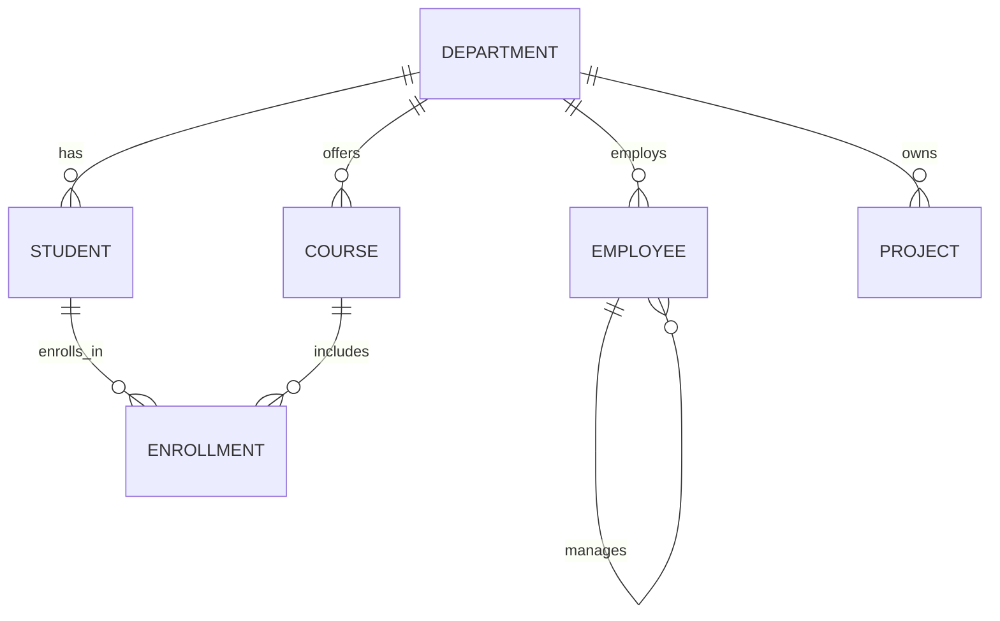

### Sample Data

**Department**

| DeptID | DeptName | DeptHead |
|---|---|---|
| D1 | CSE | Dr. Menon |
| D2 | ECE | Dr. Kapoor |
| D3 | MECH | Dr. Rao |

**Student**

| RollNo | Name | DeptID | Age | Gender |
|---|---|---|---|---|
| 101 | Anita | D1 | 20 | F |
| 102 | Rahul | D2 | 21 | M |
| 103 | Meena | D1 | 22 | F |
| 104 | Kabir | D3 | 20 | M |
| 105 | Sara | D1 | NULL | F |

**Course**

| CourseID | CourseName | Credits | DeptID |
|---|---|---|---|
| C1 | DBMS | 4 | D1 |
| C2 | Signals | 3 | D2 |
| C3 | Thermodynamics | 3 | D3 |
| C4 | Operating Systems | 4 | D1 |

**Enrollment**

| RollNo | CourseID | Marks | Grade |
|---|---|---|---|
| 101 | C1 | 88 | A |
| 101 | C4 | 75 | B |
| 102 | C2 | 65 | B |
| 103 | C1 | 92 | A |
| 104 | C3 | NULL | NULL |

**Employee**

| EmpID | Name | DeptID | Salary | ManagerID | JoinDate |
|---|---|---|---|---|---|
| E1 | Kumar | D1 | 90000 | NULL | 2018-05-01 |
| E2 | Sneha | D1 | 65000 | E1 | 2020-03-15 |
| E3 | Iyer | D2 | 70000 | E1 | 2019-07-20 |
| E4 | Priya | D3 | 60000 | E3 | 2021-01-10 |

---

## 1. SQL Introduction

### 1.1 What is SQL?

**Definition:** SQL (Structured Query Language) is a standardized declarative language used to define, manipulate, query, and control access to data in a relational database.

### 1.2 Why SQL Is Used

- Standardized across nearly all RDBMS vendors (ANSI/ISO standard)
- Declarative — describes *what* data is needed, not *how* to retrieve it
- Combines schema definition, data manipulation, querying, and access control in one language

### 1.3 SQL vs Relational Algebra

| Aspect | SQL | Relational Algebra |
|---|---|---|
| Nature | Mostly declarative | Procedural |
| Usage | Practical implementation language used in real DBMS | Theoretical/formal foundation |
| Duplicate handling | Keeps duplicates unless `DISTINCT` specified | Projection removes duplicates by definition |
| Execution | Internally translated into algebra-like execution plans by the query optimizer | Directly represents the execution steps |

### 1.4 SQL Command Categories

| Category | Full Form | Purpose | Commands |
|---|---|---|---|
| **DDL** | Data Definition Language | Defines/modifies schema structure | `CREATE`, `ALTER`, `DROP`, `TRUNCATE`, `RENAME` |
| **DML** | Data Manipulation Language | Manipulates data within tables | `INSERT`, `UPDATE`, `DELETE` |
| **DQL** | Data Query Language | Retrieves data | `SELECT` |
| **DCL** | Data Control Language | Controls access/permissions | `GRANT`, `REVOKE` |
| **TCL** | Transaction Control Language | Manages transactions | `COMMIT`, `ROLLBACK`, `SAVEPOINT` |

**Common confusion:** Some textbooks classify `SELECT` under DML; more precise classification places it under DQL since it does not modify data. Both classifications are accepted in placement contexts.

---

## 2. DDL (Data Definition Language)

### 2.1 CREATE

```sql
CREATE TABLE Department (
    DeptID   VARCHAR(5) PRIMARY KEY,
    DeptName VARCHAR(30) NOT NULL,
    DeptHead VARCHAR(50)
);
```

### 2.2 ALTER

```sql
-- Add a column
ALTER TABLE Student ADD Email VARCHAR(100);

-- Modify a column's data type
ALTER TABLE Student MODIFY Age SMALLINT;   -- (MySQL syntax)
-- ALTER TABLE Student ALTER COLUMN Age SMALLINT;  -- (SQL Server/PostgreSQL syntax)

-- Drop a column
ALTER TABLE Student DROP COLUMN Email;
```

### 2.3 DROP

```sql
DROP TABLE Student;   -- Removes table structure and data permanently
```

### 2.4 TRUNCATE

```sql
TRUNCATE TABLE Enrollment;   -- Removes all rows, keeps structure, resets identity counters
```

### 2.5 RENAME

```sql
ALTER TABLE Student RENAME TO Students;   -- (MySQL/PostgreSQL)
-- sp_rename 'Student', 'Students';       -- (SQL Server)
```

### 2.6 DELETE vs TRUNCATE vs DROP

| Aspect | DELETE | TRUNCATE | DROP |
|---|---|---|---|
| Type | DML | DDL | DDL |
| Removes | Specific rows (with `WHERE`) or all rows | All rows | Entire table (structure + data) |
| Rollback possible? | Yes (transactional, can use `WHERE`) | Depends on RDBMS (often minimally logged) | Depends on RDBMS |
| WHERE clause allowed? | Yes | No | Not applicable |
| Resets auto-increment | No | Yes | N/A (table is gone) |
| Triggers fired? | Yes | Usually no | N/A |
| Speed | Slower (row-by-row logging) | Faster (deallocates pages) | Immediate (removes object) |

**Example:**
```sql
DELETE FROM Student WHERE DeptID = 'D3';   -- removes only D3 students
TRUNCATE TABLE Enrollment;                 -- removes all enrollment rows
DROP TABLE Project;                        -- removes the Project table entirely
```

---

## 3. Constraints

### 3.1 Constraint Types with Examples

```sql
CREATE TABLE Employee (
    EmpID     VARCHAR(5) PRIMARY KEY,
    Name      VARCHAR(50) NOT NULL,
    DeptID    VARCHAR(5),
    Salary    DECIMAL(10,2) CHECK (Salary > 0),
    Email     VARCHAR(100) UNIQUE,
    ManagerID VARCHAR(5),
    JoinDate  DATE DEFAULT (CURRENT_DATE),
    FOREIGN KEY (DeptID) REFERENCES Department(DeptID),
    FOREIGN KEY (ManagerID) REFERENCES Employee(EmpID)
);
```

| Constraint | Purpose |
|---|---|
| `PRIMARY KEY` | Uniquely identifies each row; implies `NOT NULL` + `UNIQUE` |
| `FOREIGN KEY` | Enforces referential integrity with another (or same) table |
| `UNIQUE` | Ensures all values in a column are distinct (NULLs generally allowed, and typically only one NULL per column depending on RDBMS) |
| `NOT NULL` | Disallows NULL values in the column |
| `CHECK` | Validates values against a boolean condition |
| `DEFAULT` | Provides a fallback value when none is specified during insert |

### 3.2 Referential Actions

```sql
CREATE TABLE Enrollment (
    RollNo    INT,
    CourseID  VARCHAR(5),
    Marks     INT,
    PRIMARY KEY (RollNo, CourseID),
    FOREIGN KEY (RollNo) REFERENCES Student(RollNo)
        ON DELETE CASCADE
        ON UPDATE CASCADE,
    FOREIGN KEY (CourseID) REFERENCES Course(CourseID)
        ON DELETE SET NULL
);
```

| Action | Effect |
|---|---|
| `ON DELETE CASCADE` | Deleting a parent row automatically deletes matching child rows |
| `ON DELETE SET NULL` | Deleting a parent row sets the FK column in child rows to NULL (FK column must be nullable) |
| `ON UPDATE CASCADE` | Updating the parent's key automatically updates matching FK values in child rows |

---

## 4. DML (Data Manipulation Language)

### 4.1 INSERT

**Single-row insert:**
```sql
INSERT INTO Student (RollNo, Name, DeptID, Age, Gender)
VALUES (106, 'Vikram', 'D2', 23, 'M');
```

**Multiple-row insert:**
```sql
INSERT INTO Student (RollNo, Name, DeptID, Age, Gender)
VALUES
    (107, 'Divya', 'D1', 21, 'F'),
    (108, 'Aman', 'D3', 22, 'M');
```

### 4.2 UPDATE

```sql
UPDATE Student
SET Age = 21
WHERE RollNo = 105;
```

```sql
-- Update multiple columns
UPDATE Employee
SET Salary = Salary * 1.10, JoinDate = JoinDate
WHERE DeptID = 'D1';
```

### 4.3 DELETE

```sql
DELETE FROM Enrollment
WHERE RollNo = 104 AND CourseID = 'C3';
```

**Caution:** `UPDATE`/`DELETE` without a `WHERE` clause affects **all rows** in the table.

---

## 5. SELECT

### 5.1 Basic SELECT and DISTINCT

```sql
SELECT * FROM Student;

SELECT DISTINCT DeptID FROM Student;   -- unique department IDs only
```

### 5.2 WHERE with Comparison and Logical Operators

```sql
SELECT Name, Age FROM Student
WHERE Age > 20 AND DeptID = 'D1';

SELECT Name FROM Student
WHERE DeptID = 'D1' OR DeptID = 'D2';

SELECT Name FROM Student
WHERE NOT DeptID = 'D3';
```

| Operator Type | Operators |
|---|---|
| Comparison | `=`, `!=` / `<>`, `<`, `>`, `<=`, `>=` |
| Logical | `AND`, `OR`, `NOT` |

### 5.3 BETWEEN

```sql
SELECT Name, Age FROM Student
WHERE Age BETWEEN 20 AND 22;   -- inclusive of both bounds
```

### 5.4 IN / NOT IN

```sql
SELECT Name FROM Student
WHERE DeptID IN ('D1', 'D2');

SELECT Name FROM Student
WHERE DeptID NOT IN ('D3');
```

### 5.5 LIKE and Wildcards

| Wildcard | Meaning | Example |
|---|---|---|
| `%` | Zero or more characters | `'A%'` matches Anita, Aman |
| `_` | Exactly one character | `'_a%'` matches names with 'a' as 2nd letter |

```sql
SELECT Name FROM Student WHERE Name LIKE 'A%';    -- starts with A
SELECT Name FROM Student WHERE Name LIKE '%a';    -- ends with a
SELECT Name FROM Student WHERE Name LIKE '_a%';   -- 2nd character is 'a'
```

### 5.6 IS NULL / IS NOT NULL

```sql
SELECT Name FROM Student WHERE Age IS NULL;
SELECT Name FROM Student WHERE Age IS NOT NULL;
```

**Common confusion:** `WHERE Age = NULL` **never** returns rows because NULL comparisons yield UNKNOWN, not TRUE — always use `IS NULL` / `IS NOT NULL`.

---

## 6. ORDER BY

```sql
SELECT Name, Age FROM Student
ORDER BY Age ASC;                     -- ascending (default)

SELECT Name, Age FROM Student
ORDER BY Age DESC;                    -- descending

SELECT Name, DeptID, Age FROM Student
ORDER BY DeptID ASC, Age DESC;        -- multi-column sort: DeptID first, then Age within each DeptID
```

**Explanation of multi-column sorting:** Rows are sorted primarily by the first column; ties are broken using the second column, and so on.

---

## 7. LIMIT / TOP / FETCH

**Definition:** Restricts the number of rows returned by a query. Syntax varies by RDBMS.

| RDBMS | Syntax |
|---|---|
| MySQL / PostgreSQL / SQLite | `SELECT * FROM Student LIMIT 3;` |
| SQL Server | `SELECT TOP 3 * FROM Student;` |
| Oracle / ANSI SQL Standard | `SELECT * FROM Student FETCH FIRST 3 ROWS ONLY;` |

```sql
-- MySQL/PostgreSQL: top 3 highest-paid employees
SELECT Name, Salary FROM Employee
ORDER BY Salary DESC
LIMIT 3;

-- With OFFSET (skip first 2, then take next 3) — pagination
SELECT Name, Salary FROM Employee
ORDER BY Salary DESC
LIMIT 3 OFFSET 2;
```

---

## 8. Aggregate Functions

| Function | Purpose |
|---|---|
| `COUNT()` | Counts rows |
| `SUM()` | Adds numeric values |
| `AVG()` | Computes average |
| `MIN()` | Finds minimum value |
| `MAX()` | Finds maximum value |

```sql
SELECT COUNT(*) FROM Student;              -- total number of rows (including NULLs)
SELECT COUNT(Age) FROM Student;            -- counts only non-NULL Age values
SELECT SUM(Salary) FROM Employee;
SELECT AVG(Salary) FROM Employee;
SELECT MIN(Salary), MAX(Salary) FROM Employee;
```

### 8.1 COUNT(*) vs COUNT(column)

| Expression | Behavior |
|---|---|
| `COUNT(*)` | Counts **all rows**, regardless of NULL values in any column |
| `COUNT(column)` | Counts only rows where **that specific column is NOT NULL** |

**Example:** Given `Student` has 5 rows, one with `Age = NULL`:
```sql
SELECT COUNT(*) FROM Student;     -- Result: 5
SELECT COUNT(Age) FROM Student;   -- Result: 4
```

### 8.2 NULL Behavior in Aggregate Functions

- `SUM`, `AVG`, `MIN`, `MAX`, and `COUNT(column)` all **ignore NULL values** during computation.
- If **all** values in the column are NULL, `SUM`/`AVG`/`MIN`/`MAX` return NULL, while `COUNT(column)` returns 0.

---

## 9. GROUP BY

### 9.1 Why GROUP BY Is Used

**Definition:** Groups rows sharing the same value(s) in specified column(s) so aggregate functions can be applied **per group** rather than across the whole table.

### 9.2 Grouping by One Column

```sql
SELECT DeptID, COUNT(*) AS NumStudents
FROM Student
GROUP BY DeptID;
```

**Result:**

| DeptID | NumStudents |
|---|---|
| D1 | 3 |
| D2 | 1 |
| D3 | 1 |

### 9.3 Grouping by Multiple Columns

```sql
SELECT DeptID, Gender, COUNT(*) AS Count
FROM Student
GROUP BY DeptID, Gender;
```

**Explanation:** Groups are formed by unique combinations of `DeptID` **and** `Gender`.

### 9.4 Aggregate Functions with GROUP BY

```sql
SELECT DeptID, AVG(Salary) AS AvgSalary
FROM Employee
GROUP BY DeptID;
```

**Rule:** Every column in the `SELECT` list must either be part of the `GROUP BY` clause or wrapped in an aggregate function (strict SQL standard behavior; some RDBMS like MySQL are more lenient by default).

---

## 10. HAVING

### 10.1 Definition

**HAVING** filters **groups** (post-aggregation), whereas `WHERE` filters **individual rows** (pre-aggregation).

### 10.2 WHERE vs HAVING

| Aspect | WHERE | HAVING |
|---|---|---|
| Applies to | Individual rows | Groups (after GROUP BY) |
| Can use aggregate functions? | No | Yes |
| Execution order | Before grouping | After grouping |
| Typical use | Row-level filtering | Group-level filtering |

### 10.3 Examples

```sql
-- Departments with more than 1 student
SELECT DeptID, COUNT(*) AS NumStudents
FROM Student
GROUP BY DeptID
HAVING COUNT(*) > 1;
```

```sql
-- Departments where average salary exceeds 65000
SELECT DeptID, AVG(Salary) AS AvgSalary
FROM Employee
GROUP BY DeptID
HAVING AVG(Salary) > 65000;
```

```sql
-- Combining WHERE (row filter) and HAVING (group filter)
SELECT DeptID, AVG(Marks) AS AvgMarks
FROM Enrollment
WHERE Marks IS NOT NULL
GROUP BY DeptID
HAVING AVG(Marks) > 70;
```

**Why aggregate conditions belong in HAVING:** At the time `WHERE` is evaluated, aggregate values (like `COUNT`, `AVG`) haven't been computed yet — grouping and aggregation happen afterward, so conditions on aggregate results must be applied via `HAVING`.

---

## 11. SQL Logical Query Execution Order

**Definition:** The order in which a SQL query is logically processed by the database engine — which differs from the order it is *written*.

```
1. FROM        -- identify base table(s)
2. JOIN        -- combine with other tables
3. WHERE       -- filter individual rows
4. GROUP BY    -- group remaining rows
5. HAVING      -- filter groups
6. SELECT      -- compute output expressions/aliases
7. DISTINCT    -- remove duplicate rows from result
8. ORDER BY    -- sort final result
9. LIMIT/FETCH -- restrict number of rows returned
```

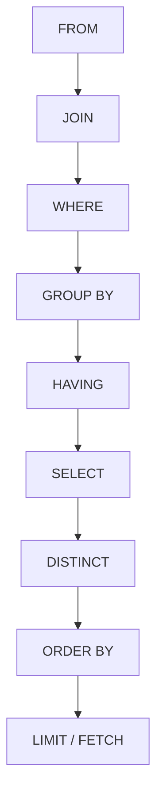

**Why this matters:**
- Explains why a column **alias** defined in `SELECT` **cannot** be used in `WHERE` (WHERE executes before SELECT) but **can** typically be used in `ORDER BY` (which executes after SELECT).
- Explains why `WHERE` cannot reference aggregate functions, but `HAVING` can (HAVING executes after grouping/aggregation).
- Helps in debugging query errors related to clause ordering.

**Example illustrating alias restriction:**
```sql
-- INVALID in most RDBMS: alias 'AvgMarks' not yet defined when WHERE executes
SELECT RollNo, AVG(Marks) AS AvgMarks
FROM Enrollment
WHERE AvgMarks > 70   -- ERROR
GROUP BY RollNo;

-- CORRECT: use HAVING instead, since aggregation happens before HAVING
SELECT RollNo, AVG(Marks) AS AvgMarks
FROM Enrollment
GROUP BY RollNo
HAVING AVG(Marks) > 70;
```

---

## 12. SQL Query Practice

> Practiced against the sample schema defined at the start of Part 3.

**Q1. Requirement:** List names and ages of all students older than 20.
```sql
SELECT Name, Age FROM Student
WHERE Age > 20;
```
**Explanation:** Filters rows where `Age > 20`.
**Expected result:** Rahul (21), Meena (22).

---

**Q2. Requirement:** List distinct department IDs that have at least one student.
```sql
SELECT DISTINCT DeptID FROM Student;
```
**Explanation:** Removes duplicate `DeptID` values.
**Expected result:** D1, D2, D3.

---

**Q3. Requirement:** List students sorted by age descending, and by name ascending for ties.
```sql
SELECT Name, Age FROM Student
ORDER BY Age DESC, Name ASC;
```
**Explanation:** Primary sort by `Age` (descending); ties broken by `Name` (ascending). Rows with NULL `Age` are typically sorted first or last depending on RDBMS (e.g., PostgreSQL sorts NULLs last by default for DESC).

---

**Q4. Requirement:** Find the number of students in each department.
```sql
SELECT DeptID, COUNT(*) AS NumStudents
FROM Student
GROUP BY DeptID;
```
**Explanation:** Groups rows by `DeptID`, counts rows per group.
**Expected result:** D1 → 3, D2 → 1, D3 → 1.

---

**Q5. Requirement:** Find departments having more than one student.
```sql
SELECT DeptID, COUNT(*) AS NumStudents
FROM Student
GROUP BY DeptID
HAVING COUNT(*) > 1;
```
**Explanation:** Filters groups (post-aggregation) where count exceeds 1.
**Expected result:** D1 → 3.

---

**Q6. Requirement:** Find all students whose names start with 'A' or contain the letter 'a' as the second character.
```sql
SELECT Name FROM Student
WHERE Name LIKE 'A%' OR Name LIKE '_a%';
```
**Explanation:** Combines two pattern conditions with `OR`.

---

**Q7. Requirement:** Find the average marks scored in each course, excluding NULL marks, only for courses with average marks above 70.
```sql
SELECT CourseID, AVG(Marks) AS AvgMarks
FROM Enrollment
WHERE Marks IS NOT NULL
GROUP BY CourseID
HAVING AVG(Marks) > 70;
```
**Explanation:** `WHERE` removes NULL-mark rows before grouping; `HAVING` filters the resulting course-level averages.
**Expected result:** C1 → 90 (average of 88 and 92).

---

**Q8. Requirement:** Find employees who do not have a manager.
```sql
SELECT Name FROM Employee
WHERE ManagerID IS NULL;
```
**Explanation:** Filters rows where the `ManagerID` foreign key is NULL (e.g., top-level employee).
**Expected result:** Kumar.

---

**Q9. Requirement:** Find the top 2 highest-paid employees.
```sql
SELECT Name, Salary FROM Employee
ORDER BY Salary DESC
LIMIT 2;
```
**Explanation:** Sorts by `Salary` descending, then restricts output to 2 rows.
**Expected result:** Kumar (90000), Iyer (70000).

---

**Q10. Requirement:** Find department-wise employee count, only for departments with total salary expenditure above 65000.
```sql
SELECT DeptID, COUNT(*) AS NumEmployees, SUM(Salary) AS TotalSalary
FROM Employee
GROUP BY DeptID
HAVING SUM(Salary) > 65000;
```
**Explanation:** Aggregates count and sum per department, then filters groups using the aggregate `SUM`.
**Expected result:** D1 → 2 employees, 155000 total.

---

## Part 3 Quick Revision

- **SQL categories:** DDL (`CREATE`, `ALTER`, `DROP`, `TRUNCATE`, `RENAME`), DML (`INSERT`, `UPDATE`, `DELETE`), DQL (`SELECT`), DCL (`GRANT`, `REVOKE`), TCL (`COMMIT`, `ROLLBACK`, `SAVEPOINT`).
- **DELETE vs TRUNCATE vs DROP:** DELETE removes specific/all rows (DML, supports WHERE, rollback-friendly); TRUNCATE removes all rows fast (DDL, resets identity, no WHERE); DROP removes the entire table object.
- **Constraints:** `PRIMARY KEY`, `FOREIGN KEY`, `UNIQUE`, `NOT NULL`, `CHECK`, `DEFAULT`. Referential actions: `ON DELETE CASCADE`, `ON DELETE SET NULL`, `ON UPDATE CASCADE`.
- **SELECT clause tools:** `DISTINCT` (unique rows), `WHERE` (row filter with comparison/logical operators), `BETWEEN`, `IN`/`NOT IN`, `LIKE` with `%`/`_` wildcards, `IS NULL`/`IS NOT NULL` (never use `= NULL`).
- **ORDER BY:** `ASC`/`DESC`, multi-column sort resolves ties left to right.
- **LIMIT/TOP/FETCH:** row-restriction syntax differs by RDBMS (MySQL/PostgreSQL: `LIMIT`; SQL Server: `TOP`; Oracle/ANSI: `FETCH FIRST n ROWS ONLY`).
- **Aggregate functions:** `COUNT`, `SUM`, `AVG`, `MIN`, `MAX` — all ignore NULLs except `COUNT(*)`, which counts all rows regardless of NULLs.
- **GROUP BY:** groups rows for per-group aggregation; non-aggregated SELECT columns must appear in GROUP BY.
- **HAVING vs WHERE:** WHERE filters rows before grouping (no aggregates allowed); HAVING filters groups after aggregation (aggregates allowed).
- **Logical execution order:** `FROM → JOIN → WHERE → GROUP BY → HAVING → SELECT → DISTINCT → ORDER BY → LIMIT/FETCH` — explains alias/aggregate placement restrictions in WHERE vs HAVING/ORDER BY.

---

*(End of Part 3 — SQL Core Querying.)*

---

# PART 4: SQL — JOINS, SUBQUERIES, SET OPERATIONS AND ADVANCED QUERIES

> Continues using the schema and sample data introduced in Part 3: `Department`, `Student`, `Course`, `Enrollment`, `Employee`, `Project`.

---

## 1. Joins

### 1.1 Why Joins Are Needed

**Explanation:** In a normalized relational database, related data is deliberately split across multiple tables (per Part 2's normalization rules) to avoid redundancy. **Joins** are required to recombine this related data — for example, to see a student's name alongside the courses they're enrolled in, `Student` and `Enrollment` must be joined using their shared key (`RollNo`).

### 1.2 Join Terminology

| Term | Meaning |
|---|---|
| **Join condition** | The predicate specifying how rows from two tables are related (usually `table1.col = table2.col`) |
| **Join keys** | The specific columns used in the join condition — typically a primary key in one table matched with a foreign key in another |
| **Foreign-key relationship** | The underlying schema relationship that most join conditions are based on |

### 1.3 Join Types

#### INNER JOIN

**Definition:** Returns only rows where the join condition is satisfied in **both** tables (matching rows only).

```sql
SELECT s.Name, e.CourseID, e.Marks
FROM Student s
INNER JOIN Enrollment e ON s.RollNo = e.RollNo;
```

**Result (only students with at least one enrollment):**

| Name | CourseID | Marks |
|---|---|---|
| Anita | C1 | 88 |
| Anita | C4 | 75 |
| Rahul | C2 | 65 |
| Meena | C1 | 92 |
| Kabir | C3 | NULL |

*(Sara, who has no enrollment row, is excluded.)*

---

#### LEFT (OUTER) JOIN

**Definition:** Returns **all** rows from the left table, plus matching rows from the right table; unmatched right-side columns are filled with NULL.

```sql
SELECT s.Name, e.CourseID
FROM Student s
LEFT JOIN Enrollment e ON s.RollNo = e.RollNo;
```

**Result:** Includes Sara with `CourseID = NULL` since she has no enrollment.

---

#### RIGHT (OUTER) JOIN

**Definition:** Returns **all** rows from the right table, plus matching rows from the left table; unmatched left-side columns are filled with NULL.

```sql
SELECT s.Name, e.CourseID
FROM Student s
RIGHT JOIN Enrollment e ON s.RollNo = e.RollNo;
```

**Explanation:** Equivalent to swapping table order in a LEFT JOIN — rarely used in practice since a LEFT JOIN with tables reordered achieves the same result.

---

#### FULL OUTER JOIN

**Definition:** Returns all rows from **both** tables — matched rows combined, and unmatched rows from either side padded with NULLs.

```sql
SELECT s.Name, e.CourseID
FROM Student s
FULL OUTER JOIN Enrollment e ON s.RollNo = e.RollNo;
```

**Note:** MySQL does not support `FULL OUTER JOIN` directly — it is typically emulated using `LEFT JOIN UNION RIGHT JOIN`.

```sql
-- MySQL-style emulation of FULL OUTER JOIN
SELECT s.Name, e.CourseID FROM Student s LEFT JOIN Enrollment e ON s.RollNo = e.RollNo
UNION
SELECT s.Name, e.CourseID FROM Student s RIGHT JOIN Enrollment e ON s.RollNo = e.RollNo;
```

---

#### CROSS JOIN

**Definition:** Returns the **Cartesian product** of two tables — every row from the first table combined with every row of the second, with **no join condition**.

```sql
SELECT s.Name, c.CourseName
FROM Student s
CROSS JOIN Course c;
```

**Result size:** `|Student| × |Course|` rows (5 × 4 = 20 rows in the sample data).

---

#### SELF JOIN

**Definition:** A join of a table with **itself**, typically to compare rows within the same table — requires aliasing the table twice.

```sql
-- Find each employee along with their manager's name
SELECT e.Name AS EmployeeName, m.Name AS ManagerName
FROM Employee e
LEFT JOIN Employee m ON e.ManagerID = m.EmpID;
```

**Result:**

| EmployeeName | ManagerName |
|---|---|
| Kumar | NULL |
| Sneha | Kumar |
| Iyer | Kumar |
| Priya | Iyer |

---

### 1.4 Join Type Comparison

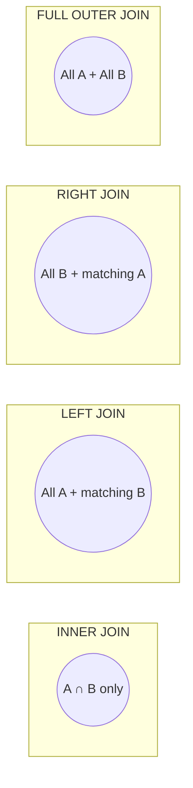

| Join Type | Returns | Unmatched Rows Handling |
|---|---|---|
| INNER JOIN | Only matching rows from both tables | Excluded |
| LEFT JOIN | All left rows + matched right rows | Unmatched right columns → NULL |
| RIGHT JOIN | All right rows + matched left rows | Unmatched left columns → NULL |
| FULL OUTER JOIN | All rows from both tables | Unmatched columns on either side → NULL |
| CROSS JOIN | Cartesian product (no condition) | Not applicable |
| SELF JOIN | Table joined with itself (any of the above join types) | Depends on join type used |

**NULL behavior in outer joins:** Any column originating from the "non-preserved" side of an outer join (the side without a guaranteed match) will contain NULL wherever no matching row exists — this is the standard mechanism for detecting missing relationships (e.g., "students with no enrollment").

---

## 2. Join Query Practice

**Q1. Join two tables — students with their department names.**
```sql
SELECT s.Name, d.DeptName
FROM Student s
JOIN Department d ON s.DeptID = d.DeptID;
```

---

**Q2. Join three tables — student names, course names, and marks.**
```sql
SELECT s.Name, c.CourseName, e.Marks
FROM Student s
JOIN Enrollment e ON s.RollNo = e.RollNo
JOIN Course c ON e.CourseID = c.CourseID;
```
**Explanation:** Chains two joins — `Student ⋈ Enrollment ⋈ Course` — to connect student identity through the junction table to course details.

---

**Q3. Filtering after a join — CSE department students and their courses.**
```sql
SELECT s.Name, c.CourseName
FROM Student s
JOIN Enrollment e ON s.RollNo = e.RollNo
JOIN Course c ON e.CourseID = c.CourseID
WHERE s.DeptID = 'D1';
```

---

**Q4. Aggregation after a join — average marks per department.**
```sql
SELECT d.DeptName, AVG(e.Marks) AS AvgMarks
FROM Student s
JOIN Enrollment e ON s.RollNo = e.RollNo
JOIN Department d ON s.DeptID = d.DeptID
GROUP BY d.DeptName;
```

---

**Q5. GROUP BY with joins — number of enrollments per course.**
```sql
SELECT c.CourseName, COUNT(e.RollNo) AS NumStudents
FROM Course c
LEFT JOIN Enrollment e ON c.CourseID = e.CourseID
GROUP BY c.CourseName;
```
**Explanation:** `LEFT JOIN` ensures courses with **zero** enrollments still appear (with count 0), unlike an `INNER JOIN` which would exclude them.

---

**Q6. HAVING with joins — departments with average marks above 80.**
```sql
SELECT d.DeptName, AVG(e.Marks) AS AvgMarks
FROM Student s
JOIN Enrollment e ON s.RollNo = e.RollNo
JOIN Department d ON s.DeptID = d.DeptID
GROUP BY d.DeptName
HAVING AVG(e.Marks) > 80;
```

---

**Q7. LEFT JOIN to find missing relationships — students with no enrollments.**
```sql
SELECT s.Name
FROM Student s
LEFT JOIN Enrollment e ON s.RollNo = e.RollNo
WHERE e.RollNo IS NULL;
```
**Explanation:** After a `LEFT JOIN`, students without any enrollment will have `e.RollNo = NULL` — filtering on this identifies "orphan" left-side rows (a very common placement pattern for "find X with no matching Y").
**Expected result:** Sara.

---

**Q8. SELF JOIN for hierarchical relationships — employees and their manager's department.**
```sql
SELECT e.Name AS Employee, m.Name AS Manager, m.DeptID AS ManagerDept
FROM Employee e
JOIN Employee m ON e.ManagerID = m.EmpID;
```

---

## 3. Subqueries

### 3.1 What Is a Subquery?

**Definition:** A subquery (inner query) is a `SELECT` query nested inside another SQL statement (`SELECT`, `INSERT`, `UPDATE`, or `DELETE`), used to compute intermediate results needed by the outer (main) query.

### 3.2 Why Subqueries Are Useful

- Break complex logic into smaller, composable steps
- Allow filtering based on aggregated or derived values
- Enable comparisons against values not known in advance (e.g., "the average salary")

### 3.3 Types of Subqueries

| Type | Definition | Example |
|---|---|---|
| **Scalar Subquery** | Returns exactly **one row, one column** (a single value) | `(SELECT AVG(Salary) FROM Employee)` |
| **Single-row Subquery** | Returns one row (may have multiple columns) — usable with `=`, `<`, `>` etc. | `(SELECT DeptID FROM Employee WHERE EmpID='E1')` |
| **Multi-row Subquery** | Returns multiple rows — must be used with `IN`, `ANY`, `ALL`, or `EXISTS` | `(SELECT DeptID FROM Department WHERE DeptName='CSE')` |
| **Correlated Subquery** | References a column from the **outer** query — re-evaluated conceptually for each outer row | See Section 4 |
| **Nested Subquery** | A subquery containing another subquery inside it | Subquery within a subquery within `WHERE` |

### 3.4 Subquery Operators

| Operator | Meaning |
|---|---|
| `IN` | Matches if the value exists in the subquery's result set |
| `NOT IN` | Matches if the value does **not** exist in the result set (careful with NULLs — see below) |
| `EXISTS` | Returns TRUE if the subquery returns **at least one row** |
| `NOT EXISTS` | Returns TRUE if the subquery returns **no rows** |
| `ANY` | TRUE if the condition holds for **at least one** value returned by the subquery |
| `ALL` | TRUE if the condition holds for **every** value returned by the subquery |

### 3.5 EXISTS vs IN

| Aspect | IN | EXISTS |
|---|---|---|
| Compares | A value against a list of values | Whether any row satisfies a condition (existence check) |
| NULL handling | `NOT IN` fails silently (returns no rows) if the subquery result contains any NULL | Unaffected by NULLs in the subquery — safer for `NOT EXISTS` |
| Performance | Can be less efficient on large subquery results (depends on optimizer) | Often more efficient since it can stop at the first match |
| Typical use | Small, known static/derived lists | Correlated existence checks |

**Common confusion / caution:**
```sql
-- DANGEROUS: if the subquery returns even one NULL, NOT IN returns NO rows at all
SELECT Name FROM Student
WHERE RollNo NOT IN (SELECT RollNo FROM Enrollment WHERE Marks IS NULL);
```
If `Enrollment.RollNo` can be NULL in the subquery result, `NOT IN` behaves unexpectedly due to three-valued logic (see Section 8). Using `NOT EXISTS` avoids this pitfall.

---

## 4. Correlated Subqueries

### 4.1 How Correlated Subqueries Work

**Definition:** A correlated subquery references one or more columns from the **outer query**, so its result **depends on** the current outer row being processed — conceptually, it is (re-)evaluated once per outer row, unlike a non-correlated subquery which is evaluated **once** overall.

### 4.2 Example

```sql
-- Employees earning more than their own department's average salary
SELECT e1.Name, e1.Salary, e1.DeptID
FROM Employee e1
WHERE e1.Salary > (
    SELECT AVG(e2.Salary)
    FROM Employee e2
    WHERE e2.DeptID = e1.DeptID   -- correlation: refers to outer row's DeptID
);
```

**Explanation:** For each outer row (`e1`), the inner query recomputes the average salary **only for that employee's department**, then compares.

### 4.3 Correlated vs Non-Correlated Subquery

| Aspect | Non-Correlated Subquery | Correlated Subquery |
|---|---|---|
| Dependency on outer query | Independent — can run standalone | Depends on outer row's column values |
| Conceptual execution | Evaluated once | Conceptually evaluated once per outer row |
| Typical use | Fixed comparison value (e.g., overall average) | Per-row/group comparisons (e.g., per-department average) |
| Example | `WHERE Salary > (SELECT AVG(Salary) FROM Employee)` | `WHERE Salary > (SELECT AVG(Salary) FROM Employee e2 WHERE e2.DeptID = e1.DeptID)` |

---

## 5. Subquery Query Practice

**Q1. Employees earning above the overall average salary (non-correlated scalar subquery).**
```sql
SELECT Name, Salary FROM Employee
WHERE Salary > (SELECT AVG(Salary) FROM Employee);
```

---

**Q2. Students enrolled in a particular course ('DBMS').**
```sql
SELECT s.Name FROM Student s
WHERE s.RollNo IN (
    SELECT e.RollNo FROM Enrollment e
    JOIN Course c ON e.CourseID = c.CourseID
    WHERE c.CourseName = 'DBMS'
);
```

---

**Q3. Employee with the highest salary.**
```sql
SELECT Name, Salary FROM Employee
WHERE Salary = (SELECT MAX(Salary) FROM Employee);
```

---

**Q4. Employee with the second-highest salary.**

*Method A — subquery with NOT IN:*
```sql
SELECT MAX(Salary) AS SecondHighest FROM Employee
WHERE Salary NOT IN (SELECT MAX(Salary) FROM Employee);
```

*Method B — using LIMIT/OFFSET:*
```sql
SELECT DISTINCT Salary FROM Employee
ORDER BY Salary DESC
LIMIT 1 OFFSET 1;
```

**Explanation:** Method A removes the maximum value, then finds the max of the remainder (which becomes the second-highest). Method B sorts descending and skips the first row.

---

**Q5. Nth-highest salary (general pattern, N = 3).**
```sql
SELECT DISTINCT Salary FROM Employee
ORDER BY Salary DESC
LIMIT 1 OFFSET 2;    -- OFFSET (N-1) for the Nth highest
```
**Explanation:** `OFFSET (N-1)` skips the top `(N-1)` distinct salaries, and `LIMIT 1` picks the next one — generalizes the second-highest pattern from Q4.

---

**Q6. Employees who earn more than their department's average (correlated subquery — repeated from Section 4 for reference).**
```sql
SELECT e1.Name, e1.Salary
FROM Employee e1
WHERE e1.Salary > (
    SELECT AVG(e2.Salary) FROM Employee e2
    WHERE e2.DeptID = e1.DeptID
);
```

---

**Q7. Departments with no employees.**
```sql
SELECT d.DeptName FROM Department d
WHERE NOT EXISTS (
    SELECT 1 FROM Employee e WHERE e.DeptID = d.DeptID
);
```
**Alternative using LEFT JOIN:**
```sql
SELECT d.DeptName FROM Department d
LEFT JOIN Employee e ON d.DeptID = e.DeptID
WHERE e.EmpID IS NULL;
```

---

**Q8. Records existing in one table but not another — students who have never enrolled in any course.**
```sql
SELECT s.Name FROM Student s
WHERE NOT EXISTS (
    SELECT 1 FROM Enrollment e WHERE e.RollNo = s.RollNo
);
```
**Expected result:** Sara.

---

## 6. Set Operations

### 6.1 Compatibility Requirement

**Definition:** Set operations combine results of two `SELECT` queries; both queries must be **union-compatible** — same number of columns, with corresponding columns of compatible data types.

### 6.2 UNION

**Definition:** Combines results of two queries and **removes duplicate rows**.

```sql
SELECT Name FROM Student
UNION
SELECT Name FROM Employee;
```

### 6.3 UNION ALL

**Definition:** Combines results of two queries **without removing duplicates** (faster, since no de-duplication step is performed).

```sql
SELECT Name FROM Student
UNION ALL
SELECT Name FROM Employee;
```

### 6.4 UNION vs UNION ALL

| Aspect | UNION | UNION ALL |
|---|---|---|
| Duplicate rows | Removed | Retained |
| Performance | Slower (requires sorting/de-duplication) | Faster |
| Use case | When distinct combined results are needed | When all rows (including duplicates) are needed, or duplicates are known not to exist |

### 6.5 INTERSECT

**Definition:** Returns only rows common to **both** queries.

```sql
SELECT DeptID FROM Student
INTERSECT
SELECT DeptID FROM Employee;
```
**(Supported in PostgreSQL, SQL Server, Oracle; not natively in MySQL — emulated via `INNER JOIN` or `IN`.)**

### 6.6 EXCEPT / MINUS

**Definition:** Returns rows from the first query that do **not** appear in the second query's result. Called `EXCEPT` in PostgreSQL/SQL Server, `MINUS` in Oracle.

```sql
SELECT DeptID FROM Department
EXCEPT
SELECT DeptID FROM Employee;   -- departments with no employees (alternative to NOT EXISTS pattern)
```

---

## 7. CASE Expression

### 7.1 Definition

**CASE** is a conditional expression used within SQL statements (`SELECT`, `WHERE`, `ORDER BY`, etc.) to return different values based on specified conditions — SQL's equivalent of if-else logic.

### 7.2 Simple CASE

**Syntax:** Compares one expression against multiple possible values.
```sql
SELECT Name,
    CASE Gender
        WHEN 'M' THEN 'Male'
        WHEN 'F' THEN 'Female'
        ELSE 'Unknown'
    END AS GenderLabel
FROM Student;
```

### 7.3 Searched CASE

**Syntax:** Evaluates independent boolean conditions in sequence.
```sql
SELECT Name, Marks,
    CASE
        WHEN Marks >= 90 THEN 'A+'
        WHEN Marks >= 75 THEN 'A'
        WHEN Marks >= 60 THEN 'B'
        WHEN Marks IS NULL THEN 'Not Graded'
        ELSE 'Fail'
    END AS Grade
FROM Enrollment;
```

**Common confusion:** Simple CASE only supports **equality** checks against a single expression; Searched CASE supports **any boolean condition** (ranges, multiple columns, NULL checks) — Searched CASE is strictly more flexible.

---

## 8. NULL and Three-Valued Logic

### 8.1 What NULL Means

**Definition:** NULL represents a **missing, unknown, or inapplicable** value — it is **not** equivalent to zero, an empty string, or any other "default" value.

- `NULL ≠ 0` — a numeric column with NULL has *no recorded value*, not the value zero.
- `NULL ≠ ''` — a NULL text field is *absent data*, not an empty string.

### 8.2 IS NULL / IS NOT NULL

```sql
SELECT Name FROM Student WHERE Age IS NULL;
SELECT Name FROM Student WHERE Age IS NOT NULL;
```
Direct equality (`= NULL` or `!= NULL`) should never be used to test for NULL — it always evaluates to UNKNOWN.

### 8.3 Three-Valued Logic (TRUE / FALSE / UNKNOWN)

**Definition:** SQL uses three-valued logic instead of standard boolean logic — any comparison involving NULL evaluates to **UNKNOWN**, not TRUE or FALSE.

| Expression | Result |
|---|---|
| `5 = 5` | TRUE |
| `5 = 6` | FALSE |
| `NULL = 5` | UNKNOWN |
| `NULL = NULL` | UNKNOWN |
| `NULL IS NULL` | TRUE |

**Truth tables for logical operators with UNKNOWN (U):**

| A | B | A AND B | A OR B |
|---|---|---|---|
| TRUE | U | U | TRUE |
| FALSE | U | FALSE | U |
| U | U | U | U |

**Effect on queries:** Rows are only included in a `WHERE`/`HAVING` result if the condition evaluates to **TRUE** — rows evaluating to UNKNOWN are excluded (treated similarly to FALSE for filtering purposes, but distinct in three-valued logic semantics).

### 8.4 NULL Behavior in Aggregates (Recap Link to Part 3)

As covered in Part 3, all aggregate functions except `COUNT(*)` **ignore** NULL values in their computation.

---

## 9. Common SQL Query Patterns (Placement Reference)

> A consolidated practical reference — patterns frequently required in placement tests, using the Part 3 schema.

### 9.1 Maximum / Minimum
```sql
SELECT MAX(Salary), MIN(Salary) FROM Employee;
```

### 9.2 Second Maximum
```sql
SELECT MAX(Salary) FROM Employee
WHERE Salary < (SELECT MAX(Salary) FROM Employee);
```

### 9.3 Top N Records
```sql
SELECT Name, Salary FROM Employee
ORDER BY Salary DESC
LIMIT 3;   -- top 3 (syntax varies by RDBMS, see Part 3 Section 7)
```

### 9.4 Nth Highest
```sql
SELECT DISTINCT Salary FROM Employee
ORDER BY Salary DESC
LIMIT 1 OFFSET (N-1);
```

### 9.5 Duplicate Records
```sql
-- Find duplicate names (appearing more than once)
SELECT Name, COUNT(*) FROM Employee
GROUP BY Name
HAVING COUNT(*) > 1;
```

### 9.6 Removing Duplicates (Conceptual)
- Use `SELECT DISTINCT` for query-time de-duplication.
- For permanent removal from a table, a common pattern is to keep one row per duplicate group (e.g., the one with the minimum row identifier) and delete the rest — conceptually: "group by the duplicate-defining columns, retain one representative row per group, remove others."

### 9.7 Employees Per Department
```sql
SELECT DeptID, COUNT(*) AS NumEmployees
FROM Employee
GROUP BY DeptID;
```

### 9.8 Departments With No Employees
```sql
SELECT d.DeptName FROM Department d
LEFT JOIN Employee e ON d.DeptID = e.DeptID
WHERE e.EmpID IS NULL;
```

### 9.9 "Customers With No Orders" Pattern (Generalized)
**General pattern:** "Find all rows in table A that have no matching row in table B" → **LEFT JOIN + `IS NULL`** or **`NOT EXISTS`** (as shown for students-with-no-enrollment and departments-with-no-employees above). This is one of the most common placement query patterns.

### 9.10 Records Between Dates
```sql
SELECT Name, JoinDate FROM Employee
WHERE JoinDate BETWEEN '2019-01-01' AND '2020-12-31';
```

### 9.11 Running Totals (Conceptual)
**Definition:** A running/cumulative total accumulates a sum row-by-row in a defined order. Conceptually: "for each row, sum the values of all rows up to and including the current one, based on a specified order." Modern SQL implements this cleanly using **window functions** (e.g., `SUM(...) OVER (ORDER BY ...)`), which will be covered in a later part.

### 9.12 Ranking (Conceptual)
**Definition:** Ranking assigns a position (1st, 2nd, 3rd, ...) to each row based on a specified ordering, often within groups. Conceptually achievable via correlated subqueries counting "how many rows have a greater value," though modern SQL provides dedicated **window ranking functions** (`RANK()`, `DENSE_RANK()`, `ROW_NUMBER()`) for this purpose, covered later.

**Conceptual ranking via correlated subquery (without window functions):**
```sql
SELECT e1.Name, e1.Salary,
    (SELECT COUNT(*) FROM Employee e2 WHERE e2.Salary > e1.Salary) + 1 AS Rank
FROM Employee e1
ORDER BY Rank;
```

### 9.13 Comparing Rows
```sql
-- Employees earning more than a specific named employee
SELECT Name, Salary FROM Employee
WHERE Salary > (SELECT Salary FROM Employee WHERE Name = 'Sneha');
```

---

## 10. Views

### 10.1 What Is a View?

**Definition:** A view is a **virtual table** defined by a stored `SELECT` query — it does not store data physically (in the general case) but presents data derived from one or more underlying base tables.

### 10.2 Why Views Are Used

- Simplify complex/frequent queries by giving them a reusable name
- Provide a restricted/security-filtered view of data (e.g., hide sensitive columns)
- Present a stable interface even if underlying table structures change (supports logical data independence)
- Enable reuse of business logic embedded in a query

### 10.3 CREATE VIEW

```sql
CREATE VIEW StudentCourseView AS
SELECT s.Name AS StudentName, c.CourseName, e.Marks
FROM Student s
JOIN Enrollment e ON s.RollNo = e.RollNo
JOIN Course c ON e.CourseID = c.CourseID;
```

```sql
-- Using the view like a regular table
SELECT * FROM StudentCourseView WHERE Marks > 80;
```

### 10.4 Updating Views (Conceptually)

**Definition:** Some views are **updatable** — `INSERT`/`UPDATE`/`DELETE` performed on the view are translated into equivalent operations on the underlying base table(s) — but only under certain conditions:

- The view is based on a **single table** (no joins).
- The view does not use `GROUP BY`, aggregate functions, `DISTINCT`, or set operations.
- The view includes all `NOT NULL` columns without defaults from the base table (for `INSERT` to succeed).

Views violating these conditions (e.g., views involving joins or aggregation) are generally **not updatable** directly.

### 10.5 Advantages / Disadvantages

| Advantages | Disadvantages |
|---|---|
| Simplifies complex queries | Can introduce performance overhead (view query re-executed each time, unless materialized) |
| Improves security (restricts visible columns/rows) | Not always updatable |
| Supports logical data independence | Adds an abstraction layer that can complicate debugging |
| Encourages query reuse | Dependent on underlying table structure — may break if base tables change incompatibly |

### 10.6 View vs Table

| Aspect | Table | View |
|---|---|---|
| Storage | Physically stores data | Virtual — stores only the query definition (unless materialized) |
| Data freshness | Reflects data as last written | Always reflects current underlying table data (in real time) |
| Modifiable | Fully | Conditionally (see 10.4) |
| Indexes | Directly supported | Not directly indexable (unless materialized view is used) |

**Common confusion:** A regular ("simple") view is **not** a copy of data — it always re-runs its defining query against current base table data. A **materialized view** (supported in PostgreSQL, Oracle) *does* physically store the computed result and must be manually or periodically refreshed.

---

## Part 4 Quick Revision

- **Joins exist** to recombine normalized data split across tables. **INNER JOIN** = matching rows only; **LEFT JOIN** = all left + matched right (NULL for unmatched); **RIGHT JOIN** = all right + matched left; **FULL OUTER JOIN** = all rows both sides; **CROSS JOIN** = full Cartesian product, no condition; **SELF JOIN** = table joined with itself (e.g., employee–manager hierarchy).
- Missing-relationship pattern: **LEFT JOIN + `IS NULL`** (or equivalently `NOT EXISTS`) finds rows in one table with no match in another (e.g., students with no enrollment, departments with no employees).
- **Subquery types:** Scalar (1 row/1 col), Single-row, Multi-row, Correlated (depends on outer row), Nested.
- **Subquery operators:** `IN`/`NOT IN` (list membership; `NOT IN` breaks with NULLs), `EXISTS`/`NOT EXISTS` (existence check; NULL-safe), `ANY`/`ALL` (compare against a set of values).
- **Correlated vs non-correlated:** correlated subqueries reference outer-query columns and are conceptually re-evaluated per outer row; non-correlated subqueries are independent and evaluated once.
- **Key placement patterns:** Nth highest via `ORDER BY ... LIMIT 1 OFFSET (N-1)` or self-referential subquery; "no match" pattern via LEFT JOIN/NOT EXISTS; per-group comparisons via correlated subqueries.
- **Set operations:** `UNION` (removes duplicates), `UNION ALL` (keeps duplicates, faster), `INTERSECT` (common rows), `EXCEPT`/`MINUS` (rows in first not in second) — all require union-compatible queries.
- **CASE expression:** Simple CASE (equality against one expression) vs Searched CASE (arbitrary boolean conditions) — SQL's conditional logic construct.
- **NULL / three-valued logic:** NULL ≠ 0 ≠ ''; comparisons with NULL yield UNKNOWN; only TRUE rows pass `WHERE`/`HAVING`; use `IS NULL`/`IS NOT NULL`, never `= NULL`.
- **Common patterns reference:** max/min, second-max, top-N, Nth-highest, duplicate detection, "no match" pattern, date-range filtering, running totals and ranking (conceptual precursors to window functions).
- **Views:** virtual tables backed by a stored query; support security, reuse, and logical data independence; conditionally updatable (single table, no aggregation/joins/DISTINCT); distinct from materialized views, which physically store results.

---

*(End of Part 4 — Joins, Subqueries, Set Operations and Advanced Queries.)*

---

# PART 5: TRANSACTIONS, CONCURRENCY, RECOVERY, INDEXING AND STORAGE

---

## 1. Transactions

### 1.1 What Is a Transaction?

**Definition:** A transaction is a **logical unit of work** consisting of one or more database operations (reads/writes) that must be executed as an **indivisible whole** — either all operations succeed, or none take effect.

**Example:** A bank transfer from Account A to Account B involves two operations — debit A, credit B — both of which must succeed together, or neither should happen.

### 1.2 Transaction States

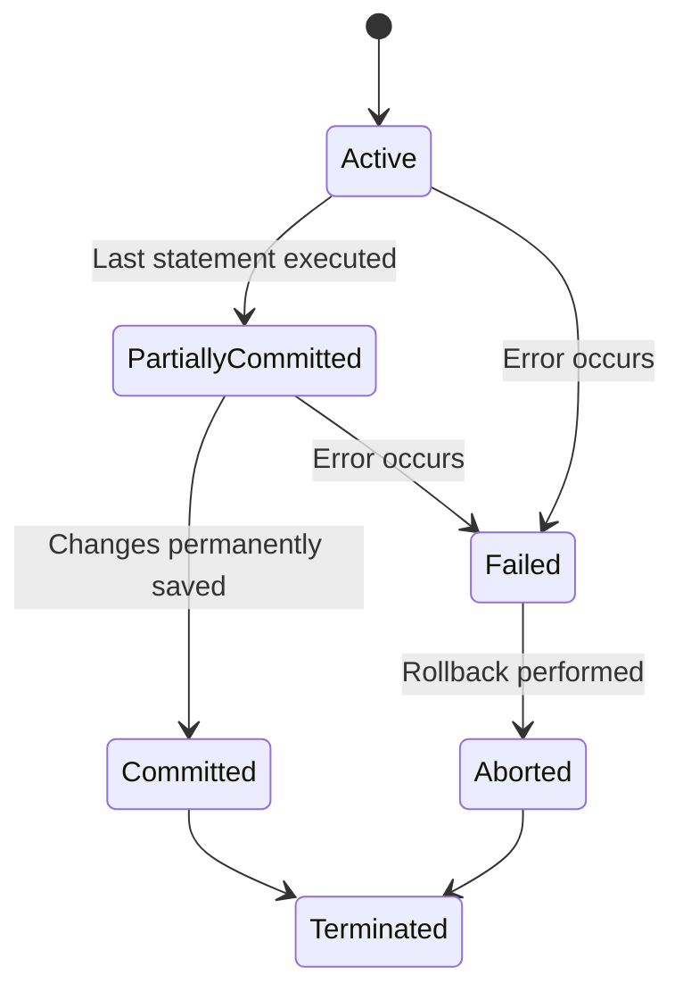

| State | Description |
|---|---|
| **Active** | Initial state; transaction is executing its operations |
| **Partially Committed** | Final statement has executed, but changes are not yet permanently saved to disk |
| **Committed** | Transaction has completed successfully; all changes are permanently saved |
| **Failed** | Normal execution cannot proceed due to an error (e.g., constraint violation, system failure) |
| **Aborted** | Transaction has been rolled back, and the database is restored to its state prior to the transaction |
| **Terminated** | The transaction leaves the system (after commit or abort) |

---

## 2. ACID Properties

**Definition:** ACID is a set of four properties that guarantee reliable processing of database transactions.

| Property | Definition | Real-World Example |
|---|---|---|
| **Atomicity** | A transaction is treated as a single indivisible unit — it either executes completely or not at all ("all or nothing") | In a fund transfer, if the credit operation fails after the debit succeeds, the debit is rolled back too — money isn't lost mid-transfer |
| **Consistency** | A transaction brings the database from one valid state to another, preserving all defined integrity constraints and business rules | Total balance across all accounts remains the same before and after a transfer |
| **Isolation** | Concurrently executing transactions do not interfere with each other — each transaction appears to execute as if it were the only one running | Two customers booking the last movie seat simultaneously don't both succeed |
| **Durability** | Once a transaction is committed, its changes persist even in the event of a system crash or power failure | After an ATM withdrawal is confirmed, the balance update survives even if the server crashes immediately after |

---

## 3. Transaction Schedules

### 3.1 Definitions

| Term | Definition |
|---|---|
| **Schedule** | A chronological sequence of interleaved operations from multiple transactions as executed by the DBMS |
| **Serial Schedule** | Transactions are executed one completely after another, with **no interleaving** of operations |
| **Non-Serial Schedule** | Operations of different transactions are **interleaved** (executed concurrently) |
| **Serializable Schedule** | A non-serial schedule that produces the **same result** as some serial execution of the same transactions — considered "correct" for concurrency purposes |

**Example — Serial Schedule:** T1 fully executes, then T2 fully executes (T1 → T2), or vice versa (T2 → T1).

**Example — Non-Serial (interleaved) Schedule:** Operations of T1 and T2 alternate, e.g., `R1(A), R2(B), W1(A), W2(B)`.

### 3.2 Conflict Serializability vs View Serializability

| Type | Definition |
|---|---|
| **Conflict Serializability** | A schedule is conflict serializable if it can be transformed into a serial schedule by swapping **non-conflicting** adjacent operations |
| **View Serializability** | A schedule is view serializable if it is **view equivalent** to some serial schedule — a broader (less strict) criterion than conflict serializability |

**Relationship:** Every conflict serializable schedule is also view serializable, but not vice versa (view serializability is a superset).


---

## 4. Conflict Serializability

### 4.1 Conflicting Operations

**Definition:** Two operations from **different transactions** on the **same data item** are said to **conflict** if:
1. At least one of them is a `Write` operation, and
2. They belong to different transactions.

| Operation Pair | Conflict? |
|---|---|
| Read-Read (same item, different transactions) | No conflict |
| Read-Write (same item, different transactions) | Conflict |
| Write-Read (same item, different transactions) | Conflict |
| Write-Write (same item, different transactions) | Conflict |

### 4.2 Precedence (Serialization) Graph

**Definition:** A directed graph where each node represents a transaction, and a directed edge `Ti → Tj` is drawn if `Ti` has an operation that **conflicts with** and **precedes** a corresponding operation of `Tj` on the same data item.

### 4.3 Constructing the Graph — Steps

1. Create one node per transaction.
2. Scan the schedule for every pair of conflicting operations `(Oi from Ti, Oj from Tj)`.
3. If `Oi` occurs before `Oj` in the schedule, draw an edge `Ti → Tj`.
4. Repeat for all conflicting pairs.
5. **A schedule is conflict serializable if and only if its precedence graph is acyclic** (contains no cycles).

### 4.4 Worked Example

**Schedule S:**
```
T1: R(A)         W(A)
T2:      R(A)         W(A)
Order:  R1(A), R2(A), W1(A), W2(A)
```

**Conflict analysis:**
- `R1(A)` before `W2(A)` → conflict (Read-Write) → edge `T1 → T2`
- `R2(A)` before `W1(A)` → conflict (Read-Write) → edge `T2 → T1`
- `W1(A)` before `W2(A)` → conflict (Write-Write) → edge `T1 → T2`

**Graph:** `T1 → T2` and `T2 → T1` → **cycle exists** → **NOT conflict serializable**.

**Contrasting Example (serializable):**
```
Order: R1(A), W1(A), R2(A), W2(A)
```
Here, all of T1's operations happen before any of T2's operations touching A → edge only `T1 → T2` → **no cycle** → **conflict serializable** (equivalent to serial schedule `T1 → T2`).

---

## 5. Recoverability

### 5.1 Recoverable Schedule

**Definition:** A schedule is recoverable if, whenever a transaction `Tj` reads a data item written by `Ti`, `Ti` **commits before** `Tj` commits.

### 5.2 Non-Recoverable Schedule

**Definition:** A schedule where a transaction commits **after reading uncommitted data** from another transaction that later aborts — making it impossible to properly undo the effect, since the reading transaction has already committed.

**Example (non-recoverable):**
```
T1: W(A)         (T1 later aborts)
T2:      R(A), Commit
```
T2 commits after reading A written by uncommitted T1; if T1 aborts afterward, T2's committed result is now based on data that no longer "existed" — cannot be undone. **Non-recoverable.**

### 5.3 Cascading Rollback

**Definition:** A single transaction's abort forces one or more other **dependent** transactions (which read its uncommitted data) to also be rolled back — potentially cascading through many transactions.

### 5.4 Cascadeless Schedule

**Definition:** A schedule where every transaction reads only values written by **already-committed** transactions — avoiding cascading rollbacks entirely.

### 5.5 Strict Schedule

**Definition:** A schedule where transactions can neither **read nor write** a data item until the transaction that last wrote it has **committed or aborted**. Strict schedules are the most restrictive and easiest to recover from.

### 5.6 Comparison

| Schedule Type | Guarantees | Allows Cascading Rollback? |
|---|---|---|
| Recoverable | Basic correctness — committed transactions never depend on aborted ones | Yes (still possible) |
| Cascadeless | Stronger — reads only committed data | No |
| Strict | Strongest — no read/write until prior writer commits/aborts | No |


**Hierarchy:** `Strict ⊂ Cascadeless ⊂ Recoverable ⊂ All Schedules` — every strict schedule is cascadeless, every cascadeless schedule is recoverable, but not vice versa.

---

## 6. Concurrency Control

### 6.1 Why Concurrency Control Is Needed

**Explanation:** When multiple transactions execute simultaneously without coordination, their interleaved operations can lead to **inconsistent or incorrect results** — concurrency control mechanisms (locking, timestamps, etc.) ensure isolation and correctness despite concurrent execution.

### 6.2 Concurrency Anomalies

| Anomaly | Definition | Example |
|---|---|---|
| **Lost Update** | Two transactions read the same value, then both update it based on the stale read — one update is silently overwritten/lost | T1 reads Balance=100, T2 reads Balance=100; T1 writes 100+50=150; T2 writes 100+30=130 (T1's update is lost) |
| **Dirty Read** | A transaction reads data written by another transaction that has **not yet committed** — if that transaction later rolls back, the read data becomes invalid | T1 updates Balance to 200 (uncommitted); T2 reads Balance=200; T1 rolls back to 100; T2's read was "dirty" |
| **Non-Repeatable Read** | A transaction reads the same row twice and gets **different values** because another committed transaction modified it in between | T1 reads Balance=100; T2 updates and commits Balance=150; T1 re-reads Balance=150 within the same transaction |
| **Phantom Read** | A transaction re-executes a query returning a set of rows matching a condition, and finds **new rows** (phantoms) inserted by another committed transaction in between | T1 counts students with Age>20 (gets 3); T2 inserts a new student with Age=25 and commits; T1 re-runs the count and gets 4 |

**Example — Lost Update (transaction timeline):**

| Time | T1 | T2 |
|---|---|---|
| t1 | Read Balance (100) | |
| t2 | | Read Balance (100) |
| t3 | Write Balance = 150 | |
| t4 | | Write Balance = 130 |

Final Balance = 130 — T1's update is **lost**.

---

## 7. Lock-Based Protocols

### 7.1 Lock Types

| Lock Type | Also Called | Permits |
|---|---|---|
| **Shared Lock (S)** | Read lock | Multiple transactions can hold a shared lock simultaneously on the same item and **read** it, but none can write |
| **Exclusive Lock (X)** | Write lock | Only one transaction can hold an exclusive lock; permits both **read and write**; no other transaction can hold any lock on that item simultaneously |

### 7.2 Lock Compatibility Matrix

| Requested \ Held | S (Shared) | X (Exclusive) |
|---|---|---|
| **S (Shared)** | ✅ Compatible | ❌ Not Compatible |
| **X (Exclusive)** | ❌ Not Compatible | ❌ Not Compatible |

### 7.3 Two-Phase Locking (2PL)

**Definition:** A concurrency control protocol where every transaction acquires all necessary locks in a **Growing Phase** and releases them in a **Shrinking Phase**, with **no new locks acquired once any lock has been released**.


| Phase | Behavior |
|---|---|
| **Growing Phase** | Transaction can only **acquire** locks, never release |
| **Shrinking Phase** | Transaction can only **release** locks, never acquire |

**Guarantee:** Basic 2PL guarantees **conflict serializability** but does **not** by itself prevent cascading rollbacks.

### 7.4 Strict 2PL

**Definition:** All **exclusive** locks held by a transaction are released **only after** the transaction commits or aborts (shared locks may be released earlier). Prevents other transactions from reading/overwriting uncommitted writes — ensures cascadeless (in fact, strict) schedules.

### 7.5 Rigorous 2PL

**Definition:** **All locks** (both shared and exclusive) are held until the transaction commits or aborts — the strictest variant, simplifying recovery and guaranteeing strict schedules.

| Protocol | Locks Released | Guarantees |
|---|---|---|
| Basic 2PL | Any time after lock point (growing phase ends) | Conflict serializability only |
| Strict 2PL | X-locks held until commit/abort | Cascadeless + serializable |
| Rigorous 2PL | All locks (S and X) held until commit/abort | Strict schedules + serializable |

---

## 8. Deadlocks in DBMS

### 8.1 Deadlock

**Definition:** A situation where two or more transactions are each waiting for a lock held by another transaction in the set, resulting in a cycle of waits where **none can proceed**.

### 8.2 Necessary Conditions (Coffman Conditions)

1. **Mutual Exclusion** — a resource can be held by only one transaction at a time
2. **Hold and Wait** — a transaction holds at least one resource while waiting for another
3. **No Preemption** — a resource cannot be forcibly taken from a transaction holding it
4. **Circular Wait** — a cycle of transactions exists, each waiting for a resource held by the next

### 8.3 Deadlock Handling Strategies

| Strategy | Approach |
|---|---|
| **Deadlock Prevention** | Ensures the system design makes deadlock **structurally impossible** (e.g., all transactions request all locks upfront; imposing a strict lock-ordering on resources) |
| **Deadlock Avoidance** | Grants lock requests only if it can be proven that doing so will **not** lead to deadlock (e.g., using timestamp ordering schemes like **Wait-Die** and **Wound-Wait**) |
| **Deadlock Detection** | Allows the system to enter a wait state and periodically checks for deadlocks (e.g., via a **wait-for graph**), then resolves them if found |
| **Deadlock Recovery** | Once detected, the system must break the deadlock — typically by **aborting one or more transactions** (the "victim") and rolling back their effects |

### 8.4 Wait-For Graph

**Definition:** A directed graph where nodes are transactions, and an edge `Ti → Tj` means `Ti` is waiting for a lock held by `Tj`. **A cycle in the wait-for graph indicates a deadlock.**

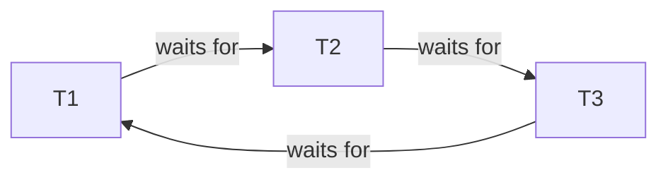

*(Cycle T1 → T2 → T3 → T1 indicates a deadlock.)*

### 8.5 Prevention vs Avoidance vs Detection

| Aspect | Prevention | Avoidance | Detection |
|---|---|---|---|
| Approach | Restricts how resources can be requested | Grants requests only if provably safe | Allows deadlocks, finds and resolves them |
| Overhead | Can restrict concurrency significantly | Requires knowledge of future/timestamp checks | Periodic graph checks (some runtime overhead) |
| Resource utilization | Often lower (conservative) | Moderate | Higher (optimistic) |
| Example technique | Lock ordering, requesting all locks at start | Wait-Die, Wound-Wait schemes | Wait-for graph cycle detection |

---

## 9. Timestamp-Based Protocols

### 9.1 Timestamp Ordering

**Definition:** Each transaction is assigned a unique **timestamp** at the start (typically based on system clock or a counter), and conflicting operations are ordered according to these timestamps — ensuring a serializable schedule equivalent to the order in which transactions started.

### 9.2 Basic Timestamp Protocol

**Rule:** For each data item, the system maintains:
- `Read_TS(X)` — largest timestamp of any transaction that successfully read X
- `Write_TS(X)` — largest timestamp of any transaction that successfully wrote X

For a transaction `Ti` with timestamp `TS(Ti)`:
- **Read(X):** rejected (Ti rolled back) if `TS(Ti) < Write_TS(X)` (i.e., a newer transaction already wrote X)
- **Write(X):** rejected (Ti rolled back) if `TS(Ti) < Read_TS(X)` or `TS(Ti) < Write_TS(X)`

### 9.3 Thomas Write Rule (Conceptual)

**Definition:** A relaxation of the basic timestamp write rule — if `TS(Ti) < Write_TS(X)`, instead of rejecting the write, the write can simply be **ignored** (since a later transaction has already overwritten X with a more recent value), rather than aborting `Ti`. This improves concurrency by allowing certain "obsolete" writes to be skipped without violating serializability.

---

## 10. Isolation Levels

### 10.1 Definition

**Isolation levels** define the degree to which one transaction must be isolated from the effects of other concurrently running transactions — offering a trade-off between **consistency** and **concurrency/performance**.

### 10.2 Isolation Levels and Anomalies Prevented

| Isolation Level | Dirty Read | Non-Repeatable Read | Phantom Read |
|---|---|---|---|
| **Read Uncommitted** | Possible | Possible | Possible |
| **Read Committed** | Prevented | Possible | Possible |
| **Repeatable Read** | Prevented | Prevented | Possible |
| **Serializable** | Prevented | Prevented | Prevented |

| Level | Description |
|---|---|
| **Read Uncommitted** | Transactions may read uncommitted (dirty) data from other transactions — lowest isolation, highest concurrency |
| **Read Committed** | Transactions only read data that has been committed at the time of the read — but repeated reads within the same transaction may see different committed values |
| **Repeatable Read** | Guarantees that if a row is read twice within the same transaction, its value will not change — but new rows (phantoms) may still appear |
| **Serializable** | Highest isolation level — transactions execute as though run one at a time in some serial order; prevents all three anomalies |

**Note:** Exact behavior and default isolation level vary across RDBMS implementations (e.g., PostgreSQL's default is Read Committed; MySQL's InnoDB default is Repeatable Read, and it additionally prevents most phantom reads via next-key locking).

---

## 11. SQL Transactions

### 11.1 Transaction Control Commands

```sql
BEGIN;   -- or START TRANSACTION;

UPDATE Account SET Balance = Balance - 5000 WHERE AccountID = 'A1';
UPDATE Account SET Balance = Balance + 5000 WHERE AccountID = 'A2';

COMMIT;   -- makes changes permanent
```

### 11.2 ROLLBACK

```sql
BEGIN;

UPDATE Account SET Balance = Balance - 5000 WHERE AccountID = 'A1';
-- Suppose an error is detected here (e.g., insufficient balance)
ROLLBACK;   -- undoes all changes made since BEGIN
```

### 11.3 SAVEPOINT and ROLLBACK TO SAVEPOINT

```sql
BEGIN;

UPDATE Account SET Balance = Balance - 5000 WHERE AccountID = 'A1';
SAVEPOINT after_debit;

UPDATE Account SET Balance = Balance + 5000 WHERE AccountID = 'A2';
-- Suppose a validation error occurs on the credit step
ROLLBACK TO after_debit;   -- undoes only the credit step, keeps the debit

COMMIT;   -- commits with just the debit applied (illustrative example)
```

**Banking example explanation:** `SAVEPOINT` allows partial rollback within a transaction — useful when only part of a multi-step transaction needs to be undone without discarding everything since `BEGIN`.

---

## 12. Database Recovery

### 12.1 Failure Types

| Failure Type | Description |
|---|---|
| **Transaction Failure** | A transaction cannot continue due to a logical error (e.g., constraint violation) or system-detected error (e.g., deadlock victim) |
| **System Crash** | A hardware or software failure (e.g., power loss, OS crash) causes loss of main memory content, but disk storage is assumed intact |
| **Media Failure** | Physical damage to the storage device (e.g., disk head crash) causing loss of stored data itself |

### 12.2 Log-Based Recovery

**Definition:** The DBMS maintains a **log** — a sequential record of all changes made to the database (before and/or after values) — used to undo or redo operations during recovery.

### 12.3 Write-Ahead Logging (WAL)

**Definition:** A fundamental rule stating that **log records for a change must be written to stable storage before the corresponding data change is written to disk** — ensuring that, in case of a crash, the log always has enough information to undo/redo incomplete transactions.

### 12.4 Deferred Update

**Definition:** Database modifications are **not** written to disk until a transaction reaches its commit point — the log is used only for **redo** (since uncommitted changes never touched the actual database, no undo is needed).

### 12.5 Immediate Update

**Definition:** Database modifications may be written to disk **before** a transaction commits — requiring both **undo** (for uncommitted changes if the transaction fails) and **redo** (for committed changes not yet flushed to disk) capability during recovery.

### 12.6 Checkpoints

**Definition:** A point in time at which the DBMS records the current state (all committed transaction effects flushed to disk, and log truncated up to that point) to reduce the amount of log that must be processed during recovery after a crash.

**Explanation:** Without checkpoints, recovery would need to scan the log from the very beginning of time; checkpoints let recovery start scanning from the most recent checkpoint instead.

### 12.7 Undo / Redo / Undo-Redo

| Operation | Purpose | Used When |
|---|---|---|
| **Undo** | Reverses the effects of an operation performed by an uncommitted (or aborted) transaction | Immediate update scheme, or any incomplete transaction at crash time |
| **Redo** | Re-applies the effects of an operation from a **committed** transaction that may not have been flushed to disk before the crash | Deferred and immediate update schemes |
| **Undo/Redo** | A general recovery algorithm that may need to both undo incomplete transactions and redo committed-but-unflushed transactions, based on log analysis | Systems using immediate update with checkpoints |

```mermaid
flowchart TD
    A[Crash Occurs] --> B[Scan Log from Last Checkpoint]
    B --> C{Transaction Status?}
    C -->|Committed but not flushed| D[REDO]
    C -->|Active/Uncommitted at crash| E[UNDO]
```

---

## 13. Indexing

### 13.1 What Is an Index?

**Definition:** An index is an auxiliary data structure that improves the speed of data retrieval operations on a table, at the cost of additional storage space and slower write operations (since indexes must also be updated).

### 13.2 Why Indexes Improve Search

**Explanation:** Without an index, the DBMS must perform a **full table scan** (examine every row) to find matching records — `O(n)` complexity. An index (typically a sorted structure like a B+ Tree) allows the DBMS to **directly locate** matching records in roughly `O(log n)` time, without scanning the whole table.

### 13.3 Advantages / Disadvantages

| Advantages | Disadvantages |
|---|---|
| Drastically faster lookups/searches (`WHERE`, `JOIN`, `ORDER BY`) | Extra disk space required |
| Speeds up sorting and range queries | Slower `INSERT`/`UPDATE`/`DELETE` (index must be maintained) |
| Can enforce uniqueness (via unique indexes) | Too many indexes can degrade overall write performance |

### 13.4 Types of Indexes

| Index Type | Definition |
|---|---|
| **Primary Index** | An index built on the primary key column(s) of a table, whose data file is (typically) sorted on that key |
| **Secondary Index** | An index on a non-primary-key column, used for additional fast lookups; the underlying data file is not necessarily sorted on this column |
| **Clustered Index** | An index where the **physical order** of data rows in storage matches the index order — a table can have **only one** clustered index (since data can only be physically sorted one way) |
| **Non-Clustered Index** | An index that maintains a separate structure of pointers to the actual data rows, without altering physical row order — a table can have **multiple** non-clustered indexes |
| **Dense Index** | Contains an index entry for **every** search key value (every record) in the data file |
| **Sparse Index** | Contains index entries only for **some** records (typically one entry per block/page), relying on sequential storage to locate nearby records |

**Common confusion:** "Primary index" (relating to the key used) and "clustered index" (relating to physical storage order) are related but distinct concepts — in many systems, the primary key index is implemented as the clustered index by default, but this is an implementation choice, not a strict rule.

---

## 14. B-Tree and B+ Tree

### 14.1 B-Tree Structure

**Definition:** A **self-balancing** multi-way search tree where each node can contain multiple keys and children, keeping all leaf nodes at the same depth. In a B-Tree, **both internal and leaf nodes store actual data pointers/records** alongside keys.

```mermaid
flowchart TD
    Root["30 | 60"] --> A["10 | 20"]
    Root --> B["40 | 50"]
    Root --> C["70 | 80"]
```

### 14.2 B+ Tree Structure

**Definition:** A variant of the B-Tree where **all actual data records (or pointers to them) are stored only in leaf nodes**; internal nodes store only **keys** used for navigation/routing. Additionally, **leaf nodes are linked together sequentially** (forming a linked list) to support efficient range queries.

```mermaid
flowchart TD
    Root["30 | 60"] --> A["10 | 20"]
    Root --> B["40 | 50"]
    Root --> C["70 | 80"]
    A -.->|linked| B
    B -.->|linked| C
```

### 14.3 Search, Insert, Delete (Conceptual)

| Operation | B+ Tree Behavior |
|---|---|
| **Search** | Traverse from root to leaf, comparing keys at each internal node to decide which child to follow; actual record found at the leaf level |
| **Insert** | Locate the correct leaf, insert the key in sorted order; if the leaf overflows (exceeds capacity), **split** the leaf into two and push the middle key up to the parent (may cascade upward) |
| **Delete** | Locate and remove the key from the leaf; if the leaf underflows (falls below minimum capacity), **redistribute** keys from a sibling or **merge** with a sibling, adjusting parent keys accordingly |

### 14.4 Why Databases Commonly Use B+ Trees

- All records reside at the **leaf level**, at a **uniform depth**, giving predictable, balanced search time.
- **Linked leaf nodes** allow efficient **sequential/range scans** (e.g., `BETWEEN`, `>`, `ORDER BY`) without repeatedly traversing back up the tree.
- Internal nodes store only keys (not full records), allowing **higher fan-out** (more children per node) — this keeps the tree shallower, reducing disk I/O, which is critical since each node access typically corresponds to one disk block read.

### 14.5 B-Tree vs B+ Tree Comparison

| Aspect | B-Tree | B+ Tree |
|---|---|---|
| Data storage location | Both internal and leaf nodes | Only leaf nodes |
| Leaf node linking | Not linked | Linked sequentially (linked list) |
| Range query efficiency | Less efficient (requires tree traversal) | Highly efficient (sequential leaf scan) |
| Key duplication | Keys appear only once in the tree | Keys may be duplicated (once for navigation in internal nodes, once in leaves) |
| Fan-out (children per node) | Lower (since internal nodes also store data pointers) | Higher (internal nodes store only keys) |
| Common usage | Less common in modern RDBMS indexing | Standard structure used by most RDBMS (MySQL InnoDB, PostgreSQL, Oracle, SQL Server) |

---

## 15. Hash Indexing

### 15.1 Hashing

**Definition:** A technique that applies a **hash function** to a search key to compute a **bucket address**, where the corresponding record is stored or can be found — designed for very fast **equality lookups** (`=`), though not suited for range queries.

### 15.2 Hash Index

**Definition:** An index structure based on hashing, mapping key values to bucket locations via a hash function, rather than maintaining a sorted structure like a tree.

### 15.3 Static Hashing

**Definition:** The number of buckets is **fixed** at the time of index creation. If the data grows significantly beyond the bucket capacity, performance degrades due to excessive **collisions** and overflow chains.

### 15.4 Dynamic Hashing

**Definition:** The number of buckets **grows or shrinks** dynamically as the data volume changes (e.g., using techniques like extendible hashing or linear hashing), avoiding the fixed-capacity limitation of static hashing.

### 15.5 Collision and Bucket

| Term | Definition |
|---|---|
| **Bucket** | A storage unit (often a disk block) that holds one or more records mapped to it by the hash function |
| **Collision** | Occurs when two different search key values hash to the **same bucket address**; handled via techniques like chaining (overflow buckets) or open addressing |

### 15.6 Hashing vs Tree-Based Indexing

| Aspect | Hash Indexing | Tree-Based (B+ Tree) Indexing |
|---|---|---|
| Best suited for | Exact-match equality queries (`=`) | Equality **and** range queries (`<`, `>`, `BETWEEN`, `ORDER BY`) |
| Range query support | Not supported (hash destroys ordering) | Well supported (sorted structure) |
| Lookup complexity | ~O(1) average case | O(log n) |
| Common default in RDBMS | Rare as default (used for specific cases, e.g., hash joins/hash indexes in PostgreSQL) | Standard default for most primary/secondary indexes |

---

## 16. Query Processing and Optimization

### 16.1 Stages of Query Processing

```mermaid
flowchart LR
    A[SQL Query] --> B[Parsing & Translation]
    B --> C[Query Optimization]
    C --> D[Query Execution Plan]
    D --> E[Execution Engine]
    E --> F[Result]
```

| Stage | Description |
|---|---|
| **Query Parsing** | Checks SQL syntax and translates the query into an internal representation (often a relational algebra expression tree) |
| **Query Optimization** | Evaluates multiple possible execution strategies (access paths, join orders, join algorithms) and selects the most efficient one |
| **Query Execution** | The chosen execution plan is carried out by the database engine to produce the actual result |
| **Query Execution Plan** | The concrete sequence of physical operations (e.g., "index scan on Student", "nested loop join with Enrollment") chosen by the optimizer |

### 16.2 Cost-Based Optimization

**Definition:** The optimizer estimates the **execution cost** (typically in terms of estimated disk I/O, CPU usage) of multiple candidate execution plans, using statistics about table sizes, index availability, and data distribution, then selects the plan with the **lowest estimated cost**.

### 16.3 Heuristic Optimization

**Definition:** Applies general **rule-of-thumb transformations** to a query (independent of data statistics) that are known to typically improve performance — e.g., performing selections (`WHERE` filters) as early as possible, or projecting out unneeded columns early, before performing joins.

### 16.4 Why Indexes Affect Query Performance

**Explanation:** The query optimizer chooses between a **full table scan** and an **index scan** based on estimated cost. If a suitable index exists on a filtered/joined column, the optimizer can avoid scanning the entire table, dramatically reducing I/O — this is why adding appropriate indexes on frequently filtered/joined columns is one of the most effective ways to speed up query performance.

---

## 17. Storage

### 17.1 Disk Storage Hierarchy

**Definition:** Databases are ultimately stored as files on **disk**, organized into fixed-size **blocks/pages** — the fundamental unit of I/O transfer between disk and main memory.

```mermaid
flowchart TD
    DB[Database] --> Files[Files]
    Files --> Blocks[Blocks / Pages]
    Blocks --> Records[Records / Rows]
```

| Term | Definition |
|---|---|
| **Block / Page** | A fixed-size unit of disk storage (commonly 4KB–16KB) that the DBMS reads/writes as a whole — minimizing the number of separate disk I/O operations |
| **Record** | A single row's worth of data stored within a block |

### 17.2 File Organization Types

| Organization | Description |
|---|---|
| **Heap File** | Records are stored in **no particular order** — new records are simply appended; fast inserts, but searches require a full scan unless supplemented by an index |
| **Sequential File** | Records are stored **physically sorted** by a key field — efficient for range queries and ordered scans, but insertions may require reorganizing/shifting records |
| **Hash-Based Organization** | Records are placed into **buckets** determined by a hash function applied to a key — very fast equality lookups, but poor for range queries (see Section 15) |

---

## Part 5 Quick Revision

- **Transaction states:** Active → Partially Committed → Committed → Terminated; or Active/Partially Committed → Failed → Aborted → Terminated.
- **ACID:** Atomicity (all-or-nothing), Consistency (valid state to valid state), Isolation (concurrent transactions don't interfere), Durability (committed changes survive crashes).
- **Schedules:** Serial (no interleaving) vs Non-serial (interleaved); Serializable = equivalent in effect to some serial schedule. Conflict serializability (via swapping non-conflicting operations / acyclic precedence graph) ⊂ View serializability.
- **Conflicting operations:** same data item, different transactions, at least one is a Write.
- **Precedence graph:** edge `Ti → Tj` if a conflicting operation of `Ti` precedes one of `Tj`; **acyclic graph ⇒ conflict serializable**.
- **Recoverability hierarchy:** Strict ⊂ Cascadeless ⊂ Recoverable ⊂ All schedules. Recoverable = committing transaction never depends on a later-aborted one; Cascadeless = reads only committed data; Strict = no read/write until prior writer commits/aborts.
- **Concurrency anomalies:** Lost Update (overwritten update), Dirty Read (reads uncommitted data), Non-Repeatable Read (same row changes value on re-read), Phantom Read (new rows appear on re-query).
- **Locks:** Shared (S, read) vs Exclusive (X, read+write); S-S compatible, all other combinations incompatible.
- **2PL:** Growing phase (acquire only) → Shrinking phase (release only). Strict 2PL: X-locks held till commit/abort. Rigorous 2PL: all locks held till commit/abort.
- **Deadlock:** Requires Mutual Exclusion, Hold-and-Wait, No Preemption, Circular Wait. Handling: Prevention (structurally impossible), Avoidance (grant only if provably safe), Detection (wait-for graph cycle check + recovery via victim rollback).
- **Timestamp ordering:** Read/Write rejected if it violates timestamp order relative to `Read_TS`/`Write_TS`; Thomas Write Rule allows ignoring obsolete writes instead of aborting.
- **Isolation levels (weakest → strongest):** Read Uncommitted (all 3 anomalies possible) → Read Committed (no dirty reads) → Repeatable Read (no dirty/non-repeatable reads) → Serializable (no anomalies at all). Behavior varies by RDBMS.
- **SQL TCL:** `BEGIN`/`START TRANSACTION`, `COMMIT`, `ROLLBACK`, `SAVEPOINT`, `ROLLBACK TO SAVEPOINT` (partial undo).
- **Failure types:** Transaction failure, System crash, Media failure. **WAL:** log record written before data change on disk. **Deferred update:** redo-only. **Immediate update:** undo + redo needed. **Checkpoints:** limit log scan range during recovery.
- **Index types:** Primary vs Secondary; Clustered (physical order = index order, one per table) vs Non-Clustered (separate pointer structure, many per table); Dense (entry per record) vs Sparse (entry per block).
- **B-Tree vs B+ Tree:** B-Tree stores data in internal + leaf nodes; B+ Tree stores data only in leaves, with leaves linked sequentially — enabling efficient range queries; B+ Tree is the standard RDBMS index structure.
- **Hashing:** maps keys to bucket addresses via a hash function; static (fixed buckets) vs dynamic (growable buckets); excellent for equality lookups, poor for range queries (unlike B+ Trees).
- **Query processing pipeline:** Parsing → Optimization (cost-based or heuristic) → Execution Plan → Execution. Indexes let the optimizer avoid full table scans, reducing I/O cost.
- **Storage hierarchy:** Database → Files → Blocks/Pages → Records. File organization: Heap (unordered, fast insert), Sequential (sorted, good for range scans), Hash-based (fast equality lookup).

---

*(End of Part 5 — Transactions, Concurrency, Recovery, Indexing and Storage.)*

---

# PART 6: DISTRIBUTED DATABASES, NOSQL, MODERN DBMS AND FINAL REVISION

---

## 1. Distributed Databases

### 1.1 What Is a Distributed Database?

**Definition:** A distributed database is a single logical database whose data is **physically stored across multiple, geographically or network-separated sites/nodes**, managed by a Distributed DBMS (D-DBMS) that makes the distribution transparent to users — the system behaves, from the user's view, as a single unified database.

### 1.2 Advantages

- Improved reliability and availability (no single point of failure if data is replicated)
- Better performance for geographically distributed users (data located closer to demand)
- Incremental scalability — capacity can grow by adding nodes
- Local autonomy — sites can operate independently to a degree

### 1.3 Disadvantages

- Increased complexity in design, management, and query processing
- Higher cost of software/network infrastructure
- More complex concurrency control and recovery (coordinating across nodes)
- Network dependency — failures/latency directly impact operations

### 1.4 Homogeneous vs Heterogeneous Distributed Databases

| Type | Definition |
|---|---|
| **Homogeneous** | All sites run the **same DBMS software** and use the **same schema**, simplifying coordination |
| **Heterogeneous** | Sites may run **different DBMS software**, schemas, or even data models, requiring translation/middleware layers to interoperate |

### 1.5 Data Fragmentation

**Definition:** The process of dividing a logical database (a relation) into smaller pieces (fragments) that are distributed across different sites.

| Type | Definition | Example |
|---|---|---|
| **Horizontal Fragmentation** | Divides a relation by **rows** — each fragment contains a subset of tuples, typically based on a condition | `Student` split into `Student_North` and `Student_South` based on region |
| **Vertical Fragmentation** | Divides a relation by **columns** — each fragment contains a subset of attributes (plus the primary key, to allow reconstruction) | `Employee(EmpID, Name, Salary)` split into `Employee_Basic(EmpID, Name)` and `Employee_Payroll(EmpID, Salary)` |
| **Hybrid (Mixed) Fragmentation** | A combination of horizontal and vertical fragmentation applied together | First split `Employee` vertically, then horizontally fragment each vertical piece by department |

```mermaid
flowchart TD
    R[Original Relation] --> H[Horizontal Fragments - by rows]
    R --> V[Vertical Fragments - by columns]
    H --> HY[Hybrid Fragmentation]
    V --> HY
```

### 1.6 Data Replication

**Definition:** Storing **copies of the same data** at multiple sites, to improve availability and read performance, at the cost of additional storage and the overhead of keeping copies synchronized (consistency maintenance).

### 1.7 Data Allocation

**Definition:** The strategy of deciding **which fragments (or replicas) are placed at which sites**, balancing factors like access frequency, network cost, and site reliability.

---

## 2. Distributed Transactions

### 2.1 Distributed Transaction

**Definition:** A transaction that accesses and updates data stored across **multiple sites/nodes** in a distributed database — all sites involved must agree on whether to commit or abort, to preserve atomicity across the whole system.

### 2.2 Two-Phase Commit (2PC)

**Definition:** A protocol that ensures all sites participating in a distributed transaction either **all commit** or **all abort**, preserving atomicity across nodes.

**Roles:**

| Role | Responsibility |
|---|---|
| **Coordinator** | The site that initiates and manages the commit protocol for the distributed transaction |
| **Participants** | The other sites involved in the transaction, which follow the coordinator's instructions |

### 2.3 Phases of 2PC

```mermaid
sequenceDiagram
    participant C as Coordinator
    participant P as Participant(s)
    C->>P: PREPARE (Can you commit?)
    P-->>C: VOTE (Yes / No)
    alt All voted Yes
        C->>P: COMMIT
        P-->>C: ACK
    else Any voted No
        C->>P: ABORT
        P-->>C: ACK
    end
```

| Phase | Description |
|---|---|
| **Prepare Phase (Voting Phase)** | Coordinator asks all participants if they are ready to commit; each participant writes its changes to a durable log and replies "Yes" (ready) or "No" (cannot commit) |
| **Commit Phase (Decision Phase)** | If **all** participants voted "Yes," the coordinator sends a `COMMIT` instruction to all; if **any** voted "No," the coordinator sends `ABORT` to all — participants then acknowledge and finalize accordingly |

### 2.4 Failure Scenarios

- **Participant failure before voting:** Coordinator treats a non-response as a "No" vote and aborts the transaction.
- **Coordinator failure after participants voted "Yes" but before sending the decision:** Participants may be left **blocked**, holding locks and awaiting the coordinator's decision — this is a well-known limitation of 2PC (the "blocking problem").
- **Participant failure after voting but before receiving decision:** Upon recovery, the participant consults its log and may need to query other sites/coordinator for the outcome.

---

## 3. CAP Theorem

### 3.1 The Three Properties

| Property | Definition |
|---|---|
| **Consistency (C)** | Every read receives the **most recent write** or an error — all nodes see the same data at the same time |
| **Availability (A)** | Every request receives a (non-error) response, **without guarantee** that it reflects the most recent write |
| **Partition Tolerance (P)** | The system continues to operate correctly despite **network partitions** (communication failures/breaks between nodes) |

### 3.2 The Theorem, Precisely Stated

**Definition:** In the presence of a **network partition**, a distributed system must choose between **Consistency** and **Availability** — it **cannot guarantee both simultaneously** during that partition. (It is **not** claiming a system can pick only 2 of 3 properties at all times — partition tolerance is generally a practical necessity for any distributed system, so the real trade-off in practice is **C vs A specifically when a partition occurs**.)

```mermaid
flowchart TD
    CAP[CAP Theorem] --> Choice{Network Partition Occurs}
    Choice -->|Choose Consistency| CP[CP System: may reject requests to stay consistent]
    Choice -->|Choose Availability| AP[AP System: always responds, may return stale data]
```

### 3.3 Practical Examples and Trade-off

| System Category | Choice During Partition | Example |
|---|---|---|
| **CP (Consistency + Partition Tolerance)** | Sacrifices availability — may refuse to respond rather than return possibly stale/incorrect data | Traditional RDBMS clusters with strict consistency, HBase, MongoDB (in certain configurations) |
| **AP (Availability + Partition Tolerance)** | Sacrifices strict consistency — always responds, but data may be stale until the partition resolves (eventual consistency) | Cassandra, DynamoDB, CouchDB (in typical configurations) |

**Common confusion:** CAP applies specifically to behavior **during a network partition** — under normal operation (no partition), a well-designed distributed system can provide both consistency and availability; CAP only forces a trade-off when partitions actually occur.

---

## 4. NoSQL Databases

### 4.1 Why NoSQL Exists

**Explanation:** NoSQL databases emerged to address requirements that traditional relational databases handle less naturally: massive horizontal scalability, flexible/evolving schemas, very high write throughput, and storage of semi-structured or unstructured data (as introduced conceptually in Part 1, Section 3.5–3.6).

### 4.2 SQL vs NoSQL (Expanded)

| Aspect | SQL (Relational) | NoSQL |
|---|---|---|
| Schema | Fixed, predefined | Dynamic/flexible |
| Consistency model | Strong (ACID) by default | Often eventual consistency (BASE) |
| Scaling approach | Primarily vertical | Primarily horizontal |
| Relationships | Enforced via joins/foreign keys | Often denormalized/embedded within documents |
| Query language | Standardized SQL | Varies by product (though some offer SQL-like syntax) |
| Best fit | Structured data with complex transactional needs | Large-scale, rapidly evolving, or unstructured data |

### 4.3 NoSQL Types and When Each Is Useful

| Type | Data Model | Best Used For | Example Systems |
|---|---|---|---|
| **Key-Value** | Simple key → value pairs | Caching, session storage, very high-throughput simple lookups | Redis, DynamoDB |
| **Document** | Semi-structured documents (JSON/BSON-like), can nest data | Content management, catalogs, applications with evolving/flexible schemas | MongoDB, CouchDB |
| **Column-Family** | Data organized into column families rather than fixed rows | Large-scale analytics, time-series data, write-heavy workloads | Cassandra, HBase |
| **Graph** | Nodes and edges representing entities and relationships | Social networks, recommendation engines, fraud detection (relationship-heavy queries) | Neo4j, ArangoDB |

---

## 5. BASE

### 5.1 Definition

**BASE** is an alternative consistency model (contrasted with ACID) commonly associated with NoSQL/distributed systems that favor availability over strict consistency.

| Component | Meaning |
|---|---|
| **Basically Available** | The system guarantees availability of data, in the sense that it will respond to requests, though the response may not reflect the most recent write |
| **Soft State** | The state of the system may change over time, even without new input, as data propagates/synchronizes across nodes toward consistency |
| **Eventual Consistency** | If no new updates occur, all replicas will **eventually** converge to the same value, given enough time |

### 5.2 ACID vs BASE

| Aspect | ACID | BASE |
|---|---|---|
| Consistency | Strong, immediate | Eventual (over time) |
| Availability | May be sacrificed for consistency (in CP-style systems) | Prioritized |
| Typical usage | Traditional RDBMS, financial transactions | NoSQL/distributed systems, large-scale web applications |
| Design philosophy | Pessimistic — prevent inconsistency | Optimistic — allow temporary inconsistency, resolve later |

---

## 6. Database Scaling

### 6.1 Vertical vs Horizontal Scaling

| Type | Definition | Example |
|---|---|---|
| **Vertical Scaling ("Scale Up")** | Increasing the capacity of a **single** server (more CPU, RAM, faster disks) | Upgrading a database server from 16GB to 128GB RAM |
| **Horizontal Scaling ("Scale Out")** | Adding **more servers/nodes** to distribute the load | Adding additional database nodes to a cluster |

### 6.2 Replication

**Definition:** Maintaining multiple copies of the same data across different nodes, typically to improve availability, fault tolerance, and read performance.

### 6.3 Leader/Follower (Master/Replica) Concept

**Definition:** In a common replication topology, one node (the **leader/master**) accepts write operations, and one or more **follower/replica** nodes receive copies of the data (often asynchronously) and primarily serve **read** requests — reducing load on the leader.

```mermaid
flowchart TD
    Client -->|Writes| Leader[(Leader / Master)]
    Leader -->|Replicates| F1[(Follower 1)]
    Leader -->|Replicates| F2[(Follower 2)]
    ClientRead[Read Clients] --> F1
    ClientRead --> F2
```

### 6.4 Sharding and Partitioning

| Term | Definition |
|---|---|
| **Partitioning** | The general concept of splitting a large dataset into smaller, more manageable pieces (**partitions**), which may reside on the same or different servers |
| **Sharding** | A specific form of **horizontal partitioning** where different partitions ("shards") are distributed across **separate database servers/nodes**, each handling a subset of the total data |

### 6.5 Partitioning vs Sharding

| Aspect | Partitioning | Sharding |
|---|---|---|
| Scope | Can occur within a single server (e.g., table partitioning) or across servers | Specifically distributes data across **multiple** servers |
| Purpose | Manageability, query performance on large tables | Horizontal scalability of storage and throughput across a cluster |
| Relationship | Sharding is a specific, distributed **type** of partitioning | — |

### 6.6 Replication vs Sharding

| Aspect | Replication | Sharding |
|---|---|---|
| Data on each node | **Same** data copied across nodes | **Different** subset of data on each node |
| Primary goal | Availability, fault tolerance, read scalability | Write/storage scalability, handling datasets too large for one server |
| Complementary use | Often used **together** — each shard may itself be replicated for fault tolerance | — |

---

## 7. Database Security

### 7.1 Authentication vs Authorization

| Term | Definition |
|---|---|
| **Authentication** | Verifying **who** a user is (e.g., via username/password, certificates) |
| **Authorization** | Determining **what** an authenticated user is permitted to do (which data/operations they can access) |

### 7.2 Roles and Privileges

**Definition:** A **role** is a named collection of privileges that can be granted to users, simplifying permission management (rather than granting privileges individually to each user). A **privilege** is a specific permission to perform an operation (e.g., `SELECT`, `INSERT`) on a specific database object.

```sql
-- Granting privileges
GRANT SELECT, INSERT ON Student TO analyst_role;

-- Revoking privileges
REVOKE INSERT ON Student FROM analyst_role;
```

### 7.3 SQL Injection

**Definition:** A security vulnerability where an attacker manipulates a poorly constructed SQL query (typically by injecting malicious input through unsanitized user input concatenated directly into SQL strings) to execute unintended SQL commands.

**Vulnerable example (illustrative, do not use):**
```sql
-- User input directly concatenated into the query string — DANGEROUS
"SELECT * FROM Student WHERE Name = '" + userInput + "'"
```
If `userInput` is `' OR '1'='1`, the resulting query becomes `... WHERE Name = '' OR '1'='1'`, which returns **all rows**, bypassing the intended filter.

### 7.4 Parameterized Queries / Prepared Statements

**Definition:** A technique where SQL query structure is defined separately from user-supplied values, which are bound as **parameters** rather than concatenated as raw text — the database treats parameter values strictly as data, never as executable SQL, eliminating injection risk.

**Safe example (parameterized query, illustrative syntax):**
```sql
-- Prepared statement with a placeholder parameter
PREPARE stmt FROM 'SELECT * FROM Student WHERE Name = ?';
SET @name = 'Anita';
EXECUTE stmt USING @name;
```

### 7.5 Principle of Least Privilege

**Definition:** Users and applications should be granted **only the minimum privileges** necessary to perform their required tasks — reducing the potential impact of compromised accounts or accidental misuse.

### 7.6 Encryption (Conceptual)

**Definition:** Protecting data by transforming it into an unreadable form without the correct decryption key — commonly applied as **encryption at rest** (data stored on disk) and **encryption in transit** (data moving over the network).

### 7.7 Auditing

**Definition:** The practice of recording (logging) database activities — such as who accessed what data and when — to support security monitoring, compliance, and forensic investigation after incidents.

---

## 8. Stored Procedures, Functions and Triggers

### 8.1 Definitions

| Concept | Definition |
|---|---|
| **Stored Procedure** | A precompiled, named block of SQL/procedural code stored in the database, which can accept parameters and perform actions (including data modification); invoked explicitly via `CALL`/`EXEC` |
| **User-Defined Function (UDF)** | Similar to a stored procedure, but **must return a value** and is typically usable directly within SQL expressions (e.g., inside a `SELECT` list) |
| **Trigger** | A block of code that executes **automatically** in response to a specified database event (`INSERT`, `UPDATE`, `DELETE`) on a specified table — cannot be called explicitly |

### 8.2 Comparison

| Aspect | Stored Procedure | Function | Trigger |
|---|---|---|---|
| Invocation | Explicit (`CALL`) | Explicit, usable in expressions | Automatic (event-driven) |
| Return value | Optional (via OUT parameters) | Mandatory | None |
| Can modify data? | Yes | Typically restricted/discouraged | Yes |
| Typical use | Encapsulating business logic/batch operations | Reusable computations | Enforcing rules, auditing, maintaining derived data automatically |

### 8.3 Stored Procedure Example (illustrative MySQL-style syntax)

```sql
DELIMITER //
CREATE PROCEDURE GetStudentsByDept(IN deptId VARCHAR(5))
BEGIN
    SELECT Name, Age FROM Student WHERE DeptID = deptId;
END //
DELIMITER ;

CALL GetStudentsByDept('D1');
```

### 8.4 User-Defined Function Example

```sql
DELIMITER //
CREATE FUNCTION GetAgeCategory(age INT) RETURNS VARCHAR(10)
DETERMINISTIC
BEGIN
    IF age < 18 THEN RETURN 'Minor';
    ELSE RETURN 'Adult';
    END IF;
END //
DELIMITER ;

SELECT Name, GetAgeCategory(Age) FROM Student;
```

### 8.5 Triggers: BEFORE vs AFTER

| Trigger Type | Fires | Typical Use |
|---|---|---|
| **BEFORE Trigger** | Before the triggering event is applied to the table | Validating/modifying data before it is written (e.g., auto-correcting a value) |
| **AFTER Trigger** | After the triggering event has been applied | Auditing, cascading updates to other tables, logging |

```sql
CREATE TRIGGER trg_BeforeInsertStudent
BEFORE INSERT ON Student
FOR EACH ROW
BEGIN
    IF NEW.Age < 0 THEN
        SET NEW.Age = NULL;
    END IF;
END;
```

### 8.6 Row-Level vs Statement-Level (Conceptual)

| Type | Definition |
|---|---|
| **Row-Level Trigger** | Fires **once for each row** affected by the triggering statement |
| **Statement-Level Trigger** | Fires **once for the entire statement**, regardless of how many rows it affects |

---

## 9. Cursors

### 9.1 What Is a Cursor?

**Definition:** A cursor is a database object that allows **row-by-row** procedural processing of a query result set, rather than the normal set-based (all-at-once) processing that SQL queries typically perform.

### 9.2 Why Cursors Exist

**Explanation:** Some procedural logic genuinely requires iterating through result rows one at a time (e.g., applying complex conditional business logic that can't easily be expressed as a single set-based SQL statement), which is what cursors enable within stored procedures/functions.

### 9.3 Basic Lifecycle

```sql
DECLARE cur CURSOR FOR SELECT Name, Salary FROM Employee;
OPEN cur;
FETCH cur INTO @name, @salary;
-- ... process each row in a loop ...
CLOSE cur;
```

| Step | Purpose |
|---|---|
| **DECLARE** | Defines the cursor and its associated query |
| **OPEN** | Executes the query and positions the cursor before the first row |
| **FETCH** | Retrieves the next row into variables |
| **CLOSE** | Releases the cursor's resources |

### 9.4 Advantages / Disadvantages

| Advantages | Disadvantages |
|---|---|
| Enables complex row-by-row procedural logic | Significantly **slower** than set-based operations (much higher overhead) |
| Useful for tasks not easily expressible as a single query | Holds resources/locks longer, potentially impacting concurrency |
| Necessary for certain administrative/batch scripting tasks | Increases code complexity compared to declarative SQL |

### 9.5 Why Set-Based SQL Is Generally Preferred

**Explanation:** The relational engine is highly optimized for processing entire sets of rows at once (leveraging indexes, parallelism, and internal optimizations); cursors bypass much of this by forcing row-by-row processing, which is typically **far less efficient**. The general placement-relevant guideline: **prefer set-based SQL (joins, aggregations, subqueries) over cursors whenever the logic can be expressed declaratively.**

---

## 10. Window Functions

### 10.1 What Are Window Functions?

**Definition:** Window functions perform calculations **across a set of rows related to the current row** (a "window"), **without collapsing the result into a single row per group** — unlike `GROUP BY`, which reduces multiple rows into one summary row per group, window functions preserve the original row-level detail while adding computed values alongside.

### 10.2 OVER(), PARTITION BY, ORDER BY

```sql
<function>() OVER (
    [PARTITION BY column_list]
    [ORDER BY column_list]
)
```

| Clause | Purpose |
|---|---|
| `OVER()` | Declares that the function is a window function and defines its "window" of rows |
| `PARTITION BY` | Divides rows into groups (partitions); the window function is computed **independently within each partition** (conceptually similar to GROUP BY, but without collapsing rows) |
| `ORDER BY` (inside OVER) | Defines the order of rows within each partition, relevant for ranking and offset functions (`LEAD`, `LAG`, running totals) |

### 10.3 Common Window Functions

| Function | Purpose |
|---|---|
| `ROW_NUMBER()` | Assigns a unique sequential number to each row within its partition (no ties — always distinct numbers) |
| `RANK()` | Assigns a rank; **ties receive the same rank**, and the next rank **skips** accordingly (e.g., 1, 2, 2, 4) |
| `DENSE_RANK()` | Assigns a rank; ties receive the same rank, but the next rank **does not skip** (e.g., 1, 2, 2, 3) |
| `LEAD()` | Accesses a value from a **subsequent** row (offset forward) within the same partition/order |
| `LAG()` | Accesses a value from a **preceding** row (offset backward) within the same partition/order |

### 10.4 Practical Examples

**Ranking employees by salary:**
```sql
SELECT Name, Salary,
    RANK() OVER (ORDER BY Salary DESC) AS SalaryRank
FROM Employee;
```

**Top N per department (Top 1 highest-paid employee in each department):**
```sql
SELECT Name, DeptID, Salary
FROM (
    SELECT Name, DeptID, Salary,
        ROW_NUMBER() OVER (PARTITION BY DeptID ORDER BY Salary DESC) AS rn
    FROM Employee
) ranked
WHERE rn = 1;
```
**Explanation:** `PARTITION BY DeptID` restarts the row numbering for each department; filtering `rn = 1` picks the top earner **per department**.

**Comparing current row with the previous row:**
```sql
SELECT Name, Salary,
    LAG(Salary) OVER (ORDER BY Salary) AS PreviousSalary,
    Salary - LAG(Salary) OVER (ORDER BY Salary) AS Difference
FROM Employee;
```

**Running totals:**
```sql
SELECT Name, Salary,
    SUM(Salary) OVER (ORDER BY EmpID) AS RunningTotal
FROM Employee;
```
**Explanation:** For each row (ordered by `EmpID`), the running total sums all salaries from the first row through the current row — this directly implements the "running total" concept introduced conceptually in Part 4.

---

## 11. CTEs (Common Table Expressions)

### 11.1 Definition

**Definition:** A Common Table Expression (CTE) is a **named, temporary result set** defined using the `WITH` clause, which can be referenced within the main query that follows it — improving readability by breaking complex queries into logical, named building blocks.

### 11.2 Why CTEs Improve Readability

- Replaces deeply nested subqueries with a **linear, named sequence** of steps
- Allows a computed result to be **referenced multiple times** within the same query without repeating the subquery
- Makes complex multi-step logic easier to read top-to-bottom

### 11.3 Basic Example

```sql
WITH DeptAvgSalary AS (
    SELECT DeptID, AVG(Salary) AS AvgSalary
    FROM Employee
    GROUP BY DeptID
)
SELECT e.Name, e.Salary, d.AvgSalary
FROM Employee e
JOIN DeptAvgSalary d ON e.DeptID = d.DeptID
WHERE e.Salary > d.AvgSalary;
```
**Explanation:** This rewrites the correlated-subquery pattern from Part 4 (employees earning more than department average) using a CTE for clarity — computing department averages once, then joining, rather than using a per-row correlated subquery.

### 11.4 Recursive CTE (Conceptual)

**Definition:** A recursive CTE references **itself** to process hierarchical or recursive relationships (e.g., organizational charts, bill-of-materials), consisting of a **base case** (anchor query) and a **recursive case** that repeatedly builds on prior results until no new rows are produced.

```sql
WITH RECURSIVE EmpHierarchy AS (
    -- Anchor: top-level employees (no manager)
    SELECT EmpID, Name, ManagerID, 1 AS Level
    FROM Employee
    WHERE ManagerID IS NULL

    UNION ALL

    -- Recursive: employees reporting to someone already in the hierarchy
    SELECT e.EmpID, e.Name, e.ManagerID, eh.Level + 1
    FROM Employee e
    JOIN EmpHierarchy eh ON e.ManagerID = eh.EmpID
)
SELECT * FROM EmpHierarchy;
```
**Explanation:** Builds the full management hierarchy level by level, starting from top-level employees (`ManagerID IS NULL`) and recursively joining each subsequent level of subordinates — directly extending the SELF JOIN pattern from Part 4 into arbitrary-depth hierarchies.

---

## 12. Final SQL Practice Section

> A consolidated, progressively harder practice set using the schema from Part 3 (`Department`, `Student`, `Course`, `Enrollment`, `Employee`, `Project`).

### Basic

**Requirement:** List all employee names and salaries, sorted by salary descending.
```sql
SELECT Name, Salary FROM Employee
ORDER BY Salary DESC;
```

**Requirement:** List distinct department IDs represented among employees.
```sql
SELECT DISTINCT DeptID FROM Employee;
```

**Requirement:** List students aged between 20 and 22 inclusive.
```sql
SELECT Name, Age FROM Student
WHERE Age BETWEEN 20 AND 22;
```

---

### Intermediate

**Requirement:** Number of employees per department, only for departments with more than 1 employee.
```sql
SELECT DeptID, COUNT(*) AS NumEmployees
FROM Employee
GROUP BY DeptID
HAVING COUNT(*) > 1;
```

**Requirement:** Student names with their enrolled course names (only students who are enrolled).
```sql
SELECT s.Name, c.CourseName
FROM Student s
JOIN Enrollment e ON s.RollNo = e.RollNo
JOIN Course c ON e.CourseID = c.CourseID;
```

**Requirement:** All students, including those not enrolled in any course.
```sql
SELECT s.Name, e.CourseID
FROM Student s
LEFT JOIN Enrollment e ON s.RollNo = e.RollNo;
```

**Requirement:** Departments that currently have at least one employee.
```sql
SELECT DISTINCT d.DeptName
FROM Department d
WHERE EXISTS (
    SELECT 1 FROM Employee e WHERE e.DeptID = d.DeptID
);
```

**Requirement:** Grade label for each enrollment using CASE.
```sql
SELECT RollNo, CourseID,
    CASE
        WHEN Marks >= 90 THEN 'A+'
        WHEN Marks >= 75 THEN 'A'
        WHEN Marks >= 60 THEN 'B'
        WHEN Marks IS NULL THEN 'Not Graded'
        ELSE 'Fail'
    END AS Grade
FROM Enrollment;
```

---

### Advanced

**Requirement:** Employees earning more than their own department's average salary (correlated subquery).
```sql
SELECT e1.Name, e1.Salary
FROM Employee e1
WHERE e1.Salary > (
    SELECT AVG(e2.Salary) FROM Employee e2
    WHERE e2.DeptID = e1.DeptID
);
```

**Requirement:** Rank employees by salary using a window function.
```sql
SELECT Name, Salary,
    DENSE_RANK() OVER (ORDER BY Salary DESC) AS SalaryRank
FROM Employee;
```

**Requirement:** Average department salary using a CTE.
```sql
WITH DeptAvg AS (
    SELECT DeptID, AVG(Salary) AS AvgSalary
    FROM Employee
    GROUP BY DeptID
)
SELECT d.DeptName, da.AvgSalary
FROM DeptAvg da
JOIN Department d ON da.DeptID = d.DeptID;
```

**Requirement:** Top 1 highest-paid employee per department (Top N per group pattern).
```sql
SELECT Name, DeptID, Salary
FROM (
    SELECT Name, DeptID, Salary,
        ROW_NUMBER() OVER (PARTITION BY DeptID ORDER BY Salary DESC) AS rn
    FROM Employee
) ranked
WHERE rn = 1;
```

**Requirement:** Second-highest salary in the company (Nth highest pattern).
```sql
SELECT DISTINCT Salary FROM Employee
ORDER BY Salary DESC
LIMIT 1 OFFSET 1;
```

**Requirement:** Detect duplicate student names (duplicate detection pattern).
```sql
SELECT Name, COUNT(*) FROM Student
GROUP BY Name
HAVING COUNT(*) > 1;
```

**Requirement:** Students with no enrollments at all (missing relationship pattern).
```sql
SELECT s.Name FROM Student s
WHERE NOT EXISTS (
    SELECT 1 FROM Enrollment e WHERE e.RollNo = s.RollNo
);
```

**Requirement:** Running total of employee salaries ordered by join date.
```sql
SELECT Name, JoinDate, Salary,
    SUM(Salary) OVER (ORDER BY JoinDate) AS RunningTotal
FROM Employee;
```

**Requirement:** Compare each employee's salary with the previous employee's salary (by join date).
```sql
SELECT Name, JoinDate, Salary,
    LAG(Salary) OVER (ORDER BY JoinDate) AS PreviousSalary
FROM Employee;
```

**Requirement:** Multiple joins with aggregation — average marks per department, only where average exceeds 80.
```sql
SELECT d.DeptName, AVG(e.Marks) AS AvgMarks
FROM Student s
JOIN Enrollment e ON s.RollNo = e.RollNo
JOIN Department d ON s.DeptID = d.DeptID
GROUP BY d.DeptName
HAVING AVG(e.Marks) > 80;
```

---

## 13. DBMS Comparison Tables (Final Reference)

| DBMS vs RDBMS | DBMS | RDBMS |
|---|---|---|
| Storage | Files/navigational | Tables with enforced relationships |
| ACID | Not guaranteed | Guaranteed |
| Normalization | Not supported | Supported |

| File System vs DBMS | File System | DBMS |
|---|---|---|
| Redundancy | High | Controlled |
| Query capability | Custom code | Declarative SQL |
| Concurrency control | Minimal | Robust |

| Primary Key vs Foreign Key | Primary Key | Foreign Key |
|---|---|---|
| Purpose | Uniquely identifies rows in its own table | References a primary key in another (or the same) table |
| NULL allowed? | No | Yes (unless constrained otherwise) |
| Count per table | One | Zero or more |

| Primary Key vs Unique Key | Primary Key | Unique Key |
|---|---|---|
| NULL values | Not allowed | Typically one NULL allowed (RDBMS-dependent) |
| Count per table | Exactly one | Multiple allowed |
| Default indexing | Usually clustered (implementation-dependent) | Usually non-clustered |

| WHERE vs HAVING | WHERE | HAVING |
|---|---|---|
| Filters | Rows | Groups |
| Aggregate functions allowed? | No | Yes |
| Executes | Before grouping | After grouping |

| DELETE vs TRUNCATE vs DROP | DELETE | TRUNCATE | DROP |
|---|---|---|---|
| Type | DML | DDL | DDL |
| Removes | Selected/all rows | All rows | Entire table |
| WHERE allowed? | Yes | No | N/A |

| UNION vs UNION ALL | UNION | UNION ALL |
|---|---|---|
| Duplicates | Removed | Retained |
| Performance | Slower | Faster |

| JOIN vs Subquery | JOIN | Subquery |
|---|---|---|
| Result shape | Combines columns from multiple tables in one result | Often used to compute a single value/list used for filtering |
| Readability for multi-table combination | Generally clearer | Can become deeply nested |
| Performance | Optimizer often handles joins very efficiently | Correlated subqueries can be slower (conceptually per-row execution) |

| INNER JOIN vs OUTER JOIN | INNER JOIN | OUTER JOIN (LEFT/RIGHT/FULL) |
|---|---|---|
| Unmatched rows | Excluded | Included (NULL-padded) |
| Use case | Only related data needed | Need to preserve unmatched rows (e.g., finding missing relationships) |

| 2NF vs 3NF vs BCNF | 2NF | 3NF | BCNF |
|---|---|---|---|
| Requires | 1NF + no partial dependency | 2NF + no transitive dependency | Every determinant is a super key |
| Strictness | Least strict of the three | Moderate | Most strict |

| 3NF vs BCNF | 3NF | BCNF |
|---|---|---|
| Exception allowed | Yes, if determined attribute is prime | No exception |
| Dependency preservation | Always achievable | Not always achievable |

| B-Tree vs B+ Tree | B-Tree | B+ Tree |
|---|---|---|
| Data in internal nodes? | Yes | No (only keys) |
| Leaf nodes linked? | No | Yes |
| Range query efficiency | Lower | Higher |

| Clustered vs Non-Clustered Index | Clustered | Non-Clustered |
|---|---|---|
| Physical data order | Matches index order | Independent of index order |
| Count per table | One | Many |

| ACID vs BASE | ACID | BASE |
|---|---|---|
| Consistency | Strong/immediate | Eventual |
| Priority | Correctness | Availability |
| Typical system | RDBMS | NoSQL/distributed systems |

| SQL vs NoSQL | SQL | NoSQL |
|---|---|---|
| Schema | Fixed | Flexible |
| Scaling | Vertical (primarily) | Horizontal (primarily) |
| Consistency | Strong (ACID) | Often eventual (BASE) |

| Vertical vs Horizontal Scaling | Vertical | Horizontal |
|---|---|---|
| Method | Upgrade single server | Add more servers |
| Ceiling | Hardware limits | Practically much higher |

| Replication vs Sharding | Replication | Sharding |
|---|---|---|
| Data per node | Same (copies) | Different (subsets) |
| Primary benefit | Availability, read scaling | Write/storage scaling |

| Read Committed vs Repeatable Read vs Serializable | Read Committed | Repeatable Read | Serializable |
|---|---|---|---|
| Dirty read | Prevented | Prevented | Prevented |
| Non-repeatable read | Possible | Prevented | Prevented |
| Phantom read | Possible | Possible | Prevented |

---

## 14. Formula / Concept Reference

```
Degree(R)       = Number of attributes (columns) in relation R
Cardinality(R)  = Number of tuples (rows) in relation R

Cartesian Product:
|R × S| = |R| × |S|
Degree(R × S) = Degree(R) + Degree(S)

Attribute Closure (X⁺):
Start: result = X
Repeat: if A → B holds and A ⊆ result, add B to result
Stop: when no more attributes can be added
X is a super key  ⟺  X⁺ = all attributes of the relation
X is a candidate key ⟺ X is a super key AND minimal (no subset of X is a super key)

Armstrong's Axioms:
Reflexivity:   Y ⊆ X ⟹ X → Y
Augmentation:  X → Y ⟹ XZ → YZ
Transitivity:  X → Y, Y → Z ⟹ X → Z
(Derived) Union:            X→Y, X→Z ⟹ X→YZ
(Derived) Decomposition:    X→YZ ⟹ X→Y, X→Z
(Derived) Pseudotransitivity: X→Y, YZ→W ⟹ XZ→W

Lossless Decomposition Test (R decomposed into R1, R2):
Lossless  ⟺  (R1 ∩ R2) → R1   OR   (R1 ∩ R2) → R2

Conflict Serializability Test:
Build precedence graph (edge Ti → Tj for each conflicting operation pair, Ti before Tj)
Schedule is conflict serializable  ⟺  precedence graph is acyclic

Recoverability Hierarchy:
Strict ⊂ Cascadeless ⊂ Recoverable ⊂ All Schedules

Isolation Level Anomaly Coverage (weakest → strongest):
Read Uncommitted  →  Read Committed  →  Repeatable Read  →  Serializable
(each level prevents strictly more of: dirty read, non-repeatable read, phantom read)

SQL Logical Execution Order:
FROM → JOIN → WHERE → GROUP BY → HAVING → SELECT → DISTINCT → ORDER BY → LIMIT/FETCH

B+ Tree:
- Data/records stored only at leaf level
- Leaf nodes linked sequentially (supports efficient range scans)
- Search/Insert/Delete: O(log n) via balanced multi-way traversal

CAP Theorem:
During a network partition, a distributed system must choose between:
Consistency (C)  OR  Availability (A)
(Partition tolerance (P) is assumed necessary for any real distributed system)
```

---

## 15. FINAL DBMS REVISION CHEAT SHEET

### Database Fundamentals
Data (raw facts) → Database (organized collection) → DBMS (software to manage it) → RDBMS (DBMS + relational/table model + enforced relationships). DBMS advantages: reduced redundancy, integrity, security, concurrency, recovery. Three-Schema Architecture: External (user views) → Conceptual (logical schema) → Internal (physical storage). Data independence: Logical (conceptual changes don't affect external) vs Physical (internal changes don't affect conceptual).

### Relational Model
Relation = table; Tuple = row; Attribute = column; Domain = valid value set; Degree = #columns; Cardinality = #rows. NULL = missing/unknown, not zero/empty string.

### Keys and Constraints
Super Key → Candidate Key (minimal) → Primary Key (chosen) / Alternate Key (remaining). Foreign Key references another table's primary key. Composite Key = multi-attribute key. Natural vs Surrogate key. Constraints: `NOT NULL`, `UNIQUE`, `PRIMARY KEY`, `FOREIGN KEY`, `CHECK`, `DEFAULT`. Referential actions: `CASCADE`, `SET NULL`, `SET DEFAULT`, `RESTRICT`/`NO ACTION`.

### ER Model
Entity, Entity Set, Attribute, Relationship, Relationship Set. Strong vs Weak entity (identifying relationship). Attribute types: simple/composite, single-valued/multivalued, derived, key. Cardinality: 1:1, 1:N, M:N. Participation: total vs partial (independent of cardinality). ER-to-relational mapping: strong entity → table; weak entity → table with composite PK; 1:1/1:N → FK placement; M:N → junction table; multivalued attribute → separate table; composite attribute → flattened columns.

### Relational Algebra
Basic: Selection (σ, rows), Projection (π, columns + dedup), Union (∪), Set Difference (−), Cartesian Product (×), Rename (ρ). Derived: Intersection (∩), Join (⋈ = σ over ×), Theta/Equi/Natural Join, Outer Joins (Left/Right/Full), Division (÷, "for all" queries).

### Functional Dependencies
`X → Y`: X determines Y. Trivial (`Y ⊆ X`) vs Non-trivial. Full FD (whole key needed) vs Partial (part of composite key sufficient) vs Transitive (via non-key attribute). Attribute closure `X⁺` determines super keys/candidate keys.

### Normalization
Anomalies: Update, Insert, Delete (caused by redundancy). 1NF: atomic values. 2NF: 1NF + no partial dependency. 3NF: 2NF + no transitive dependency. BCNF: every determinant is a super key (stricter than 3NF). 4NF: no non-trivial MVD beyond super key. 5NF: no non-trivial join dependency beyond candidate keys. Decomposition: Lossless join (mandatory) vs Dependency preservation (desirable, not always achievable with BCNF).

### SQL
Categories: DDL (`CREATE`,`ALTER`,`DROP`,`TRUNCATE`), DML (`INSERT`,`UPDATE`,`DELETE`), DQL (`SELECT`), DCL (`GRANT`,`REVOKE`), TCL (`COMMIT`,`ROLLBACK`,`SAVEPOINT`). `DELETE` (DML, row-level, rollback-friendly) vs `TRUNCATE` (DDL, all rows, resets identity) vs `DROP` (removes table entirely). `WHERE` (row filter, pre-aggregation) vs `HAVING` (group filter, post-aggregation, allows aggregates).

### Joins
INNER (matches only), LEFT/RIGHT (all of one side + matches), FULL OUTER (all of both sides), CROSS (Cartesian product), SELF (table joined with itself). Missing-relationship pattern: `LEFT JOIN ... WHERE right.col IS NULL` or `NOT EXISTS`.

### Subqueries
Scalar/Single-row/Multi-row/Correlated/Nested. Operators: `IN`/`NOT IN` (careful with NULLs), `EXISTS`/`NOT EXISTS` (NULL-safe), `ANY`/`ALL`. Correlated subqueries reference outer-query columns; conceptually re-evaluated per outer row.

### Transactions
Transaction = logical unit of work (all-or-nothing). States: Active → Partially Committed → Committed → Terminated (or → Failed → Aborted → Terminated).

### ACID
Atomicity (all-or-nothing), Consistency (valid state to valid state), Isolation (concurrent transactions don't interfere), Durability (committed changes persist).

### Concurrency
Anomalies: Lost Update, Dirty Read, Non-Repeatable Read, Phantom Read. Locks: Shared (S, read) vs Exclusive (X, read+write); only S-S is compatible. 2PL: Growing phase (acquire only) → Shrinking phase (release only). Strict 2PL: X-locks held till commit/abort. Rigorous 2PL: all locks held till commit/abort. Conflict serializability: acyclic precedence graph.

### Deadlocks
Requires Mutual Exclusion, Hold-and-Wait, No Preemption, Circular Wait. Handling: Prevention (structurally impossible), Avoidance (grant only if provably safe), Detection (wait-for graph cycle + victim rollback).

### Recovery
Failure types: Transaction, System crash, Media failure. Write-Ahead Logging (log before data write). Deferred update (redo-only) vs Immediate update (undo + redo). Checkpoints limit log-scan range during recovery.

### Indexing
Index speeds up search from O(n) scan to ~O(log n) lookup, at the cost of storage and slower writes. Primary vs Secondary index. Clustered (physical order = index order, one per table) vs Non-Clustered (separate structure, many per table). Dense (every record indexed) vs Sparse (one entry per block).

### B+ Trees
Data stored only in leaf nodes; leaves linked sequentially for efficient range scans; internal nodes store only keys (higher fan-out, shallower tree, fewer disk I/Os). Standard index structure in most RDBMS.

### Query Optimization
Pipeline: Parsing → Optimization (cost-based or heuristic) → Execution Plan → Execution. Indexes let the optimizer avoid full table scans, reducing I/O cost.

### Distributed Databases
Fragmentation: Horizontal (by rows), Vertical (by columns), Hybrid. Replication (copies for availability) vs Sharding (distinct subsets for scalability). Two-Phase Commit: Prepare phase (vote) → Commit/Abort phase (decision), coordinated by a coordinator across participants.

### CAP
During a network partition, choose Consistency (CP) or Availability (AP); partition tolerance is generally assumed necessary.

### NoSQL
Key-Value (fast simple lookups), Document (flexible semi-structured data), Column-Family (large-scale write-heavy/analytics), Graph (relationship-heavy queries). BASE: Basically Available, Soft state, Eventual consistency — contrasted with ACID.

### Security
Authentication (who you are) vs Authorization (what you can do). Roles bundle privileges. `GRANT`/`REVOKE` manage privileges. SQL injection exploits unsanitized input; parameterized queries/prepared statements prevent it. Principle of least privilege minimizes exposure. Encryption (at rest/in transit) and auditing support data protection and accountability.

### Advanced SQL
Stored Procedures (explicit call, may modify data) vs Functions (must return a value, usable in expressions) vs Triggers (automatic, event-driven; BEFORE/AFTER, row-level/statement-level). Cursors enable row-by-row processing but are generally slower than set-based SQL. Window functions (`OVER`, `PARTITION BY`, `ORDER BY`) compute per-row values across a window without collapsing rows — `ROW_NUMBER()`, `RANK()`, `DENSE_RANK()`, `LEAD()`, `LAG()`. CTEs (`WITH`) improve readability by naming intermediate result sets; recursive CTEs handle hierarchical data.

---

*(End of Part 6 — Distributed Databases, NoSQL, Modern DBMS and Final Revision.)*

---

# END OF DOCUMENT

This concludes the complete DBMS revision document (Parts 1–6), covering database foundations, ER modeling, relational algebra and calculus, functional dependencies and normalization, core and advanced SQL (joins, subqueries, set operations, window functions, CTEs), transactions and concurrency control, recovery, indexing and storage, and distributed/NoSQL database concepts, for technical placement preparation.
