# Operating Systems — Placement Revision

> Part 1 of 5 — Introduction, OS Structuring, Process & Thread Fundamentals

---

## 1. 30-Minute Quick Revision

Only the highest-leverage facts. If you have 30 minutes before an interview/test, read this.

- 🔴 **OS Role**: Resource manager (CPU, memory, I/O, files) + abstraction layer between hardware and applications.
- 🔴 **Process vs Thread**: Process = independent execution unit with own address space. Thread = lightweight unit within a process, shares address space with sibling threads.
- 🔴 **Process States**: New → Ready → Running → Waiting → Terminated.
- 🔴 **User Mode vs Kernel Mode**: User mode = restricted, no direct hardware access. Kernel mode = full privilege, runs OS code. Mode switch happens via system calls/interrupts/traps.
- 🔴 **System Call**: Controlled entry point into the kernel (e.g., `read()`, `write()`, `fork()`).
- 🔴 **Context Switch**: Saving the CPU state of one process/thread and loading another's; pure overhead, no useful work done during it.
- 🔴 **fork()**: Creates a child process that is (initially) a copy of the parent; returns 0 in child, child PID in parent.
- 🟠 **PCB (Process Control Block)**: Data structure holding all info the OS needs to manage a process (PID, state, registers, memory info, etc.).
- 🟠 **Kernel Structuring**: Monolithic (fast, all in kernel space) vs Microkernel (minimal kernel, services in user space, more fault-isolated but slower due to IPC).
- 🟢 **Interrupt vs System Call**: Interrupt = hardware/asynchronous event. System call = software-initiated, deliberate request by a program.
- 🟢 **User-level vs Kernel-level threads**: User threads managed by a library (fast, but one blocking call can block all); kernel threads managed by OS (can run in parallel, heavier to create/switch).

---

==================================================
## MODULE 1 — INTRODUCTION
==================================================

### 4.1 What Does an Operating System Do? 🔴 MUST KNOW

**Concise:** The OS is a layer of software that manages hardware resources and provides a clean, consistent, abstracted interface for applications to run on.

**Deeper explanation:**
An OS performs two broad jobs:

1. **Resource management** — allocates CPU time, memory, disk space, and I/O devices among competing processes, ensuring fairness, efficiency, and protection.
2. **Abstraction provider** — hides hardware complexity behind abstractions: files instead of raw disk blocks, processes instead of raw CPU registers, sockets instead of raw network frames.

Core responsibilities:
- Process management (creation, scheduling, termination)
- Memory management (allocation, protection, virtual memory)
- File system management (storage abstraction, naming, permissions)
- I/O management (device drivers, buffering, spooling)
- Security & protection (isolation between users/processes)
- Networking support (protocol stacks, sockets)
- User interface (CLI/GUI, though not core to "OS theory")

---

### 4.2 OS Design Issues 🟠 IMPORTANT

**Concise:** Every OS design must balance performance, protection, portability, and reliability — these goals often conflict.

**Deeper explanation:**

| Design Goal | Description | Tension With |
|---|---|---|
| Performance | Minimize overhead of abstractions (scheduling, syscalls, IPC) | Protection (checks cost time) |
| Protection & Security | Isolate processes/users from each other and from the kernel | Performance, Flexibility |
| Portability | Run across diverse hardware (HAL, abstraction layers) | Performance (generic code is slower) |
| Reliability | Fault containment, crash recovery | Complexity, Performance |
| Scalability | Handle more cores, more processes, more memory gracefully | Simplicity |
| Extensibility | Easy to add new features/drivers/modules | Protection (more code = bigger attack surface) |

Modern OS design is shaped heavily by three external pressures (explicitly asked-for in the syllabus):

- **Security** — pushed kernels toward smaller trusted computing bases, sandboxing, capability-based access, mandatory access control (SELinux), and hypervisor-based isolation.
- **Networking** — distributed systems, remote procedure calls, and networked file systems required OSes to treat network I/O as a first-class abstraction, not an afterthought.
- **Multimedia** — real-time and soft real-time scheduling requirements (audio/video streaming) pushed OSes toward more sophisticated scheduling classes and QoS-aware resource management.

---

### 4.3 OS Structuring Methods 🔴 MUST KNOW

#### General OS Architecture

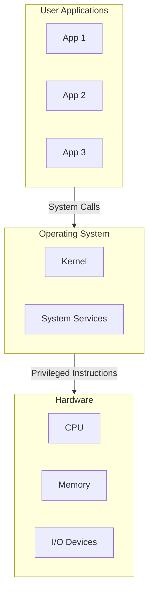

#### 4.3.1 Monolithic Kernel 🟠 IMPORTANT

**Concise:** The entire OS (process management, memory management, file systems, drivers) runs as a single large program in kernel space.

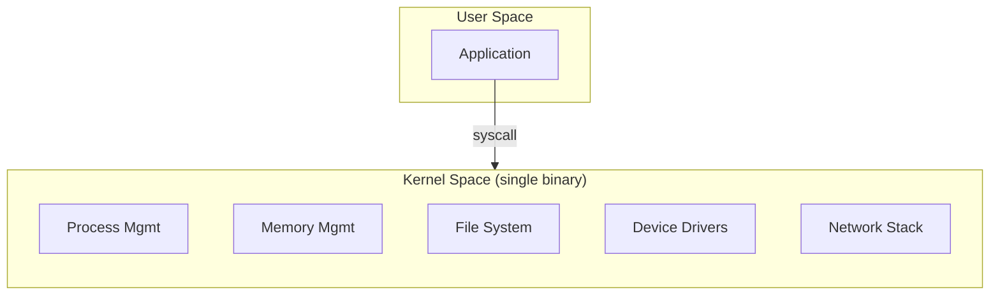

- Pros: Fast (no IPC overhead between components, everything is a function call).
- Cons: A bug/crash in any component (even a driver) can crash the whole system; large attack surface.
- Examples: Traditional UNIX, Linux (technically monolithic but modular via loadable kernel modules).

#### 4.3.2 Layered Architecture 🟢 GOOD TO KNOW

**Concise:** OS is organized into layers, each built strictly on top of the one below; each layer only calls services of the layer directly beneath it.

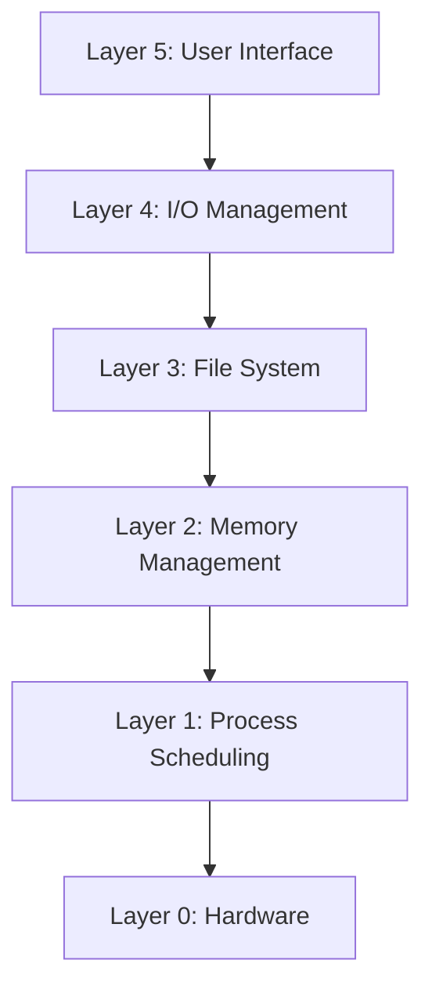

- Pros: Clear separation of concerns, easier to debug/verify layer by layer.
- Cons: Strict layering adds overhead (a request may traverse many layers); hard to define correct layer boundaries; performance penalty.
- Example: THE OS (Dijkstra's classic system).

#### 4.3.3 Microkernel Architecture 🔴 MUST KNOW

**Concise:** Kernel is reduced to the bare minimum (IPC, basic scheduling, basic memory management); everything else (file systems, drivers, network stacks) runs as user-space servers.

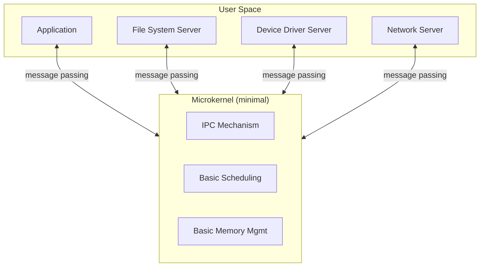

- Pros: Fault isolation (a crashing driver doesn't crash the kernel), smaller trusted computing base, easier to extend/replace services.
- Cons: More context switches / message passing → higher overhead → historically slower.
- Examples: Mach, Minix, QNX; modern hybrids: Windows NT (hybrid), macOS/XNU (hybrid).

#### 4.3.4 Modular Kernel 🟢 GOOD TO KNOW

**Concise:** Monolithic-style single address space, but functionality is split into modules that can be loaded/unloaded dynamically at runtime.

- Pros: Combines monolithic performance with some of the flexibility of microkernels (no reboot needed to add a driver).
- Cons: Modules still run in kernel space, so a bad module can still crash the system (less isolation than a true microkernel).
- Example: Linux Loadable Kernel Modules (LKMs).

#### 4.3.5 Comparison Table 🔴 MUST KNOW

| Aspect | Monolithic | Layered | Modular | Microkernel |
|---|---|---|---|---|
| Structure | Single large kernel binary | Strict layers, each on top of the next | Kernel + dynamically loadable modules | Minimal kernel + user-space servers |
| Communication | Direct function calls | Function calls, layer-restricted | Direct function calls | Message passing / IPC |
| Performance | High | Medium (layer traversal overhead) | High | Lower (IPC overhead) |
| Fault Isolation | Low | Medium | Low–Medium | High |
| Extensibility | Low (needs recompilation) | Medium | High (load/unload modules) | High (add new servers) |
| Attack Surface | Large | Medium | Large (still kernel space) | Small |
| Examples | Traditional UNIX | THE OS | Linux | Mach, Minix, QNX |

---

### 4.4 Abstractions, Processes, and Resources 🟠 IMPORTANT

**Concise:** The OS provides abstractions so programmers don't manage raw hardware directly — a *process* abstracts a running program, and *resources* (CPU, memory, files, devices) are what processes compete for and the OS arbitrates.

**Deeper explanation:**

| Raw Hardware Concept | OS Abstraction |
|---|---|
| Physical memory addresses | Virtual address space |
| Raw CPU time slices | Processes / Threads |
| Raw disk blocks | Files & directories |
| Raw device registers | Device-independent I/O interface (file-like descriptors) |
| Physical network frames | Sockets |

- **Process** = an abstraction of a running program: it has its own virtual address space, execution context, and resource handles.
- **Resource** = anything a process needs and must request from the OS: CPU time, memory, open files, network connections, locks.
- The OS's core job in this abstraction layer is **arbitration**: deciding who gets what resource, when, and preventing conflicting access (protection).

---

==================================================
## MODULE 2 — OS PRINCIPLES
==================================================

### 4.5 System Calls & the Application Call Interface 🔴 MUST KNOW

**Concise:** A system call is the only sanctioned way for a user-mode program to request a privileged operation from the kernel (e.g., reading a file, creating a process).

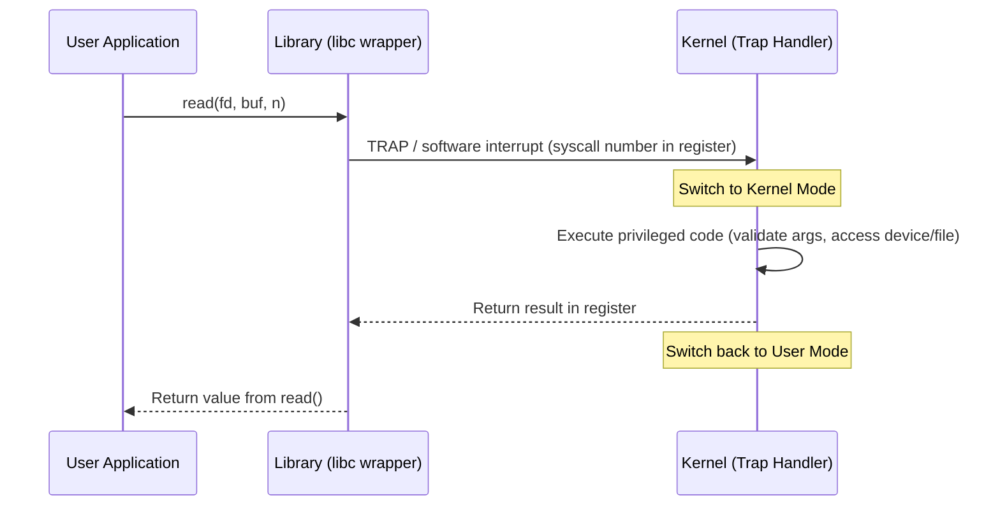

**Deeper explanation:**
- Applications don't invoke syscalls directly with raw trap instructions — they go through a **library wrapper** (e.g., glibc on Linux) that sets up registers and issues the `syscall`/`trap`/`int 0x80` instruction.
- The kernel validates all arguments (never trusts user-space input) because this is the security boundary.
- Categories of system calls: process control (`fork`, `exec`, `exit`), file management (`open`, `read`, `write`, `close`), device management (`ioctl`), information maintenance (`getpid`, `alarm`), communication (`pipe`, `socket`).

---

### 4.6 Protection: User Mode vs Kernel Mode 🔴 MUST KNOW

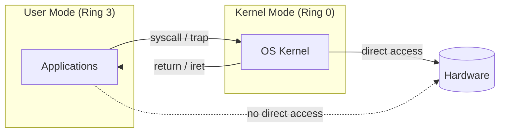

**Concise:** User mode restricts a process to a safe subset of instructions and its own memory; kernel mode allows execution of privileged instructions and access to all hardware. This hardware-enforced boundary is *the* foundation of OS protection.

**Deeper explanation:**
- Enforced by the CPU itself via a **mode bit** (or privilege rings, e.g., x86 Ring 0–3).
- Privileged instructions (modifying page tables, halting CPU, direct I/O port access) trap/fault if attempted in user mode.
- Only the following can raise privilege to kernel mode: system calls (software interrupt/trap), hardware interrupts, and exceptions (faults like divide-by-zero, page fault).

---

### 4.7 Interrupts 🔴 MUST KNOW

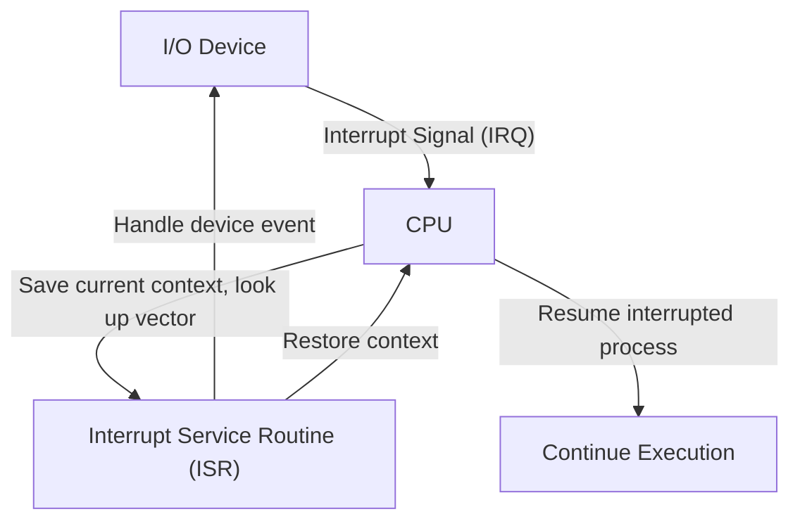

**Concise:** An interrupt is an asynchronous hardware signal telling the CPU to pause current execution and run a handler (ISR); a system call is a synchronous, software-initiated request for a kernel service.

| Aspect | Interrupt | System Call |
|---|---|---|
| Trigger | Hardware device (asynchronous) | Program instruction (synchronous, deliberate) |
| Timing | Can occur any time | Occurs exactly when the instruction executes |
| Purpose | Notify CPU of external event (I/O complete, timer tick) | Request an OS service on behalf of the program |
| Handler | Interrupt Service Routine (ISR) | System call handler / trap handler |
| Example | Keyboard press, disk I/O completion, timer | `read()`, `fork()`, `write()` |

---

### 4.8 Processes 🔴 MUST KNOW

#### 4.8.1 Program vs Process 🔴 MUST KNOW

**Concise:** A program is a static, passive set of instructions on disk. A process is a program in execution — an active entity with its own state, memory, and resources.

| Aspect | Program | Process |
|---|---|---|
| Nature | Passive (a file on disk) | Active (an executing instance) |
| State | None (just code + data) | Has runtime state: PC, registers, stack, heap |
| Lifetime | Persistent until deleted | Created and destroyed dynamically |
| Count | One program → many processes possible | Each process is one instance |
| Example | `/bin/ls` on disk | Running `ls` in two terminals = 2 processes |

#### 4.8.2 Process States and Transitions 🔴 MUST KNOW

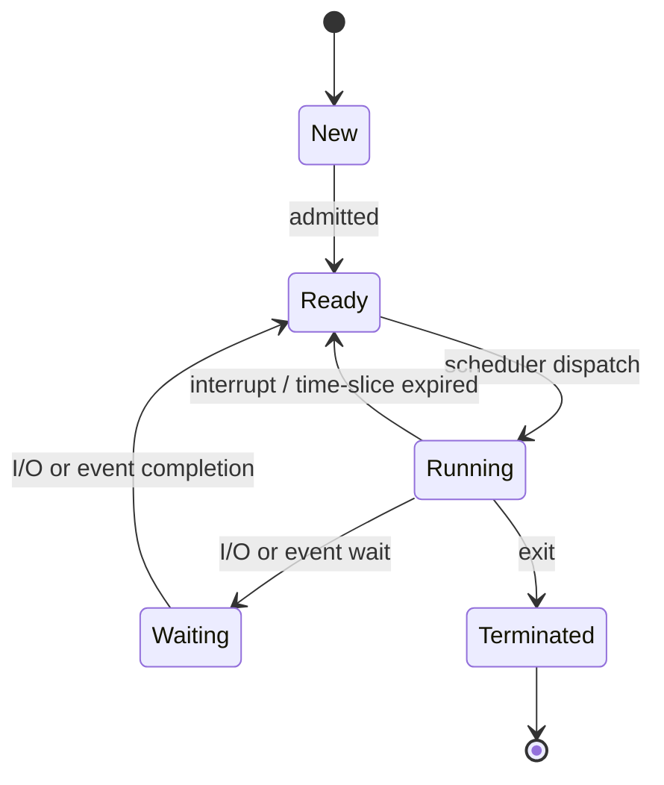

**Deeper explanation of each transition:**

| Transition | Trigger |
|---|---|
| New → Ready | OS finishes setting up the process (PCB created, memory allocated) and admits it to the ready queue |
| Ready → Running | Scheduler selects this process (dispatch) |
| Running → Ready | Timer interrupt (time slice expired) or a higher-priority process preempts it |
| Running → Waiting | Process requests I/O, or waits on a lock/signal/event |
| Waiting → Ready | The awaited event completes (I/O done, resource available) |
| Running → Terminated | Process calls `exit()`, or is killed |

#### 4.8.3 Process Control Block (PCB) 🔴 MUST KNOW

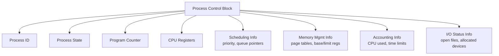

**Concise:** The PCB is the OS's data structure representation of a process — everything needed to suspend and later perfectly resume that process.

| Field | Purpose |
|---|---|
| PID | Unique identifier for the process |
| Process State | New/Ready/Running/Waiting/Terminated |
| Program Counter | Address of next instruction to execute |
| CPU Registers | Snapshot of all registers (accumulator, index registers, stack pointer, etc.) |
| Scheduling Info | Priority, pointers to scheduling queues |
| Memory-Management Info | Page tables / segment tables, base & limit registers |
| Accounting Info | CPU time used, time limits, process number |
| I/O Status Info | List of open files, allocated I/O devices |

#### 4.8.4 Context Switching 🔴 MUST KNOW

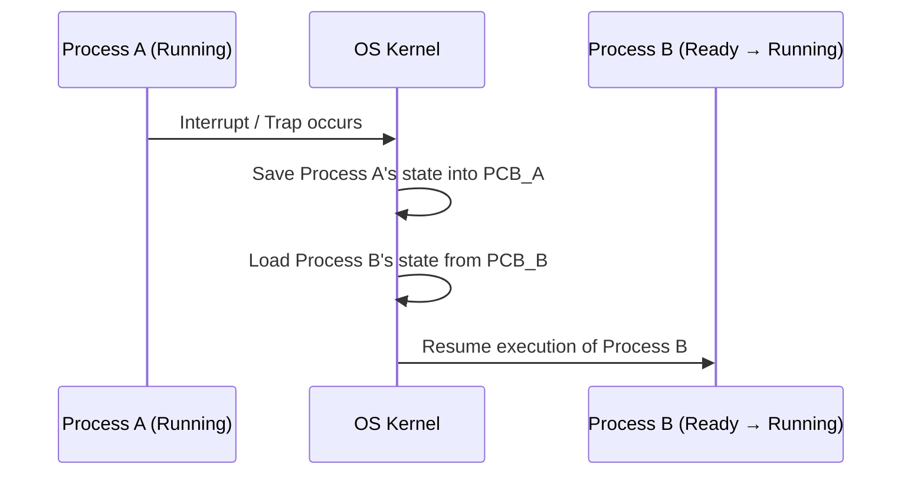

**Concise:** A context switch saves the CPU state of the currently running process into its PCB, then loads another process's saved state from its PCB — allowing multiple processes to share one CPU.

**Deeper explanation:**
- **What gets saved:** program counter, CPU registers, stack pointer, and (if switching processes, not just threads) memory-management state (page table base register).
- **Where it is saved:** into the outgoing process's PCB, maintained by the kernel.
- **What gets restored:** the incoming process's saved PC, registers, and memory context from its PCB.
- **Why it's overhead:** during the switch itself, no user computation happens — it's pure bookkeeping. Costs also include indirect effects like cache/TLB pollution (cold cache after switching).
- Thread context switches (within the same process) are cheaper than process context switches because the address space doesn't change.

---

### 4.9 Threads 🔴 MUST KNOW

#### 4.9.1 Process vs Thread 🔴 MUST KNOW

| Aspect | Process | Thread |
|---|---|---|
| Address space | Own, independent | Shared with sibling threads (same process) |
| Creation cost | Heavy (new address space, page tables) | Light (shares existing address space) |
| Communication | Needs IPC (pipes, sockets, shared memory) | Direct via shared memory (just access shared vars) |
| Context switch cost | Higher (memory context changes) | Lower (only registers/stack change) |
| Crash impact | Isolated — one process crashing doesn't affect another | A thread crash can bring down the whole process |
| Own resources | Own memory, file descriptors | Own: stack, registers, PC. Shared: code, data, heap, open files |

#### 4.9.2 User-Level Threads vs Kernel-Level Threads 🔴 MUST KNOW

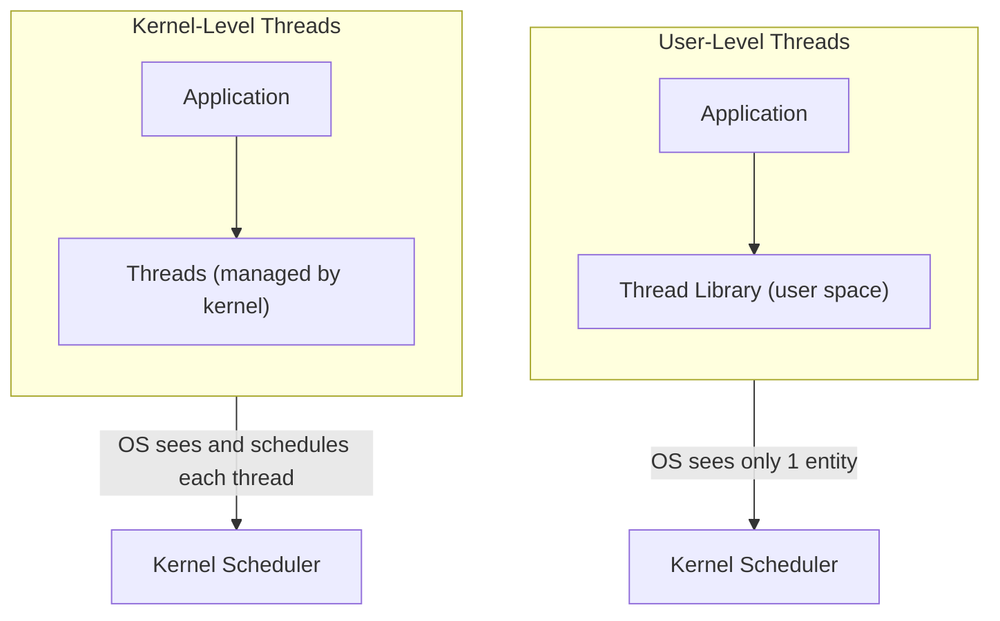

| Aspect | User-Level Threads | Kernel-Level Threads |
|---|---|---|
| Managed by | User-space thread library | OS kernel |
| Creation/switch cost | Very cheap (no kernel involvement) | More expensive (syscall required) |
| Kernel visibility | Kernel sees only one process | Kernel sees and schedules each thread |
| Blocking I/O | One blocking call can block *all* threads in the process (unless multiplexed I/O used) | Only the calling thread blocks; others continue |
| Parallelism on multicore | Cannot truly run in parallel (kernel schedules the whole process on one core at a time, in pure ULT model) | Can run in true parallel on multiple cores |
| Example | Old green threads, some coroutine libraries | Linux NPTL threads, Windows threads |

#### 4.9.3 Thread Models 🟠 IMPORTANT

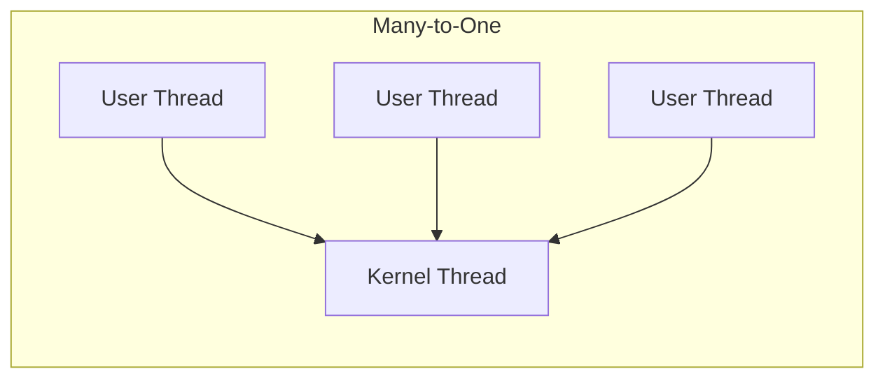

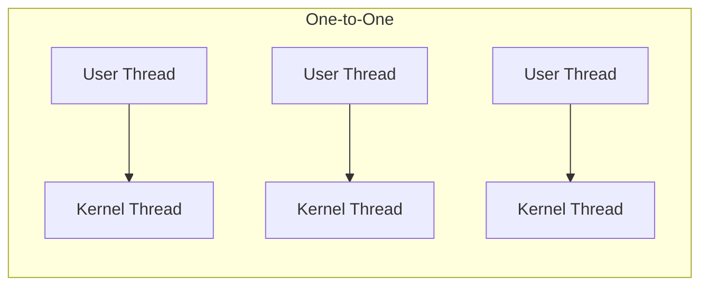

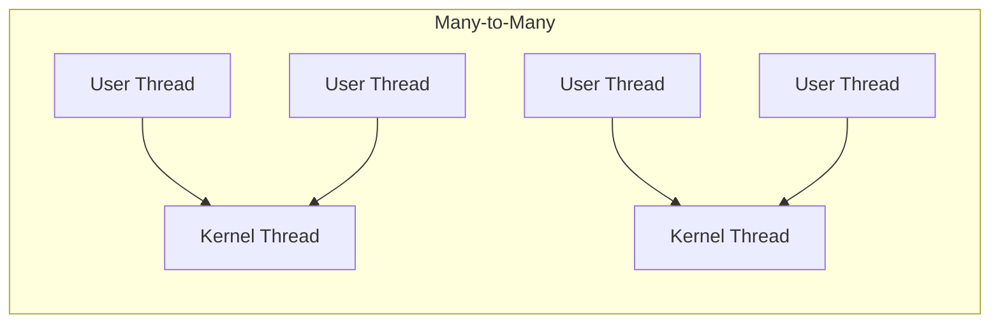

| Model | Description | Pros | Cons |
|---|---|---|---|
| Many-to-One | Many user threads map to a single kernel thread | Fast thread management, no kernel overhead | No true parallelism; one blocking call blocks all |
| One-to-One | Each user thread maps to its own kernel thread | True parallelism, one thread blocking doesn't block others | Higher overhead (thread creation cost bounded by kernel) — used by Linux/Windows |
| Many-to-Many | Many user threads multiplexed onto a smaller/equal number of kernel threads | Flexibility + parallelism, avoids one-to-one overhead | More complex to implement |

---

### 4.10 Unix-Style Process Management 🔴 MUST KNOW

#### 4.10.1 fork(), exec(), wait(), exit()

```mermaid
flowchart TB
    Parent["Parent Process\n(PID=100)"]
    Parent -->|"fork()"| Child["Child Process\n(PID=101, PPID=100)"]
    Child -->|"exec(\"/bin/ls\")"| NewImg["Child now runs /bin/ls\n(same PID=101)"]
    NewImg -->|"exit(status)"| Zombie["Zombie until reaped"]
    Parent -->|"wait(&status)"| Reap["Parent collects exit status\nChild fully removed"]
```

**Concise:**
- `fork()` — creates a near-identical copy of the calling process (child). Returns 0 to the child, child's PID to the parent, and a negative value on failure.
- `exec()` family — replaces the calling process's memory image with a new program (same PID, new code/data/stack).
- `wait()` — parent blocks until a child terminates, and retrieves its exit status; also allows the OS to clean up the terminated child (avoiding zombies).
- `exit()` — terminates the calling process, releases most resources, and stores an exit status for the parent to collect.

**Small conceptual example (C-like pseudocode):**

```c
pid_t pid = fork();

if (pid == 0) {
    // Child process
    execlp("/bin/ls", "ls", NULL);   // replace child image with 'ls'
    exit(1);                        // only reached if exec fails
} else if (pid > 0) {
    // Parent process
    int status;
    wait(&status);                  // wait for child to finish
    printf("Child finished\n");
} else {
    // fork failed
    perror("fork failed");
}
```

- **PID** — unique process identifier.
- **PPID** — parent process ID; used to build the process tree.
- If a parent exits before its child, the child is **re-parented** (typically to `init`/PID 1 on Unix) so it can still be reaped.
- A child that has terminated but hasn't been `wait()`-ed on yet is a **zombie process** — it still holds a PCB entry (mainly its exit status) until the parent reaps it.
- A process whose parent exited without waiting, and which is still running, is called an **orphan process**.

#### 4.10.2 Linux Process Hierarchy 🟠 IMPORTANT

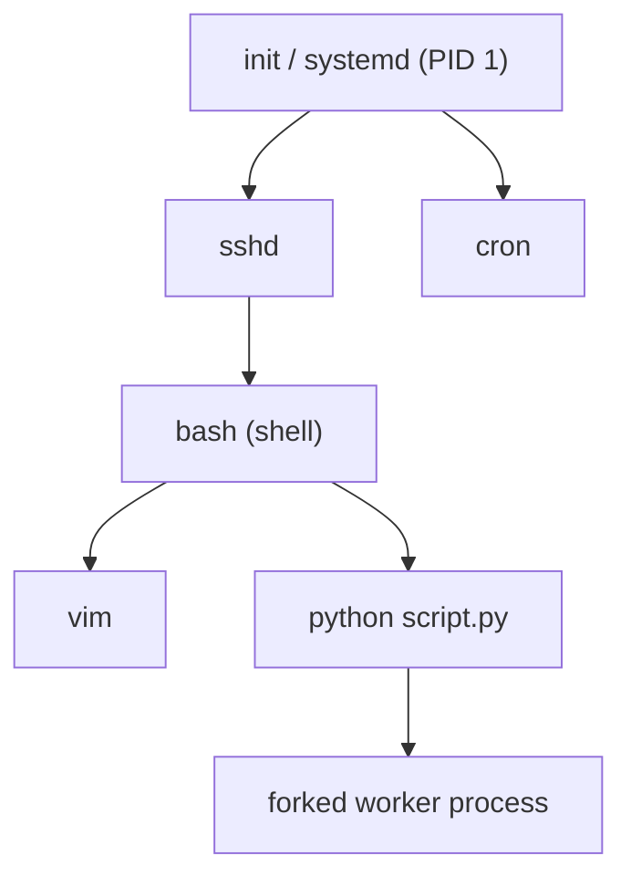

Every process (except PID 1) has exactly one parent, forming a tree. Orphaned processes get re-parented (commonly to PID 1) so every process always has a valid parent to be reaped by.

---

### 4.11 Consolidated Comparison Tables 🔴 MUST KNOW

**Program vs Process**

| Program | Process |
|---|---|
| Passive, on-disk entity | Active, in-execution entity |
| No runtime state | Has PC, registers, stack, heap |
| Static | Dynamic (created/destroyed) |

**Process vs Thread**

| Process | Thread |
|---|---|
| Own address space | Shares address space with siblings |
| Heavyweight | Lightweight |
| IPC needed to communicate | Shared memory, direct communication |
| Isolated failure | Failure can affect whole process |

**User Thread vs Kernel Thread**

| User Thread | Kernel Thread |
|---|---|
| Managed in user space | Managed by kernel |
| Cheap create/switch | Costlier create/switch |
| Kernel unaware of individual threads (pure ULT) | Kernel schedules each one |
| Blocking call can block all | Only blocking thread blocks |

**User Mode vs Kernel Mode**

| User Mode | Kernel Mode |
|---|---|
| Restricted instruction set | Full/privileged instruction set |
| No direct hardware access | Direct hardware access |
| Ring 3 (x86 example) | Ring 0 (x86 example) |
| Entered by default for apps | Entered via syscall/interrupt/exception |

**System Call vs Normal Function Call**

| System Call | Normal Function Call |
|---|---|
| Crosses user/kernel boundary | Stays within user space |
| Causes a mode switch (trap) | No mode switch |
| Higher overhead | Lower overhead |
| Executes OS kernel code | Executes application/library code |

---

### 4.12 Remember — Highest-Value Facts 🔴 MUST KNOW

- A process is a program in execution; a thread is a lightweight execution unit inside a process.
- The 5 standard process states: New, Ready, Running, Waiting, Terminated.
- The PCB is the single source of truth the OS uses to save/restore a process's state.
- Context switch = pure overhead; no useful computation happens during it.
- `fork()` returns 0 in child, child PID in parent; `exec()` replaces the process image; `wait()` reaps and retrieves exit status; `exit()` terminates and stores exit status.
- Kernel mode = privileged; user mode = restricted. Mode switches happen only via syscalls, interrupts, or exceptions.
- Monolithic = fast but fragile; Microkernel = isolated but higher IPC overhead; Modular = monolithic performance with pluggable components; Layered = clean separation but overhead from strict layer traversal.
- User-level threads are cheap but can't achieve true parallelism alone; kernel-level threads can run in parallel across cores.

---

## Part 1 Completion Summary

**Topics covered in this part:**

- OS functionality and core responsibilities
- OS design issues and trade-offs (performance, protection, portability, reliability)
- Influence of security, networking, and multimedia on OS design
- OS structuring methods: Monolithic, Layered, Modular, Microkernel (with diagrams and comparison table)
- Abstractions: processes and resources
- System calls and the application call interface
- Protection: user mode vs kernel mode
- Interrupts vs system calls
- Process concept: program vs process
- Process states and transitions (New/Ready/Running/Waiting/Terminated)
- Process Control Block (PCB) — structure and fields
- Context switching — what's saved/restored and why it's overhead
- Threads: process vs thread
- User-level vs kernel-level threads
- Thread models: Many-to-One, One-to-One, Many-to-Many
- Unix process management: fork(), exec(), wait(), exit(), PID/PPID, zombies, orphans
- Linux process hierarchy
- Consolidated comparison tables for quick revision
- High-value "Remember" facts summary

**Not yet covered (upcoming parts):** CPU Scheduling, Process Synchronization, Deadlocks, Memory Management (Paging/Segmentation/Virtual Memory), File Systems, I/O Management, Disk Scheduling.

---

# PART 2 OF 5

==================================================
## MODULE 3 — SCHEDULING
==================================================

### 5.1 Process Scheduling Overview 🔴 MUST KNOW

**Concise:** Process scheduling decides *which process/thread gets the CPU next* and *for how long*, so the OS can multiplex a limited number of CPUs across many runnable processes.

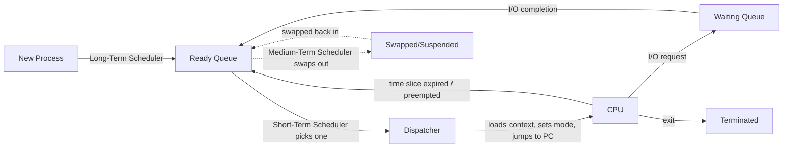

#### Types of Schedulers 🟠 IMPORTANT

| Scheduler | Frequency | Role |
|---|---|---|
| Long-term (job scheduler) | Rare (seconds/minutes) | Decides which jobs are admitted from disk into the ready queue (controls degree of multiprogramming) |
| Short-term (CPU scheduler) | Very frequent (milliseconds) | Picks which ready process runs next on the CPU |
| Medium-term | Occasional | Swaps processes out of memory (suspend) to reduce load, and back in later |

- **Dispatcher** — the module that actually gives control of the CPU to the process selected by the short-term scheduler: it performs the context switch, switches to user mode, and jumps to the correct program counter.
- **Dispatch latency** — the time taken by the dispatcher to stop one process and start another. Lower is better; it's pure scheduling overhead.

#### Preemptive vs Non-Preemptive Scheduling 🔴 MUST KNOW

| Aspect | Non-Preemptive | Preemptive |
|---|---|---|
| CPU release | Only when process voluntarily blocks or terminates | Can be forcibly taken away (timer interrupt, higher-priority arrival) |
| Response time | Can be poor for short jobs behind long ones | Generally better |
| Overhead | Lower (fewer context switches) | Higher (more context switches) |
| Examples | FCFS, non-preemptive SJF | Round Robin, SRTF, preemptive Priority |

---

### 5.2 Scheduling Metrics & Formulas 🔴 MUST KNOW

Let arrival time = **AT**, burst time = **BT**, completion time = **CT**.

| Metric | Formula | Meaning |
|---|---|---|
| Completion Time (CT) | Time at which process finishes execution | — |
| Turnaround Time (TAT) | `TAT = CT - AT` | Total time from arrival to completion |
| Waiting Time (WT) | `WT = TAT - BT` | Time spent waiting in ready queue (not running, not doing I/O) |
| Response Time (RT) | `RT = (time of first CPU burst) - AT` | Time until the process gets the CPU for the *first* time |
| Average Waiting Time | `Σ WT / n` | Mean wait across all processes |
| Average Turnaround Time | `Σ TAT / n` | Mean turnaround across all processes |
| Throughput | `(number of processes completed) / (total time)` | Processes finished per unit time |
| CPU Utilization | `(CPU busy time / total time) × 100%` | Fraction of time CPU is doing useful work |

> **Note:** In non-preemptive algorithms, Response Time = Waiting Time (the process runs to completion once dispatched, so it starts running only once). In preemptive algorithms, they can differ because a process can be dispatched, paused, and resumed multiple times.

---

### 5.3 Scheduling Algorithms — Comparison Table 🔴 MUST KNOW

| Algorithm | Preemptive? | Selection Criterion | Starvation Risk | Best For |
|---|---|---|---|---|
| FCFS | No | Arrival order | Low (but convoy effect) | Simple batch systems |
| SJF (non-preemptive) | No | Shortest burst time | High for long jobs | Minimizing average waiting time (batch) |
| SRTF (preemptive SJF) | Yes | Shortest *remaining* time | High for long jobs | Minimizing avg waiting time with arrivals over time |
| Round Robin | Yes | Fixed time quantum, cyclic order | None | Time-sharing / interactive systems |
| Priority Scheduling | Either | Highest priority value | High for low-priority (fixed by aging) | Systems needing differentiated importance |
| Multilevel Queue | Either (per queue) | Fixed queue + rules between queues | Possible for lower queues | Distinct process categories (system/interactive/batch) |
| MLFQ | Yes | Dynamic priority based on behavior | Mitigated via aging/priority boost | General-purpose OS scheduling |

---

### 5.4 FCFS (First Come First Served) 🔴 MUST KNOW

- **Placement priority:** 🔴 MUST KNOW — always the base case in any scheduling question set.
- **Purpose:** Simplest possible scheduling: serve processes strictly in arrival order.
- **Problem it solves:** Provides a baseline, fair-by-arrival scheduling policy with zero decision overhead.
- **Core idea:** Maintain a FIFO queue of ready processes; run each to completion before starting the next.
- **Inputs:** Process arrival times, burst times.
- **Outputs:** Completion time, turnaround time, waiting time per process.

**Step-by-step algorithm:**
1. Sort processes by arrival time.
2. Assign the CPU to the process at the head of the queue.
3. Run it to completion (no preemption).
4. Compute CT, TAT, WT.
5. Move to the next process in the queue.

**Pseudocode:**
```
sort processes by arrival_time
current_time = 0
for each process p in sorted order:
    if current_time < p.arrival_time:
        current_time = p.arrival_time   // CPU idles
    p.start_time = current_time
    p.completion_time = current_time + p.burst_time
    current_time = p.completion_time
```

**Numerical Example:**

| Process | AT | BT |
|---|---|---|
| P1 | 0 | 5 |
| P2 | 1 | 3 |
| P3 | 2 | 8 |
| P4 | 3 | 6 |

```mermaid
gantt
    dateFormat X
    axisFormat %s
    title FCFS Gantt Chart
    section CPU
    P1 :done, p1, 0, 5
    P2 :done, p2, 5, 8
    P3 :done, p3, 8, 16
    P4 :done, p4, 16, 22
```

| Process | AT | BT | CT | TAT = CT-AT | WT = TAT-BT |
|---|---|---|---|---|---|
| P1 | 0 | 5 | 5 | 5 | 0 |
| P2 | 1 | 3 | 8 | 7 | 4 |
| P3 | 2 | 8 | 16 | 14 | 6 |
| P4 | 3 | 6 | 22 | 19 | 13 |

- Average TAT = (5+7+14+19)/4 = **11.25**
- Average WT = (0+4+6+13)/4 = **5.75**

**Advantages:** Trivial to implement; no starvation (every process eventually runs); fair in arrival order.
**Disadvantages:** Suffers from the **convoy effect** — a long process at the front makes all short processes behind it wait a long time, hurting average waiting time.
**Edge cases:** All arriving at the same time → pure order-dependent result; a single long process followed by many short ones → worst-case convoy effect.
**Common mistakes:** Forgetting to account for CPU idle time when a process hasn't arrived yet; miscomputing WT by subtracting AT instead of BT from TAT.
**Comparison:** Unlike SJF, FCFS ignores burst time entirely, so it can have much worse average waiting time; unlike Round Robin, it is non-preemptive so no context-switch overhead but poor responsiveness.

---

### 5.5 SJF — Shortest Job First (Non-Preemptive) 🔴 MUST KNOW

- **Placement priority:** 🔴 MUST KNOW.
- **Purpose:** Minimize average waiting time by always running the shortest available job next.
- **Problem it solves:** FCFS's convoy effect — short jobs no longer get stuck behind long ones.
- **Core idea:** Among all processes that have arrived and are ready, always pick the one with the smallest burst time; run it to completion.
- **Inputs:** Arrival times, burst times.
- **Outputs:** CT, TAT, WT per process.

**Step-by-step algorithm:**
1. At each scheduling point, look at all arrived, not-yet-run processes.
2. Pick the one with minimum burst time (break ties by arrival time).
3. Run to completion (non-preemptive).
4. Repeat until all processes are done.

**Pseudocode:**
```
while unfinished processes exist:
    candidates = { p : p.arrival_time <= current_time and not p.finished }
    if candidates is empty:
        current_time = min(arrival_time of unfinished processes)  // CPU idle
        continue
    p = process in candidates with minimum burst_time
    p.completion_time = current_time + p.burst_time
    current_time = p.completion_time
    mark p finished
```

**Numerical Example:**

| Process | AT | BT |
|---|---|---|
| P1 | 0 | 7 |
| P2 | 1 | 4 |
| P3 | 2 | 1 |
| P4 | 3 | 4 |

Working: At t=0 only P1 available → run P1 (0–7, since non-preemptive, no other arrivals matter once started). After P1 finishes at t=7, all of P2, P3, P4 have arrived → pick smallest burst: P3 (1) → then tie between P2 and P4 (both 4) → pick earlier arrival P2 → then P4.

```mermaid
gantt
    dateFormat X
    axisFormat %s
    title SJF (Non-Preemptive) Gantt Chart
    section CPU
    P1 :done, p1, 0, 7
    P3 :done, p3, 7, 8
    P2 :done, p2, 8, 12
    P4 :done, p4, 12, 16
```

| Process | AT | BT | CT | TAT | WT |
|---|---|---|---|---|---|
| P1 | 0 | 7 | 7 | 7 | 0 |
| P2 | 1 | 4 | 12 | 11 | 7 |
| P3 | 2 | 1 | 8 | 6 | 5 |
| P4 | 3 | 4 | 16 | 13 | 9 |

- Average TAT = (7+11+6+13)/4 = **9.25**
- Average WT = (0+7+5+9)/4 = **5.25**

**Advantages:** Provably minimizes average waiting time among non-preemptive algorithms (given all jobs available at once).
**Disadvantages:** Requires knowing burst time in advance (usually estimated); can cause **starvation** of long jobs if short jobs keep arriving.
**Edge cases:** If burst times are all equal, SJF degenerates to FCFS; unknown burst times must be predicted (e.g., exponential averaging of past bursts).
**Common mistakes:** Applying SJF preemptively when the question asks for non-preemptive (that would actually be SRTF); ignoring arrival time when selecting the next process.
**Comparison:** SRTF is the preemptive version of SJF — SRTF reacts to new shorter arrivals immediately, SJF (non-preemptive) does not.

---

### 5.6 SRTF — Shortest Remaining Time First (Preemptive SJF) 🟠 IMPORTANT

- **Placement priority:** 🟠 IMPORTANT.
- **Purpose:** Improve on SJF by preempting the current process if a newly arrived process has a shorter remaining burst time.
- **Problem it solves:** SJF's inability to react to shorter jobs arriving mid-execution.
- **Core idea:** At every time unit (or every new arrival), compare remaining burst times of all ready processes and switch to the smallest.
- **Inputs:** Arrival times, burst times (tracked as *remaining* time during execution).
- **Outputs:** CT, TAT, WT per process (WT can require summing wait intervals across multiple pauses).

**Step-by-step algorithm:**
1. At each time unit, among arrived & unfinished processes, pick the one with smallest remaining time.
2. Execute it for 1 time unit (conceptually); decrement its remaining time.
3. If a new process arrives with a smaller remaining time than the current one, preempt.
4. Repeat until all processes finish.

**Pseudocode:**
```
remaining[p] = burst_time[p] for all p
time = 0
while unfinished processes exist:
    candidates = { p : arrival_time[p] <= time and remaining[p] > 0 }
    if candidates empty: time += 1; continue
    p = process in candidates with min remaining[p]
    remaining[p] -= 1
    time += 1
    if remaining[p] == 0:
        completion_time[p] = time
```

**Numerical Example:**

| Process | AT | BT |
|---|---|---|
| P1 | 0 | 8 |
| P2 | 1 | 4 |
| P3 | 2 | 2 |
| P4 | 3 | 1 |

Working (remaining time tracked each arrival):
- t=0: only P1 (rem 8) → runs.
- t=1: P2 arrives (rem 4) < P1 remaining(7) → preempt, run P2.
- t=2: P3 arrives (rem 2) < P2 remaining(3) → preempt, run P3.
- t=3: P4 arrives (rem 1) < P3 remaining(1)? equal → tie-break by arrival, P3 continues or P4 runs (convention: run P4 first since strictly shorter than P3's *original* isn't the rule — using "remaining time", P3 rem=1 and P4 rem=1 tie; break tie by earlier arrival → P3 runs) → run P3 to completion.
- t=4: P3 finishes (CT=4). Candidates: P4 (rem1), P2(rem3), P1(rem7) → run P4.
- t=5: P4 finishes (CT=5). Candidates: P2(rem3), P1(rem7) → run P2.
- t=5–8: P2 runs 3 units, finishes at t=8 (CT=8).
- t=8–15: P1 runs remaining 7 units, finishes at t=15 (CT=15).

```mermaid
gantt
    dateFormat X
    axisFormat %s
    title SRTF Gantt Chart
    section CPU
    P1 :done, a, 0, 1
    P2 :done, b, 1, 2
    P3 :done, c, 2, 3
    P3b :done, c2, 3, 4
    P4 :done, d, 4, 5
    P2b :done, b2, 5, 8
    P1b :done, a2, 8, 15
```

| Process | AT | BT | CT | TAT | WT |
|---|---|---|---|---|---|
| P1 | 0 | 8 | 15 | 15 | 7 |
| P2 | 1 | 4 | 8 | 7 | 3 |
| P3 | 2 | 2 | 4 | 2 | 0 |
| P4 | 3 | 1 | 5 | 2 | 1 |

- Average TAT = (15+7+2+2)/4 = **6.5**
- Average WT = (7+3+0+1)/4 = **2.75**

**Advantages:** Optimal average waiting time among preemptive algorithms when arrivals are staggered; very responsive to short jobs.
**Disadvantages:** High context-switch overhead (frequent preemptions); can starve long processes; requires continuously tracking remaining burst time (again, usually estimated).
**Edge cases:** Simultaneous arrivals with equal remaining time need a clear tie-break rule (commonly: earlier arrival, then lower PID).
**Common mistakes:** Forgetting to re-evaluate at *every* new arrival, not just at burst completion; confusing SRTF with SJF (SRTF is preemptive).
**Comparison:** SRTF vs SJF — SRTF reacts immediately to shorter arriving jobs; SJF finishes the current job regardless of arrivals. SRTF vs Round Robin — SRTF preempts based on remaining time, RR preempts based on a fixed time quantum regardless of burst length.

---

### 5.7 Round Robin (RR) 🔴 MUST KNOW

- **Placement priority:** 🔴 MUST KNOW — one of the most frequently tested scheduling algorithms.
- **Purpose:** Provide fair, time-sliced CPU access suited to interactive/time-sharing systems.
- **Problem it solves:** Ensures no process waits indefinitely and every process gets regular CPU turns, regardless of burst length.
- **Core idea:** Each process gets the CPU for a fixed **time quantum**; if it doesn't finish, it goes to the back of the ready queue.
- **Inputs:** Arrival times, burst times, time quantum (TQ).
- **Outputs:** CT, TAT, WT, RT per process.

**Step-by-step algorithm:**
1. Maintain a FIFO ready queue.
2. Dequeue the front process; run it for `min(TQ, remaining burst)`.
3. If it still has remaining burst time, re-enqueue it at the back (after any processes that arrived during its slice).
4. If it finishes, record its completion time.
5. Repeat until the queue is empty.

**Pseudocode:**
```
queue = [] ; remaining[p] = burst_time[p]
time = 0
enqueue processes as they arrive
while queue not empty:
    p = dequeue()
    run_time = min(TQ, remaining[p])
    if first time p runs: response_time[p] = time - arrival_time[p]
    time += run_time
    remaining[p] -= run_time
    enqueue any new arrivals that occurred during [time-run_time, time)
    if remaining[p] > 0:
        enqueue(p)
    else:
        completion_time[p] = time
```

**Numerical Example (TQ = 2):**

| Process | AT | BT |
|---|---|---|
| P1 | 0 | 5 |
| P2 | 1 | 4 |
| P3 | 2 | 2 |

Working: Queue evolves as: [P1] → run P1 2 units (0–2, rem 3) → during this P2(t1),P3(t2) arrived → queue=[P2,P3,P1] → run P2 2 units (2–4, rem 2) → queue=[P3,P1,P2] → run P3 2 units (4–6, rem 0, done, CT=6) → queue=[P1,P2] → run P1 2 units (6–8, rem 1) → queue=[P2,P1] → run P2 2 units (8–10, rem 0, done CT=10) → queue=[P1] → run P1 1 unit (10–11, rem 0, done CT=11).

```mermaid
gantt
    dateFormat X
    axisFormat %s
    title Round Robin Gantt Chart (TQ=2)
    section CPU
    P1 :done, a, 0, 2
    P2 :done, b, 2, 4
    P3 :done, c, 4, 6
    P1b :done, a2, 6, 8
    P2b :done, b2, 8, 10
    P1c :done, a3, 10, 11
```

| Process | AT | BT | CT | TAT | WT | RT |
|---|---|---|---|---|---|---|
| P1 | 0 | 5 | 11 | 11 | 6 | 0 |
| P2 | 1 | 4 | 10 | 9 | 5 | 1 |
| P3 | 2 | 2 | 6 | 4 | 2 | 2 |

- Average TAT = (11+9+4)/3 = **8.0**
- Average WT = (6+5+2)/3 = **4.33**

**Advantages:** Fair, no starvation, good response time for interactive systems, works without knowing burst times in advance.
**Disadvantages:** Average waiting time can be worse than SJF/SRTF; performance highly sensitive to time quantum choice; context-switch overhead if TQ too small.
**Edge cases:** TQ larger than the longest burst → degenerates to FCFS; TQ = 1 → maximum fairness but maximum overhead.
**Common mistakes:** Forgetting to enqueue newly arrived processes *before* re-enqueuing the just-run process (ordering affects the result); not tracking response time correctly (only first dispatch counts).
**Comparison:** RR vs FCFS — RR preempts on a timer, FCFS never preempts. RR vs SRTF — RR's preemption is time-based (fixed quantum), SRTF's preemption is burst-based (shortest remaining time).

**Effect of Time Quantum 🟠 IMPORTANT:**

| TQ Value | Response Time | Waiting Time | Context-Switch Overhead | Throughput |
|---|---|---|---|---|
| Very small | Very low (feels instant) | Can increase (more switches) | Very high | Can drop (CPU wasted on switching) |
| Very large | Higher (behaves like FCFS) | Can increase for short jobs behind long ones | Very low | Can improve (fewer switches) but responsiveness suffers |
| Well-tuned (rule of thumb: 80% of bursts finish within one TQ) | Good balance | Good balance | Moderate | Good balance |

---

### 5.8 Priority Scheduling 🔴 MUST KNOW

- **Placement priority:** 🔴 MUST KNOW.
- **Purpose:** Let more important processes run before less important ones, using an explicit priority number.
- **Problem it solves:** Differentiates process importance (e.g., system processes should run before background batch jobs).
- **Core idea:** Always pick the ready process with the highest priority (convention: lower number = higher priority, but this varies by textbook/system).
- **Inputs:** Arrival times, burst times, priority values.
- **Outputs:** CT, TAT, WT per process.

**Step-by-step algorithm (non-preemptive variant):**
1. Among arrived, unfinished processes, pick the one with the best (e.g., lowest-numbered) priority.
2. Run to completion.
3. Repeat.
(Preemptive variant: re-evaluate on every new arrival and preempt if the new arrival has better priority.)

**Pseudocode (non-preemptive):**
```
while unfinished processes exist:
    candidates = { p : arrival_time[p] <= current_time and not finished }
    if candidates empty: current_time = min AT of unfinished; continue
    p = process in candidates with best priority (ties -> earlier arrival)
    completion_time[p] = current_time + burst_time[p]
    current_time = completion_time[p]
```

**Numerical Example (lower number = higher priority):**

| Process | AT | BT | Priority |
|---|---|---|---|
| P1 | 0 | 4 | 2 |
| P2 | 0 | 3 | 1 |
| P3 | 0 | 2 | 3 |

Working: All arrive at t=0. Order by priority: P2(1) → P1(2) → P3(3).

```mermaid
gantt
    dateFormat X
    axisFormat %s
    title Priority Scheduling Gantt Chart
    section CPU
    P2 :done, b, 0, 3
    P1 :done, a, 3, 7
    P3 :done, c, 7, 9
```

| Process | AT | BT | CT | TAT | WT |
|---|---|---|---|---|---|
| P2 | 0 | 3 | 3 | 3 | 0 |
| P1 | 0 | 4 | 7 | 7 | 3 |
| P3 | 0 | 2 | 9 | 9 | 7 |

- Average TAT = (3+7+9)/3 = **6.33**
- Average WT = (0+3+7)/3 = **3.33**

**Advantages:** Flexible — priority can reflect any policy (deadlines, importance, resource needs).
**Disadvantages:** Low-priority processes can suffer **starvation** if higher-priority processes keep arriving.
**Fix for starvation — Aging 🔴 MUST KNOW:** gradually increase the priority of a process the longer it waits, guaranteeing it eventually becomes the highest priority and runs.
**Edge cases:** Equal priorities need a tie-break rule (commonly FCFS among equals); negative or zero burst times are invalid inputs.
**Common mistakes:** Assuming lower number always means higher priority (convention varies — always check the question's definition); forgetting to apply aging when the question explicitly asks about starvation fixes.
**Comparison:** Priority scheduling generalizes SJF (SJF = priority scheduling where priority is inversely related to burst time).

---

### 5.9 Multilevel Queue Scheduling 🟠 IMPORTANT

- **Placement priority:** 🟠 IMPORTANT.
- **Purpose:** Separate processes into distinct categories (e.g., system, interactive, batch) each with its own queue and possibly its own scheduling algorithm.
- **Problem it solves:** Different process types have very different needs (system processes need low latency, batch jobs need throughput) — one algorithm doesn't fit all.
- **Core idea:** Partition the ready queue into multiple fixed queues by process type; schedule *between* queues (e.g., fixed priority between queues, or time-sliced between queues); schedule *within* each queue using its own algorithm.

```mermaid
flowchart TB
    subgraph Q1["Queue 1: System Processes (highest priority)"]
        s1[Process] --> s2[Process]
    end
    subgraph Q2["Queue 2: Interactive Processes"]
        i1[Process] --> i2[Process]
    end
    subgraph Q3["Queue 3: Batch Processes (lowest priority)"]
        b1[Process] --> b2[Process]
    end
    Q1 -->|always served first| CPU
    Q2 -->|served if Q1 empty| CPU
    Q3 -->|served if Q1,Q2 empty| CPU
```

**Inputs:** Process category assignment, per-queue scheduling algorithm, inter-queue scheduling policy.
**Outputs:** CT, TAT, WT per process (computed within its own queue's algorithm, subject to inter-queue delays).

**Advantages:** Matches scheduling policy to workload type; simple conceptually.
**Disadvantages:** Processes are permanently assigned to a queue — no flexibility; can starve lower queues if higher queues are always busy.
**Edge cases:** A process misclassified into the wrong queue can never move (a key motivation for MLFQ below).
**Common mistakes:** Confusing Multilevel Queue (static assignment) with MLFQ (dynamic, process can move between queues).
**Comparison:** Multilevel Queue is the static predecessor to MLFQ; MLFQ adds adaptivity.

---

### 5.10 Multilevel Feedback Queue (MLFQ) 🟠 IMPORTANT

- **Placement priority:** 🟠 IMPORTANT.
- **Purpose:** Combine the benefits of multiple queues with adaptivity — processes can move between queues based on observed behavior.
- **Problem it solves:** Multilevel Queue's rigidity; also approximates SJF-like behavior *without* knowing burst times in advance.
- **Core idea:** Multiple queues, each with a different priority and typically a different (increasing) time quantum. A process starts in the highest-priority queue; if it uses its full quantum without finishing (i.e., behaves CPU-bound), it's demoted to a lower-priority queue with a longer quantum. If it blocks for I/O before its quantum expires (behaves interactive), it stays at the same or is promoted.

```mermaid
flowchart TB
    New[New Process] --> Q0["Queue 0 (TQ=4, highest priority)"]
    Q0 -->|uses full quantum, CPU-bound| Q1["Queue 1 (TQ=8)"]
    Q1 -->|uses full quantum, CPU-bound| Q2["Queue 2 (TQ=16, lowest priority, FCFS)"]
    Q0 -->|finishes / blocks for I/O in time| Done1[Completes / Stays]
    Q1 -->|finishes / blocks for I/O in time| Done2[Completes / Stays]
    Q2 -->|periodic priority boost| Q0
```

**Inputs:** Number of queues, time quantum per queue, demotion/promotion rules, optional periodic priority-boost interval.
**Outputs:** CT, TAT, WT per process (depends on how the process's behavior maps it across queues).

**Advantages:** Adapts to process behavior automatically; approximates SJF for short/interactive jobs without needing burst time predictions; avoids starvation via periodic priority boost (moving all processes back to the top queue periodically).
**Disadvantages:** Complex to configure correctly (number of queues, quantum per level, boost interval); can be gamed by a process that intentionally issues a tiny I/O request just before its quantum expires to stay at high priority.
**Edge cases:** Without a periodic priority boost, long CPU-bound processes could still starve at the bottom queue if new high-priority processes keep arriving.
**Common mistakes:** Forgetting that MLFQ is preemptive by nature (a quantum expiring causes demotion, an interrupt-based mechanism); mixing up which queue gets FCFS vs Round Robin (typically top queues use RR with short quanta, bottom queue uses FCFS or RR with a long quantum).
**Comparison:** MLFQ is the most general-purpose scheduler discussed here — it's essentially "Multilevel Queue + feedback (queue migration) + aging (priority boost)" combined.

---

### 5.11 Starvation, Aging, and the Convoy Effect 🔴 MUST KNOW

| Concept | Definition | Where it occurs |
|---|---|---|
| **Starvation** | A process waits indefinitely because other processes are always favored ahead of it | Priority scheduling (low priority), SJF/SRTF (long jobs), Multilevel Queue (lower queues) |
| **Aging** | Gradually increasing the priority of a waiting process over time, so it eventually gets scheduled | Fix applied to Priority Scheduling and MLFQ |
| **Convoy Effect** | A few long processes (or a slow resource holder) cause many shorter processes to queue up behind them, hurting overall waiting time | Classic in FCFS |

---

### 5.12 Multiprocessor Scheduling 🟢 GOOD TO KNOW

**Concise:** Scheduling across multiple CPUs/cores adds decisions about *which* CPU runs a process, not just *when*.

| Concept | Description |
|---|---|
| Symmetric Multiprocessing (SMP) | Each processor is self-scheduling; all processors are peers and can run any process; typically each has its own run queue or a shared one with locking |
| Asymmetric Multiprocessing | One processor (master) handles all scheduling decisions and system activity; others (slaves) only execute user code — simpler, but the master can be a bottleneck |
| Load Balancing | Redistributing processes across CPUs so no core is idle while another is overloaded — via *push migration* (a task actively moves work) or *pull migration* (an idle CPU pulls work from a busy one) |
| Processor / CPU Affinity | Tendency to keep a process running on the *same* CPU it last ran on, to reuse warm cache contents (**soft affinity** = preference, **hard affinity** = strict requirement) |
| Global vs Per-CPU Run Queues | Global queue = one shared queue for all CPUs (simpler, but lock contention); Per-CPU queue = each CPU has its own queue (better cache locality and scalability, but needs load balancing) |

---

==================================================
## DEADLOCKS
==================================================

### 5.13 What Is a Deadlock? 🔴 MUST KNOW

**Concise:** A deadlock is a state where a set of processes are each waiting for a resource held by another process in the same set, so none of them can ever proceed.

**Deeper explanation:**
- **Resource allocation:** the OS tracks which resources (of possibly multiple *instances*, e.g., 3 printers of the same type) are held by which processes and which are requested.
- **Safe state:** a state from which the system can allocate resources to every process in *some* order and let all of them finish, without any deadlock occurring.
- **Unsafe state:** a state where no such guaranteed order exists — deadlock is *possible* but not certain (an unsafe state does not necessarily lead to deadlock, but a safe state guarantees no deadlock).
- **Deadlocked state:** an actual deadlock has occurred — a cycle of processes waiting on each other with no possible progress.

#### The Four Necessary Conditions for Deadlock 🔴 MUST KNOW

All four must hold simultaneously for deadlock to be possible:

1. **Mutual Exclusion** — at least one resource must be held in a non-shareable mode (only one process can use it at a time).
2. **Hold and Wait** — a process holding at least one resource is waiting to acquire additional resources held by others.
3. **No Preemption** — resources cannot be forcibly taken away from a process; they must be released voluntarily.
4. **Circular Wait** — there exists a cycle of processes, each waiting for a resource held by the next process in the cycle.

```mermaid
flowchart LR
    P1((Process 1)) -->|holds| R1[Resource A]
    R1 -->|requested by| P2((Process 2))
    P2 -->|holds| R2[Resource B]
    R2 -->|requested by| P1
```

*This cycle — P1 holds A and wants B, P2 holds B and wants A — is a deadlock.*

#### Resource Allocation Graph (RAG) 🟠 IMPORTANT

```mermaid
flowchart LR
    subgraph Legend
        direction LR
        Pn((Process)) 
        Rn[Resource]
    end
    P1((P1)) -->|"request edge"| R1[R1]
    R1 -->|"assignment edge"| P2((P2))
    P2 -->|"request edge"| R2[R2]
    R2 -->|"assignment edge"| P1
```

- **Process node** (circle) and **resource node** (rectangle).
- **Request edge** (Process → Resource): process is waiting for that resource.
- **Assignment edge** (Resource → Process): resource is currently allocated to that process.
- **Single-instance resources:** a cycle in the RAG *guarantees* deadlock.
- **Multiple-instance resources:** a cycle is *necessary but not sufficient* for deadlock — you must additionally check if the request can still be satisfied by other available instances (this is why Banker's-style algorithms are needed for multi-instance systems).

---

### 5.14 Banker's Algorithm (Deadlock Avoidance) 🔴 MUST KNOW

- **Purpose:** Decide, before granting a resource request, whether granting it keeps the system in a *safe state*.
- **Problem it solves:** Deadlock avoidance for systems with multiple instances of each resource type, without needing to know the future — only needing declared maximum needs.
- **Core idea:** Simulate whether there exists *some* order in which all processes could finish if the request is granted; only grant if such an order exists.

**Data structures:**

| Structure | Meaning |
|---|---|
| `Available[j]` | Number of available instances of resource type j |
| `Max[i][j]` | Maximum instances of resource j that process i may ever request |
| `Allocation[i][j]` | Instances of resource j currently allocated to process i |
| `Need[i][j]` | Remaining instances process i may still request = `Max[i][j] - Allocation[i][j]` |

**Safety Algorithm (step-by-step):**
1. Initialize `Work = Available`, and `Finish[i] = false` for all processes.
2. Find an index `i` such that `Finish[i] == false` and `Need[i] <= Work` (element-wise).
3. If found: `Work += Allocation[i]`, `Finish[i] = true`; go to step 2.
4. If no such `i` exists and some `Finish[i] == false`, the system is **unsafe**.
5. If all `Finish[i] == true`, the system is in a **safe state**, and the sequence of `i`'s chosen is a **safe sequence**.

**Pseudocode:**
```
Work = Available.copy()
Finish = [False] * n

progress = True
safe_sequence = []
while progress:
    progress = False
    for i in range(n):
        if not Finish[i] and Need[i] <= Work:
            Work += Allocation[i]
            Finish[i] = True
            safe_sequence.append(i)
            progress = True

if all(Finish):
    return "SAFE", safe_sequence
else:
    return "UNSAFE"
```

**Numerical Example:**

5 processes (P0–P4), 3 resource types (A, B, C). `Available = (3, 3, 2)`.

| Process | Allocation (A B C) | Max (A B C) | Need = Max - Allocation |
|---|---|---|---|
| P0 | 0 1 0 | 7 5 3 | 7 4 3 |
| P1 | 2 0 0 | 3 2 2 | 1 2 2 |
| P2 | 3 0 2 | 9 0 2 | 6 0 0 |
| P3 | 2 1 1 | 2 2 2 | 0 1 1 |
| P4 | 0 0 2 | 4 3 3 | 4 3 1 |

Working the safety algorithm with `Work = (3,3,2)`:
1. Check P0: Need(7,4,3) > Work(3,3,2) → no.
2. Check P1: Need(1,2,2) ≤ Work(3,3,2) → yes. Work += Alloc(2,0,0) → Work = (5,3,2). Finish[P1]=true.
3. Check P3: Need(0,1,1) ≤ Work(5,3,2) → yes. Work += Alloc(2,1,1) → Work = (7,4,3). Finish[P3]=true.
4. Check P2: Need(6,0,0) ≤ Work(7,4,3) → yes. Work += Alloc(3,0,2) → Work = (10,4,5). Finish[P2]=true.
5. Check P4: Need(4,3,1) ≤ Work(10,4,5) → yes. Work += Alloc(0,0,2) → Work = (10,4,7). Finish[P4]=true.
6. Check P0: Need(7,4,3) ≤ Work(10,4,7) → yes. Finish[P0]=true.

**Safe sequence found: `<P1, P3, P2, P4, P0>` → the system is in a SAFE state.**

```mermaid
flowchart TB
    Start["Request arrives"] --> Check1{"Request <= Need?"}
    Check1 -->|No| Error["Error: exceeds declared max"]
    Check1 -->|Yes| Check2{"Request <= Available?"}
    Check2 -->|No| Wait["Process must wait"]
    Check2 -->|Yes| Simulate["Pretend to allocate:\nAvailable -= Request\nAllocation += Request\nNeed -= Request"]
    Simulate --> Safety["Run Safety Algorithm"]
    Safety -->|Safe state found| Grant["Grant request permanently"]
    Safety -->|No safe sequence| Rollback["Rollback simulated allocation\nProcess must wait"]
```

**Advantages:** Avoids deadlock while allowing more concurrency than naive prevention strategies; well-defined, provably correct.
**Disadvantages:** Requires processes to declare maximum resource needs in advance (often unrealistic); the number of processes/resources must be fixed; O(m × n²) safety check per request adds overhead.
**Edge cases:** A request exceeding the process's declared `Need` is an error (invalid request); a request exceeding currently `Available` resources forces the process to wait, without necessarily being unsafe.
**Common mistakes:** Forgetting to *roll back* the simulated allocation if the resulting state is unsafe; comparing vectors incorrectly (must hold element-wise for *every* resource type, not just the sum).
**Comparison:** Deadlock avoidance (Banker's) vs Deadlock prevention — avoidance allows more concurrency because it makes real-time decisions instead of statically ruling out one of the four necessary conditions.

---

### 5.15 Deadlock Detection Algorithm 🟠 IMPORTANT

- **Purpose:** Determine whether the system is *currently* in a deadlocked state (used when the OS does NOT try to avoid deadlocks proactively, only detects and recovers after the fact).
- **Problem it solves:** Systems that allow deadlocks to occur (for higher resource utilization) still need a way to discover when one has happened.
- **Core idea:** Similar to the Banker's safety algorithm, but uses actual current `Request` (what's being asked for right now) instead of declared `Max`/`Need`.

**Inputs:** `Available`, `Allocation`, `Request` (current outstanding requests per process).

**Step-by-step algorithm:**
1. `Work = Available`, `Finish[i] = false` if process i holds any allocation, else `true` (processes with no allocation can't be part of a deadlock cycle by definition).
2. Find `i` such that `Finish[i] == false` and `Request[i] <= Work`.
3. If found: `Work += Allocation[i]`, `Finish[i] = true`; repeat step 2.
4. If no such `i` exists, every process with `Finish[i] == false` is **deadlocked**.

**Pseudocode:**
```
Work = Available.copy()
Finish[i] = (Allocation[i] == 0) for all i

progress = True
while progress:
    progress = False
    for i in range(n):
        if not Finish[i] and Request[i] <= Work:
            Work += Allocation[i]
            Finish[i] = True
            progress = True

deadlocked_processes = [i for i in range(n) if not Finish[i]]
```

**Numerical Example:**

`Available = (0, 0, 0)`.

| Process | Allocation (A B C) | Request (A B C) |
|---|---|---|
| P0 | 0 1 0 | 0 0 0 |
| P1 | 2 0 0 | 2 0 2 |
| P2 | 3 0 3 | 0 0 0 |
| P3 | 2 1 1 | 1 0 0 |
| P4 | 0 0 2 | 0 0 2 |

Working: `Work=(0,0,0)`. `Finish[P0]=true` (Request all 0 trivially satisfiable, or treat as already fine). Check P2: Request(0,0,0) ≤ Work → yes, Work += Alloc(3,0,3) = (3,0,3), Finish[P2]=true. Check P3: Request(1,0,0) ≤ Work(3,0,3) → yes, Work += Alloc(2,1,1) = (5,1,4), Finish[P3]=true. Check P1: Request(2,0,2) ≤ Work(5,1,4) → yes, Work += Alloc(2,0,0) = (7,1,4), Finish[P1]=true. Check P4: Request(0,0,2) ≤ Work(7,1,4) → yes, Finish[P4]=true.

**Result: all processes finish → no deadlock currently exists.** (If, instead, some `Finish[i]` remained false at the end, those processes would be reported as deadlocked.)

**Complexity:** O(m × n²) in the worst case (similar structure to the Banker's safety check), where n = number of processes, m = number of resource types.

**Advantages:** Allows the system to maximize resource utilization by not restricting allocations upfront; only checks when needed (e.g., periodically or when utilization drops).
**Disadvantages:** Doesn't prevent deadlock, only detects it after the fact — recovery is still needed; running detection too often adds overhead, too rarely delays discovery.
**Edge cases:** A process with zero current allocation can never be part of a deadlock cycle (it holds nothing another process needs), so it's marked finished immediately.
**Common mistakes:** Using `Need` instead of `Request` (detection uses actual current requests, not declared maximum future needs — that distinction is the key difference from Banker's).

---

### 5.16 Deadlock Prevention 🟠 IMPORTANT

**Concise:** Eliminate deadlock by ensuring at least one of the four necessary conditions can *never* hold.

| Condition Attacked | Strategy | Trade-off |
|---|---|---|
| Mutual Exclusion | Make resources shareable where possible (e.g., read-only files) | Not possible for inherently exclusive resources (e.g., a printer) |
| Hold and Wait | Require processes to request all resources at once (upfront), or release all held resources before requesting new ones | Poor resource utilization, possible starvation of processes needing many resources |
| No Preemption | Allow the OS to forcibly preempt resources from a waiting process | Only works for resources whose state can be saved/restored (e.g., CPU registers, not a printer mid-print) |
| Circular Wait | Impose a strict global ordering on resource types; processes may only request resources in increasing order | Reduces concurrency/flexibility; requires careful upfront design |

---

### 5.17 Deadlock Recovery 🟢 GOOD TO KNOW

Once a deadlock is detected, the system must recover:

| Method | Description | Trade-off |
|---|---|---|
| **Process Termination** | Kill all deadlocked processes at once, or kill them one at a time until the cycle breaks | Simple but wasteful (lost work); one-at-a-time is safer but requires re-running detection after each kill |
| **Resource Preemption** | Forcibly take a resource from one process and give it to another | Needs a way to select a victim, roll back the victim's state, and avoid starving the same victim repeatedly |
| **Rollback** | Restore a preempted process to a previously saved checkpoint instead of killing it entirely | Requires periodic checkpointing support; more complex but less wasteful than full termination |

---

### 5.18 Deadlock Strategy Comparison 🔴 MUST KNOW

| Strategy | When It Acts | Approach | Resource Utilization | Complexity |
|---|---|---|---|---|
| Prevention | Before the system runs (design time) | Rule out one of the 4 necessary conditions structurally | Low–Medium (overly conservative) | Low (structural rules) |
| Avoidance (Banker's) | At request time (runtime) | Only grant requests that keep system in a safe state | Medium (better than prevention) | Medium–High (needs Max declared in advance) |
| Detection | Periodically / on demand | Let deadlocks happen, then find them | High (most permissive) | Medium (must also implement recovery) |
| Recovery | After detection | Terminate / preempt / rollback | N/A (reactive) | Depends on method chosen |

---

### 5.19 Deadlock vs Starvation vs Livelock 🔴 MUST KNOW

| Aspect | Deadlock | Starvation | Livelock |
|---|---|---|---|
| Processes making progress? | No process makes progress (all blocked) | Some processes make progress; one (or more) specific process is perpetually denied | Processes are *actively executing* but making no real progress |
| Cause | Circular wait among held/requested resources | Unfair scheduling policy (e.g., always favoring higher priority) | Processes keep changing state in response to each other without resolving (e.g., two people repeatedly stepping aside for each other in a hallway) |
| Typical fix | Prevention / avoidance / detection+recovery | Aging | Randomized backoff / breaking symmetry |
| State | Processes are blocked/waiting | Processes are ready but never scheduled | Processes are running but looping unproductively |

---

## Part 2 Completion Summary

**Topics covered in this part:**

- Process/CPU scheduling fundamentals: long-term, short-term, and medium-term schedulers, dispatcher, dispatch latency
- Preemptive vs non-preemptive scheduling
- Scheduling metrics and formulas: CT, TAT, WT, RT, average WT/TAT, throughput, CPU utilization
- Full scheduling algorithm comparison table
- Detailed treatment of FCFS, SJF, SRTF, Round Robin, Priority Scheduling, Multilevel Queue, and MLFQ — each with purpose, core idea, pseudocode, worked numerical example, Gantt chart, advantages/disadvantages, edge cases, common mistakes, and comparisons
- Starvation, aging, and the convoy effect
- Effect of time quantum on Round Robin performance
- Multiprocessor scheduling: SMP vs AMP, load balancing, processor affinity, global vs per-CPU run queues
- Deadlocks: definition, safe/unsafe/deadlocked states, the four necessary conditions
- Resource Allocation Graph (RAG): process/resource nodes, request/assignment edges, cycles, single vs multi-instance resources
- Banker's Algorithm: Available/Max/Allocation/Need, safety algorithm, full worked numerical example, workflow diagram
- Deadlock Detection Algorithm: Work/Available/Allocation/Request, worked numerical example, complexity
- Deadlock Prevention strategies (attacking each of the 4 conditions)
- Deadlock Recovery methods: termination, resource preemption, rollback
- Comparison of deadlock prevention vs avoidance vs detection vs recovery
- Deadlock vs Starvation vs Livelock comparison

**Not yet covered (upcoming parts):** Process Synchronization (critical section, semaphores, mutex, classical problems), Memory Management (Paging/Segmentation/Virtual Memory), File Systems, I/O Management, Disk Scheduling.

---

# PART 3 OF 5

==================================================
## MODULE 4 — CONCURRENCY
==================================================

### 6.1 Concurrency Fundamentals 🔴 MUST KNOW

**Concise:** Concurrency is multiple execution flows *making progress* over the same time period (possibly interleaved on one core); parallelism is multiple execution flows running *simultaneously* on distinct cores. Whenever concurrent flows share mutable state, correctness requires careful synchronization.

| Term | Definition |
|---|---|
| Concurrency | Multiple tasks in progress during overlapping time periods (may or may not run at the exact same instant) |
| Parallelism | Multiple tasks physically executing at the exact same instant (requires multiple cores) |
| Race Condition | Outcome of concurrent execution depends on the unpredictable timing/interleaving of operations on shared data |
| Critical Section | The part of a process's code that accesses shared resources and must not be executed by more than one process at a time |
| Mutual Exclusion | Guarantee that no two processes are in their critical sections for the same resource simultaneously |
| Progress | If no process is in its critical section, the decision of who enters next cannot be postponed indefinitely — only processes wanting to enter participate in that decision |
| Bounded Waiting | There is a limit on how many times other processes can enter their critical section before a waiting process is guaranteed its turn (prevents starvation) |
| Atomicity | An operation appears to happen as a single, indivisible step — no other process can observe or interfere with it mid-way |

```mermaid
flowchart LR
    Entry["Entry Section\n(request permission)"] --> CS["Critical Section\n(access shared resource)"]
    CS --> Exit["Exit Section\n(release permission)"]
    Exit --> Remainder["Remainder Section\n(non-shared work)"]
    Remainder -.->|loop| Entry
```

**Requirements of a correct critical-section solution 🔴 MUST KNOW:**
1. **Mutual Exclusion** — only one process in the critical section at a time.
2. **Progress** — the selection of the next process to enter cannot be delayed forever, and only competing processes participate in that decision.
3. **Bounded Waiting** — a finite bound exists on how many times other processes may enter before a specific waiting process gets its turn.

**Race condition — practical example:**

Two threads both execute `balance = balance + 100` on a shared bank balance.

```
Thread A: read balance (100)
Thread B: read balance (100)      <- both read the SAME stale value
Thread A: compute 100+100=200
Thread B: compute 100+100=200
Thread A: write balance=200
Thread B: write balance=200        <- should have been 300!
```
Because `balance = balance + 100` is not atomic (it's really read → add → write), an interleaving of two threads on the same starting value loses one update. This is the canonical *lost update* race condition.

---

### 6.2 Mutex and Locking 🔴 MUST KNOW

| Term | Definition |
|---|---|
| Mutex | A locking primitive that ensures exclusive access; only the thread that locked it may unlock it |
| Spinlock | A lock where a waiting thread continuously polls ("busy-waits") in a loop until the lock becomes free |
| Blocking lock | A lock where a waiting thread is put to sleep (removed from the CPU) until it's woken when the lock becomes free |
| Busy Waiting | Repeatedly checking a condition in a loop without yielding the CPU — wastes CPU cycles but avoids context-switch overhead |
| Lock Contention | Multiple threads frequently competing for the same lock, causing some to wait |
| Deadlock from Locks | Two or more threads acquire locks in different orders and circularly wait on each other's locks |
| Starvation from Locks | A thread repeatedly fails to acquire a lock because other threads are always favored (e.g., unfair lock implementations) |

**Spinlock vs Blocking Lock — when to use which:**
- Spinlocks are efficient when the expected wait time is *shorter* than the cost of a context switch (common inside the kernel on multiprocessors for very short critical sections).
- Blocking locks are efficient when the expected wait time is *longer* than a context switch (typical for user-space application-level locks).

**Mutex vs Semaphore 🔴 MUST KNOW**

| Aspect | Mutex | Semaphore |
|---|---|---|
| Purpose | Enforce mutual exclusion (locking) | General signaling/counting mechanism |
| Ownership | Owned by the locking thread; only that thread can unlock it | No ownership; any process/thread can signal it |
| Value range | Binary (locked/unlocked) conceptually | Can be binary or an arbitrary non-negative integer (counting) |
| Use case | Protecting a critical section | Controlling access to a pool of resources, or signaling between threads (e.g., "producer done") |

**Scalable locks 🟠 IMPORTANT (introductory level):** As the number of cores grows, a naive spinlock causes heavy cache-line bouncing when many CPUs poll the same memory location. Scalable lock designs (e.g., ticket locks, MCS locks, queue locks) reduce this by having each waiting thread spin on its *own* local memory location instead of a single shared one, cutting down on coherence traffic.

**Lock-free coordination 🔵 ADVANCED:** Instead of using locks, threads coordinate via atomic hardware instructions (like Compare-and-Swap) directly on shared data, retrying if a conflicting update is detected. This avoids the possibility of lock-related deadlock/priority-inversion but is significantly harder to design correctly.

---

### 6.3 Synchronization Algorithms

#### 6.3.1 Peterson's Algorithm 🔴 MUST KNOW

- **Purpose:** Provide mutual exclusion between exactly two processes using only shared memory (no special hardware instructions).
- **Problem it solves:** How can two processes safely coordinate access to a critical section using ordinary read/write memory operations alone?
- **Core idea:** Each process sets a flag saying "I want to enter," then politely defers to the other by setting a shared `turn` variable to the other process, and waits only if the other process also wants in AND it's the other's turn.
- **Assumptions:** Exactly two processes; memory reads/writes are atomic individually (not the combination); no reordering by compiler/hardware (this assumption fails on modern relaxed-memory architectures, which is why Peterson's is mostly a *teaching* algorithm today).
- **Inputs:** `flag[2]` (boolean array), `turn` (shared integer, 0 or 1).
- **Outputs:** Safe entry into and exit from the critical section for both processes.

**Step-by-step working (for process i, other process j):**
1. Set `flag[i] = true` (I want to enter).
2. Set `turn = j` (politely let the other go first if it also wants in).
3. Busy-wait while `flag[j] == true AND turn == j`.
4. Enter critical section.
5. On exit, set `flag[i] = false`.

**Pseudocode:**
```
// shared: boolean flag[2] = {false, false}; int turn;

process(i):
    other = 1 - i
    flag[i] = true
    turn = other
    while (flag[other] == true and turn == other):
        pass  // busy wait
    // ---- critical section ----
    flag[i] = false
    // ---- remainder section ----
```

**Small example:** If both P0 and P1 try to enter at nearly the same time, whichever sets `turn` *last* effectively loses the race and waits, since `turn` can only hold one value — this guarantees at most one of them proceeds.

**Why it satisfies the three requirements:**
- **Mutual exclusion:** only satisfied when `flag[other]==false` OR `turn==i`, so both can't be in the critical section simultaneously.
- **Progress:** if the other process isn't interested (`flag[other]==false`), the waiting condition is immediately false.
- **Bounded waiting:** a process waits at most one turn of the other process before it's guaranteed entry.

**Advantages:** No special hardware needed; pure software solution; provably correct for two processes.
**Disadvantages:** Only works for exactly two processes (the Bakery Algorithm generalizes to n processes); relies on busy-waiting (wastes CPU); breaks under modern compiler/CPU instruction reordering unless memory barriers are added.
**Limitations:** Not practical on real modern hardware without explicit memory fences; rarely used in production, mainly a conceptual/exam topic.
**Common mistakes:** Swapping the order of setting `flag[i]` and `turn` (order matters for correctness); forgetting that it only works for two processes.
**Comparison:** Bakery Algorithm generalizes this idea to n processes using ticket numbers instead of a single `turn` variable.

---

#### 6.3.2 Bakery Algorithm 🟠 IMPORTANT

- **Purpose:** Provide mutual exclusion among **n** processes (generalizing Peterson's two-process limit), inspired by how a bakery gives out numbered tickets to customers.
- **Problem it solves:** Software-only mutual exclusion for more than two competing processes.
- **Core idea:** Each process picks a ticket number greater than any currently held by others; the process with the smallest ticket number goes first (ties broken by process ID).
- **Assumptions:** Reads/writes to individual shared variables are atomic; ticket numbers can grow unbounded in theory (in practice, they're periodically reset or bounded).
- **Inputs:** `choosing[n]` (boolean array — is process i currently picking a ticket?), `ticket[n]` (integer array — this process's ticket number).
- **Outputs:** Safe, ordered entry into the critical section for all n processes.

**Step-by-step working (for process i):**
1. Set `choosing[i] = true`.
2. Set `ticket[i] = 1 + max(ticket[0..n-1])`.
3. Set `choosing[i] = false`.
4. For every other process j: wait while `choosing[j] == true` (let j finish picking its ticket); then wait while `ticket[j] != 0 AND (ticket[j], j) < (ticket[i], i)` — i.e., j has a smaller ticket, or an equal ticket but a smaller process ID (**lexicographic ordering** for tie-breaking).
5. Enter critical section.
6. On exit, set `ticket[i] = 0`.

**Pseudocode:**
```
// shared: boolean choosing[n] = {false}; int ticket[n] = {0}

process(i):
    choosing[i] = true
    ticket[i] = 1 + max(ticket[0..n-1])
    choosing[i] = false

    for j in 0..n-1, j != i:
        while choosing[j]:
            pass  // wait for j to finish choosing
        while ticket[j] != 0 and (ticket[j], j) < (ticket[i], i):
            pass  // wait for j to go first
    // ---- critical section ----
    ticket[i] = 0
    // ---- remainder section ----
```

**Small example:** P0 picks ticket 5, P2 picks ticket 3, P1 picks ticket 5. Order of entry: P2 (ticket 3) first; then between P0 and P1 (both ticket 5), tie-break by process ID → P0 goes before P1.

**Advantages:** Works for any number of processes; fair — guarantees FCFS-like ordering by ticket number, so no starvation.
**Disadvantages:** Ticket numbers can grow without bound over time (needs wraparound handling in real implementations); still relies on busy-waiting; higher overhead (must check every other process, O(n) per entry) compared to Peterson's O(1).
**Limitations:** Like Peterson's, assumes no instruction reordering — impractical on real hardware without additional memory barriers; rarely used directly in production systems (real systems use hardware-supported locks instead).
**Common mistakes:** Forgetting the `choosing[]` check (skipping it can allow two processes to read stale ticket values and enter simultaneously); getting the lexicographic tie-break backward.
**Comparison:** Bakery generalizes Peterson's two-process idea to n processes at the cost of O(n) overhead per entry, versus hardware-instruction-based locks (Test-and-Set, Compare-and-Swap) which are O(1) and don't require busy-waiting over all other processes.

---

#### 6.3.3 Test-and-Set 🔴 MUST KNOW

- **Purpose:** Provide a hardware-supported atomic instruction that both reads and modifies a memory location in one indivisible step, enabling simple, fast mutual exclusion.
- **Problem it solves:** Pure software solutions (Peterson's/Bakery) are slow (O(n) or fragile under reordering); Test-and-Set gives O(1), hardware-guaranteed atomicity.
- **Core idea:** The instruction reads the current value of a lock variable and unconditionally sets it to `true`, returning the *old* value — all as one atomic hardware operation that cannot be interrupted or interleaved.

**Assumptions:** The CPU/hardware provides this instruction natively (nearly universal on modern architectures).
**Inputs:** A shared boolean `lock` variable.
**Outputs:** Whether the calling process/thread successfully acquired the lock.

**Step-by-step working:**
1. Call `TestAndSet(lock)` — atomically reads old value of `lock` and sets `lock = true`.
2. If the returned old value was `false`, the caller has acquired the lock (it was free).
3. If the returned old value was `true`, the lock was already held — retry (spin) or block.
4. To release: set `lock = false`.

**Pseudocode:**
```
boolean TestAndSet(boolean *target):
    boolean old = *target
    *target = true
    return old              // entire function executes atomically in hardware

// Using it for mutual exclusion:
while (TestAndSet(&lock) == true):
    pass   // spin — someone else holds the lock
// ---- critical section ----
lock = false
```

**Complexity:** O(1) per lock attempt (single atomic instruction), unlike Bakery's O(n).

**Advantages:** Extremely fast, hardware-guaranteed correctness, works for any number of processes, no complex software logic needed.
**Disadvantages:** Still busy-waits (spins) — wastes CPU while contended; does **not** inherently guarantee bounded waiting/fairness (a thread could theoretically spin forever if unlucky with scheduling, though in practice this is rare); can cause heavy cache-line contention on multiprocessors under high contention.
**Edge cases:** Under very high contention, naive Test-and-Set spinning scales poorly (many CPUs hammering the same cache line) — this motivates scalable lock designs (ticket/MCS locks).
**Common mistakes:** Forgetting that Test-and-Set alone doesn't guarantee fairness — assuming it's automatically starvation-free is a common exam error.
**Comparison:** Test-and-Set vs Compare-and-Swap — Test-and-Set unconditionally sets the value; Compare-and-Swap only updates if the current value matches an expected value, which enables richer lock-free algorithms beyond simple mutual exclusion.

---

#### 6.3.4 Compare-and-Swap (CAS) 🔴 MUST KNOW

- **Purpose:** Provide a more powerful atomic primitive that conditionally updates a memory location only if it still holds an expected value — the foundation of most lock-free data structures.
- **Problem it solves:** Test-and-Set can only express "set to true unconditionally"; many algorithms need "update only if nobody else changed it since I last read it."
- **Core idea:** Atomically compare the current value at a memory location against an *expected* value; if they match, replace it with a *new* value and report success; otherwise, do nothing and report failure (so the caller can retry with a fresh read).

**Assumptions:** Hardware provides a native CAS instruction (e.g., `CMPXCHG` on x86).
**Inputs:** Memory address, expected value, new value.
**Outputs:** Boolean success/failure (or the actual old value, depending on the CAS variant), and the updated memory (only on success).

**Step-by-step working:**
1. Read the current value `V` from memory (outside the atomic step).
2. Compute the desired `new_value` based on `V`.
3. Call `CAS(address, expected=V, new=new_value)`.
4. If the memory still held `V` at the moment of the CAS, it's atomically replaced with `new_value` → success.
5. If some other thread changed it in the meantime → failure; go back to step 1 and retry ("retry loop").

**Pseudocode:**
```
bool CAS(int *address, int expected, int new_value):
    atomically:
        if *address == expected:
            *address = new_value
            return true
        else:
            return false

// Example: lock-free increment of a shared counter
def atomic_increment(counter):
    while True:
        old = counter.read()
        new = old + 1
        if CAS(counter, old, new):
            break   // success, done
        // else: someone else updated it first — retry with fresh read
```

**Small example:** Two threads both try to increment a shared counter at value 10. Both read `old=10` and compute `new=11`. Thread A's CAS succeeds (10 → 11). Thread B's CAS then fails because the memory now holds 11, not the expected 10 — Thread B retries, reads 11, computes 12, and succeeds.

**Complexity:** O(1) per attempt; total cost depends on contention (more contention → more retries).

**Advantages:** Enables lock-free algorithms (no thread ever blocks another — if a CAS fails, it just retries); avoids deadlock and priority-inversion issues inherent to locks; scales better under moderate contention than naive spinlocks.
**Disadvantages:** Susceptible to the **ABA problem** (a value changes from A to B and back to A between a thread's read and its CAS, making the CAS incorrectly "succeed" even though the data changed and changed back); livelock possible under extreme contention (many threads retrying forever); harder to reason about and design correctly than simple locking.
**Limitations:** Only atomically updates a single memory word by default (multi-word atomic updates need more advanced techniques like double-CAS or transactional memory).
**Common mistakes:** Ignoring the ABA problem when using CAS for pointer-based structures (e.g., lock-free stacks/queues); forgetting the retry loop is required — CAS is not "set and forget," a failed CAS must be handled.
**Comparison:** CAS is strictly more powerful than Test-and-Set (it can implement Test-and-Set, but not vice versa) and is the standard building block for modern lock-free data structures and atomic library primitives (e.g., `std::atomic` in C++, `AtomicInteger` in Java).

---

### 6.4 Semaphores 🔴 MUST KNOW

**Concise:** A semaphore is an integer synchronization variable accessed only through two atomic operations — `wait()`/`P()` (decrement, block if it would go negative) and `signal()`/`V()` (increment, wake a waiter if any).

| Term | Definition |
|---|---|
| Semaphore | An integer variable, manipulated only via `wait()`/`P()` and `signal()`/`V()`, used to control access to a shared resource or to signal between processes |
| Binary Semaphore | Semaphore restricted to values 0 or 1 — behaves like a mutex (but without ownership) |
| Counting Semaphore | Semaphore that can take any non-negative integer value — used to manage a pool of *N* identical resources |
| `wait()` / `P()` | Decrement the semaphore; if the result would be negative, the calling process blocks until it becomes non-negative |
| `signal()` / `V()` | Increment the semaphore; if there are blocked processes waiting, wake one of them |
| Blocking semaphore | Waiting processes are put to sleep (removed from CPU) until signaled — no wasted CPU cycles |
| Spinning semaphore | Waiting processes busy-wait in a loop — wastes CPU but avoids context-switch cost for very short waits |

**Pseudocode (classic blocking implementation):**
```
struct Semaphore {
    int value
    Queue waiting_list
}

wait(S):
    S.value = S.value - 1
    if S.value < 0:
        add this process to S.waiting_list
        block()          // sleep, remove from CPU

signal(S):
    S.value = S.value + 1
    if S.value <= 0:
        remove a process P from S.waiting_list
        wakeup(P)
```

```mermaid
sequenceDiagram
    participant P1 as Process A
    participant Sem as Semaphore (value=1)
    participant P2 as Process B
    P1->>Sem: wait() -> value becomes 0, proceeds
    P2->>Sem: wait() -> value becomes -1, BLOCKS
    Note over P1: executes critical section
    P1->>Sem: signal() -> value becomes 0, wakes P2
    Note over P2: now proceeds into critical section
    P2->>Sem: signal() -> value becomes 1
```

**Binary Semaphore vs Counting Semaphore vs Mutex 🔴 MUST KNOW**

| Aspect | Binary Semaphore | Counting Semaphore | Mutex |
|---|---|---|---|
| Value range | 0 or 1 | Any non-negative integer | Locked/Unlocked (conceptually binary) |
| Ownership | None — any process can signal | None | Yes — only the locking thread can unlock |
| Typical use | Simple mutual exclusion or simple signaling | Managing a pool of N resources (e.g., N available buffers) | Protecting a critical section with ownership semantics |
| Can be signaled by a different process than the one that waited? | Yes | Yes | No (mutex has an owner) |

---

### 6.5 Classical Synchronization Problems 🔴 MUST KNOW

#### 6.5.1 Producer-Consumer / Bounded Buffer 🔴 MUST KNOW

**Problem:** One or more *producer* processes generate items and place them into a fixed-size shared buffer; one or more *consumer* processes remove items from that buffer. Producers must not add to a full buffer; consumers must not remove from an empty buffer; and access to the buffer itself must be mutually exclusive.

**Shared resources:** A fixed-size circular buffer (size N).

**Race condition:** If producer and consumer both update the buffer's `count`/insert/remove index simultaneously without protection, items can be overwritten or lost (classic lost-update).

**Synchronization requirements:**
- Producers must wait if the buffer is full.
- Consumers must wait if the buffer is empty.
- Only one process (producer or consumer) may modify the buffer at a time.

**Solution idea (three semaphores):**

| Semaphore | Initial Value | Meaning |
|---|---|---|
| `empty` | N | Counts empty slots available |
| `full` | 0 | Counts filled slots available |
| `mutex` | 1 | Binary semaphore protecting the buffer itself |

```mermaid
flowchart LR
    Producer -->|"wait(empty)"| Check1{"Slot free?"}
    Check1 -->|Yes| Lock1["wait(mutex)"]
    Lock1 --> Insert["Insert item into buffer"]
    Insert --> Unlock1["signal(mutex)"]
    Unlock1 --> Sig1["signal(full)"]

    Consumer -->|"wait(full)"| Check2{"Item available?"}
    Check2 -->|Yes| Lock2["wait(mutex)"]
    Lock2 --> Remove["Remove item from buffer"]
    Remove --> Unlock2["signal(mutex)"]
    Unlock2 --> Sig2["signal(empty)"]
```

**Pseudocode:**
```
semaphore empty = N, full = 0, mutex = 1

Producer():
    while true:
        item = produce_item()
        wait(empty)
        wait(mutex)
        insert_into_buffer(item)
        signal(mutex)
        signal(full)

Consumer():
    while true:
        wait(full)
        wait(mutex)
        item = remove_from_buffer()
        signal(mutex)
        signal(empty)
        consume_item(item)
```

**Common deadlock/starvation issues:** Swapping the order of `wait(mutex)` and `wait(empty)`/`wait(full)` can cause deadlock — e.g., if a producer grabs `mutex` first and then blocks on `wait(empty)` (buffer full) while holding `mutex`, no consumer can ever acquire `mutex` to free a slot → deadlock.
**Common mistakes:** Using only a single mutex without `empty`/`full` counting semaphores (fails to block correctly when buffer is full/empty); getting the wait order backward as above.
**Alternative approaches:** Implementing with a monitor and condition variables instead of raw semaphores (cleaner, avoids ordering mistakes since the monitor structure enforces it).

---

#### 6.5.2 Readers-Writers Problem 🔴 MUST KNOW

**Problem:** A shared data structure is read by multiple "reader" processes and written by "writer" processes. Multiple readers may access the data simultaneously (reading is safe to share), but a writer needs *exclusive* access (no readers or other writers at the same time).

**Shared resources:** The shared data item(s); a reader count.

**Race condition:** If a writer modifies the data while a reader is reading, the reader may see an inconsistent/partial state.

**Synchronization requirements:**
- Any number of readers can read concurrently.
- Writers require exclusive access (no readers, no other writers).

**First (Readers-Preference) solution:**

| Variable | Purpose |
|---|---|
| `mutex` | protects `read_count` |
| `wrt` | ensures exclusive access for writers (and for the first/last reader) |
| `read_count` | number of readers currently reading |

```
semaphore mutex = 1, wrt = 1
int read_count = 0

Reader():
    wait(mutex)
    read_count++
    if read_count == 1:
        wait(wrt)          // first reader locks out writers
    signal(mutex)

    // ---- read the shared data ----

    wait(mutex)
    read_count--
    if read_count == 0:
        signal(wrt)        // last reader lets writers in again
    signal(mutex)

Writer():
    wait(wrt)
    // ---- write the shared data ----
    signal(wrt)
```

**Readers Preference vs Writers Preference 🟠 IMPORTANT:**

| Variant | Behavior | Starvation Risk |
|---|---|---|
| Readers-preference | New readers can join as long as *any* reader is already active, even if a writer is waiting | Writers can starve if readers keep arriving |
| Writers-preference | Once a writer is waiting, no *new* readers are allowed to start (existing readers finish, but no new ones join until the writer runs) | Readers can starve if writers keep arriving |
| Fair (no starvation) | Uses a strict queue so requests are served roughly in arrival order | Neither starves, but implementation is more complex |

**Common mistakes:** Forgetting to protect `read_count` itself with its own mutex; assuming plain readers-preference is "fair" (it isn't — it can starve writers indefinitely).
**Alternative approaches:** A monitor-based solution with two condition variables (`can_read`, `can_write`); or using a single read-write lock primitive provided by most OS thread libraries (e.g., `pthread_rwlock`).

---

#### 6.5.3 Dining Philosophers Problem 🔴 MUST KNOW

**Problem:** Five philosophers sit around a circular table, alternating between thinking and eating. Between each pair of adjacent philosophers lies a single shared fork; a philosopher needs *both* their left and right fork to eat. This models general resource-contention/deadlock scenarios with circular resource sharing.

```mermaid
flowchart TB
    P0((Philosopher 0)) --- F0[Fork 0]
    F0 --- P1((Philosopher 1))
    P1 --- F1[Fork 1]
    F1 --- P2((Philosopher 2))
    P2 --- F2[Fork 2]
    F2 --- P3((Philosopher 3))
    P3 --- F3[Fork 3]
    F3 --- P4((Philosopher 4))
    P4 --- F4[Fork 4]
    F4 --- P0
```

**Shared resources:** 5 forks, each shared between two adjacent philosophers (each fork is a binary resource — can be held by only one philosopher at a time).

**The problem (naive solution and its flaw):** If every philosopher simultaneously picks up their *left* fork first, then tries to pick up their *right* fork, all five end up holding one fork each and waiting forever for the other — a **circular wait**, meeting all four deadlock conditions → **deadlock**.

**Naive (broken) pseudocode:**
```
Philosopher(i):
    while true:
        think()
        wait(fork[i])            // pick up left fork
        wait(fork[(i+1) % 5])    // pick up right fork
        eat()
        signal(fork[i])
        signal(fork[(i+1) % 5])
```

**Possible solutions 🔴 MUST KNOW:**

| Solution | Idea | Breaks Which Deadlock Condition |
|---|---|---|
| **Resource ordering / asymmetry** | One designated philosopher (e.g., the last one) picks up their *right* fork first, then left — everyone else picks left-then-right. This breaks the perfectly symmetric circular wait. | Circular Wait |
| **Limit concurrent diners** | Allow at most N-1 (i.e., 4 out of 5) philosophers to attempt picking up forks simultaneously | Hold and Wait (prevents all 5 from holding one fork each) |
| **All-or-nothing (atomic pickup)** | A philosopher must acquire *both* forks atomically (e.g., protected by a single mutex around the pickup of both), or acquire none | Hold and Wait |
| **Waiter/arbitrator process** | A central process (or monitor) grants permission to pick up forks, only allowing safe combinations | Circular Wait / Hold and Wait |

**Common issues:** Even without full deadlock, philosophers can suffer **starvation** if scheduling always favors their neighbors (e.g., if two neighbors alternate eating and always beat a philosopher between them to the shared fork).
**Common mistakes:** Assuming a simple mutex per fork "solves" the problem (it doesn't — it only guarantees exclusive fork access, not deadlock-freedom); forgetting to break symmetry, which is the actual key to a working fix.
**Alternative approaches:** Model with a monitor granting fork pairs atomically; use Chandy/Misra's fully distributed, starvation-free "hygienic philosophers" solution 🔵 ADVANCED (uses forks with clean/dirty states passed between philosophers on request — beyond placement-test depth but occasionally mentioned).

---

### 6.6 Monitors 🟠 IMPORTANT

**Concise:** A monitor is a high-level synchronization construct that bundles shared data with the procedures that operate on it, automatically enforcing mutual exclusion — only one thread can be "inside" the monitor executing any of its procedures at a time.

**Deeper explanation:**
- **Mutual exclusion** is built-in and automatic — the programmer doesn't have to remember to call `wait()`/`signal()` around every access, unlike raw semaphores.
- **Condition variables** provide a way for a thread inside the monitor to voluntarily give up exclusive access while waiting for some condition to become true.
  - `wait()` on a condition variable — suspends the calling thread and releases the monitor's lock, allowing others to enter.
  - `signal()` on a condition variable — wakes one thread waiting on that condition (if any); does nothing if no thread is waiting (unlike a semaphore's `signal()`, which always increments).

**Mesa vs Hoare Semantics (introductory level) 🟠 IMPORTANT:**

| Semantics | What happens right after `signal()` |
|---|---|
| **Hoare** | The signaled thread runs *immediately*, and the signaling thread is suspended until the signaled thread leaves the monitor or waits again — guarantees the condition is still true when the woken thread resumes |
| **Mesa** | The signaling thread *continues running*; the signaled thread is merely moved to the ready queue and may run later — by the time it actually resumes, the condition might no longer hold, so it must **re-check the condition in a loop** (`while (!condition) wait();` instead of `if`) |

Most real systems (Java's `synchronized`/`wait`/`notify`, POSIX condition variables) use **Mesa-style** semantics, which is why the standard advice is: *always re-check your wait condition in a `while` loop, never assume it's still true just because you were woken up.*

**Monitor vs Semaphore 🔴 MUST KNOW**

| Aspect | Monitor | Semaphore |
|---|---|---|
| Abstraction level | High-level (language/runtime construct) | Low-level (raw OS/hardware primitive) |
| Mutual exclusion | Automatic/implicit | Manual — programmer must call wait/signal correctly around every access |
| Error-proneness | Lower (structure enforces correct usage) | Higher (easy to forget a signal, or order operations wrongly, causing deadlock) |
| Condition waiting | Built-in condition variables | Must be manually built from semaphores |
| Examples | Java `synchronized` blocks, Python's `threading.Condition`, Ada's protected objects | POSIX semaphores, raw OS semaphore APIs |

---

### 6.7 Inter-Process Communication (IPC) 🟠 IMPORTANT

**Concise:** IPC mechanisms let separate processes (which don't share memory by default) exchange data or coordinate — ranging from simple byte streams (pipes) to fully shared memory regions.

| Mechanism | Description | Typical Use |
|---|---|---|
| **Pipe** | Unidirectional byte stream between two related processes (e.g., parent/child); implemented as a kernel buffer | Shell command chaining (`ls \| grep`) |
| **Named Pipe / FIFO** | Like a pipe, but has a name in the filesystem, so *unrelated* processes can open and use it | Communication between unrelated processes on the same machine |
| **Shared Memory** | A region of physical memory mapped into multiple processes' address spaces — fastest IPC since no kernel copying is needed after setup, but requires explicit synchronization (semaphores/mutex) by the processes themselves | High-throughput data sharing (e.g., large data buffers) |
| **Message Queue** | Kernel-maintained queue of discrete, typed messages; processes send/receive whole messages rather than a raw byte stream | Structured, asynchronous communication between processes |
| **Signals** | Asynchronous, lightweight notifications sent to a process (e.g., `SIGKILL`, `SIGINT`) to indicate an event occurred | Notifying a process of events like interrupts, termination requests |
| **Sockets** | Bidirectional communication endpoint, usable both locally (Unix domain sockets) and across a network (TCP/IP sockets) | Client-server communication, networked applications |
| **Memory-Mapped Files** | A file's contents mapped directly into a process's address space, so file I/O becomes simple memory reads/writes (and can be shared between processes mapping the same file) | Efficient large-file access, and IPC when the same file is mapped by multiple processes |

```mermaid
flowchart TB
    subgraph IPC["IPC Mechanisms"]
        Pipe[Pipe]
        FIFO[Named Pipe / FIFO]
        SHM[Shared Memory]
        MQ[Message Queue]
        SIG[Signals]
        SOCK[Sockets]
        MMAP[Memory-Mapped Files]
    end
    P1((Process A)) --- IPC
    P2((Process B)) --- IPC
```

**Unix/Linux specifics (conceptual, not a tutorial) 🟢 GOOD TO KNOW:**

```c
// pipe(): creates a unidirectional pipe; fds[0]=read end, fds[1]=write end
int fds[2];
pipe(fds);

// FIFO: created via mkfifo() at the shell or via mkfifo() syscall,
// then opened with normal open()/read()/write() calls by unrelated processes

// Signals: a process can register a handler for a signal
signal(SIGINT, my_handler);

// Shared memory (conceptual): shmget()/shmat() reserve and attach a shared segment;
// processes must still synchronize access themselves (e.g., with a semaphore)

// Sockets (conceptual): socket()/bind()/listen()/accept() for server,
// socket()/connect() for client — works for both local and networked IPC
```

**Comparison Table 🔴 MUST KNOW**

| Mechanism | Related Processes Only? | Data Form | Kernel Copies Data? | Needs Extra Sync? | Speed |
|---|---|---|---|---|---|
| Pipe | Yes (typically parent/child) | Unstructured byte stream | Yes | No (kernel serializes access) | Medium |
| Named Pipe / FIFO | No | Unstructured byte stream | Yes | No | Medium |
| Shared Memory | No | Raw memory | No (after initial setup) | Yes (must add your own locking) | Fastest |
| Message Queue | No | Discrete typed messages | Yes | No | Medium |
| Signal | No | Just a notification (no real data payload) | N/A | N/A | Fast but minimal (one bit of info) |
| Socket | No (works across machines too) | Byte stream or datagrams | Yes | No (kernel serializes access) | Medium (extra overhead if networked) |

---

### 6.8 Multiprocessor Concurrency 🟢 GOOD TO KNOW

| Concept | Description |
|---|---|
| Atomic Operations | Hardware-guaranteed indivisible operations (Test-and-Set, CAS, fetch-and-add) that form the building blocks of all higher-level synchronization |
| Cache Coherence | The guarantee that all CPU cores see a consistent view of memory despite each having its own local cache — maintained by hardware protocols (e.g., MESI) that invalidate/update stale cached copies when memory is written |
| Lock Contention | Multiple threads/cores frequently competing for the same lock, hurting performance due to waiting and cache-coherence traffic |
| Processor Affinity | Preferring to keep a thread on the same CPU core to preserve cache locality (see also Module 3) |
| Memory Ordering (conceptual) 🔵 ADVANCED | Modern CPUs and compilers may reorder memory operations for performance unless explicitly told not to (via memory barriers/fences); this is why naive software-only algorithms like Peterson's can fail on real hardware without added fences |
| False Sharing 🔵 ADVANCED | Performance problem where two threads modify *different* variables that happen to reside on the *same cache line* — the cache-coherence protocol treats it as contention even though there's no logical data conflict, causing unnecessary cache invalidation traffic |

---

## Part 3 Completion Summary

**Topics covered in this part:**

- Concurrency fundamentals: concurrency vs parallelism, race conditions, critical section, mutual exclusion, progress, bounded waiting, atomicity
- The three requirements of a correct critical-section solution
- Worked race-condition example (lost update on shared balance)
- Mutex vs Semaphore, spinlocks vs blocking locks, busy waiting, lock contention, lock-caused deadlock/starvation
- Scalable locks and lock-free coordination (introductory)
- Peterson's Algorithm — full breakdown with flag[]/turn, pseudocode, and correctness reasoning
- Bakery Algorithm — ticket numbers, choosing[], lexicographic tie-breaking, pseudocode
- Test-and-Set — atomic hardware instruction, pseudocode, limitations
- Compare-and-Swap — expected/new value semantics, retry loops, ABA problem
- Semaphores: binary vs counting, wait()/P() and signal()/V(), blocking vs spinning, comparison with mutex
- Classical synchronization problems: Producer-Consumer (empty/full/mutex), Readers-Writers (readers vs writers preference, starvation), Dining Philosophers (deadlock conditions and solutions)
- Monitors: mutual exclusion, condition variables, Mesa vs Hoare semantics, monitor vs semaphore comparison
- IPC mechanisms: pipes, named pipes/FIFOs, shared memory, message queues, signals, sockets, memory-mapped files, with a full comparison table
- Multiprocessor concurrency: atomic operations, cache coherence, lock contention, processor affinity, memory ordering, false sharing

**Not yet covered (upcoming parts):** Memory Management (Paging/Segmentation/Virtual Memory), File Systems, I/O Management, Disk Scheduling.

---

# PART 4 OF 5

==================================================
## MODULE 5 — MEMORY MANAGEMENT
==================================================

### 7.1 Memory Basics 🔴 MUST KNOW

| Term | Definition |
|---|---|
| Logical / Virtual Address | The address generated by the CPU during program execution; goes through translation before touching physical memory |
| Physical Address | The actual address seen by the memory hardware (RAM) |
| Address Space | The full range of logical addresses a process can generate |
| Memory Hierarchy | Registers → Cache (L1/L2/L3) → Main Memory (RAM) → Secondary Storage (SSD/HDD), ordered by decreasing speed and increasing capacity/cost-per-byte |

```mermaid
flowchart TB
    R["Registers\n(fastest, smallest)"] --> C["Cache (L1/L2/L3)"]
    C --> M["Main Memory (RAM)"]
    M --> S["Secondary Storage (SSD/HDD)\n(slowest, largest)"]
```

**Contiguous Memory Allocation 🟠 IMPORTANT:** Each process is allocated one single contiguous block of physical memory.

| Scheme | Description |
|---|---|
| Fixed Partitioning | Memory divided into fixed-size partitions at boot time; each partition holds exactly one process |
| Dynamic Partitioning | Partitions created on-the-fly, exactly the size needed by each incoming process |

**Dynamic Partitioning Allocation Strategies 🔴 MUST KNOW**

| Strategy | Idea | Pros | Cons |
|---|---|---|---|
| First Fit | Allocate the first hole big enough | Fast | Can leave many small unusable holes near the start |
| Best Fit | Allocate the smallest hole that's big enough | Minimizes wasted space per allocation | Slow (must search all holes); leaves many tiny unusable fragments |
| Worst Fit | Allocate the largest available hole | Leaves a larger, more usable leftover hole | Tends to quickly eliminate large holes, poor for large future requests |
| Next Fit | Like First Fit, but resumes search from where the last search left off | Slightly faster than First Fit on average | Similar fragmentation issues; can miss suitable holes near the start |

**Internal vs External Fragmentation 🔴 MUST KNOW**

| Aspect | Internal Fragmentation | External Fragmentation |
|---|---|---|
| Where it occurs | Inside an allocated partition/block | Between allocated blocks, in the free space |
| Cause | Allocated block is larger than what the process actually needs (fixed-size allocation units, e.g., pages) | Free memory is broken into many small, scattered, non-contiguous pieces |
| Example | A process needs 18 KB but is given a 20 KB fixed partition → 2 KB wasted inside | Total free memory is 50 KB, but scattered as five 10 KB pieces — a request for 30 KB fails even though 50 KB is technically free |
| Typical fix | Use smaller allocation units (e.g., paging) | Compaction, or use paging/segmentation with non-contiguous allocation |

---

### 7.2 Paging 🔴 MUST KNOW

**Concise:** Paging divides both logical address space (into fixed-size **pages**) and physical memory (into same-sized **frames**), eliminating external fragmentation by letting a process's pages be scattered non-contiguously across any free frames.

```mermaid
flowchart LR
    subgraph Logical["Logical Address Space (Process)"]
        Pg0[Page 0]
        Pg1[Page 1]
        Pg2[Page 2]
        Pg3[Page 3]
    end
    subgraph PT["Page Table"]
        PT0["0 -> Frame 5"]
        PT1["1 -> Frame 2"]
        PT2["2 -> Frame 9"]
        PT3["3 -> Frame 1"]
    end
    subgraph Physical["Physical Memory (Frames)"]
        F1[Frame 1]
        F2[Frame 2]
        F5[Frame 5]
        F9[Frame 9]
    end
    Pg0 --> PT0 --> F5
    Pg1 --> PT1 --> F2
    Pg2 --> PT2 --> F9
    Pg3 --> PT3 --> F1
```

**Key terms:**

| Term | Meaning |
|---|---|
| Page | Fixed-size block of the *logical* (virtual) address space |
| Frame | Fixed-size block of *physical* memory (same size as a page) |
| Page Number (p) | High-order bits of the logical address, indexing into the page table |
| Offset (d) | Low-order bits of the logical address, identifying the exact byte within the page/frame (unchanged by translation) |
| Page Table | Per-process data structure mapping page numbers to frame numbers |

**Address translation formulas 🔴 MUST KNOW**

Let **page size = P** bytes, **logical address space size = L** bytes, **physical memory size = M** bytes.

| Quantity | Formula | Meaning |
|---|---|---|
| Number of pages | `L / P` | How many pages the process's logical address space is divided into |
| Number of frames | `M / P` | How many frames physical memory is divided into |
| Offset bits (d) | `log2(P)` | Number of bits needed to address every byte within one page |
| Page number bits (p) | `log2(L / P)` (i.e., `log2(number of pages)`) | Number of bits needed to index every page |
| Logical address | `(page number, offset)` = p+d bits total | As generated by the CPU |
| Physical address | `(frame number, offset)` — same offset, frame number replaces page number | `frame_number × P + offset` |

**Complete numerical example:**

Given: logical address space = 16 pages of 1 KB each (so page size P = 1024 bytes), and a page table:

| Page | Frame |
|---|---|
| 0 | 5 |
| 1 | 6 |
| 2 | 1 |
| 3 | 2 |

- Offset bits: `log2(1024) = 10 bits`.
- Page number bits: `log2(16) = 4 bits`. So a logical address is 14 bits total.

Translate logical address **0x0A3** (hex) = binary `00 0000 1010 0011` → let's use a clean decimal example instead: **logical address = 3100** (decimal).

1. Page number = `3100 / 1024 = 3` (integer division, i.e., floor).
2. Offset = `3100 mod 1024 = 3100 - 3×1024 = 3100 - 3072 = 28`.
3. Look up page table: page 3 → frame 2.
4. Physical address = `frame_number × page_size + offset = 2 × 1024 + 28 = 2048 + 28 = 2076`.

**Logical address 3100 → Physical address 2076.**

---

### 7.3 Page Tables 🟠 IMPORTANT

| Type | Description | Trade-off |
|---|---|---|
| **Single-Level Page Table** | One flat table with an entry for every page in the logical address space | Simple, but can be huge for large address spaces (mostly wasted on unused regions) |
| **Multi-Level (Hierarchical) Page Table** | The page table itself is paged — an outer table points to inner page tables, which point to actual frames | Saves memory (unused regions need no inner table allocated at all), but adds extra memory accesses per translation (one per level) |
| **Inverted Page Table** 🟢 GOOD TO KNOW | One entry *per physical frame* (not per logical page), storing which process+page currently occupies that frame | Table size is proportional to physical memory size (not logical address space) — great for huge/many address spaces, but lookups need a hash table or associative search rather than direct indexing |

```mermaid
flowchart TB
    subgraph Single["Single-Level Page Table"]
        SLPage["Page Number"] --> SLFrame["Direct entry -> Frame"]
    end
```

```mermaid
flowchart TB
    subgraph Multi["Two-Level Page Table"]
        OuterIdx["Outer Index (p1)"] --> OuterTable["Outer Page Table"]
        OuterTable --> InnerTable["Inner Page Table (p2)"]
        InnerTable --> Frame["Frame Number"]
        Offset["Offset (d)"] -.-> Frame
    end
```

```mermaid
flowchart TB
    subgraph Inverted["Inverted Page Table"]
        PID["(PID, Page Number)"] --> Hash["Hash Function"]
        Hash --> Entry["Frame table entry\n(one row per physical frame)"]
        Entry --> Frame["Physical Frame"]
    end
```

---

### 7.4 Translation Lookaside Buffer (TLB) 🔴 MUST KNOW

**Concise:** The TLB is a small, fast hardware cache of recent page-number → frame-number translations, avoiding a full page-table memory access for every single memory reference.

| Term | Meaning |
|---|---|
| TLB Hit | The needed page-number translation is already cached in the TLB — no page-table memory access needed |
| TLB Miss | Translation not in TLB — must consult the (possibly multi-level) page table in memory, then typically cache the result in the TLB for next time |
| TLB Lookup Time | Time to search the TLB (very fast, since it's associative hardware) |
| Page Table Lookup Time | Time to access the page table in main memory (much slower, since it's a normal memory access) |

```mermaid
flowchart TB
    Start["CPU generates logical address"] --> TLBCheck{"TLB Hit?"}
    TLBCheck -->|Yes| GetFrame["Get frame number from TLB"]
    TLBCheck -->|No| PTLookup["Access Page Table in memory"]
    PTLookup --> CacheTLB["Cache new translation in TLB"]
    CacheTLB --> GetFrame
    GetFrame --> AccessMem["Access physical memory using frame + offset"]
```

**Effective Access Time (EAT) formula 🔴 MUST KNOW**

Let:
- `ε` (epsilon) = TLB search/lookup time
- `m` = main memory access time
- `h` = TLB hit ratio (fraction of accesses that are TLB hits, 0 ≤ h ≤ 1)

`EAT = h × (ε + m) + (1 - h) × (ε + m + m)`

which simplifies to:

`EAT = ε + m + (1 - h) × m`

**Variable meanings:**
- On a **hit**: time = TLB lookup (ε) + one memory access to fetch the actual data (m).
- On a **miss**: time = TLB lookup (ε) + one memory access to read the page table (m) + one more memory access to fetch the actual data (m).

**Numerical example:**

Given: `ε = 20 ns`, `m = 100 ns`, `h = 0.90` (90% hit ratio).

- On hit: `20 + 100 = 120 ns`.
- On miss: `20 + 100 + 100 = 220 ns`.
- `EAT = 0.90 × 120 + 0.10 × 220 = 108 + 22 = 130 ns`.

So the effective access time is **130 ns**, versus 100 ns for a hypothetical system with no translation overhead at all — the 30 ns "tax" reflects the average cost of translation given a 90% TLB hit rate.

---

### 7.5 Virtual Memory & Demand Paging 🔴 MUST KNOW

**Concise:** Virtual memory lets a process execute even if its entire address space isn't resident in physical memory — pages are brought in from disk (**demand paging**) only when actually accessed, triggering a **page fault** if a needed page isn't present.

```mermaid
flowchart TB
    Access["Process accesses a page"] --> Check{"Is page in memory?\n(valid bit in page table)"}
    Check -->|Yes| Proceed["Continue execution normally"]
    Check -->|No: Page Fault| Trap["Trap to OS"]
    Trap --> FindFrame["Find a free frame\n(or select a victim via replacement algorithm)"]
    FindFrame --> DiskRead["Read the required page from disk into the frame"]
    DiskRead --> UpdatePT["Update page table\n(mark valid, set frame number)"]
    UpdatePT --> Restart["Restart the instruction that caused the fault"]
    Restart --> Proceed
```

**Page Fault Handling Steps 🔴 MUST KNOW:**
1. Trap to the OS on referencing an invalid page (page not currently in memory).
2. Check if the reference was valid (legal address) — if not, terminate the process (segmentation fault).
3. Find a free frame in physical memory, or select a victim frame to evict using a page-replacement algorithm.
4. If the victim frame's page was modified (dirty), write it back to disk first.
5. Schedule a disk read to bring the needed page into the chosen frame.
6. Update the page table to reflect the new mapping (mark valid bit = true, set frame number).
7. Restart the instruction that caused the fault.

**Copy-on-Write (COW) 🟠 IMPORTANT:** When a process forks, instead of immediately copying the entire address space, the parent and child initially *share* the same physical pages (marked read-only). Only when either process attempts to *write* to a shared page does the OS actually make a private copy of just that page for the writer — dramatically speeding up `fork()` in the common case where `exec()` follows immediately (no writes ever happen to most pages).

**Memory-Mapped Files (basic level) 🟢 GOOD TO KNOW:** A file's contents can be mapped directly into a process's virtual address space, so reading/writing the file becomes ordinary memory access (loads/stores) rather than explicit `read()`/`write()` system calls — the OS handles paging file data in/out transparently, using the same demand-paging machinery.

---

### 7.6 Page Replacement Algorithms 🔴 MUST KNOW

We'll use one consistent reference string for comparison across FIFO, Optimal, and LRU:

**Reference string:** `7, 0, 1, 2, 0, 3, 0, 4, 2, 3, 0, 3, 2, 1, 2, 0, 1, 7, 0, 1`
**Number of frames = 3**

#### 7.6.1 FIFO (First-In-First-Out) 🔴 MUST KNOW

- **Purpose:** Simplest page replacement policy — evict the page that has been in memory the *longest*.
- **Problem it solves:** Provides a baseline replacement strategy requiring no access-history tracking.
- **Core idea:** Maintain a queue of pages in the order they were loaded; when a replacement is needed, evict the page at the front of the queue (oldest).
- **Inputs:** Reference string, number of available frames.
- **Outputs:** Sequence of frame contents over time, total page faults.

**Step-by-step working:** For each reference: if the page is already in a frame → hit (no change). Else → fault; if a free frame exists, load it there and enqueue; otherwise, evict the queue's front page, load the new page in its place, and enqueue the new page.

**Pseudocode:**
```
queue = []          // tracks load order
frames = {}          // current resident pages
faults = 0

for page in reference_string:
    if page in frames:
        continue     // hit
    faults += 1
    if len(frames) < capacity:
        frames.add(page)
    else:
        victim = queue.pop_front()
        frames.remove(victim)
        frames.add(page)
    queue.push_back(page)
```

**Worked example (3 frames):**

| Ref | 7 | 0 | 1 | 2 | 0 | 3 | 0 | 4 | 2 | 3 | 0 | 3 | 2 | 1 | 2 | 0 | 1 | 7 | 0 | 1 |
|---|---|---|---|---|---|---|---|---|---|---|---|---|---|---|---|---|---|---|---|---|
| Fault? | F | F | F | F | H | F | H | F | F | F | F | H | F | F | H | F | F | F | F | H |

Frame contents evolve as: `[7]→[7,0]→[7,0,1]→[0,1,2](evict 7)→(hit)→[1,2,3](evict 0)→(hit)→[2,3,4](evict 1)→[3,4,2](evict... wait, careful FIFO order continues]`... (working through the standard textbook trace) → **Total page faults = 15**, **Hits = 5**.

**Advantages:** Very simple to implement, low overhead (just a queue).
**Disadvantages:** Ignores actual usage patterns — can evict a frequently-used page just because it's old; suffers from **Belady's Anomaly**.
**Complexity:** O(1) per reference (queue operations).
**Edge cases:** If the number of frames equals or exceeds the number of distinct pages referenced, there are no faults after the first pass.
**Common mistakes:** Confusing "oldest in memory" with "least recently used" — FIFO does NOT consider recency of *access*, only *load* time.
**Comparison:** FIFO is simpler but generally performs worse than LRU/Optimal since it ignores access recency entirely.

---

#### 7.6.2 Optimal (OPT / MIN) 🟠 IMPORTANT

- **Purpose:** Provide the theoretical best-possible page replacement policy — used as a benchmark to measure other algorithms against.
- **Problem it solves:** What is the *minimum possible* number of page faults achievable for a given reference string and frame count?
- **Core idea:** When a replacement is needed, evict the page that will **not be used for the longest time in the future** (requires knowing the future reference string in advance — not implementable in a real running system, only for analysis/comparison).
- **Inputs:** Reference string (fully known in advance), number of frames.
- **Outputs:** Minimum possible page fault count for that reference string.

**Step-by-step working:** On a fault with no free frame, look ahead in the reference string for each currently-resident page and find the one whose *next* use is farthest in the future (or never used again) — evict that one.

**Pseudocode:**
```
frames = {}
faults = 0

for i, page in enumerate(reference_string):
    if page in frames:
        continue
    faults += 1
    if len(frames) < capacity:
        frames.add(page)
    else:
        victim = page in frames with the farthest next use in reference_string[i+1:]
                 (or no next use at all)
        frames.remove(victim)
        frames.add(page)
```

**Worked example (same reference string, 3 frames):** Tracing this optimally through the same string yields **Total page faults = 9** — noticeably fewer than FIFO's 15, illustrating why Optimal is the benchmark.

**Advantages:** Guaranteed minimum number of faults — the theoretical best case.
**Disadvantages:** Requires future knowledge of the reference string — **impossible to implement in a real live system**; purely a comparison/analysis tool.
**Complexity:** O(n) per fault in a naive lookahead implementation (n = remaining references), so overall higher than FIFO/LRU if it were ever run live.
**Edge cases:** A page never referenced again is always the first choice to evict.
**Common mistakes:** Trying to "implement" Optimal for a live system — it's explicitly not realizable except when the full access pattern is known ahead of time (e.g., for benchmarking).
**Comparison:** LRU is often used as a practical *approximation* of Optimal, since recently-used pages are statistically likely to be used again soon (temporal locality), while Optimal requires perfect foreknowledge.

---

#### 7.6.3 LRU (Least Recently Used) 🔴 MUST KNOW

- **Purpose:** Approximate Optimal replacement using only *past* access history (implementable in a real system), based on the heuristic that recently used pages are likely to be used again soon.
- **Problem it solves:** FIFO's blindness to actual usage patterns.
- **Core idea:** When a replacement is needed, evict the page that has not been used for the **longest time in the past**.
- **Inputs:** Reference string, number of frames.
- **Outputs:** Page fault count.

**Step-by-step working:** Maintain some record of recency (e.g., a stack/counter per page). On a fault with no free frame, evict the page whose most recent use is furthest in the past.

**Pseudocode:**
```
frames = {}                  // page -> last_used_time
faults = 0

for t, page in enumerate(reference_string):
    if page in frames:
        frames[page] = t     // update recency, hit
        continue
    faults += 1
    if len(frames) < capacity:
        frames[page] = t
    else:
        victim = page in frames with minimum last_used_time
        del frames[victim]
        frames[page] = t
```

**Worked example (same reference string, 3 frames):** Tracing LRU through the same reference string yields **Total page faults = 12** — better than FIFO (15), worse than the theoretical Optimal (9), which is the expected ordering (`Optimal ≤ LRU ≤ FIFO` in general, though not a strict universal rule for every possible string).

**Advantages:** Good practical performance (exploits temporal locality); does not suffer from Belady's Anomaly (it's a **stack algorithm** — see below).
**Disadvantages:** Exact LRU requires expensive bookkeeping (a timestamp or counter update on every single memory reference, or a full stack reordering) — real hardware typically only approximates it (e.g., via reference bits, leading to Second Chance/Clock).
**Complexity:** O(1) per reference with an ideal data structure (doubly linked list + hash map), but the *constant* hardware cost of true LRU tracking is high, which is why approximations are used in practice.
**Edge cases:** If all pages are referenced in a strictly increasing "new page each time" pattern with more distinct pages than frames, LRU behaves similarly to FIFO.
**Common mistakes:** Confusing "least recently used" (based on past access time) with "least frequently used" (based on access *count*) — these are different policies (LFU is a separate, less commonly tested algorithm).
**Comparison:** LRU vs FIFO — LRU uses actual access recency, FIFO uses only load order; LRU vs Optimal — LRU approximates Optimal using only past data, Optimal requires future knowledge.

---

#### 7.6.4 Second Chance 🟠 IMPORTANT

- **Purpose:** Approximate LRU cheaply using a single hardware "reference bit" per frame, avoiding the overhead of true LRU tracking.
- **Problem it solves:** Plain FIFO's blindness to usage, without paying the full cost of exact LRU.
- **Core idea:** Behaves like FIFO, but before evicting the front-of-queue page, check its reference bit: if it's 1 (recently used), give it a "second chance" — clear the bit, move it to the back of the queue (updating its position as if newly loaded), and continue checking the next page in line.
- **Inputs:** Reference string, number of frames, reference bit per frame (set to 1 whenever the page is accessed).
- **Outputs:** Page fault count.

**Step-by-step working:**
1. Maintain a FIFO queue of resident pages plus a reference bit per page (set to 1 on every access, hit or fresh load).
2. On a fault, examine the page at the front of the queue.
3. If its reference bit is 0 → evict it.
4. If its reference bit is 1 → clear the bit to 0, move it to the back of the queue (give it a second chance), and repeat step 2/3 with the new front.

**Pseudocode:**
```
queue = []                  // FIFO order
ref_bit = {}                // page -> 0/1

on_access(page):
    ref_bit[page] = 1

on_fault(new_page):
    while True:
        victim = queue.front()
        if ref_bit[victim] == 0:
            queue.pop_front()
            evict(victim)
            break
        else:
            ref_bit[victim] = 0
            queue.pop_front()
            queue.push_back(victim)   // second chance
    queue.push_back(new_page)
    ref_bit[new_page] = 1
```

**Advantages:** Much cheaper than exact LRU (just one bit per frame, set by hardware on access); noticeably better than plain FIFO in practice.
**Disadvantages:** Still only an approximation — can behave poorly if all reference bits happen to be 1 (degenerates into an extra full pass, essentially FIFO for that round); requires hardware support for the reference bit.
**Edge cases:** If every page's reference bit is set to 1, the first full loop through the queue clears all bits without evicting anyone, and eviction happens only on the second pass.
**Common mistakes:** Forgetting to clear the reference bit when giving a page a second chance (this is what actually differentiates it from plain FIFO); forgetting to move the given-a-second-chance page to the back of the queue.
**Comparison:** Second Chance is a low-overhead approximation of LRU; the Clock algorithm (next) is functionally identical but implemented more efficiently using a circular buffer instead of an explicit queue with data movement.

---

#### 7.6.5 Clock Algorithm 🟠 IMPORTANT

- **Purpose:** Implement the same idea as Second Chance, but more efficiently using a circular data structure, avoiding costly queue-reordering operations.
- **Problem it solves:** Second Chance's need to physically move pages to the back of a queue — the Clock algorithm instead just advances a pointer, without moving data.
- **Core idea:** Arrange frames in a circular list with a single "clock hand" pointer. On a fault, the hand examines the page it currently points to: if its reference bit is 0, evict it and place the new page there; if it's 1, clear the bit and advance the hand, repeating until a victim (bit = 0) is found.

**Pseudocode:**
```
frames[]  // circular array
ref_bit[] // parallel array of 0/1
hand = 0

on_access(page):
    ref_bit[index_of(page)] = 1

on_fault(new_page):
    while ref_bit[hand] == 1:
        ref_bit[hand] = 0
        hand = (hand + 1) % capacity
    frames[hand] = new_page
    ref_bit[hand] = 1
    hand = (hand + 1) % capacity
```

**Advantages:** Same approximation quality as Second Chance, but O(1) amortized without data movement — just pointer arithmetic; this is what most real operating systems actually implement (often called the "Clock" or "Not Recently Used" family of algorithms).
**Disadvantages:** Still only an LRU approximation, not exact; worst case still requires a full sweep of the circular buffer if many bits are set.
**Edge cases:** Same as Second Chance — a circular buffer of all 1-bits requires a full sweep before any eviction happens.
**Common mistakes:** Treating Clock and Second Chance as fundamentally different algorithms — conceptually they are the same policy, just different data-structure implementations (this is a very common placement-test trick point).
**Comparison:** Clock ≈ Second Chance in behavior/fault count, but Clock is more efficient in practice (no element shifting/movement, just pointer advancement).

---

### 7.7 Belady's Anomaly 🔴 MUST KNOW

**Concise:** Belady's Anomaly is the counter-intuitive phenomenon where **increasing** the number of available frames can sometimes **increase** the number of page faults, for certain reference strings under certain algorithms (most notably FIFO).

**Why FIFO can suffer from it:** FIFO's eviction choice depends only on *load order*, which has no principled relationship to future usage. As the number of frames changes, the entire sequence of which pages get evicted and reloaded can shift in ways that are not monotonic — a page evicted "too early" with fewer frames might get re-referenced and re-faulted, and this effect doesn't necessarily improve just because more frames were added, because FIFO's decisions aren't based on any measure of "usefulness."

**Why stack algorithms (like LRU) do NOT exhibit it:** LRU (and Optimal) belong to a class called **stack algorithms** — for these algorithms, the set of pages held in memory with *k* frames is always a **subset** of the set of pages that would be held with *k+1* frames, for any reference string. This subset property mathematically guarantees that adding more frames can never increase the fault count. FIFO does not have this subset property, which is exactly why it's vulnerable to the anomaly.

---

### 7.8 Thrashing & Working Set 🔴 MUST KNOW

**Concise:** Thrashing is a state where a system spends more time paging (swapping pages in/out) than executing actual process instructions, because too many processes are competing for too few physical frames — CPU utilization actually **drops** even as the degree of multiprogramming increases.

```mermaid
flowchart LR
    A["More processes admitted\n(higher multiprogramming)"] --> B["Less memory per process"]
    B --> C["More page faults per process"]
    C --> D["More time spent on I/O (paging), less on computation"]
    D --> E["CPU utilization drops"]
    E --> F["OS sees low CPU utilization\nand admits EVEN MORE processes"]
    F --> A
```

**Why it happens:** If a process doesn't have enough frames to hold its **working set** (the set of pages it's actively using), it will fault almost continuously, and the OS's naive response of admitting more processes to raise CPU utilization actually makes the problem worse, spiraling into a vicious cycle.

**Working Set Model 🟠 IMPORTANT:** The working set of a process at time *t*, with parameter Δ (window size), is the set of *distinct* pages referenced in the most recent Δ memory references. The OS should try to keep enough frames allocated to each process to hold its entire working set, preventing that process from thrashing.

**Page Fault Frequency (PFF) concept 🟢 GOOD TO KNOW:** An alternative, more direct approach to controlling thrashing — directly monitor each process's page fault *rate*. If the rate is too high, give the process more frames (it needs more memory); if the rate is too low, take frames away (it has more than it needs, and those frames can be given to another process).

---

==================================================
## MODULE 6 — VIRTUALIZATION AND FILE SYSTEM MANAGEMENT
==================================================

### 7.9 Virtualization 🟢 GOOD TO KNOW

**Concise:** Virtualization creates one or more simulated ("virtual") versions of a physical resource (a whole machine, network, or service) so that multiple isolated environments can share the same underlying hardware.

| Concept | Description |
|---|---|
| Virtual Machine (VM) | A software-based emulation of a complete computer, running its own guest OS on top of virtualized hardware |
| Hardware Virtualization | Virtualizing CPU, memory, and devices so a guest OS believes it has dedicated hardware |
| Software Virtualization | Virtualization achieved primarily in software (e.g., binary translation) rather than relying on CPU-level hardware support |
| Server Virtualization | Running multiple virtual servers on one physical machine for consolidation and isolation |
| Service Virtualization | Simulating the behavior of a dependent service/component (often for testing) without running the real thing |
| Network Virtualization | Abstracting physical network resources into logical/virtual networks (virtual switches, virtual NICs) |
| Container Virtualization | Lightweight OS-level virtualization — containers share the host's kernel but have isolated filesystems/processes/networking (much lighter than a full VM) |

**Hypervisors 🟠 IMPORTANT:**

| Type | Description | Examples |
|---|---|---|
| **Type 1 (Bare-Metal)** | Runs directly on the physical hardware, with no host OS underneath it — the hypervisor *is* effectively the lowest-level software | VMware ESXi, Xen, Microsoft Hyper-V |
| **Type 2 (Hosted)** | Runs as an application on top of a conventional host operating system | VMware Workstation, VirtualBox, Parallels |

**Type 1 vs Type 2 Comparison Table 🔴 MUST KNOW**

| Aspect | Type 1 (Bare-Metal) | Type 2 (Hosted) |
|---|---|---|
| Runs on | Directly on hardware | On top of a host OS |
| Performance | Higher (fewer layers, direct hardware access) | Lower (extra layer through host OS) |
| Typical use | Data centers, enterprise servers | Desktop/developer environments |
| Isolation | Generally stronger | Weaker (depends on host OS stability/security too) |

**Other concepts:**
- **Hardware-Assisted Virtualization** — CPU extensions (e.g., Intel VT-x, AMD-V) that let the hypervisor trap and handle privileged instructions from guest OSes efficiently, without full software emulation.
- **CPU / Memory / Device Virtualization** — the hypervisor presents each VM with virtual CPUs (scheduled onto real cores), virtual memory (mapped onto real RAM, adding an extra translation layer beyond the guest's own paging), and virtual devices (emulated or passed through).
- **VM Isolation** — each VM believes it has the whole machine to itself; the hypervisor enforces that one VM cannot access another VM's memory or devices.
- **Cost of Virtualization** — extra layers of translation/scheduling introduce CPU, memory, and I/O overhead compared to running directly on bare hardware; hardware-assisted virtualization and container-based approaches aim to reduce this cost.

---

### 7.10 File Systems 🔴 MUST KNOW

**Concise:** The file system provides the abstraction that turns raw disk blocks into named, organized, persistent files and directories, with well-defined access and protection semantics.

**Access Methods 🟠 IMPORTANT:**

| Method | Description |
|---|---|
| Sequential Access | Data read/written in order, one record after another (like a tape) |
| Direct / Random Access | Any block can be accessed directly given its block number, without reading prior blocks |
| Indexed Access | An index maps keys to record locations, enabling fast lookup by key rather than by position |

**Directory Structures 🟠 IMPORTANT:**

| Structure | Description |
|---|---|
| Single-Level Directory | One flat directory for all files — simple but no organization, and no duplicate names allowed |
| Two-Level Directory | One directory per user, each containing that user's files — solves naming conflicts between users |
| Tree-Structured Directory | Directories can contain subdirectories, forming a hierarchy (the common modern model) |
| Acyclic Graph Directory | Allows shared subdirectories/files (e.g., via links) but forbids cycles |
| General Graph Directory | Allows arbitrary links, including cycles — requires cycle detection/garbage collection to avoid infinite loops during traversal |

```mermaid
flowchart TB
    Root["/ (root)"] --> Home["/home"]
    Root --> Etc["/etc"]
    Home --> UserA["/home/alice"]
    Home --> UserB["/home/bob"]
    UserA --> File1["report.docx"]
    UserB --> File2["notes.txt"]
```

**File Allocation Methods 🔴 MUST KNOW**

| Method | Description | Advantages | Disadvantages |
|---|---|---|---|
| **Contiguous** | File occupies a single run of consecutive blocks | Fast sequential AND random access; simple | External fragmentation; file growth is hard (may need to be moved) |
| **Linked** | Each block holds data + a pointer to the next block | No external fragmentation; easy to grow files | Poor random access (must traverse the chain); pointer overhead per block; a broken link corrupts the whole rest of the file |
| **Indexed** | A dedicated index block stores pointers to all the file's data blocks | Good random access (no chain traversal); no external fragmentation | Overhead of maintaining the index block itself; a small file still needs an entire index block allocated |

---

### 7.11 Inodes 🔴 MUST KNOW

**Concise:** An inode is the data structure (used in Unix-style file systems) that stores all metadata about a file — everything except its name — including the pointers needed to locate its actual data blocks.

**Inode metadata typically includes:** file type, permissions/mode, owner (UID/GID), size, timestamps (access/modify/change), link count, and pointers to data blocks.

```mermaid
flowchart TB
    Inode["Inode\n(metadata: size, permissions, owner, timestamps)"]
    Inode --> D0["Direct Block 0"]
    Inode --> D1["Direct Block 1"]
    Inode --> D2["Direct Block ... (up to N direct pointers)"]
    Inode --> SI["Single Indirect Block"]
    SI --> SIB0["Data Block"]
    SI --> SIB1["Data Block ..."]
    Inode --> DI["Double Indirect Block"]
    DI --> DIB0["Indirect Block"]
    DIB0 --> DIData["Data Block ..."]
```

- **Direct blocks** — inode pointers that point straight to actual data blocks; fastest access, but limited in count (fixed number of direct pointers per inode).
- **Indirect blocks** — a pointer to a block that itself contains more pointers to data blocks, extending how large a file can be beyond what direct blocks alone allow.
- **Double indirect blocks** — a pointer to a block of pointers to indirect blocks (each of which points to data blocks) — allows even larger maximum file sizes, at the cost of more lookups for the deepest blocks.
- **File name vs inode 🔴 MUST KNOW:** the file name lives only in the *directory entry* (mapping name → inode number); the inode itself has no name. This is why multiple names (hard links) can point to the exact same inode/file data.

---

### 7.12 File Descriptors 🟠 IMPORTANT

**Concise:** A file descriptor is a small non-negative integer that a process uses to refer to an open file (or other I/O resource like a socket or pipe) — an index into that process's private descriptor table maintained by the kernel.

| FD Number | Standard Meaning |
|---|---|
| 0 | `stdin` (standard input) |
| 1 | `stdout` (standard output) |
| 2 | `stderr` (standard error) |

**Basic operations (conceptual, not a tutorial):**
```c
int fd = open("file.txt", O_RDONLY);  // returns a new file descriptor
char buf[100];
read(fd, buf, 100);                   // read using the descriptor
write(1, "hello\n", 6);                // write to stdout (fd=1)
close(fd);                             // release the descriptor
```

**Descriptor table concept:** Each process has its own table mapping small integers (file descriptors) to kernel-level "open file" objects, which in turn point to the underlying inode/file. Multiple descriptors (even across different processes) can point to the same open-file object (e.g., after `fork()`), enabling shared file-position semantics.

---

### 7.13 Journaling and Recovery 🟠 IMPORTANT

**Concise:** Journaling file systems record intended changes to a separate log ("journal") *before* actually committing them to the main file system structures, so a crash mid-update can be recovered cleanly by replaying or discarding incomplete journal entries.

| Concept | Description |
|---|---|
| Journaling | Write-ahead log of pending file system operations, enabling fast, reliable crash recovery (avoiding a full slow filesystem-wide consistency check) |
| Metadata Journaling | Only metadata changes (inode updates, directory changes) are journaled — file *data* itself is not, which is faster but offers weaker data-consistency guarantees |
| Ordered Journaling | Data blocks are written to disk *before* their related metadata is committed to the journal, ensuring metadata never points to garbage/uninitialized data, without journaling the data itself |
| Writeback (concept) | Data and metadata writes are not strictly ordered relative to each other — fastest, but offers the weakest consistency guarantees after a crash |
| Soft Updates | A technique that carefully orders in-memory metadata writes to disk so the file system is always in a consistent (or easily repairable) state, without needing a separate journal at all |
| Log-Structured File System | The *entire* file system is treated as one big append-only log — all writes (data and metadata) are simply appended sequentially, which is very fast for writes and simplifies crash recovery, but requires a garbage-collection process to reclaim space from overwritten/deleted data |
| Crash Recovery | The process of restoring the file system to a consistent state after an unexpected shutdown — using the journal (replay/discard incomplete transactions), soft updates guarantees, or a full consistency check (e.g., `fsck`) as a fallback |

---

==================================================
## MODULE 7 — STORAGE MANAGEMENT
==================================================

### 7.14 Disk Structure & Access Time 🔴 MUST KNOW

```mermaid
flowchart TB
    subgraph Disk["Hard Disk (conceptual)"]
        direction TB
        Platter["Platter(s)"]
        Track["Tracks (concentric circles on a platter)"]
        Sector["Sectors (subdivisions of a track)"]
        Head["Read/Write Head"]
        Arm["Disk Arm (positions the head)"]
    end
    Platter --> Track --> Sector
    Arm --> Head
    Head -.->|reads/writes| Sector
```

**Disk access time components 🔴 MUST KNOW**

| Component | Meaning |
|---|---|
| **Seek Time** | Time for the disk arm to move the head to the correct track |
| **Rotational Latency** | Time for the platter to rotate so the desired sector passes under the head |
| **Transfer Time** | Time to actually transfer the data once the head is correctly positioned over the target sector |

**Formula:**

`Disk Access Time = Seek Time + Rotational Latency + Transfer Time`

**Disk Attachment 🟢 GOOD TO KNOW:** Disks connect to a system either via **host-attached storage** (directly connected, e.g., SATA/SAS/NVMe controllers) or **network-attached storage** (accessed over a network, e.g., NAS/SAN), which trades some latency for flexibility/shareability.

---

### 7.15 Disk Scheduling Algorithms 🔴 MUST KNOW

We use one consistent example throughout for comparison:

**Disk queue (track requests, in arrival order):** `98, 183, 37, 122, 14, 124, 65, 67`
**Current head position:** `53`
**Disk size:** tracks numbered `0` to `199`

**Total Head Movement formula:** Sum of the absolute differences between consecutive positions the head visits, in the order it actually visits them.

#### 7.15.1 FCFS (Disk) 🔴 MUST KNOW

- **Purpose:** Service disk requests strictly in the order they arrive — the disk-scheduling analog of process FCFS.
- **Core idea:** No reordering at all; head simply moves to each requested track in arrival order.
- **Inputs:** Request queue, current head position.
- **Outputs:** Order of service (same as input order), total head movement.

**Step-by-step:** Visit tracks in exactly the given order: `53 → 98 → 183 → 37 → 122 → 14 → 124 → 65 → 67`.

**Pseudocode:**
```
total_movement = 0
current = head_start
for track in request_queue:       // in original arrival order
    total_movement += abs(track - current)
    current = track
```

**Total head movement:**
`|98-53| + |183-98| + |37-183| + |122-37| + |14-122| + |124-14| + |65-124| + |67-65|`
`= 45 + 85 + 146 + 85 + 108 + 110 + 59 + 2 = 640`

**Advantages:** Simple, fair (no request is reordered ahead of another).
**Disadvantages:** Can cause wild, inefficient back-and-forth head movement (very high total seek distance), as seen above.
**Edge cases:** If requests happen to already be sorted near the head's path, FCFS performs fine by luck; otherwise it's typically the worst performer.
**Common mistakes:** Assuming FCFS respects track order — it respects only *arrival* order, which can be completely scattered across the disk.
**Comparison:** Nearly always outperformed by SSTF/SCAN/LOOK variants when requests are scattered, since it does zero optimization.

---

#### 7.15.2 SSTF (Shortest Seek Time First) 🟠 IMPORTANT

- **Purpose:** Minimize seek time at each step by always servicing the *closest* pending request to the current head position.
- **Core idea:** Greedy nearest-neighbor selection.
- **Inputs:** Request queue, current head position.
- **Outputs:** Service order, total head movement.

**Step-by-step:** From `53`: nearest is `65` (dist 12) → from `65`: nearest is `67` (dist 2) → from `67`: nearest is `37` (dist 30, vs 98 dist 31, vs 122 dist 55...) → continue always picking the closest remaining request.

Working: `53 → 65 → 67 → 37 → 14 → 98 → 122 → 124 → 183`

**Total head movement:**
`|65-53| + |67-65| + |37-67| + |14-37| + |98-14| + |122-98| + |124-122| + |183-124|`
`= 12 + 2 + 30 + 23 + 84 + 24 + 2 + 59 = 236`

**Advantages:** Much better average seek time than FCFS.
**Disadvantages:** Can cause **starvation** — a request far from the current cluster of activity may be repeatedly passed over if closer requests keep arriving.
**Edge cases:** Ties (two requests equidistant) need a tie-break rule (commonly: pick the smaller/lower track number, or direction-based preference).
**Common mistakes:** Forgetting SSTF is greedy and *not* globally optimal — it optimizes each individual step, not the overall total.
**Comparison:** Much better than FCFS in total movement; but SCAN/LOOK variants avoid SSTF's starvation risk while still giving good performance.

---

#### 7.15.3 SCAN (Elevator Algorithm) 🔴 MUST KNOW

- **Purpose:** Avoid SSTF's starvation risk while still achieving good average seek time, by moving the head like an elevator — all the way in one direction, servicing every request along the way, then reversing.
- **Core idea:** The head moves toward one end of the disk (e.g., toward 0), servicing all requests it passes, then reverses and services requests in the other direction, continuing to sweep back and forth.
- **Inputs:** Request queue, current head position, initial direction, disk size (0 to max track).
- **Outputs:** Service order, total head movement.

**Step-by-step (assume head moves toward 0 first, from 53):**
Moving down from 53, passing: `37, 14` → reaches the disk's edge (`0`, even though nothing is requested there, SCAN goes all the way to the boundary) → reverses → moving up, passing: `65, 67, 98, 122, 124, 183`.

Order: `53 → 37 → 14 → 0 → 65 → 67 → 98 → 122 → 124 → 183`

**Total head movement:**
`|37-53| + |14-37| + |0-14| + |65-0| + |67-65| + |98-67| + |122-98| + |124-122| + |183-124|`
`= 16 + 23 + 14 + 65 + 2 + 31 + 24 + 2 + 59 = 236`

**Advantages:** No starvation (every request is guaranteed to be reached within one full sweep); reasonably good average performance.
**Disadvantages:** Goes all the way to the disk's physical end even if no requests are pending there, wasting some movement; requests just missed by the head must wait almost a full sweep.
**Edge cases:** If the head starts exactly at one end already, SCAN degenerates into a single one-directional sweep.
**Common mistakes:** Forgetting SCAN must travel to the boundary (track 0 or max track) even without a pending request there — that's what differentiates it from LOOK.
**Comparison:** LOOK (below) is a direct optimization of SCAN that avoids the wasted trip to the unrequested boundary.

---

#### 7.15.4 C-SCAN (Circular SCAN) 🟠 IMPORTANT

- **Purpose:** Provide more *uniform* wait times than plain SCAN by treating the disk as circular — the head always sweeps in the same direction, jumping back to the start after reaching the end, instead of reversing.
- **Core idea:** Move in one direction (say, increasing track number) servicing all requests, go to the disk's end, then jump immediately back to track 0 (without servicing on the return jump) and start sweeping upward again.
- **Inputs:** Request queue, current head position, disk size.
- **Outputs:** Service order, total head movement (the "jump back" distance is often counted, though some textbooks treat the return trip as free — always check the convention the question uses).

**Step-by-step (assume head moves upward/increasing from 53):**
Moving up from 53, passing: `65, 67, 98, 122, 124, 183` → reaches disk's max end (`199`) → jumps back to `0` (no requests serviced on the jump) → continues upward from 0, passing: `14, 37`.

Order: `53 → 65 → 67 → 98 → 122 → 124 → 183 → 199 → 0 → 14 → 37`

**Total head movement (counting the return jump):**
`(65-53)+(67-65)+(98-67)+(122-98)+(124-122)+(183-124)+(199-183)+(199-0)+(14-0)+(37-14)`
`= 12+2+31+24+2+59+16+199+14+23 = 382`

**Advantages:** More uniform/fair wait time across all tracks (no track waits nearly a full double-sweep like the "just missed" tracks in plain SCAN); good for systems needing predictable response.
**Disadvantages:** Higher total head movement than SCAN due to the long "free" jump back to the start.
**Edge cases:** Some implementations/questions treat the disk as truly circular and don't explicitly add the far-end-to-0 jump as extra distance — always follow the specific convention given.
**Common mistakes:** Forgetting the C in C-SCAN means the return trip is a jump with NO servicing, not a second sweep in the opposite direction (that would just be plain SCAN).
**Comparison:** C-SCAN vs SCAN — C-SCAN sacrifices some total movement for fairness/uniformity of wait times; SCAN is more movement-efficient but less fair to "just missed" requests.

---

#### 7.15.5 LOOK 🟠 IMPORTANT

- **Purpose:** Optimize SCAN by not traveling all the way to the disk's physical boundary when there's no request out there.
- **Core idea:** Same elevator sweeping behavior as SCAN, but the head only travels as far as the **last request** in the current direction, then immediately reverses (no need to touch track 0 or the max track unless a request actually exists there).
- **Inputs:** Request queue, current head position, initial direction.
- **Outputs:** Service order, total head movement.

**Step-by-step (head moving toward 0 first, from 53):**
Moving down from 53, passing: `37, 14` → no more requests below 14, so reverse immediately (no trip to 0) → moving up, passing: `65, 67, 98, 122, 124, 183`.

Order: `53 → 37 → 14 → 65 → 67 → 98 → 122 → 124 → 183`

**Total head movement:**
`|37-53| + |14-37| + |65-14| + |67-65| + |98-67| + |122-98| + |124-122| + |183-124|`
`= 16 + 23 + 51 + 2 + 31 + 24 + 2 + 59 = 208`

**Advantages:** Same starvation-avoidance benefit as SCAN, but with less wasted movement (never travels past the last real request).
**Disadvantages:** Still slightly less "fair"/uniform than C-LOOK for the tracks near the direction-reversal points.
**Edge cases:** If the outermost request is very close to the boundary, LOOK's savings over SCAN are minimal for that direction.
**Common mistakes:** Confusing LOOK with SCAN — the key difference is *only* travelling to the last request, not the physical disk boundary.
**Comparison:** LOOK strictly dominates SCAN in total head movement for any given request set (equal or less movement, never more).

---

#### 7.15.6 C-LOOK 🟠 IMPORTANT

- **Purpose:** Combine LOOK's "don't overshoot to the boundary" optimization with C-SCAN's "uniform wait time via one-directional circular sweep" fairness.
- **Core idea:** Sweep in one direction servicing requests up to the *last* request (not the physical boundary), then jump directly back to the *first* (lowest) pending request in the queue (not all the way to track 0), and continue sweeping in the same direction.
- **Inputs:** Request queue, current head position, initial direction.
- **Outputs:** Service order, total head movement.

**Step-by-step (head moving upward/increasing from 53):**
Moving up from 53, passing: `65, 67, 98, 122, 124, 183` → last request in this direction is 183, no need to go to 199 → jump directly back to the lowest pending request, `14` → continue upward, passing: `37`.

Order: `53 → 65 → 67 → 98 → 122 → 124 → 183 → 14 → 37`

**Total head movement:**
`(65-53)+(67-65)+(98-67)+(122-98)+(124-122)+(183-124)+(183-14)+(37-14)`
`= 12+2+31+24+2+59+169+23 = 322`

**Advantages:** Best of both worlds — avoids SCAN's wasted trip to the unrequested physical boundary AND provides the uniform/fair wait-time behavior of a one-directional circular sweep.
**Disadvantages:** Still incurs one large "jump" (though smaller than C-SCAN's, since it jumps only to the lowest *request*, not all the way to track 0).
**Edge cases:** If the lowest and highest pending requests are close to the disk's boundaries anyway, C-LOOK's savings over C-SCAN shrink.
**Common mistakes:** Jumping back to track 0 (that would be C-SCAN's behavior) instead of jumping to the lowest *pending request* (which is the actual definition of C-LOOK).
**Comparison:** C-LOOK is generally considered the most refined/efficient of the six, combining the strengths of LOOK and C-SCAN.

---

### 7.16 SCAN vs C-SCAN vs LOOK vs C-LOOK — Comparison Table 🔴 MUST KNOW

| Aspect | SCAN | C-SCAN | LOOK | C-LOOK |
|---|---|---|---|---|
| Direction | Back-and-forth (elevator) | One direction only, then jumps back | Back-and-forth (elevator) | One direction only, then jumps back |
| Travels to physical boundary? | Yes (even without a request there) | Yes (travels to the far end, then jumps to 0) | No (only to last request) | No (only to last request) |
| Return trip services requests? | N/A (just reverses direction, continues servicing) | No (jump back is "free"/unserviced) | N/A (just reverses direction, continues servicing) | No (jump back is "free"/unserviced) |
| Fairness / uniform wait time | Moderate | High | Moderate | High |
| Typical total movement (vs each other) | Baseline | Highest (long extra jump) | Lower than SCAN | Lower than C-SCAN, often best overall |

**Consolidated result for our example (head starts at 53):**

| Algorithm | Total Head Movement |
|---|---|
| FCFS | 640 |
| SSTF | 236 |
| SCAN | 236 |
| C-SCAN | 382 |
| LOOK | 208 |
| C-LOOK | 322 |

> Exact numbers depend on assumed direction and the convention used for counting boundary/jump trips — always re-derive from the specific question's stated starting direction and disk size rather than memorizing these numbers directly.

---

## Part 4 Completion Summary

**Topics covered in this part:**

- Memory basics: logical vs physical address, memory hierarchy, contiguous allocation (fixed/dynamic partitioning), First/Best/Worst/Next Fit, internal vs external fragmentation
- Paging: pages, frames, page table, address translation formulas, full worked numerical translation example
- Page tables: single-level, multi-level/hierarchical, inverted page table
- TLB: hit/miss, Effective Access Time formula with full worked numerical example
- Virtual memory & demand paging: page fault handling steps, copy-on-write, memory-mapped files
- Page replacement algorithms: FIFO, Optimal, LRU, Second Chance, Clock — each with purpose, pseudocode, worked reference-string example, advantages/disadvantages, edge cases, common mistakes, comparisons
- Belady's Anomaly and why FIFO suffers from it while stack algorithms (LRU) do not
- Thrashing, Working Set Model, Page Fault Frequency concept
- Virtualization: VM concepts, hardware/software/server/service/network/container virtualization, Type 1 vs Type 2 hypervisors, hardware-assisted virtualization, VM isolation
- File systems: access methods, directory structures, file allocation methods (contiguous/linked/indexed) with comparison table
- Inodes: metadata, direct/indirect/double-indirect blocks, file name vs inode distinction
- File descriptors: stdin/stdout/stderr, open/read/write/close, descriptor table concept
- Journaling and recovery: metadata vs ordered journaling, writeback, soft updates, log-structured file systems, crash recovery
- Disk structure and access time components: seek time, rotational latency, transfer time
- Disk scheduling algorithms: FCFS, SSTF, SCAN, C-SCAN, LOOK, C-LOOK — each with purpose, pseudocode, worked numerical example using a consistent request sequence, total head movement, advantages/disadvantages, edge cases, common mistakes, comparisons
- Consolidated SCAN/C-SCAN/LOOK/C-LOOK comparison table

**Not yet covered (upcoming part):** Any remaining consolidated revision material, final cross-topic comparison tables, and closing placement-prep checklists (Part 5).

---

# PART 5 OF 5 (FINAL)

==================================================
## MODULE 7 — PROTECTION AND SECURITY
==================================================

### 8.1 Protection & Security Fundamentals 🟠 IMPORTANT

**Concise:** *Protection* is the internal mechanism an OS uses to control access to resources between processes/users; *security* is the broader concern of defending the system against external and internal threats.

| Term | Definition |
|---|---|
| Policy | *What* should be allowed — the high-level rules (e.g., "only the owner can edit this file") |
| Mechanism | *How* the policy is enforced — the actual technical implementation (e.g., permission bits, access control lists) |
| System Threats | Risks such as unauthorized access, malware, denial-of-service, privilege escalation, and data corruption/loss |

**Policy vs Mechanism 🟠 IMPORTANT:** A well-designed OS separates the two — mechanisms should be flexible enough to enforce many different policies without being rewritten. For example, the same permission-checking *mechanism* can enforce very different *policies* depending on how permissions are configured.

### 8.2 Authentication vs Authorization 🔴 MUST KNOW

| Term | Definition | Question it answers |
|---|---|---|
| **Authentication** | Verifying *who* a user/process is | "Are you really who you claim to be?" |
| **Authorization** | Determining *what* an authenticated identity is allowed to do | "Are you allowed to perform this action?" |
| **Access Control** | The general mechanism that enforces authorization decisions at the point of resource access | — |
| **Accounting / Auditing** | Recording what actions were performed, by whom, and when — for accountability and forensic review | — |

| Aspect | Authentication | Authorization |
|---|---|---|
| Order | Happens first | Happens after authentication succeeds |
| Verifies | Identity (password, biometric, token, key) | Permissions/rights tied to that identity |
| Example | Logging in with a username and password | Checking if the logged-in user can delete a specific file |
| Failure result | "Invalid credentials" | "Permission denied" |

---

### 8.3 Access Matrix 🔴 MUST KNOW

**Concise:** The access matrix is a conceptual model representing which **subjects** (processes/users, rows) have which **rights** over which **objects** (resources, columns).

| | File A | File B | Printer |
|---|---|---|---|
| **User 1 (subject)** | read, write | read | — |
| **User 2 (subject)** | read | read, write, execute | print |
| **Process P (subject)** | execute | — | print |

```mermaid
flowchart TB
    subgraph Matrix["Access Matrix"]
        direction TB
        S1["Subject: User1"] -->|"read, write"| O1["Object: File A"]
        S2["Subject: User2"] -->|"read, write, execute"| O2["Object: File B"]
        S3["Subject: Process P"] -->|"print"| O3["Object: Printer"]
    end
```

Because a full matrix is usually sparse (most cells are empty), real systems store it in one of two compressed forms:

**ACL vs Capability 🔴 MUST KNOW**

| Aspect | Access Control List (ACL) | Capability-Based System |
|---|---|---|
| Storage organized by | Object (each object stores a list of which subjects can access it and how) | Subject (each subject holds a list of tokens/capabilities it possesses, each granting rights to some object) |
| Analogy | A guest list posted at each door | A ring of keys carried by each person |
| Easy to answer: "Who can access this object?" | Yes — just read that object's ACL | Hard — would need to scan every subject's capability list |
| Easy to answer: "What can this subject access?" | Hard — would need to scan every object's ACL | Yes — just read that subject's capability list |
| Revocation | Easy (remove the entry from the object's ACL) | Harder (capabilities may have been copied/passed around) |
| Example systems | Unix file permissions (owner/group/other + optional POSIX ACLs), Windows NTFS | Capability-based OSes (e.g., seL4-style microkernels), some distributed systems |

---

==================================================
## MODULE 6/7 — CONTAINERS AND VIRTUALIZATION
==================================================

### 8.4 VM vs Container 🔴 MUST KNOW

**Concise:** A VM virtualizes an entire machine (including its own kernel); a container virtualizes only the user-space environment, sharing the host's single kernel — making containers far lighter and faster to start.

```mermaid
flowchart TB
    subgraph VMArch["VM Architecture"]
        direction TB
        HW1["Physical Hardware"] --> Hyp["Hypervisor"]
        Hyp --> VM1["VM 1: Guest OS + App"]
        Hyp --> VM2["VM 2: Guest OS + App"]
    end
```

```mermaid
flowchart TB
    subgraph ContainerArch["Container Architecture"]
        direction TB
        HW2["Physical Hardware"] --> HostOS["Host OS (single shared kernel)"]
        HostOS --> Engine["Container Engine (e.g., Docker)"]
        Engine --> C1["Container 1: App + libs (namespace/cgroup isolated)"]
        Engine --> C2["Container 2: App + libs (namespace/cgroup isolated)"]
    end
```

**VM vs Container — Full Comparison 🔴 MUST KNOW**

| Aspect | Virtual Machine | Container |
|---|---|---|
| Architecture | Hypervisor + full guest OS per VM | Shared host kernel + isolated user-space per container |
| Kernel sharing | Each VM has its own kernel | All containers share the host's kernel |
| Isolation | Strong (hardware-level, via hypervisor) | Weaker than VMs, but still strong via kernel namespaces/cgroups |
| Startup time | Slow (seconds to minutes — full OS boot) | Fast (milliseconds to seconds — just process start) |
| Resource overhead | High (full guest OS memory/CPU footprint) | Low (shares host OS, minimal extra footprint) |
| Security boundary | Hypervisor (very strong isolation) | Shared kernel (a kernel vulnerability can potentially affect all containers) |
| Typical DevOps usage | Running fully isolated environments / different OSes on one host | Packaging and deploying individual application services (microservices) |

### 8.5 Containers, Docker, and Linux Isolation Primitives 🟠 IMPORTANT

**Concise:** Containers achieve isolation using two core Linux kernel features: **namespaces** (what a process can *see*) and **cgroups** (how much of a resource a process can *use*).

| Concept | Role |
|---|---|
| **Docker** | A widely used tool that packages an application with its dependencies into an image, and runs it as an isolated container using the underlying OS primitives below |
| **Linux Namespaces** | Isolate what a process can *see* — separate views of PIDs, network interfaces, mount points, hostnames, user IDs, etc., so a containerized process appears to have its own isolated system |
| **Linux cgroups (control groups)** | Limit and account for how much of a resource (CPU, memory, I/O, etc.) a group of processes can *use* — this is how containers get resource limits/quotas |
| **Process Isolation** | The combined effect of namespaces + cgroups: a process in a container cannot see or interfere with processes/resources outside its container |
| **Container Security** | Relies on the shared kernel being correctly isolated; a kernel exploit can potentially break out of container isolation (unlike a VM's hardware-enforced hypervisor boundary) — mitigated with tools like seccomp, AppArmor/SELinux profiles, and rootless containers |

---

# Linux / Unix — Placement Revision

Practical, concise commands and concepts commonly expected at placement level.

### 9.1 Process Commands 🔴 MUST KNOW

| Command | Purpose | Example |
|---|---|---|
| `ps` | Snapshot of currently running processes | `ps aux` lists all processes with user/CPU/memory info |
| `top` | Live, continuously updating view of process resource usage | `top` shows CPU/memory hogs in real time |
| `htop` | Interactive, more user-friendly version of `top` | `htop` (color, scrollable, mouse-clickable) |
| `kill` | Send a signal (default: `SIGTERM`) to a process by PID | `kill -9 1234` sends `SIGKILL` to PID 1234 |
| `jobs` | List background/stopped jobs in the current shell | `jobs` |
| `fg` | Bring a background job to the foreground | `fg %1` |
| `bg` | Resume a stopped job in the background | `bg %1` |
| `nice` | Start a process with a modified (lower) scheduling priority | `nice -n 10 ./script.sh` |
| `renice` | Change the priority of an already-running process | `renice -n 5 -p 1234` |

**Refresher (see Part 1 for full detail):** `PID` = process ID, `PPID` = parent process ID, **signals** = asynchronous notifications sent to a process (`SIGTERM` = polite request to terminate, `SIGKILL` = forced immediate termination, `SIGSTOP`/`SIGCONT` = pause/resume).

```mermaid
flowchart TB
    init["init/systemd (PID 1)"]
    init --> shell["bash shell"]
    shell --> job1["Foreground job (fg)"]
    shell --> job2["Background job (bg)"]
    job2 --> child["Forked worker process"]
```

### 9.2 Files and Storage Commands 🟠 IMPORTANT

| Command | Purpose | Example |
|---|---|---|
| `ls` | List directory contents | `ls -la` (long format, include hidden files) |
| `stat` | Show detailed metadata about a file (size, permissions, timestamps, inode number) | `stat file.txt` |
| `df` | Show disk space usage per filesystem/mount point | `df -h` (human-readable sizes) |
| `du` | Show disk usage of files/directories | `du -sh folder/` (summarized, human-readable) |
| `lsof` | List open files (and the processes holding them) | `lsof -i :8080` shows what process is using port 8080 |
| `mount` | Attach a filesystem to a directory (mount point) | `mount /dev/sdb1 /mnt/data` |
| `umount` | Detach a mounted filesystem | `umount /mnt/data` |

### 9.3 Memory and Performance Commands 🟠 IMPORTANT

| Command | Purpose |
|---|---|
| `free` | Shows total/used/free physical memory and swap space at a glance |
| `vmstat` | Reports virtual memory statistics: process counts, memory, swap activity, I/O, CPU usage over intervals — useful for spotting thrashing or CPU bottlenecks |
| `iostat` | Reports CPU and I/O device (disk) statistics — useful for diagnosing disk-bound performance issues |

### 9.4 Debugging: strace 🟢 GOOD TO KNOW

**Concise:** `strace` traces every system call a process makes, showing exactly which kernel services it's requesting and their arguments/return values — invaluable for debugging what a program is actually doing under the hood.

```
strace -f ./myprogram
```
This might show output like:
```
open("config.txt", O_RDONLY) = 3
read(3, "...", 4096) = 128
close(3) = 0
```
This traces the exact system calls (`open`, `read`, `close`) the program issued, in order — helpful for diagnosing missing files, permission errors, or unexpected blocking behavior.

### 9.5 File Descriptors and Streams 🔴 MUST KNOW

*(Concept recap — see Part 4 §7.12 for full inode/descriptor-table detail.)*

| Stream | FD Number |
|---|---|
| `stdin` | 0 |
| `stdout` | 1 |
| `stderr` | 2 |

**Redirection examples:**

```
command > file        # redirect stdout to file (overwrite)
command >> file        # redirect stdout to file (append)
command < file          # use file as stdin
command1 | command2   # pipe: command1's stdout feeds command2's stdin
command 2> error.log   # redirect stderr only, to error.log
```

### 9.6 Linux Permissions 🔴 MUST KNOW

**Concise:** Every file has a permission set for three categories — **owner**, **group**, and **others** — each with **read (r)**, **write (w)**, and **execute (x)** bits.

| Symbol | Meaning |
|---|---|
| `r` | Read the file / list a directory |
| `w` | Write/modify the file / add-remove entries in a directory |
| `x` | Execute the file / enter (`cd` into) a directory |

**Example permission string:** `-rwxr-xr--`
- Owner: `rwx` (read, write, execute)
- Group: `r-x` (read, execute)
- Others: `r--` (read only)

**Commands:**
```
chmod 755 script.sh     # owner=rwx(7), group=r-x(5), others=r-x(5)
chmod u+x script.sh     # add execute permission for the owner
chown alice:staff file  # change owner to 'alice', group to 'staff'
```

---

# Modern OS & Systems — Placement + DevOps/MLOps Relevance

### 10.1 Core Modern OS Concepts 🟠 IMPORTANT

| Concept | Level | Description |
|---|---|---|
| **Containers** | 🔴 MUST KNOW | Lightweight, kernel-shared isolation for packaging and running applications (see §8.4–8.5) |
| **Docker** | 🔴 MUST KNOW | Tooling to build, ship, and run containers using Linux namespaces/cgroups underneath |
| **Kubernetes & OS Isolation** | 🟠 IMPORTANT | Orchestrates many containers across many machines; relies on the same underlying OS isolation primitives (namespaces/cgroups) per container, adding scheduling, networking, and scaling on top |
| **Linux Namespaces** | 🟠 IMPORTANT | Kernel feature isolating what a process can see (PID, network, mount, user, hostname namespaces) |
| **Linux cgroups** | 🟠 IMPORTANT | Kernel feature limiting/accounting for CPU, memory, I/O, and other resource usage per process group |
| **/proc** | 🟢 GOOD TO KNOW | A virtual (in-memory) filesystem exposing live kernel and process information as readable files (e.g., `/proc/[pid]/status`, `/proc/meminfo`) |
| **/sys** | 🟢 GOOD TO KNOW | A virtual filesystem exposing kernel/device/driver configuration and state, often used to tune or inspect hardware and kernel subsystems |
| **Kernel Modules** | 🟢 GOOD TO KNOW | Dynamically loadable pieces of kernel code (e.g., device drivers) added/removed without rebooting (recall Modular kernel structuring from Part 1) |

### 10.2 Performance & Scheduling Extensions 🔵 ADVANCED (conceptual only)

| Concept | Conceptual Explanation |
|---|---|
| **eBPF** | A mechanism allowing small, safe, sandboxed programs to run inside the Linux kernel (attached to hooks like network events or system calls) without writing a full kernel module — widely used today for observability, networking, and security tooling |
| **io_uring** | A modern Linux asynchronous I/O interface that lets applications submit and complete I/O requests via shared ring buffers, drastically reducing the number of system calls needed for high-throughput I/O compared to older interfaces |
| **NUMA (Non-Uniform Memory Access)** | An architecture where each CPU has "local" memory it can access faster than "remote" memory attached to another CPU — the OS scheduler tries to keep a process's memory and the CPU running it on the same NUMA node for performance |
| **CPU Affinity** | (Recap from Part 2) Pinning a process/thread to specific CPU cores to preserve cache locality and, on NUMA systems, keep it near its local memory |
| **GPU Scheduling (conceptual)** | GPUs are managed somewhat like a specialized resource that the OS/driver stack schedules work onto — typically involving a queue of kernels/jobs submitted by processes, context switching between different processes' GPU contexts, and memory management between host (CPU) RAM and device (GPU) memory |

### 10.3 Storage, Distributed & Cloud-Native Concepts 🟢 GOOD TO KNOW

| Concept | Description |
|---|---|
| **Modern Storage** | NVMe SSDs and similar modern devices dramatically reduce seek/rotational-latency concerns from Part 4's disk-scheduling section (no moving parts), shifting bottlenecks toward controller/queue-depth and software-stack overhead instead |
| **Distributed File Systems** | Filesystems (e.g., HDFS-style systems) that spread data and metadata across many machines, providing a single logical namespace over a networked cluster, with replication for fault tolerance |
| **Serverless Infrastructure** | A cloud model where the underlying OS/VM/container management is fully abstracted away from the developer, who only supplies code that's run on-demand by the provider's infrastructure |
| **Edge Computing** | Running compute closer to where data is generated (e.g., on local/edge devices) rather than centralizing everything in a distant data center — reduces latency, but resource constraints (memory/CPU/power) are much tighter than in the cloud |

### 10.4 OS Support for AI/ML Workloads 🟢 GOOD TO KNOW

| Concept | Description |
|---|---|
| **OS Support for AI/ML Workloads** | ML training/inference jobs are typically long-running, resource-hungry processes; the OS/scheduler must handle large memory footprints, high sustained CPU/GPU usage, and efficient data-loading I/O |
| **GPU Scheduling for ML** | Multiple training/inference jobs may need to share one or more GPUs — handled via time-slicing, or partitioning (e.g., MIG-style hardware partitioning) at a level below what a general-purpose CPU scheduler manages |
| **Resource Isolation for ML Workloads** | cgroups-style resource limits (CPU, memory, and GPU-specific extensions) are used to prevent one ML job from starving others sharing the same node — directly reusing the container/cgroup concepts from §8.5 |

### 10.5 DevOps/MLOps Relevance — Why This OS Knowledge Matters 🟠 IMPORTANT

| Area | Connection to OS Concepts |
|---|---|
| **Docker** | Built directly on Linux namespaces + cgroups (Module 6/7) for isolation and resource limiting |
| **Kubernetes** | Orchestrates scheduling and resource allocation across a cluster — conceptually a distributed extension of process scheduling and resource management (Modules 3 & 5) |
| **CI/CD** | Pipelines often run inside containers for reproducible, isolated build/test environments — relies on the same container isolation guarantees discussed above |
| **Server Resource Management** | Understanding CPU scheduling, memory management, and I/O directly informs capacity planning and performance tuning of production servers |
| **GPU Workloads** | Understanding scheduling and resource-isolation concepts translates directly to configuring GPU sharing/allocation for ML training clusters |
| **Model Serving** | Serving inference requests efficiently depends on process/thread models, scheduling latency, and memory management concepts covered throughout this guide |
| **Containers** | The isolation and resource-limiting mechanisms (namespaces/cgroups) are exactly the OS-level building blocks underlying every container platform |
| **Observability** | Tools like `strace`, `/proc`, `vmstat`, and eBPF-based tracing are direct extensions of the OS debugging/monitoring commands covered in the Linux section |
| **Distributed Systems** | Concepts like process communication (IPC, Module 4), synchronization, and resource contention scale up conceptually to distributed coordination problems across many machines |

---

# Final Master Comparison Tables

*(Tables already fully presented earlier in the document are referenced here rather than duplicated. See the linked section for the complete table.)*

| Table | Location |
|---|---|
| Program vs Process | Part 1, §4.11 |
| Process vs Thread | Part 1, §4.11 |
| User Thread vs Kernel Thread | Part 1, §4.11 |
| User Mode vs Kernel Mode | Part 1, §4.11 |
| System Call vs Function Call | Part 1, §4.11 |
| Preemptive vs Non-Preemptive Scheduling | Part 2, §5.1 |
| FCFS vs SJF vs SRTF vs RR (and full algorithm set) | Part 2, §5.3 |
| Deadlock vs Starvation vs Livelock | Part 2, §5.19 |
| Mutex vs Semaphore | Part 3, §6.2 |
| Binary vs Counting Semaphore (vs Mutex) | Part 3, §6.4 |
| Internal vs External Fragmentation | Part 4, §7.1 |
| FIFO vs Optimal vs LRU (page replacement) | Part 4, §7.6 |
| Type 1 vs Type 2 Hypervisor | Part 4, §7.9 |
| VM vs Container | Part 5, §8.4 |
| Authentication vs Authorization | Part 5, §8.2 |
| ACL vs Capability | Part 5, §8.3 |
| SCAN vs C-SCAN vs LOOK vs C-LOOK | Part 4, §7.16 |

**Newly added in this final part:**

**Paging vs Segmentation 🔴 MUST KNOW**

| Aspect | Paging | Segmentation |
|---|---|---|
| Division basis | Fixed-size blocks (pages/frames) | Variable-size logical units (segments: code, stack, heap, etc.) |
| Visible to programmer? | No (transparent) | Yes (segments often correspond to logical program divisions) |
| External fragmentation | None (fixed-size units fit any free frame) | Possible (variable-size segments can leave odd-sized gaps) |
| Internal fragmentation | Possible (last page may be partially used) | None (segment size matches exact logical unit size) |
| Address form | (page number, offset) | (segment number, offset) |

**Virtual Memory vs Physical Memory 🔴 MUST KNOW**

| Aspect | Virtual Memory | Physical Memory |
|---|---|---|
| What it is | The abstraction — the address space a process believes it has | The actual, real RAM installed in the machine |
| Size | Can exceed actual physical RAM (backed by disk via paging) | Fixed, limited by installed hardware |
| Managed via | Page tables / segment tables (translation) | Frames (physically addressed units) |
| Visibility | What the CPU/process references | What the memory hardware actually contains |

**File vs Directory 🟢 GOOD TO KNOW**

| Aspect | File | Directory |
|---|---|---|
| Contains | Actual data (text, binary, etc.) | Entries mapping names to inode numbers (or file records) |
| Represented by | An inode with data-block pointers | A special file whose "data" is a list of name→inode mappings |
| Operations | read, write, execute (of data) | list, create-entry, delete-entry, traverse |

---

# Must-Know OS Formulas

## CPU Scheduling 🔴 MUST KNOW

Let **AT** = arrival time, **BT** = burst time, **CT** = completion time, **n** = number of processes.

| Formula | Expression | Variables |
|---|---|---|
| Completion Time | `CT` = time process finishes execution | — |
| Turnaround Time | `TAT = CT - AT` | CT = completion time, AT = arrival time |
| Waiting Time | `WT = TAT - BT` | TAT = turnaround time, BT = burst time |
| Response Time | `RT = (time of first CPU burst) - AT` | AT = arrival time |
| Average Waiting Time | `(Σ WT) / n` | n = number of processes |
| Average Turnaround Time | `(Σ TAT) / n` | n = number of processes |
| Throughput | `(processes completed) / (total time elapsed)` | — |
| CPU Utilization | `(CPU busy time / total time) × 100%` | — |

## Memory 🔴 MUST KNOW

Let **ε** = TLB lookup time, **m** = main memory access time, **h** = TLB hit ratio, **P** = page size, **L** = logical address space size, **M** = physical memory size.

| Formula | Expression | Variables |
|---|---|---|
| Effective Access Time | `EAT = ε + m + (1 - h) × m` | ε = TLB search time, m = memory access time, h = hit ratio |
| Number of Pages | `L / P` | L = logical address space size, P = page size |
| Number of Frames | `M / P` | M = physical memory size, P = page size |
| Page Offset Bits | `d = log2(P)` | P = page size |
| Page Number Bits | `p = log2(L / P)` | L = logical address space size, P = page size |
| Number of Page-Table Entries | Equal to the number of pages = `L / P` | one entry per page |
| Physical Address | `frame_number × P + offset` | P = page/frame size |
| Address Translation | Logical address `(p, d)` → Physical address via page table lookup: `frame = PageTable[p]`, then `physical = frame × P + d` | p = page number, d = offset |

## Disk 🔴 MUST KNOW

| Formula | Expression | Variables |
|---|---|---|
| Disk Access Time | `Seek Time + Rotational Latency + Transfer Time` | as defined below |
| Seek Time | Time for the disk arm to reach the correct track | depends on distance moved |
| Rotational Latency | Time for the desired sector to rotate under the head | depends on rotational speed (RPM) |
| Transfer Time | Time to actually move the data once positioned | depends on data size and transfer rate |
| Total Head Movement | `Σ |track(i+1) - track(i)|` over the actual service order | track(i) = i-th track visited, in the order actually serviced |
| Average Seek Time | `(Total Head Movement) / (number of requests serviced)` | — |

---

# Algorithm Master Index

### CPU Scheduling 🔴 MUST KNOW

| Algorithm | Purpose | Best Use | Key Property | Complexity | Major Weakness |
|---|---|---|---|---|---|
| FCFS | Serve in arrival order | Simple batch systems | Non-preemptive, simplest | O(n log n) sort + O(n) run | Convoy effect |
| SJF | Minimize avg waiting time | Batch jobs with known burst times | Non-preemptive, optimal for a fixed batch | O(n log n) with a priority queue | Starvation of long jobs |
| SRTF | React to shorter arriving jobs | Batch jobs with staggered arrivals | Preemptive version of SJF | O(n log n) with reordering per event | High context-switch overhead |
| Round Robin | Fair time-sliced access | Interactive/time-sharing systems | Preemptive, fixed quantum | O(1) per dispatch | Performance sensitive to quantum size |
| Priority Scheduling | Favor important processes | Systems needing differentiated importance | Either preemptive or non-preemptive | O(log n) with a priority queue | Starvation without aging |
| Multilevel Queue | Separate categories of processes | Distinct system/interactive/batch classes | Static queue assignment | Depends on per-queue algorithm | Rigid, no movement between queues |
| MLFQ | Adapt to process behavior | General-purpose OS scheduling | Dynamic queue migration + aging | Depends on configuration | Complex to tune correctly |

### Deadlock 🔴 MUST KNOW

| Algorithm | Purpose | Best Use | Key Property | Complexity | Major Weakness |
|---|---|---|---|---|---|
| Banker's Algorithm | Avoid unsafe resource allocations | Systems with declared max resource needs | Simulates safety before granting | O(m × n²) per request | Requires advance knowledge of Max |
| Deadlock Detection | Find existing deadlocks | Systems that allow deadlocks for higher utilization | Uses actual current Requests | O(m × n²) per check | Doesn't prevent, only detects |
| Resource Allocation Graph | Visualize/reason about deadlock | Conceptual analysis, single-instance systems | Cycle ⇒ deadlock (single instance) | O(V+E) cycle check | Cycle isn't sufficient proof for multi-instance resources |

### Synchronization 🔴 MUST KNOW

| Algorithm | Purpose | Best Use | Key Property | Complexity | Major Weakness |
|---|---|---|---|---|---|
| Peterson's Algorithm | Software mutual exclusion (2 processes) | Teaching/conceptual understanding | flag[] + turn variable | O(1) | Only 2 processes; fails under instruction reordering |
| Bakery Algorithm | Software mutual exclusion (n processes) | Teaching/conceptual, multi-process fairness | Ticket-based ordering | O(n) per entry | Ticket overflow; still busy-waits |
| Test-and-Set | Hardware atomic lock | Fast, simple mutual exclusion | Atomic read-and-set | O(1) | No fairness guarantee, busy-waits |
| Compare-and-Swap | Conditional atomic update | Lock-free data structures | Expected/new value swap | O(1) per attempt | ABA problem; retry loops under contention |

### Page Replacement 🔴 MUST KNOW

| Algorithm | Purpose | Best Use | Key Property | Complexity | Major Weakness |
|---|---|---|---|---|---|
| FIFO | Evict oldest-loaded page | Simple systems, low overhead | Queue-based | O(1) | Belady's Anomaly |
| Optimal | Theoretical minimum faults | Benchmarking other algorithms | Requires future knowledge | O(n) lookahead per fault | Not implementable live |
| LRU | Approximate optimal via recency | General-purpose practical use | Stack algorithm (no Belady's Anomaly) | O(1) with ideal structure | Expensive exact tracking |
| Second Chance | Cheap LRU approximation | Systems needing low-overhead approximation | Reference bit + FIFO queue | O(1) amortized | Can degrade to FIFO-like pass |
| Clock | Efficient Second Chance | Most real OS implementations | Circular buffer + pointer | O(1) amortized | Still only an approximation |

### Disk Scheduling 🔴 MUST KNOW

| Algorithm | Purpose | Best Use | Key Property | Complexity | Major Weakness |
|---|---|---|---|---|---|
| FCFS | Service in arrival order | Simple, fair baseline | No reordering | O(n) | High total seek distance |
| SSTF | Minimize each individual seek | Low request volume, clustered requests | Greedy nearest-neighbor | O(n log n) / O(n) per pick | Starvation of far requests |
| SCAN | Avoid starvation, elevator sweep | General-purpose disks | Sweeps to physical boundary | O(n log n) | Wastes movement at empty boundaries |
| C-SCAN | Uniform wait times | Systems needing fairness | Circular one-direction sweep | O(n log n) | Extra "free" jump distance |
| LOOK | Optimized SCAN | General-purpose, avoids overshoot | Sweeps only to last request | O(n log n) | Less uniform than C-LOOK |
| C-LOOK | Optimized C-SCAN | Best overall balance | Circular sweep to last request only | O(n log n) | Still one large jump per cycle |

---

# Final Revision Checklist

- [ ] Process states (New/Ready/Running/Waiting/Terminated) and transitions
- [ ] PCB fields and purpose
- [ ] Context switching (what's saved/restored, why it's overhead)
- [ ] Threads (process vs thread, user vs kernel threads, thread models)
- [ ] System calls (vs function calls, vs interrupts)
- [ ] User mode vs kernel mode
- [ ] OS structuring methods (monolithic/layered/modular/microkernel)
- [ ] fork()/exec()/wait()/exit(), zombies, orphans
- [ ] CPU scheduling metrics (CT, TAT, WT, RT, throughput, utilization)
- [ ] Gantt charts for FCFS/SJF/SRTF/RR/Priority/MLQ/MLFQ
- [ ] Starvation, aging, convoy effect
- [ ] Multiprocessor scheduling (SMP/AMP, load balancing, affinity)
- [ ] Deadlocks: 4 necessary conditions, safe/unsafe/deadlocked states
- [ ] Resource Allocation Graph
- [ ] Banker's Algorithm (Available/Max/Allocation/Need, safety check)
- [ ] Deadlock Detection Algorithm
- [ ] Deadlock prevention/avoidance/detection/recovery comparison
- [ ] Race conditions, critical section, mutual exclusion, progress, bounded waiting
- [ ] Mutex vs Semaphore, spinlocks vs blocking locks
- [ ] Peterson's Algorithm, Bakery Algorithm
- [ ] Test-and-Set, Compare-and-Swap (and the ABA problem)
- [ ] Semaphores (binary vs counting), wait()/signal()
- [ ] Classical synchronization problems (Producer-Consumer, Readers-Writers, Dining Philosophers)
- [ ] Monitors, condition variables, Mesa vs Hoare semantics
- [ ] IPC mechanisms (pipes, FIFOs, shared memory, message queues, signals, sockets)
- [ ] Paging, page tables (single/multi-level/inverted), address translation formulas
- [ ] TLB, Effective Access Time formula
- [ ] Virtual memory, demand paging, page fault handling, copy-on-write
- [ ] Page replacement algorithms (FIFO/Optimal/LRU/Second Chance/Clock)
- [ ] Belady's Anomaly and stack algorithms
- [ ] Thrashing, Working Set Model, Page Fault Frequency
- [ ] File systems: access methods, directory structures, file allocation methods
- [ ] Inodes, file descriptors, journaling and crash recovery
- [ ] Disk structure, seek time/rotational latency/transfer time
- [ ] Disk scheduling algorithms (FCFS/SSTF/SCAN/C-SCAN/LOOK/C-LOOK)
- [ ] Protection & security: authentication vs authorization, access matrix, ACL vs capability
- [ ] Virtualization: Type 1 vs Type 2 hypervisors, hardware-assisted virtualization
- [ ] VM vs Container, Linux namespaces and cgroups
- [ ] Linux/Unix practical commands (process, file, memory/performance, debugging, permissions)
- [ ] Modern OS/DevOps/MLOps relevance (containers, Kubernetes, eBPF, io_uring, NUMA, GPU scheduling)
- [ ] Full master comparison tables reviewed end-to-end
- [ ] Must-Know OS Formulas (scheduling, memory, disk) reviewed and re-derivable from scratch

---

This concludes the **Operating Systems — Placement Revision** guide (Parts 1–5).
