# Computer Networks — Placement Revision

---

## SECTION 1 — NETWORKING FOUNDATIONS

### What is a Computer Network?

A computer network is a collection of interconnected devices (computers, servers, mobile devices, printers, etc.) that can exchange data and share resources with each other using a defined set of communication rules (protocols) over wired or wireless transmission media.

**Deeper explanation:**
A network is fundamentally about enabling *resource sharing* and *communication*. Every network, no matter how complex, can be broken down into three core elements:
1. **Nodes/Hosts** — the devices that originate or receive data.
2. **Links/Medium** — the physical or wireless path connecting nodes.
3. **Protocols** — the agreed-upon rules that govern how data is formatted, transmitted, and interpreted.

Without a common protocol, two connected devices are still unable to communicate meaningfully — this is why protocol standardization (OSI, TCP/IP) is central to networking.

### Why Networks Are Required

- **Resource sharing** — printers, storage, internet connections shared across multiple users.
- **Communication** — email, messaging, video calls.
- **Data centralization** — shared databases, centralized backups.
- **Scalability & cost reduction** — cheaper to share infrastructure than duplicate it.
- **Reliability & redundancy** — multiple paths increase fault tolerance.
- **Remote access** — accessing computing resources from anywhere.

### Network Components

#### Hosts
Any device with a network address capable of sending/receiving data (PCs, servers, smartphones, IoT devices).

#### Clients
Hosts that **request** services/resources from another host (e.g., a browser requesting a web page).

#### Servers
Hosts that **provide** services/resources to clients (e.g., a web server responding with a page). A server is defined by its role, not its hardware — any machine running a service process is a "server" for that service.

#### Network Devices

| Device | Layer (OSI) | Function |
|---|---|---|
| **NIC (Network Interface Card)** | Physical/Data Link | Hardware interface connecting a host to a network; has a unique MAC address |
| **Repeater** | Physical | Regenerates/amplifies weak signals to extend cable length |
| **Hub** | Physical | Multiport repeater; broadcasts incoming data to all ports; no intelligence |
| **Switch** | Data Link (some Layer 3) | Forwards frames based on MAC address; maintains a MAC address table; creates separate collision domains per port |
| **Bridge** | Data Link | Connects two LAN segments, filters traffic based on MAC address, reduces collision domains |
| **Router** | Network | Forwards packets between different networks based on IP address; makes routing decisions using routing tables |
| **Gateway** | Any/All (often Application) | Connects two dissimilar networks/protocol stacks; performs protocol translation |
| **Modem** | Physical | Modulates/demodulates digital signals to/from analog signals (e.g., for telephone lines, cable) |
| **Access Point (AP)** | Data Link/Physical | Allows wireless devices to connect to a wired network via Wi-Fi |
| **Firewall** | Network/Transport/Application | Filters traffic based on security rules; can be hardware or software |

**Key distinctions often tested:**
- **Hub vs Switch:** Hub floods every port (one collision domain, one broadcast domain); Switch sends frames only to the intended port (separate collision domains, one broadcast domain).
- **Switch vs Router:** Switch operates within a single network (Layer 2, MAC-based); Router connects different networks (Layer 3, IP-based).
- **Bridge vs Switch:** A switch is essentially a multiport bridge; bridges typically have fewer ports and are software-based, switches are hardware-based (ASIC) and faster.

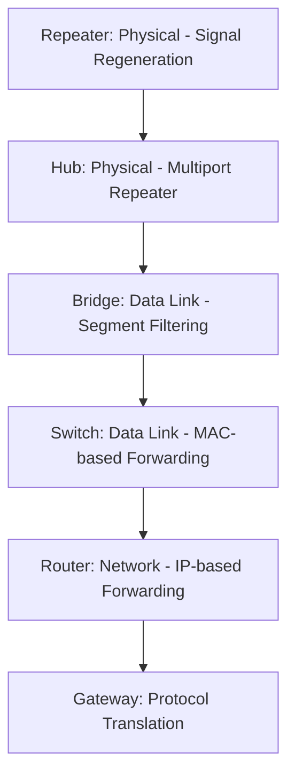

### Communication Model

Every data communication system can be modeled as:

```
Sender → Transmission System → Receiver
```

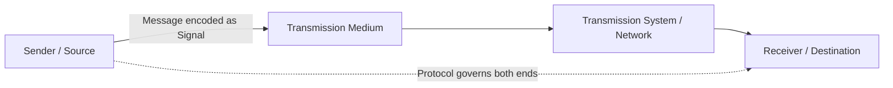

**Core components:**

| Component | Description |
|---|---|
| **Sender** | The device/entity that originates and transmits the message |
| **Receiver** | The device/entity that receives and interprets the message |
| **Message** | The actual data/information being communicated (text, audio, video, etc.) |
| **Transmission Medium** | Physical or wireless path over which the message travels (copper cable, fiber, radio waves) |
| **Protocol** | Agreed-upon set of rules that govern format, timing, sequencing, and error handling of communication |

### Data vs Signal

- **Data** — Information in raw form (text, numbers, images) — meaningful to humans/applications, not directly transmittable.
- **Signal** — The electrical, optical, or electromagnetic encoding of data that is actually transmitted over a medium.

#### Analog Signal
A continuous signal that varies smoothly over time (e.g., sine wave); can take infinite values within a range. Used in traditional telephone lines, some radio transmissions.

#### Digital Signal
A discrete signal represented by distinct levels (typically two: 0 and 1); more robust to noise, easier to regenerate.

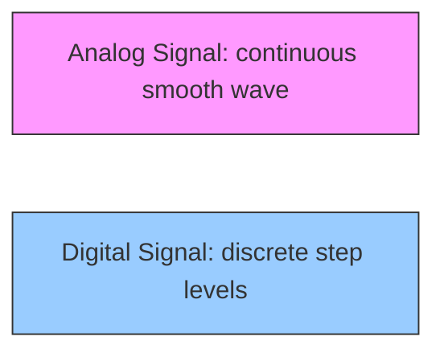

### Encoding
The process of converting data into a signal format suitable for transmission over a medium (e.g., Manchester encoding, NRZ, PCM for analog-to-digital conversion).

### Transmission
The physical act of sending encoded signals across a medium from sender to receiver.

### Key Performance Terms

| Term | Definition |
|---|---|
| **Bandwidth** | The maximum rate at which data can be transmitted over a channel, measured in bits per second (bps) or Hz for analog channels — represents *capacity* |
| **Throughput** | The actual rate of successful data delivery over a channel — always ≤ bandwidth, affected by congestion, errors, overhead |
| **Latency** | The time taken for a bit/packet to travel from sender to receiver (one-way delay) |
| **Jitter** | The variation in latency/delay between consecutive packets — critical for real-time applications like VoIP/video |
| **Packet Loss** | The percentage/count of packets that fail to reach the destination, usually due to congestion, errors, or link failure |

**Analogy:** Bandwidth is like the width of a highway (number of lanes); throughput is the actual traffic flow rate achieved given congestion; latency is the travel time for one car; jitter is the variation in travel time between cars.

---

## SECTION 2 — NETWORK TOPOLOGIES

A **topology** describes the arrangement of nodes and links in a network — can refer to **physical topology** (actual layout of cables/devices) or **logical topology** (how data actually flows).

### Bus Topology

All devices are connected to a single central cable (the "bus" or "backbone"), with terminators at both ends to prevent signal reflection.

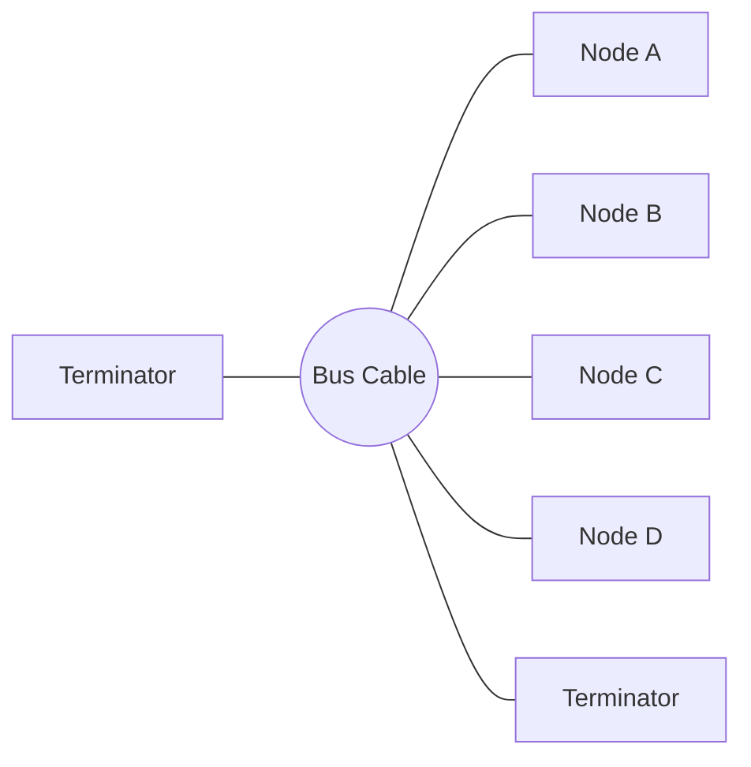

| Aspect | Detail |
|---|---|
| Structure | Single shared backbone cable; all nodes tap into it |
| Advantages | Low cost, easy to install, requires less cable |
| Disadvantages | Entire network fails if backbone cable breaks; difficult to troubleshoot; performance degrades as nodes increase (shared medium, collisions) |
| Failure behavior | Single point of failure — a break anywhere disables the whole segment |
| Typical use | Early Ethernet (10BASE2/10BASE5), small legacy LANs |

### Star Topology

All devices connect individually to a central device (hub or switch).

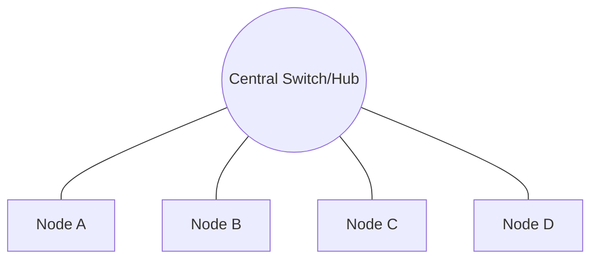

| Aspect | Detail |
|---|---|
| Structure | Central hub/switch with point-to-point links to each node |
| Advantages | Easy to install/manage, failure of one node doesn't affect others, easy fault isolation |
| Disadvantages | Central device failure brings down entire network; requires more cable than bus |
| Failure behavior | Single point of failure is the central device only |
| Typical use | Most common in modern LANs (Ethernet with switches) |

### Ring Topology

Each device connects to exactly two other devices, forming a circular data path. Data travels in one direction (or both, in dual-ring setups).

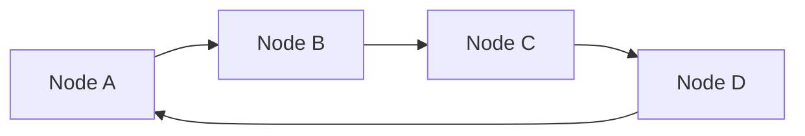

| Aspect | Detail |
|---|---|
| Structure | Circular chain of point-to-point links |
| Advantages | Orderly access to medium (via token passing), reduces collisions |
| Disadvantages | Single link/node failure can disrupt whole ring (unless dual-ring); adding/removing nodes disrupts network |
| Failure behavior | Single break can affect entire ring in unidirectional rings |
| Typical use | Token Ring, FDDI (Fiber Distributed Data Interface) |

### Mesh Topology

Every device connects to every other device (full mesh) or to several others (partial mesh).

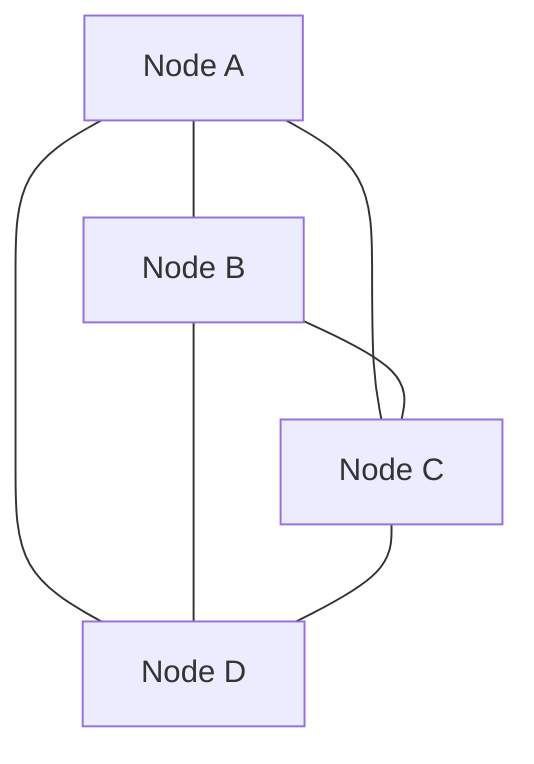

| Aspect | Detail |
|---|---|
| Structure | Direct links between many/all node pairs |
| Advantages | Highly fault-tolerant, no single point of failure, high redundancy |
| Disadvantages | Expensive (n(n−1)/2 links for full mesh), complex wiring/management |
| Failure behavior | Very resilient — alternate paths exist |
| Typical use | Backbone networks, WAN interconnections, critical military/financial networks |

**Formula:** Number of links required in a full mesh of *n* nodes = **n(n−1)/2**

### Tree Topology

A hierarchical structure combining star networks connected via a bus — essentially multiple star topologies linked together through a root/backbone.

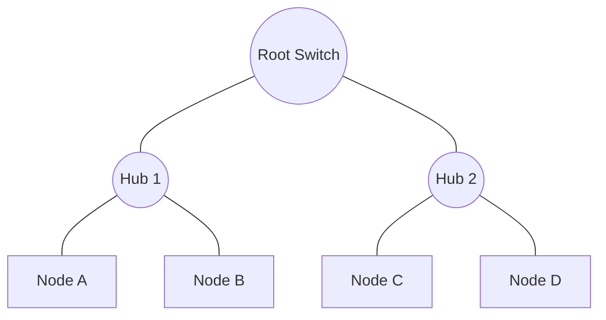

| Aspect | Detail |
|---|---|
| Structure | Hierarchical/parent-child arrangement of star networks |
| Advantages | Scalable, easy to expand, supports hierarchical management |
| Disadvantages | Root/backbone failure disrupts large portions of network; heavy cabling |
| Failure behavior | Failure impact depends on level — higher-level failures are more disruptive |
| Typical use | Large corporate networks, campus networks |

### Hybrid Topology

A combination of two or more different topologies (e.g., star-bus, star-ring) to leverage advantages of each and meet specific organizational needs.

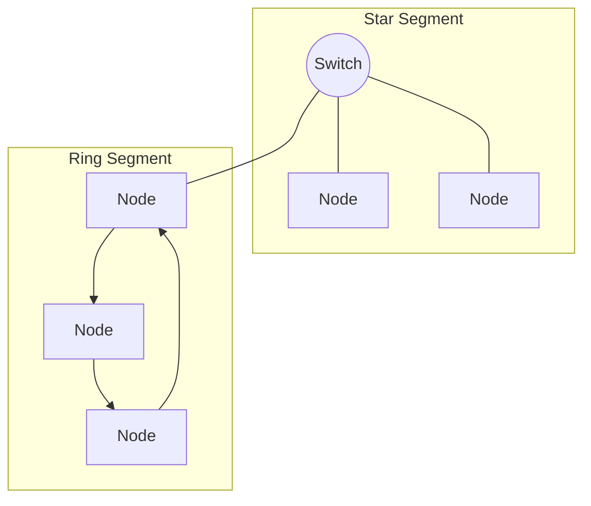

| Aspect | Detail |
|---|---|
| Structure | Mix of topologies joined together |
| Advantages | Flexible, scalable, can isolate faults per segment |
| Disadvantages | Complex design and management, higher cost |
| Failure behavior | Depends on which segment/topology fails |
| Typical use | Large enterprise/campus networks with mixed requirements |

### Topology Comparison Table

| Topology | Cost | Fault Tolerance | Scalability | Cable Usage | Single Point of Failure |
|---|---|---|---|---|---|
| Bus | Low | Low | Poor | Low | Backbone cable |
| Star | Medium | Medium | Good | Medium-High | Central device |
| Ring | Medium | Low-Medium | Moderate | Medium | Any link (unidirectional) |
| Mesh | High | Very High | Poor (cost grows quadratically) | Very High | None (full mesh) |
| Tree | Medium-High | Medium | Very Good | High | Root/backbone |
| Hybrid | High | High (varies) | Very Good | Varies | Depends on design |

### Point-to-Point vs Multipoint

- **Point-to-Point:** A dedicated link between exactly two devices (e.g., a direct leased line between two routers).
- **Multipoint (Multidrop):** A single link shared among more than two devices, with the medium's capacity shared in time or frequency.

### Data Flow Modes

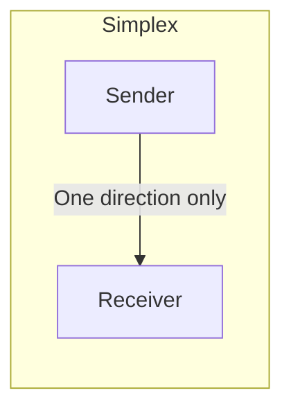

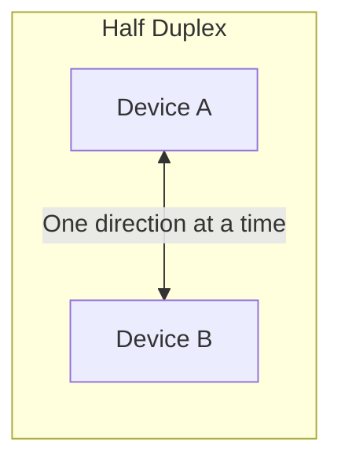

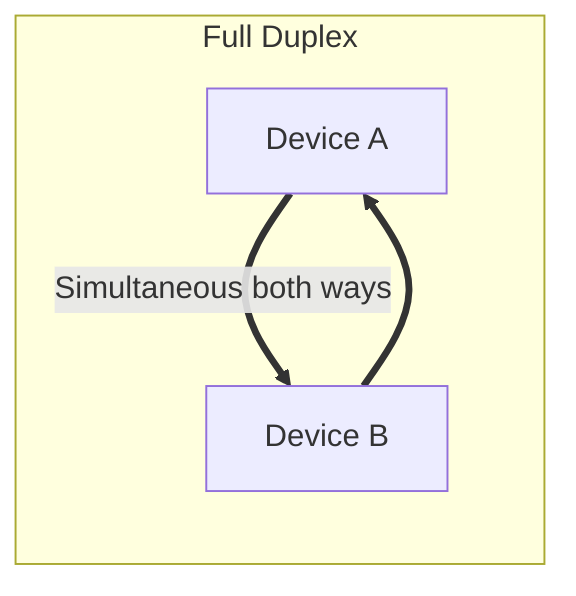

| Mode | Description | Example |
|---|---|---|
| **Simplex** | Data flows in only one direction; sender cannot receive, receiver cannot send | Keyboard → CPU, TV broadcast |
| **Half Duplex** | Data flows both directions, but only one direction at a time | Walkie-talkie, old Hub-based Ethernet |
| **Full Duplex** | Data flows both directions simultaneously | Telephone call, modern switched Ethernet |

---

## SECTION 3 — OSI MODEL

The **OSI (Open Systems Interconnection) Model** is a conceptual, 7-layer framework standardized by ISO that describes how data communication should be structured, enabling interoperability between different systems and vendors.

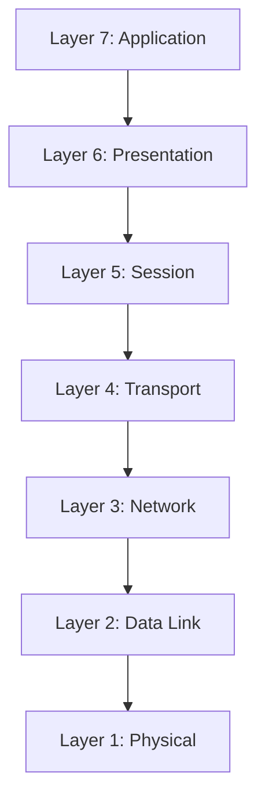

**Mnemonic:** "**A**ll **P**eople **S**eem **T**o **N**eed **D**ata **P**rocessing" (Application → Physical)

### Layer 7 — Application Layer
- **Purpose:** Provides network services directly to end-user applications; the interface between the network and software applications.
- **Responsibilities:** Resource sharing, remote file access, directory services, email, web browsing.
- **Protocols:** HTTP, HTTPS, FTP, SMTP, DNS, Telnet, SSH.
- **Addressing:** None specific (application uses URLs/domain names resolved via DNS).
- **PDU:** Data (Message).
- **Devices:** Application-layer firewalls, proxy servers, gateways.
- **Real-world example:** A web browser requesting a page via HTTP.

### Layer 6 — Presentation Layer
- **Purpose:** Translates, encrypts, and compresses data so the application layer can consume it independent of the underlying data representation.
- **Responsibilities:** Data translation (character encoding like ASCII/Unicode), encryption/decryption (SSL/TLS), compression.
- **Protocols:** SSL/TLS, JPEG, MPEG, ASCII/EBCDIC conversion.
- **Addressing:** None.
- **PDU:** Data.
- **Devices:** Gateways (protocol/format translation).
- **Real-world example:** Encrypting data before sending over HTTPS; converting image formats.

### Layer 5 — Session Layer
- **Purpose:** Establishes, manages, and terminates sessions (dialogues) between two communicating applications.
- **Responsibilities:** Session establishment/maintenance/termination, synchronization (checkpointing), dialog control (who transmits when).
- **Protocols:** NetBIOS, RPC, PPTP, session management in APIs.
- **Addressing:** Session IDs.
- **PDU:** Data.
- **Devices:** Gateways.
- **Real-world example:** A video call session maintaining continuous connection state; login sessions.

### Layer 4 — Transport Layer
- **Purpose:** Provides end-to-end (host-to-host) communication, reliability, and flow control between processes on different machines.
- **Responsibilities:** Segmentation/reassembly, error control, flow control, connection establishment (TCP) or connectionless delivery (UDP), multiplexing via ports.
- **Protocols:** TCP, UDP, SCTP.
- **Addressing:** Port numbers (0–65535).
- **PDU:** Segment (TCP) / Datagram (UDP).
- **Devices:** Firewalls (stateful), Load balancers.
- **Real-world example:** A browser and web server negotiating a TCP connection using port 443.

### Layer 3 — Network Layer
- **Purpose:** Handles logical addressing and routing of packets across multiple networks to reach the destination host.
- **Responsibilities:** Logical (IP) addressing, routing, path determination, fragmentation.
- **Protocols:** IP (IPv4/IPv6), ICMP, IGMP, routing protocols (OSPF, BGP, RIP).
- **Addressing:** IP addresses.
- **PDU:** Packet.
- **Devices:** Router, Layer-3 switch.
- **Real-world example:** A router forwarding a packet from a home network to the internet based on destination IP.

### Layer 2 — Data Link Layer
- **Purpose:** Provides node-to-node (hop-by-hop) delivery within the same network segment; handles physical addressing and error detection at the frame level.
- **Responsibilities:** Framing, MAC addressing, error detection (CRC), flow control, media access control (CSMA/CD, CSMA/CA).
- **Protocols:** Ethernet, PPP, HDLC, ARP (sometimes classified here), Wi-Fi (802.11) MAC sublayer.
- **Addressing:** MAC addresses (48-bit).
- **PDU:** Frame.
- **Devices:** Switch, Bridge, NIC.
- **Real-world example:** A switch forwarding an Ethernet frame based on destination MAC address.
- **Sublayers:** LLC (Logical Link Control) — interfaces with network layer; MAC (Media Access Control) — handles addressing and channel access.

### Layer 1 — Physical Layer
- **Purpose:** Transmits raw, unstructured bit streams over a physical medium.
- **Responsibilities:** Bit-by-bit transmission, voltage levels, cable types, connectors, data rates, physical topology.
- **Protocols/Standards:** Ethernet physical standards (10BASE-T), USB, Bluetooth radio layer, DSL.
- **Addressing:** None (raw bits only).
- **PDU:** Bit.
- **Devices:** Hub, Repeater, cables, connectors.
- **Real-world example:** Electrical signals traveling through a copper Ethernet cable.

### OSI Model Summary Table

| Layer | Function | PDU | Address | Protocols | Devices |
|---|---|---|---|---|---|
| 7. Application | End-user services, network access for apps | Data | None (URLs/domain names) | HTTP, HTTPS, FTP, SMTP, DNS | Proxy, App Firewall |
| 6. Presentation | Translation, encryption, compression | Data | None | TLS/SSL, JPEG, MPEG | Gateway |
| 5. Session | Session establishment/management | Data | Session ID | NetBIOS, RPC, PPTP | Gateway |
| 4. Transport | End-to-end delivery, reliability | Segment/Datagram | Port numbers | TCP, UDP | Firewall, Load Balancer |
| 3. Network | Logical addressing, routing | Packet | IP address | IP, ICMP, OSPF, BGP | Router |
| 2. Data Link | Node-to-node delivery, framing | Frame | MAC address | Ethernet, PPP, ARP | Switch, Bridge, NIC |
| 1. Physical | Raw bit transmission | Bit | None | Ethernet PHY, USB | Hub, Repeater, Cables |

### Headers, Trailers, Encapsulation, and Decapsulation

- **Header:** Control information prepended to data at each layer (e.g., source/destination addresses, sequence numbers, checksums).
- **Trailer:** Control information appended at the end, mainly used at the Data Link layer for error detection (e.g., FCS — Frame Check Sequence).
- **Encapsulation:** The process where each layer adds its own header (and sometimes trailer) to the data received from the layer above, as it moves down the stack at the sender.
- **Decapsulation:** The reverse process at the receiver — each layer strips off its corresponding header/trailer as data moves up the stack, until the original data reaches the application.

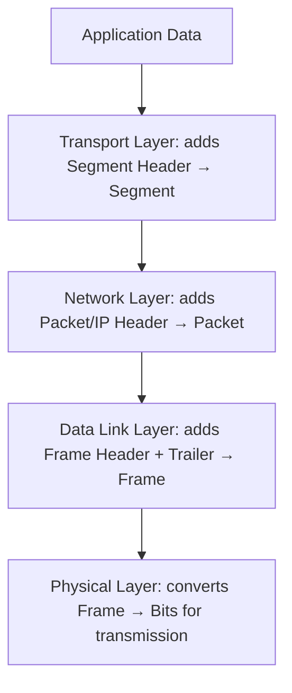

**Encapsulation walkthrough (sender side):**
1. Application generates data (e.g., HTTP request).
2. Transport layer adds a header (ports, sequence numbers) → forms a **Segment**.
3. Network layer adds an IP header (source/destination IP) → forms a **Packet**.
4. Data Link layer adds a frame header (MAC addresses) and trailer (FCS) → forms a **Frame**.
5. Physical layer converts the frame into a **bit stream** for transmission over the medium.

**Decapsulation walkthrough (receiver side):** the exact reverse — Physical layer receives bits → Data Link strips frame header/trailer and checks for errors → Network layer strips IP header and checks destination → Transport layer strips segment header, reorders/reassembles → Application layer receives the original data.

---

## SECTION 4 — TCP/IP MODEL

The **TCP/IP Model** (also called the Internet Model) is a practical, 4-layer model that the modern internet is actually built on — developed before OSI and more implementation-driven.

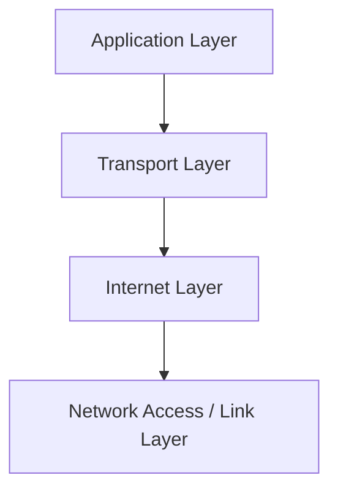

### Layer Descriptions

- **Application Layer:** Combines OSI's Application, Presentation, and Session layers. Handles user-facing protocols and data formatting/sessions directly. Examples: HTTP, HTTPS, DNS, FTP, SMTP.
- **Transport Layer:** Same role as OSI Transport — end-to-end communication, reliability (TCP) or speed (UDP), port-based multiplexing.
- **Internet Layer:** Equivalent to OSI Network layer — logical addressing and routing. Examples: IP, ICMP, ARP (sometimes placed here).
- **Network Access / Link Layer:** Combines OSI's Data Link and Physical layers — handles physical addressing, framing, and transmission over the actual medium.

### OSI vs TCP/IP Mapping

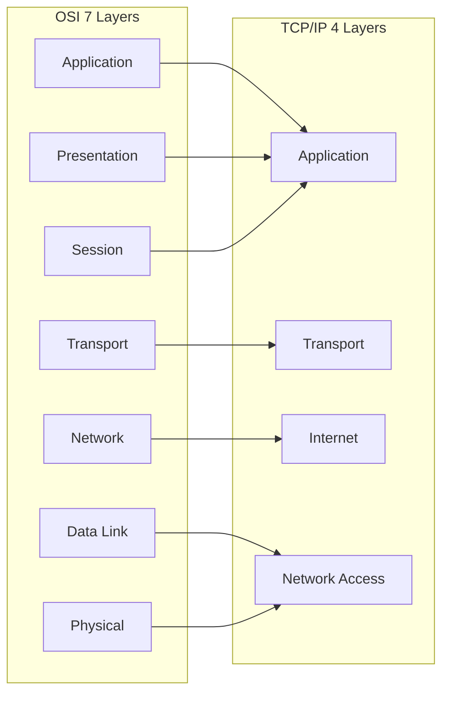

### OSI vs TCP/IP Comparison Table

| Aspect | OSI Model | TCP/IP Model |
|---|---|---|
| Number of layers | 7 | 4 (sometimes described as 5, splitting Link into Data Link + Physical) |
| Development approach | Theoretical, standard-first (ISO) | Practical, protocol-first (used to build the internet) |
| Layer separation | Strict, each layer independent | Application layer combines 3 OSI layers |
| Usage | Reference/teaching model | Actual model implemented in the real internet |
| Protocol dependency | Protocol-independent | Tightly coupled to TCP/IP protocol suite |
| Reliability guarantee | Not inherent to model | Depends on TCP (reliable) vs UDP (unreliable) at Transport |

### Protocol-to-Layer Mapping (Real Examples)

| Protocol | Layer (TCP/IP) | Purpose |
|---|---|---|
| HTTP | Application | Unencrypted web page transfer |
| HTTPS | Application | Encrypted web page transfer (HTTP + TLS) |
| DNS | Application | Resolves domain names to IP addresses |
| FTP | Application | File transfer between hosts |
| SMTP | Application | Sending email |
| TCP | Transport | Reliable, connection-oriented byte stream delivery |
| UDP | Transport | Unreliable, connectionless, low-overhead delivery |
| IP | Internet | Logical addressing and routing of packets |
| ICMP | Internet | Error reporting and diagnostics (e.g., ping) |
| ARP | Internet/Link boundary | Resolves IP address to MAC address on a LAN |
| Ethernet | Network Access | Framing and MAC addressing over wired LAN |
| Wi-Fi (802.11) | Network Access | Framing and MAC addressing over wireless LAN |

---

## SECTION 5 — CIRCUIT SWITCHING

**Circuit switching** is a communication method where a dedicated, exclusive communication path (circuit) is established between sender and receiver **before** data transfer begins, and this path remains reserved for the entire duration of the session.

### Three Phases

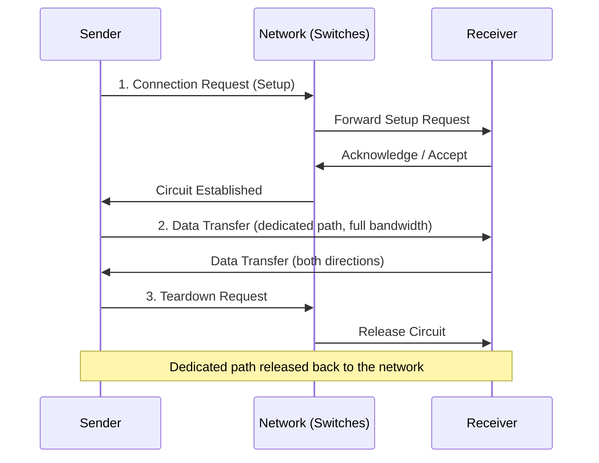

1. **Circuit Establishment (Setup):** A dedicated path is set up across all intermediate switches/nodes from sender to receiver before any data is sent. Involves signaling to reserve resources at each hop.
2. **Data Transfer:** Data flows continuously through the established, dedicated path at a fixed data rate. No addressing needed within the data itself since the path is fixed.
3. **Circuit Termination (Teardown):** After the session ends, the circuit is released and the reserved resources are freed for other uses.

### Key Characteristics

| Property | Description |
|---|---|
| **Dedicated bandwidth** | The entire reserved capacity belongs exclusively to the connection, even during idle periods |
| **Delay** | Setup delay is incurred once, but after that, near-zero (constant, predictable) delay during transfer |
| **Resource utilization** | Often inefficient — bandwidth reserved even when no data is being sent (e.g., silence during a phone call) |
| **Blocking** | If all circuits/resources are busy, new connection requests are blocked (busy signal) until a circuit frees up |
| **Example** | Traditional PSTN (Public Switched Telephone Network) — a phone call reserves a fixed circuit for the whole call duration |

**Placement-relevant insight:** Circuit switching trades efficiency for predictability — it guarantees consistent bandwidth and low, stable latency once established, which is why it was ideal for voice calls where jitter is unacceptable, but wasteful for bursty data traffic like web browsing.

---

## SECTION 6 — PACKET SWITCHING

**Packet switching** breaks data into smaller units called **packets**, each sent independently through the network and reassembled at the destination. No dedicated path is reserved.

### Datagram Networks (Connectionless)
- Each packet (datagram) is routed **independently** and may take different paths to reach the destination.
- No connection setup phase.
- Packets may arrive out of order and must be reordered at the destination.
- Example: IP (Internet Protocol) itself is connectionless/datagram-based.

### Virtual Circuit Networks (Connection-Oriented Packet Switching)
- A logical path is established before data transfer (similar in spirit to circuit switching, but resources aren't exclusively reserved).
- All packets follow the **same predetermined path** and arrive in order.
- Example: ATM (Asynchronous Transfer Mode), MPLS, Frame Relay.

### Store-and-Forward
Each intermediate switch/router **receives the entire packet, stores it in a buffer, checks for errors, and then forwards it** to the next hop only once fully received. This is fundamental to how packet-switched networks operate (as opposed to circuit switching's real-time relay).

### Packet Fragmentation
When a packet is larger than the Maximum Transmission Unit (MTU) of a network link, it is broken into smaller fragments, each with its own header, and reassembled at the final destination (or next hop, depending on protocol).

### Routing Packets
Routers examine the destination address in each packet's header and use routing tables (populated via routing protocols like OSPF/BGP) to determine the next hop toward the destination.

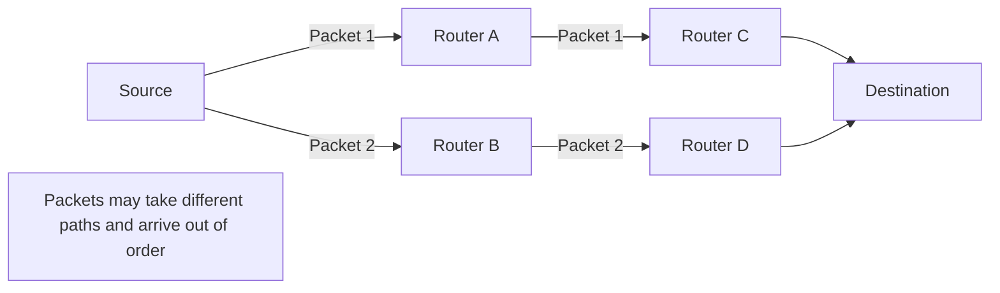

### Circuit Switching vs Packet Switching — Detailed Comparison

| Aspect | Circuit Switching | Packet Switching |
|---|---|---|
| Path | Dedicated, fixed path reserved for entire session | No dedicated path; packets routed independently (datagram) or via logical path (VC) |
| Setup required | Yes, before data transfer | No (datagram) / Yes but no dedicated bandwidth (VC) |
| Bandwidth usage | Reserved exclusively, even if idle | Shared dynamically among many users |
| Delay | Setup delay upfront, but consistent low delay after | Variable delay per packet (queuing at each hop) |
| Efficiency | Lower (wasted idle bandwidth) | Higher (statistical multiplexing) |
| Order of arrival | Guaranteed (single fixed path) | May be out of order (datagram); guaranteed (VC) |
| Failure resilience | Circuit failure disrupts entire session | Alternate paths can be used per packet (datagram) |
| Overhead | Low per-packet overhead (no per-packet addressing) | Higher per-packet overhead (each packet needs header) |
| Example | PSTN phone calls | Internet (IP), Ethernet |
| Best suited for | Real-time, constant bit-rate traffic (voice) | Bursty data traffic (web, email, file transfer) |

### Packet Delay Components

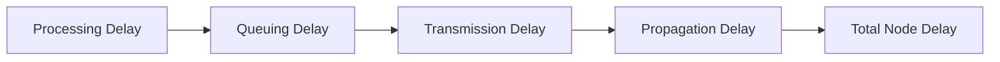

**Formula:**
```
Total Delay = Processing Delay + Queuing Delay + Transmission Delay + Propagation Delay
```

| Component | Description |
|---|---|
| **Processing Delay** | Time taken by a router/switch to examine the packet header, check for bit errors, and determine the output link (typically microseconds) |
| **Queuing Delay** | Time the packet waits in the router's output buffer/queue before it can be transmitted, depends on congestion level at that router |
| **Transmission Delay** | Time required to push all of the packet's bits onto the link = Packet Size / Link Bandwidth |
| **Propagation Delay** | Time for a bit to travel from one end of the link to the other = Distance / Propagation Speed of the medium |

**Important distinction (frequently tested):**
- **Transmission delay** depends on packet size and link **rate** — it's about how fast you can *push* bits out.
- **Propagation delay** depends on physical **distance** and the medium's signal speed — it's about how long it takes a bit to *travel* once it's on the wire.

---

## SECTION 7 — NETWORK PERFORMANCE AND DATA RATE

### Core Definitions

| Term | Definition |
|---|---|
| **Bandwidth** | Maximum theoretical data-carrying capacity of a channel (bps) |
| **Bit Rate** | Number of bits transmitted per second |
| **Baud Rate** | Number of signal changes (symbols) per second — bit rate = baud rate × bits per symbol |
| **Throughput** | Actual achieved data transfer rate, always ≤ bandwidth |
| **Goodput** | Actual rate of *useful* application-level data delivered, excluding protocol overhead, retransmissions, and headers — goodput ≤ throughput ≤ bandwidth |
| **Latency** | One-way delay from sender to receiver |
| **RTT (Round-Trip Time)** | Time for a signal to travel from sender to receiver and back |
| **Jitter** | Variation in latency across packets |
| **Packet Loss** | Fraction of packets that fail to arrive |

**Relationship:** `Bandwidth ≥ Throughput ≥ Goodput`

### Formulas and Worked Examples

#### 1. Transmission Delay
```
Transmission Delay = Packet Size / Transmission Rate
```
**Example:** A packet of size 1,000,000 bits (1 Mb) is sent over a link with a transmission rate of 1 Mbps.
```
Transmission Delay = 1,000,000 bits / 1,000,000 bps = 1 second
```

#### 2. Propagation Delay
```
Propagation Delay = Distance / Propagation Speed
```
**Example:** A signal travels 2,000 km over a fiber optic cable where propagation speed ≈ 2 × 10⁸ m/s.
```
Distance = 2,000 km = 2 × 10⁶ m
Propagation Delay = (2 × 10⁶ m) / (2 × 10⁸ m/s) = 0.01 s = 10 ms
```

#### 3. Total Delay Example (combining both)
Given: Packet size = 5,000 bits, Bandwidth = 100 Mbps, Distance = 1,000 km, Propagation speed = 2 × 10⁸ m/s.

```
Transmission Delay = 5,000 / (100 × 10⁶) = 0.00005 s = 50 µs
Propagation Delay = (1 × 10⁶ m) / (2 × 10⁸ m/s) = 0.005 s = 5 ms
Total Delay (ignoring processing & queuing) = 50 µs + 5 ms ≈ 5.05 ms
```

#### 4. Bandwidth-Delay Product (BDP)
```
BDP = Bandwidth × RTT
```
Represents the maximum amount of data "in flight" on the link at any given time — critical for sizing TCP window sizes for maximum throughput.

**Example:** Bandwidth = 10 Mbps, RTT = 100 ms.
```
BDP = 10 × 10⁶ bps × 0.1 s = 1 × 10⁶ bits = 1 Mb = 125,000 bytes (≈122 KB)
```
**Interpretation:** To fully utilize this link, the sender's TCP window/buffer must be at least 125 KB; otherwise, the sender will stall waiting for acknowledgments, underutilizing available bandwidth.

#### 5. Throughput Given Loss (illustrative)
If a link has bandwidth 100 Mbps but 20% of packets are lost and must be retransmitted, effective goodput is reduced — approximately:
```
Effective Goodput ≈ Bandwidth × (1 − Loss Rate) [simplified model, ignoring retransmission overhead]
Effective Goodput ≈ 100 Mbps × 0.8 = 80 Mbps (upper bound estimate)
```
(Note: real-world goodput under loss is more complex due to retransmission timers and congestion control back-off, but this gives an intuitive estimate.)

### Bandwidth vs Throughput vs Goodput vs Latency — Clarified

| Term | What it measures | Analogy |
|---|---|---|
| **Bandwidth** | Theoretical max capacity of the pipe | Width of a water pipe |
| **Throughput** | Actual water flow achieved, given real-world conditions | Actual flow rate considering friction/leaks |
| **Goodput** | Useful water delivered (excluding water lost to leaks/spillage, i.e., overhead/retransmissions) | Water that actually reaches the tap, minus spillage |
| **Latency** | Time for one drop of water to travel the pipe | Travel time of a single water molecule |

---

## SECTION 8 — TRANSMISSION IMPAIRMENT

Signals degrade as they travel through a medium due to several forms of impairment:

### Attenuation
The loss of signal strength/energy as it travels over distance, due to resistance in the medium. Compensated for using amplifiers (analog) or repeaters (digital).

### Distortion
Occurs when a signal's shape changes due to differing propagation speeds of different frequency components traveling through the medium — common in composite (multi-frequency) signals.

### Noise
Unwanted random signals that interfere with the intended signal. Types include:
- **Thermal noise** — random motion of electrons in the medium.
- **Crosstalk** — interference from adjacent signal-carrying wires.
- **Impulse noise** — sudden spikes from external electrical disturbances.

### Signal-to-Noise Ratio (SNR)
Measures how much stronger the signal is compared to the background noise — a key indicator of link quality.

```
SNR(dB) = 10 log10(Signal Power / Noise Power)
```

**Numerical Example:**
Given Signal Power = 1000 mW, Noise Power = 1 mW.
```
SNR = Signal Power / Noise Power = 1000 / 1 = 1000
SNR(dB) = 10 × log10(1000) = 10 × 3 = 30 dB
```
A higher SNR (in dB) indicates a cleaner signal relative to noise, and generally supports higher achievable data rates (per Shannon's theorem).

### Effect of Transmission Impairment on Network Performance
- **Higher attenuation/noise** → more bit errors → more retransmissions → lower effective throughput/goodput.
- **Lower SNR** → theoretical maximum channel capacity (per Shannon's Capacity theorem) decreases, limiting achievable bit rates.
- **Distortion** in high-speed digital links can cause inter-symbol interference, increasing bit error rate (BER).
- Real-world protocols use **error detection** (CRC, checksums) and **error correction** (FEC, ARQ) to mitigate the effects of these impairments, but at the cost of overhead and reduced goodput.

---

## VISUAL PLACEHOLDERS (Where real images would help)


Image suggestion:
"Diagram showing the 7 OSI layers stacked vertically, each with example protocols and PDU names labeled alongside."


Image suggestion:
"Side-by-side diagram showing the 7 OSI layers mapped against the 4 TCP/IP layers with arrows connecting corresponding layers."


Image suggestion:
"Grid of six diagrams showing Bus, Star, Ring, Mesh, Tree, and Hybrid topologies with nodes and links clearly drawn."


Image suggestion:
"Timeline diagram showing a packet moving through a router with labeled segments for processing delay, queuing delay, transmission delay, and propagation delay."

---

## Part 1 Completion Summary

The following topics have been covered in Part 1:

- Networking foundations: definition, purpose, components (hosts, clients, servers, NIC, router, switch, hub, bridge, repeater, gateway, modem, access point, firewall)
- Communication model (sender, receiver, message, medium, protocol)
- Data vs signal, analog vs digital signals, encoding, transmission
- Core performance terms: bandwidth, throughput, latency, jitter, packet loss
- Network topologies: Bus, Star, Ring, Mesh, Tree, Hybrid (structure, advantages, disadvantages, failure behavior, use cases)
- Point-to-point vs multipoint connections
- Data flow modes: Simplex, Half Duplex, Full Duplex
- OSI Model: all 7 layers with purpose, responsibilities, protocols, addressing, PDU, devices, and real-world examples
- Headers, trailers, encapsulation, and decapsulation with diagrams
- TCP/IP Model: 4 layers, OSI-to-TCP/IP mapping, protocol examples
- Circuit switching: setup, data transfer, teardown phases; dedicated bandwidth, delay, blocking
- Packet switching: datagram vs virtual circuit networks, store-and-forward, fragmentation, routing
- Circuit switching vs packet switching detailed comparison
- Packet delay components: processing, queuing, transmission, propagation delays with formulas
- Network performance metrics: bandwidth, bit rate, baud rate, throughput, goodput, latency, RTT, jitter, packet loss
- Worked numerical examples: transmission delay, propagation delay, total delay, bandwidth-delay product
- Transmission impairments: attenuation, distortion, noise, SNR with worked numerical example
- Mermaid diagrams for: communication model, all topologies, OSI model, TCP/IP model, encapsulation, circuit switching, packet switching, packet delay components

---

## SECTION 9 — ERROR DETECTION AND CORRECTION

Whenever data is transmitted over a physical medium, bits can get flipped due to noise, attenuation, or interference (see Section 8). Networks must be able to detect — and sometimes correct — these errors without requiring the application layer to worry about them.

### Error Detection vs Error Correction

- **Error Detection:** The receiver can determine *that* an error occurred, but not necessarily fix it. Typically triggers a retransmission request (ARQ).
- **Error Correction:** The receiver can determine *that* an error occurred **and** identify (and fix) exactly which bit(s) were corrupted, without needing retransmission — also called **Forward Error Correction (FEC)**.

### Single-bit Errors vs Burst Errors

- **Single-bit error:** Only one bit in a data unit is flipped (0→1 or 1→0).
- **Burst error:** Two or more *consecutive* bits are altered — common on real transmission lines since noise (e.g., a lightning strike, a signal fade) usually affects a contiguous duration, not a single instant.

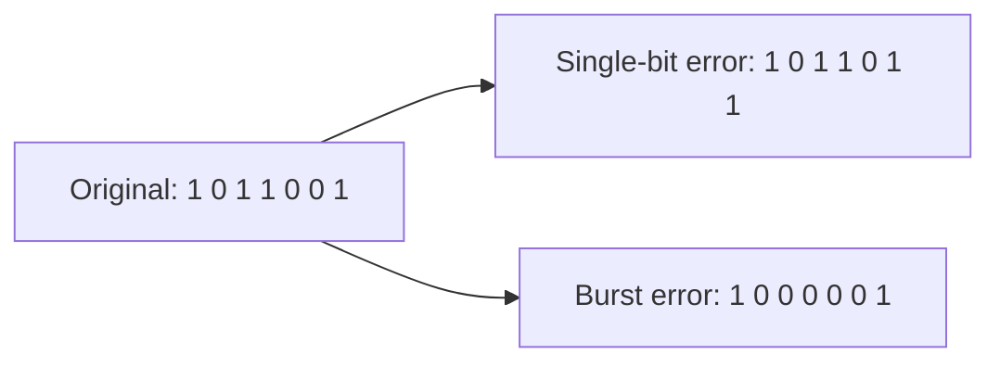

### Redundancy

The core principle behind all error detection/correction: **extra bits are added to the data** (redundant information) that are mathematically derived from the original data. The receiver recomputes this redundant value and compares it against the received value to detect (or correct) discrepancies. More redundant bits generally provide stronger error detection/correction capability at the cost of overhead (reduced goodput).

The four classical techniques, in order of increasing sophistication:

```mermaid
graph TD
    P[Parity Check: Detects single-bit errors] --> C2[Checksum: Detects burst errors, used in Internet protocols]
    C2 --> CRC[CRC: Strong burst-error detection, used in Ethernet/Data Link]
    CRC --> H[Hamming Code: Detects AND corrects single-bit errors]
```

---

### 1. Parity Check

**Purpose:** Simplest error-detection scheme; detects an **odd number of bit errors** (primarily single-bit errors).

**Concept:** One extra **parity bit** is appended to the data such that the total number of 1s (including the parity bit) is either always even (**even parity**) or always odd (**odd parity**).

**Step-by-step process:**
1. Sender counts the number of 1s in the data.
2. Sender sets the parity bit so the total count of 1s matches the chosen scheme (even/odd).
3. Sender transmits data + parity bit.
4. Receiver recounts the number of 1s in the received data (including parity bit).
5. If the count doesn't match the expected parity, an error is flagged.

**Pseudocode:**
```
function generate_even_parity(data_bits):
    count_of_ones = count(data_bits, '1')
    if count_of_ones % 2 == 0:
        parity_bit = 0
    else:
        parity_bit = 1
    return data_bits + parity_bit

function check_parity(received_bits):
    count_of_ones = count(received_bits, '1')
    if count_of_ones % 2 != 0:   # for even parity scheme
        return "ERROR DETECTED"
    else:
        return "OK (or undetected error)"
```

**Binary example (even parity):**
```
Data:            1 0 1 1 0 0 1   → number of 1s = 4 (even)
Parity bit:      0
Transmitted:     1 0 1 1 0 0 1 0

Suppose bit 3 flips during transmission:
Received:        1 0 0 1 0 0 1 0  → number of 1s = 3 (odd)
Receiver expects even parity → mismatch → ERROR DETECTED
```

**Detection capability:** Detects all single-bit errors and any odd number of bit errors. **Cannot detect even numbers of bit errors** (e.g., 2 bits flipped cancels out and parity still matches) and **cannot correct** any errors (doesn't know which bit is wrong).

**Advantages:** Extremely simple, minimal overhead (1 bit), fast to compute.

**Limitations:** Weak — misses burst errors and even-count bit flips; provides no correction capability.

**Comparison:** Weakest of the four techniques; used only where simplicity is critical (e.g., simple serial communication like RS-232), not used in modern high-reliability networking alone.

---

### 2. Checksum

**Purpose:** Used at higher layers (e.g., IP, TCP, UDP headers) to detect errors across an entire segment/packet using arithmetic sum rather than bitwise structure.

**Concept:** The data is divided into fixed-size sections (words), all sections are added together using **one's complement addition**, and the complement of the sum is sent as the checksum.

**Step-by-step (sender):**
1. Divide data into `n`-bit sections (commonly 16-bit words).
2. Add all sections together using one's complement addition (any carry-out is wrapped around and added back in).
3. Complement (invert all bits of) the final sum → this is the **checksum**.
4. Append checksum to the data and transmit.

**Step-by-step (receiver):**
1. Divide received data (including checksum) into the same-sized sections.
2. Add all sections together (including the checksum) using one's complement addition.
3. Complement the result.
4. If the result is all zeros → no error detected. If not all zeros → error detected.

**Pseudocode:**
```
function compute_checksum(words):
    sum = 0
    for word in words:
        sum = sum + word
        if overflow_occurred(sum):
            sum = wrap_around_carry(sum)      # one's complement addition
    checksum = ones_complement(sum)
    return checksum

function verify_checksum(words_with_checksum):
    sum = 0
    for word in words_with_checksum:
        sum = sum + word
        if overflow_occurred(sum):
            sum = wrap_around_carry(sum)
    result = ones_complement(sum)
    return (result == 0)   # True means no error detected
```

**Numerical example (8-bit words, for simplicity):**
```
Data words:  10101001   00111001

Step 1: Add the two words
  10101001
+ 00111001
-----------
 11100010     (no overflow beyond 8 bits here)

Step 2: One's complement the sum
  11100010 → complement → 00011101   (this is the checksum)

Transmitted: 10101001  00111001  00011101 (data + checksum)

Receiver adds all three words:
  10101001
+ 00111001
+ 00011101
-----------
  11111111

Complement of 11111111 = 00000000 → all zeros → NO ERROR DETECTED
```

**Detection capability:** Detects most burst errors and errors that don't cancel out arithmetically; weaker than CRC for certain structured burst patterns (e.g., simultaneous compensating changes can go undetected).

**Advantages:** Computationally cheap (simple addition), widely implemented in software (used by IP, TCP, UDP headers).

**Limitations:** Less robust than CRC — some error patterns (like reordering of words, or specific compensating bit-flips) can go undetected.

**Comparison:** Stronger than parity, but weaker than CRC. Preferred at higher layers (Transport/Network) where hardware CRC support may not be readily available, but software addition is fast.

---

### 3. CRC (Cyclic Redundancy Check)

**Purpose:** The most robust of the classical error-detection techniques; used extensively at the **Data Link Layer** (Ethernet, Wi-Fi) due to its excellent burst-error detection capability. Covered in full detail in Section 11.

**Concept (brief):** Treats the data as a binary polynomial and divides it by a fixed **generator polynomial** using modulo-2 (XOR) division; the remainder becomes the CRC code appended to the data.

**Detection capability:** Detects all single-bit errors, all double-bit errors (with a properly chosen generator), all odd-count errors, and all burst errors shorter than the length of the generator polynomial's degree — extremely strong.

**Advantages:** Very high error-detection accuracy, especially for burst errors; efficient hardware implementation using shift registers.

**Limitations:** No correction capability (detection only); slightly more computation than checksum/parity.

---

### 4. Hamming Code

**Purpose:** The only one of the four classical techniques capable of **both detecting and correcting** single-bit errors without retransmission. Covered in full detail in Section 10.

**Concept (brief):** Multiple parity bits are placed at specific power-of-2 positions within the data, each covering a different, overlapping subset of bits — the pattern of parity mismatches ("syndrome") points directly to the position of the erroneous bit.

**Detection/correction capability:** Detects and corrects all single-bit errors; can detect (but not correct) double-bit errors in the standard (SEC) form; Extended Hamming Code (SEC-DED) can also detect double-bit errors reliably.

**Advantages:** Enables correction without needing a retransmission round-trip — critical for satellite links, memory (ECC RAM), and situations with expensive/high-latency retransmissions.

**Limitations:** Requires more redundant bits than a simple checksum/CRC for equivalent detection strength; not efficient for burst errors (better suited for random single-bit errors).

### Comparison Table — Error Detection/Correction Techniques

| Technique | Detects Single-bit | Detects Burst Errors | Can Correct Errors | Overhead | Typical Layer/Use |
|---|---|---|---|---|---|
| Parity Check | Yes | No (weak) | No | 1 bit | Simple serial links |
| Checksum | Yes | Partial | No | 16/32 bits (word-based) | Transport/Network (TCP, UDP, IP) |
| CRC | Yes | Yes (very strong) | No | Fixed (e.g., 8/16/32 bits) | Data Link (Ethernet, Wi-Fi) |
| Hamming Code | Yes | No (not designed for bursts) | Yes (single-bit) | log-based, e.g., r bits for m data bits | Memory (ECC RAM), satellite links |

---

## SECTION 10 — HAMMING CODE

### Core Concepts

- **Data bits (m):** The actual information bits being transmitted.
- **Parity bits (r):** Extra redundant bits inserted at specific positions to enable error detection and correction.
- **Hamming Distance:** The number of bit positions in which two binary strings differ — Hamming Code is designed so that all valid codewords have a minimum Hamming distance of 3 (enabling single-bit error correction and double-bit error detection).

### Determining the Number of Parity Bits

**Formula:**
```
2^r >= m + r + 1
```

Where:
- **m** = number of data bits
- **r** = number of parity bits (redundant bits) required

This formula ensures there are enough distinct syndrome ("parity check") patterns to represent every possible single-bit error position, plus a "no error" pattern.

**Example calculation:** For m = 4 data bits:
```
Try r = 3: 2^3 = 8   ;   m + r + 1 = 4 + 3 + 1 = 8   →  8 >= 8  ✓ satisfied
```
So **r = 3 parity bits** are needed for 4 data bits, giving a total codeword length of 7 bits — this is the well-known **Hamming(7,4)** code.

### Position of Parity Bits

Parity bits are placed at **positions that are powers of 2**: position 1, 2, 4, 8, 16, ... Data bits fill all the remaining positions.

```
Position:   1   2   3   4   5   6   7
Bit type:   P1  P2  D1  P3  D2  D3  D4
```

Where P1, P2, P3 are parity bits and D1, D2, D3, D4 are data bits.

**Each parity bit covers a specific set of positions**, determined by binary representation of the position index:
- **P1 (position 1)** covers positions where bit 0 of the binary position index is 1: positions 1, 3, 5, 7, ...
- **P2 (position 2)** covers positions where bit 1 of the binary position index is 1: positions 2, 3, 6, 7, ...
- **P3 (position 4)** covers positions where bit 2 of the binary position index is 1: positions 4, 5, 6, 7, ...

```mermaid
graph TD
    P1["P1 covers positions: 1,3,5,7,..."]
    P2["P2 covers positions: 2,3,6,7,..."]
    P3["P3 covers positions: 4,5,6,7,..."]
    subgraph Codeword Positions 1-7
        p1[1: P1] --- p2[2: P2] --- d1[3: D1] --- p3[4: P3] --- d2[5: D2] --- d3[6: D3] --- d4[7: D4]
    end
```

### Complete Worked Binary Example

**Data to send (m = 4 bits): `1 0 1 1`** → D1=1, D2=0, D3=1, D4=1

**Step 1 — Place data bits in their positions, leave parity positions blank:**
```
Position: 1   2   3   4   5   6   7
Bit:      ?   ?   1   ?   0   1   1
                 (D1) (D2)(D3)(D4)
```

**Step 2 — Calculate P1 (covers positions 1, 3, 5, 7):**
```
Positions 3, 5, 7 = D1, D2, D4 = 1, 0, 1
P1 = XOR(1, 0, 1) = 0   (even parity: total count of 1s including P1 must be even)
```

**Step 3 — Calculate P2 (covers positions 2, 3, 6, 7):**
```
Positions 3, 6, 7 = D1, D3, D4 = 1, 1, 1
P2 = XOR(1, 1, 1) = 1
```

**Step 4 — Calculate P3 (covers positions 4, 5, 6, 7):**
```
Positions 5, 6, 7 = D2, D3, D4 = 0, 1, 1
P3 = XOR(0, 1, 1) = 0
```

**Step 5 — Final transmitted codeword:**
```
Position:  1    2    3    4    5    6    7
Bit:       P1=0 P2=1 D1=1 P3=0 D2=0 D3=1 D4=1

Transmitted codeword: 0 1 1 0 0 1 1
```

### How Error Detection Works (Receiver Side)

Suppose the codeword `0 1 1 0 0 1 1` is transmitted, but **bit position 5 gets flipped** during transmission (0 → 1):
```
Received codeword: 0 1 1 0 1 1 1
                    (pos: 1 2 3 4 5 6 7)
```

**Step 1 — Recompute each parity check (C1, C2, C3):**

```
C1 = XOR(bits at positions 1, 3, 5, 7) = XOR(0, 1, 1, 1) = 1   (mismatch → nonzero)
C2 = XOR(bits at positions 2, 3, 6, 7) = XOR(1, 1, 1, 1) = 0   (match → zero)
C3 = XOR(bits at positions 4, 5, 6, 7) = XOR(0, 1, 1, 1) = 1   (mismatch → nonzero)
```

**Step 2 — Form the syndrome (error position):**
```
Syndrome = C3 C2 C1 = 1 0 1 (binary) = 5 (decimal)
```

The syndrome directly gives the **decimal position of the erroneous bit** = **position 5** — exactly where the error was introduced.

**Step 3 — Correct the error:** Flip bit 5 back: `1 → 0`, restoring the original transmitted codeword `0 1 1 0 0 1 1`.

**Step 4 — Extract original data:** Remove parity bits (positions 1, 2, 4) → remaining bits at positions 3, 5, 6, 7 = `1, 0, 1, 1` = original data `1 0 1 1`. ✓ Correct.

**If the syndrome is `000` (all parity checks match):** No error is present (or, in rare cases, an undetectable multi-bit error pattern).

```mermaid
flowchart TD
    A[Receive Codeword] --> B[Recompute C1, C2, C3 parity checks]
    B --> C{Syndrome = 000?}
    C -->|Yes| D[No error detected]
    C -->|No| E[Syndrome value = position of error bit]
    E --> F[Flip that bit to correct it]
    F --> G[Extract original data bits]
```

---

## SECTION 11 — CRC (Cyclic Redundancy Check)

### Core Concepts

- **Generator Polynomial (G):** A fixed, predetermined bit pattern (agreed upon by sender and receiver in advance) used as the divisor in the CRC calculation. Its degree determines the number of CRC bits appended (degree `r` → `r` CRC bits).
- **XOR Operation:** CRC uses **modulo-2 binary division**, where subtraction is replaced by XOR (no borrow/carry) — this is what makes CRC computation simple in hardware (shift registers + XOR gates).
- **Binary Division:** The data (appended with `r` zeros) is divided by the generator polynomial using repeated XOR, similar to long division but with XOR instead of subtraction.
- **Remainder:** The final remainder of this division (always `r` bits long) becomes the **CRC code (checksum)**.
- **Transmitted Frame:** Original data bits + CRC remainder bits, forming a frame that is exactly divisible (remainder = 0) by the generator polynomial.

### Step-by-step Process (Sender)

1. Choose a generator polynomial `G` of degree `r` (so it has `r+1` bits).
2. Append `r` zero bits to the end of the original data (data `D` becomes `D` followed by `r` zeros).
3. Perform modulo-2 (XOR) division of this augmented data by `G`.
4. Take the remainder of this division — this is the **CRC**, always `r` bits.
5. Replace the appended zeros with this remainder → **transmitted frame = Data + CRC**.

### Step-by-step Process (Receiver)

1. Receive the frame (data + CRC).
2. Divide the entire received frame by the same generator polynomial `G` (modulo-2 division).
3. If the remainder is **all zeros** → no error detected.
4. If the remainder is **non-zero** → error detected, frame is discarded/retransmission requested.

### Complete Worked Binary Example

**Given:**
- Data: `1101011011`
- Generator polynomial `G = 10011` (degree r = 4, so append 4 zeros)

**Step 1 — Append r = 4 zeros to data:**
```
Augmented Data: 1101011011 0000
```

**Step 2 — Perform modulo-2 (XOR) division by G = 10011:**

```
   1101011011 0000   ÷   10011
   ------------------------------
   11010110110000
   10011
   -----
   01001110110000     (XOR first 5 bits: 11010 XOR 10011 = 01001, bring down next bit)

   1001110110000
   10011
   -----
   0000010110000       (10011 XOR 10011 = 00000, shift/bring down bits, leading zeros skipped)

   ... (continue XOR process, aligning divisor under the leftmost 1 at each step) ...

   Final remainder after complete division = 1110
```

*(Note: The full long-division trace involves repeatedly aligning the 5-bit divisor `10011` under the leftmost `1` bit of the current remainder and XOR-ing, then shifting — exactly like manual long division but with XOR replacing subtraction. The key result for this example is the final 4-bit remainder.)*

**Step 3 — CRC = remainder = `1110`**

**Step 4 — Transmitted frame:**
```
Transmitted Frame = Original Data + CRC = 1101011011 1110
```

### Receiver Verification

The receiver divides the full received frame `11010110111110` by the same generator `G = 10011`. If no transmission errors occurred, the remainder will be exactly `0000`, confirming the frame is intact. If any bit was corrupted in transit, the remainder will very likely be non-zero, signaling an error.

```mermaid
flowchart LR
    D[Original Data] --> A[Append r zeros]
    A --> Div[XOR Divide by Generator Polynomial G]
    Div --> Rem[Remainder = CRC bits]
    Rem --> F[Transmitted Frame = Data + CRC]
    F -->|sent over network| RX[Receiver divides Frame by G]
    RX --> Check{Remainder == 0?}
    Check -->|Yes| OK[No error]
    Check -->|No| Err[Error detected]
```

### Why CRC Is Effective for Burst Errors

- A **burst error** of length ≤ `r` (the degree of the generator polynomial) is **guaranteed to be detected**, because such an error pattern cannot be exactly divisible by a well-chosen generator polynomial unless it exactly matches the polynomial itself (extremely low probability with good polynomial choice).
- CRC treats the whole frame as a single polynomial rather than checking bits/words independently (as parity/checksum do) — this means shifted, contiguous corruption patterns (which are common in real transmission noise) are captured by the algebraic structure of polynomial division, unlike simple arithmetic sums which can "cancel out" under certain burst patterns.
- Standard generator polynomials (like CRC-32 used in Ethernet) are specifically chosen (based on decades of research) to maximize burst-error and random-error detection probability, catching over 99.99% of all possible error patterns.

---

## SECTION 12 — CHECKSUM (Recap and Deep Dive)

*(Detailed algorithm already covered in Section 9; this section focuses on operational flow and comparison.)*

### Purpose
Provide a lightweight, arithmetic-based error-detection mechanism suitable for software (rather than hardware shift-register) implementation — used heavily in Internet protocols (IP header checksum, UDP checksum, TCP checksum).

### One's Complement Addition
Unlike normal binary addition, in one's complement addition, any **carry-out from the most significant bit is wrapped around and added back into the least significant bit** — this "end-around carry" is what makes one's complement arithmetic well-suited for checksum computation (it keeps all operations within a fixed word size).

### Sender Operation
1. Break message into fixed-size words (e.g., 16-bit words for Internet Checksum).
2. Sum all words using one's complement addition (with end-around carry).
3. Complement the final sum → this is the checksum field.
4. Send message + checksum field together.

### Receiver Operation
1. Sum all received words (including the checksum field) using one's complement addition.
2. Complement the result.
3. If result = 0 → assume no error. If result ≠ 0 → error detected, discard packet.

### Small Numerical Example

```
Two 8-bit words: 01101100  and  10110011

Sum:
   01101100
 + 10110011
 -----------
 100011111   (9 bits — overflow occurred)

Wrap-around carry: take the 9th bit (carry) and add it back to the 8-bit result
   00011111
 +        1
 -----------
   00100000

Complement (invert all bits): 11011111  ← this is the checksum

Transmitted: 01101100  10110011  11011111
```

**Receiver check:** Add all three 8-bit words (including checksum `11011111`) with end-around carry, then complement. If the final result is `00000000`, no error is detected.

### Checksum vs CRC vs Parity — Comparison

| Aspect | Parity | Checksum | CRC |
|---|---|---|---|
| Computation basis | Bitwise count | Arithmetic addition | Polynomial (XOR) division |
| Overhead | 1 bit | 16/32 bits (word-based) | Fixed (e.g., 8/16/32 bits) |
| Burst error detection | Very weak | Moderate | Very strong |
| Implementation | Trivial (hardware/software) | Simple (software-friendly) | Efficient in hardware (shift registers), also feasible in software |
| Typical use | Legacy serial links | IP/TCP/UDP headers | Ethernet frames, Wi-Fi, storage (e.g., ZIP, disk checks) |
| Correction capability | None | None | None (detection only) |

---

## SECTION 13 — FLOW CONTROL

### Need for Flow Control

Flow control ensures that a **fast sender does not overwhelm a slower receiver** with more data than it can process/buffer in time, which would otherwise cause buffer overflow and data loss at the receiver — independent of any transmission errors on the link itself.

### Sender/Receiver Speed Mismatch

If the sender transmits faster than the receiver can consume (process, forward to application layer, or store) the incoming data, the receiver's buffer fills up and subsequent data is dropped. Flow control mechanisms regulate the sender's transmission rate to match the receiver's processing capacity.

### Stop-and-Wait (Basic Flow Control)

```mermaid
sequenceDiagram
    participant S as Sender
    participant R as Receiver
    S->>R: Send Frame 0
    Note over S: Sender waits (stops)
    R->>S: ACK 0
    S->>R: Send Frame 1
    Note over S: Sender waits (stops)
    R->>S: ACK 1
```

- Sender transmits **one frame** and then **waits** for an acknowledgment (ACK) before sending the next frame.
- Simple but highly inefficient — the link sits idle during the round-trip wait time, especially problematic on high-bandwidth or high-latency (long-distance) links.

### Sliding Window (Efficient Flow Control)

Rather than waiting for each individual ACK, the sender is allowed to transmit **multiple frames** (up to a "window" of frames) before requiring an acknowledgment — this keeps the pipe "full" and significantly improves link utilization.

```mermaid
graph LR
    subgraph "Sender Window (size = 4)"
        F1[Frame 1: Sent, ACKed]
        F2[Frame 2: Sent, ACKed]
        F3[Frame 3: Sent, awaiting ACK]
        F4[Frame 4: Sent, awaiting ACK]
        F5[Frame 5: Not yet sent, in window]
        F6[Frame 6: Outside window]
    end
```

### Core Terms

| Term | Description |
|---|---|
| **Sender Window** | The range of sequence numbers the sender is currently permitted to transmit without waiting for further ACKs |
| **Receiver Window** | The range of sequence numbers the receiver is currently prepared to accept (and buffer) |
| **Sequence Numbers** | Numeric labels attached to each frame so the receiver can identify order, detect duplicates, and detect missing frames |
| **ACK (Acknowledgment)** | A control message sent by the receiver confirming successful receipt of one or more frames |
| **Timeout** | A timer used by the sender; if no ACK is received within this period, the sender assumes the frame was lost and retransmits |

---

## SECTION 14 — SLIDING WINDOW PROTOCOL

### Core Mechanics

- **Sequence Numbers:** Frames are numbered using a finite range (commonly `0` to `2^n - 1` for an `n`-bit sequence number field), wrapping around (modulo) once the maximum is reached.
- **Window Size:** The maximum number of unacknowledged frames the sender is permitted to have "in flight" at any given time.
- **ACKs:** Can be **individual** (acknowledging one frame) or **cumulative** (acknowledging all frames up to and including a given sequence number).
- **Retransmission:** Triggered by a timeout or a negative acknowledgment (NAK), depending on protocol variant.
- **Pipeline Transmission:** Sending multiple frames back-to-back without waiting for each individual ACK — this is the core efficiency gain over stop-and-wait.

### Numerical Example

Given: Bandwidth = 1 Mbps, RTT = 20 ms, Frame size = 1000 bits.

```
Transmission time per frame = Frame size / Bandwidth = 1000 bits / 1,000,000 bps = 1 ms

With Stop-and-Wait:
Time per frame cycle = Transmission time + RTT = 1 ms + 20 ms = 21 ms
Effective throughput = Frame size / Cycle time = 1000 bits / 21 ms ≈ 47,619 bps ≈ 47.6 kbps
Link Utilization = 1 ms / 21 ms ≈ 4.76%   (very poor utilization)

With Sliding Window (window size W):
To fully utilize the link (100% utilization), we need:
W >= (Transmission time + RTT) / Transmission time = 21 ms / 1 ms = 21 frames

So a window size of at least 21 frames is required to keep the link continuously busy
and achieve full utilization of the 1 Mbps bandwidth given this RTT.
```

### Relationship Between Window Size, Bandwidth, RTT, and Throughput

```
Maximum achievable throughput with a given window size W and frame size L:

Throughput = (W × L) / (Transmission Time + RTT)

To achieve full link utilization (Throughput ≈ Bandwidth), the window size must satisfy:

W >= Bandwidth × RTT / Frame Size   (this is directly related to the Bandwidth-Delay Product from Section 7)
```

**Key insight:** If the window size is too small relative to the Bandwidth-Delay Product (BDP), the sender will exhaust its window and be forced to wait for ACKs before continuing — under-utilizing the available bandwidth, exactly as seen in the numerical example above. This is precisely why TCP dynamically grows its window size (via congestion control) to approach the BDP for maximum throughput.

---

## SECTION 15 — GO-BACK-N ARQ

### Sender Behavior
- Maintains a window of up to `N` unacknowledged frames that can be sent consecutively.
- Uses a **single timer** (typically for the oldest unacknowledged frame).
- On timeout, **retransmits all frames** from the oldest unacknowledged frame onward — even ones that arrived correctly — since the sender has no way to know exactly which frame(s) failed.

### Receiver Behavior
- Only accepts frames **strictly in order**; discards any out-of-order frame (even if it isn't corrupted) because it has minimal/no buffering for future frames.
- Sends **cumulative ACKs** — an ACK for frame `n` implies all frames up to and including `n` were received correctly.
- If an out-of-order frame arrives, the receiver simply re-sends the last valid cumulative ACK (or ignores it, depending on the implementation), prompting the sender's timeout mechanism to eventually retransmit.

### Worked Example — One Packet Lost

```
Sender sends:      Packet 1   Packet 2   Packet 3   Packet 4   Packet 5
Network delivers:  Packet 1 ✓ Packet 2 ✓ Packet 3 ✗(LOST)  Packet 4 ✓  Packet 5 ✓

Receiver's view:
  Packet 1 received in order → ACK 1 sent
  Packet 2 received in order → ACK 2 sent
  Packet 3 LOST → never arrives
  Packet 4 arrives, but is OUT OF ORDER (expected Packet 3) → DISCARDED, ACK 2 re-sent (or ignored)
  Packet 5 arrives, also out of order → DISCARDED, ACK 2 re-sent (or ignored)

Sender's timer for Packet 3 expires (timeout) →
  Sender retransmits Packet 3, Packet 4, Packet 5 (i.e., "go back" to N and resend everything from there)

Receiver now accepts:
  Packet 3 (retransmitted) → in order → ACK 3
  Packet 4 (retransmitted) → in order → ACK 4
  Packet 5 (retransmitted) → in order → ACK 5
```

```mermaid
sequenceDiagram
    participant S as Sender
    participant R as Receiver
    S->>R: Packet 1
    R-->>S: ACK 1
    S->>R: Packet 2
    R-->>S: ACK 2
    S--xR: Packet 3 (LOST)
    S->>R: Packet 4
    Note over R: Out of order, discarded
    S->>R: Packet 5
    Note over R: Out of order, discarded
    Note over S: Timeout on Packet 3
    S->>R: Retransmit Packet 3
    R-->>S: ACK 3
    S->>R: Retransmit Packet 4
    R-->>S: ACK 4
    S->>R: Retransmit Packet 5
    R-->>S: ACK 5
```

### Advantages
- Simple receiver logic (no need to buffer or reorder out-of-order frames).
- Only one timer is needed at the sender.

### Disadvantages
- Highly inefficient when errors occur on links with a large window/high bandwidth-delay product — a single lost frame forces retransmission of **all subsequent frames**, wasting significant bandwidth.
- Receiver **discards correctly-received but out-of-order frames**, which is wasteful.

### Receiver Buffering Behavior
Go-Back-N requires **minimal buffering** at the receiver — since it discards anything out of order, it only ever needs to track the next expected sequence number, not store multiple out-of-order frames.

### Pseudocode

```
// Sender
base = 0
next_seq_num = 0
window_size = N

function send_frame(data):
    if next_seq_num < base + window_size:
        transmit(frame[next_seq_num], data)
        if base == next_seq_num:
            start_timer()
        next_seq_num += 1

function on_ack_received(ack_num):
    base = ack_num + 1        # cumulative ACK
    if base == next_seq_num:
        stop_timer()
    else:
        restart_timer()

function on_timeout():
    restart_timer()
    for seq in range(base, next_seq_num):
        retransmit(frame[seq])

// Receiver
expected_seq_num = 0

function on_frame_received(frame):
    if frame.seq_num == expected_seq_num:
        deliver_to_application(frame.data)
        send_ack(expected_seq_num)
        expected_seq_num += 1
    else:
        discard(frame)
        send_ack(expected_seq_num - 1)   # re-ACK last correctly received frame
```

---

## SECTION 16 — SELECTIVE REPEAT ARQ

### Core Idea
Unlike Go-Back-N, Selective Repeat allows the receiver to **buffer out-of-order frames** and requests retransmission of **only the specific frame(s)** that were lost or corrupted — avoiding unnecessary retransmission of correctly received frames.

### Individual ACKs
Each frame is acknowledged **individually** (not cumulatively) — the sender maintains a separate timer per frame (or per small group) and only retransmits the specific frame that timed out.

### Receiver Buffering
The receiver maintains a buffer to **hold out-of-order frames** that arrive ahead of the currently expected frame, and delivers them to the application layer in the correct order once the missing frame(s) finally arrive.

### Worked Example — One Packet Lost

```
Sender sends:      Packet 1   Packet 2   Packet 3   Packet 4   Packet 5
Network delivers:  Packet 1 ✓ Packet 2 ✓ Packet 3 ✗(LOST)  Packet 4 ✓  Packet 5 ✓

Receiver's view:
  Packet 1 received in order → ACK 1, delivered immediately
  Packet 2 received in order → ACK 2, delivered immediately
  Packet 3 LOST → never arrives
  Packet 4 arrives (out of order) → BUFFERED (not discarded), ACK 4 sent
  Packet 5 arrives (out of order) → BUFFERED, ACK 5 sent

Sender's individual timer for Packet 3 expires →
  Sender retransmits ONLY Packet 3 (Packets 4 and 5 are NOT retransmitted, since they were already ACKed)

Receiver receives retransmitted Packet 3:
  Packet 3 now fills the gap → Packets 3, 4, 5 (buffered) are all delivered to the application in correct order
```

```mermaid
sequenceDiagram
    participant S as Sender
    participant R as Receiver
    S->>R: Packet 1
    R-->>S: ACK 1 (delivered)
    S->>R: Packet 2
    R-->>S: ACK 2 (delivered)
    S--xR: Packet 3 (LOST)
    S->>R: Packet 4
    Note over R: Buffered (out of order)
    R-->>S: ACK 4
    S->>R: Packet 5
    Note over R: Buffered (out of order)
    R-->>S: ACK 5
    Note over S: Timeout on Packet 3 only
    S->>R: Retransmit Packet 3 (only)
    Note over R: Gap filled → 3,4,5 delivered in order
    R-->>S: ACK 3
```

### Pseudocode

```
// Sender
window_size = N
send_base = 0
timers = {}   // one timer per unacknowledged frame

function send_frame(seq_num, data):
    transmit(frame[seq_num], data)
    start_timer(seq_num)

function on_ack_received(ack_num):
    stop_timer(ack_num)
    mark_as_acked(ack_num)
    while frame[send_base] is marked_acked:
        send_base += 1   // slide window forward

function on_timeout(seq_num):
    retransmit(frame[seq_num])   // only this specific frame
    restart_timer(seq_num)

// Receiver
rcv_base = 0
buffer = {}

function on_frame_received(frame):
    send_ack(frame.seq_num)          // individual ACK, regardless of order
    if frame.seq_num >= rcv_base:
        buffer[frame.seq_num] = frame.data
    if frame.seq_num == rcv_base:
        while rcv_base in buffer:
            deliver_to_application(buffer[rcv_base])
            remove(buffer[rcv_base])
            rcv_base += 1
```

### Stop-and-Wait vs Go-Back-N vs Selective Repeat — Comparison Table

| Aspect | Stop-and-Wait | Go-Back-N | Selective Repeat |
|---|---|---|---|
| Frames in flight | 1 at a time | Up to window size N | Up to window size N |
| ACK type | Individual (implicit, 1 frame) | Cumulative | Individual |
| Timer(s) | One (per single frame) | One (typically for oldest unacked frame) | One per unacknowledged frame |
| Receiver buffering | Not needed (only 1 frame at a time) | Minimal (discards out-of-order frames) | Required (buffers out-of-order frames) |
| Retransmission on loss | Resend the single lost frame | Resend the lost frame AND all subsequent frames | Resend ONLY the lost frame |
| Efficiency (link utilization) | Very low (idle during RTT wait) | Moderate to high, but wasteful on loss | Highest, most bandwidth-efficient |
| Implementation complexity | Simplest | Moderate | Most complex (needs buffering, reordering) |
| Best suited for | Simple/low-bandwidth links | Networks with low error rates | Networks with higher error rates or high BDP links |

---

## SECTION 17 — MULTIPLE ACCESS PROTOCOLS

### The Multiple Access Problem

When multiple hosts share a **single, common communication medium** (e.g., a wired bus, a wireless channel), there must be a mechanism to coordinate **who transmits when** — otherwise, simultaneous transmissions from two or more hosts will **collide**, corrupting all involved transmissions.

### Collision
Occurs when two or more stations transmit on the shared medium at overlapping times, causing the signals to interfere and become unrecoverable at the receiver(s).

Multiple Access protocols are broadly categorized:

```mermaid
graph TD
    MA[Multiple Access Protocols]
    MA --> RA[Random Access: ALOHA, CSMA, CSMA/CD, CSMA/CA]
    MA --> CA[Controlled Access: Reservation, Polling, Token Passing]
    MA --> CH[Channelization: FDMA, TDMA, CDMA]
```

### 1. Pure ALOHA

**Working:** Any station can transmit **at any time** it has data ready, with no coordination whatsoever. If a collision occurs (detected via lack of ACK within a timeout), the station waits a **random backoff time** and retransmits.

**Vulnerable Period:** A transmitted frame is vulnerable to collision if **any other station transmits within one frame-time before OR after** it starts — giving a vulnerable period of **2 × frame transmission time (2Tfr)**.

```mermaid
gantt
    dateFormat X
    axisFormat %s
    section Station A Frame
    Vulnerable Before :vb, 0, 1
    Frame A Transmission :active, fa, 1, 2
    Vulnerable After :va, 2, 3
```

**Efficiency Formula:**
```
S = G × e^(-2G)
```
Where:
- **S** = throughput (successful transmission rate, normalized)
- **G** = offered load (average number of transmission attempts per frame-time, including retransmissions)

**Maximum throughput:** Occurs at G = 0.5, giving `S_max = 0.5 × e^(-1) ≈ 0.184` → **≈18.4% maximum channel utilization**.

**Numerical Example:**
```
Given G = 0.5:
S = 0.5 × e^(-2 × 0.5) = 0.5 × e^(-1) = 0.5 × 0.3679 ≈ 0.184

This confirms Pure ALOHA's theoretical maximum efficiency of ~18.4%.
```

### 2. Slotted ALOHA

**Working:** Time is divided into **discrete slots** equal to one frame transmission time; stations are only permitted to **begin transmission at the start of a slot** (synchronized via a global clock signal) — this halves the vulnerable period compared to Pure ALOHA.

**Vulnerable Period:** Reduced to **1 × frame transmission time (Tfr)**, since a collision can now only happen if two stations choose the *same* slot (not any overlapping window).

**Efficiency Formula:**
```
S = G × e^(-G)
```

**Maximum throughput:** Occurs at G = 1, giving `S_max = 1 × e^(-1) ≈ 0.368` → **≈36.8% maximum channel utilization** — double that of Pure ALOHA.

**Numerical Example:**
```
Given G = 1:
S = 1 × e^(-1) = 0.368 → confirms Slotted ALOHA's maximum efficiency of ~36.8%.

Given G = 2 (higher offered load, more contention):
S = 2 × e^(-2) = 2 × 0.1353 ≈ 0.2707 → efficiency drops as offered load exceeds the optimal point,
because more collisions occur as more stations attempt to transmit simultaneously.
```

### ALOHA Efficiency Comparison Table

| Protocol | Vulnerable Period | Max Throughput | Optimal G |
|---|---|---|---|
| Pure ALOHA | 2 × Tfr | ≈18.4% | G = 0.5 |
| Slotted ALOHA | 1 × Tfr | ≈36.8% | G = 1.0 |

---

## SECTION 18 — CSMA (Carrier Sense Multiple Access)

### Carrier Sensing
Before transmitting, a station **listens to the channel** ("senses the carrier") to check whether it is currently idle or busy — a significant improvement over ALOHA's "transmit blindly" approach, since it avoids colliding with an already-ongoing transmission.

**Important limitation:** Due to **propagation delay**, a station might sense the channel as idle even though another station has already started transmitting (its signal simply hasn't arrived yet) — this is why CSMA reduces, but does not eliminate, collisions.

### Persistence Strategies

#### 1-Persistent CSMA
- If the channel is sensed **idle**, the station transmits **immediately** (with probability 1).
- If the channel is **busy**, the station **continuously monitors** it and transmits as soon as it becomes idle.
- **Drawback:** If multiple stations are waiting for the channel to become idle, they will **all transmit simultaneously** the moment it frees up → high collision probability under heavy load.

#### Non-Persistent CSMA
- If the channel is sensed **idle**, the station transmits immediately.
- If the channel is **busy**, the station does **NOT continuously monitor** it — instead, it waits a **random backoff period** before sensing again.
- **Advantage:** Reduces collision probability (stations don't all pounce simultaneously).
- **Drawback:** Can introduce unnecessary idle time on the channel (reduced efficiency) since a station might wait even when the channel has become free.

#### p-Persistent CSMA (used in slotted channels)
- If the channel is idle, the station transmits with probability `p`, or defers to the next slot with probability `(1-p)`.
- This process repeats until either the frame is transmitted or the channel becomes busy (in which case the station acts as if a collision occurred, and backs off).
- Balances between 1-persistent (fast but collision-prone) and non-persistent (slower but fewer collisions) by tuning `p`.

### Collision Handling in CSMA
Even with carrier sensing, collisions can still occur (mainly due to propagation delay — two stations may both sense "idle" nearly simultaneously and transmit together). CSMA itself does not detect these collisions in real time — that capability is added in **CSMA/CD** (Section 19).

### CSMA Persistence Strategy Comparison

| Strategy | Behavior on Idle Channel | Behavior on Busy Channel | Collision Probability | Channel Utilization |
|---|---|---|---|---|
| 1-Persistent | Transmit immediately | Keep sensing continuously, transmit as soon as idle | High (under heavy load) | Can be high, but wasteful due to simultaneous transmissions |
| Non-Persistent | Transmit immediately | Wait random time, then re-sense | Lower | Can be lower (channel may idle unnecessarily) |
| p-Persistent | Transmit with probability p | Defer with probability (1-p), repeat | Tunable (depends on p) | Best balance when p chosen well |

---

## SECTION 19 — CSMA/CD (Carrier Sense Multiple Access with Collision Detection)

### Core Components

- **Carrier Sense:** Station listens before transmitting (as in CSMA).
- **Multiple Access:** Multiple stations share the same medium.
- **Collision Detection:** Unlike plain CSMA, a transmitting station **continues to monitor the channel WHILE transmitting**; if it detects a collision (e.g., by sensing voltage levels inconsistent with its own transmission), it **immediately stops transmitting**, rather than wasting time sending a full corrupted frame.

### Step-by-step Algorithm

```
1. Sense the channel.
2. If channel is busy:
      wait until idle (persistence strategy dependent).
3. If channel is idle:
      begin transmitting the frame.
4. While transmitting, continue to monitor the channel:
      if a collision is detected:
          a. Stop transmitting immediately.
          b. Send a brief "jam signal" to ensure all stations are aware of the collision.
          c. Invoke Binary Exponential Backoff to compute a random wait time.
          d. Wait for the computed backoff time, then return to step 1.
5. If transmission completes without a detected collision:
      transmission is considered successful (no explicit ACK required at this layer,
      since collision detection during transmission serves as the primary feedback mechanism).
```

### Binary Exponential Backoff

After the `n`-th collision involving a given frame, the station chooses a random wait time `K` from the range:
```
K ∈ {0, 1, 2, ..., 2^n − 1}   (capped at some maximum, e.g., n ≤ 10 in classic Ethernet)

Actual wait time = K × (slot time)
```

Where **slot time** is typically set to twice the maximum propagation delay of the network (ensuring any station can detect a collision before finishing transmission of the smallest allowed frame).

**Numerical example:**
```
After the 3rd collision (n = 3):
K is chosen randomly from {0, 1, 2, ..., 2^3 - 1} = {0, 1, 2, ..., 7}

If slot time = 51.2 µs (classic Ethernet) and K = 5 is chosen:
Backoff wait time = 5 × 51.2 µs = 256 µs
```

As collisions repeat, the range of possible wait times **doubles each time**, spreading out retransmission attempts and reducing the likelihood of repeated collisions among the same set of contending stations.

```mermaid
flowchart TD
    A[Sense Channel] --> B{Idle?}
    B -->|No| A
    B -->|Yes| C[Begin Transmission]
    C --> D{Collision Detected While Transmitting?}
    D -->|No| E[Transmission Successful]
    D -->|Yes| F[Stop Transmission, Send Jam Signal]
    F --> G[Binary Exponential Backoff: wait random time]
    G --> A
```

### Where CSMA/CD Is Used
Historically, CSMA/CD was the defining medium-access method for classic (half-duplex, shared-medium) **Ethernet** networks — both the original coaxial-cable Ethernet (10BASE5/10BASE2) and early hub-based twisted-pair Ethernet (10BASE-T), where multiple stations shared a single collision domain.

### Why Modern Switched Full-Duplex Ethernet Does Not Normally Experience Collisions

Modern Ethernet networks use **switches** rather than hubs, and typically operate in **full-duplex** mode:
- Each switch port connects to exactly **one device**, over a **dedicated point-to-point link** — there is no shared medium among multiple devices on that link, so no other device can be transmitting on the same wire simultaneously.
- **Full-duplex** operation means the send and receive paths are **physically separate** (or use separate frequency/time channels), so a station can transmit and receive **simultaneously without interference**.
- Since there's no shared medium and no simultaneous contention for the same channel, **collisions become structurally impossible** in this configuration — which is why CSMA/CD is effectively obsolete in modern switched, full-duplex LAN environments (though it remains part of the IEEE 802.3 standard for backward compatibility with legacy half-duplex scenarios).

---

## VISUAL PLACEHOLDERS (Where real images would help)


Image suggestion:
"Diagram showing a 7-bit Hamming codeword with each bit position labeled, and overlapping colored regions showing which parity bit (P1, P2, P3) covers which positions."


Image suggestion:
"Step-by-step long-division diagram showing XOR operations aligning the generator polynomial under the dividend at each step, ending in the remainder."


Image suggestion:
"Diagram showing sender and receiver windows as sliding boxes over a sequence number line, with sent/ACKed/unsent frames color-coded."


Image suggestion:
"Timeline diagram comparing Pure ALOHA's 2-frame-time vulnerable window against Slotted ALOHA's 1-frame-time vulnerable window."


Image suggestion:
"Diagram showing two stations transmitting simultaneously on a shared bus, signals colliding in the middle, and both stations detecting the collision and sending jam signals."

---

## Part 2 Completion Summary

The following topics have been covered in Part 2:

- Error detection vs error correction; single-bit vs burst errors; redundancy concept
- Parity Check: concept, pseudocode, binary example, capability, limitations
- Checksum: one's complement addition, sender/receiver operation, numerical example
- CRC: generator polynomial, XOR division, worked binary example, burst-error effectiveness
- Hamming Code: parity bit formula (2^r ≥ m + r + 1), bit positioning, complete worked example with error detection and correction via syndrome calculation
- Comparison table across Parity, Checksum, CRC, and Hamming Code
- Flow control: need for flow control, Stop-and-Wait mechanism, sliding window concept, sequence numbers, ACKs, timeout
- Sliding Window Protocol: window size, pipelining, numerical example relating window size, bandwidth, RTT, and throughput
- Go-Back-N ARQ: sender/receiver behavior, cumulative ACK, worked example with packet loss and retransmission, pseudocode
- Selective Repeat ARQ: individual ACKs, receiver buffering, worked example, pseudocode
- Comparison table: Stop-and-Wait vs Go-Back-N vs Selective Repeat
- Multiple Access problem and collision concept
- Pure ALOHA and Slotted ALOHA: working, vulnerable period, efficiency formulas, numerical examples
- CSMA: carrier sensing, 1-persistent, non-persistent, p-persistent strategies, comparison table
- CSMA/CD: step-by-step algorithm, binary exponential backoff with numerical example, use cases, and why modern switched full-duplex Ethernet avoids collisions
- Mermaid diagrams for: error types, Hamming code bit positions and correction flow, CRC process, Stop-and-Wait, sliding window, Go-Back-N, Selective Repeat, ALOHA vulnerable period, CSMA/CD algorithm

---

## SECTION 20 — ETHERNET (IEEE 802.3)

### Overview

**Ethernet** is the dominant family of wired LAN technologies standardized under **IEEE 802.3**, defining both the Physical layer (cabling, signaling) and the Data Link layer (framing, MAC addressing, media access) for wired local networks.

### Ethernet Frame Structure

```mermaid
graph LR
    P["Preamble<br/>7 bytes"] --> SFD["SFD<br/>1 byte"]
    SFD --> DA["Destination MAC<br/>6 bytes"]
    DA --> SA["Source MAC<br/>6 bytes"]
    SA --> ET["EtherType/Length<br/>2 bytes"]
    ET --> PAY["Payload / Data<br/>46-1500 bytes"]
    PAY --> FCS["FCS<br/>4 bytes"]
```

| Field | Size | Purpose |
|---|---|---|
| **Preamble** | 7 bytes | Alternating `1`s and `0`s (`10101010` × 7) used for **clock synchronization** between sender and receiver before actual frame data begins |
| **SFD (Start Frame Delimiter)** | 1 byte | Fixed pattern `10101011` signaling the **end of the preamble** and that the actual frame is about to begin |
| **Destination MAC** | 6 bytes | Physical address of the intended recipient NIC (or broadcast/multicast address) |
| **Source MAC** | 6 bytes | Physical address of the sending NIC |
| **EtherType** (or Length, in older frames) | 2 bytes | Identifies the protocol of the encapsulated payload (e.g., `0x0800` = IPv4, `0x0806` = ARP, `0x86DD` = IPv6) |
| **Payload (Data)** | 46–1500 bytes | The actual encapsulated data (e.g., an IP packet); padded with zeros if smaller than 46 bytes (minimum frame size requirement) |
| **FCS (Frame Check Sequence)** | 4 bytes | A CRC-32 checksum used for **error detection** on the frame (see Section 11) |

**Minimum frame size:** 64 bytes (including header + FCS, excluding preamble/SFD) — required so collision detection works reliably on legacy shared-medium Ethernet (ensures the frame transmission time exceeds the round-trip propagation delay of the network).

**Maximum frame size:** 1518 bytes (standard Ethernet, excluding preamble/SFD) — determined by the 1500-byte MTU for the payload plus header/FCS overhead.

### MAC Address

A **MAC (Media Access Control) address** is a globally unique, 48-bit (6-byte) physical address burned into a NIC by its manufacturer, written conventionally in hexadecimal, e.g., `00:1A:2B:3C:4D:5E`.

**Structure:**
```
First 3 bytes (24 bits): OUI (Organizationally Unique Identifier) — identifies the manufacturer
Last 3 bytes (24 bits): NIC-specific serial number, assigned by the manufacturer
```

### Address Types

| Type | Description | Example |
|---|---|---|
| **Unicast** | Addressed to exactly one specific NIC | `00:1A:2B:3C:4D:5E` |
| **Broadcast** | Addressed to all devices on the local network segment | `FF:FF:FF:FF:FF:FF` |
| **Multicast** | Addressed to a specific group of interested devices (identified by the least significant bit of the first byte being `1`) | `01:00:5E:xx:xx:xx` (IPv4 multicast range) |

### Ethernet Switching

A **switch** builds and maintains a **MAC address table** (also called a CAM table — Content Addressable Memory) mapping MAC addresses to the physical ports they were learned on:

1. **Learning:** When a frame arrives on a port, the switch records the **source MAC address** and the incoming port in its MAC table.
2. **Flooding:** If the **destination MAC** is not yet known (not in the table), the switch **floods** the frame out of all ports except the one it arrived on.
3. **Forwarding:** If the destination MAC **is known**, the switch forwards the frame **only to the specific port** associated with that MAC address — avoiding unnecessary traffic on other segments.
4. **Filtering:** If source and destination MAC are on the same port, the frame is simply dropped (no need to forward it back out).

```mermaid
flowchart TD
    A[Frame arrives on Port X] --> B[Record Source MAC → Port X in MAC Table]
    B --> C{Destination MAC known?}
    C -->|Yes| D[Forward only to the associated port]
    C -->|No| E[Flood frame to all ports except Port X]
```

---

## SECTION 21 — WI-FI (IEEE 802.11)

### Overview

**Wi-Fi**, standardized under **IEEE 802.11**, defines wireless LAN communication — using radio frequency (RF) transmission instead of physical cables, introducing unique challenges not present in wired Ethernet (signal attenuation over air, interference, and the inability to detect collisions while transmitting).

### Core Terms

| Term | Description |
|---|---|
| **Access Point (AP)** | A device that bridges wireless clients to a wired network, typically acting as the central coordination point for a wireless cell |
| **SSID (Service Set Identifier)** | The human-readable network name broadcast by an AP (e.g., "HomeWiFi_5G") |
| **BSSID (Basic Service Set Identifier)** | The unique MAC address of the AP's wireless radio, uniquely identifying a specific basic service set (BSS) |
| **Wi-Fi Frame** | Similar in spirit to an Ethernet frame but with additional fields for wireless-specific control (e.g., duration, sequence control, up to four address fields for AP relaying) |

### CSMA/CA (Carrier Sense Multiple Access with Collision Avoidance)

Unlike wired Ethernet's CSMA/CD, wireless stations **cannot reliably detect collisions while transmitting** (a transmitting radio cannot simultaneously "hear" faint incoming signals over its own much stronger outgoing signal) — so Wi-Fi instead focuses on **avoiding** collisions proactively:

1. Station senses the channel before transmitting.
2. If idle, the station waits an additional **random backoff interval** (even if the channel is idle) before transmitting — reducing the chance that two stations, both waiting for an idle channel, transmit at the exact same instant.
3. Upon successful reception, the receiver sends an explicit **ACK** frame — since collisions cannot be reliably detected mid-transmission, the sender relies on this **ACK (or lack thereof)** as its primary indicator of a successful (or failed) transmission.

### RTS/CTS (Request to Send / Clear to Send)

An optional mechanism to further reduce collisions, especially useful for larger frames or in the presence of the **hidden node problem**:

```mermaid
sequenceDiagram
    participant S as Sender
    participant AP as Access Point
    participant R as Other Station (Hidden Node)
    S->>AP: RTS (Request to Send)
    AP->>S: CTS (Clear to Send)
    AP->>R: CTS (broadcast, heard by all in AP's range)
    Note over R: Learns of reservation, defers transmission
    S->>AP: Data Frame
    AP->>S: ACK
```

1. Sender transmits a short **RTS** frame, reserving the channel for its upcoming data transmission.
2. The AP replies with a **CTS** frame, which is heard by **all stations within range of the AP** (including hidden nodes that couldn't hear the original sender's RTS).
3. All stations that hear the CTS defer their own transmissions for the reserved duration, avoiding collision with the sender's upcoming data frame.
4. Sender transmits the data frame; AP sends an ACK upon successful receipt.

### Hidden Node Problem

```mermaid
graph LR
    A((Station A)) -.->|out of range, cannot hear| C((Station C))
    A --> B((Access Point B))
    C --> B
    C -.->|out of range, cannot hear| A
```

Occurs when **two stations (A and C) can both communicate with a common Access Point (B), but cannot hear each other directly** (due to distance or obstacles). Station A may sense the channel as idle (since it cannot hear C's transmission) and begin transmitting to B, unaware that C is also transmitting to B at the same time — causing a collision **at the Access Point**, even though neither station perceived any activity from the other. RTS/CTS (above) is the primary mechanism used to mitigate this problem.

### Why Wi-Fi Uses CSMA/CA Instead of CSMA/CD

- **CSMA/CD requires simultaneous transmit-and-listen capability** on the same channel to detect collisions in real time — feasible on wired media where a station can (with appropriate hardware) sense voltage-level anomalies while transmitting.
- On a **wireless medium**, a transmitting radio's own outgoing signal is **orders of magnitude stronger** than any incoming signal it might receive at the same instant, making it practically impossible to detect a collision while actively transmitting (this is sometimes called the "near-far problem").
- Additionally, wireless signal propagation is far less predictable than wired transmission (fading, multipath, obstacles), further complicating real-time collision detection.
- Because collision **detection** is infeasible, Wi-Fi instead focuses on collision **avoidance** — via random backoff before transmission and explicit RTS/CTS reservation — combined with **explicit ACKs** to infer success/failure after the fact.

### Ethernet vs Wi-Fi — Comparison Table

| Aspect | Ethernet (802.3) | Wi-Fi (802.11) |
|---|---|---|
| Medium | Wired (copper/fiber) | Wireless (radio frequency) |
| Access method | CSMA/CD (legacy shared) / switched full-duplex (modern) | CSMA/CA |
| Collision detection | Possible (legacy shared Ethernet) | Not feasible (uses avoidance instead) |
| Addressing | MAC address (48-bit) | MAC address (48-bit), plus SSID/BSSID |
| Reliability | Very reliable, low error rate | More prone to interference, signal fading |
| Typical speed | 100 Mbps – 100+ Gbps | Varies widely (Mbps to several Gbps depending on standard) |
| Mobility | None (fixed cabling) | Full mobility within AP range |
| Security concerns | Physical access needed to tap the medium | Broadcast medium — signal can be intercepted over the air, requiring encryption (WPA2/WPA3) |

---

## SECTION 22 — BLUETOOTH AND RFID

### Bluetooth

A short-range wireless technology (typically under 10–100 meters depending on class) designed for low-power, low-cost communication between personal devices (headsets, keyboards, phones, IoT sensors), standardized under **IEEE 802.15.1** (though now primarily managed by the Bluetooth SIG independent of IEEE).

**Bluetooth Device Roles:**
- **Master:** Initiates and controls the connection, coordinating communication timing (frequency-hopping schedule) with connected devices.
- **Slave:** Connects to and follows the timing/schedule set by the master device.
- A master can connect with up to **7 active slave devices** simultaneously, forming what's called a **piconet**.

**Pairing:** The process by which two Bluetooth devices establish a trusted, secure link — typically involving an exchange of a PIN/passkey or a simpler "just works" confirmation, after which a shared **link key** is generated and stored for future reconnections without needing to re-pair.

**Bluetooth Low Energy (BLE):** A power-optimized variant of Bluetooth (introduced in Bluetooth 4.0) designed for devices that need to run for extended periods on small batteries (fitness trackers, beacons, smart sensors) — trades off continuous high-throughput communication for drastically reduced power consumption via short connection bursts and low duty cycles.

### RFID (Radio-Frequency Identification)

A technology for **automatically identifying and tracking objects** using electromagnetic fields, consisting of two main components:

- **RFID Reader:** A device that emits radio signals and receives responses from nearby RFID tags, decoding their identifying information.
- **RFID Tag:** A small chip (with an attached antenna) attached to or embedded in an object, storing a unique identifier that the reader can query.

**Active RFID:**
- Contains its **own power source** (battery), allowing it to actively transmit signals over longer ranges (tens to hundreds of meters).
- More expensive, larger, but supports longer read range and can include additional sensors.

**Passive RFID:**
- Has **no internal power source** — it draws power from the electromagnetic field emitted by the reader itself (a process called "backscatter" or inductive coupling) to power its response.
- Much cheaper, smaller, but limited to a short read range (centimeters to a few meters).

### Common Applications

| Technology | Applications |
|---|---|
| Bluetooth | Wireless headsets, file transfer, car infotainment, keyboard/mouse connectivity |
| BLE | Fitness trackers, smartwatches, proximity beacons (retail/indoor navigation), smart home sensors |
| RFID (Passive) | Retail inventory tags, access control cards, toll collection (some systems), library book tracking |
| RFID (Active) | Vehicle/asset tracking over large areas, container/logistics tracking, real-time location systems (RTLS) |

### Bluetooth vs BLE vs RFID — Comparison Table

| Aspect | Bluetooth (Classic) | BLE | RFID |
|---|---|---|---|
| Power consumption | Moderate | Very low | Passive: none (harvested); Active: battery-powered |
| Range | ~10 m (Class 2), up to 100 m (Class 1) | ~10-50 m | Passive: cm to a few meters; Active: tens to hundreds of meters |
| Data rate | Higher (supports audio streaming) | Lower (small data bursts) | Very low (mainly ID/short data) |
| Typical use case | Continuous data streams (audio, file transfer) | Periodic sensor updates, proximity detection | Identification/tracking, not continuous data streaming |
| Connection model | Point-to-point/piconet (master-slave) | Point-to-point or broadcast (beacons) | Reader-to-tag query/response, no persistent "connection" |

---

## SECTION 23 — MAC ADDRESS AND ARP

### Recap: MAC Address vs IP Address

| Aspect | MAC Address | IP Address |
|---|---|---|
| Layer | Data Link (Layer 2) | Network (Layer 3) |
| Scope | Local network segment only | Globally routable (or locally scoped, depending on type) |
| Assignment | Burned into hardware by manufacturer (though can be spoofed/overridden in software) | Assigned by network administrator/DHCP, changes based on network location |
| Format | 48-bit, hexadecimal (e.g., `00:1A:2B:3C:4D:5E`) | 32-bit (IPv4) or 128-bit (IPv6), dotted-decimal or hex-colon notation |
| Persistence | Fixed to the physical NIC | Can change when a device moves to a different network |

### ARP (Address Resolution Protocol)

Since Ethernet frames require a **destination MAC address**, but applications generally only know the destination's **IP address**, a host needs a mechanism to **map an IP address to its corresponding MAC address** on the local network — this is exactly what ARP provides.

**ARP Request:** Broadcast (to `FF:FF:FF:FF:FF:FF`) by a host asking, in effect, *"Who has IP address X.X.X.X? Tell me your MAC address."*

**ARP Reply:** Sent as a **unicast** response by the host that owns the queried IP address, containing its MAC address.

**ARP Cache:** A local table maintained by each host, temporarily storing recently resolved IP-to-MAC mappings to avoid repeating the ARP request/reply process for every single packet — entries typically expire after a timeout period.

**Gratuitous ARP:** An ARP request/announcement sent by a host **for its own IP address**, without being prompted by any other host's query — used to (a) announce a newly configured IP address to the network and detect IP conflicts, and (b) update other hosts' ARP caches proactively (e.g., after a failover event or MAC address change).

### ARP Packet Flow Diagram

```mermaid
sequenceDiagram
    participant A as Host A (wants to reach 192.168.1.20)
    participant N as Network (Broadcast Domain)
    participant B as Host B (owns 192.168.1.20)
    A->>N: ARP Request (broadcast): "Who has 192.168.1.20?"
    N->>B: Broadcast delivered to all hosts including B
    B->>A: ARP Reply (unicast): "192.168.1.20 is at MAC 00:1A:2B:3C:4D:5E"
    Note over A: Cache the IP-to-MAC mapping
    A->>B: Ethernet Frame (Data) sent directly using resolved MAC
```

### Encapsulation Flow: IP → ARP → MAC → Ethernet Frame

```mermaid
flowchart TD
    IP["Application has IP packet to send to 192.168.1.20"] --> Check{"MAC address for 192.168.1.20 in ARP cache?"}
    Check -->|No| ARPReq["Send ARP Request (broadcast)"]
    ARPReq --> ARPRep["Receive ARP Reply with MAC address"]
    ARPRep --> Cache["Store mapping in ARP cache"]
    Cache --> Frame["Build Ethernet Frame: Destination MAC = resolved MAC"]
    Check -->|Yes| Frame
    Frame --> Send["Transmit Frame on the wire"]
```

### Communication on the Same LAN

1. Host A wants to send data to Host B, and already knows B's **IP address**.
2. Host A checks its **ARP cache** for B's corresponding MAC address.
3. If not cached, Host A broadcasts an **ARP Request** on the local network.
4. Host B replies with its MAC address via **ARP Reply**.
5. Host A encapsulates the IP packet inside an Ethernet frame, using **B's MAC address as the destination MAC**, and transmits it directly (switch forwards based on MAC table, as covered in Section 20).

### Communication with a Host on a Different Network

1. Host A determines (via its own IP address and subnet mask, see Section 25) that the destination IP is **not on the same local network**.
2. Instead of ARPing for the destination's IP directly, Host A ARPs for the MAC address of its **default gateway (router)**.
3. Host A sends the Ethernet frame with the **destination MAC set to the gateway's MAC address**, but the **destination IP address remains the actual final destination** (this is the key distinction — MAC changes hop-by-hop, IP stays constant end-to-end, except in NAT scenarios covered in Section 27).
4. The gateway router receives the frame, strips the Ethernet header, examines the IP packet's destination address, consults its routing table, and forwards the packet onward — potentially re-encapsulating it in a new Ethernet frame (with a new destination MAC, e.g., the next router or the final destination if on the router's own attached network) for the next hop.
5. This process repeats at each router along the path until the packet reaches the destination's local network, where a final ARP resolution (by the last-hop router or directly by the source, depending on topology) delivers the frame to the destination host.

```mermaid
flowchart LR
    A[Host A] -->|Frame: Dst MAC = Gateway MAC, Dst IP = Host Z| G[Default Gateway/Router]
    G -->|Frame: Dst MAC = Next Router MAC, Dst IP = Host Z unchanged| R2[Next-hop Router]
    R2 -->|Frame: Dst MAC = Host Z MAC, Dst IP = Host Z unchanged| Z[Host Z - Destination]
```

---

## SECTION 24 — IPv4 ADDRESSING

### Overview

**IPv4** addresses are **32-bit** numbers, conventionally written in **dotted-decimal notation** — four 8-bit octets separated by dots, each ranging from 0–255 (e.g., `192.168.1.10`).

```
32 bits total = 4 octets × 8 bits each

Binary:   11000000.10101000.00000001.00001010
Decimal:      192   .   168  .    1   .   10
```

Every IPv4 address logically consists of two portions:
- **Network portion:** Identifies which network the host belongs to.
- **Host portion:** Identifies the specific host within that network.

### Classful Addressing

Historically, IPv4 addresses were divided into five classes based on the value of the leading bits:

| Class | Leading Bits | First Octet Range | Default Mask | Network/Host Split | Typical Use |
|---|---|---|---|---|---|
| **A** | `0` | 1 – 126 | `255.0.0.0` (/8) | 8 bits network / 24 bits host | Very large networks (few networks, many hosts each) |
| **B** | `10` | 128 – 191 | `255.255.0.0` (/16) | 16 bits network / 16 bits host | Medium-to-large networks |
| **C** | `110` | 192 – 223 | `255.255.255.0` (/24) | 24 bits network / 8 bits host | Small networks (many networks, fewer hosts each) |
| **D** | `1110` | 224 – 239 | N/A (not for host addressing) | N/A | Multicast addressing |
| **E** | `1111` | 240 – 255 | N/A | N/A | Reserved for experimental/research use |

*(Note: `127.x.x.x` is reserved for loopback and is technically carved out of the Class A range.)*

### Network ID and Host ID

- **Network ID:** The portion of the address (per the subnet mask) that all hosts on the same network segment share — obtained by setting all host bits to `0`.
- **Host ID:** The portion of the address that uniquely identifies a specific host within that network — obtained by isolating the bits not covered by the network mask.

### Private vs Public IP Addresses

| Category | Address Ranges | Purpose |
|---|---|---|
| **Private IP (RFC 1918)** | `10.0.0.0 – 10.255.255.255` (10.0.0.0/8); `172.16.0.0 – 172.31.255.255` (172.16.0.0/12); `192.168.0.0 – 192.168.255.255` (192.168.0.0/16) | Used within private/internal networks (homes, offices); not routable on the public internet |
| **Public IP** | All other globally allocated ranges (assigned by IANA/RIRs) | Globally unique, routable directly across the public internet |

### Special Addresses

| Address / Range | Purpose |
|---|---|
| **Loopback** | `127.0.0.0/8` (commonly `127.0.0.1`) — refers to the local host itself, used for local testing/inter-process communication without touching physical network hardware |
| **APIPA (Automatic Private IP Addressing)** | `169.254.0.0/16` — automatically self-assigned by a host when it fails to obtain an address from a DHCP server, allowing limited local-segment communication only |
| **Broadcast** | `255.255.255.255` (limited broadcast) — addressed to all hosts on the local network segment |
| **This-network** | `0.0.0.0/8` — used to represent "this network" or an unspecified address in certain contexts (e.g., a host that doesn't yet have an IP, such as during DHCP discovery) |

---

## SECTION 25 — SUBNETTING

### Core Concepts

- **Subnet Mask:** A 32-bit value that indicates which bits of an IP address represent the **network+subnet portion** (bits set to `1`) versus the **host portion** (bits set to `0`).
- **CIDR (Prefix Length):** A shorthand notation `/n` indicating the number of leading `1` bits in the subnet mask (e.g., `/24` = `255.255.255.0`).
- **Network Address:** The address with **all host bits set to 0** — represents the subnet itself, not assignable to any host.
- **Broadcast Address:** The address with **all host bits set to 1** — used to reach all hosts within that specific subnet.
- **Host Range:** All addresses between the network address and broadcast address (exclusive of both) — the usable, assignable addresses.

### Formulas

```
Total addresses in subnet = 2^(host bits)

Usable host addresses = 2^(host bits) - 2
   (subtracting the network address and the broadcast address, which are not assignable to hosts)

Number of subnets (when subnetting a larger block) = 2^(subnet bits borrowed)
```

**Exceptions and modern practice:**
- For **point-to-point links** using a `/31` mask (2 addresses, 0 host bits available under the classic formula), RFC 3021 allows **both addresses to be used as host addresses** (no separate network/broadcast address) — a special exception to the "-2" rule, common in modern router-to-router links to conserve address space.
- A `/32` mask represents a **single host address** (used for loopback interfaces or very specific routing entries), with no network/broadcast/host distinction at all.

### CIDR Prefix-to-Mask Quick Reference Table

| CIDR | Subnet Mask | Total Addresses | Usable Hosts | Host Bits |
|---|---|---|---|---|
| /8 | 255.0.0.0 | 16,777,216 | 16,777,214 | 24 |
| /16 | 255.255.0.0 | 65,536 | 65,534 | 16 |
| /24 | 255.255.255.0 | 256 | 254 | 8 |
| /25 | 255.255.255.128 | 128 | 126 | 7 |
| /26 | 255.255.255.192 | 64 | 62 | 6 |
| /27 | 255.255.255.224 | 32 | 30 | 5 |
| /28 | 255.255.255.240 | 16 | 14 | 4 |
| /29 | 255.255.255.248 | 8 | 6 | 3 |
| /30 | 255.255.255.252 | 4 | 2 | 2 |

### Step-by-Step Binary Subnetting Process

1. Convert the given IP address to binary.
2. Determine the number of network/subnet bits (from the CIDR prefix or subnet mask).
3. The **network address** = keep the network/subnet bits unchanged, set all remaining (host) bits to `0`.
4. The **broadcast address** = keep the network/subnet bits unchanged, set all remaining (host) bits to `1`.
5. The **first usable address** = network address + 1 (in the last octet, unless that causes overflow).
6. The **last usable address** = broadcast address − 1.
7. Convert all resulting binary values back to dotted-decimal.

### Worked Example 1 — /24 Network

**Given:** `192.168.1.130 / 24`

```
Subnet mask: 255.255.255.0  (8 host bits)

Binary of IP:      11000000.10101000.00000001.10000010
Mask (/24):        11111111.11111111.11111111.00000000

Network Address = IP AND Mask:
                   11000000.10101000.00000001.00000000  =  192.168.1.0

Broadcast Address = Network Address with all host bits set to 1:
                   11000000.10101000.00000001.11111111  =  192.168.1.255

First usable address:  192.168.1.1
Last usable address:   192.168.1.254
Number of usable hosts: 2^8 - 2 = 254
```

### Worked Example 2 — /26 Subnet

**Given:** `192.168.1.100 / 26`

```
Subnet mask: 255.255.255.192  (6 host bits → block size = 256 - 192 = 64)

Subnet boundaries (multiples of 64 in the last octet):
  0 - 63   |   64 - 127   |   128 - 191   |   192 - 255

192.168.1.100 falls in the range 64 - 127 (since 64 ≤ 100 ≤ 127)

Network Address:        192.168.1.64
Broadcast Address:      192.168.1.127
First usable address:   192.168.1.65
Last usable address:    192.168.1.126
Number of usable hosts: 2^6 - 2 = 62
```

### Worked Example 3 — /27 Subnet

**Given:** `10.1.1.50 / 27`

```
Subnet mask: 255.255.255.224  (5 host bits → block size = 256 - 224 = 32)

Subnet boundaries (multiples of 32):
  0-31 | 32-63 | 64-95 | 96-127 | 128-159 | 160-191 | 192-223 | 224-255

10.1.1.50 falls in the range 32-63

Network Address:        10.1.1.32
Broadcast Address:      10.1.1.63
First usable address:   10.1.1.33
Last usable address:    10.1.1.62
Number of usable hosts: 2^5 - 2 = 30
```

### Worked Example 4 — /28 Subnet

**Given:** `172.16.5.200 / 28`

```
Subnet mask: 255.255.255.240  (4 host bits → block size = 16)

Subnet boundaries (multiples of 16):
  ... 176-191 | 192-207 | 208-223 ...

172.16.5.200 falls in range 192-207

Network Address:        172.16.5.192
Broadcast Address:      172.16.5.207
First usable address:   172.16.5.193
Last usable address:    172.16.5.206
Number of usable hosts: 2^4 - 2 = 14
```

### Worked Example 5 — /29 Subnet

**Given:** `203.0.113.10 / 29`

```
Subnet mask: 255.255.255.248  (3 host bits → block size = 8)

Subnet boundaries (multiples of 8):
  0-7 | 8-15 | 16-23 ...

203.0.113.10 falls in range 8-15

Network Address:        203.0.113.8
Broadcast Address:      203.0.113.15
First usable address:   203.0.113.9
Last usable address:    203.0.113.14
Number of usable hosts: 2^3 - 2 = 6
```

### Worked Example 6 — /30 Subnet (Point-to-Point Link)

**Given:** `192.168.100.4 / 30`

```
Subnet mask: 255.255.255.252  (2 host bits → block size = 4)

Subnet boundaries (multiples of 4):
  0-3 | 4-7 | 8-11 ...

192.168.100.4 falls in range 4-7

Network Address:        192.168.100.4
Broadcast Address:      192.168.100.7
First usable address:   192.168.100.5
Last usable address:    192.168.100.6
Number of usable hosts: 2^2 - 2 = 2   (commonly used for router-to-router links)
```

### Worked Example 7 — /8 and /16 (Large Blocks)

```
Given: 10.20.30.40 / 8
Subnet mask: 255.0.0.0
Network Address:   10.0.0.0
Broadcast Address: 10.255.255.255
Usable hosts: 2^24 - 2 = 16,777,214

Given: 172.16.50.60 / 16
Subnet mask: 255.255.0.0
Network Address:   172.16.0.0
Broadcast Address: 172.16.255.255
Usable hosts: 2^16 - 2 = 65,534

Given: 192.168.5.9 / 25
Subnet mask: 255.255.255.128  (block size = 128)
Subnet boundaries: 0-127 | 128-255
192.168.5.9 falls in range 0-127
Network Address:   192.168.5.0
Broadcast Address: 192.168.5.127
First usable:      192.168.5.1
Last usable:        192.168.5.126
Usable hosts: 2^7 - 2 = 126
```

```mermaid
flowchart TD
    IP["Given IP + CIDR Prefix"] --> Mask["Determine Subnet Mask & Block Size"]
    Mask --> Boundary["Find which block/subnet the IP falls into"]
    Boundary --> Net["Network Address = start of block (all host bits = 0)"]
    Boundary --> Bcast["Broadcast Address = end of block (all host bits = 1)"]
    Net --> First["First Usable = Network Address + 1"]
    Bcast --> Last["Last Usable = Broadcast Address - 1"]
```

---

## SECTION 26 — CIDR (Classless Inter-Domain Routing)

### Overview

**CIDR** replaced the rigid classful addressing scheme (Section 24) with a flexible system that allows network prefixes of **any length** (not just /8, /16, /24), enabling far more efficient allocation of IP address space and dramatically reducing the size of global routing tables through **route aggregation (supernetting)**.

### Prefix Notation
Written as `<IP address>/<prefix length>`, e.g., `192.168.10.0/24`, where the prefix length directly indicates the number of network bits (equivalent to the subnet mask, but far more flexible than classful boundaries).

### Route Aggregation (Supernetting)
Combining multiple smaller, contiguous classful/CIDR blocks into a **single, larger routing table entry**, drastically reducing the number of entries a backbone router must maintain.

**Worked CIDR Aggregation Example:**
```
Suppose an ISP owns these four contiguous /24 blocks:
   192.168.0.0/24
   192.168.1.0/24
   192.168.2.0/24
   192.168.3.0/24

Instead of advertising 4 separate routes, these can be aggregated into ONE supernet route:
   192.168.0.0/22

Verification:
   /22 means 22 network bits, 10 host bits → block size = 2^10 = 1024 addresses
   192.168.0.0 to 192.168.3.255 = exactly 1024 addresses (4 × 256) ✓ matches perfectly

This single /22 route now represents all 4 original /24 networks in the global routing table.
```

### Worked CIDR Examples

```
192.168.10.0/24
  → 24 network bits, 8 host bits
  → Subnet mask: 255.255.255.0
  → 256 total addresses, 254 usable hosts

10.0.0.0/8
  → 8 network bits, 24 host bits
  → Subnet mask: 255.0.0.0
  → 16,777,216 total addresses, 16,777,214 usable hosts
  → This is an entire Class A block, commonly used for large private networks

172.16.0.0/12
  → 12 network bits, 20 host bits
  → Subnet mask: 255.240.0.0
  → Total addresses = 2^20 = 1,048,576
  → This /12 exactly spans the entire private Class B range: 172.16.0.0 – 172.31.255.255
  → Usable hosts = 2^20 - 2 = 1,048,574
```

### How CIDR Reduces Routing Table Size

- Without CIDR, every individual classful network (each with its own fixed-size boundary) would require a **separate entry** in backbone routers' routing tables — even if many of those networks are owned by the same organization and are topologically adjacent.
- CIDR allows **Internet Service Providers (ISPs)** to allocate contiguous blocks of addresses to customers and then advertise just **one aggregated route** (a supernet) to the rest of the internet, rather than many individual routes — this is the backbone of **hierarchical, aggregatable internet routing**, essential for the internet's routing tables to remain manageable in size as the number of networks has grown into the millions.
- This directly addressed the **routing table explosion problem** that was becoming critical in the early 1990s under strict classful addressing, alongside the parallel problem of address space exhaustion.

---

## SECTION 27 — NAT (Network Address Translation)

### Overview

**NAT** is a technique, typically performed by a router or firewall at the edge of a private network, that translates **private IP addresses** (used internally) into a **public IP address** (or a small pool of public addresses) for communication with the public internet — and vice versa for return traffic.

```mermaid
flowchart LR
    PH["Private Host<br/>(192.168.1.10)"] --> NAT["Router / NAT Device<br/>(Public IP: 203.0.113.5)"]
    NAT --> INT["Public Internet"]
    INT --> SRV["Destination Server<br/>(e.g., 93.184.216.34)"]
    SRV -.->|"Return traffic to 203.0.113.5"| NAT
    NAT -.->|"NAT table lookup → forward to 192.168.1.10"| PH
```

### NAT Table

The NAT device maintains a table mapping **(private IP, private port)** pairs to **(public IP, public port)** pairs (and vice versa), so that return traffic from the internet can be correctly routed back to the originating internal host.

**Example NAT Table Entry:**

| Private IP:Port | Public IP:Port | Destination IP:Port |
|---|---|---|
| 192.168.1.10:5000 | 203.0.113.5:40001 | 93.184.216.34:443 |
| 192.168.1.11:5001 | 203.0.113.5:40002 | 93.184.216.34:443 |

### Types of NAT

#### Static NAT
- A **fixed, one-to-one** mapping between a specific private IP address and a specific public IP address — the mapping never changes.
- Commonly used for internal servers that need to be **consistently reachable** from the internet at a known public address (e.g., a company's public-facing web server).

#### Dynamic NAT
- Maps private IP addresses to public IP addresses **from a pool** of available public addresses, on a first-come, first-served basis.
- Still a **one-to-one** mapping at any given time, but which specific public address is assigned can vary between sessions, depending on pool availability.

#### PAT (Port Address Translation) / NAT Overload
- The most common form of NAT used in home/small-office routers — maps **many private IP addresses to a single public IP address**, distinguishing between different internal hosts' sessions using **different port numbers**.
- This is what allows an entire household of dozens of devices to share a single public IP address provided by an ISP.

### Why NAT Is Widely Used

- **Conserves public IPv4 address space:** Given the exhaustion of available IPv4 addresses, NAT (particularly PAT) allows a single public address to serve an entire private network, dramatically extending the usable life of IPv4.
- **Adds a layer of security/obscurity:** Internal private addresses are not directly visible or reachable from the public internet, since only the NAT device's public address is exposed, making direct unsolicited inbound connections to internal hosts difficult without explicit port forwarding.
- **Simplifies internal address management:** Organizations can freely use private address ranges internally without needing to coordinate with any external authority, and can change ISPs without renumbering their entire internal network.

---

## SECTION 28 — IPv6

### Why IPv6 Was Introduced

The primary driver was **IPv4 address exhaustion** — the 32-bit IPv4 address space provides only about 4.3 billion unique addresses, which proved insufficient given the explosive growth of internet-connected devices (further extended in practice by NAT, but NAT introduces its own complications for peer-to-peer connectivity, network transparency, and scalability). IPv6 also introduced several architectural improvements beyond just address space, including simplified header processing, built-in support for auto-configuration, and native support for extensions like IPsec.

### 128-bit Addressing

IPv6 addresses are **128 bits** long, providing an astronomically larger address space: `2^128 ≈ 3.4 × 10^38` unique addresses — compared to IPv4's `2^32 ≈ 4.3 × 10^9`.

### IPv6 Notation

Written as **eight groups of four hexadecimal digits**, separated by colons:
```
2001:0db8:0000:0000:0000:ff00:0042:8329
```

### Address Compression

Two rules simplify the notation:
1. **Leading zeros within each group can be omitted:** `0db8` → `db8`, `0000` → `0`.
2. **One (and only one) contiguous run of all-zero groups can be replaced with `::`** (double colon), but this shorthand can only be used **once per address** (to avoid ambiguity in how many zero-groups it represents).

**Compression Example:**
```
Full form:        2001:0db8:0000:0000:0000:ff00:0042:8329
Step 1 (remove leading zeros per group): 2001:db8:0:0:0:ff00:42:8329
Step 2 (compress contiguous zero groups): 2001:db8::ff00:42:8329
```

**Another example (all-zero address):**
```
Full form: 0000:0000:0000:0000:0000:0000:0000:0000
Compressed: ::          (this is the IPv6 "unspecified address")

Full form: 0000:0000:0000:0000:0000:0000:0000:0001
Compressed: ::1         (this is the IPv6 loopback address)
```

### Address Expansion (Reversing Compression)

**Given compressed:** `2001:db8::1`

```
Step 1: Determine how many groups are "missing" — total must be 8 groups.
        Currently have: 2001, db8, 1  → 3 groups shown
        Missing groups to insert at "::" = 8 - 3 = 5 groups of "0000"

Step 2: Expand:
        2001:0db8:0000:0000:0000:0000:0000:0001
```

### IPv6 Address Types

| Type | Description | Example Prefix |
|---|---|---|
| **Global Unicast** | Globally routable address, equivalent in role to a public IPv4 address | `2000::/3` |
| **Link-Local** | Automatically self-assigned on every IPv6-enabled interface, valid only on the local link/segment, not routable beyond it | `fe80::/10` |
| **Multicast** | Addressed to a group of interested interfaces (IPv6 has no broadcast — multicast fully replaces it) | `ff00::/8` |
| **Loopback** | Refers to the local host itself | `::1/128` |
| **Unique Local Address (ULA)** | Similar in purpose to private IPv4 addresses — for use within a private/internal network, not globally routable | `fc00::/7` |

### IPv4 vs IPv6 — Comparison Table

| Aspect | IPv4 | IPv6 |
|---|---|---|
| Address length | 32 bits | 128 bits |
| Address space | ≈4.3 billion addresses | ≈3.4 × 10^38 addresses |
| Notation | Dotted-decimal (e.g., `192.168.1.1`) | Hexadecimal, colon-separated (e.g., `2001:db8::1`) |
| Header complexity | More fields, includes header checksum | Simplified, fixed 40-byte header, no header checksum (relies on upper-layer/link-layer checks) |
| Broadcast | Supported | Not supported (replaced entirely by multicast) |
| Address configuration | Manual, DHCP | Manual, DHCPv6, or Stateless Address Autoconfiguration (SLAAC) |
| Built-in security | Not inherent (IPsec optional/add-on) | IPsec support built into the specification (though not automatically enforced) |
| NAT dependency | Heavily relies on NAT due to address scarcity | Designed to largely eliminate the *need* for NAT, given vast address space |
| Fragmentation | Can be performed by routers along the path | Only performed by the **source host**; routers do not fragment IPv6 packets in transit |

---

## SECTION 29 — IP HEADER FORMATS

### IPv4 Header

```mermaid
graph TD
    subgraph "IPv4 Header - 20 bytes minimum"
        V["Version (4 bits)"] --- IHL["IHL (4 bits)"]
        IHL --- DSCP["DSCP/ECN (8 bits)"]
        DSCP --- TL["Total Length (16 bits)"]
        TL --- ID["Identification (16 bits)"]
        ID --- FL["Flags (3 bits)"]
        FL --- FO["Fragment Offset (13 bits)"]
        FO --- TTL["TTL (8 bits)"]
        TTL --- PROTO["Protocol (8 bits)"]
        PROTO --- CHK["Header Checksum (16 bits)"]
        CHK --- SRC["Source Address (32 bits)"]
        SRC --- DST["Destination Address (32 bits)"]
        DST --- OPT["Options (variable, if IHL > 5)"]
    end
```

| Field | Size | Purpose |
|---|---|---|
| **Version** | 4 bits | IP version (`4` for IPv4) |
| **IHL (Internet Header Length)** | 4 bits | Length of the header in 32-bit words (minimum value `5` = 20 bytes; can be larger if Options are present) |
| **DSCP/ECN** | 8 bits | Differentiated Services Code Point (QoS marking) + Explicit Congestion Notification bits |
| **Total Length** | 16 bits | Total length of the entire IP packet (header + data), in bytes; max 65,535 bytes |
| **Identification** | 16 bits | Uniquely identifies fragments belonging to the same original packet, used during reassembly |
| **Flags** | 3 bits | Control fragmentation: bit 0 reserved, bit 1 = "Don't Fragment (DF)", bit 2 = "More Fragments (MF)" |
| **Fragment Offset** | 13 bits | Indicates the position of this fragment relative to the beginning of the original unfragmented packet |
| **TTL (Time to Live)** | 8 bits | Decremented by each router that forwards the packet; packet is discarded when TTL reaches 0 (prevents infinite routing loops) |
| **Protocol** | 8 bits | Identifies the encapsulated upper-layer protocol (e.g., `6` = TCP, `17` = UDP, `1` = ICMP) |
| **Header Checksum** | 16 bits | Error-detection checksum computed **only over the IP header** (recalculated at every hop since TTL changes) |
| **Source Address** | 32 bits | IPv4 address of the sender |
| **Destination Address** | 32 bits | IPv4 address of the intended recipient |
| **Options** | Variable | Optional fields (e.g., security, timestamp, route recording) — rarely used in modern traffic |

### IPv6 Header

```mermaid
graph TD
    subgraph "IPv6 Header - Fixed 40 bytes"
        V6["Version (4 bits)"] --- TC["Traffic Class (8 bits)"]
        TC --- FLB["Flow Label (20 bits)"]
        FLB --- PL["Payload Length (16 bits)"]
        PL --- NH["Next Header (8 bits)"]
        NH --- HL["Hop Limit (8 bits)"]
        HL --- SRC6["Source Address (128 bits)"]
        SRC6 --- DST6["Destination Address (128 bits)"]
    end
```

| Field | Size | Purpose |
|---|---|---|
| **Version** | 4 bits | IP version (`6` for IPv6) |
| **Traffic Class** | 8 bits | Similar role to IPv4's DSCP/ECN — QoS marking and congestion notification |
| **Flow Label** | 20 bits | Identifies packets belonging to the same "flow" (e.g., a specific stream/session) for consistent handling by routers (e.g., load balancing without needing to inspect upper-layer headers) |
| **Payload Length** | 16 bits | Length of the payload (everything after the fixed 40-byte header), in bytes |
| **Next Header** | 8 bits | Identifies the type of the next header (either an upper-layer protocol like TCP/UDP, or an IPv6 extension header) — replaces IPv4's "Protocol" field, but also enables chaining of extension headers |
| **Hop Limit** | 8 bits | Equivalent to IPv4's TTL — decremented at each hop, packet discarded when it reaches 0 |
| **Source Address** | 128 bits | IPv6 address of the sender |
| **Destination Address** | 128 bits | IPv6 address of the intended recipient |

### Major Differences Between IPv4 and IPv6 Headers

- **Fixed vs Variable Length:** The IPv6 header is a **fixed 40 bytes** (simplifying router processing), whereas the IPv4 header can vary in length (20 bytes minimum, larger if Options are present).
- **No Header Checksum in IPv6:** IPv6 removes the header checksum entirely, relying on **error checking at the Data Link layer and Transport layer (TCP/UDP checksums)** instead — this reduces per-hop processing overhead, since routers no longer need to recompute a checksum every time the Hop Limit is decremented.
- **No Fragmentation Fields in the Base IPv6 Header:** IPv4's Identification/Flags/Fragment Offset fields are moved into an **optional IPv6 Fragment extension header**, since IPv6 fragmentation is only performed by the **source host** (not by intermediate routers) — this simplifies the base header and pushes MTU discovery responsibility to the sender (via Path MTU Discovery).
- **Flow Label (new in IPv6):** Enables routers to identify and treat packets belonging to the same flow consistently without deep packet inspection — a feature with no IPv4 equivalent.
- **Extension Headers (IPv6):** Optional features (fragmentation, routing, security via IPsec, etc.) are implemented as chained **extension headers** referenced via the "Next Header" field, rather than being baked into the base header (as IPv4's Options field attempts to do less elegantly).

---

## COMPARISON TABLES

### MAC vs IP

| Aspect | MAC Address | IP Address |
|---|---|---|
| OSI Layer | Data Link (Layer 2) | Network (Layer 3) |
| Scope | Local network segment | End-to-end, globally routable |
| Format | 48-bit hexadecimal | 32-bit (IPv4) or 128-bit (IPv6) |
| Assigned by | NIC manufacturer | Network admin / DHCP |
| Changes when device moves networks? | No (fixed to hardware) | Yes (depends on the network it joins) |

### IPv4 vs IPv6

*(See full comparison table in Section 28.)*

### Classful vs Classless Addressing

| Aspect | Classful | Classless (CIDR) |
|---|---|---|
| Prefix boundaries | Fixed (/8, /16, /24 only) | Any prefix length (/1 to /32) |
| Address efficiency | Wasteful (large blocks even for small needs) | Efficient (right-sized allocations) |
| Routing table size | Larger (less aggregation possible) | Smaller (supports route aggregation/supernetting) |
| Flexibility | Low | High |

### Public vs Private IP

| Aspect | Public IP | Private IP |
|---|---|---|
| Routability | Globally routable on the internet | Not routable on the public internet |
| Uniqueness | Globally unique | Can be reused across different private networks |
| Assignment | Assigned by ISPs/IANA/RIRs | Freely assigned within an organization (RFC 1918 ranges) |
| Requires NAT for internet access? | No | Yes (typically) |

### Ethernet vs Wi-Fi

*(See full comparison table in Section 21.)*

### CSMA/CD vs CSMA/CA

| Aspect | CSMA/CD | CSMA/CA |
|---|---|---|
| Full name | Carrier Sense Multiple Access with Collision **Detection** | Carrier Sense Multiple Access with Collision **Avoidance** |
| Medium | Wired (shared Ethernet) | Wireless (Wi-Fi) |
| Collision handling | Detects collision during transmission, stops immediately | Cannot detect collisions reliably; avoids them via random backoff + optional RTS/CTS |
| Feedback mechanism | Real-time detection during transmission | Relies on explicit ACK frames after transmission |
| Backoff | Binary exponential backoff after detected collision | Random backoff before every transmission attempt (even on idle channel) |

### Static NAT vs Dynamic NAT vs PAT

| Aspect | Static NAT | Dynamic NAT | PAT (NAT Overload) |
|---|---|---|---|
| Mapping | Fixed one-to-one | One-to-one, but from a pool | Many-to-one (using ports) |
| Public IP usage | One dedicated public IP per private host | One public IP per active session, drawn from pool | Single public IP shared by many hosts |
| Use case | Hosting internet-facing servers | Organizations with a pool of public IPs | Home/small-office internet sharing |
| Scalability | Low (1:1 requires many public IPs) | Moderate (limited by pool size) | High (thousands of sessions via port multiplexing) |

---

## VISUAL PLACEHOLDERS (Where real images would help)


Image suggestion:
"Horizontal diagram showing each Ethernet frame field (Preamble, SFD, Destination MAC, Source MAC, EtherType, Payload, FCS) as proportionally-sized labeled boxes."


Image suggestion:
"Diagram showing three wireless stations: A and C both in range of Access Point B, but out of range of each other, with dotted lines indicating the 'cannot hear' relationship between A and C."


Image suggestion:
"Side-by-side diagram comparing the field layout of the IPv4 header (variable length) against the fixed 40-byte IPv6 header, with matching fields color-coded (e.g., TTL and Hop Limit in the same color)."


Image suggestion:
"Number line showing an IP address range divided into equal-sized subnet blocks, with the target IP marked and its containing block highlighted, showing network/broadcast boundaries."

---

## Part 3 Completion Summary

The following topics have been covered in Part 3:

- Ethernet (IEEE 802.3): frame structure with all fields (Preamble, SFD, MAC addresses, EtherType, Payload, FCS), MAC address structure, unicast/broadcast/multicast, switch learning/flooding/forwarding/filtering behavior
- Wi-Fi (IEEE 802.11): AP, SSID, BSSID, CSMA/CA mechanism, RTS/CTS handshake, hidden node problem, and why CSMA/CA replaces CSMA/CD in wireless
- Ethernet vs Wi-Fi comparison table
- Bluetooth: device roles (master/slave), piconet, pairing process, Bluetooth Low Energy (BLE); RFID: active vs passive tags, readers, applications; Bluetooth vs BLE vs RFID comparison table
- MAC address vs IP address distinction; ARP request/reply/cache/gratuitous ARP; full ARP packet-flow diagram; IP→ARP→MAC→Ethernet encapsulation flow; same-LAN vs cross-network communication walkthroughs
- IPv4 addressing: 32-bit structure, classful addressing (Classes A–E), network/host ID, private vs public ranges, loopback, APIPA
- Subnetting: subnet mask, CIDR, network/broadcast address, host range formulas, worked examples for /8, /16, /24, /25, /26, /27, /28, /29, /30 with full binary walkthroughs
- CIDR: prefix notation, route aggregation/supernetting with worked example, worked CIDR examples (192.168.10.0/24, 10.0.0.0/8, 172.16.0.0/12), explanation of routing table size reduction
- NAT: NAT table structure, Static NAT, Dynamic NAT, PAT/NAT overload, private-to-public traffic flow diagram, reasons for widespread NAT use
- IPv6: 128-bit addressing, notation, address compression and expansion worked examples, address types (global unicast, link-local, multicast, loopback, unique local), IPv4 vs IPv6 comparison table
- IPv4 header and IPv6 header: fully labeled field-by-field breakdown and major structural differences
- Comparison tables: MAC vs IP, Classful vs Classless, Public vs Private IP, CSMA/CD vs CSMA/CA, Static NAT vs Dynamic NAT vs PAT
- Mermaid diagrams for: Ethernet frame, switch learning/forwarding, RTS/CTS handshake, hidden node problem, ARP flow, IP-to-Ethernet encapsulation flow, cross-network communication, subnetting process, NAT flow, IPv4 header, IPv6 header

---

## SECTION 20 — ETHERNET (IEEE 802.3)

### Overview

**Ethernet (IEEE 802.3)** is the dominant family of wired LAN technologies, defining both the physical layer (cabling, signaling) and the Data Link layer (framing, addressing, media access) for wired local networks.

### Ethernet Frame Structure

```mermaid
graph LR
    P[Preamble: 7 bytes] --> SFD[SFD: 1 byte]
    SFD --> DST[Destination MAC: 6 bytes]
    DST --> SRC[Source MAC: 6 bytes]
    SRC --> ET[EtherType/Length: 2 bytes]
    ET --> PL[Payload/Data: 46-1500 bytes]
    PL --> FCS[FCS: 4 bytes]
```

**Labeled field breakdown:**

| Field | Size | Purpose |
|---|---|---|
| **Preamble** | 7 bytes | Alternating `10101010` pattern used to synchronize the sender's and receiver's clocks before actual frame data begins |
| **SFD (Start Frame Delimiter)** | 1 byte | Fixed pattern `10101011` signaling "the actual frame starts right after this byte" |
| **Destination MAC Address** | 6 bytes | Physical hardware address of the intended recipient NIC |
| **Source MAC Address** | 6 bytes | Physical hardware address of the sending NIC |
| **EtherType / Length** | 2 bytes | Identifies the upper-layer protocol carried in the payload (e.g., `0x0800` = IPv4, `0x0806` = ARP, `0x86DD` = IPv6); older frames used this field to indicate payload length instead |
| **Payload (Data)** | 46–1500 bytes | The actual encapsulated upper-layer data (e.g., an IP packet); padded with zeros if less than 46 bytes to meet the minimum frame size |
| **FCS (Frame Check Sequence)** | 4 bytes | CRC-32 checksum used for error detection over the frame (from Destination MAC through Payload) |

**Note:** Preamble and SFD are sometimes excluded when stating the "frame size," since they are purely for synchronization and not considered part of the addressable frame contents. Minimum Ethernet frame size (excluding preamble/SFD) is **64 bytes**; maximum (standard, non-jumbo) is **1518 bytes**.

### MAC Address

A **MAC (Media Access Control) address** is a 48-bit (6-byte) globally (mostly) unique identifier burned into a NIC, typically written in hexadecimal, colon- or hyphen-separated (e.g., `00:1A:2B:3C:4D:5E`).

**Structure:**
- First 24 bits (3 bytes) = **OUI (Organizationally Unique Identifier)** — assigned to the manufacturer.
- Last 24 bits (3 bytes) = **NIC-specific serial number** — assigned by the manufacturer to make each card unique.

### Types of MAC-layer Addressing

| Type | Description | Destination MAC Pattern |
|---|---|---|
| **Unicast** | Frame addressed to exactly **one** specific NIC | Least significant bit of first byte = 0 |
| **Broadcast** | Frame addressed to **all** devices on the LAN segment | All 1s: `FF:FF:FF:FF:FF:FF` |
| **Multicast** | Frame addressed to a **specific group** of interested devices | Least significant bit of first byte = 1 (but not all-1s) |

### Ethernet Switching

A **switch** builds and maintains a **MAC address table** (also called a CAM table — Content Addressable Memory table) mapping MAC addresses to the physical switch port they were last seen on.

**Switching logic (simplified):**
```
1. Frame arrives on port X with source MAC = S, destination MAC = D.
2. Switch records: "MAC S is reachable via port X" (MAC learning).
3. Switch looks up D in its MAC address table:
     - If D is found (mapped to port Y): forward frame ONLY to port Y.
     - If D is not found: FLOOD the frame out all ports except X (unknown unicast flooding).
     - If D is the broadcast address: FLOOD the frame out all ports except X.
4. Over time, the switch "learns" the location of every active MAC address,
   minimizing unnecessary flooding.
```

This selective forwarding (instead of blind flooding like a hub) is what gives switches per-port collision domains and much higher effective throughput in multi-device LANs.

---

## SECTION 21 — WI-FI (IEEE 802.11)

### Overview

**Wi-Fi (IEEE 802.11)** defines wireless LAN communication — the Physical and Data Link layer standards for transmitting Ethernet-like frames over radio frequencies instead of cables.

### Core Concepts

- **Wireless LAN (WLAN):** A local network where devices connect via radio waves instead of physical cabling.
- **Access Point (AP):** A device that bridges wireless clients to a wired network (or to each other), acting as the central coordinator for a wireless cell.
- **SSID (Service Set Identifier):** The human-readable network name broadcast by an AP (e.g., "HomeWiFi_5G") that clients use to identify and join a specific wireless network.
- **BSSID (Basic Service Set Identifier):** The actual MAC address of the AP's radio interface — uniquely identifies a specific access point, even if multiple APs share the same SSID (as in enterprise Wi-Fi with many APs).

### Wi-Fi Frame Types (Simplified Overview)

Wi-Fi frames are broadly divided into three categories:

| Frame Type | Purpose | Examples |
|---|---|---|
| **Management frames** | Establish and maintain wireless connections | Beacon, Probe Request/Response, Authentication, Association Request/Response |
| **Control frames** | Assist with delivery of data frames, medium access control | RTS, CTS, ACK |
| **Data frames** | Carry actual upper-layer payload (IP packets, etc.) | Standard data frame, QoS data frame |

### CSMA/CA (Carrier Sense Multiple Access with Collision Avoidance)

Wi-Fi cannot use CSMA/CD (see explanation below) and instead uses **CSMA/CA**, which focuses on **avoiding** collisions before they happen rather than detecting them during transmission.

**CSMA/CA process:**
```
1. Station senses the channel.
2. If idle for a required period (DIFS - Distributed Inter-Frame Space):
       proceed to step 3.
   If busy:
       wait until idle, then wait an additional random backoff period (contention window).
3. Station transmits the frame.
4. Receiver, upon successfully receiving the frame, waits a short period (SIFS)
   and sends back an explicit ACK frame.
5. If sender does NOT receive an ACK within a timeout:
       assume collision or transmission failure occurred, apply backoff, retry.
```

### RTS/CTS (Request to Send / Clear to Send)

An optional handshake mechanism used (especially under heavy contention or to mitigate the hidden node problem):

```mermaid
sequenceDiagram
    participant A as Station A
    participant AP as Access Point
    participant B as Station B (hidden from A)
    A->>AP: RTS (Request to Send)
    AP-->>A: CTS (Clear to Send) — broadcast, heard by ALL stations
    Note over B: B hears the CTS, learns the channel is reserved, defers transmission
    A->>AP: Data Frame
    AP-->>A: ACK
```

- **RTS:** Sender asks the AP for permission to transmit, reserving the channel for a specified duration.
- **CTS:** The AP broadcasts a "clear to send" response — critically, **all nearby stations (including hidden ones) hear this CTS** and know to stay silent for the reserved duration, even if they couldn't hear the original RTS.

### Wireless Collisions and the Hidden Node Problem

Unlike wired Ethernet, a wireless station **cannot reliably detect a collision while transmitting** (its own strong outgoing signal drowns out the ability to sense a weak incoming colliding signal) — this is the primary reason collision *detection* isn't feasible in Wi-Fi, motivating collision *avoidance* instead.

**Hidden Node Problem:**

```mermaid
graph LR
    A((Station A)) -.->|"In range"| AP((Access Point))
    AP -.->|"In range"| B((Station B))
    A -.-x|"NOT in range - hidden from each other"| B
```

- Station A and Station B can both communicate with the AP, but are **out of range of each other**.
- Each senses the channel as idle (since they can't hear the other's transmission) and may transmit simultaneously, causing a **collision at the AP** that neither A nor B can detect.
- RTS/CTS directly solves this: even though A and B can't hear each other's RTS, they *can* both hear the AP's broadcast CTS, which informs both to defer — resolving the hidden node problem.

### Ethernet vs Wi-Fi — Comparison

| Aspect | Ethernet (802.3) | Wi-Fi (802.11) |
|---|---|---|
| Medium | Wired (copper/fiber) | Wireless (radio frequency) |
| Access method | CSMA/CD (legacy) / switched full-duplex (modern) | CSMA/CA |
| Collision detection | Possible (via voltage sensing on wire) | Not feasible (self-transmission masks incoming signals) |
| Addressing | MAC address | MAC address (same 48-bit format) |
| Typical topology | Star (via switches) | Star (via Access Point) — infrastructure mode |
| Reliability | Very high, low interference | Susceptible to interference, signal fading, hidden nodes |
| Explicit ACKs | Not required at MAC layer (collision detection provides feedback) | Required (since collisions can't be detected during transmission) |
| Range | Limited by cable length | Limited by signal strength/obstacles |

### Why Wi-Fi Uses CSMA/CA Rather Than CSMA/CD

CSMA/CD fundamentally requires that a transmitting station can **simultaneously listen and detect a collision while sending**. In a wired medium, the transmitted signal and any colliding signal are both present as (relatively comparable) voltage/electrical levels on the same wire, making collision detection feasible. In a **wireless** medium:
1. A transmitting station's own radio signal is **many orders of magnitude stronger** at its own antenna than any incoming (colliding) signal from another station — making it practically impossible to "hear" a collision while transmitting.
2. Many wireless NICs are **half-duplex on a single radio** — they physically cannot transmit and receive on the same frequency at the same instant.

Because of this, Wi-Fi instead focuses on **avoiding** collisions proactively — via carrier sensing, random backoff, inter-frame spacing (DIFS/SIFS), and optional RTS/CTS — and relies on **explicit ACKs** as the feedback mechanism to detect (after the fact) whether a transmission succeeded.

---

## SECTION 22 — BLUETOOTH AND RFID

### Bluetooth

A short-range wireless technology (typically ~10 meters for Class 2 devices) designed for point-to-point or small ad-hoc network communication between personal devices, operating in the 2.4 GHz ISM band using frequency-hopping spread spectrum.

**Bluetooth Device Roles:**
- **Master:** The device that initiates and controls the connection, coordinating timing/frequency hopping for the group of connected devices ("piconet").
- **Slave:** Devices that connect to and synchronize with a master device; a piconet can have up to 7 active slaves per master.

**Pairing:** The process by which two Bluetooth devices establish a trusted, authenticated relationship (often exchanging and storing a shared secret key) so future connections don't require repeating full authentication — commonly involves a PIN/passkey exchange or "Just Works" simple confirmation.

**Bluetooth Low Energy (BLE):** A variant of Bluetooth optimized for **very low power consumption**, designed for devices that transmit small amounts of data infrequently (e.g., fitness trackers, beacons, smart sensors) rather than continuous high-throughput streaming (like classic Bluetooth audio).

### RFID (Radio Frequency Identification)

A wireless technology used to **identify and track objects** using radio waves, consisting of two main components:

- **RFID Reader:** A device that emits radio signals and receives responses from nearby RFID tags to identify them.
- **RFID Tag:** A small chip (attached to an object) that stores identifying information and responds to reader queries.

**Active vs Passive RFID:**

| Type | Power Source | Range | Typical Use |
|---|---|---|---|
| **Passive RFID** | No internal battery — powered by the reader's radio signal itself (energy harvesting) | Short range (a few cm to a few meters) | Retail inventory tags, access cards, toll tags |
| **Active RFID** | Has its own internal battery, actively broadcasts its signal | Long range (tens to hundreds of meters) | Vehicle/asset tracking, large logistics/shipping containers |

### Common Applications

- **Bluetooth:** Wireless headphones/speakers, keyboard/mouse connections, file transfer between phones.
- **BLE:** Fitness trackers, smartwatches, proximity beacons (e.g., retail store notifications), smart home sensors.
- **RFID:** Retail anti-theft tags, warehouse inventory management, contactless access cards, toll collection systems (e.g., FASTag).

### Bluetooth vs BLE vs RFID — Comparison Table

| Aspect | Bluetooth (Classic) | BLE (Bluetooth Low Energy) | RFID |
|---|---|---|---|
| Power consumption | Moderate to high | Very low | Passive: none (harvested); Active: battery-based |
| Range | ~10 m (Class 2) | ~10–100 m (varies) | Passive: few cm–few m; Active: tens–hundreds of m |
| Data rate | Moderate (up to ~3 Mbps) | Low (optimized for small packets) | Very low (mostly identification data) |
| Typical use case | Audio streaming, file transfer | Sensors, wearables, beacons | Object/asset identification and tracking |
| Two-way communication | Yes | Yes | Reader-initiated (tag responds) |
| Networking topology | Piconet (master/slave) | Star (central/peripheral) | Point-to-point (reader–tag) |

---

## SECTION 23 — MAC ADDRESS AND ARP

### MAC Address vs IP Address (Quick Contrast)

- **MAC address:** Physical (Layer 2), fixed to the hardware NIC, used for delivery **within a single LAN segment**.
- **IP address:** Logical (Layer 3), can change/be reassigned, used for delivery **across different networks** (routing).

### ARP (Address Resolution Protocol)

**Purpose:** Resolves a known **IP address** into the corresponding **MAC address** needed to actually deliver a frame on the local network — since Ethernet frames require a destination MAC address, but applications/routing decisions are made using IP addresses.

- **ARP Request:** A **broadcast** message ("Who has IP address X.X.X.X? Tell me, I am Y.Y.Y.Y") sent to all devices on the local network segment.
- **ARP Reply:** A **unicast** response from the device that owns the requested IP address, containing its MAC address.
- **ARP Cache:** A local table maintained by each host, storing recently resolved IP-to-MAC mappings (with a timeout) to avoid repeating ARP requests for every packet.
- **Gratuitous ARP:** An ARP announcement a host sends **unsolicited** (without any prior request) — typically used to announce its own IP-to-MAC mapping (e.g., after acquiring a new IP address, or during failover in high-availability setups) so other devices can proactively update their ARP caches.

### Packet Flow: IP → ARP → MAC → Ethernet Frame

```mermaid
flowchart TD
    A["Application generates data, knows destination IP"] --> B["Network layer wraps data in IP packet with destination IP"]
    B --> C{"Destination MAC known in ARP cache?"}
    C -->|Yes| E["Use cached MAC address"]
    C -->|No| D["Send ARP Request (broadcast): Who has this IP?"]
    D --> F["Target host replies with ARP Reply containing its MAC"]
    F --> G["Cache the IP-MAC mapping"]
    G --> E
    E --> H["Data Link layer builds Ethernet frame with resolved destination MAC"]
    H --> I["Frame transmitted over the physical medium"]
```

### Communication Within the Same LAN

```
1. Host A wants to send data to Host B, and knows B's IP address (e.g., from DNS or configuration).
2. Host A checks its ARP cache for B's MAC address.
3. If not cached, Host A broadcasts an ARP Request on the LAN: "Who has IP B? Tell A."
4. Host B recognizes its own IP in the request and sends a unicast ARP Reply containing its MAC address.
5. Host A now encapsulates the IP packet into an Ethernet frame,
   using B's MAC address as the destination MAC.
6. The switch forwards this frame directly to B's port (based on its MAC address table).
```

### Communication With a Host on a Different Network

```
1. Host A wants to send data to Host C, whose IP address is on a DIFFERENT network/subnet.
2. Host A's network-layer logic determines (via subnet mask comparison) that C is NOT on the local subnet.
3. Instead of ARPing for C's IP directly, Host A ARPs for its DEFAULT GATEWAY's IP address
   (the local router's IP address, pre-configured on Host A).
4. The gateway (router) replies with ITS OWN MAC address.
5. Host A sends the Ethernet frame with:
     - Destination MAC = Router's MAC address (so the switch delivers it locally to the router)
     - Destination IP  = Host C's actual IP address (unchanged — this is what matters for routing)
6. The router receives the frame, strips the Ethernet header, examines the destination IP,
   consults its routing table, and forwards the packet toward Host C
   (re-encapsulating it in a NEW Ethernet frame appropriate for the next hop/network,
   with a new destination MAC — either the next router's MAC or, if directly connected,
   Host C's actual MAC, resolved via ARP on that segment).
7. This process (MAC addresses changing hop-by-hop, IP address remaining constant end-to-end)
   repeats at every router until the packet reaches Host C's local network.
```

**Key insight (frequently tested):** As a packet crosses multiple routers, the **source and destination IP addresses remain constant** throughout the journey, but the **source and destination MAC addresses change at every hop** (since MAC addressing only has meaning within a single Layer-2 segment).

---

## SECTION 24 — IPv4 ADDRESSING

### Overview

**IPv4** addresses are **32-bit** numbers, conventionally written in **dotted-decimal notation** — four 8-bit octets separated by dots, each ranging from 0–255 (e.g., `192.168.1.10`).

Every IPv4 address logically splits into two parts:
- **Network portion:** Identifies which network the host belongs to.
- **Host portion:** Identifies the specific host within that network.

### Classful Addressing

Historically, IPv4 addresses were divided into five classes based on the value of the leading bits:

| Class | Leading Bits | First Octet Range | Default Mask | Network/Host Split | Purpose |
|---|---|---|---|---|---|
| **Class A** | `0` | 0 – 127 | 255.0.0.0 (/8) | 8 bits network / 24 bits host | Very large networks |
| **Class B** | `10` | 128 – 191 | 255.255.0.0 (/16) | 16 bits network / 16 bits host | Medium-sized networks |
| **Class C** | `110` | 192 – 223 | 255.255.255.0 (/24) | 24 bits network / 8 bits host | Small networks |
| **Class D** | `1110` | 224 – 239 | N/A (not for host addressing) | N/A | Multicast addresses |
| **Class E** | `1111` | 240 – 255 | N/A | N/A | Reserved for experimental/research use |

**Network ID:** The portion of the address that identifies the network itself (host bits set to all 0s).
**Host ID:** The portion identifying a specific device within that network (network bits fixed, host bits vary).

### Private vs Public IP Addresses

| Category | Address Ranges (RFC 1918) | Purpose |
|---|---|---|
| **Private IP** | `10.0.0.0 – 10.255.255.255` (Class A block)<br>`172.16.0.0 – 172.31.255.255` (Class B block)<br>`192.168.0.0 – 192.168.255.255` (Class C block) | Used within private/internal networks; not routable on the public internet |
| **Public IP** | All other globally assigned ranges | Globally unique, routable directly on the public internet |

### Special Addresses

| Address / Range | Purpose |
|---|---|
| **Loopback** | `127.0.0.0/8` (commonly `127.0.0.1`) — refers to the local host itself, used for local testing/inter-process communication without touching a physical NIC |
| **APIPA (Automatic Private IP Addressing)** | `169.254.0.0/16` — automatically self-assigned by a host when it fails to obtain an address from a DHCP server, allowing limited local-only communication |
| **Broadcast address** | Host bits all set to 1 within a given network — used to address all hosts on that network simultaneously |
| **Network address** | Host bits all set to 0 — represents the network itself, not usable as a host address |

---

## SECTION 25 — SUBNETTING

### Core Concepts

- **Subnet Mask:** A 32-bit value used alongside an IP address to distinguish the network portion from the host portion — bits set to `1` indicate network bits, bits set to `0` indicate host bits.
- **CIDR (Classless Inter-Domain Routing) Notation:** Expresses the subnet mask as a **prefix length** — the number of leading `1` bits (e.g., `/24` means the first 24 bits are network bits).
- **Prefix Length:** The `/n` number in CIDR notation, directly indicating how many bits are used for the network portion.
- **Network Address:** The first address in a subnet (all host bits = 0) — identifies the subnet itself.
- **Broadcast Address:** The last address in a subnet (all host bits = 1) — used to reach every host in that subnet.
- **Host Range:** All usable addresses between the network address and broadcast address (exclusive of both, in standard usage).

### Key Formulas

```
Number of Addresses (total, including network & broadcast) = 2^(host bits)

Usable Hosts (excluding network address and broadcast address) = 2^(host bits) - 2

Number of Subnets (given borrowed bits from the host portion) = 2^(borrowed bits)
```

### Exceptions and Modern Practices

- **Point-to-point links (/30 or /31):** A `/30` subnet gives exactly 2 usable host addresses (ideal for router-to-router links); a `/31` subnet (RFC 3021) is a **modern exception** that uses **both** addresses in a 2-address block as usable host addresses (no network/broadcast address reserved) — specifically designed for point-to-point links to avoid wasting address space.
- **Host subnets of size /32:** A single host route, representing exactly one IP address with no room for network/broadcast distinction — often used in loopback interfaces or specific routing entries.
- Classful "reserved network/broadcast" conventions are a **guideline, not a hard protocol requirement** for modern routers, but nearly universally followed by network engineers except in the /31 and /32 special cases above.

### Binary Subnetting — Step-by-Step Method

```
1. Convert the given IP address to binary (four 8-bit octets).
2. Determine how many bits are network bits based on the given prefix length (/n) or subnet mask.
3. The Network Address = take the IP's binary value, set all HOST bits to 0, convert back to decimal.
4. The Broadcast Address = take the IP's binary value, set all HOST bits to 1, convert back to decimal.
5. First Usable Address = Network Address + 1 (in the last octet, unless it causes overflow to next octet).
6. Last Usable Address = Broadcast Address - 1.
7. Number of Hosts = 2^(number of host bits) - 2 (except for /31 and /32 special cases).
```

### Worked Examples Across Common Prefix Lengths

#### /8 Example
```
IP: 10.20.30.40 /8
Subnet Mask: 255.0.0.0
Host bits: 24 (last three octets)

Network Address:   10.0.0.0
Broadcast Address: 10.255.255.255
First Usable:      10.0.0.1
Last Usable:       10.255.255.254
Total Addresses:   2^24 = 16,777,216
Usable Hosts:      16,777,216 - 2 = 16,777,214
```

#### /16 Example
```
IP: 172.16.55.9 /16
Subnet Mask: 255.255.0.0
Host bits: 16 (last two octets)

Network Address:   172.16.0.0
Broadcast Address: 172.16.255.255
First Usable:      172.16.0.1
Last Usable:       172.16.255.254
Total Addresses:   2^16 = 65,536
Usable Hosts:      65,536 - 2 = 65,534
```

#### /24 Example
```
IP: 192.168.1.77 /24
Subnet Mask: 255.255.255.0
Host bits: 8 (last octet)

Network Address:   192.168.1.0
Broadcast Address: 192.168.1.255
First Usable:      192.168.1.1
Last Usable:       192.168.1.254
Total Addresses:   2^8 = 256
Usable Hosts:      256 - 2 = 254
```

#### /25 Example
```
IP: 192.168.1.77 /25
Subnet Mask: 255.255.255.128
Host bits: 7

Binary of last octet: 77 = 01001101
Network bit boundary is at bit 1 (first bit) of the last octet.
Since 01001101 has its first bit = 0, this address falls in the FIRST /25 block: 192.168.1.0 – 192.168.1.127

Network Address:   192.168.1.0
Broadcast Address: 192.168.1.127
First Usable:      192.168.1.1
Last Usable:       192.168.1.126
Total Addresses:   2^7 = 128
Usable Hosts:      128 - 2 = 126
```

#### /26 Example
```
IP: 192.168.1.150 /26
Subnet Mask: 255.255.255.192
Host bits: 6
Block size = 256 / 2^2 = 64  (since /26 borrows 2 bits from a /24, creating 4 blocks of size 64)

Subnet blocks: 0-63, 64-127, 128-191, 192-255
150 falls in the block: 128-191

Network Address:   192.168.1.128
Broadcast Address: 192.168.1.191
First Usable:      192.168.1.129
Last Usable:        192.168.1.190
Total Addresses:   2^6 = 64
Usable Hosts:      64 - 2 = 62
```

#### /27 Example
```
IP: 192.168.1.100 /27
Subnet Mask: 255.255.255.224
Host bits: 5
Block size = 256 / 2^3 = 32  (8 blocks of size 32)

Subnet blocks: 0-31, 32-63, 64-95, 96-127, 128-159, 160-191, 192-223, 224-255
100 falls in the block: 96-127

Network Address:   192.168.1.96
Broadcast Address: 192.168.1.127
First Usable:      192.168.1.97
Last Usable:       192.168.1.126
Total Addresses:   2^5 = 32
Usable Hosts:      32 - 2 = 30
```

#### /28 Example
```
IP: 192.168.1.35 /28
Subnet Mask: 255.255.255.240
Host bits: 4
Block size = 256 / 2^4 = 16  (16 blocks of size 16)

Subnet blocks: 0-15, 16-31, 32-47, 48-63, ...
35 falls in the block: 32-47

Network Address:   192.168.1.32
Broadcast Address: 192.168.1.47
First Usable:      192.168.1.33
Last Usable:       192.168.1.46
Total Addresses:   2^4 = 16
Usable Hosts:      16 - 2 = 14
```

#### /29 Example
```
IP: 192.168.1.13 /29
Subnet Mask: 255.255.255.248
Host bits: 3
Block size = 256 / 2^5 = 8  (32 blocks of size 8)

Subnet blocks: 0-7, 8-15, 16-23, ...
13 falls in the block: 8-15

Network Address:   192.168.1.8
Broadcast Address: 192.168.1.15
First Usable:      192.168.1.9
Last Usable:       192.168.1.14
Total Addresses:   2^3 = 8
Usable Hosts:      8 - 2 = 6
```

#### /30 Example
```
IP: 192.168.1.5 /30
Subnet Mask: 255.255.255.252
Host bits: 2
Block size = 256 / 2^6 = 4  (64 blocks of size 4)

Subnet blocks: 0-3, 4-7, 8-11, ...
5 falls in the block: 4-7

Network Address:   192.168.1.4
Broadcast Address: 192.168.1.7
First Usable:      192.168.1.5
Last Usable:       192.168.1.6
Total Addresses:   2^2 = 4
Usable Hosts:      4 - 2 = 2   (ideal for a point-to-point router link)
```

### Subnetting Summary Table (Common Prefixes)

| Prefix | Subnet Mask | Host Bits | Total Addresses | Usable Hosts | Block Size |
|---|---|---|---|---|---|
| /8 | 255.0.0.0 | 24 | 16,777,216 | 16,777,214 | 16,777,216 |
| /16 | 255.255.0.0 | 16 | 65,536 | 65,534 | 65,536 |
| /24 | 255.255.255.0 | 8 | 256 | 254 | 256 |
| /25 | 255.255.255.128 | 7 | 128 | 126 | 128 |
| /26 | 255.255.255.192 | 6 | 64 | 62 | 64 |
| /27 | 255.255.255.224 | 5 | 32 | 30 | 32 |
| /28 | 255.255.255.240 | 4 | 16 | 14 | 16 |
| /29 | 255.255.255.248 | 3 | 8 | 6 | 8 |
| /30 | 255.255.255.252 | 2 | 4 | 2 | 4 |

```mermaid
graph TD
    N["192.168.1.0/24 — 256 addresses"] --> S1["192.168.1.0/26 — Subnet 1: 0-63"]
    N --> S2["192.168.1.64/26 — Subnet 2: 64-127"]
    N --> S3["192.168.1.128/26 — Subnet 3: 128-191"]
    N --> S4["192.168.1.192/26 — Subnet 4: 192-255"]
```

---

## SECTION 26 — CIDR (Classless Inter-Domain Routing)

### Overview

**CIDR** replaced the rigid classful addressing system (Class A/B/C) with a **flexible prefix-length notation**, allowing network boundaries to fall on **any bit boundary** rather than only at 8, 16, or 24 bits — dramatically improving address allocation efficiency and enabling **route aggregation** (supernetting).

### Prefix Notation
An address like `192.168.10.0/24` means the first 24 bits are the fixed network portion, and the network mask is `255.255.255.0` — regardless of what "class" the address would traditionally belong to.

### Route Aggregation (Supernetting)
CIDR allows multiple smaller contiguous networks to be represented and advertised as a **single, larger route** in routing tables, provided their network prefixes align correctly — this is the inverse of subnetting.

**Worked example of route aggregation:**
```
Suppose an ISP owns these four contiguous /24 networks:
  192.168.0.0/24
  192.168.1.0/24
  192.168.2.0/24
  192.168.3.0/24

In binary, the shared prefix among all four is the first 22 bits:
  192.168.00000000.0  →  192.168.0.0/22

Instead of advertising 4 separate /24 routes, the ISP can advertise
ONE aggregated route: 192.168.0.0/22
which covers the entire range 192.168.0.0 – 192.168.3.255.
```

### Examples

```
192.168.10.0/24  → Subnet mask 255.255.255.0, 256 addresses, 254 usable hosts
10.0.0.0/8       → Subnet mask 255.0.0.0, 16,777,216 addresses, 16,777,214 usable hosts
172.16.0.0/12    → Subnet mask 255.240.0.0
                    Host bits = 32 - 12 = 20
                    Total addresses = 2^20 = 1,048,576
                    Usable hosts = 1,048,576 - 2 = 1,048,574
                    (This is exactly the RFC 1918 private Class B block: 172.16.0.0–172.31.255.255)
```

### How CIDR Reduces Routing Table Size

Without CIDR, a router might need to store **thousands of individual routing entries** for every small classful network it needs to reach. With CIDR:
1. ISPs allocate contiguous address blocks to customers.
2. Routers can **summarize** many contiguous smaller networks into a **single supernet route**, as shown in the aggregation example above.
3. This means backbone/core routers only need to track a small number of **aggregated prefixes** rather than every individual small network — directly reducing routing table size, lookup time, and memory/CPU overhead on routers, which is essential for the internet's continued scalability.

---

## SECTION 27 — NAT (Network Address Translation)

### Overview

**NAT** allows multiple devices on a **private network** (using private IP addresses) to share a **single (or small pool of) public IP address(es)** when communicating with the public internet — translating private source addresses to a public address (and back) as traffic passes through a router/gateway.

```mermaid
flowchart LR
    H1[Private Host 192.168.1.10] --> R[Router / NAT Device]
    H2[Private Host 192.168.1.11] --> R
    R -->|"Translated to Public IP 203.0.113.5"| I((Public Internet))
    I --> S[Destination Server]
```

### NAT Table

The NAT device maintains a **translation table** mapping internal (private IP, private port) pairs to external (public IP, public port) pairs, so return traffic can be correctly routed back to the originating internal host.

**Example NAT table entry:**

| Private IP | Private Port | Public IP | Public Port | Destination |
|---|---|---|---|---|
| 192.168.1.10 | 51000 | 203.0.113.5 | 40001 | 8.8.8.8:443 |
| 192.168.1.11 | 51000 | 203.0.113.5 | 40002 | 8.8.8.8:443 |

*(Note both private hosts happened to use the same private source port 51000, but NAT assigns them distinct public ports 40001/40002 to disambiguate return traffic — this is exactly what PAT does, described below.)*

### Types of NAT

#### Static NAT
A **fixed, one-to-one mapping** between a specific private IP address and a specific public IP address — always translates to the same public address every time. Useful when an internal server needs to be **consistently reachable** from the internet at a known public address.

#### Dynamic NAT
Maps private IP addresses to public IP addresses **from a pool** of available public addresses, assigned on a first-come, first-served basis as needed — still a **one-to-one** mapping at any given time, but the specific public address used can vary between sessions.

#### PAT (Port Address Translation) / NAT Overload
The most common form of NAT used in home/small-office routers — maps **many private IP addresses to a single public IP address**, using **different port numbers** to distinguish between the many simultaneous internal connections sharing that one public IP. This is why it's called NAT "overload" — many-to-one translation, overloading a single public address across many internal sessions.

### Why NAT Is Widely Used

- **IPv4 address conservation:** With only ~4.3 billion IPv4 addresses total (and far fewer actually usable/allocated), NAT (especially PAT) allows an enormous number of private devices to share a tiny number of public addresses — critical in delaying IPv4 exhaustion.
- **Security benefit (side effect):** Since internal private addresses are never directly exposed to the internet, NAT provides a degree of obscurity/isolation — external hosts cannot directly initiate connections to internal devices unless explicit port forwarding rules are configured.
- **Flexibility:** Internal network addressing can be freely reorganized (using private address space) without needing to coordinate with external ISPs or affect public-facing addressing.

---

## SECTION 28 — IPv6

### Why IPv6 Was Introduced

IPv4's 32-bit address space (~4.3 billion addresses) proved insufficient for the explosive growth of internet-connected devices. **IPv6** was introduced with a vastly larger **128-bit** address space, providing approximately **3.4 × 10^38** unique addresses — practically inexhaustible for the foreseeable future — while also simplifying header processing and improving native support for features like auto-configuration and multicast.

### 128-bit Addressing and Notation

An IPv6 address is written as **eight groups of four hexadecimal digits**, separated by colons:
```
2001:0db8:0000:0000:0000:ff00:0042:8329
```

### Address Compression

Two shorthand rules simplify writing IPv6 addresses:
1. **Leading zeros within each group can be omitted:** `0db8` → `db8`, `0000` → `0`.
2. **One (and only one) contiguous run of all-zero groups can be replaced with a double colon `::`.**

**Compression example:**
```
Full:        2001:0db8:0000:0000:0000:ff00:0042:8329
Step 1 (drop leading zeros per group): 2001:db8:0:0:0:ff00:42:8329
Step 2 (collapse one run of consecutive zero groups): 2001:db8::ff00:42:8329
```

**Important rule:** The `::` shorthand can only be used **once** in an address — if there were two separate zero-runs, using `::` for both would make the address length ambiguous (the parser wouldn't know how many zero groups each `::` represents).

### Address Expansion (Reverse Process)

Given a compressed address, expand it back to full 8-group, 4-hex-digit form:
```
Compressed: fe80::1
Step 1: Determine how many groups the "::" must represent.
        Total groups needed = 8. Groups explicitly shown = "fe80" and "1" = 2 groups.
        So "::" represents 8 - 2 = 6 missing all-zero groups.
Step 2: Expand: fe80:0000:0000:0000:0000:0000:0000:0001
```

### IPv6 Address Types

| Type | Description | Example Prefix |
|---|---|---|
| **Global Unicast** | Globally routable address, equivalent to a public IPv4 address | `2000::/3` |
| **Link-Local** | Automatically self-assigned, valid only within the local network segment (not routed) | `fe80::/10` |
| **Multicast** | Addresses a group of interested interfaces (replaces IPv4 broadcast entirely — IPv6 has no broadcast) | `ff00::/8` |
| **Loopback** | Refers to the local host itself | `::1` |
| **Unique Local Address (ULA)** | Private-use addressing (similar in spirit to IPv4 private addresses), not globally routable | `fc00::/7` |

### IPv4 vs IPv6 — Comparison Table

| Aspect | IPv4 | IPv6 |
|---|---|---|
| Address length | 32 bits | 128 bits |
| Address notation | Dotted decimal (e.g., 192.168.1.1) | Hexadecimal, colon-separated (e.g., 2001:db8::1) |
| Total address space | ~4.3 billion | ~3.4 × 10^38 |
| Header complexity | More fields, includes checksum | Simplified/streamlined, no header checksum (relies on upper layers) |
| Broadcast | Supported | Not supported (replaced by multicast) |
| Address configuration | Manual / DHCP | DHCPv6 or Stateless Address Autoconfiguration (SLAAC) |
| Fragmentation | Performed by routers along the path | Performed only by the source host (routers do not fragment) |
| Built-in security | Not inherent (relies on add-ons like IPSec) | IPSec support was originally designed in as a core capability |
| NAT dependency | Heavily relies on NAT due to address scarcity | Designed to largely eliminate the NEED for NAT (abundant address space) |

---

## SECTION 29 — IP HEADER FORMATS

### IPv4 Header

```mermaid
graph TD
    subgraph "IPv4 Header (20 bytes minimum)"
        V["Version (4 bits)"] --- IHL["IHL (4 bits)"]
        IHL --- DSCP["DSCP/ECN (8 bits)"]
        DSCP --- TL["Total Length (16 bits)"]
        TL --- ID["Identification (16 bits)"]
        ID --- FL["Flags (3 bits)"]
        FL --- FO["Fragment Offset (13 bits)"]
        FO --- TTL["TTL (8 bits)"]
        TTL --- PROTO["Protocol (8 bits)"]
        PROTO --- CHK["Header Checksum (16 bits)"]
        CHK --- SRC["Source Address (32 bits)"]
        SRC --- DST["Destination Address (32 bits)"]
        DST --- OPT["Options (variable, if IHL > 5)"]
    end
```

**Field-by-field explanation:**

| Field | Size | Purpose |
|---|---|---|
| **Version** | 4 bits | Indicates IP version (value = 4 for IPv4) |
| **IHL (Internet Header Length)** | 4 bits | Number of 32-bit words in the header (minimum 5 = 20 bytes; larger if Options are present) |
| **DSCP/ECN** | 8 bits | Differentiated Services Code Point (QoS/traffic prioritization) and Explicit Congestion Notification |
| **Total Length** | 16 bits | Total size of the IP packet (header + payload) in bytes, up to 65,535 |
| **Identification** | 16 bits | Uniquely identifies fragments belonging to the same original packet, for reassembly |
| **Flags** | 3 bits | Control fragmentation: bit for "Don't Fragment (DF)" and "More Fragments (MF)" |
| **Fragment Offset** | 13 bits | Indicates the position of a fragment within the original unfragmented packet |
| **TTL (Time to Live)** | 8 bits | Decremented by each router that forwards the packet; packet is discarded when TTL reaches 0 (prevents infinite routing loops) |
| **Protocol** | 8 bits | Identifies the upper-layer protocol carried (e.g., 6 = TCP, 17 = UDP, 1 = ICMP) |
| **Header Checksum** | 16 bits | Error-detection checksum computed only over the IP header (recalculated at every hop since TTL changes) |
| **Source Address** | 32 bits | IP address of the sender |
| **Destination Address** | 32 bits | IP address of the intended recipient |
| **Options** | Variable | Optional fields (rarely used in modern traffic) for special routing/security/timestamp features |

### IPv6 Header

```mermaid
graph TD
    subgraph "IPv6 Header (Fixed 40 bytes)"
        V6["Version (4 bits)"] --- TC["Traffic Class (8 bits)"]
        TC --- FLB["Flow Label (20 bits)"]
        FLB --- PL6["Payload Length (16 bits)"]
        PL6 --- NH["Next Header (8 bits)"]
        NH --- HL["Hop Limit (8 bits)"]
        HL --- SRC6["Source Address (128 bits)"]
        SRC6 --- DST6["Destination Address (128 bits)"]
    end
```

**Field-by-field explanation:**

| Field | Size | Purpose |
|---|---|---|
| **Version** | 4 bits | Indicates IP version (value = 6 for IPv6) |
| **Traffic Class** | 8 bits | Equivalent to IPv4's DSCP/ECN — used for QoS/prioritization |
| **Flow Label** | 20 bits | Identifies packets belonging to the same "flow" (e.g., a specific streaming session) for consistent handling/QoS without deep packet inspection |
| **Payload Length** | 16 bits | Size of the payload (everything AFTER the fixed 40-byte header), in bytes |
| **Next Header** | 8 bits | Identifies the type of the next header (either an upper-layer protocol like TCP/UDP, or an IPv6 extension header) — replaces IPv4's "Protocol" field, but also chains extension headers |
| **Hop Limit** | 8 bits | Equivalent to IPv4's TTL — decremented at each hop, packet discarded when it reaches 0 |
| **Source Address** | 128 bits | IPv6 address of the sender |
| **Destination Address** | 128 bits | IPv6 address of the intended recipient |

### Major Differences Between IPv4 and IPv6 Headers

- **Fixed vs Variable Length:** The IPv6 header has a **fixed 40-byte length** (simplifying router processing), whereas the IPv4 header can vary in length due to the optional **Options** field.
- **No Header Checksum in IPv6:** IPv6 removes the header checksum entirely — relying on Data Link layer (e.g., Ethernet FCS) and Transport layer (TCP/UDP checksum) error detection instead, reducing per-hop processing overhead since routers no longer need to recompute a checksum at every hop.
- **No Fragmentation Fields in the Base IPv6 Header:** IPv4 has built-in Flags/Fragment Offset fields since routers can fragment packets in-transit; in IPv6, **only the source host is permitted to fragment**, and fragmentation-related fields are moved into a separate optional **extension header**, not the base header.
- **Flow Label:** A completely new IPv6-only concept, absent in IPv4, that enables efficient flow-based traffic handling without inspecting upper-layer headers.
- **Extension Headers:** IPv6 uses a **chain of optional extension headers** (linked via the "Next Header" field) for features like fragmentation, routing options, and security (IPSec), keeping the base header clean and simple, whereas IPv4 crams all such options directly into the base header's variable-length Options field.

---

## COMPARISON TABLES

### MAC vs IP

| Aspect | MAC Address | IP Address |
|---|---|---|
| Layer | Data Link (Layer 2) | Network (Layer 3) |
| Scope | Local (within one LAN segment) | Global (routable across networks) |
| Assigned by | Manufacturer (burned into hardware) | Network administrator / DHCP |
| Format | 48-bit, hexadecimal (e.g., 00:1A:2B:3C:4D:5E) | 32-bit (IPv4) or 128-bit (IPv6) |
| Changeable | Rarely (though can be spoofed/overridden in software) | Frequently (DHCP leases, reconfiguration) |
| Used for | Delivery within a single network segment | Routing/delivery across multiple networks |

### IPv4 vs IPv6
*(See full table in Section 28 above.)*

### Classful vs Classless Addressing

| Aspect | Classful Addressing | Classless Addressing (CIDR) |
|---|---|---|
| Network boundaries | Fixed at 8, 16, or 24 bits (Class A/B/C) | Any bit boundary (/1 to /32) |
| Flexibility | Rigid, leads to address wastage | Highly flexible, efficient allocation |
| Route aggregation | Not supported | Fully supported (supernetting) |
| Routing table size | Larger (many individual class-based entries) | Smaller (aggregated routes) |
| Modern usage | Obsolete (historical reference only) | Standard practice today |

### Public vs Private IP

| Aspect | Public IP | Private IP |
|---|---|---|
| Routability | Globally routable on the internet | Not routable on the public internet |
| Uniqueness | Globally unique | Only unique within its own private network |
| Assigned by | IANA / Regional Internet Registries / ISPs | Locally, by network administrator (no registration needed) |
| Address ranges | All ranges except RFC 1918 blocks | 10.0.0.0/8, 172.16.0.0/12, 192.168.0.0/16 |
| Requires NAT to reach internet | No | Yes |

### Ethernet vs Wi-Fi
*(See full table in Section 21 above.)*

### CSMA/CD vs CSMA/CA

| Aspect | CSMA/CD | CSMA/CA |
|---|---|---|
| Full form | Collision Detection | Collision Avoidance |
| Medium | Wired (shared Ethernet) | Wireless (Wi-Fi) |
| Detects collision during transmission | Yes (via voltage sensing) | No (not feasible on wireless) |
| Mechanism | Sense, transmit, monitor while sending, abort on collision | Sense, wait (DIFS + random backoff), transmit, wait for explicit ACK |
| Explicit ACK required | No (collision detection during transmission serves as feedback) | Yes |
| Additional mechanism | Binary exponential backoff after collision | Optional RTS/CTS handshake to combat hidden node problem |
| Modern relevance | Largely obsolete (switched full-duplex Ethernet has no collisions) | Actively used in all Wi-Fi networks today |

### Static NAT vs Dynamic NAT vs PAT

| Aspect | Static NAT | Dynamic NAT | PAT (NAT Overload) |
|---|---|---|---|
| Mapping | One private IP ↔ one fixed public IP | One private IP ↔ one public IP (from a pool, varies) | Many private IPs ↔ one public IP (distinguished by port) |
| Predictability | Always the same public IP | Public IP may vary between sessions | Public IP is fixed, but paired with a unique port per session |
| Public IPs required | One per mapped private host | One per simultaneously active private host (pool-limited) | Just one (or very few) for the entire private network |
| Typical use case | Hosting a server that must be reachable at a fixed public address | Medium-sized networks with a moderate pool of public IPs | Home/office routers — most common form of NAT in use today |

---

## VISUAL PLACEHOLDERS (Where real images would help)


Image suggestion:
"Bit-level diagram of the 20-byte IPv4 header with each field's exact bit width labeled and color-coded."


Image suggestion:
"Bit-level diagram of the fixed 40-byte IPv6 header, showing the 128-bit source and destination address fields alongside the smaller control fields."


Image suggestion:
"Visual number line showing a /24 network split into four /26 blocks, with network, broadcast, and usable host ranges highlighted for each block."


Image suggestion:
"Diagram showing two private hosts behind a NAT router, both connecting to the internet through one public IP, with a translation table showing distinct port mappings."


Image suggestion:
"Diagram showing Station A and Station B both in range of an Access Point but out of range of each other, illustrating why their transmissions can collide undetected at the AP."

---

## Part 3 Completion Summary

The following topics have been covered in Part 3:

- Ethernet (IEEE 802.3): frame structure with labeled fields (Preamble, SFD, MAC addresses, EtherType, Payload, FCS), MAC address structure, unicast/broadcast/multicast, Ethernet switching and MAC address table learning
- Wi-Fi (IEEE 802.11): SSID, BSSID, Wi-Fi frame types, CSMA/CA process, RTS/CTS handshake, hidden node problem, Ethernet vs Wi-Fi comparison, and why CSMA/CA replaces CSMA/CD in wireless
- Bluetooth and RFID: device roles (master/slave), pairing, BLE, active vs passive RFID, applications, comparison table
- MAC address and ARP: ARP request/reply, ARP cache, gratuitous ARP, full packet-flow diagram (IP → ARP → MAC → Ethernet frame), same-LAN vs cross-network communication walkthroughs
- IPv4 addressing: 32-bit structure, classful addressing (Class A–E), network/host ID, private vs public ranges, loopback, APIPA
- Subnetting: subnet mask, CIDR prefix, formulas for addresses/usable hosts, binary subnetting method, worked examples for /8, /16, /24, /25, /26, /27, /28, /29, /30, summary table, /31 and /32 exceptions
- CIDR: prefix notation, route aggregation/supernetting with worked example, worked CIDR examples (192.168.10.0/24, 10.0.0.0/8, 172.16.0.0/12), impact on routing table size
- NAT: static NAT, dynamic NAT, PAT/NAT overload, NAT table structure, private-to-public translation flow, reasons for widespread NAT use
- IPv6: 128-bit addressing, compression and expansion rules with worked examples, address types (global unicast, link-local, multicast, loopback, ULA), IPv4 vs IPv6 comparison
- IP header formats: complete field-by-field breakdown of IPv4 and IPv6 headers, major structural differences
- Comparison tables: MAC vs IP, IPv4 vs IPv6, Classful vs Classless, Public vs Private IP, Ethernet vs Wi-Fi, CSMA/CD vs CSMA/CA, Static NAT vs Dynamic NAT vs PAT
- Mermaid diagrams for: Ethernet frame, Wi-Fi hidden node/RTS-CTS flow, ARP packet flow, subnetting block division, NAT translation flow, IPv4 header, IPv6 header

---

## SECTION 30 — ROUTING

### What Is Routing?

**Routing** is the process by which a router determines the best path for forwarding a packet toward its destination network, based on the destination IP address and information stored in a **routing table**.

### Routing Table

A routing table is a data structure maintained by every router (and often by hosts, in simplified form) that maps destination networks to the appropriate next hop and outgoing interface.

**Typical routing table columns:**

| Destination Network | Prefix (Mask) | Next Hop | Interface | Metric |
|---|---|---|---|---|
| 192.168.1.0 | /24 | Directly connected | eth0 | 0 |
| 10.0.0.0 | /8 | 192.168.1.1 | eth0 | 2 |
| 172.16.0.0 | /16 | 192.168.1.254 | eth0 | 5 |
| 0.0.0.0 | /0 | 192.168.1.1 | eth0 | (default) |

### Key Terms

| Term | Description |
|---|---|
| **Destination Network** | The target network address a route entry applies to |
| **Prefix / Subnet Mask** | Determines how many bits identify the network portion of the destination address (used for matching) |
| **Next Hop** | The IP address of the next router (or "directly connected" if on the same link) to forward the packet to |
| **Interface** | The router's local outgoing physical/logical interface to use for forwarding |
| **Metric** | A numeric value representing the "cost" or "distance" of a route (lower is generally preferred), used to select among multiple possible routes to the same destination |
| **Default Route** | The route matched when no more specific route exists (`0.0.0.0/0` in IPv4), typically pointing to a gateway to the wider internet |

### Static vs Dynamic Routing

- **Static Routing:** Routes are manually configured by a network administrator and do not change unless manually updated. Simple, predictable, low overhead — but doesn't adapt automatically to topology changes/failures.
- **Dynamic Routing:** Routers automatically exchange routing information using routing protocols (RIP, OSPF, BGP) and adjust their routing tables in response to network changes — more complex, but scales well and adapts to failures/topology changes.

### Autonomous Systems (AS)

An **Autonomous System** is a collection of IP networks/routers under the control of a single administrative entity (e.g., an ISP, a large enterprise) that presents a common, clearly defined routing policy to the internet. Each AS is identified by a unique **AS number (ASN)**. Routing *within* an AS uses **Interior Gateway Protocols (IGPs)** like RIP/OSPF; routing *between* different ASes uses **Exterior Gateway Protocols (EGPs)**, primarily BGP.

### Routing Metrics

Different routing protocols use different metrics to evaluate "the best path":

| Protocol | Metric Used |
|---|---|
| RIP | Hop count (number of routers traversed) |
| OSPF | Cost (typically inversely related to link bandwidth) |
| BGP | Path attributes (AS path length, policies, local preference, etc.) |

```mermaid
flowchart TD
    R[Router receives packet] --> M{Match destination IP against routing table entries}
    M --> L[Select route with Longest Prefix Match]
    L --> N[Forward to specified Next Hop via specified Interface]
    N -.->|No match found| D[Use Default Route, if present]
    D -.->|No default route| X[Drop packet, send ICMP Destination Unreachable]
```

---

## SECTION 31 — DISTANCE VECTOR ROUTING

### Core Concept

In **Distance Vector Routing**, each router maintains a table of **distances (metrics) to every known destination**, and periodically shares this table with its **directly connected neighbors only** — routers have no knowledge of the network's full topology, only what their neighbors tell them ("routing by rumor").

### Bellman-Ford Concept

Distance Vector Routing is based on the **Bellman-Ford algorithm**, which computes shortest paths using the principle that the shortest distance to a destination via a neighbor equals the neighbor's own distance to that destination, plus the cost of the link to that neighbor.

**Bellman-Ford Formula:**
```
D_x(y) = min over all neighbors v of { c(x,v) + D_v(y) }
```
Where:
- **D_x(y)** = the current best-known distance from router x to destination y
- **c(x,v)** = the direct link cost from x to its neighbor v
- **D_v(y)** = neighbor v's own best-known distance to destination y

Each router recalculates this formula whenever it receives an update from a neighbor, and updates its own table if a shorter path is found.

### Route Updates Process

```
1. Each router initializes its distance to itself as 0, and to all directly connected
   neighbors as the link cost; all other destinations are initially set to infinity (unknown).
2. Each router periodically sends its ENTIRE distance vector (table) to its direct neighbors.
3. Upon receiving a neighbor's vector, a router applies the Bellman-Ford formula for
   every destination, checking if going through that neighbor offers a shorter path.
4. If a shorter path is found, the router updates its table AND records the new next hop.
5. This process repeats until no router's table changes any further — this is called CONVERGENCE.
```

### Pseudocode

```
// Executed by each router R, for each neighbor N that sends an update
function receive_update(N, neighbor_distance_vector):
    for each destination D in neighbor_distance_vector:
        new_distance = cost(R, N) + neighbor_distance_vector[D]
        if new_distance < R.distance_table[D]:
            R.distance_table[D] = new_distance
            R.next_hop[D] = N
            mark_table_as_changed()

    if table_was_changed():
        broadcast_updated_vector_to_all_neighbors()
```

### Small Network Example — Step-by-Step

Consider four routers **A, B, C, D** connected as follows:

```mermaid
graph LR
    A ---|1| B
    B ---|1| C
    C ---|1| D
    A ---|4| D
```

**Step 1 — Initial routing tables (before any exchange), each router knows only direct neighbors:**

| Router A | Dest | Cost |
|---|---|---|
| | B | 1 |
| | D | 4 |
| | C | ∞ |

| Router B | Dest | Cost |
|---|---|---|
| | A | 1 |
| | C | 1 |
| | D | ∞ |

| Router C | Dest | Cost |
|---|---|---|
| | B | 1 |
| | D | 1 |
| | A | ∞ |

| Router D | Dest | Cost |
|---|---|---|
| | C | 1 |
| | A | 4 |
| | B | ∞ |

**Step 2 — First round of neighbor exchange:**

Router A receives B's table (B→C = 1) and updates:
```
D_A(C) = min(∞, cost(A,B) + D_B(C)) = min(∞, 1 + 1) = 2   [via B]
```
Router A receives D's table (D→C = 1) and checks:
```
D_A(C) via D = cost(A,D) + D_D(C) = 4 + 1 = 5   → worse than 2 via B, so A keeps path via B
```
Router D receives C's table (C→B = 1) and updates:
```
D_D(B) = min(∞, cost(D,C) + D_C(B)) = min(∞, 1 + 1) = 2   [via C]
```
Router D also checks path to A via C:
```
D_D(A) via C = cost(D,C) + D_C(A) = 1 + ∞ = ∞  → no improvement yet (C doesn't know A yet)
```

**Step 3 — Second round of exchange (propagating newly learned routes):**

Router C now learns from B (which learned A is 1 hop away) or eventually from D's updated table. After B shares its knowledge that `D_B(A) = 1`, Router C updates:
```
D_C(A) = min(∞, cost(C,B) + D_B(A)) = min(∞, 1 + 1) = 2   [via B]
```
Router D now learns C's updated route to A:
```
D_D(A) via C = cost(D,C) + D_C(A) = 1 + 2 = 3   → BETTER than the direct link cost of 4!
D_D(A) updates from 4 (direct) to 3 (via C)
```

**Step 4 — Final converged routing tables:**

| Router | To A | To B | To C | To D |
|---|---|---|---|---|
| A | 0 | 1 (direct) | 2 (via B) | 3 (via B→C→D) |
| B | 1 (direct) | 0 | 1 (direct) | 2 (via C) |
| C | 2 (via B) | 1 (direct) | 0 | 1 (direct) |
| D | 3 (via C) | 2 (via C) | 1 (direct) | 0 |

Notice how router D's route to A improved from the direct link cost of 4 down to 3 once it learned about the shorter path through C→B→A — this is the essence of distance vector routing converging on shortest paths through iterative neighbor exchange.

### Convergence

The process of all routers reaching stable, consistent routing tables (no further updates being generated) after a topology change or initial startup.

### Routing Loops and the Count-to-Infinity Problem

Distance vector protocols are vulnerable to **routing loops** when a link fails, because routers may temporarily continue advertising stale (now-invalid) routes to each other, each incorrectly believing the other still has a valid path.

**Count-to-infinity example:**
```
Suppose A-D direct link (cost 4) exists, and D also reaches A via C→B→A (learned cost 3).
Now suppose the C-D link fails.

D no longer has a valid path to A via C, but D might not immediately realize this.
If D still has stale info from C (before the failure was propagated), and C in turn
had learned ITS route to some destination via D, they can end up in a loop:

  D thinks: "I can reach X via C, cost = 1 + C's advertised cost"
  C thinks: "I can reach X via D, cost = 1 + D's advertised cost"

Each time they exchange updates, the advertised cost creeps up by 1 (e.g., 3, 4, 5, 6, ...)
as they keep "one-upping" each other's stale information, incrementing without ever
realizing the path is actually broken — the cost slowly climbs toward infinity
before the protocol eventually recognizes the route as unreachable.
```

This slow, iterative climbing of costs (instead of immediate recognition of failure) is the **count-to-infinity problem** — a fundamental weakness of naive distance vector routing.

### Split Horizon

A mitigation technique: **a router does not advertise a route back to the same neighbor from which it originally learned that route** — since it would be redundant/misleading information (the neighbor already knows better than anyone that this specific path exists through itself).

```
Rule: If Router D learned its route to destination X via neighbor C,
      then D must NOT include destination X in the routing updates it sends back to C.
```

### Route Poisoning (Split Horizon with Poison Reverse)

An enhancement to split horizon: instead of simply omitting the route when advertising back to the originating neighbor, the router explicitly advertises that route with a cost of **infinity** — actively telling the neighbor "this path is unreachable through me," which triggers faster, more explicit convergence than silent omission.

```mermaid
flowchart LR
    A["Router D learned route to X via C"] --> B["When advertising back to C..."]
    B --> C1["Split Horizon: Omit route to X entirely"]
    B --> C2["Route Poisoning: Advertise route to X with cost = infinity"]
```

---

## SECTION 32 — LINK STATE ROUTING

### Core Concept

In **Link State Routing**, every router builds a **complete map (topology database) of the entire network** by flooding information about its own direct links to *all* other routers in the network — unlike distance vector, where routers only know what their immediate neighbors tell them.

### Link State Advertisement (LSA)

A small packet each router creates, describing:
- Its own identity (router ID).
- The list of its directly connected neighbors and the cost (link metric) to reach each of them.

### Flooding

Each router forwards (floods) the LSAs it receives to **all of its own neighbors** (except the one it received it from), ensuring that eventually every router in the network receives every other router's LSA — building up a complete and identical **topology database** at every router.

### Topology Database → Shortest Path Calculation

Once a router has received LSAs from every other router in the network, it has enough information to build the **entire network graph locally**. It then runs **Dijkstra's Algorithm** on this graph, computing the shortest path from itself to every other node — the result becomes its routing table.

```mermaid
flowchart TD
    A[Each router creates its own LSA describing direct neighbors and link costs] --> B[Flood LSA to all neighbors]
    B --> C[Every router eventually has an identical full topology database]
    C --> D[Each router independently runs Dijkstra's Algorithm on this graph]
    D --> E[Result: shortest-path tree rooted at itself]
    E --> F[Convert shortest-path tree into a routing table]
```

### Dijkstra's Algorithm — Purpose, Inputs, Outputs

- **Purpose:** Compute the shortest path from a single source node to all other nodes in a weighted graph with non-negative edge weights.
- **Inputs:** A weighted graph (nodes + edges with non-negative costs) and a designated source node.
- **Outputs:** The shortest distance from the source to every other node, plus enough information (previous-node pointers) to reconstruct the actual shortest path to any node.

### Step-by-Step Process

```
1. Initialize distance to the source node = 0, and distance to all other nodes = infinity.
2. Mark all nodes as unvisited; create an empty "visited" set.
3. While there are unvisited nodes:
     a. Select the UNVISITED node with the SMALLEST known distance — call it the "current node."
     b. Mark the current node as VISITED (its shortest distance is now finalized).
     c. For each neighbor of the current node that is still unvisited:
          - Calculate: new_distance = distance[current] + weight(current, neighbor)
          - If new_distance < distance[neighbor]:
                update distance[neighbor] = new_distance
                set previous[neighbor] = current
4. Repeat until all nodes have been visited (or the remaining unvisited nodes are all at infinity).
5. The final distance[] array gives shortest distances; the previous[] array allows
   reconstruction of the actual shortest path to any destination by walking backward.
```

### Pseudocode

```
function dijkstra(graph, source):
    distance = {node: infinity for node in graph.nodes}
    previous = {node: None for node in graph.nodes}
    distance[source] = 0
    unvisited = set(graph.nodes)

    while unvisited is not empty:
        current = node in unvisited with minimum distance[current]
        remove current from unvisited

        for each neighbor of current:
            if neighbor in unvisited:
                new_distance = distance[current] + weight(current, neighbor)
                if new_distance < distance[neighbor]:
                    distance[neighbor] = new_distance
                    previous[neighbor] = current

    return distance, previous
```

*(A full worked graph example with iteration-by-iteration traces is provided in Section 33.)*

### Complexity

- **Naive implementation (linear scan for minimum):** O(V²), where V = number of vertices — suitable for small/dense graphs.
- **Using a min-heap/priority queue:** O((V + E) log V), where E = number of edges — much more efficient for large, sparse graphs (typical of real network topologies).

### Advantages of Link State Routing
- Fast, accurate convergence — each router independently computes correct shortest paths as soon as it has the complete topology database, without waiting for iterative gossip.
- No count-to-infinity problem — since routers have global topology knowledge, they don't rely on potentially stale second-hand information from neighbors.
- Scales well to larger, more complex networks with proper hierarchical design (e.g., OSPF areas).

### Disadvantages of Link State Routing
- Requires more memory (full topology database) and more CPU (running Dijkstra) at every router, compared to distance vector's simpler, smaller distance tables.
- Flooding LSAs to the entire network generates more control-plane traffic, especially in very large or frequently changing topologies.
- More complex to implement and troubleshoot than distance vector protocols.

### Common Mistakes (Conceptual Pitfalls)
- Confusing Link State's flooding-based **LSA distribution** with Distance Vector's periodic **whole-table exchange with neighbors only** — they are fundamentally different information-sharing models.
- Forgetting that Dijkstra requires **non-negative edge weights** — using it directly on a graph with negative weights can produce incorrect results (see Section 33 for the detailed explanation).
- Assuming link state routers exchange full routing tables like distance vector — they actually exchange **LSAs** (small link-description messages), and *compute* routing tables locally via Dijkstra, not receive them directly from neighbors.

---

## SECTION 33 — DIJKSTRA'S ALGORITHM (Dedicated Reference)

### Example Graph

```mermaid
graph LR
    A ---|1| B
    A ---|4| C
    B ---|2| D
    B ---|7| C
    C ---|1| D
    D ---|3| E
    C ---|5| E
```

**Edge weights summary:**
```
A - B : 1
A - C : 4
B - D : 2
B - C : 7
C - D : 1
D - E : 3
C - E : 5
```

### Running Dijkstra's Algorithm from Source Node A

**Initialization:**
```
distance[A] = 0, distance[B] = ∞, distance[C] = ∞, distance[D] = ∞, distance[E] = ∞
previous[all] = None
unvisited = {A, B, C, D, E}
```

**Iteration Table:**

| Step | Selected Node | Distances (A, B, C, D, E) | Previous Nodes |
|---|---|---|---|
| 1 | A (dist=0) | A:0, B:∞, C:∞, D:∞, E:∞ → after relaxing A's neighbors: B:1, C:4, D:∞, E:∞ | B←A, C←A |
| 2 | B (dist=1) | Relax B's neighbors: D = min(∞, 1+2)=3; C = min(4, 1+7)=4 (no change, 8>4) | D←B, C←A (unchanged) |
| 3 | D (dist=3) | Relax D's neighbors: C = min(4, 3+1)=4 (no change, tie not better); E = min(∞, 3+3)=6 | E←D |
| 4 | C (dist=4) | Relax C's neighbors: E = min(6, 4+5)=6 (no change, 9>6) | (no updates) |
| 5 | E (dist=6) | No unvisited neighbors left to relax | (done) |

**Final shortest distances from A:**

| Destination | Shortest Distance | Path |
|---|---|---|
| A | 0 | A |
| B | 1 | A → B |
| C | 4 | A → C |
| D | 3 | A → B → D |
| E | 6 | A → B → D → E |

```mermaid
graph TD
    A -->|1| B
    B -->|2| D
    D -->|3| E
    A -->|4| C
```
*(Final shortest-path tree rooted at A — only the edges actually used in the shortest paths are shown.)*

### Why Dijkstra's Algorithm Requires Non-Negative Edge Weights

Dijkstra's algorithm relies on a **greedy assumption**: once a node is marked "visited" (its shortest distance finalized), **no future relaxation through an unvisited node could ever produce a shorter path to it** — because any such path would have to go through a node with an even larger tentative distance, and adding a non-negative edge weight can only increase (or keep equal) the total distance.

**If negative edge weights were allowed**, this assumption breaks: a node could be "finalized" with a certain distance, but a path through a currently-unvisited (larger-distance) node, followed by a large *negative* weight edge, could actually produce a shorter total distance — violating the greedy finalization and producing an **incorrect final answer**, since Dijkstra would never revisit or correct an already-finalized node.

**Illustrative counterexample (why negative weights break Dijkstra):**
```
Graph: A → B (weight 2), A → C (weight 5), B → C (weight -4)

Dijkstra would finalize B first (distance 2), then explore B → C: distance = 2 + (-4) = -2
But since Dijkstra doesn't revisit anything OTHER than relaxing edges from B (already visiting A first
with distance 0, C initially at 5 via A directly)...

Actually here Dijkstra WOULD catch this specific case since B is visited before C.
The real danger arises in graphs where a negative edge is discovered AFTER a node
has already been finalized and permanently removed from consideration — in general
graphs with negative weights, this can absolutely produce a suboptimal "final" answer
for some node that was prematurely finalized before the true (negative-weight-assisted)
shorter path was discovered.
```

For graphs that may contain negative edge weights (but no negative cycles), the **Bellman-Ford algorithm** (Section 31) should be used instead, since it correctly handles such cases (though at higher computational cost, O(V×E) versus Dijkstra's O((V+E) log V)).

---

## SECTION 34 — ROUTING ALGORITHM COMPARISON

| Aspect | Static Routing | Distance Vector | Link State |
|---|---|---|---|
| Information maintained | Manually configured routes only | Distance/cost to each destination + next hop (from neighbors' perspective) | Complete network topology database (all links, all routers) |
| Algorithm | None (manual configuration) | Bellman-Ford (distributed) | Dijkstra's Algorithm (computed locally) |
| Convergence speed | Instant (no dynamic convergence needed) | Slow (iterative, can suffer count-to-infinity) | Fast (topology known immediately after flooding completes) |
| Overhead (CPU/memory) | Minimal | Low (small tables, simple computation) | Higher (full topology storage, Dijkstra computation) |
| Overhead (network/control traffic) | None (no dynamic updates) | Periodic full-table exchange with neighbors | LSA flooding to entire network on changes |
| Scalability | Poor for large/frequently changing networks | Moderate (works well for small-to-medium networks) | Good, especially with hierarchical design (e.g., OSPF areas) |
| Failure response | Manual intervention required | Slow, can loop temporarily (count-to-infinity) | Fast, accurate (no loops, given complete topology knowledge) |
| Network knowledge (per router) | None beyond configured routes | Only knows distances via neighbors, not full topology | Full topology known by every router |
| Example protocols | Manually configured static routes | RIP | OSPF, IS-IS |

---

## SECTION 35 — ROUTING PROTOCOLS

### RIP (Routing Information Protocol)

- **Type:** Distance Vector protocol.
- **Metric:** Hop count (number of routers a packet must traverse).
- **Maximum Hop Count:** **15** — a destination requiring 16 or more hops is considered **unreachable** (this small limit intentionally bounds the count-to-infinity problem's impact, at the cost of limiting RIP to small networks).
- **Convergence:** Relatively slow (periodic updates, typically every 30 seconds, plus timeout/holddown mechanisms), susceptible to the classic distance-vector issues described in Section 31 (mitigated via split horizon/route poisoning).
- **Typical use:** Small, simple networks where administrative simplicity matters more than fast convergence or scalability.

### OSPF (Open Shortest Path First)

- **Type:** Link State protocol.
- **Areas:** OSPF organizes large networks into a hierarchy of **areas** (with a mandatory backbone "Area 0") to limit the scope of LSA flooding and improve scalability — routers within an area maintain a full topology database only for that area, and inter-area routes are summarized.
- **LSAs (Link State Advertisements):** Used to describe router links, network segments, and inter-area/external routing information; flooded within the relevant area (or, for certain LSA types, across areas in summarized form).
- **Shortest Path Calculation:** Each router runs **Dijkstra's Algorithm** on its area's topology database to compute its own shortest-path tree.
- **Cost Metric:** Typically calculated as inversely proportional to interface bandwidth (higher bandwidth → lower cost), allowing OSPF to naturally prefer faster links.
- **Typical use:** Medium-to-large enterprise networks requiring fast convergence and good scalability.

### BGP (Border Gateway Protocol)

- **Type:** Path Vector protocol (a variant conceptually related to distance vector, but using full AS-level path information rather than just a hop/cost metric).
- **Autonomous Systems:** BGP is the protocol used to exchange routing information **between** different Autonomous Systems, making it the primary routing protocol of the public internet's backbone.
- **AS Path:** Each route advertisement includes the ordered list of AS numbers a route has traversed — used both to detect/prevent routing loops (a router rejects any advertisement that already contains its own AS number in the path) and to help select among multiple possible paths.
- **Policy-Based Routing:** Unlike RIP/OSPF (which primarily optimize for shortest metric), BGP route selection is heavily influenced by **administrative/business policies** — an AS might prefer a route not because it's technically shortest, but because of peering agreements, cost structures, or traffic-engineering preferences.
- **Typical use:** Routing between ISPs and large organizations on the global internet — the protocol that "holds together" the internet's inter-domain routing.

**Note:** BGP's rich policy engine, route reflectors, communities, and other advanced ISP-level operational details are beyond the scope of this introductory/intermediate coverage.

```mermaid
graph TD
    subgraph AS_100 [Autonomous System 100]
        R1[Router 1] --- R2[Router 2]
    end
    subgraph AS_200 [Autonomous System 200]
        R3[Router 3] --- R4[Router 4]
    end
    R2 -.->|BGP: eBGP session| R3
    R1 -.->|iBGP/IGP internally| R2
```

---

## SECTION 36 — ROUTING TABLES (Longest Prefix Match)

### How Routers Use Routing Tables

When a packet arrives, the router compares the packet's destination IP address against **every entry** in its routing table, and selects the route with the **most specific match** — this is known as **Longest Prefix Matching (LPM)**.

### Longest Prefix Match — Explanation

If multiple routing table entries could match a destination address (because their network prefixes overlap), the router **always chooses the entry with the longest (most specific) prefix length**, since a longer prefix represents a more precise match to the actual destination.

### Worked Numerical Example

**Routing table:**

| Destination Network | Prefix | Next Hop |
|---|---|---|
| 0.0.0.0 | /0 | 203.0.113.1 (default route) |
| 10.0.0.0 | /8 | 192.168.1.1 |
| 10.20.0.0 | /16 | 192.168.1.2 |
| 10.20.30.0 | /24 | 192.168.1.3 |

**Incoming packet destined for `10.20.30.55`:**

```
Check against each entry:
  10.20.30.0/24  → Does 10.20.30.55 fall within 10.20.30.0 - 10.20.30.255? YES (prefix length 24)
  10.20.0.0/16   → Does 10.20.30.55 fall within 10.20.0.0 - 10.20.255.255? YES (prefix length 16)
  10.0.0.0/8     → Does 10.20.30.55 fall within 10.0.0.0 - 10.255.255.255? YES (prefix length 8)
  0.0.0.0/0      → Matches EVERYTHING (prefix length 0)

Multiple matches found! Select the LONGEST prefix match: /24 (most specific)
→ Packet is forwarded via Next Hop 192.168.1.3
```

**Incoming packet destined for `10.20.99.5`:**
```
  10.20.30.0/24  → 10.20.99.5 does NOT fall within 10.20.30.0-10.20.30.255 → NO MATCH
  10.20.0.0/16   → 10.20.99.5 DOES fall within 10.20.0.0-10.20.255.255 → MATCH (prefix 16)
  10.0.0.0/8     → also matches (prefix 8)
  0.0.0.0/0      → also matches (prefix 0)

Longest prefix match = /16 → forward via Next Hop 192.168.1.2
```

**Incoming packet destined for `172.20.5.1` (no specific match exists):**
```
None of the specific entries (10.x.x.x routes) match this destination.
Only the default route 0.0.0.0/0 matches.
→ Packet is forwarded via the default route's Next Hop: 203.0.113.1
```

### Directly Connected Networks vs Learned Routes

- **Directly connected:** The router has a physical/logical interface directly on that network — next hop is simply the local interface, no further routing needed.
- **Learned routes:** Routes discovered via static configuration or dynamic routing protocols, requiring forwarding to another router (the "next hop") to eventually reach the destination.

### Route Selection Priority (General Principle)

When multiple sources could provide a route to the same destination network (e.g., both OSPF and a static route exist for the same prefix), routers typically use an **Administrative Distance** (a protocol-preference ranking) to decide which single source's route to actually install — but when comparing routes of **differing prefix lengths** (even from different sources), **Longest Prefix Match always takes priority** over administrative distance, since they apply to genuinely different (more or less specific) destination ranges.

---

## SECTION 37 — PACKET TRACER (Conceptual Representation)

### Purpose in Learning

**Cisco Packet Tracer** is a network simulation tool that allows visually building topologies with virtual routers, switches, and PCs, then configuring and testing them (via simulated CLI commands and connectivity tests) — useful for reasoning through the concepts covered in this guide in a hands-on, visual way, without needing physical hardware.

### Core Simulated Devices

| Device | Represents | Key Configuration Needed |
|---|---|---|
| **Router** | Layer 3 forwarding device connecting different networks | Interface IP addresses, subnet masks, routing (static or dynamic protocol) |
| **Switch** | Layer 2 device connecting devices within one LAN | Typically minimal (VLANs, port config for more advanced setups) |
| **PC** | End-user host | IP address, subnet mask, default gateway (via DHCP or manual/static config) |

### Example Topology

```mermaid
graph LR
    PC1[PC1: 192.168.1.10/24] --- SW1[Switch 1]
    SW1 --- R1[Router 1: 192.168.1.1/24 & 10.0.0.1/30]
    R1 ---|WAN Link 10.0.0.0/30| R2[Router 2: 10.0.0.2/30 & 192.168.2.1/24]
    R2 --- SW2[Switch 2]
    SW2 --- PC2[PC2: 192.168.2.10/24]
```

**What must be configured for end-to-end communication (PC1 → PC2):**

```
1. PC1: IP address (192.168.1.10), subnet mask (255.255.255.0),
   default gateway = R1's LAN interface (192.168.1.1).
2. PC2: IP address (192.168.2.10), subnet mask (255.255.255.0),
   default gateway = R2's LAN interface (192.168.2.1).
3. R1: LAN interface configured with 192.168.1.1/24; WAN interface configured
   with 10.0.0.1/30 (connects to R2).
4. R2: WAN interface configured with 10.0.0.2/30 (connects to R1); LAN interface
   configured with 192.168.2.1/24.
5. Routing between R1 and R2: EITHER
     - Static routes: R1 needs a route to 192.168.2.0/24 via 10.0.0.2;
       R2 needs a route to 192.168.1.0/24 via 10.0.0.1.
     OR
     - A dynamic routing protocol (e.g., OSPF/RIP) enabled on both routers,
       so they automatically learn about each other's connected networks.
6. Switches (SW1, SW2) generally require NO IP configuration for basic Layer 2
   forwarding to work — they just need physical/virtual cabling to the correct ports.
```

**Verifying connectivity:**
- **Ping:** Sends ICMP Echo Request packets from one device to another and waits for ICMP Echo Reply — the most basic end-to-end reachability test.
- **Traceroute:** Reveals the sequence of routers (hops) a packet passes through to reach its destination, typically by sending packets with incrementing TTL values and observing which router sends back an ICMP "Time Exceeded" message at each hop — useful for diagnosing exactly where connectivity breaks down in a multi-hop path.

---

## SECTION 38 — ROUTING NUMERICAL PROBLEMS

### Problem 1 — Routing Table Selection

**Problem:** A router has the following routing table. Determine which route is used for a packet destined to `192.168.5.20`.

```
Routing Table:
  192.168.0.0/16  → Next Hop X
  192.168.5.0/24  → Next Hop Y
  0.0.0.0/0       → Next Hop Z (default)
```

**Solution:**
```
Check each entry against 192.168.5.20:
  192.168.5.0/24 → 192.168.5.20 falls within 192.168.5.0-192.168.5.255 → MATCH (prefix 24)
  192.168.0.0/16 → 192.168.5.20 falls within 192.168.0.0-192.168.255.255 → MATCH (prefix 16)
  0.0.0.0/0      → matches everything (prefix 0)

Apply Longest Prefix Match rule → select /24 entry.
```
**Final Answer:** Packet is forwarded via **Next Hop Y**.

---

### Problem 2 — Longest Prefix Match

**Problem:** Given the routing table below, which entry matches destination `172.16.44.10`?

```
Routing Table:
  172.16.0.0/12   → Next Hop A
  172.16.32.0/19  → Next Hop B
  172.16.40.0/21  → Next Hop C
```

**Solution:**
```
Check /21 entry (172.16.40.0/21): covers 172.16.40.0 - 172.16.47.255 → 172.16.44.10 falls within → MATCH
Check /19 entry (172.16.32.0/19): covers 172.16.32.0 - 172.16.63.255 → also MATCHES
Check /12 entry (172.16.0.0/12):  covers a much larger range → also MATCHES

Longest prefix among matches: /21 (most specific)
```
**Final Answer:** Packet is forwarded via **Next Hop C** (the /21 route).

---

### Problem 3 — Distance Vector Update

**Problem:** Router X has a current known distance to destination Z of 6. Router X receives an update from neighbor Y, who advertises a distance to Z of 3. The link cost between X and Y is 2. Should X update its table?

**Solution:**
```
Apply Bellman-Ford formula:
new_distance_via_Y = cost(X, Y) + D_Y(Z) = 2 + 3 = 5

Compare: new_distance (5) < current_distance (6)? YES
```
**Final Answer:** Router X **updates** its distance to Z from 6 to **5**, and sets next hop to Y.

---

### Problem 4 — Bellman-Ford (Multi-Neighbor Comparison)

**Problem:** Router X has two neighbors, Y and W, with link costs `c(X,Y) = 4` and `c(X,W) = 2`. Neighbor Y advertises `D_Y(Z) = 2`; neighbor W advertises `D_W(Z) = 5`. What is Router X's best distance to Z, and via which neighbor?

**Solution:**
```
Via Y: cost(X,Y) + D_Y(Z) = 4 + 2 = 6
Via W: cost(X,W) + D_W(Z) = 2 + 5 = 7

Apply Bellman-Ford: D_X(Z) = min(6, 7) = 6
```
**Final Answer:** Router X's best distance to Z is **6**, via neighbor **Y**.

---

### Problem 5 — Dijkstra (Shortest Path Computation)

**Problem:** Using the graph from Section 33 (A-B:1, A-C:4, B-D:2, B-C:7, C-D:1, D-E:3, C-E:5), what is the shortest path and distance from A to E?

**Solution:** *(Full iteration trace already shown in Section 33.)*
```
Final distances from A: B=1, C=4, D=3, E=6
Shortest path to E: A → B (cost 1) → D (cost 2, total 3) → E (cost 3, total 6)
```
**Final Answer:** Shortest distance from A to E = **6**, via path **A → B → D → E**.

---

### Problem 6 — Shortest Path (Alternate Graph)

**Problem:** Given a graph with edges `P-Q:2`, `Q-R:2`, `P-R:5`, find the shortest path from P to R.

**Solution:**
```
Direct path P → R: cost = 5
Indirect path P → Q → R: cost = 2 + 2 = 4

Compare: 4 < 5 → indirect path is shorter
```
**Final Answer:** Shortest path is **P → Q → R** with total cost **4** (not the direct P-R edge of cost 5).

---

### Problem 7 — Routing Metrics Comparison

**Problem:** Two possible paths exist from Router A to a destination network: Path 1 has 3 hops with total OSPF cost 30; Path 2 has 5 hops with total OSPF cost 20. If using RIP (hop count), which path is preferred? If using OSPF (cost), which is preferred?

**Solution:**
```
Under RIP (hop count as metric):
  Path 1 = 3 hops, Path 2 = 5 hops → RIP prefers the path with FEWER hops.

Under OSPF (cost as metric):
  Path 1 = cost 30, Path 2 = cost 20 → OSPF prefers the path with LOWER cost.
```
**Final Answer:** RIP would prefer **Path 1** (fewer hops); OSPF would prefer **Path 2** (lower cost) — illustrating that different metrics can lead to genuinely different "best path" decisions for the exact same physical topology.

---

### Problem 8 — RIP Hop-Count Reasoning

**Problem:** A RIP network has routers R1 → R2 → R3 → ... → R16 in a straight line (each hop = 1). Can R1 successfully route a packet to R16 using RIP? What about to a hypothetical R17?

**Solution:**
```
R1 to R16 requires traversing 15 hops (R1→R2 is hop 1, ..., R15→R16 is hop 15).
RIP's maximum allowed hop count is 15 → this is EXACTLY at the limit, still considered reachable.

R1 to a hypothetical R17 would require 16 hops.
RIP treats any destination requiring 16+ hops as UNREACHABLE (infinity).
```
**Final Answer:** R1 **can** reach R16 (exactly 15 hops, the maximum allowed). R1 **cannot** reach a hypothetical R17 under standard RIP (16 hops exceeds RIP's maximum, treated as unreachable).

---

## VISUAL PLACEHOLDERS (Where real images would help)


Image suggestion:
"Sequence diagram showing four routers exchanging distance vectors over multiple rounds, with a table snapshot after each round showing how distances shrink toward convergence."


Image suggestion:
"Timeline diagram showing two routers' advertised distance to a now-unreachable destination slowly climbing (3, 4, 5, 6, ...) round after round before finally reaching infinity."


Image suggestion:
"Diagram showing a backbone Area 0 connected to several peripheral areas (Area 1, Area 2), each with its own set of routers, illustrating OSPF's hierarchical design."


Image suggestion:
"Diagram showing several Autonomous Systems as separate clouds, connected via BGP peering sessions at their border routers, with an example AS-path label on one connection."


Image suggestion:
"Screenshot-style diagram showing two PCs, two switches, and two routers connected in a line, with IP addresses labeled on each interface."

---

## Part 4 Completion Summary

The following topics have been covered in Part 4:

- Routing fundamentals: routing table structure, next hop, default route, static vs dynamic routing, autonomous systems, routing metrics
- Distance Vector Routing: Bellman-Ford formula, route update process, pseudocode, full step-by-step worked example (4-router network with initial tables, neighbor exchange rounds, and final converged tables)
- Routing loops, count-to-infinity problem (worked illustrative explanation), split horizon, and route poisoning
- Link State Routing: LSAs, flooding, topology database construction, Dijkstra's algorithm overview (purpose, inputs, outputs, complexity, advantages, disadvantages, common mistakes)
- Dijkstra's Algorithm dedicated reference: full worked 5-node weighted graph example with a complete step-by-step iteration table, final shortest-path tree, and explanation of why non-negative edge weights are required (with counterexample reasoning)
- Routing algorithm comparison table: Static Routing vs Distance Vector vs Link State across information maintained, algorithm, convergence, overhead, scalability, failure response, network knowledge, and example protocols
- Routing protocols: RIP (hop count, 15-hop maximum), OSPF (areas, LSAs, Dijkstra, cost metric), BGP (path vector, AS path, policy-based routing) at an introductory/intermediate level
- Routing tables and Longest Prefix Matching: full worked numerical examples showing how routers select among overlapping routes
- Packet Tracer conceptual representation: core devices, example topology, required configuration steps for end-to-end connectivity, ping and traceroute explained
- Eight fully worked routing numerical problems covering routing table selection, longest prefix match, distance vector updates, Bellman-Ford, Dijkstra, alternate shortest-path graphs, routing metric comparison, and RIP hop-count reasoning
- Mermaid diagrams for: routing table lookup flow, distance vector network example, split horizon/route poisoning, link state flooding and Dijkstra process, Dijkstra worked graph and shortest-path tree, BGP autonomous system architecture, Packet Tracer example topology

---

*(Note: Section numbering continues sequentially from Part 4's Section 38. The source outline for this part labeled sections 34–47; they are renumbered here as Sections 39–52 to maintain a single continuous document.)*

## SECTION 39 — TRANSPORT LAYER

### Transport Layer Responsibilities

The Transport Layer (Layer 4) provides **process-to-process communication** on top of the Network Layer's host-to-host delivery — it is the layer where data first becomes associated with a specific *application* or *service* running on a machine, rather than just the machine itself.

**Core responsibilities:**

| Responsibility | Description |
|---|---|
| **Process-to-Process Communication** | Uses port numbers to deliver data to the correct application/process on the destination host, not just the correct host |
| **Segmentation** | Breaks large application-layer messages into smaller segments suitable for transmission over the network |
| **Reassembly** | Reconstructs the original message at the receiver by reordering and combining received segments |
| **Reliability** (optional, TCP-specific) | Ensures data arrives completely, in order, and without corruption, using ACKs and retransmission |
| **Flow Control** (TCP-specific) | Prevents a fast sender from overwhelming a slower receiver |
| **Congestion Control** (TCP-specific) | Prevents the sender from overwhelming the *network* itself (not just the receiver) |

### Port Numbers

A **16-bit** number (0–65535) that identifies a specific process/application on a host:

| Range | Category | Examples |
|---|---|---|
| 0 – 1023 | Well-known ports | HTTP (80), HTTPS (443), FTP (21), SSH (22), DNS (53) |
| 1024 – 49151 | Registered ports | Assigned to specific applications by IANA upon request |
| 49152 – 65535 | Dynamic/private/ephemeral ports | Temporarily used by client-side applications for outgoing connections |

**Socket = IP address + Port number** — this combination uniquely identifies one specific communication endpoint anywhere on the internet.

---

## SECTION 40 — TCP (Transmission Control Protocol)

### Overview

TCP provides **connection-oriented**, **reliable**, **ordered**, and **byte-stream** delivery between two processes — it is the workhorse protocol for applications requiring guaranteed delivery (web browsing, file transfer, email).

### Core Mechanisms (Recap and Integration)

- **Connection-oriented:** A connection must be explicitly established (three-way handshake, Section 41) before data transfer, and explicitly terminated afterward.
- **Reliable delivery:** Achieved via sequence numbers, acknowledgments, and retransmission on loss (conceptually similar to Selective Repeat / Go-Back-N hybrids, Sections 15–16).
- **Sequence numbers:** Every byte of data sent is logically numbered, allowing the receiver to detect missing, duplicate, or out-of-order data.
- **ACK:** Acknowledges successfully received bytes (specifically, the next expected byte, i.e., cumulative ACKs).
- **Flow control:** Uses the sliding window mechanism, with window size advertised by the receiver (Section 43).
- **Congestion control:** Uses algorithms like Slow Start and Congestion Avoidance to avoid overwhelming the network (Section 44).

### TCP Header Structure

```mermaid
graph TD
    subgraph "TCP Header (20 bytes minimum)"
        SP["Source Port (16 bits)"] --- DP["Destination Port (16 bits)"]
        DP --- SEQ["Sequence Number (32 bits)"]
        SEQ --- ACKN["Acknowledgment Number (32 bits)"]
        ACKN --- DO["Data Offset (4 bits)"]
        DO --- RSV["Reserved (3 bits)"]
        RSV --- FLAGS["Flags (9 bits: NS,CWR,ECE,URG,ACK,PSH,RST,SYN,FIN)"]
        FLAGS --- WIN["Window Size (16 bits)"]
        WIN --- CHK["Checksum (16 bits)"]
        CHK --- UP["Urgent Pointer (16 bits)"]
        UP --- OPT["Options (variable, if Data Offset > 5)"]
    end
```

**Field-by-field explanation:**

| Field | Size | Purpose |
|---|---|---|
| **Source Port** | 16 bits | Port number of the sending application/process |
| **Destination Port** | 16 bits | Port number of the intended receiving application/process |
| **Sequence Number** | 32 bits | The byte-offset position of the first byte of data in this segment, relative to the initial sequence number of the connection |
| **Acknowledgment Number** | 32 bits | The next byte the receiver expects to receive (i.e., cumulative ACK of all bytes up to but not including this number) — only meaningful if the ACK flag is set |
| **Data Offset (Header Length)** | 4 bits | Number of 32-bit words in the TCP header (minimum 5 = 20 bytes; larger if Options are present) |
| **Flags** | 9 bits | Control bits: **SYN** (synchronize, connection setup), **ACK** (acknowledgment valid), **FIN** (finish, graceful close), **RST** (reset, abrupt close), **PSH** (push data to application immediately), **URG** (urgent pointer field is significant), plus ECN-related **ECE/CWR/NS** bits |
| **Window Size** | 16 bits | The number of bytes the sender of this segment is willing to receive (advertises the receiver's available buffer space — used for flow control) |
| **Checksum** | 16 bits | Error-detection checksum covering the TCP header, TCP payload, and a "pseudo-header" (including source/destination IP addresses) |
| **Urgent Pointer** | 16 bits | Indicates the end of urgent data within the segment, valid only if the URG flag is set |
| **Options** | Variable | Optional features like Maximum Segment Size (MSS), Window Scaling, Selective Acknowledgment (SACK), Timestamps |

---

## SECTION 41 — TCP THREE-WAY HANDSHAKE AND TERMINATION

### Connection Establishment (Three-Way Handshake)

```mermaid
sequenceDiagram
    participant C as Client
    participant S as Server
    C->>S: SYN, seq=100
    S-->>C: SYN-ACK, seq=300, ack=101
    C->>S: ACK, seq=101, ack=301
    Note over C,S: Connection Established
```

**Step-by-step:**
1. **SYN:** Client sends a segment with the **SYN flag set** and an **Initial Sequence Number (ISN)** — e.g., `seq = 100`. This proposes to start a new connection.
2. **SYN-ACK:** Server responds with **both SYN and ACK flags set** — it sends its own ISN (e.g., `seq = 300`) and acknowledges the client's SYN by setting `ack = 101` (client's ISN + 1, since SYN consumes one sequence number).
3. **ACK:** Client responds with the **ACK flag set**, `seq = 101` (continuing from where it left off) and `ack = 301` (server's ISN + 1) — confirming receipt of the server's SYN-ACK.

After this handshake, **both sides have confirmed each other's ISN and are ready to exchange data reliably**, with each side knowing the correct starting sequence number to expect from the other.

**Concrete numerical example:**
```
Client ISN = 100 → Client sends SYN, seq=100
Server ISN = 300 → Server sends SYN-ACK, seq=300, ack=101   (100 + 1, acknowledging the SYN)
Client sends ACK, seq=101, ack=301   (300 + 1, acknowledging the SYN-ACK)

Both sides now agree: Client's next data byte will start at seq=101; Server's next data byte will start at seq=301.
```

### Connection Termination (Four-Way Close)

```mermaid
sequenceDiagram
    participant C as Client
    participant S as Server
    C->>S: FIN, seq=500
    S-->>C: ACK, ack=501
    Note over S: Server may still send remaining data
    S->>C: FIN, seq=800
    C-->>S: ACK, ack=801
    Note over C: Client enters TIME_WAIT
```

**Step-by-step:**
1. **FIN (from initiator):** The side wishing to close (e.g., the client) sends a segment with the **FIN flag set**, indicating it has no more data to send.
2. **ACK (from the other side):** The receiving side acknowledges the FIN — but importantly, **it may still have its own data left to send**, so the connection is only half-closed at this point (client → server direction is closed; server → client direction may still be active).
3. **FIN (from the other side):** Once the other side (server) also has no more data to send, it sends its own **FIN**.
4. **ACK (final):** The original initiator acknowledges this final FIN, and the connection is now **fully closed** on both sides.

### TIME_WAIT (Conceptual Explanation)

After sending the final ACK, the initiating side (typically the client) enters a **TIME_WAIT** state for a defined period (commonly 2× the Maximum Segment Lifetime, or "2MSL") before fully releasing the connection's resources.

**Why TIME_WAIT exists:**
- Ensures that if the final ACK is lost, the other side's retransmitted FIN can still be received and correctly re-acknowledged (rather than being misinterpreted as belonging to a brand-new, unrelated connection).
- Prevents **old, delayed segments from a previous connection** (which might still be lingering somewhere in the network) from being mistakenly delivered to and accepted by a *new* connection that happens to reuse the same IP/port combination shortly afterward.

---

## SECTION 42 — UDP (User Datagram Protocol)

### Overview

UDP provides **connectionless**, **unreliable**, minimal-overhead delivery — no handshake, no guaranteed delivery, no ordering, and no built-in congestion control. It simply sends independent **datagrams** and trusts the application (or accepts the risk) to handle any needed reliability itself.

### UDP Header Structure

```mermaid
graph LR
    SP["Source Port (16 bits)"] --- DP["Destination Port (16 bits)"]
    DP --- LEN["Length (16 bits)"]
    LEN --- CHK["Checksum (16 bits)"]
```

**Field-by-field explanation:**

| Field | Size | Purpose |
|---|---|---|
| **Source Port** | 16 bits | Sending application's port (can be zero if no reply is expected) |
| **Destination Port** | 16 bits | Receiving application's port |
| **Length** | 16 bits | Total length of the UDP header + payload, in bytes |
| **Checksum** | 16 bits | Error-detection checksum over the UDP header, payload, and pseudo-header (optional in IPv4, mandatory in IPv6) |

Notice how dramatically simpler this is compared to TCP's header — **only 8 bytes total**, versus TCP's minimum 20 bytes, reflecting UDP's minimal-overhead design philosophy.

### TCP vs UDP — Comparison Table

| Aspect | TCP | UDP |
|---|---|---|
| Connection | Connection-oriented (handshake required) | Connectionless (no handshake) |
| Reliability | Reliable (ACKs, retransmission) | Unreliable (no delivery guarantee) |
| Ordering | Guaranteed in-order delivery | No ordering guarantee |
| Flow control | Yes (sliding window) | No |
| Congestion control | Yes | No (application must handle if needed) |
| Header size | 20 bytes minimum | 8 bytes fixed |
| Speed/overhead | Slower, higher overhead | Faster, minimal overhead |
| Use case | Web browsing, file transfer, email | DNS, streaming, VoIP, gaming |

### Common UDP Applications

| Application | Why UDP Is Preferred |
|---|---|
| **DNS** | Fast, single-request/response queries; retransmission (if needed) is simple to handle at the application level; avoids handshake overhead for tiny queries |
| **DHCP** | Broadcast-based address assignment before a host even has a full IP configuration — TCP's connection setup wouldn't work in this bootstrapping scenario |
| **Streaming (video/audio)** | Occasional lost packets cause minor, tolerable glitches; waiting for TCP retransmission of old data would be worse than simply skipping ahead |
| **VoIP** | Real-time voice requires low, consistent latency far more than perfect reliability — a dropped audio packet is preferable to a delayed one |
| **Real-time applications (gaming, live data feeds)** | Timeliness matters more than guaranteed delivery of every single update |
| **QUIC** | A modern transport protocol built **on top of UDP** (not a replacement for UDP) that reimplements many TCP-like reliability/congestion-control features in user space, while avoiding some of TCP's head-of-line blocking and enabling faster connection setup (used as the basis for HTTP/3, see Section 48) |

---

## SECTION 43 — TCP FLOW CONTROL

### Receiver Window / Advertised Window

Each TCP segment sent by a receiver includes a **Window Size** field, advertising **how many additional bytes it is currently willing/able to accept** into its receive buffer — this directly throttles the sender.

### Sliding Window in TCP (Recap and Application)

- The sender may transmit up to the size of the receiver's currently advertised window without waiting for further acknowledgment.
- As the receiver's application consumes buffered data (freeing up buffer space), the receiver advertises an **updated, larger window** in subsequent ACKs, allowing the sender to send more.
- If the receiver's buffer fills completely (e.g., its application is slow to read data), it advertises a **window size of 0**, temporarily halting the sender entirely, until buffer space frees up and a "window update" segment is sent.

```mermaid
graph LR
    subgraph "Receiver Buffer"
        Used[Used/Unread Data] --> Free[Free Space = Advertised Window]
    end
    Free -->|Advertised in ACK segments| Sender[Sender throttles based on this value]
```

### Flow Control vs Congestion Control

| Aspect | Flow Control | Congestion Control |
|---|---|---|
| **Purpose** | Prevent overwhelming the **receiver** | Prevent overwhelming the **network** (routers/links between sender and receiver) |
| **Mechanism** | Receiver-advertised window size | Sender-maintained congestion window (cwnd), adjusted based on inferred network conditions |
| **Information source** | Explicitly communicated by the receiver in each ACK | Inferred indirectly by the sender (via packet loss, timeouts, duplicate ACKs — the network doesn't explicitly report its own congestion state in classic TCP) |
| **Example scenario** | A slow mobile app can't process incoming data fast enough → receiver advertises a small window | A shared network link between many users becomes saturated → sender infers this from timeouts/loss and slows down |
| **Who controls it** | Receiver dictates (via advertised window) | Sender self-regulates (network doesn't directly enforce it in classic TCP, though ECN provides some explicit signaling) |

**Important distinction (frequently tested):** The TCP sender's actual usable window at any moment is effectively the **minimum** of the flow-control window (receiver's advertised window) and the congestion-control window (`cwnd`) — both act as independent throttles on the sender simultaneously.

```
Effective Sending Window = min(Receiver's Advertised Window, cwnd)
```

---

## SECTION 44 — TCP CONGESTION CONTROL

### Network Congestion

**Congestion** occurs when the amount of data being sent into the network exceeds what the network (routers, links) can actually handle, leading to buffer overflows at routers.

**Causes:** Too many senders transmitting simultaneously on a shared link, insufficient router buffer capacity, sudden bursts of traffic exceeding available bandwidth.

**Effects:**
- **Packet loss:** Router buffers overflow (tail drop), causing dropped packets.
- **Increased latency:** Packets spend longer waiting in increasingly full router queues (see Queuing Delay, Section 6).
- **Reduced throughput:** Retransmissions and dropped packets waste bandwidth that could otherwise carry new, useful data — potentially triggering a feedback loop that worsens congestion further if not controlled.

### Key State Variables

| Variable | Meaning |
|---|---|
| **cwnd (Congestion Window)** | The sender's current estimate of how much data it can safely have "in flight" without overwhelming the network — dynamically adjusted based on observed network feedback |
| **ssthresh (Slow Start Threshold)** | A threshold value marking the boundary between the aggressive "Slow Start" growth phase and the more conservative "Congestion Avoidance" phase |

### 1. Slow Start

**Purpose:** Quickly ramp up the sending rate from a conservative starting point, without immediately overwhelming an unknown network path.

```
Initial cwnd = 1 MSS (Maximum Segment Size) [some implementations start higher, e.g., 10 MSS]

For each ACK received (acknowledging previously unacknowledged data):
    cwnd = cwnd + 1 MSS

This causes cwnd to roughly DOUBLE every Round-Trip Time (RTT),
since each of the cwnd segments sent in one RTT generates its own ACK,
each incrementing cwnd by 1 MSS.
```

**Exit condition:** Slow Start continues until `cwnd >= ssthresh`, at which point the algorithm transitions into **Congestion Avoidance**; or until a loss event occurs (triggering a more drastic reduction, described below).

### 2. Congestion Avoidance

**Purpose:** Once nearing the estimated network capacity (`ssthresh`), grow the sending rate **more cautiously** — linearly rather than exponentially — to probe for more available bandwidth without risking a large, sudden burst of congestion.

```
Once cwnd >= ssthresh, switch to Congestion Avoidance:

For each RTT (approximately, via each full round of ACKs):
    cwnd = cwnd + 1 MSS      (linear growth, roughly +1 MSS per RTT overall,
                               commonly implemented as +1/cwnd MSS per ACK received)
```

This linear ("additive increase") growth continues until either a loss event is detected, or the sender simply keeps growing to use available bandwidth as long as no congestion signal appears.

### 3. Fast Retransmit

**Trigger:** The sender receives **three duplicate ACKs** in a row (i.e., the same ACK number repeated three additional times) — a strong signal that a specific segment was lost (since the receiver keeps re-acknowledging the last successfully received in-order byte, even as later, out-of-order segments continue arriving).

**Action:** Rather than waiting for a full retransmission timeout, the sender **immediately retransmits the presumed-lost segment** as soon as three duplicate ACKs are observed — significantly speeding up recovery from an isolated packet loss compared to waiting for a timeout.

### 4. Fast Recovery

**Purpose:** After a Fast Retransmit, rather than dropping all the way back to Slow Start (cwnd = 1), Fast Recovery allows the sender to continue transmitting at a **moderately reduced** rate, since duplicate ACKs indicate the network is still delivering *some* data successfully (unlike a full timeout, which suggests a more serious problem).

```
On triple duplicate ACK (Fast Retransmit triggered):
    ssthresh = cwnd / 2                (halve the current window as the new threshold)
    cwnd = ssthresh + 3 MSS            (Reno-style: account for the 3 duplicate ACKs already received)
    → Enter Fast Recovery: continue sending, increment cwnd by 1 MSS
      for each additional duplicate ACK received
    → Once a NEW (non-duplicate) ACK arrives (confirming the retransmission succeeded):
          cwnd = ssthresh
          → return to Congestion Avoidance (NOT Slow Start)
```

### How cwnd Changes — Summary Table

| Event | Effect on cwnd | Effect on ssthresh | Resulting Phase |
|---|---|---|---|
| **Normal ACK during Slow Start** | +1 MSS per ACK (≈ doubles per RTT) | Unchanged | Remains in Slow Start (until cwnd ≥ ssthresh) |
| **Normal ACK during Congestion Avoidance** | +1 MSS per RTT (linear growth) | Unchanged | Remains in Congestion Avoidance |
| **Triple Duplicate ACK (Fast Retransmit)** | Halved, then +3 MSS (Fast Recovery entry) | Set to cwnd/2 | Enters Fast Recovery, then Congestion Avoidance |
| **Timeout (no ACK received at all)** | Reset to 1 MSS | Set to cwnd/2 (from before the timeout) | Restarts in Slow Start (most severe reaction, since timeout suggests serious congestion or total path failure) |

### Conceptual cwnd Growth Diagram

```mermaid
graph LR
    A["cwnd=1: Slow Start begins"] --> B["cwnd doubles per RTT (exponential)"]
    B --> C{"cwnd reaches ssthresh?"}
    C -->|Yes| D["Switch to Congestion Avoidance: cwnd grows +1 MSS per RTT (linear)"]
    D --> E{"Loss event?"}
    E -->|"Triple Duplicate ACK"| F["Fast Retransmit + Fast Recovery: ssthresh=cwnd/2, cwnd=ssthresh+3"]
    E -->|"Timeout"| G["cwnd reset to 1: back to Slow Start, ssthresh=cwnd/2"]
    F --> D
    G --> B
```

**Key distinction (frequently tested):** A **timeout** is treated as a much more severe congestion signal than **triple duplicate ACKs**, because a timeout suggests the network may have dropped multiple segments or the path itself is broken/severely congested, whereas duplicate ACKs indicate the network is still successfully delivering later segments — just missing one — a comparatively milder problem.

---

## SECTION 45 — TCP CONGESTION CONTROL ALGORITHMS (Variants)

### TCP Tahoe
The original, foundational congestion-control algorithm implementing **Slow Start**, **Congestion Avoidance**, and **Fast Retransmit** — but upon detecting *any* loss (whether via timeout or triple duplicate ACK), it always resets `cwnd` all the way back to 1 MSS and restarts Slow Start entirely.

### TCP Reno
Improves on Tahoe by introducing **Fast Recovery** (Section 44) — distinguishing between a timeout (severe, full reset to Slow Start) and a triple-duplicate-ACK loss (milder, only halve cwnd and continue from a reduced-but-not-reset window) — significantly improving throughput on networks with occasional isolated packet loss.

### TCP New Reno
A refinement of Reno that better handles the case of **multiple packet losses within a single window** — classic Reno could exit Fast Recovery prematurely (upon the first new ACK) even if additional segments within that same window were also lost, leading to repeated, inefficient Fast Retransmit-Recovery cycles; New Reno instead intelligently continues Fast Recovery (retransmitting each newly identified lost segment) until *all* the data outstanding at the start of the recovery episode has been acknowledged.

### TCP CUBIC
A modern, widely-deployed algorithm (the current Linux default) that replaces Reno's simple linear ("additive increase") growth in Congestion Avoidance with a **cubic function of time** since the last congestion event — growing cwnd very quickly right after a loss event (to rapidly reclaim lost throughput), then flattening out as it approaches the previously known congestion point (`W_max`), and finally probing more aggressively for new bandwidth if no further congestion is observed for a while. Designed to perform much better than Reno-style algorithms on **high-bandwidth, high-latency ("long fat") networks**, where simple linear growth is too slow to fully utilize available capacity.

### BBR (Bottleneck Bandwidth and Round-trip propagation time)
A fundamentally different, more modern approach (developed by Google) that does **not** rely on packet loss as its primary congestion signal at all. Instead, BBR continuously **models the network path's actual bottleneck bandwidth and minimum RTT**, and paces its sending rate to match this estimated capacity directly — aiming to keep exactly enough data "in flight" to fully utilize the bottleneck link without needlessly filling up router queues (and thus avoiding the excessive queuing delay/"bufferbloat" that loss-based algorithms like CUBIC can induce by design, since they deliberately push until loss occurs).

### Comparison Table

| Algorithm | Primary Signal | Loss Response | Best Suited For | Notes |
|---|---|---|---|---|
| Tahoe | Packet loss (any) | Full reset to Slow Start | Historical, small/simple networks | Foundational algorithm; largely superseded |
| Reno | Packet loss (distinguishes timeout vs dup-ACK) | Fast Recovery on dup-ACK; full reset on timeout | General-purpose networks with occasional loss | Widely deployed for years, still a conceptual baseline |
| New Reno | Packet loss (multiple losses per window) | Extended Fast Recovery until full window ACKed | Networks with multiple losses per RTT | Practical improvement over Reno |
| CUBIC | Packet loss, using a cubic (time-based) growth function | Rapid re-growth curve back toward last known good `cwnd` | High-bandwidth, high-latency ("long fat") networks | Default on many modern Linux systems |
| BBR | Directly modeled bottleneck bandwidth & minimum RTT (NOT primarily loss-based) | Adjusts pacing rate based on continuously updated bandwidth/RTT model | Networks prone to bufferbloat; variable/lossy links (e.g., some wireless/mobile paths) | Fundamentally different paradigm from loss-based algorithms |

### How Modern Congestion Control Differs from Older Algorithms

Older algorithms (Tahoe, Reno, New Reno) are **loss-based**: they treat packet loss as the primary (often only) signal of congestion, and they deliberately grow their sending rate until a loss actually occurs — essentially "probing by breaking." Modern approaches like **BBR** are **model-based**: they proactively estimate the network's actual carrying capacity (bandwidth and RTT) using direct measurement, and try to operate right at that estimated capacity **without needing to induce loss or excessive queuing delay** to discover it — often resulting in both higher throughput and lower latency simultaneously, especially on networks where large router buffers would otherwise let loss-based algorithms build up significant queuing delay before finally experiencing loss.

---

## SECTION 46 — QUEUING AND QoS

### Core Concepts

- **Queue / Buffer:** Temporary storage at a router/switch output port, holding packets waiting to be transmitted when the outgoing link is currently busy.
- **Queue Overflow:** Occurs when incoming packets arrive faster than they can be queued and transmitted, and the buffer is already full — leading to **packet dropping** (tail drop, in the simplest case).
- **Traffic Shaping:** Proactively **smooths out** bursty traffic to conform to a defined rate profile *before* sending it, typically by buffering/delaying excess packets rather than dropping them outright.
- **Traffic Policing:** Enforces a rate limit by **monitoring** traffic and, upon exceeding the defined rate, either **dropping** or **re-marking** (lowering priority of) excess packets — unlike shaping, policing does not smooth/delay traffic, it acts immediately at the point of violation.

### Queuing Disciplines

#### FIFO (First-In-First-Out) Queuing
The simplest queuing discipline — packets are transmitted strictly in the order they arrived, with no prioritization. Simple, but provides no way to protect latency-sensitive traffic (e.g., voice) from being delayed behind large bulk-data transfers.

#### Priority Queuing
Multiple queues are maintained, each with a different priority level; packets in higher-priority queues are **always transmitted before** any packets in lower-priority queues. **Risk:** if high-priority traffic is persistent/heavy enough, lower-priority queues can be **starved** indefinitely.

#### Weighted Fair Queuing (WFQ)
Each traffic flow (or class) is guaranteed a **proportional share of the link's bandwidth**, according to assigned weights — rather than strict priority (which can starve lower classes entirely), WFQ ensures every class gets *some* bandwidth, but higher-weighted classes get a larger share, achieving both fairness and a degree of prioritization simultaneously.

#### RED (Random Early Detection) — Introductory Level
A proactive congestion-avoidance technique used **at routers**, rather than a queuing discipline for prioritization: instead of waiting for the queue to become completely full (tail drop), RED begins **randomly dropping a small percentage of packets as the average queue length grows past a defined threshold** — this early, probabilistic dropping signals TCP senders to slow down *before* the queue actually overflows, helping avoid the synchronized "global sawtooth" behavior that can occur when many TCP flows all experience loss (and thus all back off) at exactly the same moment under simple tail-drop queuing.

```mermaid
graph TD
    Q[Incoming Packets] --> F{Queuing Discipline}
    F --> FIFO[FIFO: strict arrival order]
    F --> PQ[Priority Queuing: high-priority queue always served first]
    F --> WFQ[Weighted Fair Queuing: proportional bandwidth share per flow]
    F --> RED[RED: probabilistic early drops as average queue length grows]
```

### QoS (Quality of Service) Parameters

| Parameter | Description |
|---|---|
| **Bandwidth** | Guaranteed minimum data rate available to a given traffic class |
| **Delay (Latency)** | Maximum acceptable end-to-end transit time for a packet |
| **Jitter** | Maximum acceptable variation in delay between consecutive packets |
| **Packet Loss** | Maximum acceptable proportion of packets that may be dropped |
| **Reliability** | The consistency/dependability with which the above parameters are actually met over time |

### Applications Requiring Different QoS

| Application | Bandwidth Need | Delay Sensitivity | Jitter Sensitivity | Loss Tolerance |
|---|---|---|---|---|
| **VoIP (voice calls)** | Low-moderate | Very high (low delay required) | Very high (low jitter required) | Moderate (small loss tolerable, large loss destroys intelligibility) |
| **Video conferencing** | Moderate-high | Very high | Very high | Moderate |
| **Video streaming (buffered)** | High | Low-moderate (buffering absorbs delay) | Low (buffering absorbs jitter) | Low-moderate (occasional loss handled via buffering/retransmission) |
| **Web browsing** | Moderate | Moderate | Low sensitivity | Low (expects reliable delivery via TCP) |
| **Bulk file transfer** | High (wants max available bandwidth) | Low sensitivity | Low sensitivity | Very low (must be fully reliable) |
| **Online gaming** | Low | Very high (low delay required) | High | Low-moderate (depends on game design) |

---

## SECTION 47 — DNS (Domain Name System)

### Overview

**DNS** translates human-readable **domain names** (e.g., `www.example.com`) into machine-usable **IP addresses**, functioning as a globally distributed, hierarchical database.

### Core Components

| Component | Role |
|---|---|
| **DNS Resolver** | The client-side component (often running on the local OS or provided by the ISP) that initiates DNS queries on behalf of applications and manages the overall resolution process |
| **Root Server** | The top of the DNS hierarchy; knows which TLD servers are responsible for each top-level domain (`.com`, `.org`, `.net`, country codes, etc.) |
| **TLD (Top-Level Domain) Server** | Knows which authoritative servers are responsible for domains under a specific TLD (e.g., all `.com` domains) |
| **Authoritative Server** | Holds the actual, definitive DNS records for a specific domain (e.g., `example.com`) and provides the final answer to a query |

### Recursive vs Iterative Queries

- **Recursive Query:** The client asks the resolver for a *complete* answer, and expects the resolver to do all the work of contacting root/TLD/authoritative servers itself, returning only the final result (or an error) — this is what a typical end-user's DNS client does.
- **Iterative Query:** The resolver asks a server (e.g., a root server) for the best answer *it* has; if that server doesn't have the final answer, it responds with a **referral** to a more specific server (e.g., "ask this TLD server instead") — the resolver must then follow up with subsequent queries itself. This is how the **resolver** typically interacts with root/TLD/authoritative servers.

### DNS Resolution Flow

```mermaid
sequenceDiagram
    participant Client
    participant Resolver
    participant Root as Root Server
    participant TLD as TLD Server (.com)
    participant Auth as Authoritative Server (example.com)

    Client->>Resolver: Recursive query: "What is the IP for www.example.com?"
    Resolver->>Root: Iterative query: "www.example.com?"
    Root-->>Resolver: Referral: "Ask the .com TLD server"
    Resolver->>TLD: Iterative query: "www.example.com?"
    TLD-->>Resolver: Referral: "Ask example.com's authoritative server"
    Resolver->>Auth: Iterative query: "www.example.com?"
    Auth-->>Resolver: Answer: "192.0.2.10"
    Resolver-->>Client: Final Answer: "192.0.2.10"
```

### DNS Caching and TTL

To avoid repeating this entire multi-step process for every single request, resolvers (and even browsers/OS) **cache** DNS answers locally for a duration specified by the record's **TTL (Time To Live)** field — once the TTL expires, the cached entry is discarded and a fresh query must be performed. Caching dramatically reduces DNS query latency and load on authoritative/root/TLD servers for frequently accessed domains.

### DNS Record Types

| Record Type | Purpose |
|---|---|
| **A** | Maps a domain name to an **IPv4** address |
| **AAAA** | Maps a domain name to an **IPv6** address |
| **CNAME** | An alias — maps one domain name to *another* domain name (which is then further resolved) |
| **MX** | Specifies the **mail server(s)** responsible for handling email for a domain, along with a priority value |
| **NS** | Specifies the **authoritative name server(s)** for a domain |
| **TXT** | Holds arbitrary text data, commonly used for domain verification, SPF/DKIM email-authentication records |
| **PTR** | Used for **reverse DNS lookup** — maps an IP address back to a domain name |
| **SOA (Start of Authority)** | Contains administrative information about a DNS zone, including the primary authoritative name server, the zone's serial number (for tracking changes), and various timing/refresh parameters |

### DNS over HTTPS (DoH) and DNS over TLS (DoT) — Conceptual Overview

Traditional DNS queries are sent in **plaintext**, making them visible to (and potentially manipulable by) anyone observing the network path (ISPs, on-path attackers).

- **DNS over TLS (DoT):** Encrypts DNS queries/responses using **TLS** over a dedicated port (typically port 853), providing confidentiality and integrity while still being clearly distinguishable as DNS traffic (making it possible for network administrators to specifically identify and, if desired, block DoT traffic by its distinctive port).
- **DNS over HTTPS (DoH):** Encrypts DNS queries/responses and **tunnels them within ordinary HTTPS traffic** (typically port 443, indistinguishable from regular web traffic), providing the same privacy benefits as DoT but with the added property that it's much harder for a network observer to selectively block DNS traffic without also blocking general HTTPS traffic.

Both approaches address the same core privacy/security concern (protecting DNS queries from eavesdropping and tampering in transit) but differ in how distinguishable the encrypted DNS traffic is from other network traffic.

---

## SECTION 48 — HTTP AND HTTPS

### HTTP Overview

**HTTP (HyperText Transfer Protocol)** is an **application-layer, request-response protocol** used primarily for retrieving and submitting web content — a client sends a **request**, and a server returns a **response**.

### HTTP Request Structure

```
Request Line:   GET /index.html HTTP/1.1
Headers:        Host: www.example.com
                User-Agent: Mozilla/5.0
                Accept: text/html
(blank line)
Body:           (optional — used for methods like POST/PUT)
```

### HTTP Response Structure

```
Status Line:    HTTP/1.1 200 OK
Headers:        Content-Type: text/html
                Content-Length: 1024
(blank line)
Body:           <html>...</html>
```

```mermaid
sequenceDiagram
    participant C as Client
    participant S as Server
    C->>S: HTTP Request (Method, URL, Headers, optional Body)
    S-->>C: HTTP Response (Status Code, Headers, Body)
```

### HTTP Methods

| Method | Purpose |
|---|---|
| **GET** | Retrieve a resource; should not have side effects (safe, idempotent) |
| **POST** | Submit data to be processed (e.g., form submission); typically creates a new resource or triggers an action; not idempotent in general |
| **PUT** | Replace/update a resource entirely at a specific URL; idempotent (repeating the same PUT has the same effect as doing it once) |
| **PATCH** | Apply a **partial** update/modification to a resource |
| **DELETE** | Remove a specified resource |
| **HEAD** | Same as GET, but returns only headers (no body) — useful for checking resource metadata without downloading the full content |
| **OPTIONS** | Queries which HTTP methods/features are supported by the server for a given resource (commonly used in CORS preflight checks) |

### HTTP Status Code Classes

| Class | Meaning | Examples |
|---|---|---|
| **1xx** | Informational — request received, continuing process | 100 Continue |
| **2xx** | Success — request was successfully received, understood, and accepted | 200 OK, 201 Created, 204 No Content |
| **3xx** | Redirection — further action needed to complete the request | 301 Moved Permanently, 302 Found, 304 Not Modified |
| **4xx** | Client Error — request contains bad syntax or cannot be fulfilled | 400 Bad Request, 401 Unauthorized, 403 Forbidden, 404 Not Found |
| **5xx** | Server Error — server failed to fulfill an apparently valid request | 500 Internal Server Error, 502 Bad Gateway, 503 Service Unavailable |

### Headers, Body, Cookies, Sessions

- **Headers:** Key-value metadata pairs providing additional information about the request/response (content type, caching directives, authentication tokens, etc.).
- **Body:** The actual content/payload being transferred (HTML, JSON, form data, file content, etc.) — optional depending on the method/response.
- **Cookies:** Small pieces of data set by the server (`Set-Cookie` response header) and automatically returned by the client (`Cookie` request header) on subsequent requests to the same domain — commonly used to maintain state (e.g., login sessions) across the otherwise stateless HTTP protocol.
- **Sessions:** A server-side (or token-based) mechanism, often implemented using cookies to carry a session identifier, allowing the server to associate a sequence of otherwise-independent HTTP requests with the same logical user "session."
- **Persistent Connections:** Rather than opening a brand-new TCP connection for every single HTTP request/response (as in early HTTP/1.0), modern HTTP (1.1+) can **reuse a single TCP connection** for multiple sequential requests/responses, reducing the overhead of repeated TCP handshakes.

### HTTP/1.1 vs HTTP/2 vs HTTP/3

| Aspect | HTTP/1.1 | HTTP/2 | HTTP/3 |
|---|---|---|---|
| Transport | TCP | TCP | QUIC (built on UDP) |
| Connection reuse | Persistent connections, but requests processed largely sequentially per connection (head-of-line blocking at the application level) | **Multiplexing** — multiple requests/responses interleaved over a single connection | Multiplexing, but with **stream-level independence at the transport layer**, avoiding TCP's head-of-line blocking entirely |
| Header compression | None (headers sent as plain text each time) | HPACK compression (reduces repeated header overhead) | QPACK compression (adapted for QUIC's unordered delivery) |
| Head-of-line blocking | Yes (at both connection and, without pipelining tricks, request level) | Reduced at the application layer, but can still occur at the **TCP transport layer** (a single lost TCP segment blocks all multiplexed streams sharing that connection) | Largely eliminated — since QUIC handles reliability *per-stream*, a lost packet only blocks the specific stream it belongs to, not the entire connection |
| Connection setup | TCP handshake + (if HTTPS) separate TLS handshake | Same as HTTP/1.1 (TCP + TLS) | QUIC integrates transport and TLS 1.3 handshake into a **single combined handshake**, reducing setup latency |

### HTTPS

**HTTPS** is HTTP layered on top of **TLS (Transport Layer Security)**, providing:
- **Encryption:** Protects the confidentiality of data in transit from eavesdroppers.
- **Authentication:** Verifies the server's identity (and optionally the client's) using digital certificates issued by trusted Certificate Authorities (CAs).
- **Integrity:** Detects any tampering with data in transit.

### TLS Handshake (Conceptual Overview)

```mermaid
sequenceDiagram
    participant C as Client
    participant S as Server
    C->>S: ClientHello (supported TLS versions, cipher suites, random value)
    S-->>C: ServerHello (chosen cipher suite, random value) + Server Certificate
    Note over C: Client verifies certificate against trusted Certificate Authorities
    C->>S: Key exchange material (used to derive a shared session key)
    Note over C,S: Both sides derive the same symmetric session key
    C->>S: Finished (encrypted with session key)
    S-->>C: Finished (encrypted with session key)
    Note over C,S: Encrypted application data (HTTP) now flows over this secure channel
```

**Conceptual summary:** The client and server first agree on cryptographic parameters and exchange (or derive) key material to establish a **shared symmetric session key** — this hybrid approach uses asymmetric cryptography (via the certificate and key exchange) just long enough to securely establish a fast symmetric key, which is then used to actually encrypt the bulk application data that follows (since symmetric encryption is far more computationally efficient than asymmetric encryption for large volumes of data).

---

## SECTION 49 — FTP (File Transfer Protocol)

### Overview

**FTP** is a client-server protocol specifically designed for **transferring files** between hosts, using **two separate TCP connections**:

| Connection | Port | Purpose |
|---|---|---|
| **Control Connection** | 21 | Carries commands (login, navigate directories, request file transfer) and server responses/status codes — remains open for the duration of the FTP session |
| **Data Connection** | 20 (active mode) or negotiated dynamically (passive mode) | Carries the actual file data being transferred — opened freshly for each individual file transfer/directory listing, then closed |

### Active Mode vs Passive Mode

- **Active Mode:** The **server** initiates the data connection back to the client, on a port the client specifies. **Problem:** this often fails when the client is behind a NAT/firewall that blocks unsolicited incoming connections initiated from outside.
- **Passive Mode:** The **client** initiates the data connection to the server (on a port the server specifies in response to a `PASV` command), avoiding the NAT/firewall issue described above since the client is always the one initiating outbound connections — this is why passive mode is far more common in practice on the modern, heavily-NATed internet.

### Why SFTP/FTPS Are Used

Plain FTP transmits **everything in cleartext**, including login credentials and file contents — a significant security risk on any untrusted network.

- **FTPS (FTP Secure):** Adds **TLS encryption** on top of traditional FTP, securing both the control and data connections while largely preserving the original FTP command structure.
- **SFTP (SSH File Transfer Protocol):** A conceptually *different* protocol (not simply "FTP + encryption") that operates entirely over a single encrypted **SSH** connection — it does not use FTP's traditional dual-connection (control + data) model at all, and is commonly preferred today for its simpler single-connection/single-port design (making it far more firewall/NAT-friendly) alongside strong built-in encryption and authentication.

---

## SECTION 50 — SMTP (and Email Architecture)

### Email Architecture Overview

Sending and receiving email involves multiple distinct protocols, each handling a different part of the overall email delivery/retrieval process.

### Roles

| Protocol | Role |
|---|---|
| **SMTP (Simple Mail Transfer Protocol)** | Used to **send** email — from a client to its mail server, and between mail servers themselves, as the message is relayed toward its destination |
| **IMAP (Internet Message Access Protocol)** | Used to **retrieve/manage** email while keeping it stored on the server — supports viewing, organizing into folders, and synchronizing read/unread status across multiple devices, since the actual messages remain server-side |
| **POP3 (Post Office Protocol v3)** | Used to **retrieve** email, typically by **downloading messages to a single local device** and (traditionally) removing them from the server afterward — simpler, but less suited to accessing the same mailbox from multiple devices |

### Simple Email Delivery Flow

```mermaid
flowchart LR
    A[Sender's Email Client] -->|SMTP| B[Sender's Mail Server]
    B -->|SMTP - relayed across the internet| C[Recipient's Mail Server]
    C -->|IMAP or POP3| D[Recipient's Email Client]
```

**Step-by-step:**
1. The sender composes an email in their client (e.g., Outlook, Gmail's web interface).
2. The client submits the message to its own outgoing mail server using **SMTP**.
3. The sender's mail server looks up the recipient's domain (via DNS **MX records**, Section 47) and relays the message to the recipient's mail server, again using **SMTP**.
4. The recipient's mail server stores the incoming message in the recipient's mailbox.
5. The recipient's email client connects to their mail server using **IMAP** (to view/sync mail while leaving it server-side) or **POP3** (to download it locally) to actually retrieve and display the message.

---

## SECTION 51 — SNMP (Simple Network Management Protocol)

### Overview

**SNMP** is a protocol used for **monitoring and managing** network devices (routers, switches, servers, printers) from a centralized management system.

### Core Components

| Component | Role |
|---|---|
| **Manager** | The centralized system (Network Management Station) that queries and monitors devices across the network |
| **Agent** | Software running on each managed device (router, switch, etc.) that collects and reports local device information to the manager, and can act on manager instructions |
| **MIB (Management Information Base)** | A structured, hierarchical database defining exactly which pieces of information (variables) about a device can be queried or set via SNMP |
| **OID (Object Identifier)** | A unique, hierarchical numeric identifier (e.g., `1.3.6.1.2.1.1.1.0`) pointing to a *specific* variable within the MIB (e.g., a specific interface's current traffic counter) |

### Core Operations

| Operation | Direction | Purpose |
|---|---|---|
| **GET** | Manager → Agent | Manager requests the current value of a specific OID from the agent |
| **SET** | Manager → Agent | Manager instructs the agent to change/configure a specific OID's value |
| **TRAP** | Agent → Manager (unsolicited) | Agent proactively notifies the manager of a significant event (e.g., interface went down) without waiting to be asked |
| **INFORM** | Agent → Manager (unsolicited, acknowledged) | Similar to TRAP, but the manager sends back an acknowledgment, making INFORM more reliable than a "fire-and-forget" TRAP (which has no built-in confirmation of receipt) |

```mermaid
sequenceDiagram
    participant M as Manager
    participant A as Agent (Router)
    M->>A: GET (query interface traffic counter OID)
    A-->>M: Response (current value)
    Note over A: Interface goes down
    A->>M: TRAP (unsolicited notification: interface down)
```

### Practical Use Cases
- Monitoring bandwidth utilization/traffic counters on router interfaces over time.
- Automatically alerting network administrators when a critical device or link goes down (via TRAP/INFORM).
- Centrally tracking device health metrics (CPU load, memory usage, temperature) across a large fleet of network equipment.

---

## SECTION 52 — SOCKETS

### Overview

A **socket** is the fundamental programming abstraction representing **one endpoint of a network communication**, uniquely identified by the combination of an **IP address and a port number** (plus a protocol — TCP or UDP).

### Client Socket vs Server Socket

- **Server socket:** Created by a server process; typically **binds** to a specific well-known port and **listens** for incoming connection requests (TCP) or incoming datagrams (UDP).
- **Client socket:** Created by a client process; typically uses an **ephemeral (dynamically assigned) port** and initiates communication (`connect` for TCP, or simply `send` for UDP) toward a known server address/port.

### Core Socket Operations

| Operation | Applies To | Purpose |
|---|---|---|
| **bind** | Both (mainly server) | Associates a socket with a specific local IP address and port number |
| **listen** | TCP server only | Puts a bound socket into a passive state, ready to accept incoming connection requests |
| **accept** | TCP server only | Blocks until an incoming connection request arrives, then creates a **new** dedicated socket for that specific client connection (the original listening socket continues listening for further new connections) |
| **connect** | TCP client only | Initiates the three-way handshake to establish a connection to a specified server IP/port |
| **send** | Both (TCP and UDP) | Transmits data over an established (TCP) connection, or as an independent datagram to a specified address (UDP) |
| **receive (recv)** | Both | Reads incoming data from the socket |
| **close** | Both | Releases the socket and (for TCP) initiates connection termination |

### Client-Server Architecture (TCP)

```mermaid
sequenceDiagram
    participant Server
    participant Client
    Server->>Server: socket() → bind() → listen()
    Note over Server: Waiting for connections (blocked on accept())
    Client->>Server: socket() → connect()
    Server->>Server: accept() returns a NEW socket for this client
    Client->>Server: send(data)
    Server-->>Client: recv(data), send(response)
    Client->>Client: recv(response)
    Client->>Server: close()
    Server->>Server: close() (the per-client socket)
```

### Conceptual Pseudocode — TCP Server and Client

```
// TCP Server
socket = create_socket(TCP)
bind(socket, local_ip, local_port)
listen(socket, backlog=5)

while True:
    client_socket = accept(socket)     // blocks until a client connects
    data = receive(client_socket)
    process(data)
    send(client_socket, response)
    close(client_socket)

// TCP Client
socket = create_socket(TCP)
connect(socket, server_ip, server_port)   // triggers three-way handshake
send(socket, request_data)
response = receive(socket)
close(socket)
```

### Conceptual Pseudocode — UDP Server and Client

```
// UDP Server
socket = create_socket(UDP)
bind(socket, local_ip, local_port)

while True:
    data, client_address = receive_from(socket)   // no connection needed; sender address arrives WITH the data
    process(data)
    send_to(socket, response, client_address)

// UDP Client
socket = create_socket(UDP)
send_to(socket, request_data, server_ip, server_port)   // no connect() needed — just send directly
response, _ = receive_from(socket)
close(socket)
```

**Key distinction (frequently tested):** A UDP socket does **not** require `connect()`, `listen()`, or `accept()` at all — since UDP is connectionless, every `send_to`/`receive_from` call independently specifies (or reveals) the remote address, and a single UDP server socket can simultaneously "communicate" with many different clients without maintaining any per-client connection state (unlike TCP, where `accept()` produces a distinct, per-client connected socket).

---

## VISUAL PLACEHOLDERS (Where real images would help)


Image suggestion:
"Bit-level diagram of the 20-byte TCP header with each field's bit width labeled, including the 9 individual flag bits called out separately."


Image suggestion:
"Line graph showing cwnd on the y-axis and time (in RTTs) on the x-axis, illustrating exponential growth during Slow Start, a switch to linear growth at ssthresh during Congestion Avoidance, then a sharp drop and partial recovery after a loss event — the classic TCP sawtooth pattern."


Image suggestion:
"Diagram showing the DNS hierarchy as nested circles or a tree: Root at the top, TLD servers below it, and Authoritative servers at the bottom, with a resolver querying down through each level."


Image suggestion:
"Sequence diagram showing ClientHello, ServerHello with certificate, key exchange, and Finished messages, with a lock icon appearing once the encrypted channel is established."


Image suggestion:
"Diagram showing a server socket in a listening state, an incoming client connection triggering accept() to spawn a new dedicated socket, with data flowing between the client and this new socket while the original listening socket remains available for further connections."

---

## Part 5 Completion Summary

The following topics have been covered in Part 5:

- Transport layer responsibilities: process-to-process communication, port number ranges, segmentation/reassembly, reliability, flow control, congestion control
- TCP: connection-oriented reliable delivery, full labeled TCP header with every field explained
- TCP three-way handshake with concrete sequence-number example; four-way connection termination; TIME_WAIT explanation
- UDP: header structure, TCP vs UDP comparison table, common UDP applications (DNS, DHCP, streaming, VoIP, gaming, QUIC)
- TCP flow control: receiver/advertised window, sliding window recap, flow control vs congestion control distinction with effective-window formula
- TCP congestion control: cwnd, ssthresh, Slow Start, Congestion Avoidance, Fast Retransmit, Fast Recovery, summary table of cwnd behavior under normal ACKs/timeout/duplicate ACKs, conceptual growth diagram
- TCP congestion control algorithm variants: Tahoe, Reno, New Reno, CUBIC, BBR with comparison table and explanation of loss-based vs model-based approaches
- Queuing and QoS: FIFO, Priority Queuing, Weighted Fair Queuing, RED (introductory), traffic shaping vs policing, QoS parameters, application-specific QoS requirements table
- DNS: resolver, root/TLD/authoritative servers, recursive vs iterative queries, full resolution sequence diagram, caching and TTL, all major record types (A, AAAA, CNAME, MX, NS, TXT, PTR, SOA), DoH vs DoT
- HTTP and HTTPS: request/response structure, all major methods, status code classes, headers/cookies/sessions/persistent connections, HTTP/1.1 vs HTTP/2 vs HTTP/3 comparison, TLS handshake conceptual walkthrough
- FTP: control vs data connections, active vs passive mode, reasons for SFTP/FTPS adoption
- SMTP and email architecture: roles of SMTP, IMAP, POP3, full email delivery flow diagram
- SNMP: manager, agent, MIB, OID, GET/SET/TRAP/INFORM operations, practical use cases
- Sockets: socket definition, client vs server sockets, all core socket operations, TCP and UDP client/server pseudocode, key TCP-vs-UDP socket behavioral distinction
- Mermaid diagrams for: TCP header, UDP header, three-way handshake, connection termination, cwnd growth/recovery, DNS resolution sequence, HTTP request/response, TLS handshake, email delivery flow, SNMP operations, socket client-server sequence, queuing disciplines

---

## SECTION 34 — TRANSPORT LAYER

### Transport Layer Responsibilities

The Transport Layer (Layer 4) is responsible for **end-to-end (process-to-process) communication** between applications running on different hosts, sitting between the application layer (which just wants to send/receive data) and the network layer (which only handles host-to-host delivery).

### Process-to-Process Communication

While the Network Layer (IP) delivers packets **host-to-host** (identifying which machine), the Transport Layer delivers data **process-to-process** — identifying which specific application/service on that machine should receive the data, using **port numbers**.

### Port Numbers

A 16-bit number (0–65535) used to identify a specific process/application on a host.

| Range | Category | Examples |
|---|---|---|
| 0 – 1023 | Well-Known Ports | HTTP (80), HTTPS (443), FTP (21), SMTP (25), DNS (53) |
| 1024 – 49151 | Registered Ports | Application-specific services registered with IANA |
| 49152 – 65535 | Dynamic/Private/Ephemeral Ports | Temporary client-side ports assigned for outgoing connections |

A connection is uniquely identified by the **4-tuple (or 5-tuple with protocol)**: `(Source IP, Source Port, Destination IP, Destination Port)` — allowing a single server to handle many simultaneous connections from different clients (or even multiple connections from the same client) on the same well-known port.

### Segmentation and Reassembly

- **Segmentation:** The Transport Layer breaks large chunks of application data into smaller units (**segments** for TCP, **datagrams** for UDP) suitable for transmission, each tagged with sequencing information.
- **Reassembly:** At the receiver, the Transport Layer collects the incoming segments/datagrams, reorders them if necessary (using sequence numbers), and reconstructs the original application data stream before passing it up to the application.

### Reliability, Flow Control, and Congestion Control (Overview)

| Responsibility | Description |
|---|---|
| **Reliability** | Ensuring data arrives correctly and completely, using acknowledgments and retransmission (provided by TCP; NOT provided by UDP) |
| **Flow Control** | Preventing a fast sender from overwhelming a slow receiver's buffer (covered in Section 38) |
| **Congestion Control** | Preventing a fast sender from overwhelming the *network* itself (shared links, router buffers), independent of the receiver's own capacity (covered in Section 39) |

---

## SECTION 35 — TCP (Transmission Control Protocol)

### Overview

**TCP** is a **connection-oriented**, **reliable**, byte-stream-oriented transport protocol — it establishes an explicit connection before data transfer, guarantees in-order delivery, detects and retransmits lost data, and manages both flow control and congestion control.

### Core Mechanisms

- **Connection-oriented:** A three-way handshake establishes a logical connection before any data is exchanged (Section 36).
- **Reliable delivery:** Every byte sent is tracked using sequence numbers, and the receiver acknowledges (ACKs) received data; unacknowledged data is retransmitted after a timeout.
- **Sequence Numbers:** Each byte of data in a TCP stream is assigned a sequence number, allowing the receiver to detect missing, duplicate, or out-of-order data.
- **ACK (Acknowledgment):** The receiver informs the sender which bytes have been successfully received, using a cumulative acknowledgment number (the next expected byte).
- **Retransmission:** If an ACK for sent data isn't received within a timeout period (or upon receiving duplicate ACKs signaling a gap), the sender retransmits the presumed-lost data.
- **Flow Control:** Uses a receiver-advertised window (Section 38) to prevent overwhelming the receiver's buffer.
- **Congestion Control:** Uses algorithms like Slow Start and Congestion Avoidance (Section 39) to prevent overwhelming the network itself.
- **Sliding Window:** TCP's flow and congestion control are both implemented via variations of the sliding window mechanism described in Section 14, allowing multiple unacknowledged segments to be "in flight" at once for efficiency.

### TCP Header Structure

```mermaid
graph TD
    subgraph "TCP Header (20 bytes minimum)"
        SP["Source Port (16 bits)"] --- DP["Destination Port (16 bits)"]
        DP --- SN["Sequence Number (32 bits)"]
        SN --- AN["Acknowledgment Number (32 bits)"]
        AN --- DO["Data Offset (4 bits)"]
        DO --- RSV["Reserved (3 bits)"]
        RSV --- FLAGS["Flags: URG,ACK,PSH,RST,SYN,FIN (9 bits total incl. reserved)"]
        FLAGS --- WIN["Window Size (16 bits)"]
        WIN --- CHK["Checksum (16 bits)"]
        CHK --- UP["Urgent Pointer (16 bits)"]
        UP --- OPT["Options (variable, if Data Offset > 5)"]
    end
```

**Field-by-field explanation:**

| Field | Size | Purpose |
|---|---|---|
| **Source Port** | 16 bits | Port number of the sending application/process |
| **Destination Port** | 16 bits | Port number of the intended receiving application/process |
| **Sequence Number** | 32 bits | The sequence number of the FIRST byte of data in this segment (or, for a SYN segment, the Initial Sequence Number itself) |
| **Acknowledgment Number** | 32 bits | If the ACK flag is set, indicates the NEXT byte the receiver expects (i.e., cumulative acknowledgment of all bytes up to this number − 1) |
| **Data Offset (Header Length)** | 4 bits | Number of 32-bit words in the TCP header (minimum 5 = 20 bytes; larger if Options present) |
| **Flags** | 9 bits (commonly discussed: URG, ACK, PSH, RST, SYN, FIN) | Control bits indicating the segment's purpose/state (see below) |
| **Window Size** | 16 bits | The size of the receiver's advertised flow-control window — how many additional bytes the sender may transmit before requiring further acknowledgment |
| **Checksum** | 16 bits | Error-detection checksum covering the TCP header, payload, and a pseudo-header (including source/destination IP) |
| **Urgent Pointer** | 16 bits | Valid only if the URG flag is set; points to the last byte of "urgent" data within the segment |
| **Options** | Variable | Optional features such as Maximum Segment Size (MSS), Window Scaling, Selective Acknowledgment (SACK) permitted, Timestamps |

**Key flags:**

| Flag | Meaning |
|---|---|
| **SYN** | Synchronize sequence numbers — used to initiate a connection |
| **ACK** | Indicates the Acknowledgment Number field is valid |
| **FIN** | Sender has finished sending data — used to gracefully terminate a connection |
| **RST** | Abruptly reset/abort the connection (e.g., in response to an unexpected segment) |
| **PSH** | Push — instructs the receiver to deliver buffered data to the application immediately, rather than waiting for more |
| **URG** | Indicates the Urgent Pointer field is valid (rarely used in modern applications) |

---

## SECTION 36 — TCP THREE-WAY HANDSHAKE

### Connection Establishment

```mermaid
sequenceDiagram
    participant C as Client
    participant S as Server
    C->>S: SYN, seq = X
    S->>C: SYN-ACK, seq = Y, ack = X+1
    C->>S: ACK, seq = X+1, ack = Y+1
    Note over C,S: Connection ESTABLISHED
```

**Step-by-step explanation:**

1. **SYN:** The client sends a segment with the **SYN flag set** and an **Initial Sequence Number (ISN)**, e.g., `seq = X` (a value chosen randomly for security, not simply 0, to prevent sequence-number-prediction attacks).
2. **SYN-ACK:** The server responds with **both SYN and ACK flags set** — its own ISN `seq = Y`, and an acknowledgment number `ack = X + 1` (confirming receipt of the client's SYN and indicating the next expected byte).
3. **ACK:** The client responds with the **ACK flag set**, `seq = X + 1` and `ack = Y + 1` (confirming receipt of the server's SYN-ACK).

Once this third segment arrives, both sides have confirmed **both directions** of the connection are functional, and the connection moves to the **ESTABLISHED** state — after which application data can flow.

### Concrete Numerical Example

```
Client chooses ISN = 5000.

Step 1 (Client → Server): SYN, seq=5000
Step 2 (Server → Client): SYN, seq=9000, ACK, ack=5001   (Server's own ISN = 9000; acknowledges client's seq+1)
Step 3 (Client → Server): ACK, seq=5001, ack=9001         (Client acknowledges server's seq+1)

Connection established. Subsequent data segments will use sequence numbers
starting from 5001 (client → server) and 9001 (server → client).
```

### TCP Connection Termination (Four-Way "Handshake")

```mermaid
sequenceDiagram
    participant C as Client
    participant S as Server
    C->>S: FIN, seq = M
    S->>C: ACK, ack = M+1
    Note over S: Server may still send remaining data before closing its own side
    S->>C: FIN, seq = N
    C->>S: ACK, ack = N+1
    Note over C,S: Connection fully CLOSED
```

**Step-by-step explanation:**

1. Client sends **FIN** (it has no more data to send) with `seq = M`.
2. Server acknowledges with **ACK**, `ack = M + 1` — the client's side of the connection is now considered "half-closed" (client can no longer send, but can still receive).
3. When the server has also finished sending its own data, it sends its own **FIN**, `seq = N`.
4. Client acknowledges with **ACK**, `ack = N + 1` — the connection is now fully closed on both sides.

*(Note: steps 2 and 3 are sometimes combined into a single FIN-ACK segment if the server has no more data to send at the time it processes the client's FIN — this is often called a "three-way" close in practice, though conceptually it's still a four-message exchange of intent.)*

### TIME_WAIT (Conceptual Explanation)

After sending the final ACK (step 4 above), the side that sent it (typically the client, if it initiated the close) enters a **TIME_WAIT** state for a defined period (commonly twice the Maximum Segment Lifetime, "2MSL") before fully releasing the connection's resources.

**Why TIME_WAIT exists:**
- Ensures that if the final ACK is lost, and the other side retransmits its FIN, there's still a socket present locally to respond with another ACK (rather than an unexpected RST, which could confuse the peer).
- Prevents delayed/duplicate segments from a previous connection (still lingering in the network) from being misinterpreted as belonging to a brand-new connection that happens to reuse the same port numbers shortly afterward.

---

## SECTION 37 — UDP (User Datagram Protocol)

### Overview

**UDP** is a **connectionless**, lightweight transport protocol that provides **no guarantees** of delivery, ordering, or duplicate protection — it simply sends independent datagrams with minimal overhead, leaving reliability (if needed) to be implemented at the application layer.

### UDP Header Structure

```mermaid
graph TD
    subgraph "UDP Header (8 bytes, fixed)"
        SP["Source Port (16 bits)"] --- DP["Destination Port (16 bits)"]
        DP --- LEN["Length (16 bits)"]
        LEN --- CHK["Checksum (16 bits)"]
    end
```

| Field | Size | Purpose |
|---|---|---|
| **Source Port** | 16 bits | Port of the sending application (optional — can be set to 0 if no reply is expected) |
| **Destination Port** | 16 bits | Port of the intended receiving application |
| **Length** | 16 bits | Total length of the UDP header plus data, in bytes |
| **Checksum** | 16 bits | Optional (in IPv4; mandatory in IPv6) error-detection checksum covering the UDP header, data, and a pseudo-header |

**Key characteristic:** The UDP header is a **fixed 8 bytes** — dramatically smaller and simpler than TCP's minimum 20-byte header, reflecting UDP's design philosophy of minimal overhead over guaranteed reliability.

### TCP vs UDP — Comparison Table

| Aspect | TCP | UDP |
|---|---|---|
| Connection | Connection-oriented (handshake required) | Connectionless (no setup) |
| Reliability | Reliable (ACKs, retransmission) | Unreliable (no delivery guarantee) |
| Ordering | Guaranteed in-order delivery | No ordering guarantee |
| Header size | 20 bytes minimum (larger with options) | 8 bytes (fixed) |
| Flow control | Yes (sliding window) | No |
| Congestion control | Yes (Slow Start, Congestion Avoidance, etc.) | No (application must implement its own if needed) |
| Speed/overhead | Higher overhead, generally slower to establish | Lower overhead, faster, minimal latency |
| Use case fit | Applications needing guaranteed, ordered delivery | Applications tolerating loss but needing speed/low latency |

### Common UDP Applications

| Application | Why UDP |
|---|---|
| **DNS** | Small query/response messages; retransmission is simply re-querying, and the overhead of a full TCP handshake for tiny lookups would be wasteful (DNS falls back to TCP only for large responses, e.g., zone transfers) |
| **DHCP** | Needs to operate even before the client has a fully configured IP stack; broadcast-based discovery doesn't fit TCP's connection model |
| **Streaming (video/audio)** | Occasional dropped packets cause minor, tolerable glitches; waiting for TCP retransmission of "old" data would cause worse playback stalls than simply skipping the lost frame |
| **VoIP** | Real-time voice cannot tolerate the delay of retransmission — a late-arriving voice packet is often worse than a dropped one |
| **Real-time applications (gaming, etc.)** | Prioritize low latency over perfect reliability — stale retransmitted data (e.g., an old player position) is often useless by the time it arrives |
| **QUIC** | A modern transport protocol built **on top of UDP** (rather than a new protocol at the same layer as TCP) — it reimplements reliability, flow control, and congestion control (like TCP) but does so with faster connection establishment (combining transport and TLS handshakes) and avoids "head-of-line blocking" across independent streams, which is why it forms the basis of HTTP/3 (Section 43) |

---

## SECTION 38 — TCP FLOW CONTROL

### Core Mechanism

TCP flow control relies on the **receiver advertising how much buffer space it currently has available**, via the **Window Size** field in every ACK segment it sends — the sender must never have more unacknowledged data "in flight" than this advertised window permits.

### Key Terms

| Term | Description |
|---|---|
| **Receiver Window (rwnd)** | The amount of buffer space currently available at the receiver, advertised in each ACK |
| **Advertised Window** | The specific value of `rwnd` communicated to the sender via the TCP header's Window Size field |
| **Sliding Window** | The mechanism by which the sender's "allowed to transmit" range slides forward as data is acknowledged (see Section 14 for general mechanics) |
| **Receive Buffer** | The actual memory at the receiver holding data that has arrived but not yet been consumed/read by the receiving application |

### Flow-Control Mechanism (Simplified Flow)

```
1. Receiver's application is slow to read incoming data → receive buffer starts filling up.
2. Receiver reduces its advertised window (rwnd) in outgoing ACKs, reflecting shrinking buffer space.
3. Sender sees the smaller rwnd and REDUCES how much unacknowledged data it's willing to send,
   even if the network itself could handle more (this is purely about the RECEIVER's capacity).
4. If rwnd drops to 0 ("Zero Window"), the sender stops sending new data entirely,
   but periodically sends small "window probe" segments to check if rwnd has increased again.
5. As the receiving application catches up (reads data out of the buffer), the receiver's
   next ACK advertises a larger rwnd, and the sender resumes sending more data.
```

### Flow Control vs Congestion Control

| Aspect | Flow Control | Congestion Control |
|---|---|---|
| **What it protects** | The RECEIVER (its buffer/processing capacity) | The NETWORK (shared links, router buffers) |
| **Information source** | Receiver's advertised window (rwnd) | Sender's own inference from network signals (loss, delay, ECN) |
| **Who is the bottleneck** | A single slow receiver | The shared network path (potentially involving many flows) |
| **Example scenario** | A receiving mobile app is slow to process incoming data, buffer fills up | A congested router along the path starts dropping packets due to overload from MANY competing flows |
| **Mechanism** | Sliding window (rwnd) | cwnd (congestion window), Slow Start, Congestion Avoidance, etc. (Section 39) |

**Important distinction:** The sender's ACTUAL allowed sending window is always the **minimum** of the flow-control window (`rwnd`) and the congestion-control window (`cwnd`) — even if the network has plenty of spare capacity, a slow receiver can still throttle the sender via flow control, and vice versa.

```
Effective Sending Window = min(rwnd, cwnd)
```

---

## SECTION 39 — TCP CONGESTION CONTROL

### Network Congestion

**Congestion** occurs when the aggregate demand for a shared network resource (typically a router's outgoing link/buffer) exceeds its capacity, causing packets to queue up and, eventually, be dropped once buffers overflow.

**Causes:** Too many flows sending simultaneously through a shared bottleneck link; sudden traffic bursts; insufficient buffer/link capacity relative to demand.

**Effects:**
- **Packet loss:** Router buffers overflow, and excess packets are dropped.
- **Increased latency:** Packets that ARE forwarded experience longer queuing delays as buffers fill.
- **Reduced throughput:** Retransmissions of lost packets consume additional bandwidth without contributing new useful data (reducing goodput), and senders may also be actively reducing their own sending rates in response to detected congestion.

### Core Congestion Control Variables

| Variable | Meaning |
|---|---|
| **cwnd (Congestion Window)** | The sender's own self-imposed limit on how much unacknowledged data it will inject into the network, based on its assessment of network conditions |
| **ssthresh (Slow Start Threshold)** | A threshold value marking the boundary between the aggressive "Slow Start" growth phase and the more conservative "Congestion Avoidance" phase |
| **ACK** | A normal, successful acknowledgment — signals the network handled the data fine, encouraging cwnd growth |
| **Timeout** | No ACK received within the expected time — a strong signal of likely congestion (or severe loss), triggering an aggressive cwnd reduction |
| **Duplicate ACK** | The receiver re-sends an ACK for the same (already-acknowledged) sequence number, signaling that a LATER segment arrived out of order — implies a specific segment was likely lost, without necessarily indicating severe, sustained congestion |

### 1. Slow Start

Begins a new connection (or restarts after a timeout) with a **small cwnd** (historically 1 segment, commonly larger via modern "Initial Window" recommendations, e.g., 10 segments), and **doubles cwnd every Round-Trip Time (RTT)** — an exponential growth phase — until either:
- `cwnd` reaches `ssthresh` (switches to Congestion Avoidance), OR
- Packet loss is detected (congestion response triggered).

```
cwnd growth during Slow Start (illustrative, starting cwnd = 1 segment):
RTT 0: cwnd = 1
RTT 1: cwnd = 2
RTT 2: cwnd = 4
RTT 3: cwnd = 8
RTT 4: cwnd = 16
... (doubles every RTT — exponential growth)
```

### 2. Congestion Avoidance

Once `cwnd` reaches `ssthresh`, TCP switches to a much more conservative growth pattern: increasing `cwnd` by roughly **1 segment per RTT** (linear growth) rather than doubling — this is often called "Additive Increase."

```
cwnd growth during Congestion Avoidance (starting from cwnd = ssthresh = 16):
RTT 0: cwnd = 16
RTT 1: cwnd = 17
RTT 2: cwnd = 18
RTT 3: cwnd = 19
... (linear, +1 segment per RTT)
```

### 3. Fast Retransmit

Rather than always waiting for a full timeout (which can be slow), if the sender receives **three duplicate ACKs** (i.e., the same ACK number repeated 3 times beyond the original), it infers that a specific segment was likely lost (not just reordered) and **immediately retransmits that segment** without waiting for the timeout timer to expire.

### 4. Fast Recovery

After a Fast Retransmit, rather than dropping all the way back to Slow Start (cwnd = 1), TCP enters **Fast Recovery**: it sets `ssthresh` to **half the current cwnd**, sets `cwnd` to the new `ssthresh` (plus a small adjustment for the duplicate ACKs already received), and resumes **linear growth (Congestion Avoidance)** directly — avoiding the harsh, full restart that a timeout-triggered response would cause.

### cwnd Behavior Summary (Conceptual Graph)

```mermaid
graph LR
    subgraph "cwnd over time (conceptual)"
        SS["Slow Start: exponential growth"] --> CA["Congestion Avoidance: linear growth"]
        CA -->|"3 Duplicate ACKs"| FR["Fast Retransmit + Fast Recovery: cwnd halved, resume linear growth"]
        CA -->|"Timeout"| TO["Timeout: cwnd reset to 1, ssthresh halved, restart Slow Start"]
        FR --> CA
        TO --> SS
    end
```

### How cwnd Changes — Summary Table

| Event | ssthresh Update | cwnd Update | Resulting Phase |
|---|---|---|---|
| **Normal ACK (Slow Start phase)** | Unchanged | cwnd = cwnd × 2 per RTT (doubles) | Remains in Slow Start (until cwnd ≥ ssthresh) |
| **Normal ACK (Congestion Avoidance phase)** | Unchanged | cwnd = cwnd + 1 per RTT (linear) | Remains in Congestion Avoidance |
| **3 Duplicate ACKs (Fast Retransmit)** | ssthresh = cwnd / 2 | cwnd = ssthresh (+ small adjustment) | Enters Fast Recovery → Congestion Avoidance |
| **Timeout** | ssthresh = cwnd / 2 | cwnd = 1 (reset) | Restarts Slow Start |

**Key insight (frequently tested):** A **timeout** is treated as a much more severe congestion signal than **duplicate ACKs** — a timeout resets `cwnd` all the way back down to its minimum (harsh, conservative response, since the network condition is very uncertain), whereas duplicate ACKs (which still indicate SOME segments are getting through successfully) only trigger a moderate halving of `cwnd`, since the network clearly still has some functioning capacity.

---

## SECTION 40 — TCP CONGESTION ALGORITHMS

### TCP Tahoe

The original, foundational congestion control algorithm: implements **Slow Start** and **Congestion Avoidance**, and treats **any** packet loss (whether detected via timeout OR via duplicate ACKs) the same way — resetting `cwnd` all the way back to 1 and restarting Slow Start. Simple, but overly conservative in response to isolated, minor losses.

### TCP Reno

Builds on Tahoe by adding **Fast Retransmit** and **Fast Recovery** — distinguishing between a timeout (severe response: reset to Slow Start) and duplicate-ACK-detected loss (moderate response: halve cwnd and resume Congestion Avoidance directly), avoiding unnecessary full restarts for what are often just isolated single-packet losses.

### TCP New Reno

A refinement of Reno that better handles the case of **multiple packet losses within a single window** — Reno's original Fast Recovery could exit prematurely (mistaking a second lost packet's retransmission needs for the process being complete); New Reno keeps the sender in Fast Recovery until ALL the losses within that window are confirmed recovered ("partial ACKs" are handled correctly), improving throughput specifically in scenarios with multiple losses per RTT.

### TCP CUBIC

A modern congestion control algorithm (the default in Linux for a long time) designed for **high-bandwidth, high-latency networks**, where traditional linear "Additive Increase" (Congestion Avoidance) grows far too slowly to make good use of available bandwidth. CUBIC's window growth follows a **cubic function of time since the last loss event** (rather than a simple linear function of RTT count), allowing it to grow more aggressively when far from the last known congestion point, and more cautiously as it approaches that previously-known "danger zone" — providing better fairness and throughput scaling across a wide range of network conditions and bandwidth-delay products.

### BBR (Bottleneck Bandwidth and Round-trip propagation time)

A fundamentally different, more modern approach (developed at Google) that does **NOT rely on packet loss as its primary congestion signal** at all. Instead, BBR continuously estimates the network path's actual **bottleneck bandwidth** and **minimum RTT**, and paces its sending rate to match these estimates directly — aiming to keep the "bandwidth-delay product" worth of data in flight (maximizing throughput) while deliberately avoiding filling up router buffers unnecessarily (which traditional loss-based algorithms tend to do, since they only back off AFTER loss actually occurs, implying buffers were already full).

### Comparison Table

| Algorithm | Loss Detection Response | Growth Model | Best Suited For | Key Innovation |
|---|---|---|---|---|
| **Tahoe** | Any loss → full reset to Slow Start | Exponential (Slow Start) / Linear (Congestion Avoidance) | Simple, early/legacy networks | Foundational Slow Start + Congestion Avoidance |
| **Reno** | Timeout → full reset; Dup ACKs → halve cwnd | Same as Tahoe, plus Fast Recovery | General-purpose networks with occasional isolated losses | Fast Retransmit + Fast Recovery |
| **New Reno** | Same as Reno, but handles multiple losses per window correctly | Same as Reno | Networks with occasional multiple losses per RTT | Improved partial-ACK handling during Fast Recovery |
| **CUBIC** | Loss-based, but growth uses a cubic (not linear) function of time since last loss | Cubic growth curve | High-bandwidth, high-latency ("long fat") networks | Faster window growth scaling, independent of RTT-count sensitivity |
| **BBR** | Does not rely primarily on loss; uses bandwidth/RTT model instead | Model-based pacing (bottleneck bandwidth × min RTT) | Modern high-speed/variable networks, reduces bufferbloat | Model-based (not purely loss-reactive) congestion control |

### How Modern TCP Congestion Control Differs From Older Algorithms

Older algorithms (Tahoe, Reno, New Reno) are fundamentally **loss-based** — they only reduce their sending rate *after* packet loss has already occurred, implicitly treating "loss" as the primary (and often only) available congestion signal, and they grow their window using relatively simple, RTT-count-driven functions (exponential or linear). Modern algorithms like **CUBIC** improve the *growth function itself* to better fit high-bandwidth-delay-product networks, while **BBR** represents a more fundamental philosophical shift — proactively modeling the network path's actual capacity rather than reactively waiting for loss, aiming to keep queuing delay and buffer occupancy low even under sustained high throughput.

---

## SECTION 41 — QUEUING AND QoS

### Core Concepts

- **Queue:** A holding area (typically at a router's outgoing interface) where packets wait to be transmitted when the outgoing link is currently busy.
- **Buffer:** The memory allocated to hold queued packets — finite in size.
- **Queue Overflow:** Occurs when incoming packets arrive faster than they can be transmitted/drained, and the buffer capacity is exceeded.
- **Packet Dropping (Tail Drop):** The simplest overflow response — once the buffer is full, any further arriving packets are simply discarded.
- **Traffic Shaping:** Proactively **smoothing/delaying** outgoing traffic to conform to a defined rate profile (e.g., buffering bursts and releasing them more evenly over time), reducing the chance of downstream congestion.
- **Traffic Policing:** Enforcing a rate limit by **dropping or marking** (rather than delaying/buffering) traffic that exceeds a defined rate — a stricter, more immediate form of rate enforcement compared to shaping.

### Queuing Disciplines

| Discipline | Description |
|---|---|
| **FIFO (First-In-First-Out)** | Simplest queuing method — packets are transmitted strictly in the order they arrived, with no prioritization between different traffic types |
| **Priority Queuing** | Maintains multiple queues of different priority levels; higher-priority queues are ALWAYS serviced before lower-priority ones — risks "starving" lower-priority traffic entirely if high-priority traffic is continuous |
| **Weighted Fair Queuing (WFQ)** | Maintains multiple queues (often per-flow or per-class) and services them according to assigned WEIGHTS, ensuring each queue gets a guaranteed proportional share of link bandwidth, preventing complete starvation while still allowing differentiated treatment |
| **RED (Random Early Detection)** *(introductory level)* | A proactive congestion-avoidance queuing technique that begins **randomly dropping (or marking) packets BEFORE the buffer is completely full**, once average queue occupancy exceeds a certain threshold — this gives well-behaved TCP senders an early signal to back off gradually, rather than waiting for a sudden, synchronized burst of drops once the buffer is fully saturated (which can cause many flows to back off simultaneously, a phenomenon called "global synchronization") |

```mermaid
graph TD
    Q[Incoming Packets] --> Check{Queue Discipline}
    Check --> FIFO[FIFO: strict arrival order]
    Check --> PQ[Priority Queuing: high priority always first]
    Check --> WFQ[Weighted Fair Queuing: proportional bandwidth share per flow/class]
    Check --> RED[RED: probabilistic early drops as average queue length grows]
```

### QoS (Quality of Service) Parameters

| Parameter | Description |
|---|---|
| **Bandwidth** | The guaranteed or available data rate for a given traffic class |
| **Delay (Latency)** | The end-to-end time taken for data to traverse the network |
| **Jitter** | Variation in delay between consecutive packets — critical for real-time media |
| **Packet Loss** | The rate at which packets fail to arrive, requiring retransmission (if reliable) or simply degrading quality (if not) |
| **Reliability** | The overall consistency/dependability of the connection meeting its other QoS parameters over time |

### Applications Requiring Different QoS Profiles

| Application | Bandwidth Need | Delay Sensitivity | Jitter Sensitivity | Loss Tolerance |
|---|---|---|---|---|
| **VoIP (Voice calls)** | Low-moderate | Very high (low delay critical) | Very high (low jitter critical) | Moderate (some loss tolerable, masked by codecs) |
| **Video conferencing** | Moderate-high | High | High | Low-moderate |
| **File transfer / Email** | Variable (can be high, but flexible) | Low sensitivity (delay is tolerable) | Not sensitive | Very low (must be reliable, retransmission acceptable) |
| **Web browsing** | Moderate | Moderate | Not very sensitive | Low (reliability matters, but some retransmission delay is acceptable) |
| **Online gaming** | Low | Very high (delay directly affects gameplay) | High | Moderate (stale data often worse than lost data) |

---

## SECTION 42 — DNS (Domain Name System)

### Overview

**DNS** translates human-readable **domain names** (e.g., `www.example.com`) into machine-usable **IP addresses**, functioning as a globally distributed, hierarchical database.

### Core Components

| Component | Role |
|---|---|
| **DNS Resolver** | Typically running on the client's local machine or ISP; receives the client's query and performs the actual lookup process (often on the client's behalf, recursively) |
| **Root Server** | The top of the DNS hierarchy; doesn't know the final answer, but knows which **TLD servers** are responsible for each top-level domain (.com, .org, .net, etc.) |
| **TLD Server (Top-Level Domain Server)** | Knows which **authoritative servers** are responsible for specific domains within its TLD (e.g., which server handles `example.com` within the `.com` TLD) |
| **Authoritative Server** | Holds the actual, definitive DNS records for a specific domain and returns the final answer (e.g., the IP address for `www.example.com`) |

### Recursive vs Iterative Queries

- **Recursive Query:** The client asks its resolver a question and expects a **complete final answer** — the resolver takes full responsibility for tracking down that answer (potentially querying multiple other servers along the way) before responding to the client.
- **Iterative Query:** When the resolver itself queries other DNS servers (root, TLD, authoritative), those servers typically respond **iteratively** — each one either gives the final answer (if it has it) or a **referral** ("I don't know, but ask this other server instead"), placing the burden of following up on the resolver, not the responding server.

### DNS Resolution Flow

```mermaid
sequenceDiagram
    participant C as Client
    participant R as Resolver
    participant Root as Root Server
    participant TLD as TLD Server (.com)
    participant Auth as Authoritative Server (example.com)

    C->>R: Recursive query: What is the IP of www.example.com?
    R->>Root: Iterative query: Who handles .com?
    Root-->>R: Referral: Ask TLD server for .com
    R->>TLD: Iterative query: Who handles example.com?
    TLD-->>R: Referral: Ask Authoritative server for example.com
    R->>Auth: Iterative query: What is the IP of www.example.com?
    Auth-->>R: Answer: 93.184.216.34
    R-->>C: Final Answer: 93.184.216.34
```

### DNS Caching and TTL

To avoid repeating this multi-step lookup process for every single request, resolvers (and often the client's own OS/browser) **cache** the answer for a period of time defined by the **TTL (Time To Live)** value included in the DNS response — once the TTL expires, the cached entry is discarded and a fresh lookup must be performed.

### Common DNS Record Types

| Record Type | Purpose |
|---|---|
| **A** | Maps a domain name to an **IPv4** address |
| **AAAA** | Maps a domain name to an **IPv6** address |
| **CNAME** | An alias — maps one domain name to ANOTHER domain name (which is then further resolved) |
| **MX** | Specifies the mail server(s) responsible for handling email for the domain, along with a priority value |
| **NS** | Specifies the authoritative name server(s) responsible for the domain |
| **TXT** | Holds arbitrary text data, often used for domain verification or email security policies (e.g., SPF, DKIM records) |
| **PTR** | Used for **reverse DNS lookup** — maps an IP address back to a domain name |
| **SOA (Start of Authority)** | Contains administrative information about the domain/zone (primary name server, admin contact, refresh/retry timers, zone serial number) |

### DNS over HTTPS (DoH) and DNS over TLS (DoT) — Conceptual Overview

Traditional DNS queries are sent in **plaintext**, making them visible to (and potentially manipulable by) anyone observing the network path (e.g., ISPs, on-path attackers). Both DoH and DoT address this by **encrypting DNS queries/responses**:

- **DNS over TLS (DoT):** Wraps DNS queries inside a dedicated, encrypted TLS connection, typically using a distinct port (853) — clearly identifiable as DNS traffic, just encrypted.
- **DNS over HTTPS (DoH):** Wraps DNS queries as HTTPS requests, typically using the standard HTTPS port (443) — this has the additional property of making DNS traffic **indistinguishable from regular web traffic** at the network level, which can be desirable for privacy but makes DNS-based network monitoring/filtering harder for network administrators.

Both approaches improve privacy and prevent tampering with DNS responses in transit, at the cost of some additional computational/connection overhead compared to plain (unencrypted) DNS.

---

## SECTION 43 — HTTP AND HTTPS

### HTTP Overview

**HTTP (HyperText Transfer Protocol)** is an application-layer, request-response protocol underlying most web communication — a client sends a **request**, and a server returns a **response**.

### HTTP Request/Response Structure

```mermaid
sequenceDiagram
    participant Client
    participant Server
    Client->>Server: HTTP Request (Method, URL, Headers, [Body])
    Server-->>Client: HTTP Response (Status Code, Headers, Body)
```

**Request components:** Method, URL/path, protocol version, headers (metadata), and an optional body (e.g., form data, JSON payload).
**Response components:** Status line (protocol version + status code + reason phrase), headers, and an optional body (the actual requested content).

### HTTP Methods

| Method | Purpose |
|---|---|
| **GET** | Retrieve a resource; should have no side effects (safe, idempotent) |
| **POST** | Submit data to create a new resource or trigger a server-side action (not necessarily idempotent) |
| **PUT** | Replace/update an entire resource at a specific URL (idempotent — repeating the same PUT has the same effect as doing it once) |
| **PATCH** | Apply a partial update/modification to a resource (not guaranteed idempotent, depending on implementation) |
| **DELETE** | Remove a specified resource (idempotent — deleting an already-deleted resource has the same net effect) |
| **HEAD** | Same as GET, but the server returns only headers (no body) — useful for checking resource metadata without downloading the full content |
| **OPTIONS** | Queries which HTTP methods/communication options are supported by the server for a given resource (commonly used in CORS preflight checks) |

### HTTP Status Code Classes

| Class | Meaning | Examples |
|---|---|---|
| **1xx** | Informational — request received, continuing process | 100 Continue |
| **2xx** | Success — request was successfully received, understood, and accepted | 200 OK, 201 Created, 204 No Content |
| **3xx** | Redirection — further action needed to complete the request | 301 Moved Permanently, 302 Found, 304 Not Modified |
| **4xx** | Client Error — the request contains bad syntax or cannot be fulfilled | 400 Bad Request, 401 Unauthorized, 403 Forbidden, 404 Not Found |
| **5xx** | Server Error — the server failed to fulfill an apparently valid request | 500 Internal Server Error, 502 Bad Gateway, 503 Service Unavailable |

### Cookies, Sessions, and Persistent Connections

- **Cookies:** Small pieces of data a server asks the client's browser to store and automatically re-send on subsequent requests to the same domain — commonly used for maintaining login sessions, tracking preferences, etc. (since HTTP itself is inherently stateless).
- **Sessions:** A server-side concept representing a continuous, identifiable interaction with a specific client over multiple requests, often implemented using a session ID stored in a cookie.
- **Persistent Connections:** Rather than opening a brand-new TCP connection for every single HTTP request (as in early HTTP/1.0 by default), modern HTTP (1.1+) keeps the underlying TCP connection open across multiple requests/responses ("keep-alive"), avoiding the overhead of repeated TCP handshakes.

### HTTP/1.1 vs HTTP/2 vs HTTP/3

| Aspect | HTTP/1.1 | HTTP/2 | HTTP/3 |
|---|---|---|---|
| Transport | TCP | TCP | QUIC (built on UDP) |
| Connection model | Persistent connections, but requests are largely sequential (head-of-line blocking at the app layer without pipelining workarounds) | Single connection, multiple concurrent **streams** (multiplexing) | Single connection, multiplexed streams (similar to HTTP/2), but over QUIC |
| Head-of-line blocking | Significant (especially without pipelining) | Reduced (multiplexed at HTTP layer), but STILL present at the underlying TCP layer (a single lost TCP segment blocks ALL streams) | Effectively eliminated — QUIC's per-stream loss handling means one lost packet only blocks its OWN stream, not others |
| Header compression | None (headers sent in full, repeatedly) | HPACK compression | QPACK compression |
| Encryption | Optional (plain HTTP or via HTTPS/TLS separately) | Typically deployed over TLS (though technically not mandated by the spec) | Encryption (TLS 1.3) is built directly into QUIC — mandatory, not a separate layer |
| Connection setup latency | Full TCP handshake + separate TLS handshake (if HTTPS) | Same as HTTP/1.1 underneath (TCP + TLS) | Combines transport and cryptographic handshake into fewer round trips (faster connection establishment, especially on repeat connections via 0-RTT) |

### HTTPS

**HTTPS** is simply HTTP layered on top of **TLS (Transport Layer Security)**, providing:
- **Encryption:** Data exchanged is encrypted, protecting confidentiality from eavesdroppers.
- **Authentication:** The server (and optionally the client) proves its identity using a **digital certificate**, issued and signed by a trusted **Certificate Authority (CA)**, preventing impersonation/man-in-the-middle attacks.
- **Integrity:** Cryptographic checks ensure data hasn't been tampered with in transit.

### TLS Handshake (Conceptual Overview)

```mermaid
sequenceDiagram
    participant C as Client
    participant S as Server
    C->>S: ClientHello (supported TLS versions, cipher suites, random value)
    S->>C: ServerHello (chosen cipher suite, random value) + Server Certificate
    Note over C: Client verifies certificate against trusted CAs
    C->>S: Key exchange material (used to derive a shared session key)
    Note over C,S: Both sides derive the same symmetric session key
    C->>S: Finished (encrypted)
    S->>C: Finished (encrypted)
    Note over C,S: Encrypted application data (HTTP) now flows
```

**Conceptual summary:** The client and server first agree on cryptographic parameters and exchange (or verify) identity information (the certificate), then use asymmetric cryptography briefly to securely establish a **shared symmetric session key**, which is then used for the actual (much faster) encryption of ongoing application data — combining the security benefits of asymmetric cryptography with the performance benefits of symmetric cryptography for bulk data transfer.

---

## SECTION 44 — FTP (File Transfer Protocol)

### Overview

**FTP** is a client/server protocol specifically designed for transferring files between hosts, using **two separate connections**: a persistent control connection and a separate (often short-lived, per-transfer) data connection.

### Control Connection vs Data Connection

| Connection | Port (typically) | Purpose |
|---|---|---|
| **Control Connection** | 21 | Remains open for the duration of the FTP session; carries commands (login, directory navigation, file transfer requests) and server responses/status codes |
| **Data Connection** | 20 (active mode) or negotiated dynamically (passive mode) | Used exclusively for the actual transfer of file contents or directory listings — established fresh for each transfer |

### Active Mode

```mermaid
sequenceDiagram
    participant Client
    participant Server
    Client->>Server: Control connection established (client connects to server port 21)
    Client->>Server: PORT command (tells server which client port to connect back to)
    Server->>Client: Server actively INITIATES the data connection FROM its port 20
    Note over Client,Server: File data transferred over this server-initiated connection
```

In **active mode**, the server initiates the data connection back to the client — this can be problematic when the client is behind a firewall/NAT that blocks unsolicited incoming connections.

### Passive Mode

```mermaid
sequenceDiagram
    participant Client
    participant Server
    Client->>Server: Control connection established (client connects to server port 21)
    Client->>Server: PASV command (requests passive mode)
    Server->>Client: Server responds with an IP + PORT to connect to
    Client->>Server: Client actively INITIATES the data connection to that IP+port
    Note over Client,Server: File data transferred over this client-initiated connection
```

In **passive mode**, the *client* initiates both connections (control and data) — this is far more firewall/NAT-friendly, since it avoids requiring the server to make an unsolicited inbound connection to the client, and is the mode most commonly used by modern FTP clients by default.

### Why SFTP/FTPS Are Used

Plain FTP transmits **everything** — including login credentials — in **plaintext**, making it vulnerable to eavesdropping and credential theft. Two secure alternatives address this:

- **FTPS (FTP Secure):** Adds **TLS/SSL encryption** on top of the traditional FTP protocol (still using its dual control/data connection model), securing both the control channel (credentials) and optionally the data channel.
- **SFTP (SSH File Transfer Protocol):** A completely different protocol (not simply "FTP + encryption") that runs entirely over a single encrypted **SSH** connection — conceptually and architecturally distinct from FTP/FTPS, despite the similar name, and generally considered simpler to secure/firewall since it only needs a single connection/port (22).

---

## SECTION 45 — SMTP (Simple Mail Transfer Protocol)

### Email Architecture Overview

Email delivery involves multiple distinct roles and protocols working together — SMTP handles **sending/relaying** mail between servers, while IMAP/POP3 handle a client **retrieving** mail from its own mailbox.

### Roles

| Protocol | Role |
|---|---|
| **SMTP** | Used to SEND email from a client to its outgoing mail server, and to RELAY email between mail servers (server-to-server) until it reaches the recipient's mail server |
| **IMAP (Internet Message Access Protocol)** | Used by a client to RETRIEVE and manage email that remains stored on the server — supports multiple devices staying in sync with the same mailbox, folders, read/unread status, etc. |
| **POP3 (Post Office Protocol v3)** | Used by a client to RETRIEVE email, traditionally by DOWNLOADING messages to the local device and (often) removing them from the server — simpler, but poorly suited for accessing the same mailbox from multiple devices |

### Simple Email Delivery Flow

```mermaid
sequenceDiagram
    participant Sender as Sender's Email Client
    participant SMTP1 as Sender's SMTP Server
    participant SMTP2 as Recipient's SMTP Server
    participant Recipient as Recipient's Email Client

    Sender->>SMTP1: SMTP: Send email
    SMTP1->>SMTP2: SMTP: Relay email to recipient's mail server
    Note over SMTP2: Email stored in recipient's mailbox
    Recipient->>SMTP2: IMAP or POP3: Retrieve email
```

**Step-by-step explanation:**
1. The sender composes an email in their client, which submits it to their own outgoing mail server using **SMTP**.
2. That server looks up the recipient's domain's mail server (via DNS **MX records**, Section 42) and **relays** the email to it, again using SMTP.
3. The recipient's mail server stores the incoming email in the appropriate mailbox.
4. The recipient's email client later connects to that mail server using **IMAP** or **POP3** to retrieve (and, for IMAP, manage/sync) the email.

---

## SECTION 46 — SNMP (Simple Network Management Protocol)

### Overview

**SNMP** is a protocol used for **monitoring and managing** network devices (routers, switches, servers, printers, etc.) from a centralized management system.

### Core Components

| Component | Role |
|---|---|
| **Manager** | The centralized system (software) that queries and collects information from managed devices across the network |
| **Agent** | Software running on each managed device, responsible for maintaining local management information and responding to the Manager's queries |
| **MIB (Management Information Base)** | A structured, hierarchical database defining exactly what information/variables are available for a given device type (e.g., interface status, CPU load, error counters) |
| **OID (Object Identifier)** | A unique, hierarchical numeric identifier (e.g., `1.3.6.1.2.1.1.1.0`) pointing to a specific variable within the MIB — analogous to a specific "address" for a specific piece of monitorable data |

### SNMP Operations

| Operation | Direction | Purpose |
|---|---|---|
| **GET** | Manager → Agent | Request the current value of a specific OID/variable |
| **SET** | Manager → Agent | Modify/configure the value of a specific OID/variable on the device |
| **TRAP** | Agent → Manager (unsolicited) | The agent proactively notifies the manager of a significant event (e.g., interface went down) WITHOUT waiting to be asked — the manager does not acknowledge a TRAP |
| **INFORM** | Agent → Manager (unsolicited, but acknowledged) | Similar to TRAP, but the Manager sends back an acknowledgment, providing more reliable delivery of the notification |

```mermaid
sequenceDiagram
    participant Manager
    participant Agent
    Manager->>Agent: GET (query OID value)
    Agent-->>Manager: Response (current value)
    Manager->>Agent: SET (update OID value)
    Agent-->>Manager: Response (confirmation)
    Agent->>Manager: TRAP (unsolicited event notification)
    Agent->>Manager: INFORM (unsolicited event notification)
    Manager-->>Agent: Acknowledgment (only for INFORM)
```

### Practical Use Cases

- Monitoring interface up/down status and bandwidth utilization across an entire network of routers/switches.
- Tracking device health metrics (CPU load, memory usage, temperature) for proactive maintenance.
- Receiving real-time alerts (via TRAP/INFORM) when critical failures occur, rather than relying purely on periodic polling.

---

## SECTION 47 — SOCKETS

### Core Concept

A **socket** is the fundamental programming abstraction representing **one endpoint** of a network communication link — uniquely identified by the combination of an **IP address and a port number**.

### Client Socket vs Server Socket

- **Client Socket:** Actively initiates a connection (or, for UDP, simply sends datagrams) toward a known server IP/port.
- **Server Socket:** Passively waits for and accepts incoming connections (TCP) or incoming datagrams (UDP) on a known, fixed port.

### Core Socket Operations

| Operation | Used By | Purpose |
|---|---|---|
| **bind** | Server (typically) | Associates the socket with a specific local IP address and port number |
| **listen** | Server (TCP only) | Puts the socket into a passive state, ready to accept incoming connection requests, and defines a backlog queue size |
| **accept** | Server (TCP only) | Blocks until an incoming connection request arrives, then returns a NEW socket specifically for that individual connection (the original listening socket continues listening for further new connections) |
| **connect** | Client (TCP; optional for UDP) | Actively initiates a connection to a specified remote IP/port (for UDP, "connecting" simply fixes the default destination for subsequent sends, without any actual handshake) |
| **send / sendto** | Both | Transmits data over the socket (`send` for connected sockets, `sendto` for UDP where the destination must be specified per-call) |
| **receive / recvfrom** | Both | Reads incoming data from the socket (`recvfrom` for UDP additionally reports the sender's address) |
| **close** | Both | Releases the socket and its associated resources, and (for TCP) initiates connection termination |

### Client-Server Architecture (TCP)

```mermaid
sequenceDiagram
    participant Server
    participant Client
    Note over Server: socket() → bind() → listen()
    Server->>Server: accept() [blocks, waiting for connection]
    Client->>Server: socket() → connect()
    Note over Server,Client: TCP three-way handshake occurs here
    Server-->>Client: accept() returns a NEW socket for this connection
    Client->>Server: send(data)
    Server-->>Client: recv(data), send(response)
    Client->>Server: close()
    Server->>Client: close()
```

### Conceptual Pseudocode — TCP Server

```
socket = create_socket(TCP)
bind(socket, local_ip, local_port)
listen(socket, backlog=5)

while True:
    client_connection = accept(socket)     # blocks until a client connects
    data = receive(client_connection)
    process(data)
    send(client_connection, response)
    close(client_connection)
```

### Conceptual Pseudocode — TCP Client

```
socket = create_socket(TCP)
connect(socket, server_ip, server_port)   # initiates 3-way handshake

send(socket, request_data)
response = receive(socket)
process(response)

close(socket)
```

### Conceptual Pseudocode — UDP Server

```
socket = create_socket(UDP)
bind(socket, local_ip, local_port)

while True:
    data, client_address = receive_from(socket)   # no connection needed
    process(data)
    send_to(socket, response, client_address)
```

### Conceptual Pseudocode — UDP Client

```
socket = create_socket(UDP)

send_to(socket, request_data, server_ip, server_port)   # no connect/handshake required
response, server_address = receive_from(socket)
process(response)

close(socket)
```

**Key structural difference (frequently tested):** A TCP server uses `listen()` and `accept()` to create a **new, dedicated socket per client connection** (allowing the original listening socket to keep accepting further new clients), whereas a UDP server uses a **single socket** for all clients simultaneously, since there is no persistent "connection" state to separately track — each incoming datagram is independently tagged with its sender's address via `receive_from`.

---

## VISUAL PLACEHOLDERS (Where real images would help)


Image suggestion:
"Bit-level diagram of the 20-byte TCP header showing each field's exact width, with the flag bits (SYN, ACK, FIN, RST, PSH, URG) individually called out."


Image suggestion:
"Line graph showing cwnd on the y-axis and time/RTT on the x-axis, illustrating exponential growth during Slow Start, linear growth during Congestion Avoidance, a sharp drop at a timeout event, and a moderate halving at a triple-duplicate-ACK event."


Image suggestion:
"Diagram showing the client/resolver at the bottom, connecting upward through Root, TLD, and Authoritative servers, with arrows showing the referral chain for a recursive query."


Image suggestion:
"Sequence diagram showing ClientHello, ServerHello with certificate, key exchange, and Finished messages, with a lock icon appearing once encrypted application data begins flowing."


Image suggestion:
"Diagram showing a server socket in a listening state, spawning individual per-connection sockets for each of three simultaneously connected clients."

---

## Part 5 Completion Summary

The following topics have been covered in Part 5:

- Transport Layer fundamentals: process-to-process communication, port number ranges, segmentation and reassembly, overview of reliability/flow control/congestion control responsibilities
- TCP: connection-oriented reliable delivery, sequence numbers, ACKs, retransmission, full labeled TCP header with every field explained, all major control flags
- TCP three-way handshake with concrete sequence-number example; TCP four-message connection termination (FIN/ACK/FIN/ACK); TIME_WAIT state explained conceptually
- UDP: header structure (all 4 fields), TCP vs UDP comparison table, common UDP-based applications (DNS, DHCP, streaming, VoIP, gaming, QUIC)
- TCP Flow Control: receiver window (rwnd), advertised window, receive buffer, zero-window probing; Flow Control vs Congestion Control distinction with effective sending window formula
- TCP Congestion Control: cwnd, ssthresh, Slow Start (exponential), Congestion Avoidance (linear), Fast Retransmit (triple duplicate ACK), Fast Recovery; full table of how cwnd changes on normal ACKs, timeouts, and duplicate ACKs
- TCP Congestion Algorithms: Tahoe, Reno, New Reno, CUBIC, BBR — conceptual explanations and comparison table, including how modern (CUBIC/BBR) differs from classic loss-based algorithms
- Queuing and QoS: FIFO, Priority Queuing, Weighted Fair Queuing, RED (introductory), traffic shaping vs policing, QoS parameters (bandwidth, delay, jitter, packet loss, reliability) mapped to application requirements
- DNS: resolver/root/TLD/authoritative server roles, recursive vs iterative queries, full resolution sequence diagram, caching and TTL, all major record types (A, AAAA, CNAME, MX, NS, TXT, PTR, SOA), DoH/DoT conceptual overview
- HTTP and HTTPS: methods (GET/POST/PUT/PATCH/DELETE/HEAD/OPTIONS), status code classes, cookies/sessions/persistent connections, HTTP/1.1 vs HTTP/2 vs HTTP/3 comparison table, HTTPS/TLS handshake conceptual sequence diagram
- FTP: control vs data connection, active mode vs passive mode sequence diagrams, reasons for using FTPS/SFTP instead of plain FTP
- SMTP: email architecture, roles of SMTP/IMAP/POP3, full email delivery sequence diagram
- SNMP: Manager/Agent model, MIB, OIDs, GET/SET/TRAP/INFORM operations, practical monitoring use cases
- Sockets: client vs server sockets, core operations (bind, listen, accept, connect, send, receive, close), client-server sequence diagram, and conceptual pseudocode for TCP server/client and UDP server/client
- Mermaid diagrams for: TCP header, UDP header, TCP handshake and termination, cwnd behavior, DNS resolution sequence, HTTP request/response, TLS handshake, FTP active/passive modes, email delivery flow, SNMP operations, socket client-server flow, queuing disciplines

---

## SECTION 48 — NETWORK SECURITY BASICS

### Core Security Building Blocks

| Concept | Description |
|---|---|
| **Firewall** | A device/software that filters network traffic based on defined rules (IP address, port, protocol, or deeper packet inspection), blocking or allowing traffic accordingly |
| **Proxy** | An intermediary server that forwards client requests to a destination server on the client's behalf, often used for caching, filtering, or anonymization |
| **VPN (Virtual Private Network)** | Creates an encrypted "tunnel" over a public network (like the internet), allowing a remote device to securely access a private network as if it were locally connected |
| **TLS (Transport Layer Security)** | Cryptographic protocol providing encryption, authentication, and integrity for data in transit (see Section 43 for the handshake) |
| **Encryption** | Transforming data into an unreadable form using a cryptographic key, reversible only by someone holding the correct decryption key |
| **Authentication** | Verifying **who** an entity is (e.g., username/password, certificate, biometric) |
| **Authorization** | Determining **what** an authenticated entity is permitted to do (e.g., access rights, permissions, roles) |
| **Network Segmentation** | Dividing a network into smaller, isolated sub-networks (e.g., via VLANs or subnets) to limit the blast radius of a compromise and control traffic flow between segments |
| **Zero Trust (introductory)** | A security model that assumes **no implicit trust** based on network location alone — every request, whether from inside or outside the traditional network perimeter, must be explicitly authenticated and authorized before being granted access |

### Common Threats (Conceptual Overview)

| Threat | Description |
|---|---|
| **DDoS (Distributed Denial of Service)** | Many compromised or coordinated sources flood a target with traffic/requests, exhausting its bandwidth, connection capacity, or processing resources so legitimate users cannot be served |
| **Spoofing** | Falsifying the source information of a packet/message (e.g., a forged source IP or MAC address) to impersonate another entity or evade detection |
| **Sniffing** | Passively capturing and inspecting network traffic (e.g., using a packet capture tool) to observe data as it passes through a network segment |
| **Man-in-the-Middle (MITM) Attack** | An attacker secretly positions themselves between two communicating parties, potentially intercepting, reading, or altering traffic without either party realizing |
| **ARP Spoofing** | Sending forged ARP replies to associate the attacker's own MAC address with another host's (often the gateway's) IP address, redirecting local traffic through the attacker |
| **DNS Spoofing (Cache Poisoning)** | Injecting false DNS responses (or corrupting a resolver's cache) so that a domain name resolves to an attacker-controlled IP address instead of the legitimate one |
| **Port Scanning** | Systematically probing a host's ports to determine which are open/listening — a reconnaissance technique that, used legitimately, helps administrators audit their own exposed services |

### Defenses (Conceptual)

- **Against sniffing/MITM:** Use encrypted protocols (TLS/HTTPS, SSH, VPN) so intercepted traffic is unreadable/unmodifiable even if captured.
- **Against spoofing (ARP/DNS):** Use protections like Dynamic ARP Inspection (validating ARP replies against known DHCP-assigned mappings) and DNSSEC (cryptographically signed DNS responses) to detect forged information.
- **Against DDoS:** Employ traffic scrubbing/filtering services, rate limiting, and horizontally distributed infrastructure (e.g., CDNs, anycast — Section 55) to absorb and disperse excessive traffic.
- **Against unauthorized access generally:** Layered defenses combining firewalls (perimeter filtering), strong authentication (verifying identity), fine-grained authorization (limiting what each identity can do), and network segmentation (containing any breach that does occur).
- **Against reconnaissance (port scanning):** Close/filter unused ports, run intrusion detection systems (IDS) to flag unusual scanning patterns, and minimize the publicly exposed attack surface.

*(This section covers concepts and defensive posture only — it does not provide offensive exploitation instructions or step-by-step attack techniques.)*

### Firewall vs Proxy

| Aspect | Firewall | Proxy |
|---|---|---|
| Primary purpose | Filter/block traffic based on rules (IP, port, protocol) | Forward requests on behalf of a client (or shield a server) |
| Direction of focus | Typically controls traffic crossing a network boundary | Sits directly in the path of specific application traffic (e.g., HTTP) |
| Visibility to traffic | Inspects packet headers (and sometimes payload, for next-gen firewalls) | Can inspect and modify application-layer content (e.g., caching, filtering URLs) |
| Typical placement | Network perimeter, between trust zones | Between clients and servers, often for a specific application protocol |
| Example use | Blocking all inbound traffic except ports 80/443 | Caching frequently requested web pages, or anonymizing client IP addresses |

### Authentication vs Authorization

| Aspect | Authentication | Authorization |
|---|---|---|
| Question answered | "Who are you?" | "What are you allowed to do?" |
| Occurs | First (must happen before authorization can be meaningful) | After successful authentication |
| Example mechanism | Username/password, certificates, biometrics, tokens | Access control lists, roles, permission scopes |
| Failure result | Access denied entirely (identity not established) | Identity accepted, but specific action/resource denied |

### Encryption vs Hashing

| Aspect | Encryption | Hashing |
|---|---|---|
| Reversibility | Reversible (with the correct key) — designed to be decrypted | One-way (irreversible by design) — not meant to be "undone" |
| Purpose | Protect confidentiality of data in transit/at rest | Verify integrity, or securely store/compare values (e.g., passwords) without storing the original |
| Output length | Varies with input (often similar to input size) | Fixed-length output regardless of input size (e.g., SHA-256 always produces 256 bits) |
| Typical use | TLS-encrypted traffic, encrypted files | Password storage, file integrity checks, digital signatures (hash-then-sign) |

### VPN vs Proxy

| Aspect | VPN | Proxy |
|---|---|---|
| Scope | Encrypts and tunnels **all** traffic from the device at the network/OS level | Typically handles traffic only for a **specific application/protocol** configured to use it (e.g., a browser's HTTP proxy setting) |
| Encryption | Yes, inherently (tunnel is encrypted) | Not necessarily (a proxy itself doesn't guarantee encryption unless combined with TLS) |
| Typical use case | Securely accessing a private/corporate network remotely, or masking an entire device's traffic | Caching, content filtering, or anonymizing a specific application's requests |

---

## SECTION 49 — NETWORK DEVICES

| Device | Layer | Main Function | Address Used |
|---|---|---|---|
| **Hub** | Physical (Layer 1) | Multiport repeater; blindly broadcasts incoming signal to all other ports | None (no address awareness) |
| **Repeater** | Physical (Layer 1) | Regenerates/amplifies a weakening signal to extend transmission distance | None |
| **Bridge** | Data Link (Layer 2) | Connects two LAN segments, filtering traffic based on MAC address to reduce collision domains | MAC address |
| **Switch** | Data Link (Layer 2) | Multiport bridge; forwards frames only to the specific port associated with the destination MAC address | MAC address |
| **Router** | Network (Layer 3) | Forwards packets between different networks based on destination IP address, using a routing table | IP address |
| **Gateway** | Varies (often Application) | Connects two dissimilar networks or protocol stacks, performing necessary protocol translation | Varies by protocol being translated |
| **Access Point** | Data Link/Physical | Bridges wireless clients to a wired network (or to each other) via radio frequency | MAC address |
| **Firewall** | Network/Transport/Application | Filters traffic based on defined security rules (IP, port, protocol, or deeper inspection) | IP address / Port number (varies by rule type) |

**Practical differences worth remembering:**
- A **hub** has zero intelligence — it floods every port regardless of destination, creating a single shared collision domain across all connected devices.
- A **switch** builds a MAC address table and forwards frames selectively, giving each port its own collision domain while keeping all ports in the same broadcast domain.
- A **router** is the boundary between different networks/broadcast domains — it does NOT forward broadcast traffic between the networks it connects, unlike a switch.
- A **bridge** is functionally similar to a switch but is generally software-based with fewer ports, while a switch is hardware-based (ASIC-driven) supporting many more ports at much higher speed.
- A **gateway** is a broad, role-based term (not a specific device layer) — it simply refers to whatever device sits at the boundary translating between two otherwise-incompatible systems (e.g., an email gateway translating between different mail protocols, or simply a home router acting as the "default gateway" to the internet).

---

## SECTION 50 — NETWORKING COMMANDS

### Linux / Unix Commands

| Command | What It Does | Information Shown | Example |
|---|---|---|---|
| **ping** | Sends ICMP Echo Request packets to a target host and measures replies | Round-trip time, packet loss, basic reachability | `ping google.com` |
| **ip / ip addr** | Displays or configures network interfaces (modern replacement for `ifconfig`) | Interface names, assigned IP addresses, MAC addresses, interface status | `ip addr show` |
| **ip route** | Displays or configures the local routing table | Destination networks, gateways, interfaces used for routing | `ip route show` |
| **ss** | Displays socket statistics (modern replacement for `netstat`) | Active TCP/UDP connections, listening ports, socket states | `ss -tulnp` |
| **netstat** | Displays network connections, routing tables, and interface statistics (legacy, still widely used) | Active connections, listening ports, protocol statistics | `netstat -an` |
| **traceroute** | Traces the path (sequence of routers) packets take to reach a destination | List of intermediate hops and their round-trip times | `traceroute example.com` |
| **dig** | Performs detailed DNS lookups | Full DNS query/response details, record types, TTLs, authoritative servers | `dig example.com A` |
| **nslookup** | Performs basic DNS lookups (simpler than `dig`) | Resolved IP address for a given domain (or vice versa) | `nslookup example.com` |
| **curl** | Transfers data to/from a URL, supports many protocols | HTTP response body/headers, transfer status, supports custom requests | `curl -I https://example.com` |
| **wget** | Downloads files from a URL | Downloads content directly to disk, shows download progress | `wget https://example.com/file.zip` |
| **arp** | Displays or modifies the local ARP cache | Known IP-to-MAC address mappings on the local network | `arp -a` |
| **tcpdump** | Captures and displays live network packet traffic | Raw packet contents/headers for traffic matching a given filter | `tcpdump -i eth0 port 80` |
| **nmap** | Network scanning tool for discovering hosts and open services *(legitimate diagnostic/administration use only — e.g., auditing your own network's exposed services)* | Open ports, running services, basic host discovery on networks you are authorized to scan | `nmap -sV 192.168.1.0/24` |

### Windows Commands

| Command | What It Does | Information Shown | Example |
|---|---|---|---|
| **ipconfig** | Displays local IP configuration (Windows equivalent of `ip addr`) | IP address, subnet mask, default gateway, DNS servers | `ipconfig /all` |
| **ping** | Sends ICMP Echo Requests to test reachability | Round-trip time, packet loss | `ping example.com` |
| **tracert** | Traces the route to a destination (Windows equivalent of `traceroute`) | List of intermediate hops and response times | `tracert example.com` |
| **nslookup** | Performs DNS lookups | Resolved IP address for a domain name | `nslookup example.com` |
| **netstat** | Displays active connections and listening ports | Active TCP/UDP connections, ports, protocol statistics | `netstat -an` |

---

## SECTION 51 — IMPORTANT NETWORKING NUMERICALS

*(Formulas, variable definitions, problems, and step-by-step solutions across every major numerical category. Several are recapped here in a single consolidated reference alongside a few new worked examples.)*

### 1. Transmission Delay
```
Formula: Transmission Delay = Packet Size / Transmission Rate
```
**Problem:** Packet size = 2,000 bytes, Transmission rate = 2 Mbps. Find transmission delay.
```
Packet size in bits = 2,000 × 8 = 16,000 bits
Transmission Delay = 16,000 / (2 × 10^6) = 0.008 s = 8 ms
```
**Final Answer: 8 ms**

### 2. Propagation Delay
```
Formula: Propagation Delay = Distance / Propagation Speed
```
**Problem:** Distance = 900 km, Propagation speed = 3 × 10^8 m/s. Find propagation delay.
```
Distance = 900 × 10^3 m
Propagation Delay = (900 × 10^3) / (3 × 10^8) = 3 × 10^-3 s = 3 ms
```
**Final Answer: 3 ms**

### 3. Total Packet Delay
```
Formula: Total Delay = Processing Delay + Queuing Delay + Transmission Delay + Propagation Delay
```
**Problem:** Processing = 1 ms, Queuing = 2 ms, Transmission = 8 ms, Propagation = 3 ms. Find total delay.
```
Total Delay = 1 + 2 + 8 + 3 = 14 ms
```
**Final Answer: 14 ms**

### 4. Bandwidth-Delay Product (BDP)
```
Formula: BDP = Bandwidth × RTT
```
**Problem:** Bandwidth = 5 Mbps, RTT = 40 ms. Find BDP in bits and bytes.
```
BDP = (5 × 10^6 bps) × (0.04 s) = 200,000 bits = 25,000 bytes (≈24.4 KB)
```
**Final Answer: 200,000 bits (25,000 bytes)**

### 5. Throughput
```
Formula: Throughput = Total Data Successfully Delivered / Total Time Taken
```
**Problem:** 50 MB of data is transferred successfully in 10 seconds. Find throughput.
```
Throughput = 50 MB / 10 s = 5 MB/s = 40 Mbps (since 1 MB = 8 Mb)
```
**Final Answer: 40 Mbps**

### 6. Goodput
```
Formula: Goodput = Useful Application Data Delivered / Total Time Taken (excludes headers, retransmissions)
```
**Problem:** Out of 50 MB transferred in 10 seconds, 5 MB was retransmitted duplicate data (not useful). Find goodput.
```
Useful data = 50 MB - 5 MB = 45 MB
Goodput = 45 MB / 10 s = 4.5 MB/s = 36 Mbps
```
**Final Answer: 36 Mbps**

### 7. Transmission Rate (solving for rate given delay)
```
Formula: Transmission Rate = Packet Size / Transmission Delay
```
**Problem:** A 4,000-bit packet takes 0.5 ms to transmit. Find the transmission rate.
```
Transmission Rate = 4,000 bits / 0.0005 s = 8,000,000 bps = 8 Mbps
```
**Final Answer: 8 Mbps**

### 8. SNR
```
Formula: SNR(dB) = 10 × log10(Signal Power / Noise Power)
```
**Problem:** Signal Power = 500 mW, Noise Power = 5 mW. Find SNR in dB.
```
SNR = 500 / 5 = 100
SNR(dB) = 10 × log10(100) = 10 × 2 = 20 dB
```
**Final Answer: 20 dB**

### 9. Hamming Code
```
Formula: 2^r >= m + r + 1   (r = parity bits, m = data bits)
```
**Problem:** Find the minimum number of parity bits needed for 11 data bits (m = 11).
```
Try r = 4: 2^4 = 16 ; m + r + 1 = 11 + 4 + 1 = 16 → 16 >= 16 ✓ satisfied
```
**Final Answer: r = 4 parity bits (total codeword length = 15 bits — the well-known Hamming(15,11) code)**
*(Full worked bit-position/syndrome example is in Section 10.)*

### 10. CRC
```
Formula: CRC = Remainder of (Data appended with r zeros) ÷ Generator Polynomial, using modulo-2 (XOR) division
```
**Problem:** Data = `1010`, Generator = `1101` (degree r = 3, so append 3 zeros).
```
Augmented data: 1010 000

  1010000
  1101
  ----
  0111000    (1010 XOR 1101 = 0111, bring down next bits)

   111000
   101 ... align 1101 under leftmost 1:
   0111 XOR 1101 = 1010, continue process similarly...

Following through the complete modulo-2 division yields a final 3-bit remainder.
For this data/generator pair, the remainder (CRC) = 100
```
**Final Answer: Transmitted frame = `1010` + `100` = `1010100`**
*(Full step-by-step long-division trace with a different example is in Section 11.)*

### 11. Checksum
```
Formula: Checksum = One's Complement of (Sum of all data words, using end-around carry)
```
**Problem:** Two 8-bit words: `11001100` and `10101010`. Find the checksum.
```
  11001100
+ 10101010
-----------
 101110110   (9 bits, carry-out present)

Wrap carry around:
  01110110
+        1
-----------
  01110111

Complement (checksum): 10001000
```
**Final Answer: Checksum = `10001000`**

### 12. ALOHA Throughput
```
Formulas:
  Pure ALOHA:    S = G × e^(-2G)
  Slotted ALOHA: S = G × e^(-G)
```
**Problem:** For Slotted ALOHA, find throughput S when offered load G = 0.5.
```
S = 0.5 × e^(-0.5) = 0.5 × 0.6065 ≈ 0.303
```
**Final Answer: S ≈ 30.3% channel utilization**

### 13. Sliding Window
```
Formula: Minimum window size for full utilization: W >= (Transmission Time + RTT) / Transmission Time
```
**Problem:** Transmission time per frame = 2 ms, RTT = 18 ms. Find minimum window size for 100% link utilization.
```
W >= (2 + 18) / 2 = 20 / 2 = 10
```
**Final Answer: Minimum window size = 10 frames**

### 14. Go-Back-N
```
Concept: On timeout for frame N, sender retransmits frames N, N+1, ..., up to the last frame sent.
```
**Problem:** Sender window size = 5, frames 3, 4, 5, 6, 7 are sent. Frame 4 is lost; frames 5, 6, 7 arrive but are discarded (out-of-order). How many frames must be retransmitted?
```
Since frame 4 is lost, the receiver discards ALL subsequent out-of-order frames: 5, 6, 7.
On timeout, sender retransmits from frame 4 onward: 4, 5, 6, 7.
```
**Final Answer: 4 frames retransmitted (frames 4, 5, 6, 7)**

### 15. Selective Repeat
```
Concept: Only the specific lost frame(s) are retransmitted; correctly received out-of-order frames are buffered, not discarded.
```
**Problem:** Using the same scenario as Problem 14 (frame 4 lost; 5, 6, 7 arrive successfully), how many frames must be retransmitted under Selective Repeat?
```
Frames 5, 6, 7 are buffered at the receiver (not discarded).
Only frame 4 needs retransmission to fill the gap.
```
**Final Answer: 1 frame retransmitted (frame 4 only)**

### 16. IPv4 Subnetting
```
Formula: Usable Hosts = 2^(host bits) - 2
```
**Problem:** Find the usable hosts for a `/27` subnet.
```
Host bits = 32 - 27 = 5
Usable Hosts = 2^5 - 2 = 32 - 2 = 30
```
**Final Answer: 30 usable hosts**

### 17. CIDR
```
Formula: Total Addresses in aggregated block = 2^(32 - prefix)
```
**Problem:** An organization aggregates 8 contiguous `/24` networks into a single CIDR block. What is the resulting prefix length?
```
8 networks = 2^3 → borrowing 3 bits back from the host portion of a /24 gives:
New prefix = 24 - 3 = /21
```
**Final Answer: The aggregated block is a /21 (covering 8 × 256 = 2,048 addresses)**

### 18. Number of Hosts
```
Formula: Usable Hosts = 2^(32 - prefix) - 2
```
**Problem:** Find usable hosts for a `/22` network.
```
Host bits = 32 - 22 = 10
Usable Hosts = 2^10 - 2 = 1024 - 2 = 1022
```
**Final Answer: 1,022 usable hosts**

### 19. Number of Subnets
```
Formula: Number of Subnets = 2^(borrowed bits)
```
**Problem:** A `/24` network is subnetted into `/27` blocks. How many subnets are created?
```
Borrowed bits = 27 - 24 = 3
Number of Subnets = 2^3 = 8
```
**Final Answer: 8 subnets**

### 20. IPv4 Address Range
```
Method: Network Address = host bits set to 0; Broadcast Address = host bits set to 1
```
**Problem:** Find the address range for `192.168.4.64/26`.
```
Host bits = 32 - 26 = 6 → Block size = 2^6 = 64
192.168.4.64 is already a block boundary (64 is a multiple of 64)

Network Address:   192.168.4.64
Broadcast Address: 192.168.4.127
Usable Range:      192.168.4.65 – 192.168.4.126
```
**Final Answer: Usable range 192.168.4.65 – 192.168.4.126**

### 21. Routing Table Calculations (Longest Prefix Match)
*(Full worked examples already provided in Section 36 and Section 38's Problems 1–2.)*
```
Rule: Among all matching routing table entries for a destination address,
      select the entry with the LONGEST prefix (most specific match).
```

### 22. Distance Vector (Bellman-Ford Update)
```
Formula: D_x(y) = min over all neighbors v of { c(x,v) + D_v(y) }
```
**Problem:** Router M has neighbors N (link cost 3, N's distance to Z = 4) and P (link cost 1, P's distance to Z = 8). Find M's best distance to Z.
```
Via N: 3 + 4 = 7
Via P: 1 + 8 = 9

D_M(Z) = min(7, 9) = 7
```
**Final Answer: Router M's best distance to Z = 7, via neighbor N**

### 23. Dijkstra
*(Full worked graph example with complete iteration table is in Section 33.)*
```
Core rule: At each step, select the UNVISITED node with the smallest tentative distance,
           finalize it, then relax all of its outgoing edges to update neighboring distances.
```

---

## SECTION 52 — HEADER FORMAT REFERENCE

*(Consolidated visual and tabular reference; full explanations are in their original sections — Ethernet in Section 20, IPv4/IPv6 in Section 29, TCP/UDP in Sections 35 and 37.)*

### Ethernet Frame

```mermaid
graph LR
    P[Preamble: 7 bytes] --> SFD[SFD: 1 byte]
    SFD --> DST[Destination MAC: 6 bytes]
    DST --> SRC[Source MAC: 6 bytes]
    SRC --> ET[EtherType: 2 bytes]
    ET --> PL[Payload: 46-1500 bytes]
    PL --> FCS[FCS: 4 bytes]
```

| Field | Size | Purpose |
|---|---|---|
| Preamble | 7 bytes | Clock synchronization before frame data |
| SFD | 1 byte | Marks the start of the actual frame |
| Destination MAC | 6 bytes | Recipient NIC's physical address |
| Source MAC | 6 bytes | Sender NIC's physical address |
| EtherType | 2 bytes | Identifies the encapsulated upper-layer protocol |
| Payload | 46–1500 bytes | Encapsulated upper-layer data |
| FCS | 4 bytes | CRC-32 error detection |

### IPv4 Header

```mermaid
graph TD
    V["Version 4b"] --- IHL["IHL 4b"] --- DSCP["DSCP/ECN 8b"] --- TL["Total Length 16b"]
    TL --- ID["Identification 16b"] --- FL["Flags 3b"] --- FO["Fragment Offset 13b"]
    FO --- TTL["TTL 8b"] --- PROTO["Protocol 8b"] --- CHK["Header Checksum 16b"]
    CHK --- SRC["Source Address 32b"] --- DST["Destination Address 32b"]
```

| Field | Size | Purpose |
|---|---|---|
| Version | 4 bits | IP version (4) |
| IHL | 4 bits | Header length in 32-bit words |
| DSCP/ECN | 8 bits | QoS marking / congestion notification |
| Total Length | 16 bits | Total packet size (header + data) |
| Identification | 16 bits | Fragment reassembly grouping |
| Flags | 3 bits | Fragmentation control (DF, MF) |
| Fragment Offset | 13 bits | Position of fragment in original packet |
| TTL | 8 bits | Hop limit before packet is discarded |
| Protocol | 8 bits | Upper-layer protocol (6=TCP, 17=UDP, 1=ICMP) |
| Header Checksum | 16 bits | Error detection over the header only |
| Source Address | 32 bits | Sender's IPv4 address |
| Destination Address | 32 bits | Recipient's IPv4 address |

### IPv6 Header

```mermaid
graph TD
    V6["Version 4b"] --- TC["Traffic Class 8b"] --- FLB["Flow Label 20b"]
    FLB --- PL6["Payload Length 16b"] --- NH["Next Header 8b"] --- HL["Hop Limit 8b"]
    HL --- SRC6["Source Address 128b"] --- DST6["Destination Address 128b"]
```

| Field | Size | Purpose |
|---|---|---|
| Version | 4 bits | IP version (6) |
| Traffic Class | 8 bits | QoS marking |
| Flow Label | 20 bits | Identifies packets of the same flow |
| Payload Length | 16 bits | Size of payload after the 40-byte header |
| Next Header | 8 bits | Upper-layer protocol or extension header type |
| Hop Limit | 8 bits | Equivalent of IPv4 TTL |
| Source Address | 128 bits | Sender's IPv6 address |
| Destination Address | 128 bits | Recipient's IPv6 address |

### TCP Header

```mermaid
graph TD
    SP["Source Port 16b"] --- DP["Destination Port 16b"] --- SN["Sequence Number 32b"]
    SN --- AN["Acknowledgment Number 32b"] --- DO["Data Offset 4b"] --- FLAGS["Flags 9b"]
    FLAGS --- WIN["Window Size 16b"] --- CHK["Checksum 16b"] --- UP["Urgent Pointer 16b"]
```

| Field | Size | Purpose |
|---|---|---|
| Source Port | 16 bits | Sending application's port |
| Destination Port | 16 bits | Receiving application's port |
| Sequence Number | 32 bits | Byte-stream position of first byte in segment |
| Acknowledgment Number | 32 bits | Next expected byte (cumulative ACK) |
| Data Offset | 4 bits | Header length in 32-bit words |
| Flags | 9 bits | SYN, ACK, FIN, RST, PSH, URG control bits |
| Window Size | 16 bits | Receiver's advertised flow-control window |
| Checksum | 16 bits | Error detection over header + payload + pseudo-header |
| Urgent Pointer | 16 bits | Points to urgent data (if URG flag set) |

### UDP Header

```mermaid
graph TD
    SP2["Source Port 16b"] --- DP2["Destination Port 16b"] --- LEN["Length 16b"] --- CHK2["Checksum 16b"]
```

| Field | Size | Purpose |
|---|---|---|
| Source Port | 16 bits | Sending application's port (optional, can be 0) |
| Destination Port | 16 bits | Receiving application's port |
| Length | 16 bits | Total size of UDP header + data |
| Checksum | 16 bits | Error detection (optional in IPv4, mandatory in IPv6) |

---

## SECTION 53 — PROTOCOL REFERENCE

| Protocol | Layer | Purpose | Transport | Common Port |
|---|---|---|---|---|
| HTTP | Application | Unencrypted web content transfer | TCP | 80 |
| HTTPS | Application | Encrypted web content transfer (HTTP + TLS) | TCP | 443 |
| DNS | Application | Resolves domain names to IP addresses | UDP (TCP for large responses/zone transfers) | 53 |
| DHCP | Application | Automatically assigns IP configuration to hosts | UDP | 67 (server), 68 (client) |
| FTP | Application | File transfer between hosts | TCP | 21 (control), 20 (active data) |
| SMTP | Application | Sending/relaying email | TCP | 25 (587 for submission) |
| IMAP | Application | Retrieving/managing email stored on a server | TCP | 143 (993 for IMAPS) |
| POP3 | Application | Retrieving/downloading email from a server | TCP | 110 (995 for POP3S) |
| SSH | Application | Secure encrypted remote login/command execution | TCP | 22 |
| Telnet | Application | Unencrypted remote login/command execution (legacy) | TCP | 23 |
| SNMP | Application | Network device monitoring and management | UDP | 161 (GET/SET), 162 (TRAP) |
| TCP | Transport | Reliable, connection-oriented byte-stream delivery | — | N/A (protocol itself) |
| UDP | Transport | Unreliable, connectionless datagram delivery | — | N/A (protocol itself) |
| ICMP | Network | Error reporting and diagnostics (e.g., ping) | — (directly over IP) | N/A |
| ARP | Network/Link boundary | Resolves IP address to MAC address on a LAN | — (directly over Ethernet) | N/A |
| IPv4 | Network | 32-bit logical addressing and routing | — | N/A |
| IPv6 | Network | 128-bit logical addressing and routing | — | N/A |
| Ethernet | Data Link/Physical | Wired LAN framing and media access | — | N/A |
| Wi-Fi | Data Link/Physical | Wireless LAN framing and media access | — | N/A |

---

## SECTION 54 — REAL-WORLD PACKET FLOW

### What Happens When a User Enters `https://example.com`

```mermaid
flowchart TD
    A["1. User enters https://example.com in browser"] --> B["2. DNS Resolution: domain name resolved to an IP address"]
    B --> C["3. Transport connection setup: TCP three-way handshake (or QUIC's combined handshake)"]
    C --> D["4. TLS Handshake: certificate verification, session key establishment"]
    D --> E["5. HTTP Request sent (GET / HTTP/1.1 or equivalent) over the encrypted connection"]
    E --> F["6. Request routed across the network: source host to destination server via multiple routers"]
    F --> G["7. Server processes the request and generates an HTTP Response"]
    G --> H["8. Response travels back through TCP/QUIC (segmented, reliably delivered)"]
    H --> I["9. Browser receives, decrypts, and renders the response"]
```

### Step-by-Step Explanation

1. **DNS Resolution:** The browser (via the OS resolver) determines whether it already has a cached IP address for `example.com`; if not, it performs the full recursive/iterative DNS lookup process described in Section 42, ultimately obtaining the server's IP address.
2. **TCP or QUIC Connection:** For traditional HTTP/1.1 or HTTP/2, the browser initiates a **TCP three-way handshake** (Section 36) with the resolved IP address on port 443. For HTTP/3, the browser instead establishes a **QUIC connection over UDP**, which combines transport and cryptographic handshaking into fewer round trips.
3. **TLS Handshake:** Since the URL uses `https://`, a **TLS handshake** (Section 43) occurs next — the server presents its certificate, the client verifies it against trusted Certificate Authorities, and both sides derive a shared symmetric session key for encrypting all further communication. (For QUIC/HTTP3, this is integrated directly into the connection establishment itself.)
4. **HTTP Request:** The browser sends an HTTP request (e.g., `GET / HTTP/1.1` with appropriate headers) over the now-encrypted connection.
5. **Router Forwarding:** The encrypted TCP/QUIC segments, wrapped in IP packets, are forwarded hop-by-hop by intermediate routers (Section 30) using **longest prefix matching** against their routing tables, until they reach the destination network.
6. **Server Response:** The web server processes the request (possibly involving application logic, database queries, etc.) and constructs an HTTP response (status code, headers, body).
7. **TCP/QUIC Handling:** The response data is segmented, sequenced, and reliably delivered back to the client using the same transport-layer mechanisms (sequence numbers, ACKs, congestion control — Sections 35/39) that handled the request.
8. **Browser Receives Response:** The client's TCP/QUIC stack reassembles the segments in order, the TLS layer decrypts the data, and the browser parses and renders the resulting HTML/CSS/JS content.

### Where Each Layer Participates

```mermaid
flowchart TD
    subgraph Application
        HTTP["HTTP request/response, TLS handshake logic"]
    end
    subgraph Transport
        TCP["TCP segmentation, sequencing, ACKs, congestion control (or QUIC over UDP)"]
    end
    subgraph Network
        IP["IP addressing, routing via longest prefix match"]
    end
    subgraph "Data Link"
        DL["Framing (Ethernet/Wi-Fi), MAC addressing, ARP resolution per hop"]
    end
    subgraph Physical
        PHY["Actual bit transmission over cable/fiber/radio"]
    end
    HTTP --> TCP --> IP --> DL --> PHY
```

Each layer wraps the layer above it in its own header (encapsulation, Section 3) as the request travels down the sender's stack, and each intermediate router strips and re-adds only the Data Link/Physical layer information at every hop (since IP addressing/routing decisions happen at the Network layer, while MAC addressing is only locally meaningful per segment, as detailed in Section 23's ARP walkthrough) — until decapsulation at the final destination reconstructs the original HTTP response for the browser.

---

# Modern Networking

## SECTION 55 — MODERN NETWORKING

The following concepts extend classical networking principles into the domains most relevant to modern software engineering, cloud infrastructure, DevOps, and MLOps workflows.

### Cloud Networking Concepts

| Concept | Description |
|---|---|
| **Virtual Network (VNet/VPC)** | A logically isolated, software-defined network within a cloud provider's infrastructure, functioning similarly to a traditional private network but implemented virtually on shared physical hardware |
| **VPC (Virtual Private Cloud)** | AWS/cloud-specific term for a virtual network dedicated to a single customer's account, with its own IP address ranges, subnets, and routing configuration |
| **Subnets (Cloud context)** | Subdivisions of a VPC's address space, often used to separate resources by function (e.g., "public subnet" for internet-facing resources, "private subnet" for internal-only resources) — applies the same subnetting principles from Section 25 |
| **Security Groups** | Stateful, instance-level virtual firewalls controlling inbound/outbound traffic for specific cloud resources (e.g., a VM or container) |
| **Network ACLs (Access Control Lists)** | Stateless, subnet-level traffic filtering rules — evaluated independently for inbound and outbound traffic, unlike the stateful behavior of security groups |

### Load Balancers, Reverse Proxies, and API Gateways

| Concept | Description |
|---|---|
| **Load Balancer** | Distributes incoming traffic across multiple backend servers/instances, improving availability and horizontal scalability while avoiding overloading any single instance |
| **Reverse Proxy** | Sits in front of one or more backend servers, forwarding client requests to the appropriate backend and returning the response — often also handles TLS termination, caching, and request routing |
| **API Gateway** | A specialized reverse proxy for API traffic, typically adding concerns like authentication, rate limiting, request/response transformation, and routing to the correct backend microservice |

### Service Discovery and Service Mesh

- **Service Discovery:** The mechanism by which services in a dynamic environment (where instances are frequently created/destroyed, e.g., in containerized/cloud deployments) locate the current network address of other services they need to communicate with, rather than relying on static, hardcoded addresses.
- **Service Mesh:** An infrastructure layer (often implemented via lightweight proxies deployed alongside each service instance, e.g., a "sidecar" pattern) that handles service-to-service communication concerns — routing, load balancing, retries, encryption (mTLS), and observability — transparently, without requiring changes to application code.

### Containers and Networking

- **Containers and Networking:** Each container typically gets its own virtual network interface and IP address (or shares a network namespace with other containers in the same "pod"), isolated from the host's networking stack but connected to it via virtual bridges/interfaces.
- **Kubernetes Networking:** Kubernetes imposes a flat networking model where every Pod gets its own IP address, and all Pods can communicate with all other Pods directly (without NAT) across the entire cluster, regardless of which physical node they're running on — abstracting away much of the underlying complexity of connecting containers across multiple hosts.
- **Container Network Interface (CNI):** A standardized plugin specification defining how container runtimes (like Kubernetes) configure networking for containers — allowing different networking implementations (e.g., Calico, Flannel, Cilium) to be plugged in interchangeably while satisfying the same networking model.
- **Overlay Networks:** A virtual network built "on top of" an existing physical network, using encapsulation (wrapping container/Pod traffic inside packets addressed using the underlying physical network) to allow containers on different physical hosts to communicate as if they were on the same local network.

### NAT Gateways, CDN, and Edge Computing

| Concept | Description |
|---|---|
| **NAT Gateway** | A managed cloud service that allows resources in a private subnet to initiate outbound internet connections (e.g., downloading updates) while remaining unreachable via unsolicited inbound connections from the internet — a cloud-native implementation of the NAT principles from Section 27 |
| **CDN (Content Delivery Network)** | A geographically distributed network of caching servers ("edge locations") that serve content from a location physically close to the requesting user, reducing latency and offloading traffic from the origin server |
| **Edge Computing** | Processing data closer to where it is generated/consumed (at "edge" locations near end users) rather than routing everything back to a centralized data center, reducing latency for time-sensitive applications |
| **Anycast** | A routing technique where the SAME IP address is announced from multiple physical locations, and the network automatically routes each client's request to the topologically "nearest" (lowest-cost) location advertising that address — commonly used by CDNs and DNS root servers for both performance and resilience |

### Modern Transport and Naming

- **QUIC and HTTP/3:** As detailed in Section 43, QUIC (built on UDP) eliminates cross-stream head-of-line blocking and combines transport/cryptographic handshakes, forming the foundation of HTTP/3 — increasingly relevant for latency-sensitive modern web and API traffic.
- **DNS over HTTPS (DoH) / DNS over TLS (DoT):** As detailed in Section 42, both encrypt DNS queries to protect privacy and prevent tampering, increasingly adopted by modern browsers and operating systems by default.
- **IPv6 Adoption:** As IoT devices, mobile networks, and cloud infrastructure continue to scale, the practically inexhaustible address space of IPv6 (Section 28) is increasingly relied upon, particularly in mobile carrier networks and newer cloud deployments, alongside continued IPv4/IPv6 dual-stack support for backward compatibility.

### Software-Defined Networking (SDN) and Virtualization

- **Software-Defined Networking (SDN):** An architectural approach that separates the network's **control plane** (deciding how traffic should be routed) from its **data plane** (actually forwarding traffic), centralizing control logic in software (an SDN controller) rather than distributing it across the proprietary firmware of individual physical switches/routers — enabling more flexible, programmatic network management.
- **Network Virtualization:** Abstracting network resources (switches, routers, firewalls) into software-defined constructs that can be created, modified, and torn down programmatically, independent of the underlying physical hardware — the foundation that makes VPCs, overlay networks, and SDN practically achievable at scale.

### Zero Trust Networking (Revisited in Modern Context)

Building on the introductory concept from Section 48, Zero Trust is especially relevant to modern distributed/cloud/microservice architectures, where the traditional idea of a single trusted "internal network perimeter" breaks down — services, users, and devices may be spread across multiple clouds, remote locations, and third-party networks, so every request (internal or external) is authenticated and authorized independently, often using mechanisms like mutual TLS (mTLS) between services in a service mesh.

### eBPF Networking (Introductory)

**eBPF (extended Berkeley Packet Filter)** is a technology allowing custom, sandboxed programs to run directly within the Linux kernel (without requiring kernel source code changes or module recompilation), enabling highly efficient, programmable packet processing, observability, and security enforcement at the kernel level — increasingly used as the underlying implementation technology for modern container networking (CNI plugins), load balancing, and network observability tools, since it can inspect and act on traffic with minimal performance overhead compared to traditional approaches.

### Network Observability

The practice of collecting, correlating, and analyzing network-related telemetry (traffic flows, latency, error rates, packet captures, connection logs) across a distributed system to understand its actual real-time behavior and quickly diagnose issues — increasingly critical in microservice/cloud architectures where a single user request might traverse dozens of internal service-to-service network hops, making traditional single-host troubleshooting insufficient.

### Distributed Systems Networking

Modern distributed applications (microservices, distributed databases, ML training clusters) depend heavily on the networking fundamentals covered throughout this guide — reliable transport (TCP) or carefully-managed unreliable transport (UDP-based protocols for specific tradeoffs), efficient routing, appropriate QoS handling for latency-sensitive coordination traffic, and robust service discovery — meaning a solid grounding in core networking principles directly underpins the ability to reason about, debug, and design correct, performant distributed systems.

---

## SECTION 56 — COMPARISON TABLES (Consolidated)

*(Tables already presented in full earlier in this document are referenced rather than duplicated. New comparisons not previously covered are provided in full below.)*

**Previously covered (see referenced section):**
- OSI vs TCP/IP — Section 4
- Circuit Switching vs Packet Switching — Section 6
- Hub vs Switch vs Router (topology/device comparisons) — Section 1, Section 49
- MAC Address vs IP Address — Sections 23, 29
- IPv4 vs IPv6 — Section 28
- Classful vs Classless Addressing — Section 29
- Public IP vs Private IP — Section 29
- TCP vs UDP — Section 37
- Flow Control vs Congestion Control — Section 38
- Go-Back-N vs Selective Repeat — Section 16
- Pure ALOHA vs Slotted ALOHA — Section 17
- CSMA/CD vs CSMA/CA — Section 29
- Distance Vector vs Link State — Section 34
- HTTP/1.1 vs HTTP/2 vs HTTP/3 — Section 43
- Firewall vs Proxy — Section 48
- Authentication vs Authorization — Section 48

### Connection-Oriented vs Connectionless

| Aspect | Connection-Oriented | Connectionless |
|---|---|---|
| Setup required | Yes (handshake before data transfer) | No |
| Reliability | Typically reliable (ordered, acknowledged) | Typically unreliable (best-effort) |
| State maintained | Yes (both endpoints track connection state) | No (each unit of data is independent) |
| Example protocol | TCP | UDP, IP itself |
| Overhead | Higher (connection setup/teardown, state tracking) | Lower (no setup/state overhead) |

### Analog vs Digital (Signals)

| Aspect | Analog | Digital |
|---|---|---|
| Representation | Continuous, infinitely variable values | Discrete levels (typically binary: 0/1) |
| Noise resilience | More susceptible to degradation from noise | More robust — can be regenerated cleanly |
| Regeneration | Difficult (amplification also amplifies noise) | Easy (signal can be regenerated to exact original levels) |
| Example | Traditional telephone voice signal | Ethernet electrical signaling, computer data |

### Bandwidth vs Throughput (Quick Reference)

| Aspect | Bandwidth | Throughput |
|---|---|---|
| Definition | Theoretical maximum capacity of a channel | Actual achieved data transfer rate |
| Relationship | Upper bound | Always ≤ Bandwidth |
| Affected by | Physical medium/link specification | Congestion, errors, protocol overhead, distance |

### Latency vs Bandwidth

| Aspect | Latency | Bandwidth |
|---|---|---|
| What it measures | Time delay for data to travel from sender to receiver | Maximum data-carrying capacity of the channel |
| Analogy | Travel time of a single vehicle on a highway | Number of lanes on the highway |
| Improves with | Shorter distance, faster propagation medium, less queuing | Wider/faster physical medium, better multiplexing |
| Independent? | Yes — a link can have HIGH bandwidth but still HIGH latency (e.g., satellite links), or LOW bandwidth with LOW latency (e.g., a short, narrow local cable) | (Same independence applies in reverse) |

### Stop-and-Wait vs Sliding Window

| Aspect | Stop-and-Wait | Sliding Window |
|---|---|---|
| Frames in flight | 1 at a time | Multiple (up to window size) |
| Link utilization | Very low, especially on high-RTT links | Much higher, approaches full utilization with correctly sized window |
| Complexity | Simple | More complex (requires tracking multiple sequence numbers/timers) |

### CSMA vs CSMA/CD vs CSMA/CA

| Aspect | CSMA | CSMA/CD | CSMA/CA |
|---|---|---|---|
| Core mechanism | Sense before transmitting | Sense, transmit, monitor DURING transmission, abort on collision | Sense, wait (random backoff + inter-frame spacing), transmit, rely on ACK |
| Collision handling | No detection built-in; collisions still possible | Actively detects collisions in real time | Cannot detect collisions; focuses on avoidance instead |
| Medium | Shared (wired or wireless) | Wired (requires simultaneous transmit + sense capability) | Wireless (where simultaneous transmit + sense is infeasible) |
| Feedback mechanism | None inherent | Collision detection itself | Explicit ACK frame |

### RIP vs OSPF vs BGP

| Aspect | RIP | OSPF | BGP |
|---|---|---|---|
| Type | Distance Vector | Link State | Path Vector |
| Metric | Hop count (max 15) | Cost (bandwidth-based) | Policy-based (AS path, attributes) |
| Scope | Interior (small networks) | Interior (medium-large networks) | Exterior (between Autonomous Systems) |
| Convergence | Slow | Fast | Depends on policy propagation, generally slower than IGPs by design |
| Scalability | Poor | Good (especially with areas) | Very Large scale (designed for the entire internet) |

### HTTP vs HTTPS

| Aspect | HTTP | HTTPS |
|---|---|---|
| Encryption | None (plaintext) | Yes (TLS-encrypted) |
| Default port | 80 | 443 |
| Authentication | None built-in | Server (and optionally client) authenticated via certificates |
| Data integrity | Not guaranteed against tampering in transit | Cryptographically protected against tampering |

### FTP vs SFTP

| Aspect | FTP | SFTP |
|---|---|---|
| Encryption | None (plaintext, including credentials) | Yes (runs entirely over encrypted SSH) |
| Connections used | Two (separate control and data connections) | One (single SSH connection handles everything) |
| Port | 21 (control), 20 (active data) | 22 (SSH) |
| Firewall friendliness | Can be problematic (especially active mode) | Generally simpler (single port/connection) |

### IMAP vs POP3

| Aspect | IMAP | POP3 |
|---|---|---|
| Mail storage | Remains on the server, synced across devices | Typically downloaded to the client, often removed from server |
| Multi-device support | Excellent (consistent state across all devices) | Poor (each device may have a different local copy) |
| Folder/state sync | Yes (read/unread status, folders synced) | No (limited to basic retrieval) |
| Typical use | Modern webmail/multi-device usage | Simple, single-device mail retrieval |

### VM Networking vs Container Networking

| Aspect | VM Networking | Container Networking |
|---|---|---|
| Isolation level | Full OS-level isolation, each VM has its own virtualized NIC/network stack | Lighter-weight isolation using OS-level network namespaces, sharing the host kernel |
| Typical addressing | Each VM gets a full IP address, often via a virtual switch/bridge | Each container (or Pod, in Kubernetes) gets its own IP, often via a virtual bridge/overlay network |
| Overhead | Higher (full virtualized network stack per VM) | Lower (lightweight namespace-based isolation) |
| Startup speed impact | Slower (full OS/network stack boot) | Faster (namespaces created almost instantly) |
| Common tooling | Hypervisor virtual switches (e.g., vSwitch) | CNI plugins (e.g., Calico, Flannel, Cilium), Docker bridge networks |

---

## SECTION 57 — VISUAL DIAGRAMS (Reference Index)

The following Mermaid diagram topics appear throughout this document, each illustrating a specific concept in context:

| # | Diagram | Location |
|---|---|---|
| 1 | Basic communication model | Section 1 |
| 2 | Network topologies (Bus, Star, Ring, Mesh, Tree, Hybrid) | Section 2 |
| 3 | OSI model layer stack | Section 3 |
| 4 | TCP/IP model layer stack | Section 4 |
| 5 | Encapsulation flow | Section 3 |
| 6 | Decapsulation (conceptual, paired with encapsulation) | Section 3 |
| 7 | Circuit switching phases | Section 5 |
| 8 | Packet switching / independent packet routing | Section 6 |
| 9 | Packet delay components | Section 6 |
| 10 | Ethernet frame structure | Section 20, Section 52 |
| 11 | Sliding window | Section 13 |
| 12 | Go-Back-N ARQ | Section 15 |
| 13 | Selective Repeat ARQ | Section 16 |
| 14 | ALOHA vulnerable period | Section 17 |
| 15 | CSMA/CD algorithm flow | Section 19 |
| 16 | ARP packet flow | Section 23 |
| 17 | IPv4 subnetting block division | Section 25 |
| 18 | NAT translation flow | Section 27 |
| 19 | IPv6 header structure | Section 29, Section 52 |
| 20 | Distance Vector routing example network | Section 31 |
| 21 | Link State flooding and topology database build | Section 32 |
| 22 | Dijkstra's algorithm worked graph and shortest-path tree | Section 33 |
| 23 | TCP three-way handshake | Section 36 |
| 24 | TCP connection termination | Section 36 |
| 25 | TCP congestion control (cwnd behavior) | Section 39 |
| 26 | DNS resolution sequence | Section 42 |
| 27 | HTTP request/response | Section 43 |
| 28 | Email delivery flow (SMTP/IMAP/POP3) | Section 45 |
| 29 | Client-server socket communication | Section 47 |
| 30 | HTTPS / TLS handshake | Section 43 |
| 31 | Real-world browser packet flow | Section 54 |
| 32 | Cloud/VPC networking concepts | Section 55 (conceptual, tabular) |
| 33 | Container networking (Kubernetes Pod networking, CNI) | Section 55 (conceptual, tabular) |

All Mermaid diagrams in this document use standard flowchart, graph, and sequenceDiagram syntax compatible with GitHub, VS Code (with a Mermaid extension), and Obsidian's built-in renderer.

---

## SECTION 58 — IMAGES (Consolidated Placeholder Index)

The following image placeholders appear throughout the document, each with an accompanying image suggestion. They are listed here for quick reference; the placeholders themselves remain in their original sections.


Image suggestion:
"Diagram showing the 7 OSI layers stacked vertically, each with example protocols and PDU names labeled alongside." *(Section 3)*


Image suggestion:
"Side-by-side diagram showing the 7 OSI layers mapped against the 4 TCP/IP layers with arrows connecting corresponding layers." *(Section 4)*


Image suggestion:
"Grid of six diagrams showing Bus, Star, Ring, Mesh, Tree, and Hybrid topologies with nodes and links clearly drawn." *(Section 2)*


Image suggestion:
"Diagram showing packets from the same source taking different physical paths through a network of routers to reach the same destination." *(Section 6)*


Image suggestion:
"Horizontal bar diagram of an Ethernet frame with each field's byte width labeled and color-coded, from Preamble through FCS." *(Section 20)*


Image suggestion:
"Diagram showing a 7-bit Hamming codeword with each bit position labeled, and overlapping colored regions showing which parity bit covers which positions." *(Section 10)*


Image suggestion:
"Step-by-step long-division diagram showing XOR operations aligning the generator polynomial under the dividend at each step, ending in the remainder." *(Section 11)*


Image suggestion:
"Diagram showing sender and receiver windows as sliding boxes over a sequence number line, with sent/ACKed/unsent frames color-coded." *(Section 14)*


Image suggestion:
"Side-by-side timeline comparison showing which frames are retransmitted after a single loss under Go-Back-N versus Selective Repeat." *(Sections 15–16)*


Image suggestion:
"Diagram showing a 32-bit IPv4 address split into network and host portions, with a visual example of the split at a /24 boundary." *(Section 24)*


Image suggestion:
"Visual number line showing a /24 network split into four /26 blocks, with network, broadcast, and usable host ranges highlighted for each block." *(Section 25)*


Image suggestion:
"Diagram showing two private hosts behind a NAT router, both connecting to the internet through one public IP, with a translation table showing distinct port mappings." *(Section 27)*


Image suggestion:
"Diagram showing a full 8-group IPv6 address being progressively compressed: leading zeros dropped, then a run of zero groups collapsed into '::'." *(Section 28)*


Image suggestion:
"Sequence diagram showing four routers exchanging distance vectors over multiple rounds, with a table snapshot after each round showing how distances shrink toward convergence." *(Section 31)*


Image suggestion:
"Sequence diagram showing the client and server exchanging SYN, SYN-ACK, and ACK segments, with sequence and acknowledgment numbers labeled on each arrow." *(Section 36)*


Image suggestion:
"Line graph showing cwnd on the y-axis and time/RTT on the x-axis, illustrating exponential growth during Slow Start, linear growth during Congestion Avoidance, a sharp drop at a timeout event, and a moderate halving at a triple-duplicate-ACK event." *(Section 39)*


Image suggestion:
"Diagram showing the client/resolver at the bottom, connecting upward through Root, TLD, and Authoritative servers, with arrows showing the referral chain for a recursive query." *(Section 42)*


Image suggestion:
"Diagram showing a labeled HTTP request (method, URL, headers) on one side and a labeled HTTP response (status code, headers, body) on the other, connected by an arrow representing the network." *(Section 43)*


Image suggestion:
"Sequence diagram showing ClientHello, ServerHello with certificate, key exchange, and Finished messages, with a lock icon appearing once encrypted application data begins flowing." *(Section 43)*


Image suggestion:
"Diagram showing a VPC containing a public subnet (with an internet-facing load balancer) and a private subnet (with backend instances), connected via a NAT gateway for outbound-only internet access." *(Section 55)*

*(Note: no decorative or purely illustrative images are included — every placeholder above corresponds to a diagram that directly aids understanding of a specific technical concept.)*

---

## SECTION 59 — FINAL REVISION REFERENCE

### OSI Layer Reference

| Layer | Name | PDU | Example Protocols |
|---|---|---|---|
| 7 | Application | Data | HTTP, HTTPS, FTP, SMTP, DNS |
| 6 | Presentation | Data | TLS/SSL, JPEG, MPEG |
| 5 | Session | Data | NetBIOS, RPC, PPTP |
| 4 | Transport | Segment/Datagram | TCP, UDP |
| 3 | Network | Packet | IP, ICMP, OSPF, BGP |
| 2 | Data Link | Frame | Ethernet, PPP, ARP |
| 1 | Physical | Bit | Ethernet PHY, USB, DSL |

### Common Ports

| Port | Protocol |
|---|---|
| 20/21 | FTP (data/control) |
| 22 | SSH |
| 23 | Telnet |
| 25 | SMTP |
| 53 | DNS |
| 67/68 | DHCP (server/client) |
| 80 | HTTP |
| 110 | POP3 |
| 143 | IMAP |
| 161/162 | SNMP (GET-SET/TRAP) |
| 443 | HTTPS |
| 587 | SMTP (submission) |
| 993 | IMAPS |
| 995 | POP3S |

### Common Protocols

*(Full table with layer/purpose/transport in Section 53.)*
```
HTTP, HTTPS, DNS, DHCP, FTP, SMTP, IMAP, POP3, SSH, Telnet,
SNMP, TCP, UDP, ICMP, ARP, IPv4, IPv6, Ethernet, Wi-Fi
```

### Networking Formulas

```
Transmission Delay      = Packet Size / Transmission Rate
Propagation Delay       = Distance / Propagation Speed
Total Delay             = Processing + Queuing + Transmission + Propagation Delay
Bandwidth-Delay Product = Bandwidth × RTT
SNR (dB)                = 10 × log10(Signal Power / Noise Power)
Pure ALOHA Throughput   = G × e^(-2G)
Slotted ALOHA Throughput= G × e^(-G)
Bellman-Ford Update     = D_x(y) = min over neighbors v of { c(x,v) + D_v(y) }
```

### Subnetting Formulas

```
Total Addresses  = 2^(host bits)
Usable Hosts     = 2^(host bits) - 2
Number of Subnets = 2^(borrowed bits)
Hamming Parity Bits: 2^r >= m + r + 1
```

### TCP Flags

| Flag | Meaning |
|---|---|
| SYN | Synchronize sequence numbers (connection initiation) |
| ACK | Acknowledgment field is valid |
| FIN | Sender has finished sending data (graceful close) |
| RST | Abruptly reset/abort the connection |
| PSH | Push buffered data to the application immediately |
| URG | Urgent Pointer field is valid |

### IPv4 Header Fields

```
Version, IHL, DSCP/ECN, Total Length, Identification, Flags,
Fragment Offset, TTL, Protocol, Header Checksum,
Source Address, Destination Address, Options
```

### IPv6 Header Fields

```
Version, Traffic Class, Flow Label, Payload Length,
Next Header, Hop Limit, Source Address, Destination Address
```

### TCP Header Fields

```
Source Port, Destination Port, Sequence Number, Acknowledgment Number,
Data Offset, Flags, Window Size, Checksum, Urgent Pointer, Options
```

### UDP Header Fields

```
Source Port, Destination Port, Length, Checksum
```

### Ethernet Frame Fields

```
Preamble, SFD, Destination MAC, Source MAC, EtherType, Payload, FCS
```

### Routing Algorithms

| Algorithm | Type | Basis |
|---|---|---|
| Bellman-Ford | Distance Vector | Iterative neighbor-based updates |
| Dijkstra | Link State | Global topology, greedy shortest-path selection |

### Error Detection Algorithms

```
Parity Check — detects single-bit / odd-count errors
Checksum     — arithmetic sum-based detection (used in TCP/UDP/IP)
CRC          — polynomial division-based detection (used in Ethernet, strong burst-error detection)
Hamming Code — detects AND corrects single-bit errors (used in ECC memory)
```

### Flow Control Protocols

```
Stop-and-Wait — one frame at a time, wait for ACK
Sliding Window — multiple frames in flight, bounded by window size
Go-Back-N — cumulative ACK, retransmit from point of loss onward
Selective Repeat — individual ACK, retransmit only the lost frame(s)
```

### Congestion Control Concepts

```
cwnd (Congestion Window) — sender's self-imposed transmission limit
ssthresh (Slow Start Threshold) — boundary between Slow Start and Congestion Avoidance
Slow Start — exponential cwnd growth
Congestion Avoidance — linear (additive) cwnd growth
Fast Retransmit — triggered by 3 duplicate ACKs
Fast Recovery — halves cwnd instead of resetting to 1, avoiding a full Slow Start restart
Algorithms: Tahoe, Reno, New Reno, CUBIC, BBR
```

### Linux Networking Commands

```
ping, ip / ip addr / ip route, ss, netstat, traceroute,
dig, nslookup, curl, wget, arp, tcpdump, nmap
```

### Important Networking Terminology

```
Bandwidth, Throughput, Goodput, Latency, Jitter, Packet Loss,
Encapsulation, Decapsulation, MTU, Fragmentation,
Unicast, Broadcast, Multicast, Anycast,
Collision Domain, Broadcast Domain,
Autonomous System, Longest Prefix Match,
Default Gateway, NAT, CIDR, Subnet Mask,
Flow Control, Congestion Control, QoS,
Symmetric Encryption, Asymmetric Encryption, Certificate Authority,
Load Balancer, Reverse Proxy, Service Mesh, Overlay Network
```

---

# Computer Networks — Placement Revision (Document Complete)

This handbook has covered, across all six parts:

- **Module 1 — Networking Principles and Layered Architecture:** Foundations, topologies, OSI model, TCP/IP model (Sections 1–4)
- **Module 2 — Circuit and Packet Switching:** Switching techniques, delay components, performance metrics, transmission impairment (Sections 5–8)
- **Module 3 — Data Link Layer:** Error detection/correction, flow control, ARQ protocols, multiple access protocols, Ethernet, Wi-Fi, Bluetooth/RFID, ARP (Sections 9–23)
- **Module 4 — Network Layer:** IPv4 addressing, subnetting, CIDR, NAT, IPv6, IP header formats (Sections 24–29)
- **Module 5 — Routing Protocols:** Routing fundamentals, Distance Vector, Link State, Dijkstra's Algorithm, RIP/OSPF/BGP, routing tables, numerical problems (Sections 30–38)
- **Module 6 — Transport Layer:** TCP, UDP, flow control, congestion control, congestion algorithms, QoS/queuing (Sections 34/38–41 in Part 5's numbering)
- **Module 7 — Application Layer:** DNS, HTTP/HTTPS, FTP, SMTP, SNMP, sockets, security basics, modern cloud/container networking, and consolidated reference material (Sections 42–59)

All content in this guide is self-contained, with worked numerical examples, pseudocode, labeled header diagrams, Mermaid visualizations, and comparison tables provided throughout for direct use in technical placement preparation.
